# 2024网络安全系统教程！清华大佬花159小时讲完的网络安全系统课！别再盲目自学了，学完即可就业！零基础入门网络安全！（渗透测试／漏洞挖掘／CTF／黑客技术） - P18：5.Burp破解及代理抓包.mp4 - 教网络安全的红客 - BV1ft421A7Nj

因为这。那那我们点一下我们的的一个po的一个破解，以及我们的一个代理胶包。首先呢破解我们。下载的那个的话应该会有。看一下。因。在载的之后，我们应该会有里面有。有两个文件。

一个是bo load这黑这个文件，还有一个是dot your。这里面呢应该是有两两个文件的。现在我们点击这个bo load推转这个文件，点击了之后。我，现在我在。即我得嚟讲先你话。

其实这个文件呢就是我我的一个文件，要我我双双击。这点击双击哈。登记之后，我们他会出现这样子的一个窗口。另这一个窗口呢，我们点击乱。点击乱之后。就会。到这里。就是。点击乱之后，我们就就会出现这一个。

这个这个页面box quitpro这个页面这里现在就将我们这个这个。这个激活程序里面的那个recentrecent这个序列号让我们的一个序列号进行一个复制。

复制到我们这个ent defense page。这个窗口上面。然后复制到这个窗口上面呢，我们去点去点击一下以后有一个。就是应该是右右边。第三个就是从左边读起第三个一个按钮去点击这第三个按钮。然后呢。

我们就是到我们的这一个不就是破解。到了这一步之后，就就是这一个。MA这个IV转这个步骤这里就是点击我们那一个IV转之后就是到了这里，到了这里，我们将我们的一个这个第二步。

我们前面是将我们的这个listcent复制到我们这个第二部这里了。现在就将我们这个第二部这个内容。毕竟我们这第二部的一一个内容，就这个ppy的块。嗯复制它复制到复制到我们这个I微quest这个框框这里。

Okay。我这里呢我因为已经破解过了，我这里就不再进行一个演示。他复制到我们这个ide在光框这里之后，得到了我们这第三步他复制到到我们这个ide request之后，它会自动生成一个嗯。

I且微3的这个里面的一些字符串，要将里面的一个所有的一个字符串，就是将里面的所有的一个内容去复制到我们这个第三步这里。第三步这里这里呢然后我们点击n。就可以进行一个激活成功了。然呢我们点一下代理招包。

因为我们。这个box rate是以以一个拦截代理的方式去拦截所有通过代理的一个网络流量。比如说我们客户端的一个请求数据以及服务端服务器端返回的一个信息等等。那这个报设备呢。

它主要是拦截我们的1个HTPP以以及1个HTPPS1个协议的流量。要通过这个拦截我们这个工具box switch这个工具它以一个中间人的方式。

可以对客户端请求的数据以及服务器端返回的一个一些信息做各种处理。来达到我们这个安全评估测试的目的。但是在我们的一个日常的工作中啊，我们最常用的一个外博客户端呢，就是我们的一些浏览器。

比如说一些火狐啊、谷歌啊、360啊等等一些浏览器。我们呢就可以通过代理的设置。あ。做到对这个we博浏览器的一个流量进行拦截。并且我们可以经过我们这个工具代理的流量数据进行一个处理。首先呢。

我们来看一下代理代理抓包。HTTP代理，那呢是一个。他作为一个web代理服务器进行运行的，并且他作为我们的一个浏览器和目标web服务器之间的一个中间人。他允许检查。

并且修改和修改这两个方向上传递的一个原始的业务。

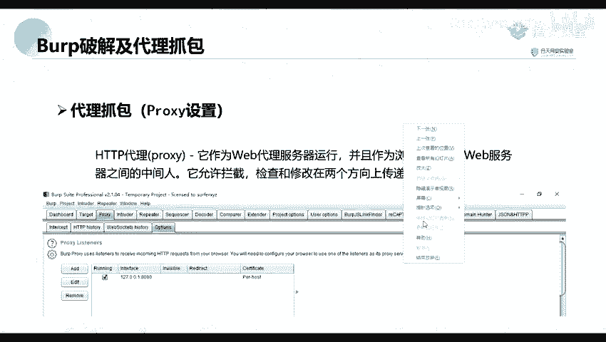

首先呢他是在他默认默认的话。你看一下。那默认的话呢，是他默认拦截就在这个。hellolo这个选项这里它默认呢是拦截我们的1个1271。0。0。1。要还有一个是8080端口，那就是。

他是拦截这个地址上面的8080端口的一个数据。所以呢我们就就需要进行对我们的一个浏览器进行一个设置。比如我这里呢。

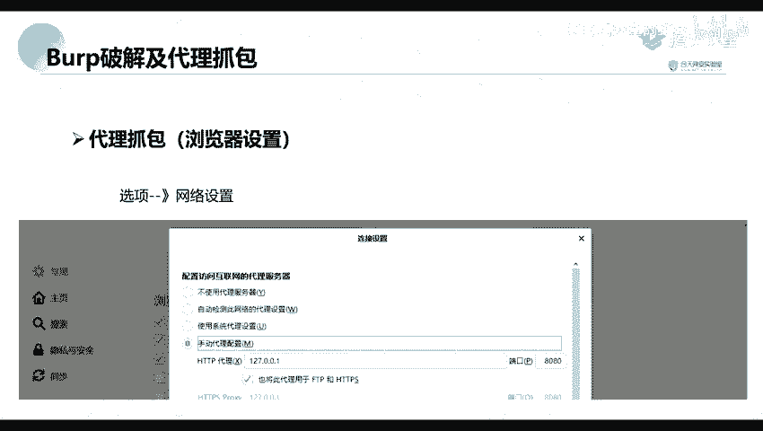

就是我这里呢是一个。一个微软的1个EBG这个浏览器。门一。

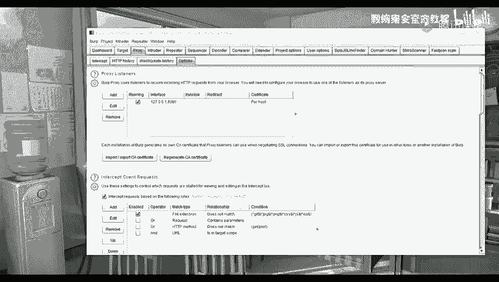

看你们的一个浏览器的不同来进行一个修改。比如说我这里呢是一个。这个浏览器，然后呢，我们点击这个这个设置。设置这里你要找到我们的一个。系统设置系统设置，因为我这里呢是使用了这一个一个工具进行一个管理的。

所以呢我们是打开之后就是进行进行一个设置。如果说是我们的一个火狐火狐的浏览器。

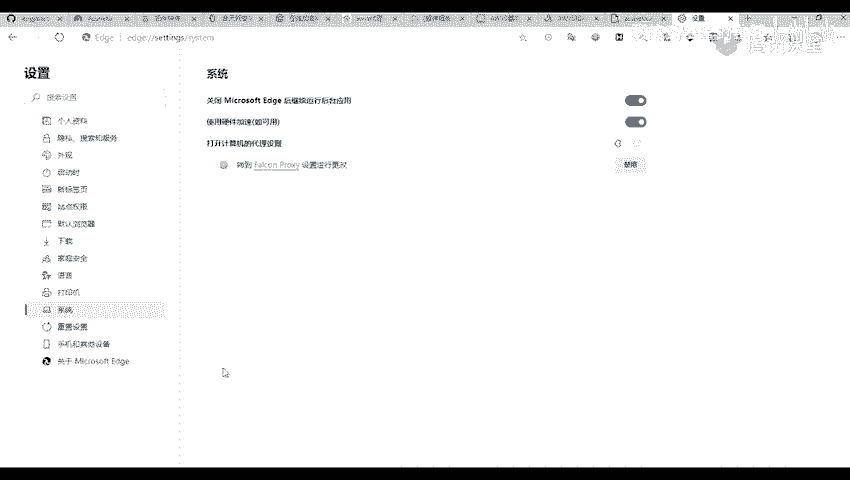

服务的浏览器呢就是点击我们的一个选项，你要找到我们的一个网络设置就是。拉到最下面找到这个网络设置。要修要将里面的一个配置访问互联网的一个代理服务器。他默认的话，他默认的话。

他可能是这个不不使用代理服务器，我们就我们这常就选择我们的一个手动代理配置。而配置的这个IP呢就是我们前面的1个127。0。0。1。我们配置可跟这一个一致的，就是这个bo switch。

它拦截的这个IP地址是配置成。

相同的。

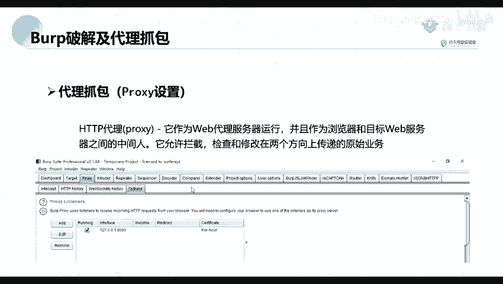

这端槽呢也是配置成相同的。然后我们将我们下面这个高高给高尚。包上了之后，我们就进可以进行一个抓包抓包。就比如说我们访问。

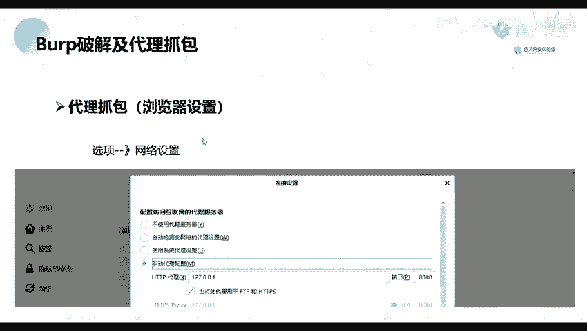

访问之后，我们就访问我们的，我们设置了代理之后，我们去访问。我们并且我们的这个box也打开了一个拦截，那么我们就可以进行一个抓报了。访问我我们的一个浏览器。

比如说我这里我这里呢我这里呢是待会会会给大家讲一个工具。就说我这里。

你个。我我这里呢开了一个代理人，然后呢，并且我们我打打开这个interect，这就是我们将它改为on on。然呢我们进行一个访问。有啊。本案之后，在这里呢。他就会将我们的的这个包进行抓取。

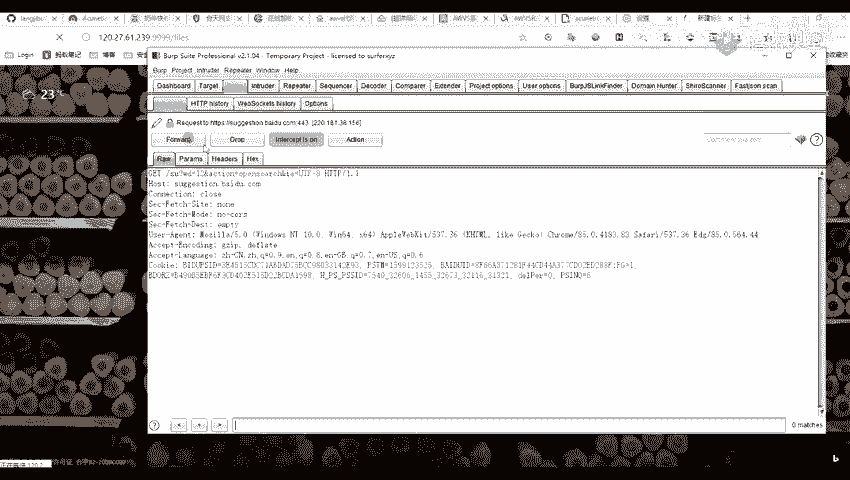

这个这个呢就是我们的一个包是跟我们这个访问的这一个包是一致的。哦，这工这插件好像其实都差不多的，你们可以就是搜索。我待会呢会给你们讲，我这里呢就先不讲了。那我们这里呢可以看到我们是已经抓到了这个包了。

而后我们就可以对这个包进行一个修改。比如说我们这可以这里呢也可以去修改返文成。访问是其他的一些DPAA地址或者是端口，或者是如果是他里后下面还有一些数据的话，我们也可以进行一个修改，这是一个包底。

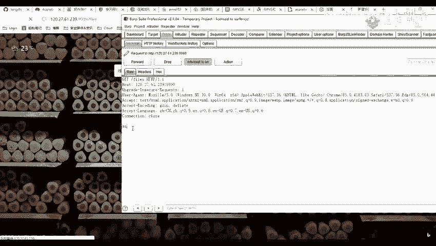

哦，我这里先加他发了。们先点这个PPT。Yeah。然呢。因为我们的这个bo switch，但是他他通常情况下，他只抓取我们的。呃我们的1个HTTP的一个包。

但不能说对我们的1个HTTPS的一个包进行抓取。所以呢我们这里呢就需要去安装一个证书。首先呢我们设置好代理之后，我们访问这个HDPPyour above这个地址。比说我这里设置。带你有 h p。嗯。

Oh。

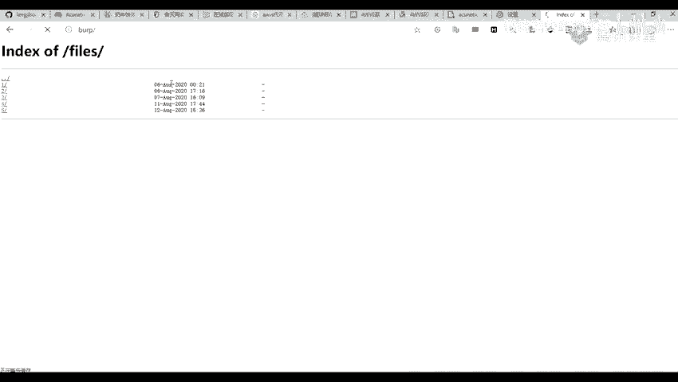

访访完之后呢，我们这里呢点击右上右右上角这个CA。即佢哋激系。就听别题。对。这个呢我们将它进行下载下来。再展下来呢，它是一个点点低压的一个后缀的一个格式的一个文件。我这里将它进行一个保存。

我觉得之后他是这样子的。

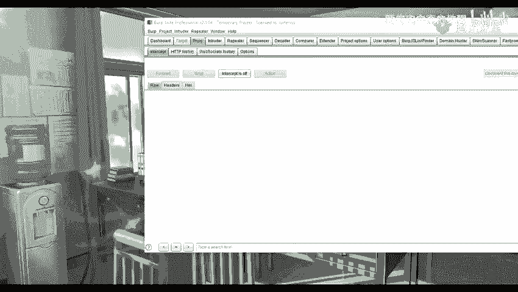

你找不到了。这我刚下载到哪里来？哦，在在这里。我这里呢已经。

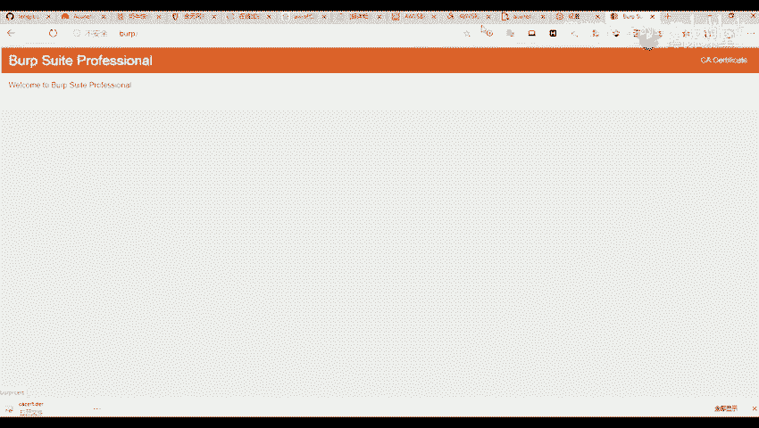

下载下来了，这个呢就下载了之后，我们可以看到它是这样子的一个证书。然后证书下载了证书之后，我们需要将它进行一个导入。我们这里呢以我们的一个这这一个火这个火狐浏览器为例。

现在我们打开这个那个证书设置那里就找到我们那个证书给管理器那里。我们在这个证书颁发机构去导入这一个证书，比如说或者是我们这个浏览器。看一下这里。测试。那我找到这个隐私搜索哦，这有一个。

那到我们这里呢也可以看到有一个管理证书，就是我们找到这个管理证书。这里，你们在其他浏览器呢可能是有点不同啊，其实也都差不多的。你找到这个管理证书这里，你找到这个。我看一下是哪一个。安8嗯。

Ot make。哦，的我们这里呢就是一个中间政府的一个颁发机构。这里。他就导入我我们的一个证书。嗯。对所有文件去进行一个导入。打开以后下一步我们就就进行一个下一步，下一步就好。投入了之后呢，他这里。

我们可以看到成功了导入之后，我们在可以在这个颁发者这里，或者是这个颁发给这里可以找到我们的那个证书。的一个地方，比如说这个呢就是一个portwe。嗯。我们可以看到他这个证书的一个颁发者是这个po。

就说明我们可以看看到这个之后，就说明我们已经导入成功了。因为我们这个工具这个这个bo three。top switch这个工具呢就是我们这个ho week这个公司进行一个开发的。导入了之后。

我们需要对我们的一个浏览器重启一下，就是关闭我们的浏览器，再重新进行打开。就可以了。要设设置了之后，我们就可以去对我们的的1个HTPPSS的一些站点进行抓取了。Okay。

但是呢我们就是每次去进行一个代说是代理的时候，我们是不是会就是很慢，就是很很复杂的这样子。这上我们就可以去找一些。这个工具就是帮我们去快捷一些快捷方式嘛，可以说。

比如说我们在我们的在我们的一个火狐浏览器里面找到我们的一个扩展扩展程序里面，然后去在扩展商店里面去进行搜索搜索这一个工具。也可以就是在我们的一些其他的一些浏览器里面去找这个扩展，就找到货展这里。

到扩展这里以后我们去找这个。

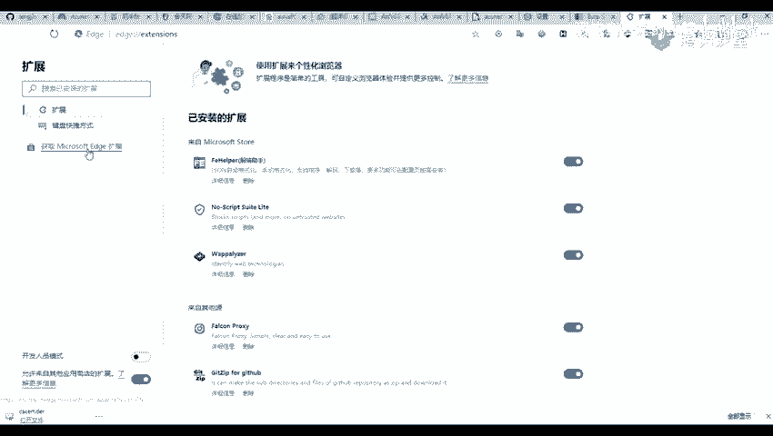

获取其他的一些扩展，要去搜索这个13Y，其实搜索这这个呢也差不多了。那里面的一些工具其实。

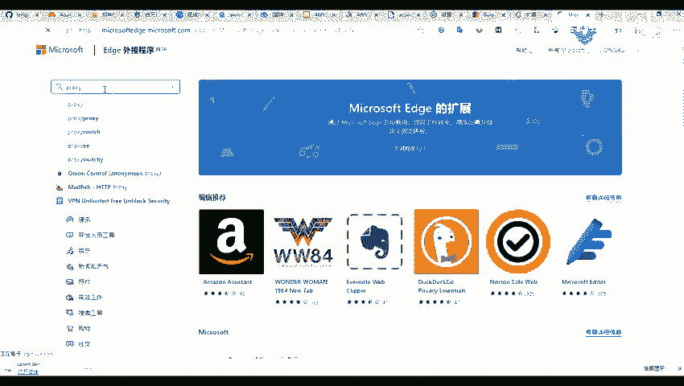

都差不多的。然后因为其他这些呢我也没用过，我我是用的是另外一个的，你们。待会要的话，我也可可以发给你们。不过呢你们要是可能导入我那一个的话，可能会进行一个出错。

现以呢你们可以在你们的一个浏览器上面去搜索这一个。搜索这个进行一个下载。那等下。就就就要进行一个设置。比如说我这个东西为你。我这里去然后去进行一个添加一个。添加一个就是我们这个代理类型的里呢是不用理的。

呃呃这个代理地址就是我们的1个127。点0。0。1，然后这个端口端口呢也就是我们的1个8080，就是跟我们在这个。就是设置成我们的这一个ho switch是一致的，就是这一个端口。8080。八零八零。

127。0。1。那么们我们这个lo host，我们将它进行一个删除的，删除掉之后，我们上线创建了之后，在这里有一个未命名设置。嗯，我这里呢就选择这一个。我们可以看到来进行一个抓包。

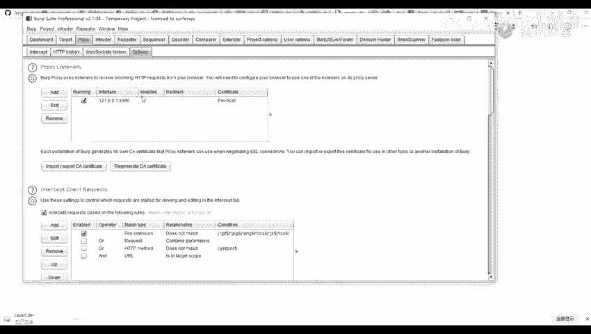