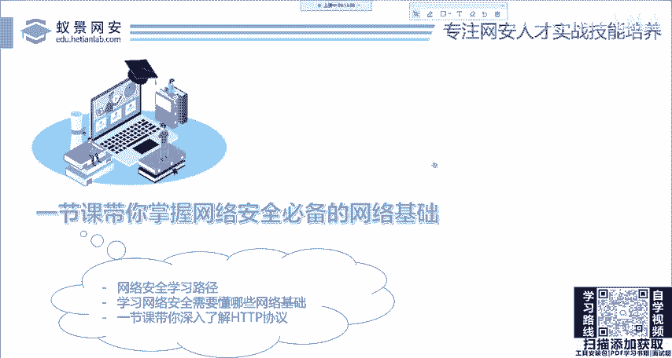
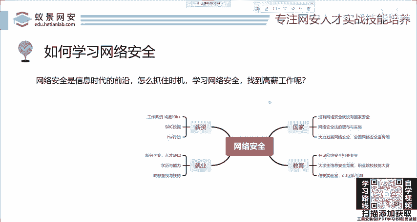
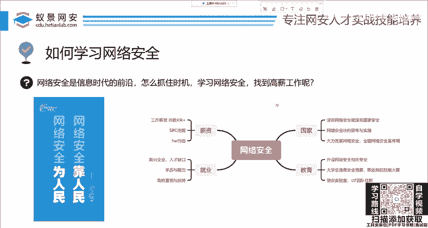
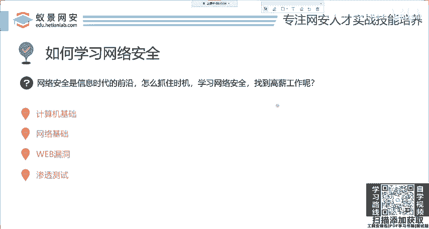
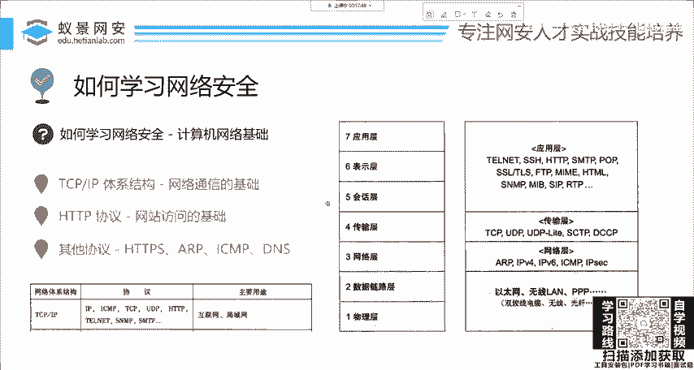

# 2024网络安全系统教程！清华大佬花159小时讲完的网络安全系统课！别再盲目自学了，学完即可就业！零基础入门网络安全！（渗透测试／漏洞挖掘／CTF／黑客技术） - P1：1.HTTP基础-计算机网络基础.mp4 - 教网络安全的红客 - BV1ft421A7Nj

那首先提醒大家一下，本节课是一个完全基础的内容。如果你没有任何的计算机基础，也不要有任何心理压力。那如果说你现在已经在从事网络安全相关工作了，已经入行了，那你也可以重复听一下。

那对你呢可能会有一些基础的这些帮助以及啊这些回顾啊，大家可以耐心的听一下。

那首先呢我们都知道，现在网络安全呢是站在了信息时代的前天啊，这个是非常的火。不论是大学里面的招聘还是各种CTF比赛，各种互网行动以及SRC的报酬。

都是非常丰厚而且吸引人的那很多同学呢就想去利用这个机会去学习网络安全。那怎么学习路路径啊，大家可能呢比如说去啊百度上去找啊，找到什么什么盗取什么账号呀等等，或者是什么黑客攻击啊。

那这些呢其实都是一个片面。就他只给你讲了一个点，没有告诉你怎么去一步一个脚印的把它去学会去找到这样一个合适的工作。那我们下面呢就来简单看一下，我就总结为4点，其实这四点呢是非常好理解的。

首先就是计算机技术啊，这是肯定的，你不论学习任何的IT你都要掌握这些计算机的相关原理。

就比如说像操作系统，这当然我说的是基础性的啊，并不是说你去考取这些研究生啊，去找的这些呃这些比较复杂的一些内容。然后呢是网络基础。这网络基础呢，就是我们今天要讲的内容。然后在学习完网络基础之后。

就可以进而学习一些网站漏洞以及渗透测试内网渗透的啊相关这个概念以及相关的技术啊，这些操作。OK那今天呢我们先来看网络技术。那这个网络基础啊，大家在大学里面都学习过计算机网络就是泄机人的那一本特别厚的书。

那这本书呢它是把整个的网络体系架构各种协议都描述的从原理方面描述的非常清楚。但是如果我们只是为了去学习网络安全，其实并不需要掌握那么多的。理论知识以及大部分的协议。

那这些协议呢在实际的工作中可以说啊几乎用不太到啊，用到的时候我们再去学也没有关系。那首先呢我们来看，对于这样一本厚厚的书，我们应该学习哪些内容。我总结呢就是一个体系结构，以及相关的协议。

那这个体系结构呢也是计算机网络中最为重要，也是大家耳熟能详的TCPIP体系结构。那这个结构呢是网络通信的基础。我们可以看到TCP的协议是位于这个网络的第四层，也就是传输层。那我们的IP呢是位于网络层。

那传输层和网络层，就是构成了我们网络通信的基础。如果没有这个结构，你想上个网这都行不通啊，上不了。

那这个TCPIP中也有一个非常重要的协议叫做HTTP。那HTTP呢是网站访问的技术。如果没有这个东西，你就没有办法去访问网站，那一会我们就来去探讨一下这个协议到底是什么东西。

有同学说到这里可能会问为什么我要花时间去学这些东西。首先你想一下，挖掘SRC挖掘这些漏洞。那大部分的漏洞是不是都是属于一个网站的漏洞啊，都属于一个网站的漏洞，对吧？那对于这个网站。

我们肯定要清楚它如何去访问。你如果都不清楚这样的原理，它怎么去访问，怎么去响应给你这些图片信息的那你就没有办法去下手去攻击啊，这些网站，这是肯定的。OK嗯然后呢就是其他的协议。

这大同小异HTPSSIRPICMPDNS等等这些协议啊，大家呢在后面都可以去了解一下。那我们今天就来去打通这个网络基础的思路，大家可以根据二一老师的脚步一步一步的。

