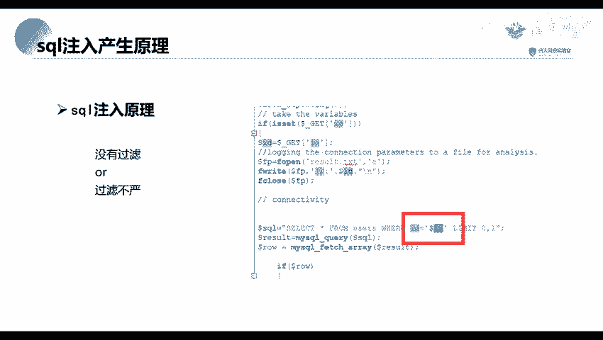
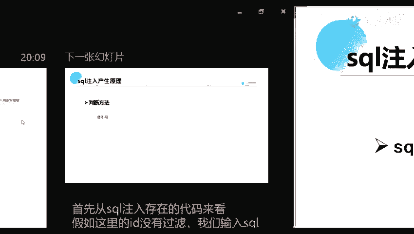
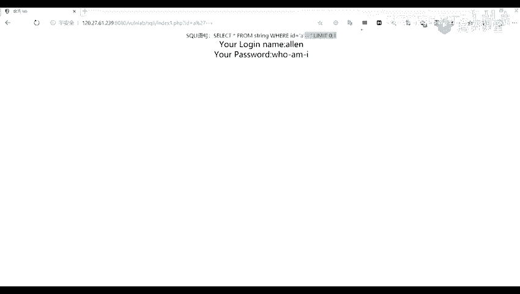

# 2024网络安全系统教程！清华大佬花159小时讲完的网络安全系统课！别再盲目自学了，学完即可就业！零基础入门网络安全！（渗透测试／漏洞挖掘／CTF／黑客技术） - P20：7.sql注入产生原理.mp4 - 教网络安全的红客 - BV1ft421A7Nj

我们今天的一个内容就是我们的一个输入程器，serv map。我们在讲这个车包麦搏之前呢，我们来先来看一下它的一个目录结构。就是第一部分。我们首先讲一下这个狮口注入的一个产生的原理。

第二部分呢就是一个搜后卖的的一个安介绍与安装。第三部分呢就是它的一个功能以及应用，就是如何去使用这个搜er卖粉对我们的一个漏洞进行一个注入。下面呢我我们先看一下第一个部分，这头这头就有的一个产生的原理。

首先呢，这个蛇头注入漏洞是从1998年圣诞节大火以来长盛复衰的，就是在那时候，就是在1998年就已经出现了这个漏洞了。然后到现在呢，我们还是能经常看到这一个蛇头注入的一个漏洞。那么那么是折口输入漏洞呢。

也就是说它的一个s口输入漏洞之间我们的一个C考语句，就是折le一个查询的语句，或者是其他的一个sle语句加入，或者是添加到我们的一个用户的一个输入的一个参数中的一个攻击。然后呢。

再将这些参数传递给后台的一个搜后服务器加以解析并执行。也就是说。可以将我们输入的一个数据，就输入的一个搜索语句去当成传递给后台的一个搜索服务器去执行。这个呢你们可能是有有一点点不懂，不过呢这个没关系。

待会你们就是。有就是我们实验室里，你们有有就是里面可以对这个漏洞，就是去进行一个逐期。下面呢我们来从代码。这方面我我们来看一下它的一个注入原理。肯定呢，他是由于从一个。由于是没有过滤。

也就是说我们输入的一个。只能将我们直接将我们输入的一个参数，或者说是一个语句直接进行一个执行的，或者说是一个过滤不严。也就是说我们可以对他进行一个要货。首先呢我们从。这图中的代码可以看到。

啊。当代。

我们从代码中可以看到。他对我们输入的一个ID并并没有进行一个严格的过滤，也就是这里的一个ID并没有进行任何的过滤。就是我们。通过一个get方法去。也算了，不放吧，你得那个。

他从我们就是我们通过一个get方法去获取我们1个ID。但是呢他并没有对我们获取到的这个ID里面的参数的值进行任何的过滤。那么我们就可以。3就是都有一些思考语据来。来进行一个。

查询查询我们想要查询的一个数据。这个能不能理解你们？这个可以理解吗？就是讲的这个srcle语句的一个输入的一个原理。这个你们就是你们学过这这一个搜cle语句的，现在。只过只过数据库的话。

应该是可以理解的。这是不能理解话，扣个2啊。哦，那没问题的话，那我们就继续了。因为我们这里呢更多的是一个两一个工具的使用。所以我们对他的一个并没有对他的一个其他的一些方面并没有进行深入的一个对。

首先呢我们判断的方法，我们可以看一下。我们对一般呢我们对这个是口就是。判断他是否存在一个思考注入漏洞。我们一般呢都使用一个单引号进行一个判断。比如说这里呢是之前的一个实例，就是一个例子是真实网站存在的。

我们正常的话，我们在这个name这里这个参数后面。三方面他是里。你算这个字符串就是经1个URL编码的一个字符串。我我们可以看到我们在正常的情况下，我们输入的时候，他他返回的这里是一个正常的一个内容。

对吧？然后呢，我们。我们插有一个大引号，就是我们可以看到在这里呢可以看到。我们这里呢是插入了一个单引号，然后呢，我们可以看到它后面这里。他返回包这里，他跟我们前面返回的一个内容是不一样的。

返回了不了不一样之后呢，我们来再来看一下，我们再再输入一个单引号。我们再输入一个单引号之后，我们可以看到在这里在这里呢输入了两个单引号。嗯。我们这里呢都有了两个单引号。原来他这里在这里返回的一个内容。

也就是跟我们前面明书单引号的时候是一样的。那么我们就可以说这里呢是存在一个注注入漏洞。啊比如说我找个网网站吧。比如说我们这里有一个，看一下，就。比如说我们这里呢有一个网站。

这个呢是我们用来进行一个练习的一个网站。我们这里有一个网站，我们在输入E的时候，他是给我们返回的一个是这个是一个正常的就是回填，对吧？就是给我们返回一个。正常的一个页面。

并且在我们这里呢它有的一个搜cle语地呢，也是相当于是这样子的，就是一个let有新 from users where IDD等于一where IDD等于一之后。他返回的一个内容是正常的。

但是呢如果说我们在这里加上一个单引号。那以后这里呢是不是就会。进行一个报错了。Oh。那为什么报错呢？我们可以看到我们这里风口语句这里。他这里是不是多了一个单引号，我们在输入一个单引号的时候。

在这里是不是多了一个单引号？在戴银浩这里。这是不是就会引起一个报错？这可以理解吗？好，然后呢我们。再输输入一个单引号的，是因为他这里多了一个单引号，对吧？那么我们。

那怎么将这个单引号给就是闭合掉或者是去掉呢？我们可以使用一个。这样子我们再说一一哦，好像不是这个，我看一下是不是这一个。一在凉了。哦，因为因为这个是一个因为这个是数字型的一个注意。

我们来看一下第二第二个的吧。我们来看一下，因为前面那个是数字型的。哦，因为我们这里呢。我们应该是这一个是这一关。嗯。我们我们这里。在查询一个A的时候，他这里呢是因为他我们注入的是一个字符字符串是。

它这里呢是一个字符型的一个注入。或者说是一个。制福形的一个搜索。哦，就是如果是数字型的话，数字型的话这个。语句我们我们在在这里新念一个嘛。这里举个例子啊。比如说我们如果是一个数字型的话，let。

天后六林。どそ。对啊。ID等于一。这个数字这种呢就是一个数字名的一个。看一下将对。嗯。好嗯。就这样子吧。那在数字型的的它的一个scle语句呢是这样子的，就是一个s新 user where IDD等于一。

它没有没有利用一个引号进行括起来的。但是呢如果说一个字符形的话。字不行的话，可能就是A，他就是里面里面的是一个。我们搜索的话，我们是搜索一个这样子的一个东西，就是ABCD以ABCD这些。

字母来进行一个开槽的。是我们字符形呢是用有有有引号进行引起来的，数字形的话就没有引号引起来。让他回回到我们这里回到我们这里。我们在输入一个A的时候，正常的一个查询的时候，他的一个思考语句是这样子的。

文娟这里，他他是这样子的。原来我们在这里。我们在这里再添加一个单引号，对吧？再添加单引号，这里它就会进行一个报错。为什么会报错呢？因为我们这里就相当于我们在这里输入一个按要再输入一个单引号。

它这里是不是就多了一个单引号？后了单以上是不是就会引起一个报错？要引起报错呢，我们。那么我们去怎么怎么将这个报错给，就是让他没不再进行一个报错呢？我们这里呢有有两个方法。

一个呢是我们可以将我们的这个语句，就这单引号给闭合，或者说我们再增加一个单引号。分加大以后，是不是我们就相当于是一个。成成为了两嗯两个部分的。这是第一部分是这这一个。比如说我们在这里。

被身份再一稍等一下，我看一下。他增加了一个单引号，被增加一个单引号，是不是说明有报错了？但是呢他。这里就没有，但是没有并没有查出一个数据。现在我们可以利用另外一个方法。

就是将我们后面的这一个部分的内容给注册掉。怎么注释呢？我们在思否语句中啊，我们有注释注释的一个方法呢，有可以使用一个点简加进行一个注释。他的什么意思呢？

也就是说我们将我们这仅仅张后面的一个内容给注册掉了，就是不起作用了。不起作用了之后，到这里呢，就相当于是成为这样子了，是不是我们就正常了呀？就是我们可以利用一个简简章。点检加或者是一个井号。

也就是或者是一个井号。一个数字。你们这里呢可以对一下。耳，7以点点加。我们注一个点点大了之后，是不是就就会我们这个语句就会正常执行了？这可以理解吗？简单来说，我们就是将我们的一个报错报错信息给注。

将后面的一个信息给注册掉就可以了。好，那要是没有疑问的话，我们就继续了。那么这里呢就简单的讲一下它的一个s索注入的一个原理，以及它的一个判断方法。

我就是一个拖布。