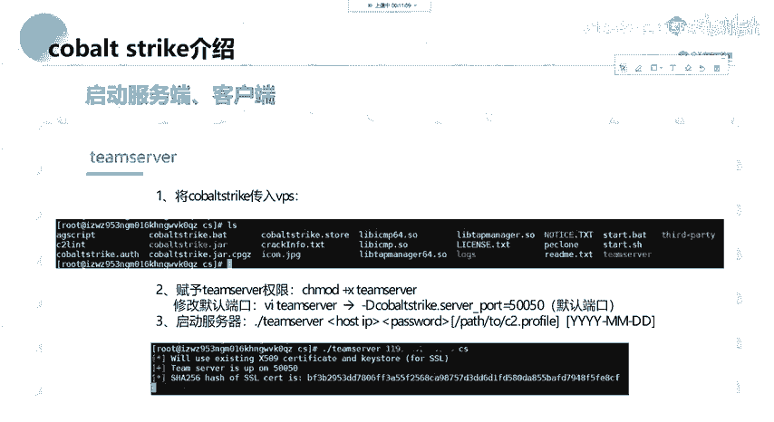
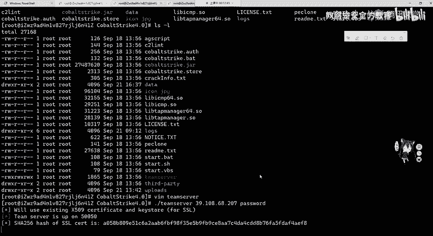
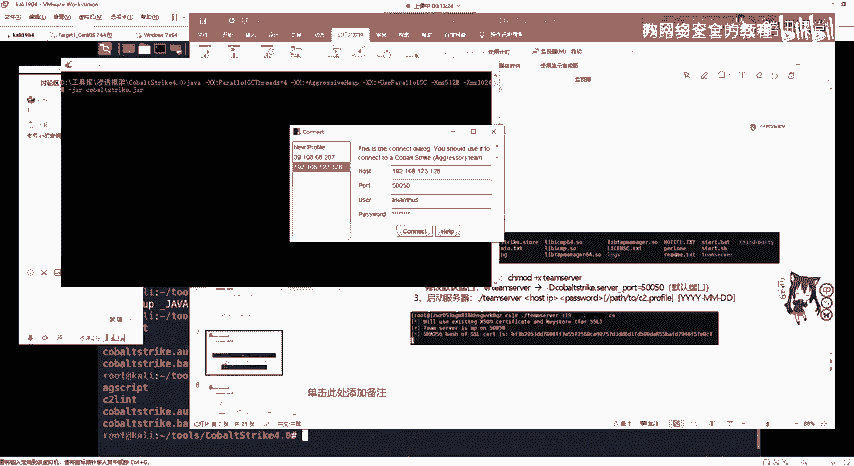
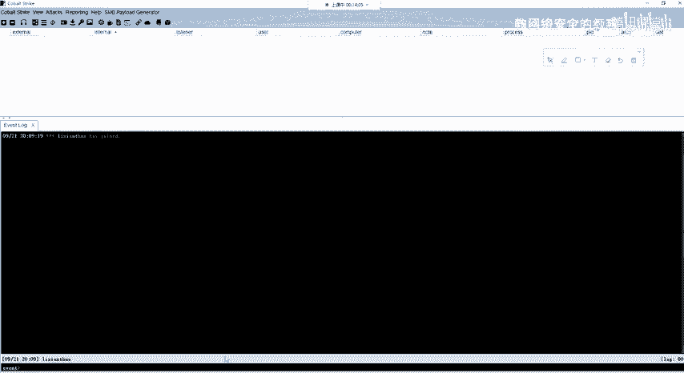
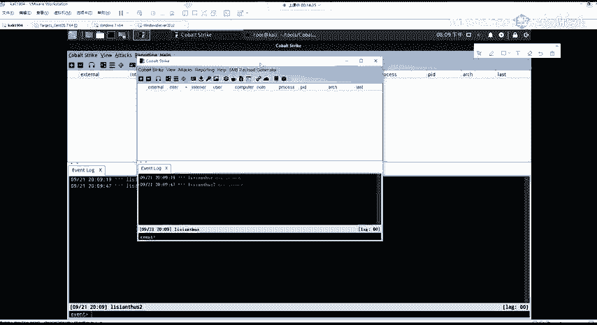
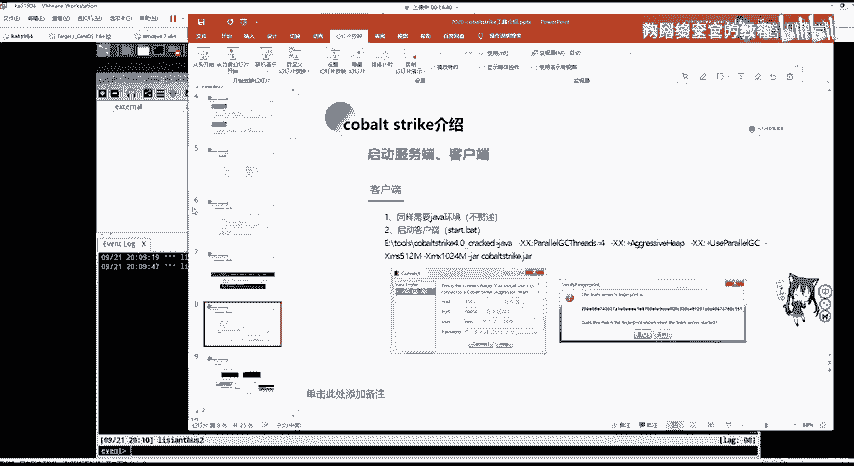
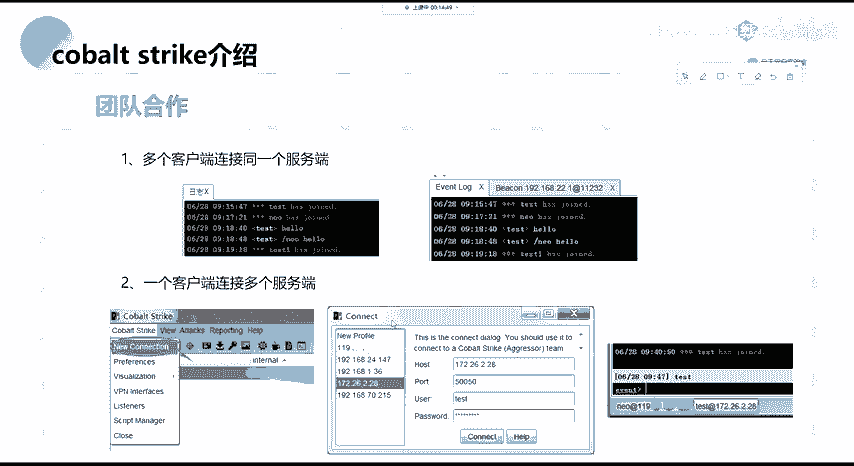
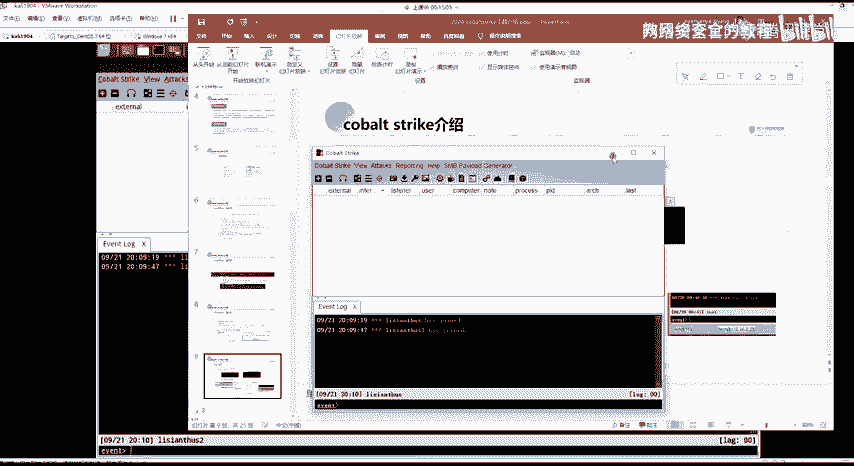
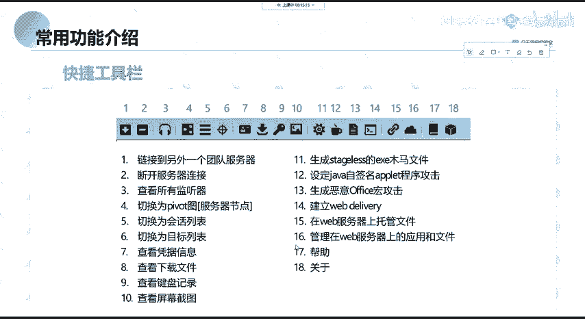
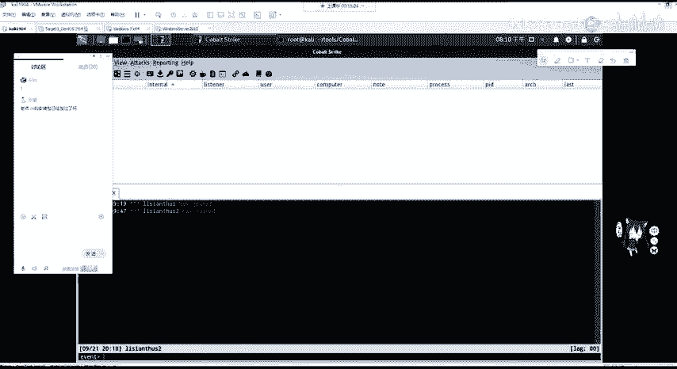

# 2024网络安全系统教程！清华大佬花159小时讲完的网络安全系统课！别再盲目自学了，学完即可就业！零基础入门网络安全！（渗透测试／漏洞挖掘／CTF／黑客技术） - P27：14.Cobaltstrike简介.mp4 - 教网络安全的红客 - BV1ft421A7Nj

那我们现在来开始讲。咁大。首先我们来看一下什么是co strike。第一节课我会给大家讲解cogo strict的简介，包括常用的功能，一些baing。然后讲croba strike的实战演示。

如何让靶机上线。首先我们来看什么是CSco strike简称CS是一款团队作战渗透测试神器。这个不是我们打的那个CS游戏，而是co是一个渗透测试神器，分为客户端及服务端。服务端可以对应多个客户端。

而一个客户端呢又可以连接多个服务端。CS集成了渗透测试中经常使用的端口转发扫描，包括多模式的端口监听windows可执行程序生成windows动态链接库生成java应用程序生成office红代码生成等。

同时也能帮助我们克容浏览器相关信息、克容钓鱼网站等。那cogle strike它经常在使用中和matta split进行联动，因为它们两个都是非常好的渗透测试框架。如果能将两者进行联动进行渗透测试。

那效率将会翻倍。那CS和matta split在以前也是有关系的那MSF我们在周五的课程已经讲过是一款开源的框架。mata split我们通常用的接口即为它的一个命令行接口MSF console。

MSF它也是具有图形化的界别方式的，就是阿myage。阿myage也就是CS的一个呃相相当于是它的一个呃早期版本。那CS呢就是阿age的一个增强版。同时它也收费。那CS2。

0还是在依托MS框架的阿itage，但是在3。0之后，这个CS已经单独出来使用了单独的平台。那这里我们用的是三之后的版本是CS4。0。首先我们还是像m split一样，看一下它的目录结构。

这个目录结构就是在工具包里面的co strike，你可以看到它的一个。目录结构将它直接移到我们的VPS上面就行。VPS就是公网上面的服务器。比如阿里云的轻量用服务器，ESC服务器都行。

或者是如果大家没有没有能力去在公公网中拥有VPS的话，可以将它拖中拖拖到卡利里面进行一个服务端运行。那我们首先看一下它的一个目录结构。啊，这IOS就能看到，那这里就直接用PPT来看了。

首先是CS的拓展应用脚本。我们CS支支持插件和脚本的一个拓展，是点CNI结结尾的，我们可以拓展一些模块。

下面C to learn是用于检查profi错误异常team server服务端程序co strike点GIR包。

这个是客户端程序ros是日志文件up是用于更新co strikeshirt party是this三方工具的一个应用级。co的服务服务端只能运行在linux操作系统，并且需要安装java环境。

如果是使用卡利的话，java是已经安装好的。如果是大家自己购买的VPS服务器，java并没有安装。可以大家可以通过we get下载下载之后进行编译安装，并且配置环境变量。

这在第一节课环境的安装与准备已经讲过，如果大家的VPS是to这里也推荐大家使用三to，因为3al的样么是十分的好用。那y去安装JDK只需要去输入yinstore杠Y是指默认选择yes。

因为在安装的过程中会有很多选项，需要我们选择。那我们去安装加88星号会匹配加va8的一些包，你去选择相应的。比如64位的三to，可以选择IMD64版本进行安装。在用亚么安装好之后。

环境变量就不需要我们再配置。因为亚么源的包里面已经帮我们配置好了。嗯。在服务器上运行及把加va装好之后，把cope strike整个文件夹都移到。公网的服务器上面。

并且给team server这个文件的服务端去设置可执行权限。我们去查看te server实际是一个dsh脚本，我们可以偷改修改。CS的默认监听端口，它的默认端口是50050，我们可以进行修改。

来这里给大家看一下。

OK在这个里面我已经装了这个co，那么I一下，需要去给一个team server复值可执行权限，可以使用CHMD777。设置所有。用户可读可写可执行，也可以使用加X给所有用户添加可执行权限。

加上team server的相对路径。我们去VIM查看题目 server，会发现是一个冰袋子的脚本。在下面我们可以配置它的一个默认端口。这里退出。打开启动我们的服务端，非常简单。

只需要把team server运行，加上我们公网的IP地址。如果你是在carly里面安装的co strike，就加上carly的网卡地址即可。那这里我添加公网的一个地址。

第二个参数是我们te server的密码，我们可以把它设置为任意。比如我这里就设置了password。这个时候服务端会运行在50050端口。

那客户端就非常简单了。客户端我们可以在本地直接的进行打开。在co strike。0文件夹里面，已经配置好了点be文件和点SH脚本。

分别对应我们windows操作系统的打开co strike和limux操作系统的打开co strike。那这里我就以windows操作系统为例。啊，这里我已经创建了快捷方式。

在桌面上或者是双击这一个点bedad都可以。

在打开客户端之后，这里会让我们输入host，也就是服务器的IP地址，加上服务器的端口默认。如果没有修改的话，是50050user用户名，这里是随意修改。因为它支持多个客户端去连接服务端。

password输入我们在服务端中设置的密码，即为password，点击connect连接。

这时候我们就会连接到服务器。

因为他只是多用户，我们在他利里面也可以把客户端给开启，是使用我们的start点SH。开启之后，我们一样user自己设置。进行连接。在windows操作系统的一个。显示可以看到两个用户都已经连接过来了。

这就是一个客户端去连接服务端。

这里也已经讲过了，如果一个客户端想要连连接多个服务端的话，也非常简单。直接在上拉菜单下点CS，然后new connection就可以去连接其他的服服务端。

那我们接下来来看co strike的常用功能。首先是查看CS的快捷工具栏。快捷工具栏这分别是分为。

五大类，我们来看一下他们分别代表什么。

