# 2024网络安全系统教程！清华大佬花159小时讲完的网络安全系统课！别再盲目自学了，学完即可就业！零基础入门网络安全！（渗透测试／漏洞挖掘／CTF／黑客技术） - P28：15.Cobaltstrike常用功能.mp4 - 教网络安全的红客 - BV1ft421A7Nj

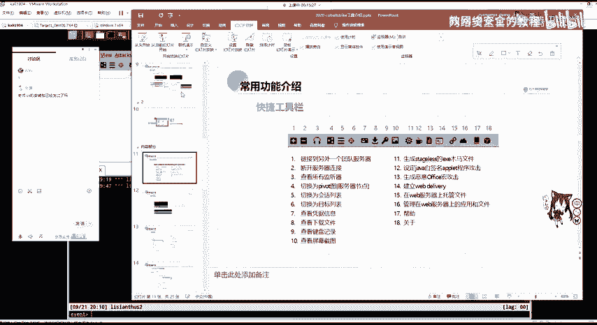

首先，一和二代表连接到团队服务器或者断开当前服务器链链接。3、代表查看所有的监听器。我们需要创建监听器，才可以让靶机上线，去连接我们公网服务端上去开启的真监听端口。大家要知道，我们做任何的操作。

都是通过服务器的IP地址去连接靶机去和靶机进行文件tage的一个传输和交互。所以这里大家推荐是把CS放到公网上面，是会比较方便让法机上线。4到6分别是CS的三个视图，分别是。

服务器节点视图绘画列表、目标列表。七和十分别是查看已获得的凭据信息。查看。下载文件，查看键盘记录，查看屏幕截图。11是生成stag list的ESE木马文件。

大家还记得stagage list是什么意思吗？piload分为tage stage和tage stageage。t list相当于PIP的大码，它是拥有拥有所有的功能，包括mate operator。

它的非常的大，我们不需要其他的管理器，就可以对sageless进行完全的交互。在网境在网络环境比较差的时候，可以考虑使用它非常大，并且容易查杀，并且容易被查杀。第1二是设定加发4签名的程序攻击。

这个已经淘汰了。我们这里不讲。1三是生成恶意的office红攻击。在。microsoft office里面可以设置红，那这个红实际上就是一个脚本代码，我们可以通过嵌入恶意红攻击进行让靶机上线。

14、建立we delivery。这个web delivery大家应该还都记得吧，是在嗯加载到内存中去执行恶意代码。是不会在服务器上进行留下文件的。第十五是在web服务器上托管文件。

16是管理web服务器上托管的应用或者文件。17和18分别是帮助和关于那么快捷工具栏就介绍到这里，大家不需要去死记，因为我们在用到的时候多点两下就OK了。所以渗透测试关键一定要动手操作。

这里我再给大家提一个性，自己去听课和动手操作完全是两个是。

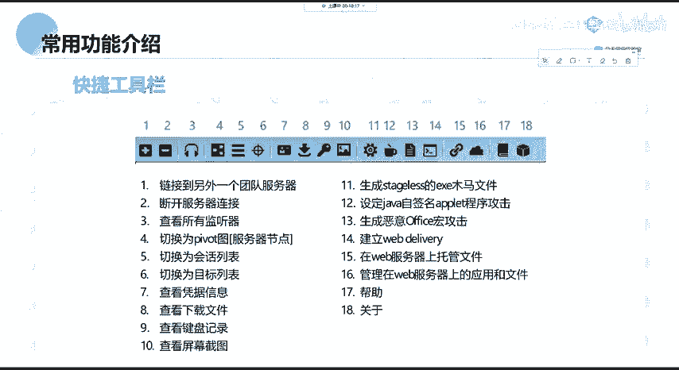

有可能自己听的非常清楚。如果这这三个月的课程你全部听下来，但是没有操作，你会觉得你都懂了。但是当你听完最后一节课，面试官就让你操作，给你一个把机，让你去测试的时候，你肯定一无所措，甚至team。

不是这个team server都没有办法启动。OK那我们。一定要操作。首先我们可以进行一个用户通信，用户通通信通信很简单，直接在这可以输，比如hello。

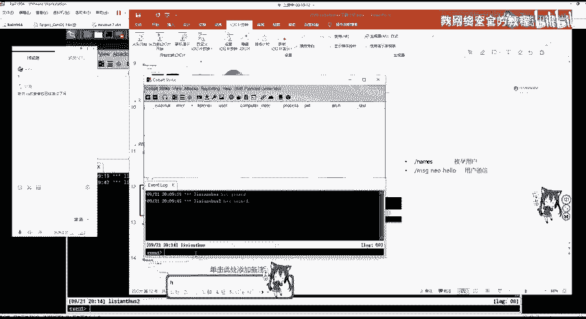

OK这两个客户端都会收到一个。聊天相当于聊天，当然也可以进行司法啊，比如MM。杠MSG然后指定我们要发的1个ID。然，给他私发个消息。啊，这我发给自己了。OK他会收到这个发的消息。

那大家如果想连接我的这个呃服务端的话，也这个IP的是。

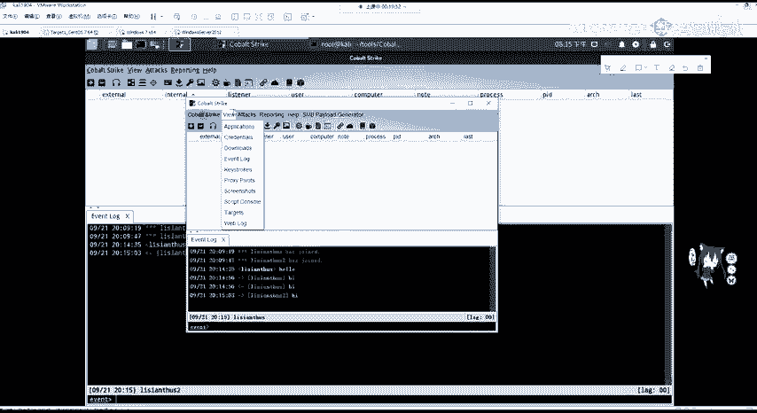

大家如果想看这个靶机上线的过程，可以登到这个服务器上面。OK服务器IP就是这个。然后密码是怕错的，大家应该在讲课的时候都听到了。

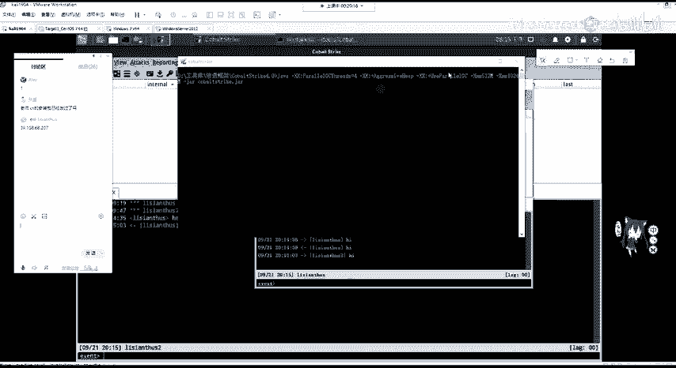

常用的功能，我们首先对CS的一切操作都要创建监听器，也就是listener，没有listener，我们做不了任何事情。那这里大家看别的教程。这个lister3。0和4。0是不一样的那我们这里来4。

0来讲一下。在co下拉菜单里面可以点击lister这会来到我们的这个窗口，当然这里我们没有进行创建，可以点击艾进行创建lister创建lister的时候，它会让我们输入listener的一个名称。

我们可以随便输比如demo关。下面让我们选择pilo分别是backon， baconck叫做洋葱，也就是自带的一个。拍lo的还有外部。

HT外部load我们这里先讲beckbeckconDNS是通过DNS记录HTTP那这里我就不多讲了，是HTTP协议HTSSMBTCP我们可以正常情况下可以创建HTTP。嗯，大家在3。0的话。

有可能还会看到其他的，当家都差不多。嗯。在选择相应的pilo之后，我们需要对plo options，需要对piload进行设置。首先设置HTP后，就是它的一个地址，这里设置为我们服务器的一个地址。

HTPho host这个tggger这个和这个有什么区别？它是用来发送tgggertggger是什么？是用于获取靶机上限执行命令的一个呃传输。那这里我们是由服务端。

对任何靶机的操作这个流量都是通过服务端发送的。所以这里我们把它设置为服务端的一个。IP地址下面我们需要设定监听的端口。那这里不推荐大家使用80。因为如果服务器开启了阿帕奇服务的话。

你这样他会告诉你80端口已经占用了。那我们可以给他一个高一点的端口，比如8080。可以在。startudy listener这一个监听器已经开启。

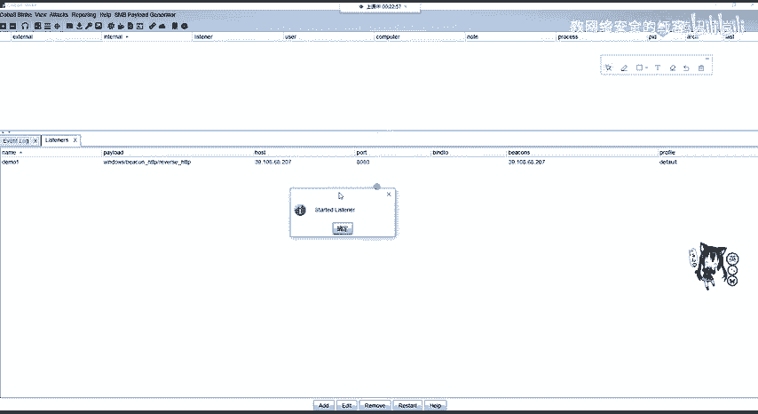

已经开启。那我们可以来到服务器上面。

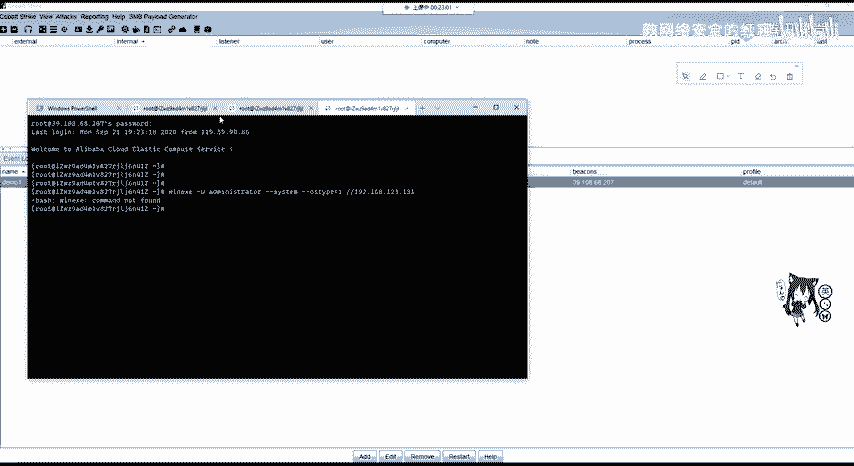

来到这个服务器上面去查看8080有没有才减轻求NETSDITINLTUP啊。

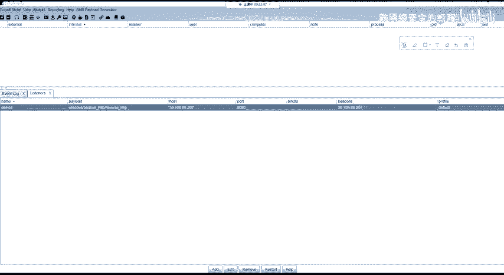

这个可以看到8080已经开启了监听，正在等待连接。那我们如何让靶机上线呢？现在先不急来看创建监听器。

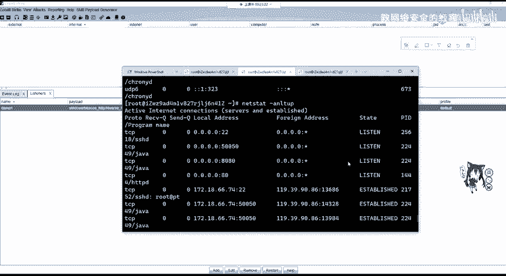

创监信器之后，想让靶机上线，很显然就是攻击靶机att。那att有哪些功能供我们使用呢？att在哪？哎，上面的这一个。有 packages。weber drive by我们分别来看一下。

腾讯云安全组在你如果是ESECS那个服务器的话，在嗯它默认是出端口全全开的，你是入端口，你去配置嘛，配置0。0。0，然后嗯就是全部放出嘛。就是不会配端口的话，就把端口全放我是这样的。不用重启不用重启。

不用充庆的。啊。是的。那我们继续去看这个atts里面有什么东西。首先，packages。ches里里面大家有可能下载的这个CS是汉化版，汉化版，我觉得有可能还没有这个讲的清楚。

因为它汉化的有些语言特别的怪。那我们首先来看HTM application很显然是HTML应用程序，是生成一个点HTI文件。在服务在靶机上执行这个HTI文件就会上线到我们的CS服务器。

还有MSoffice是生成恶意的红放入office文件。pilo的生成器可以生成各种语言版本的拍load。windows可执行文件可以生成可执行文件，默认为32位叉86。

可以勾选64位的windows可执行文件杠S，那这杠S和前面一个可执行文件有什么区别。那这个I带大S的也就是生成s list，这个相当于web里面的大码，也就是生成全功能被控端生成全功能的一个木马？

下面weever drive by。web状这里可以进行manage进行一个管理，可以管理当前服务器开启的所有web服务。哎，这都是简单的一个翻译。下面。

克隆网站可以克隆网站克隆钓鱼网站hostify可以在服务器的某一个端口提供web进行下载下载某个文件。也就是我们可以利用这个东西把文件传给我们的把机。Scre web delivery。

是可以为拍lo的提供web服务，便于下载和执讯。那这里就比较像MSF里面的explode MUFTYTI加上screen web delivery是一样的这个。这个模块。

接下来的两个是自签名的java日期环境都已经淘汰。我们这里不讲。system profile是用来获取系统的信息，包括系统的版本、浏览器版本、flash版本等。最后一个是由差钓有的监控的。

这里我们也不讲这些。大家可以作为一个拓展去百度搜索来了解一下。我们来看如何让法题上线。这里我只举一个例子来讲，因为是差不多的。at text package生成HTML应用程序。

我们需要选择一个需要选择。监听器选择刚刚开启的8080端口监听器，并且选择执行方法是生成可执行文件，还是power share，还是VB的一个脚本语言。那这里我选择power share。是选择生成。

他会让你选择一个路径，保存HTR文件。这里我保存在桌面上。嗯。保存在桌面之后，我们需要开启一个端口，共把机下载这个文件。那如何开启呢？使用web drive by点击hot file是开启端口。

那这里选择我们的一个刚刚生成的这个HTI文件。然后这里logo host已经帮我们设置好了，这里还是不推荐使用80端口，因为很容易被占用。那我们这里使用9090。点击生成。它会生成一个hos file。

然后把它复制过来，然后再把机里面。这里的靶机是我使用的是win764位的操作系统。他的IP地址是。192。168。123。131。那这时候我们可以使用。MSHTI这个文件去运行。

去运行我们复制过来的这个文件，也就在9090端口去开放的那我们把它运行起来。它运行起来。这时我们等待一下，就发现。法机上线了。好，在这里。是不是10。10。128，因为我开启了一个内网的端口是。

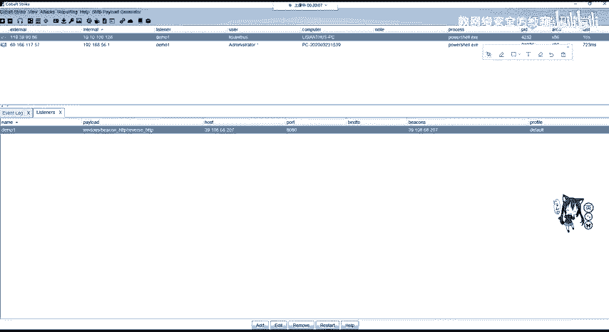

网卡是10。10。100。128，那他就上线了。大家如果连到了我的服务器。应该能看到他上线了啊，能看到他上线了。

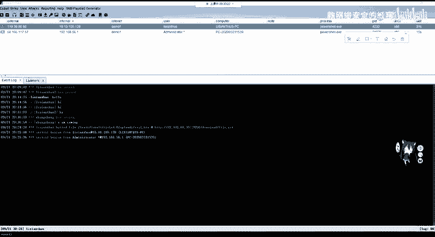

这怎么还上线一个呀？这是谁的机器啊？这个是。嗯。这这随着继续上线了啊，OK那我不碰你的。那我们上线之后，我们可以做很多操作，interact开启交互access权限，还有一些设置。

包括呃转移和session的一个控制。会把它退出。

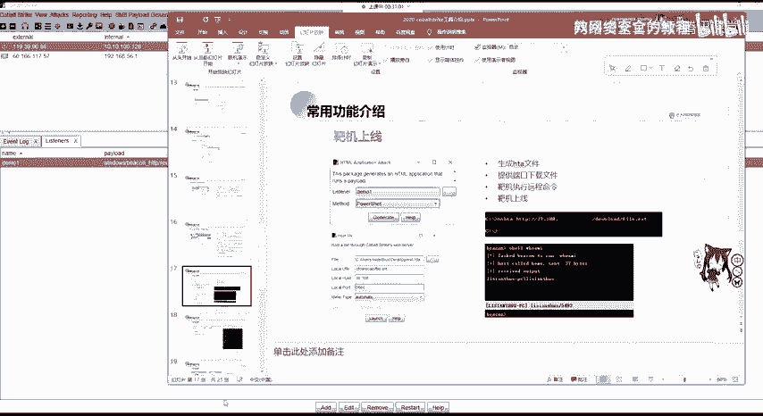

那这个时候靶机就上线了，靶机上线之后，我们可以点interact开启交互啊，开启交互。嗯。

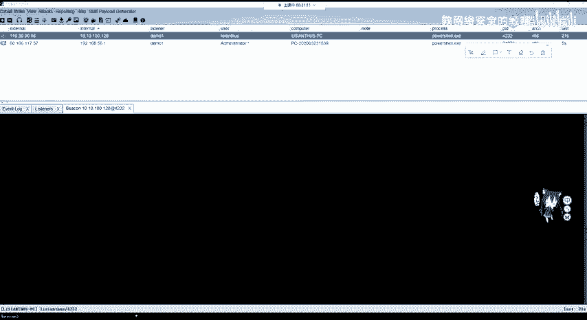

小伙呢，这里我放。

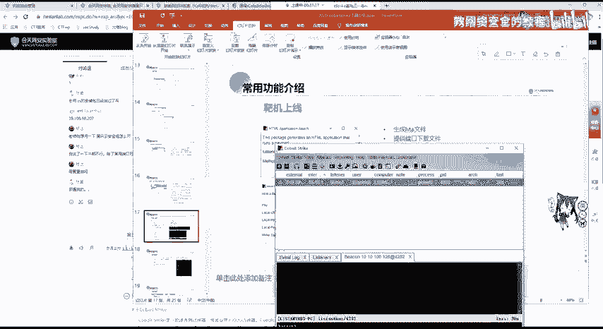

嗯。开始交互，可以在这里输入shall。Who am I。shall是指执行shall命令，后面加上我们的CMD命令即可。那这里因为他设置的心跳是60秒，也就是。它为了避免流量的特征设置60秒的间隔。

那我们可以修改它的一个间隔，可以在右键点击sessions sleep去设置，也可以使用命令。呃，看这里是非常慢，它回旋给我们的这个。嗯，用户名，那我们可以sleep。把它设置为2。

你需要在后台里面把这个进程给关掉，就是你的power share，不然的话，你在这里退出了，它还是才会上线的。还是会上线的。这里是比较慢的那我们先继续讲。

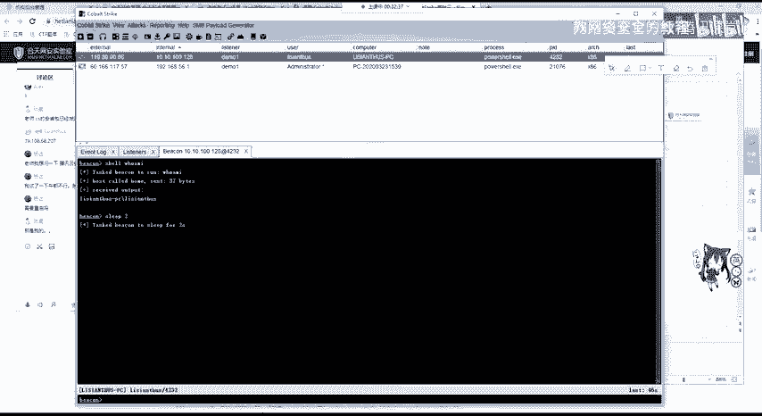

那当我们的靶机。被出现了被控端就会出现在主机列表，选中要操作的目标主机，右键interact可以进入交互命令界面。这个时候我们可以使用back and command对靶机进行各种操作。

我们一般拿到这个靶机上线的靶机之后，首先就是要对sep进行修改。当然，在真正的测试过程中，你也可以不修改，因为sleep二很容易被IDS查杀。

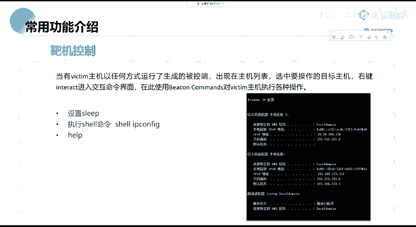

之后我们就可以输入shall加上CMD命令进行命令执行。

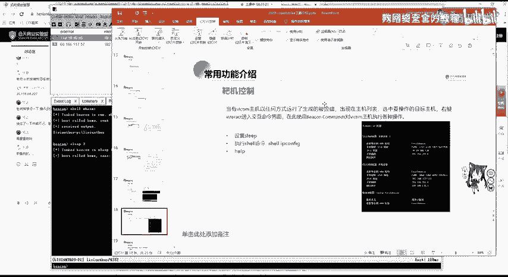

那这个时候sleep嗯两秒已经设置好了，我们再去执行命令。比IRP卡fi。好，他就非常快，可以看到我们的网卡131和128。当然还可以执行其他的命令，可以输入help，可以查看我们可以执行的一些命令。

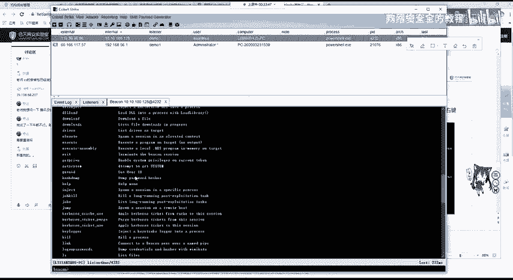

包括呃upload可以上传文件，可以开启代理，可以查看注册表，也可以进行截图。

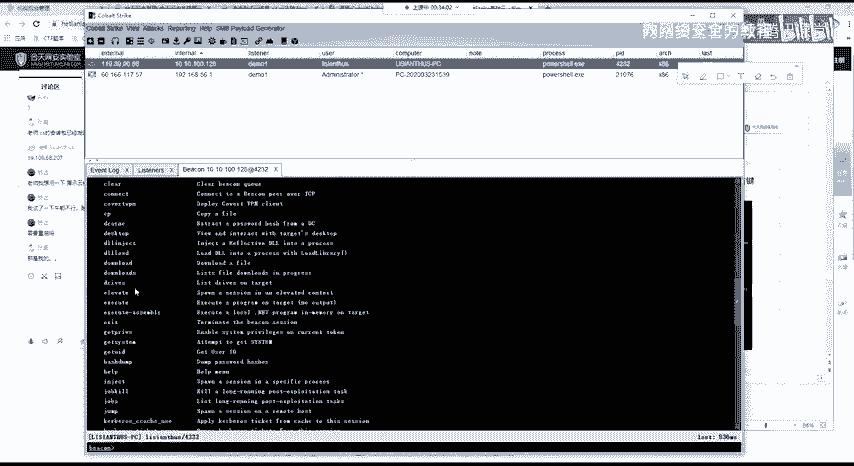

我们分别来看一下，当我们拿到了一个靶机之后，我们可以看到它的提权和显示这个模块中分别有几个重要的，分别是提权，还有转移运行咪卡 test。这个是一个密码，从内存中获取密码的一个呃脚本。

到时候后面都会讲开启VNC，也就是远程链接。当然这里VNC大家是不建议开启的，因为我们的。内网的机器去把VNC3389端口去映射到公网上面。你VPS服务器的带宽一般是非常小的，除非你是土豪打带宽特别大。

用特别小的带宽去看VNC的一个转发就特别的卡。然下面呢还有文件浏览器。包括端口扫描进程列表和屏幕截图啊，这里给大家稍微看一下吧。

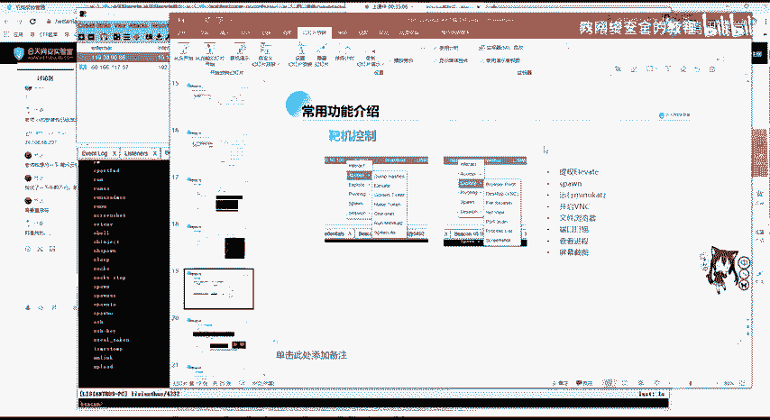

可以对它进行一个嗯屏幕截图。在屏幕截图之后，我们可以在vio视图界面去查看screen shots这个屏幕截图。

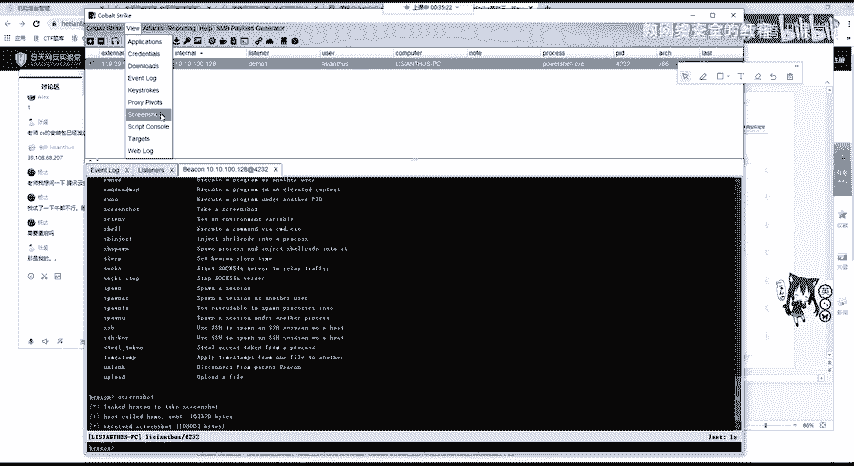

OK我们点击是不是把那个把机的桌面给截了一下呀，截了一下。那它也可以做哎端口扫描端口扫描。也可以就是查看进程，这是靶机上运行的进程。嗯。可以进行。文件的管理啊文件的管理。这里就大家应该都清楚。

那同样也可以进行一个端口扫描，在点击端口扫描之后，它会自动识别我们靶机的两个网卡所对应的IP的C段。可以看到我是有两个网卡分别是10。10。100网段的和192。168。

123网段的那这个时候我们可以选择一个内网网段进行一个扫描。因为我们还想探测内网中是是否有其他的一些机器，可以进行一个扫描。那这里它因为特别慢，就不给大家去等待了。

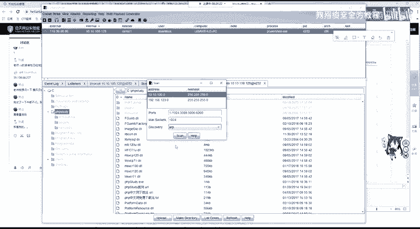

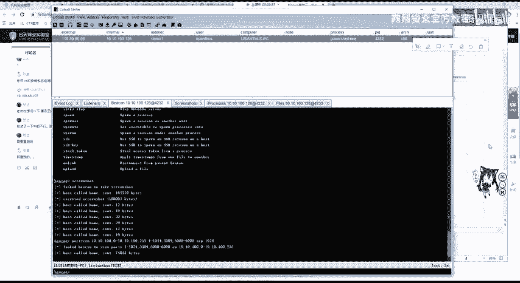

同样我们可以使用其他的监听器或者是attack进行一个主题上线。

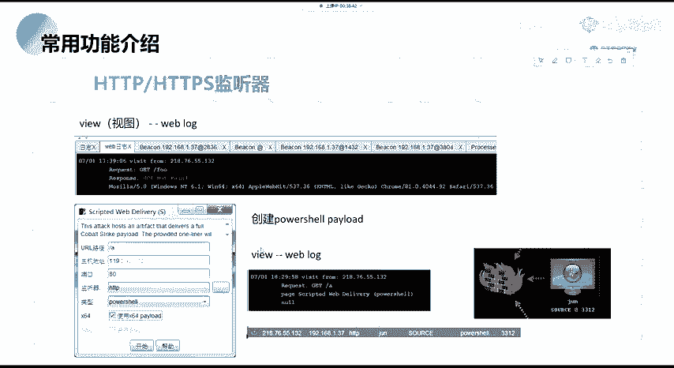

这个号。比如使用。我们的。scr web delivery在这里同样也需要开启端口，因为9090我们已经占用了，这里我设置9091，它也需要去设置我们的pload，也就是监听器。

我们所有的操作都是以监听器，也就是CS服务端上面的一个端口进行操作，发送tage或其他的命令。下面同样也是选择bes amin是windows操作系统自带的下载程序和power sharepyython。

大家应该都很清楚吧。那这里如果是powerow share进行生成的话，它就会生成这个命令，那我们在把机的运行里面去运行这条命令就会拿到同样的效果，让把机上线。那如何删除我们开启的这些东西呢？可以点击。

这个叫。manage web server或者是atack web drive by manage来到的都是同一个页面。

这里就可以看到我们开启的9091端口那一个power shellweb delivery的一个下载一个远程端口和HTIHTMLap的9090端口。

那在这里下面我们可以点击copy uIL进行一个copy过来啊，这里可以copy过来啊，直接copy过来。啊，这边如果你没在设置的时候没有copy，就点这里就可以copy过来了。

然后我们如果想关掉它的话，直接点下面的Q就把它给关掉了。OK那这里我就讲到这里。

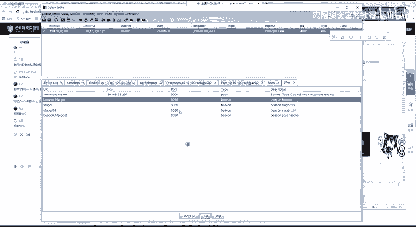

那我们可以在下面看到这一个端口已经扫描完成，在扫描完成之后，我们可以在view上面进行切换视图，或者直接使用我们三个这个命令，分别是show sessions和show table view。

和taets will。首先我们可以看到这一个一个逻辑视图。

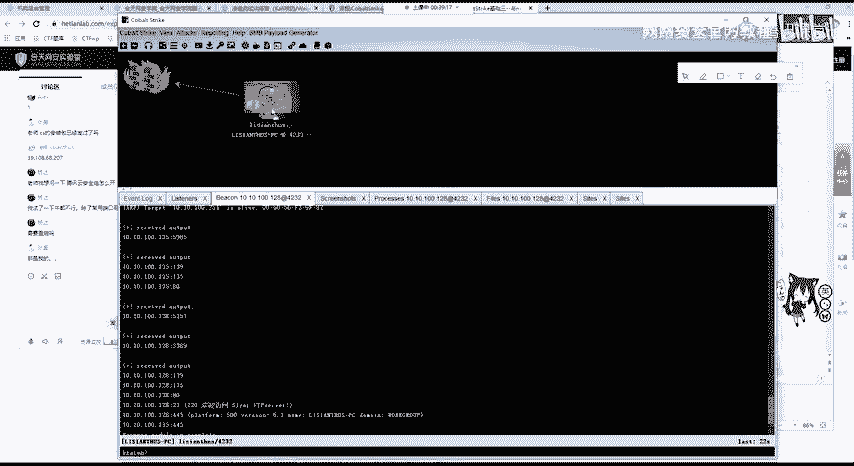

第二个是我们靶机上线的目标，第三个是tars。可以看到他发现了啊，这个是刚刚同学的这个机器啊。可以看到这个129，也就是我们上线的这个机器，它所在的IP地址，还有129，它这个在的内网地址。

还有1个135。那135是哪一个机器呢？就是我搭建的这个windows server2012。

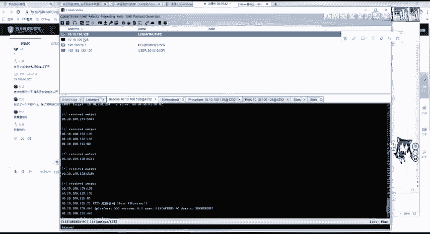

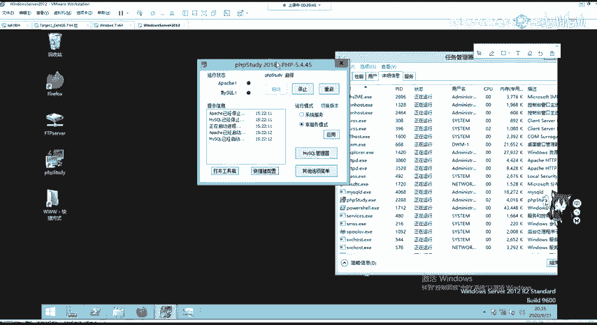

它是不通外网的，它是不通外网的，它是内网的一个服务器。

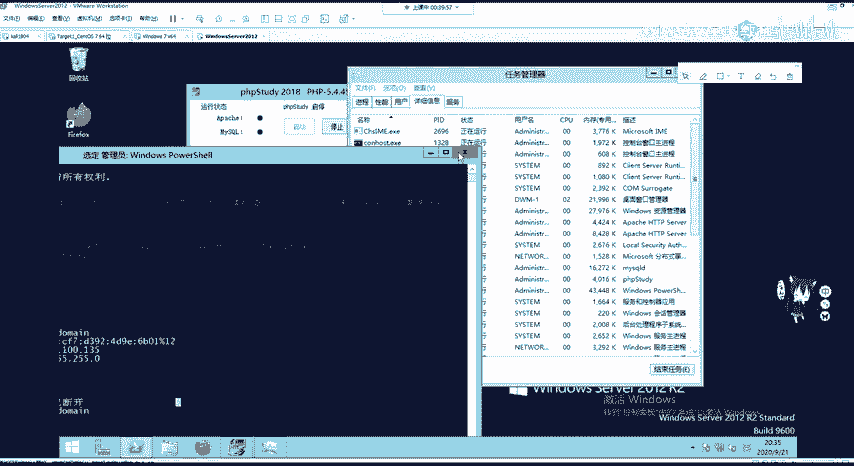

那我们同时也可以把它扫出来。把它扫出来。那我们可以。在tets的这个结果中，去右键点击siceservice查看服务，可以查看，开启了8013445。我们可以考虑是否有嗯MS17020或者是其他的漏洞。

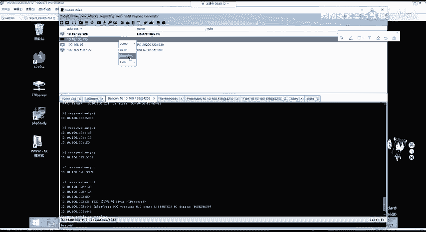

那这里嗯给大家就讲到这儿。那也没什么啊，可以就是进行一个后渗透模块嘛。这里想给大家进行一个概括，完是呃要花很长时间，就像已键和冰线一样，它有很多功能，大家可以摸索着自己去玩，又不会把它玩坏。

当然你不要拿真正的机器去去搞这个东西。如果没有授权的话，千万不要动用mat split和copo这两个渗透测试框架。因为它是渗透测试框架，它里面有很多集成的工具会不停的发包和留后门或者是改写注册表。

你对未授权的机器进行了修改增删改查，这个有可能会违反网络安全法。这个你需要动用他们两个渗透测试框架，就是在工作的时候被授权渗做渗透测试在用。OK那我们可以使用监听器进行1个445网段，或者是。

指定一个端口，或者是对一个网段进行扫描。在一开始就给大家讲CS支持扩展端拓展关端口。支持拓展这个脚本。那它脚本大家可以去get up上面进行一个搜索，啊特别非常简单安装它。

那就直接使用我们的co strike，然后s脚本manage脚本管理，然后点击load加载，还有onload取消加载reload重新加载load，然后选择我们的一个CNI的一个路径啊。

这里我会到时候会发给大家一个。大家如果没有的话。

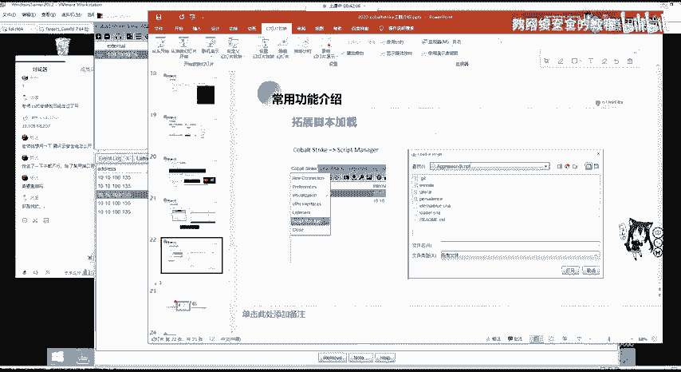

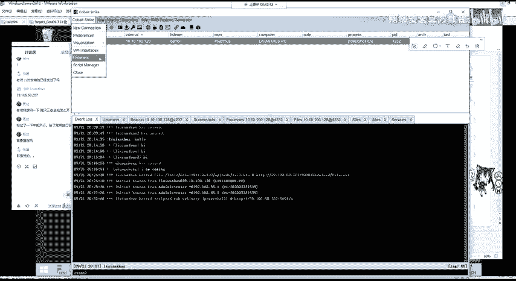

可以去呃去把这个CNI进行导入进来，直接打开之后，他会告诉我们已经导入过后，如果导入成功，在ready这个栏这个列会显示对号。

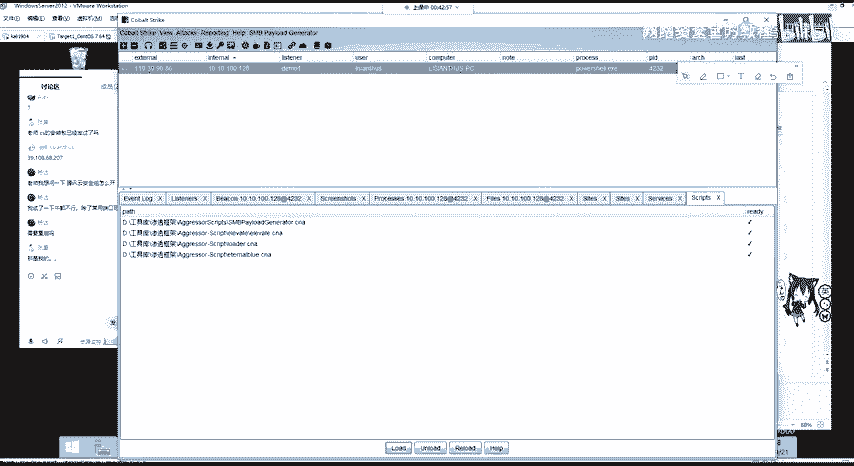

嗯。