# 2024网络安全系统教程！清华大佬花159小时讲完的网络安全系统课！别再盲目自学了，学完即可就业！零基础入门网络安全！（渗透测试／漏洞挖掘／CTF／黑客技术） - P29：16.Cobaltstrike实战.mp4 - 教网络安全的红客 - BV1ft421A7Nj

这里给大家做一个简单的CS的一个实战演示。那它攻击流程和ma split是一样的。因为我说过，在3。0版本之前，还是没有和MSF进行分开的。那它的攻击流程也非常简单。

首先就是创建我们的监听器listener。第二步呢是设置attack，选择攻击的方式，使用HTML application也好，使用web deliveryive或者是office红都行。第三呢。

寻找靶机漏洞执行命令。因为我们不论是使用哪一种attack攻击方式，都是生成一串python脚本。power share脚本sha code或者是其他应用程序。那我们需要在靶机上面执行这条命令。

就是要寻找靶机的漏洞，进行命令执行，或者是在把机上上传weber share拿到靶机的web shell之后，在外web shell管理工具里面执行相应的漏洞。当我们执行命令之后，就会把靶机就会上线。

当靶机上线之后，我们一般获得的权限就是执行命令的这一个权限，它一般是像windows操作系统一般是已经登录的用户。linux操作系统，它的权限就比较低。我们需要对靶机进行提权。提全之后。

windows操作系统，我们会拿到sstem权限。linux操作系统，我们会拿到root权限。拿到权限之后，我们可以对内网进行后渗透，包括内网的信息收集。比如端口的扫描，C段的扫描内网的一些代理配置。

然后就可以进行更一步的扩大战果。比如使用SMB back进行批量带出内网机器，使内网横向移动。在这后面我们都会进行讲。

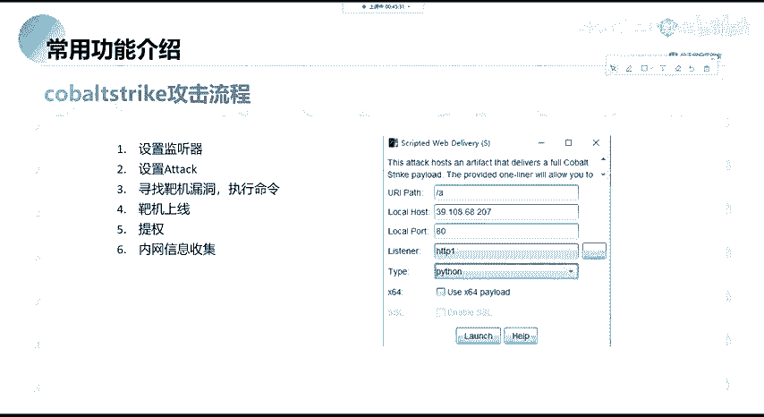

那我们现在就举一个例子啊，举一个例子，比如还是这个机器啊，最简单的还是DVWI还是DVWI啊后就给大家演示一遍，过一下流程吧，过一下流程。

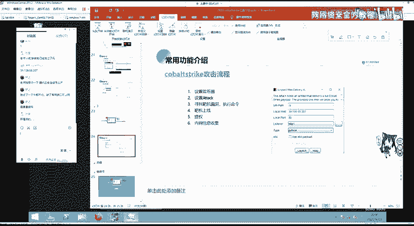

首先访问我们的机器。

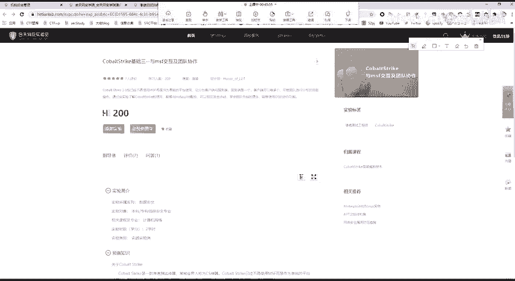

131192。168。123。13。1是131。嗯，131对的。然后去访问下面的DVWI我已经装好了。大家如果有疑问的话，包括这些同学有说对外b漏洞不是太了解，可以去自己装一个PH study。

然后装DVWIDVWI上面就基本上概括了OWSP top10的外漏洞，而且这里可以自己是设置一个嗯难度，比如进行一个等级的切换漏 medium high和imposible。

进行切换之后，可以来到comd injection，叫做命令注入，或者是爆破文件包含文件上传，搜库注入搜cle盲注，还有三种类型的查思思。在这里我们还可以vi source进行一个查看。

查看它的后台代码，可以查看所有的通常啊低级的是就是没有防护，而高中级的呢是黑名单，高级的呢是更强的黑名单。然后imposible一般是使用白名单防护啊，大家可以自己去看。而这里还是老规矩。

我们可以使用1个127。0。0。1去加上我们的hoMI它会执行后面的命令。那这里和之前讲的MSF就就是一样了，就一样了。

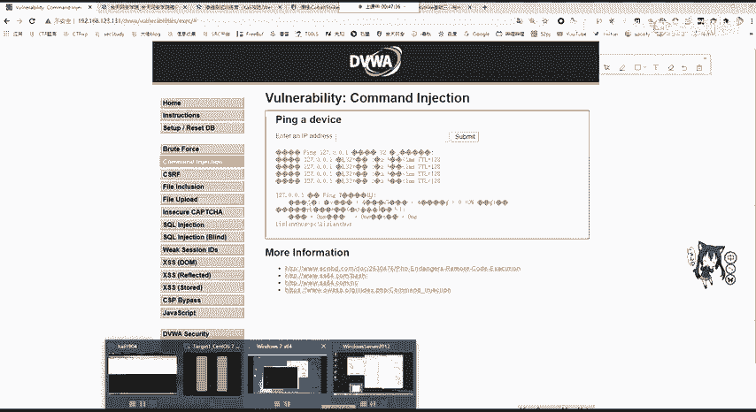

那我们来看一下。在这边是。生成我们的。

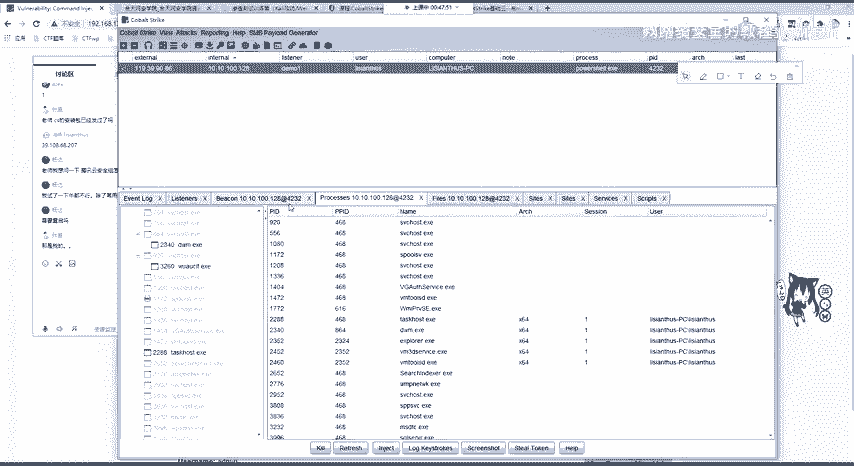

生成我们的一个。那一个这里我先给他关掉意思。然后把它给文木。这里在监听器我们已经生成过了，就用它了。用它之后我们要干什么？要生成at text，这里就以。

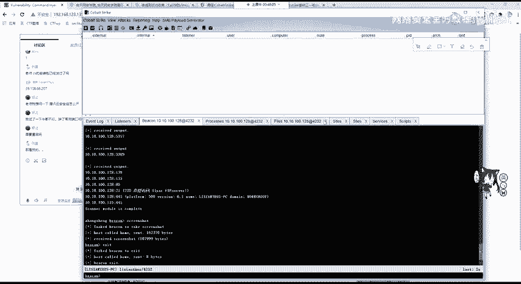

嗯，web delivery为例，然后我们点击生成选择我们的lists，然后开启一个端口，这里还9090啊，9090。9090开启过了，9091开启我们的python或者是power share。

这就papower share为例。当我们把机上装有python的话，可以开启python的一个web delivery。这里是不会在服务器上留下文件的，所以它比较安全。那这里我们生成了这个东西。

刚刚你的那个那个不会上线了，那重启就不会上线了。

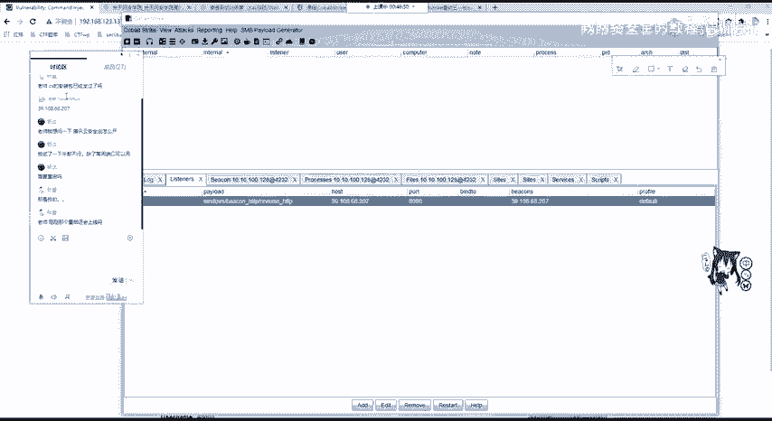

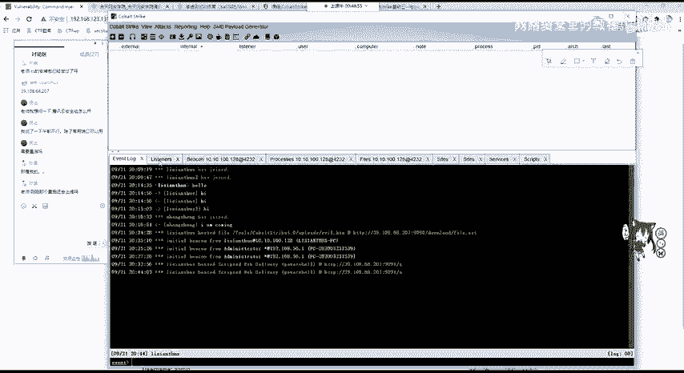

你想让他重启上线的话，你需要植入后门。然，后面您都会讲，就是如何去往注册表里面去写一些开机启动的一些脚本。

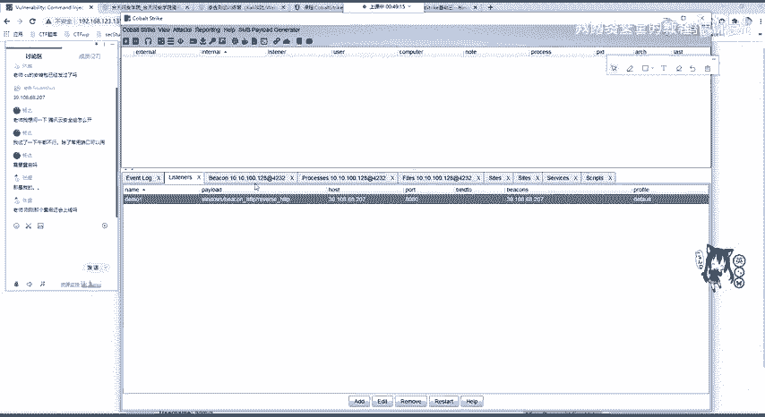

你想让它关掉很简单呀，因为你这边实则就像我们刚刚看到的这个我开启的呃9091端口，我们copyURL我看一下。

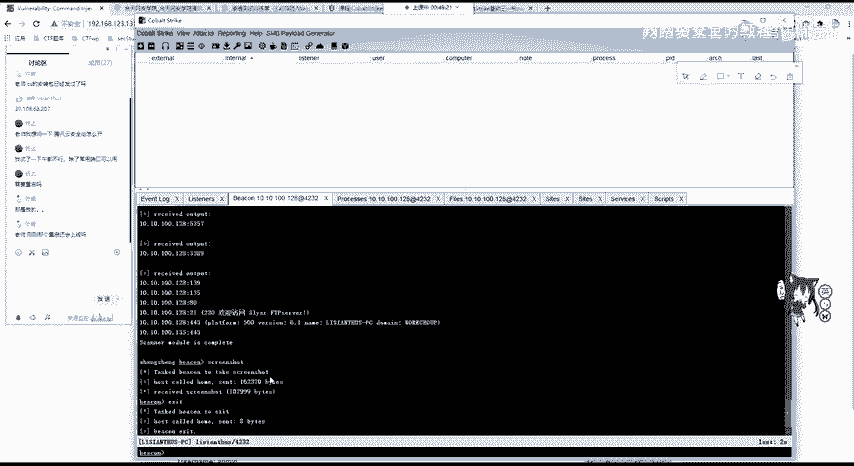

好发咗佢。这里看到没？是执行了我们的power shell。那他在后台你在任务管理器肯定会看到一个power shell点ES他ing的话，它也是执行去调用power share啊。

你可以把它给关掉这一个主题就下线了。那我们来看一下，我把这个URL copypy过来，然后和这里进行一个命令执行，把它粘到这个呼M处subit提交，还等待他这边把机会不会上线。

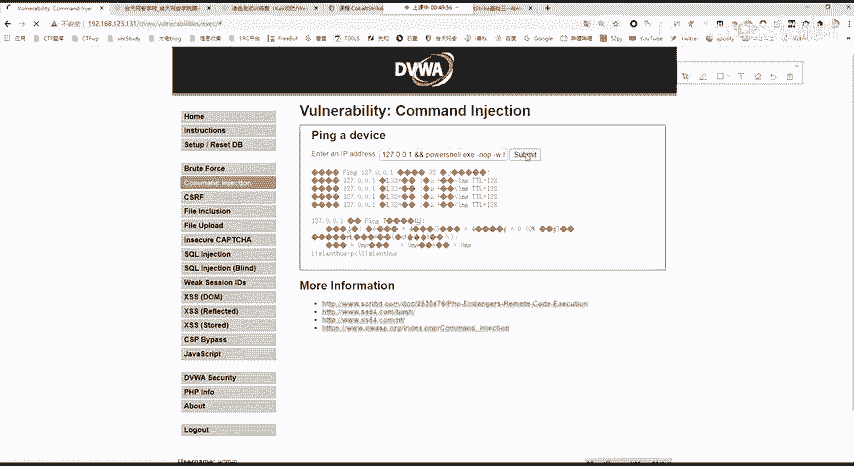

啊，因为他是联公网是发送。sage包是需要一段时间的。OK我们可以看到靶机上线。那这里。我执行的是is思退出。对，因为退出是我们服务端把它退出了嘛。isremove呃服务端，你如果直接remove的话。

它是会再上线的。你需要先is先退出这一个进程，然后再remove，它就不会再上线了。那这个时候这个靶机上线了，大家有没有问题这一个整个过程没有问题的话，那有问题也等一下吧，我先把这一堂节课下课。

那我们开启下一节课，就是如何。让CS和MS2个渗透测试神器进行互相的连接和交互。呃，这一节课我们先到这里，大家可以去休息5分钟，我们5时准时进入下一节课。Yeah。hello，大家能听到吗？

麦克风声音是正常的。OK那我们大家休息几分钟，我们马上后面开始讲，继续讲。那怎么挂？

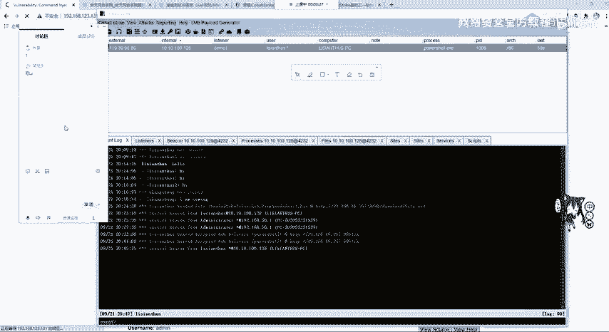

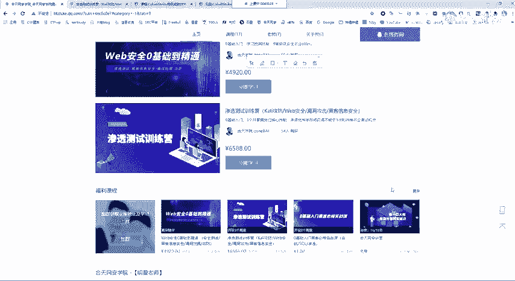

对呀，之前是有电风扇的声音的，我换设备了。不同。大家如果有问题的话，随时可以在讨论区提问啊，或者是客户的时候，如果有问题。比如装不上哪个地方把金没有办法上线，可以在群里问，或者是私聊我进行问都行。

当然也可以自行百度或谷歌解决。

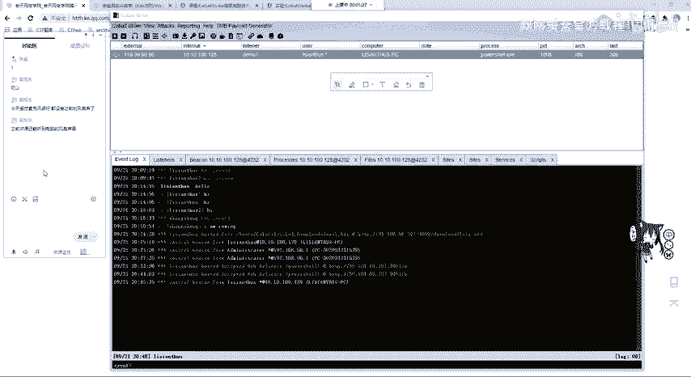

有。没。对。我来。这个靶机上线的方法大家应该知道吧。一种是刚刚我测试的这个命令执行或者是文件上传上传web share，然后在一键或者是音些里面，或者是菜刀进行执行。这个命令。只要这个命令得到了执行。

并且有权限执行就是没有报错。那这个靶机是能够上线的。那大家一定要注意，如果是。CS是在内网中的，你要确定CS一定要能够连到88G。啊，不是，是把机一。OK那我们继续讲。当拿到靶机s之后。

是不是就是来到了第四步靶机上线。靶机上线我们拿到的是什么权限啊，这里也告诉我们了，你的user是一个普通用户，我们可以进入一个交互进行看一下，首先呃设置sleep。2，因为默认60是比较慢的。

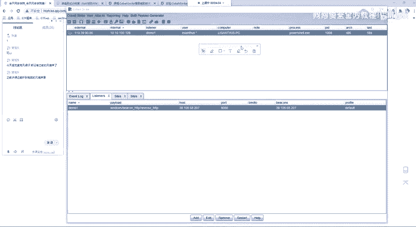

好，这里上节课大家听懂了吗？如果没有听懂的话，没有听懂的话，你扣一下2。啊，如果没有听懂或者是。是哪里没有听懂呢？因为他这边设置。嗯，sleep还有一段时间，你可以问一下你的问题。设置监听器啊。

设置监听器就是在co strike。怎么发言违规仅老实可见，这个监听器被违规了，这个只有我能看到。

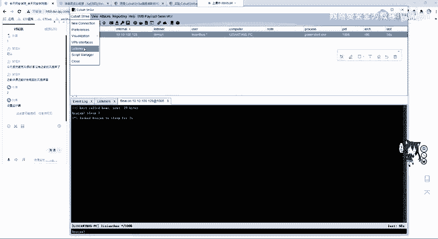

那你这个listener在这个点击listoner这里没问题啊，没问题。那我们。去点击ad去添加exit编辑remove啊移除restar。从一开始。在点击edit之后，这就相当于什么？

backHTTP相当于什么？我告诉嗯，我这样告诉你应该就知道了。那MSF还记得吧，它就相当于我们的这一个东西。Windows。Meter printer。REVERSE。HTTP。就相当于他这个东西。

那我们拿到他之后，是不是收 options一下？show options我们可需要设置什么？是需要设置我们I host和I port。lho lport是不是在我们机器上开启监听的端口。

那L host是哪里呢？就是我们的HTTP host。那airport是哪里呢？就是HTTP port，就是你在服务器上开启的监听，这里能够理解了吧，能够理解了吧，就windows我打错了手帕。

OK那这里端口你可以随便设置，这无所谓啊无所谓。如果你在。嗯，老版本的这一个老版本的这个里面你会看到一个。会看到一个这样的1个TCP啊，它也是一样的。因为我们在讲MSF的话，经常用这个东西。

它是一样的那我们拿到这一个低低权限，我们可以进行，你看我直接说ID考贝格是不行的哈，要用嗯是你输的呀。

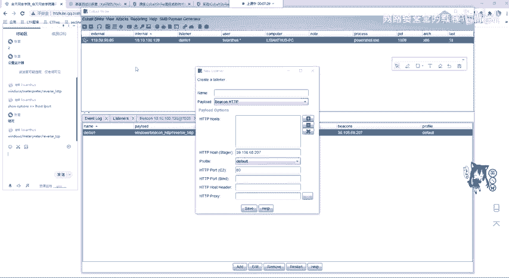

啊，是这个同学出的。你不能直接说IP防防防fi，你去执行shall命令，你要在前面加个shall shellll IP configurefi。啊，这里是不是就好了，那你可以试一下。

反正你是能连接到这里的，你可以再试一下。这没问题的，你随便打弄他。那我们拿到这个地方，可以看到呼MI进行看一下。他是一个低权限的用户。那我们如何进行一个提选呢？也就是exs一个提选。一一连麦。提全之后。

我们还是要选择监听器。也就是listen，还是选择我们刚刚创建的demoEchoose选择我们需要攻击的一个脚本。大家可以看到自己的有可能只有SVC和USIC token。那这里已经我装了一个拓展。

那这个拓展我会发给大家。这里我比如选择MS16135进行拉ge。他会自动的把这个脚本攻击脚本给打出去。我们看他记住如果在这个啊okK他已经他已经告诉我们success。并且上线了第二个机器。

第二个机器和我们第一个机器是IP是一样的，说明是同一个机器。它的区别就是user变成了sstem，我们可以interact设置它的sleep为2。记住啊是一个session，一个把节设置一个sleep。

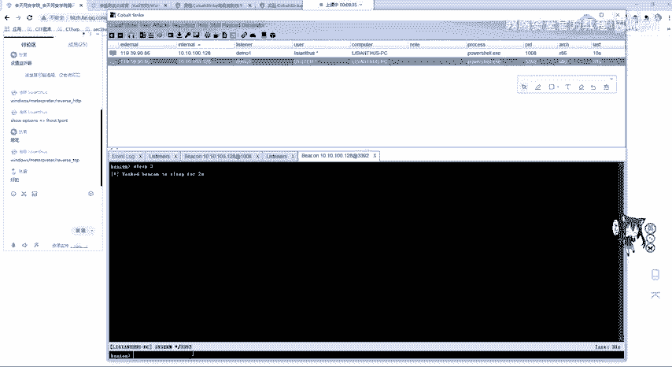

设置之后啊，这个可以在这边看清楚的看到。

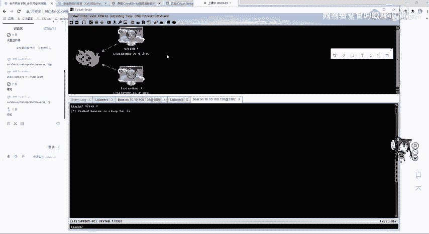

是不是两个用户是不一样的啊，两个用户是不一样的，一个sstem，一个普通的用户。那我们拿到它的一个最高权限之后，就可以运行其他的一些命令。Aexcess里面的这里等我们把这个两秒给设置好。

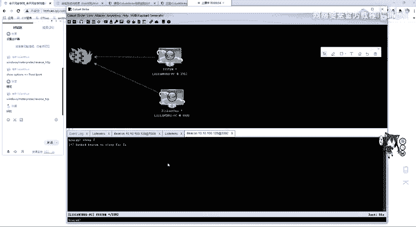

这个两秒设置好之后，我们再记住一定要选择这个sstem，可以看里面有一个hush dump dump hushes或使用命令hush dump。会从我们的NT这个服务器里面读读取用户的一个哈希值。

也可以去把迷咪卡te这个软件去运行起来，也就是使用loginlogin on passwords。他会去我们内存中去读取。我们来看读取的结果有没有把密码读取读取的。

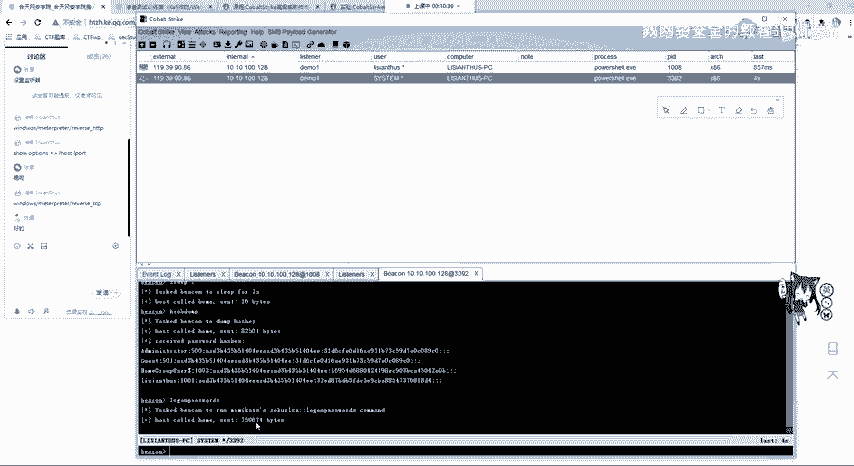

OK他已经读取到我们的一个任一个凭证，也就是这个用户他的密码是123456。那确实我这个win7的它的密码就是123456，就是123456。

那这里给大家看是不是开启了power share那有这个东西哎，因为这个power share开启着呢？那我们把这个power share给干掉，那这边就断掉了就断掉了。当然你可以把进程迁移。

进程迁移可以利用MSF那这里就给大家讲，当然他还有其他的一些操作，那大家都去自己去看一下就行。那这里就给大家继续讲第二节课。嗯，如何和MSF进行联动，如何进行联动？

