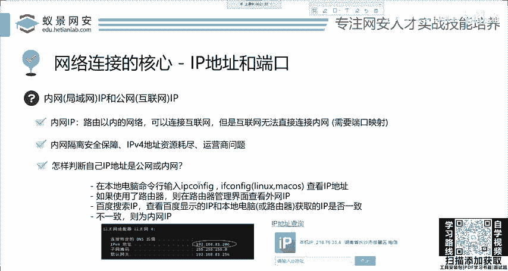
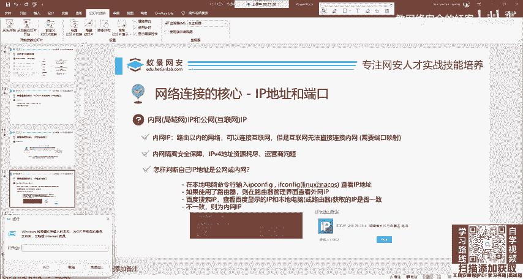
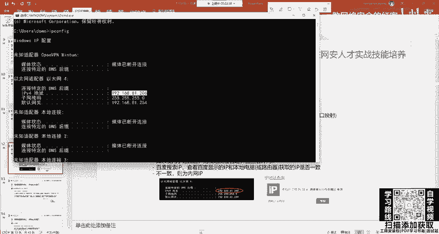
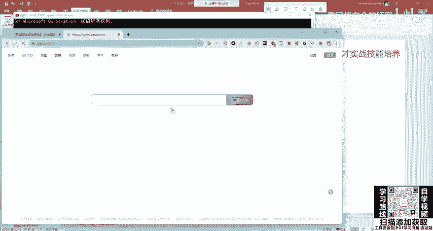
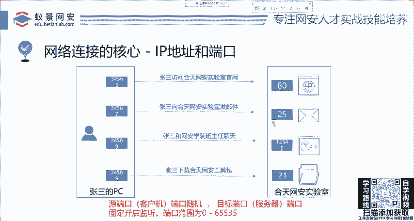

# 2024网络安全系统教程！清华大佬花159小时讲完的网络安全系统课！别再盲目自学了，学完即可就业！零基础入门网络安全！（渗透测试／漏洞挖掘／CTF／黑客技术） - P2：2.HTTP基础-IP地址和端口.mp4 - 教网络安全的红客 - BV1ft421A7Nj

打通这个网络基础的思路，大家可以根据二一老师的脚步一步一步的去学。没有关系。首先呢我们就来说这个TCPIP体系结构啊，大家要记住啊，这个TCPIP啊，它不是一个协议，它是涵盖了很多的协议。

在传输层和绘画层有很多啊，比如说啊像TCP啊IP协议啊，以及像HTTP更高层的这些协议啊，也都涵盖的都涵盖在了里面。那么首先呢就带给大家讲解这个TCPIP体系结构的啊这样一个。核心就是IP地址和端口。

那这个地方大家一看，每个人都知道呀IP地址端口是什么，你肯定知道。那下面呢我就给你用最简单的语言来给他复述一下。如果你不知道的同学也不要担心啊，我讲的非常清楚。首先IP地址是干什么？

你的家庭地址是干啥的。让快递员能够找到你，让别人能够找到你。IP地址呢就是在互联网中在网络中他能够找到你，就是这个意思，就IP地址，他的作用就是用来在互联网中寻找电脑，并且是任何电子设备，包括计算机啊。

包括交换机啊、路由器啊等等设备的网络上面唯一的标识，而这就IP地址。比如说张三啊这个张三他要去访问和田网安实验室，那他怎么去访问到他呢，哎，他要知道这个域名域名是谁。3W点和田lab点com。

是这样一个域名。他知道这个域名，其实呢这个域名是会被解析成IP地址的那这里用到的呢就是我们刚刚所讲解的在TCPIP体系结构中1个DNS这样一个呃协议这样一个解析服务。

它的作用呢就是把域名换成这个IP地址。那我们知道IP地址，你就能找到和田网安实验室，然后就能够正常的访问。啊，这是最简化的一个原理。张三访问国含实验室，那他能够访问的前条件呢，就是能够找到对方的地址。

也就是IP地址。就像大家去打游戏一样，你能和别人联接，就是因为你找到了别人的IP或找到了这个游戏提供商服务器的IP地址，并进行了正确的连接，才能够进入这样一个服务器。

服务器进入这样一个对战OK那这是这个IP那在讲的IP在网络安全中的应用。我就不得不提这个内网的IP和公网的IP内网就是局域网公网就是互联网这两个概念非常重要。如果是已经在正式课的同学，你现在也来听了。

我请你啊把这个地方仔细听一下。在后面的课程中千万不要搞混了，包括实际工作中，这个地方非常好理解，那内网IP官方的解释就是路由器以内的网络，它可以连接互联网，但是互联网没有办法直接连接内网。给大家讲一下。

首先我们先来看怎么去判断你的IP地址是公网还是内网。我可以告诉大家，大家90%的同学，你的IP地址，他一般都是内网IP。首先你可以在本地打开你的命令行啊，打开命令行，这是个非常基础的一个过程。

打开命令行之后啊，我们在这边输入IP configurefi。

我们输入这个IP configurefi啊，我们就能看到相应的IP地址，这个叫以太网啊，以太网。这IP地址呢是192。168。81。206。如果学习过网络，大家在大一的时候。

你就知道这是个什么私有IP大家请注意我们讲解的内网IP跟私有IP是有一定区别的。我们讲私有IPA类地址，B类地址，C类地址跟内网IP稍微有一点出入，它不是一个东西。你可以把它理解是一个东西。

但是它不是等价的，啊不是等价的。OK那这个IP呢，我们同样去查看公网IP就直接打开百度，你打开打开百度，然后你在这里搜1个IEP。

啊，这个这个地方啊就会。出现这个地方就会出现。那我们发现啊，在这个地方看到的以太网的地址跟这边看到的这个百度给我们的地址，它不一样它不一样。那这个时候怎么办？

就证明了我们的电脑是内网IP那为什么是内网IP呢？首先大家自己家里啊都有路由器，包括学校里面也有很多的路由器交换机。第二个呢，就是IPV4的地址资源，现在已经完全耗尽了。

这个运营商它没有这个更多的这个地址去分配给大家。那第三点呢，就是运营商的那的问题。那之所以运营商为什么会出现这个问题啊，大家自己去猜。那如果你家庭的网络，没有公网IP的话，你可以去打电话。

比如说电信的电话是1万，你去打这个电话呢，就询问一下，能否给你分配公网IP如果可以啊，那就可以给你分配。如果拒绝的话，那也没办法啊，这是运营商的一个问题。啊，这是判断内网和公网的一个基本方法。

这个是大家一定要了解，虽然非常基础。那第二点呢，我们学了内网，下面就要知道什么是公网。那公网IEP呢顾名思义就是在互联网中的IP机制。那这个有什么用呢？这个在互联网中，那肯定啊就是能够连接互联网呀。

就是能够直接和互联网中的资源互通，并且不需要端口映射啊，大家就是可以听课，如果有什么问题可以随时提问啊。啊，可以随时提问，我是能够看到的。就是这个公网呢可以直接的和互联网的资源互通。

这个日常应用啊是非常广泛。这公网IP可以说非常方便啊。比如说在这个摄像头远程监控，比如说大家买那个小米的摄像头放在家里。那如果你家里的网络，它不是公网IP的话，你还要去把它去放到这个服务器上面。

就做一个端口映射，然后才能够看到啊这样一个摄像头的监控。那第二点呢就是电脑的远程开机，其实这个biOS里面都有这个功能啊，大家就觉得很高级，但你实际用不上，为什么用不上呢？就是你的电脑啊。

它是个内网IP它是个内网IP是吧？你内网IP外面互联网根本连不上，你开啥呢是吧？开不了。那第三个呢就是主机游戏的互联以及等s一些设备。那这些设备呢都很依赖于公网，也就是互联网的IP。地址啊。

大家如果有玩过这些的，应该都非常清楚。如果你没有玩过，那你就记住就行。大概有这个概念。那我们再举个例子再举个例子，就是IB地址啊，就像家庭地址一样。这个公网IP啊是叫互联网的IP就是你小区的地址。

那一个小区中它肯定有很多的住户。那这个内网的IP呢就是你家具体的门牌号。就是这个意思，懂漫。就是公网是小区的地址，内网是具体的门牌号。OK那你呢你可以肯定从你家小区出去，这个没有人会问你是吧？

你想出去就出去。但是呢外面的人，比如说这个快递员外卖员啊，他想进入你家，就需要通过这个小区的门岗。这个门岗呢我们就叫做嘛路由器交换机，就叫路由器或三层交换机。那这些呢就是公网IP和内网IP的区别。

从这个简单的例子，我们能够直接看出。那内网IP是能够连接互联网的。但是公网的IP没有办法直接连接内网。啊，这个回放这是直播呀，这个也不需要回放。我觉得这个都是基础的课程。大家就像感觉像看电影一样。

你去听一下就行，保证你能听懂啊，听不懂，你可以随时问。啊，大概就是这个道理。那下面呢我们在讲完这个IP之后，那下面呢就遇到一个端口。那首先为什么要引入这个端口的概念？

你就用原理其实都能想清楚这个计算机的这个发展。这个冯诺伊曼啊，他并不是凭空去创造的，是吧？这个端口你想一下你的电脑是不是IP地址。是你唯一的寻址方式。那你REV地址难道你电脑上就有一个软件吗？

那肯定不是是吧？你肯定有QQ啊，肯定有微信，肯定有其他的像邮邮箱呀。那这些别人在访问的时候，他怎么确定发送给哪一个地方呢？比如说一个小女孩跟你聊QQ，那他怎么知道这个信息要发到QQ上面啊。

这就是端口的概念。端口是应用程序在计算机上面的唯一标识，它和IP是形影不离的，肯定分不开。哪一个分开了，你要IP没有端口，那这个IP啥用都没有端口离开了IP那这个端口也形同虚设啊。

所以说呢这个端口就是我们讲端口啊，讲的是逻辑端口啊，一般都是逻辑端口。我们下面来看还是恢顾这个最简单的这个概念啊。这个张三去访问葛天晚安实验室，就是要知道我安实验室的这个IP地址，要找到IP地址。

那现在啊大家要想一下。这个网安实验室它是一个服务器，一个负载均衡的集成服务器，难道说上面只有一个服务吗？那可不是我们这个IP上面不仅有网站服务，还有其他的像邮箱服务器啊，像我们的一些服务啊，中间件呀。

可能都会存在于这个IP上面。呃，现在我来给他去。这样一个复杂化遗产。就是在网安实验室上面，它开启了这样一个几个端口。比如说像80，像25，像12345，像21，这个端口啊是以编号来去排序的。啊。

嗯排序的啊，大家呢不要争论啊，这个没有太大关系，这个是公开课，肯定是不要钱的，这是不要不要钱的。O。😊，OK这个无聊的话真没办法呀，这我也觉得无聊。你学习嘛，如果学习都有趣的话，大家是吧都还还要赚钱嘛。

是吧？都学习赚大钱去了。那本来就是个无聊的过程，我们尽量啊把它搞得有意思一些，这个不要担心。😊，OK我们下面呢来简化一下这个思路啊。比如说张三他去访问网站，访问网站呢一般是访问这个80端口。

一般是访问这个80端口啊。一般来说，然后第二点呢，就是比如说张三呢他还有个功能就是向葛天玩安市实验室呢发邮件。还有一个功能呢，就是张三呢和网安学院的班主任小姐姐聊天。然后呢。

是张三去下载和天火案的工具包。那这些呢都是对于核天火安实验室这个简单的IB地址做不同的操作，访问不同的软件，不同的服务。那这些服务如何去区分呢？为了不乱的套。哎，他就整出了这个逻辑端口的概念。

我们来看一下。那也就是说呢这些服务分别开启在一个端口上面，它不会乱啊它不会乱。那下面呢我们来看张三的一个电脑。首先他去访问目标的机器上面，他本地肯定要有一个端口去开启去访问他。比如说张三去访问。

网站就是80，张三去实验室发邮件，就是25。我安也。我安班主任聊天，他是12345，但是我这边是虚拟出来的，就是帮助大家理解啊，帮助大家理解。那张三呢去下载和田文安工具包，访问21端口。

就代表了端口是在计算机中的唯一服务区别的这个方法啊方法。啊，大家不要争论啊，这个没有什么可以争论的。都是在学习嘛。啊大家一定要注意，在我们TCP的端口范围是0到65535，就是6万多个端口。

就证明了你这个电脑上面是6万多个端口，你可以随意使用。那一般的特殊的服务，它是监听在固定的端口上面的。当然是默认监听啊。就比如说。80端口。80端口是HTTP协议。

也就是一会儿我们要讲的网站这个访问协议的。一个默认端口，这个默认端口都是可以改的。有同学说我现在不想让它放在80，我想换一个其他的端口。那随便你这6万多个端口，随便你选。啊，同样的，你现在发邮件。

我不想用25，那还是随便你选。只要你选的6万中的其中一个端口，它没有被占用啊，你不要说哎，这个地方已经占着80了，你后面还给个80，你不是呃找茬嘛，是吧？这6万多个端口，你非得跟他一样是吧？

