# 2024网络安全系统教程！清华大佬花159小时讲完的网络安全系统课！别再盲目自学了，学完即可就业！零基础入门网络安全！（渗透测试／漏洞挖掘／CTF／黑客技术） - P31：18.cs联动msf之外部监听器.mp4 - 教网络安全的红客 - BV1ft421A7Nj

那接下来看一个就是。

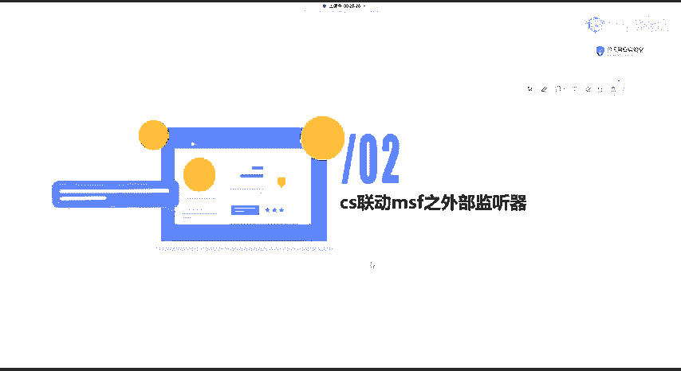

CS如何联动MSF？

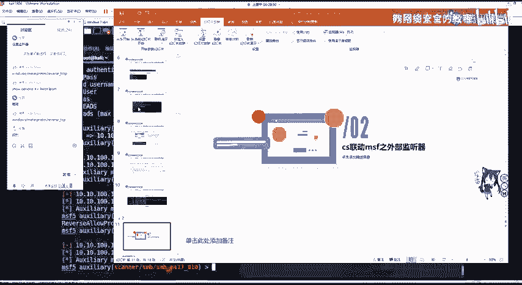

。我们如果能把内网上线的机器去发送给mate split，变成matepri，是执行更高的一个操作，更拓展的操作，那就非常方便。现在要做的就是这一个。在。讲lister的时候，我提到外部监听器。

那我们将内网主机上线的session是发送给mat split，就是要创建一个新的lister监听器。这里监进器去设置拍漏的为外部拍漏的。

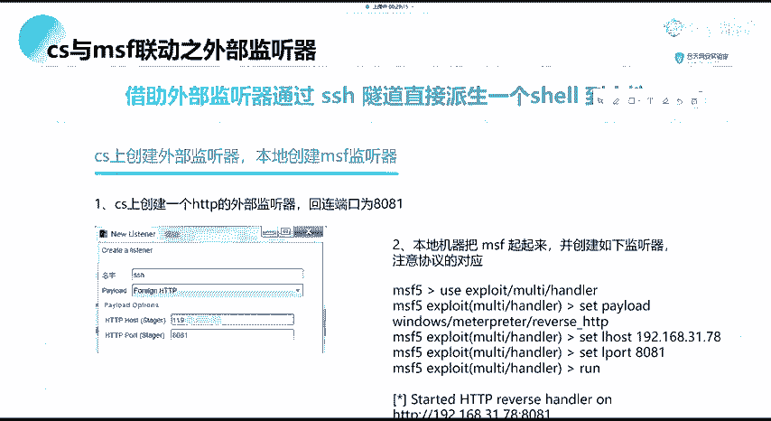

外部派了的。这也一直不行啊。不行就算了，这个代理也不常用，你不会这样去扫的，这扫没啥用。特别圆慢。那么这里我们来操作一下，首先创建一个新的lister。比如SMSF选择piload为外部拍lo。

如果你是使用CS3。0版本，你会看到外部拍load有很多。那这里4。0可以剪成了两个，当然也没有什么大影响。我们选择外部HTTES。就会让我们设置两个一个host，一个port。

也就相当于我们MSF show options设置里面的logo host和logo port开启端口监听。那这里我们的logo host，也就是服务器的地址，39110868207。

它的端口这里给大家设大一点，就8085啊，8085。

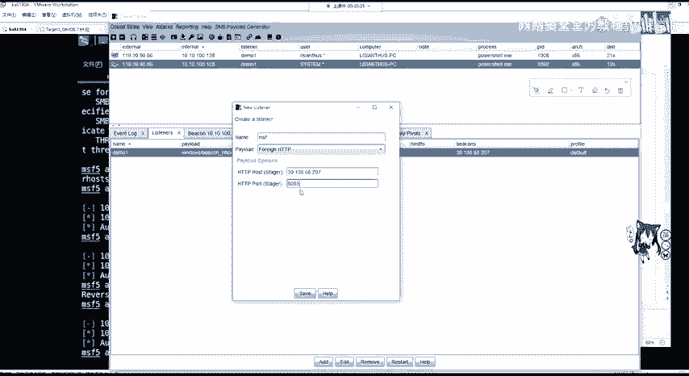

设置好之后，呃，在这边8085可已经开启了。我得加AP一下更快。甲AP是正正正则查照808。哦，这里我们需要去连去转移它的时候，它才会开启啊才会开启。

那我们来看一下如何把这个sstem的这个session去发给我们的matepri。

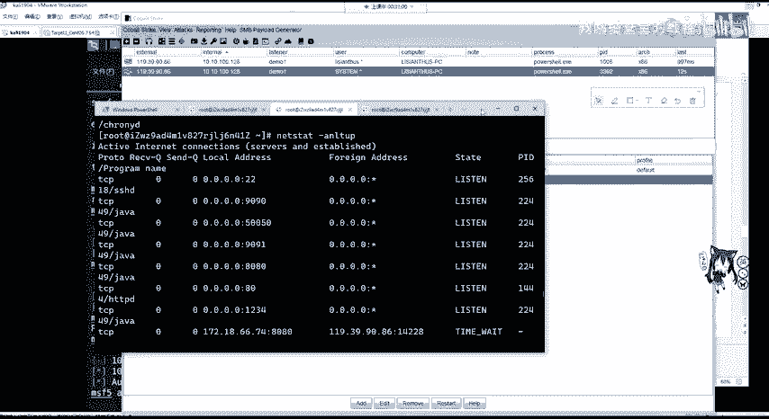

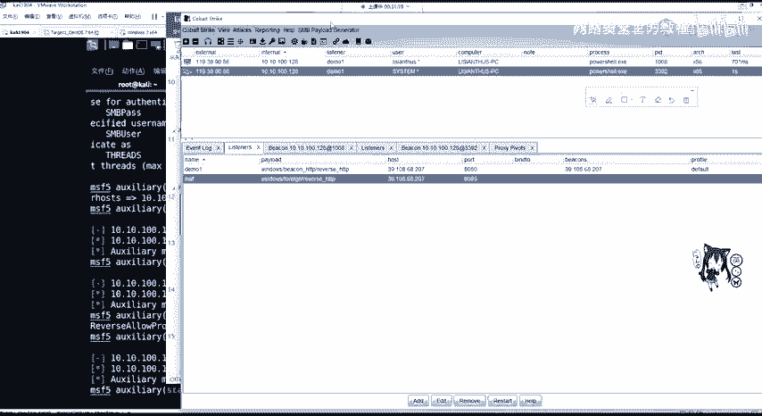

在设置好我们的。listen之后，我们需要对MSF进行配置，使用我们的exit handle模块，并设置piload和我们监听器设置的piload为相同。

设置logo host和logo pot开启监听。那这里我们又。这一个hander。然后s options它默认是不会选择拍lo的那我们可以s排lo。下载拍乐的是什么windows。那。

这就用到我刚刚讲的那个。Neterpri。reverseHTTP为什么是HTTP不是TCP呢？因为我们laer这个地方你开启的。

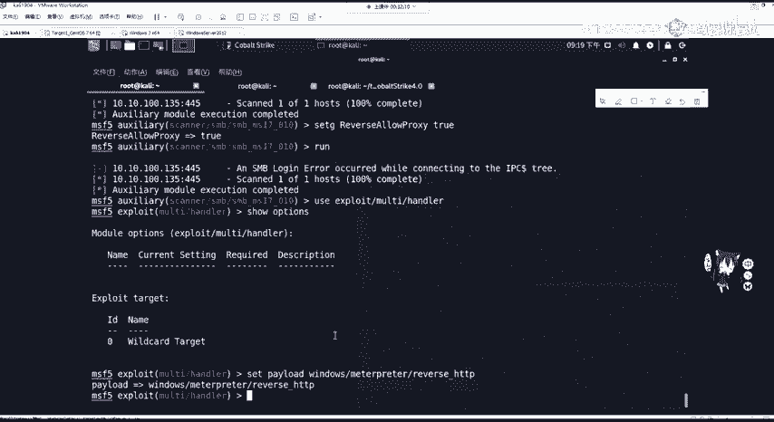

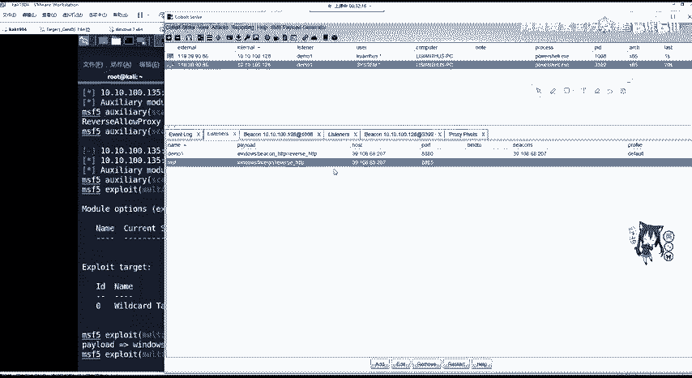

是HTTPOK那我们。MSF就是HTTTt options。options需要配置logo host本地地址。那大家呃现在就问题来了，你这个logo host是配我们卡利的内网地址。

还是配我们服务器的IP地址，还是配我们服务器的IP地址。啊，这里我就直接讲了是配置我们的。本地地址一定要记住。目标机器的地址是R houseloL house是logo house，也就是本地地址。

不论你是发生在什么情况，这里一定要配我们卡利所在的地址。我们咖利所在地址是19192啊，你不知道的话，可以发那个top图看123。128。

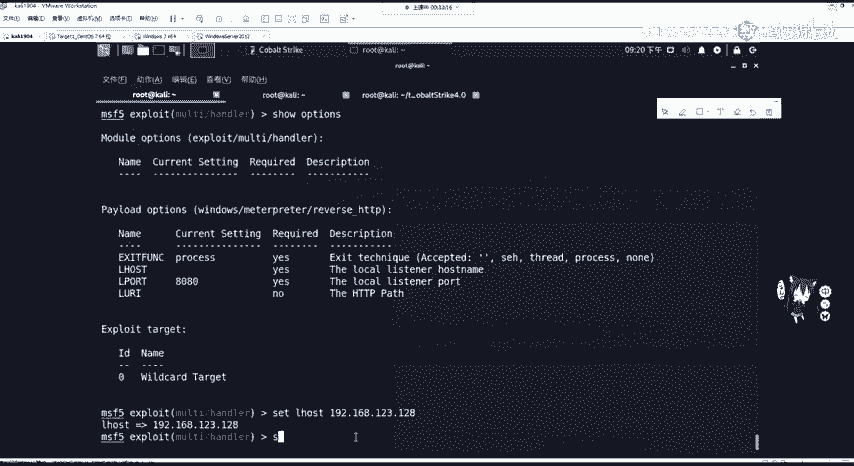

我们的logo po开启监听的端口，要和监听器相同。80858085。

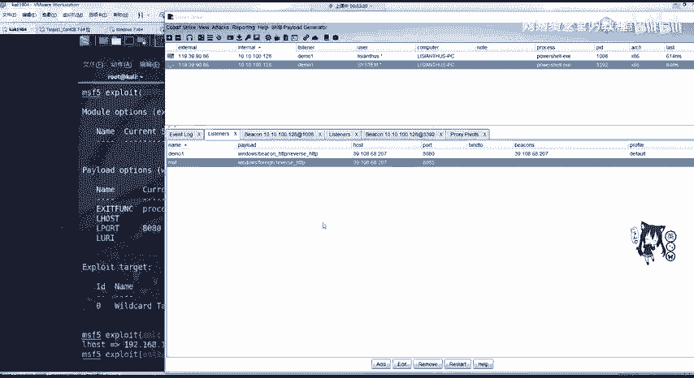

然后把它装起来。run起来之后，我们在他利这个MSF所在的机器上面开启了8085端口的监听。

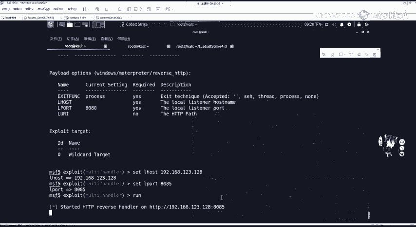

接下来我们需要将co strike服务器这个。

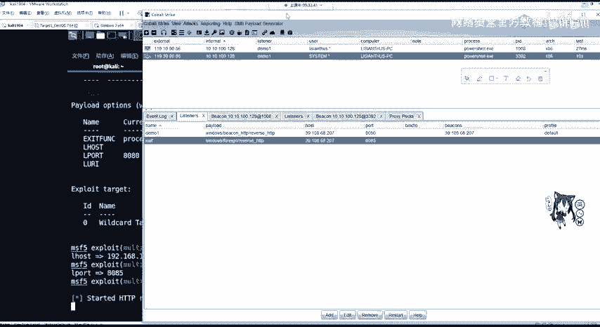

也就是我这里还拿top图来讲，也就是将我们co strike的这个服务器的这个地方啊，这个服务器它上面存储的session给发送到CS客户端，也就是mateta split所在的机器。

从39108到192168123128，我现在请问他可以连接到这里吗？也就是。CS服务器。可以连接到这里吗？嗯。肯定不行，不信我们可以拼一下。因为哈利在内网里面呢，在内网里面呢肯定是拼不通的啊。

肯定是拼不通的那我。

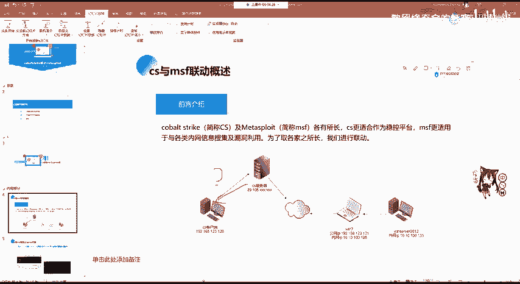

我这拼内网地址。外网拼不通内网。这怎么回事？

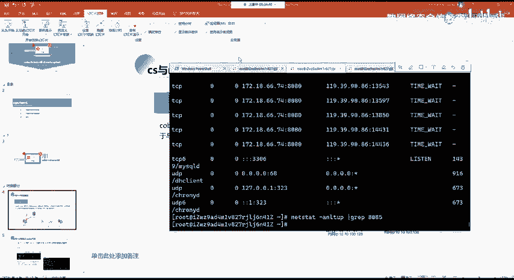

OK这个不通，那怎么办？我们还是要做代理转发。

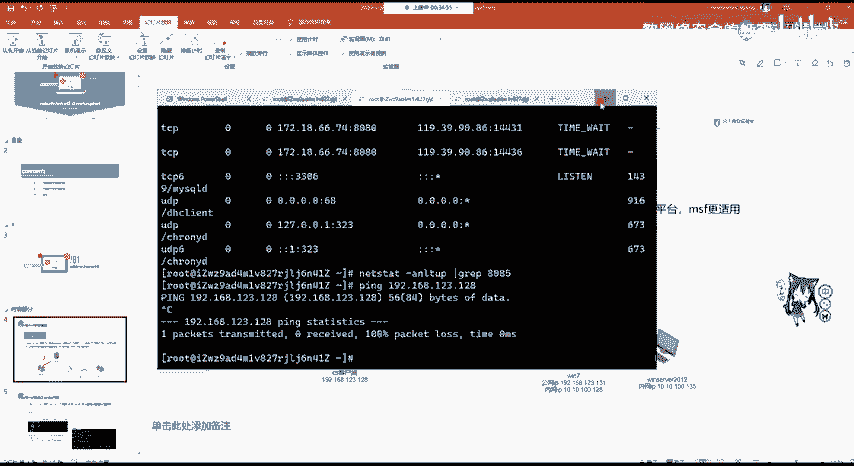

代理转发可以使用其他的工具。当然有一个非常方便的就是SSH隧道。通过编辑SSHDSSHD是指SSH的服务端开启SSH端口转发功能，并且重启SSHH服务。那服务器的SSH配置，它在哪呢？

在我们ETC目录下的SSH目录SSHDconfi。那我们来进里面看一下，首先CD到ETCSHH里面可以看到有两个confi分别是客户端的confi和服务端的confi。这里我们需要对服务端进行配置。

千万不要配置错了。

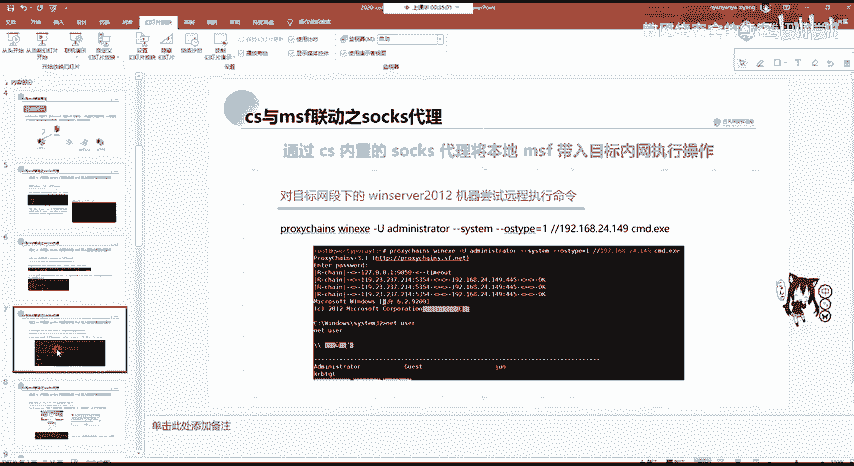

在服务端进行配置，我们需要添加这两这三个东西，或者是将它的注释去掉。

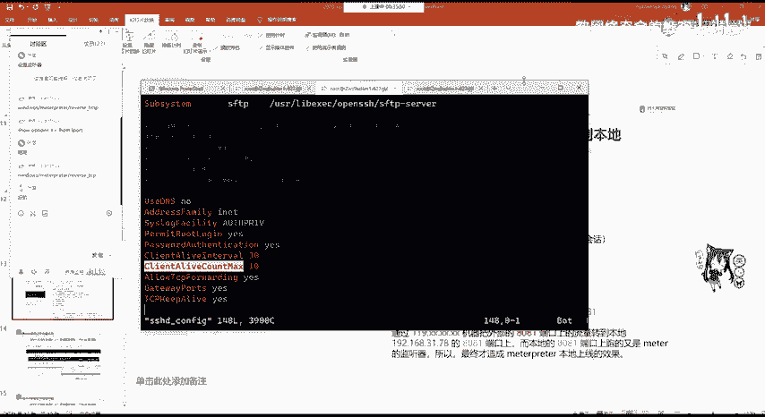

分别是pasword password密码认证。yes，也就是开启我们的密码登录。开启TCP转发E。然后开启我们的getaway pose yes和TCP keep alive。 yes。

开启之后进行保存。

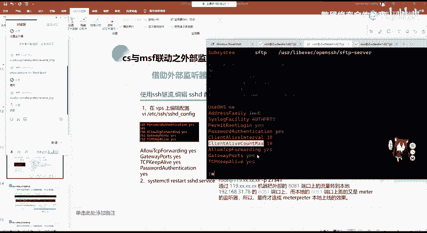

保存，然后使用sstem哦，这里我是以stoOS进行操作ret。SSHD一定要加上它的服务器，把这个执行，因为我这里就不执行了，它我已经配置好了，它就会有隧道转发的这个功能。这个有有学生走了。

是听不懂吗？听不懂的话，你可以在。嗯哼，讨论区随时问啊，随时问。那这里SSH隧大的常用参数给大家稍微讲一下，不需要记忆，只需要复制粘贴。那一定要学会复制粘贴。那首先杠C是指压缩传输。

杠F是指将SSH转入后台执行杠N开启静默连接杠G是远程主机连接本地用于转发端口。L呢是本地转发P指定SSH端口。那我们将这一句直接复制过来，进行一个代理转发。它是在我们的卡利里面进行运行粘粘贴过来。

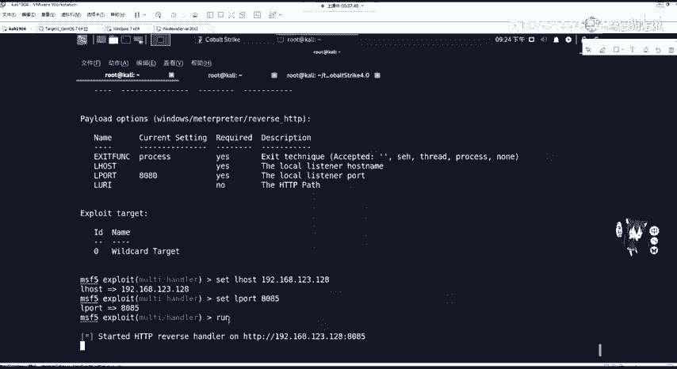

我们需要对它进行配置。首先我们是对公网的1个8085端口是8085。如果忘记的话，你可以在这边去看8085端口。这边的8085端口映射到我们本地的连接8085端口。我们是将哪一个服务器映射呀？

root用户的。39。108点多少，我看68207。杠P指定SSH端口默认是22。那这一这一句执行，它就可以将8085端口通过SSH隧道给转发。那这里我再给大家看一下，那root艾这个是什么意思呢？

我们需要连接我们远程服务器怎么连接，是不是SSH加上我们的。需要连成软件的主机名。用户名艾特我们的主机名，比如3，这里直接392。108。点68。207。让我们输入密码。

这里我们是不是延伸到了我们的阿里云的服务器？OK那这里呢就是多了其他参数，对他进行一个代理转发。那同样我们在执行这条命令之后，他也会让我们输入3910868207的root密码。不要输错。

你intint之后，为什么没有进行一个交互？因为我们进行交互的隐藏，并且将SSH传输数据放在了后台运行。通过参数，我们可以使用NTSTIT。去查看这个时候可以看到。有1个SSH是处于连接状态的。

连接到了我们的3910868207，它需要转发的是我们的8085端口。这个时候我们内网机器的8085和公网VPS3910868207的8085端口就已经通了就已经通了。我讲这些IP地址。

大家很有可能会混。我们再来看一下妥不吐。192168123128是卡利MSFco strike客户端所在的内网地址。39108点这个点点什么是公网，也就是阿里云的VPS服务器。

在上线CS服务器的把机分别是W7，它的公网，也就是能连通互联网的IP为192168123。131。它的内网IP也就是通向下一层内网的网段的IP是10点10。100。128。我们理清top图之后。

那就非常。清楚了，我们公网的服务器是无法拼成内网的。CS客户端可以连接CS服务器，能够并同，但是CF服务器并不同CS客户端。那我们在CS服务器开启了8085端口的监听器listener。

我们需要将858085端口和CS客户端所监听的8085端口通过SSH进行隧道端口转发，使其两者互通。互通之后，我们可以在CS服务器上面操作已经拿到。上已经上线的session进行ssp，也就是转移。

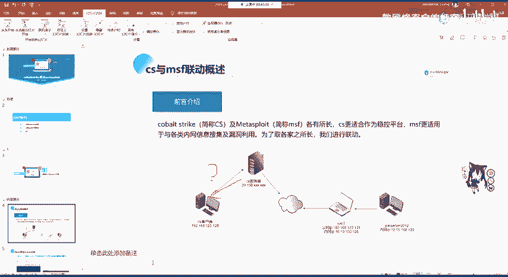

哎，我们来看一下，这个时候我们这个ma split放小放在这儿。

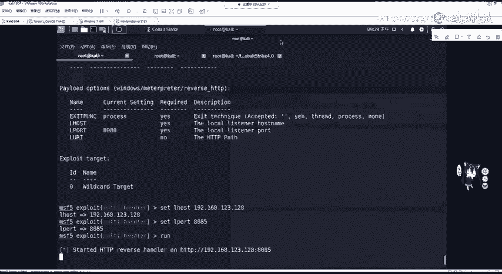

然后客观时验盒放在这还看一下它的上线过程。选中system这一个user的。一个session有上线的主机。这一个。在这。选择它上线的主机之后，我们选择右键sspine进行转移。

转移它也会让你选择雷center监听器。又来到这里了，我们对CS的一切操作都是服务端的监听器所造的所做的操作。所以listener拍lo就构成了我们CS的核心。

那么我们这里选择哪一个是不是选择对应的MSF排lo的，也就是外部的HTTP8085端口，我选择第一个啊，选择选。选择这个MSF啊，我也不知道怎么回事啊，choose。OK大家注意这边注意卡利这边。

这现在已经把包发出去了，我们来看这边有没有什么变化，他这个是很慢的。

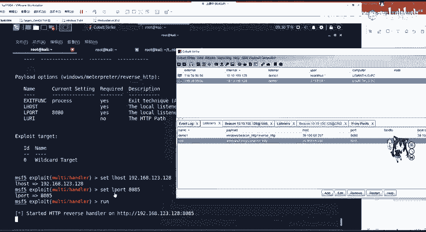

他这边那个代理这个个掉了，代理掉了，那我们重新开一下这边的代理啊，重新开一下这边的代理，他没有连接到我们的8085。没有连接到的8085。这里进行一个重新的连接。首先看一下这个8085还在不在。2。

8085是在的。我们可以将这个SSH给删掉，这个叫做Q9485和9444。Q94应该是网络环境的问题啊，他是能够弹过来的。能够谈过来，我们先把这个给 run起来。装起来，然后做一个转发。转发之后。

将这个给spon回来，点击MSF chooseose。这边的IP应该没有错吧，看一下。是没有错的。你这过不来呀。那过不来的话，我们就换一个监听器吧，换一个监听器。首先先把这边的给删掉。

他没有进行一个正确的代理转发。将SSHQ。9494。给它删掉，删掉之后，我们去创建一个新的监听器啊，还是嗯IDIDD这里再给大家演示一遍。这比如说MSF2。他的一个地址是我们公网地址，39店108。

OK。68。点207设置我们的一个。P。19999。Sa。这9999会在上面进行运行。那么将本地的9999端口进行1个SSH自带转发。哦，这个地方我搞错了。我找到原因了，这个地址我没有改啊。

这个内网地址。是不是要改成我们的123。128，改成这个地址？啊，前面的进行所有的端口进行转化。9999。后面跟我们的。root391086807。啊，这边我们要开启一个监听。

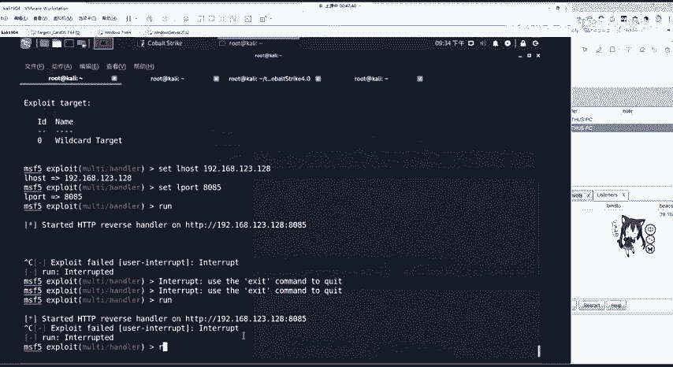

就 my has split。这边输入密码。Yeah。这开启转发之后，看一下有没有正确。就9就就OK那们现在哦，这个8085给搞错了，这边也要改。在的logo port等于9999。

runrun起来之后，我们将这个点击pon，选择MIF2类似的choose。

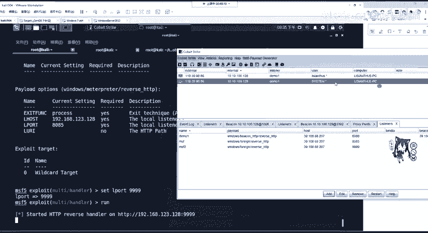

OK这边因为它需要经过一个远程发送，大家是不是看到这边mate session一op？哎，等一下，因为这个经过了代理是非常慢的，他需要SSH隧的转发。这里我们拿到mate了。

是不是可以getUID来看一下OK都能正常的一个执行。

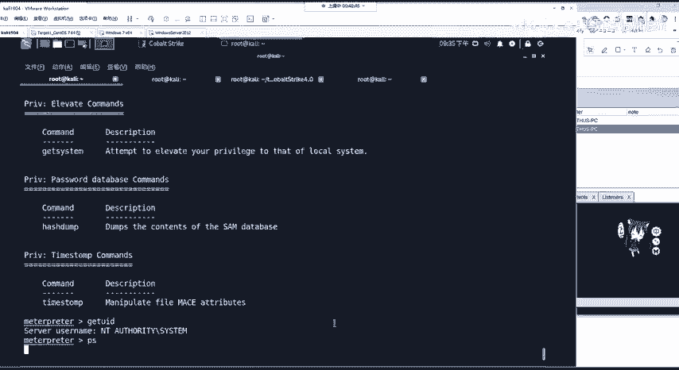

正常执行之后，我们还可以进行一个进程的迁移，或者是shall，去拿到它的一个shall。然后这断断码的话，可以CHCP65001或者直接什么都不干。这时我们是不是拿到了matetter？

就是一个能做更多的事情了。那这里大家有没有什么疑问，要需不需要呃再演示一遍？大家听懂了吗？这个过程就是将这一个上线的这个session去发送给我们的matetterpre。嗯，对的。

因为这些操作一般记不住的，没事，自己记不住，没问题，自己从头到尾敲一遍，绝对就懂了。绝对就会了，你再不懂，敲两遍肯定会。就是迷茫迷茫，再迷茫就懂了。这里我就给再大家再再演示一遍吧，那要不要？

用不用再演示一遍？hello，大家还在吗？😊，嗯，听懂了吗？这个将session去发表。行，那我再给大家讲一遍。那这个内网主机上线这个就。不需要了吧，这个就不需要了。

因为通过命令执行tack进行生成内网主机上线即可。那这里。我给大家就从这个主题上线这个地方来讲。主机上线进行提全之后，我们会拿到一个session。也就是sstemus的可以在这进行交互。

这是交互我们现在要干什么？想利用第二个神器，也就是mateap进行一个。

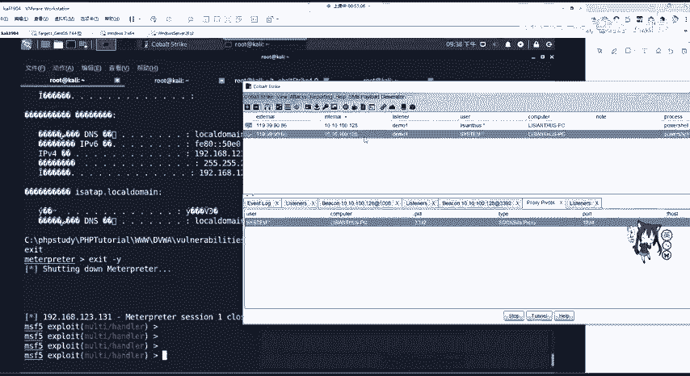

呃，利用拿到他的mpri。但是这个co strike所在的服务器在公网上面，而我们的MSF去接收matprint在内网中。我们公网是没有办法拼通内网服务器的，所以我们需要利用SSH做隧道转发。

这SSH隧道转发的命令，大家不需要记忆，只需要粘贴和修改。那这里我们对co strike这个都需要做一个。啊，内网的一个listson的创建。我们创建lister给大家演示。

首先co strike listeners。爱的。创建nameMSF3选择paload为外部拍lo的其中之一，可以选择外部HTTP。会让我们设置host地址和port端口。

这地址设置我们CS服务端所在地址39。108。68。207。端口自己去设置，推荐设置一个比较偏僻的端口，比如7777在。这时候我们在listers列列表就会看到我们刚刚创建的MSF3这个lister。

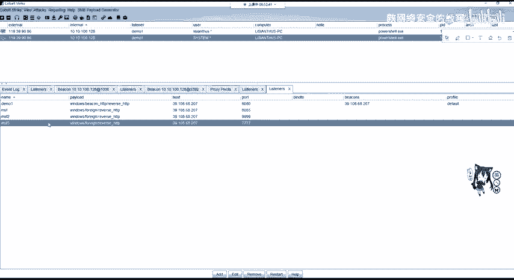

这个时候我们来到内网里面的MSF，这里大家应该都都会进吧，我就给大家再进一遍。

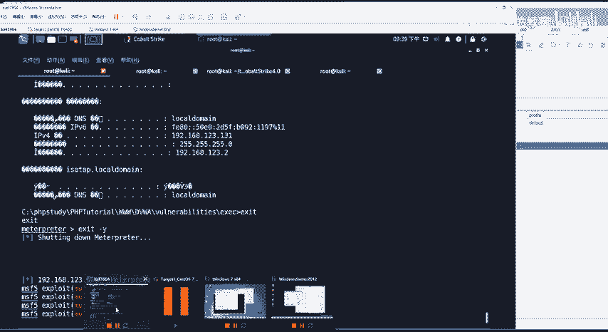

MSF concern。嗯。进到这个里面之后，我们需要创建一个hander等待监听，也就是usE叉P melt handle。去set它的一个拍load。喂和我们lister pilot一样的。

我们lister pilot是windows reverse h TTP那所对应的MSF的 pilot reverse TCP是HTTP是哪一个呢？也就是windows啊mate。加上reward。

爱HTTP。要保持一样。然后我们对palo进行配置，配置airhologo host为我们本地的地址，也就是卡里的这个地址。我这个卡里的地址是192。168。123。128。

那 setloc port和我们co strike所开启的MSF3list port要相相等，也就是7777。

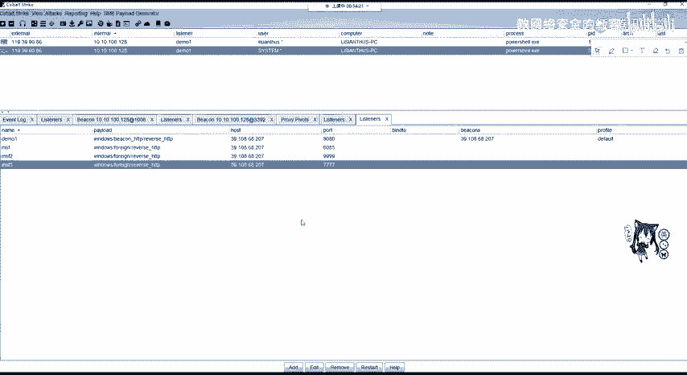

然后配置好之后，我们ron把它运行起来，在他立上面开启7777端口监听。这个时候我们的777和CS服务器的777并没有互通。我们需要进行SSH端口转发。如果大家SS专端口转发出现错误，想把它关闭的话。

可以使用NETSTATT杠ILTUP也就是查看list似的IN所有的，包括TCPUDP的协议，包括看它的PID。

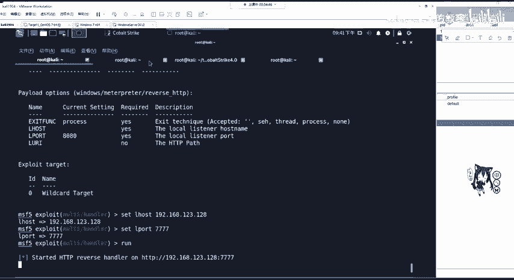

那这里我们先去看一下，发现我刚刚上一步上一次的时候，我们开启了1个SH服务端，它还在监听，我们可以把它关掉。它的PID叫做9517。我们Q杀死9517。就可以把它关掉。啊，他已经没了。他没了之后。

我们需要干什么？需要干做一个端口转发。0。0。0。0。如果配过IVPS安全组的时候，应该知道这叫所有地址。所有ITV4地址，我们需要对哪一个端口进行转发是不是7777端口，转发到哪里。

转发到我们本地监听的7777端口？使用哪一个SH是用转发root用户加上我们的主题地址端口SSH默认的是22，或者是你不加都一样。进行回撤，它会让我们输入root用户的SSH密码。大家通过自己自己。

这这里我这个密码是没输掉，可以通过自己VPS的密码输上就行了。说好之后，这个时候你再去NETSTIT去看一下哦，OOK这个时候已经连到了这边68207这边的1个ISH隧道。那这个连上隧道之后。

我们这个777端口和这边的CCS服务器端的777就已经连接完毕。连接完毕之后，我们想让这个session，也就是拥有高权限sstem权限的session，转换成我们卡利的mat printer。

直接右键点击spon，选择我们刚刚创建的listenerMSF3点击choose。

稍作等待。

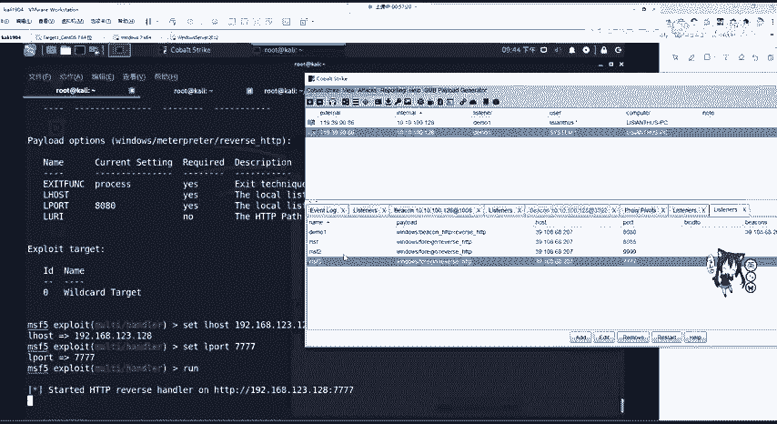

嗯。这边收到mate。稍作等待，因为它需要发送stage，因为我们生成的是stage的，而不是tage类piload，它需要进行一个tage发送。等待之后，我们拿到matetterpri。

这就可以利用周五讲的mattter split进行一个后视统的利用，包括代理的搭建等等。那这里大家应该。嗯，O。那这节课。内容就算讲完了，但是CS的功能还有很多，包括。我在给大家讲的那个。不是啊。这个。

被攻击的，你可以不让他提全。没有在没有在。没有的啊，你看他拦截的是什么东西。他拦截的不是没有用的东西啊。他拦截的是我们放在本地的一个缓存文件，没有问题的。你不提全也行，我可以把这个session。

我可以把这个session就把这个也也放过来，但你你你放到这边，你获取的mate是li answers这个用户的权限，你获取的不是最高权限。我们既然已经在这进行提全了。

为什么不直接获取这个高权限的session呢？这两个session都可以过来的，都可以过来的。都可以过来的。

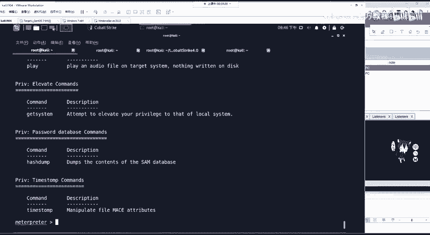

。OK那我们。拿到m print之后，这个操作。就很多了，就很丰富。当然CS还有刚刚讲这个用处特别多，啊，还有其他的一些东西，大家可以自己在后面自己去看一看，或者是用到什么。不是啊。怎么怎么不不行。

一键齐全的呀？他因为有这个漏洞吗？我这个。是有脚本的呀。他不是让你选择这个漏洞吗？比如USIC token啊。还有MS，如果是还有17010的脚本，它有这个漏洞才能提全。

那MS17010达到的就是这个最高权限呀，就是最高权限。它从administ切换到stem是没有问题的呀。但是我们这个从ACS不是自己创建这个用户去切换到system，你只能是靠漏洞去打。

打进去的最高权限。