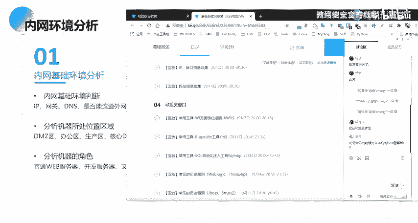
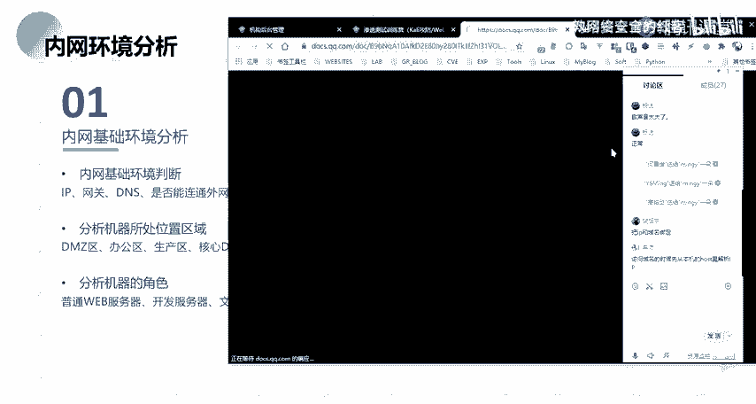
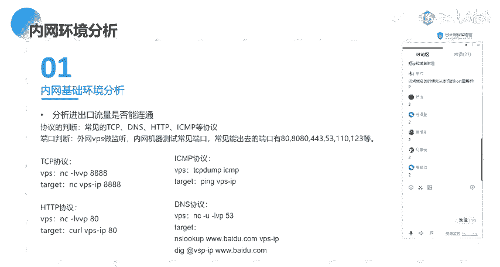
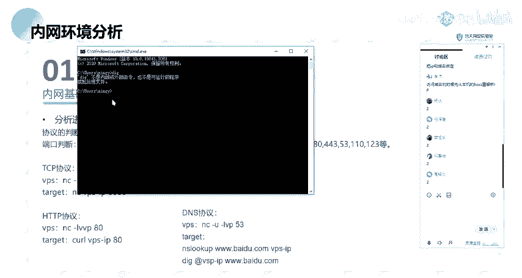

# 2024网络安全系统教程！清华大佬花159小时讲完的网络安全系统课！别再盲目自学了，学完即可就业！零基础入门网络安全！（渗透测试／漏洞挖掘／CTF／黑客技术） - P33：20.内网环境分析.mp4 - 教网络安全的红客 - BV1ft421A7Nj

话是给大家讲的是一个啊windows的一个主机信息收集。呃，稍等一下。Yeah。一个呃windows的一个主机信息收集。然后呃我们本节课的话主要分为这4块内容，就是呃会带大家去了解，分别的去了解这4块。

呃，当然的话呃，因为我们今天晚上的话，一个晚上是两个课时，对吧？我这边的话是把它的一个内容的话都是放在了1个PP当中。那的话呃我的一个计划的话呃，正常情况下面的话就是前面的两部分是呃第一个课时。

后面两部分的话分为第二个课时。然后第一部分的话就是一个内网环境的一个分析。第二个的话就是工作组的一个信息收集。第三个是域内的一个信息收集。第四个是内网的一个存舶探测。然后大家现在可能对这个没什么概念。

没关系，我们后面后面会详细的给大家做一个介绍。首先第一个就是内网的一个环境分析。嗯。呃。在讲这个内网环境分析之前的话，我先大概的介绍一下，就是说什么是内网渗透啊。就说可能大家刚接触这一块的话。

对这个没什么概念，对吧？就呃内网渗透跟呃渗透是有什么关系呢？对吧？就说我们前面在我们前面介绍的一些wordb相关的一些漏洞，对吧？那些呃，其实从我们的一个。课表课表的一个标题。

我们也能够去大概的知道对吧？我们前面的话就是说呃一个信息的一个收集。前期的这个信息收集的话，是为我们后面去寻找突破口做的一个铺垫，是吧？我们前期对相应的一些wordb站点。

还有以及服务器以及服务相关的一些呃信息的一个收集。为我们后面去寻找相应的一个突破口。这个突破口是呃什么意思呢？就是说我们在这边介绍的相应的一些wordb的一些漏洞，是为是为了我们后面要去做进一步的渗透。

这一个进进一步的一个渗透的话，就是涉及到我们的这边的一个内网的一个渗透，是吧？我们需要去通过这样子的一个突破口，就是说通过外网的这样子的一个wordb形式的一个突破口，来进入到内网。

然后进入到内网之后的话，我们才能够去说去进行我们的这样子的一个内网的一个渗透啊。而我们前面就是说通过相应的一些web漏洞，对吧？在拿到web share之后的话，我们需要去想办法得到系统的一个信息。

然后的话拿到它的一个权限，以及进入到网络系统的一个内部来去收集它内部网络的各种信息。获取相应的一些价值的一些资产人员的一些信息，是吧？然后在这边的话，我看我这边着重标红的就是重点的一个部分。

就内网渗透的第一步就是内网的一个信息收集。也就是说我们要去进行一个内网渗透的话，我们第一步要去做的也就是一个内网的一个信息收集。也就是我们本节课要去给大家介绍的一个内容。🤧。

然后再去进行一个内网信息收集之前的话，我们先来了解一下内网的一个环境分析。这个环境分析是什么？有涉及到哪一些内容呢？我们一起来看一下。首先第一个。内网的一个基础的一个环境判断。

我这边的话有列了这样子的一些点。首先我们呃大概的来看一下，对吧？IPIP的话呃，我们都知道我们的就是说我们的一个机器都会有相应的1个IP对吧？然后的话在内网当中的话。

我们需要去了解我们得到的我们进入到的这样子的一个内网的这一个机器。他的1个IP以及它IP相关的一些网段的一些信息啊，这些IP的话也就是我们要去呃收集的。

以及我们需要去通过这一些IP来去查找到其他的一些呃突破口。然后还有就是网关DNS等等的这一些的话都是我们要去啊就是说去了解它的一个内部网络的一个基础的一个就是它的一个大概的一个网络的一个结构。

以及还有的话就是能否去连通外网。也就是说我们得到的这样子的一个呃内部的内网的一个机器，它是否去能够去连外网。因为我们在内网的话，就是说内网跟外网之间的话，它是会有相应的一个呃就是阻隔的。

就大家应该有这样子的一个基本的就基本的一个概念。就是说我们的一个外网以及内网之间的话，它是会有相应的一些设备。像比如说防火墙对吧？有这样子的一些设备做一个阻隔。

就是为了防止我们就是说防止从外网能够去直接去访问到内网，对吧？然后一般的话就是说你从外网的话是无法去直接的去访问到某一个网络的一个内网。然后的话在内网的话呃，一般就是说一般的这种你比如说你在一个内网。

你在一个公司，你在这一个公司，你的一个办公区域的话，一般的话它是能够去从内网去访问到外网，对吧？当然的话有一些就是说一些特殊的一些区域的话，它是不允许去访问外网。因为呃你能够去访问外网的话。

它会给攻击者就是留下一个可乘之机，能够去呃进行相应的就是说一个呃通过就比如说如果打入到了它的一个内网的话，这一个内网，它的一个这一个区域的话是很核心的一些业务。比如说是它的一个生产区，对吧？

那么它能够去访问外网的话，那么我们如果打入进去的话，我们直接可以通过就说直接能够去利用它能够去访问外网的一个特性，得到它这个区域的一个呃权限，也就是一个需要，对吧？

然后的话还有个是网络的一个连接以及端口。就网络连接的话，就是我们需要去分析它的一些呃开放的一些端口，以及它这一个机器上面的话有哪一些IP或者说有哪一些呃机器来连接到了我的这个机器。

也能够去通过这样子的一个网络连接来去了解到你的这个机器，它所开放的一些服务以及端口。然后就是本机hot的文件。这个本机hot文件的话，其实呃。大家应该也。嗯。大家如果熟悉windows的话。

就是对这个应该不陌生，对吧？就我们在windows机器上面的话，会有这样子的一个host的文件。这个host的文件的话，其实就是做一个呃IP跟域名之间的一个解析的一个转换。啊。

大家对这个host的文件呃。了解吗？就说呃有谁能说一下这个文件它的一个作用。就如说它的一个在我们的一个windows机上面，它的一个作用是什么？呃，有谁能回答一下吗？把IP和域名绑定。啊。

我放在这边可能。啊，大家都能看得到。但是这边的话挡掉，放这边吧。啊，对呃，就是。这位同学的话，他是第一期的，就我其实前面的话也讲过，对吧？就是访问域名的时候的话，就说我们在本地机器。

我们要去访问去去访问一个域名的话，你的一个windows机器它去解析这一个域名的时候，它其实是会先从本机的一个host文这一个host文件里面去解析这个IP了。就如果说他在这一个host文件当中。

它找到了这一个域名所对应的1个IP那么它就会向这个IP去发起请求。如果说没有的话，他就会去找我们啊就是就近的一个服务商去他那边去找到，就是说就近有本地的1个DNS的一个服务器。然后的话去进行一个解析。

找到他对应的1个IP。然呃。还有的话就是机器的代理机器的代理的话，在这边的话呃就是其实大家呃就有去。这个怎么说呢？就说在你的一个内网对吧？在一个内网，你公司的一个内网，你想要去访问外网的话，是吧？

你可能你在本你在本机的话，它是无法去访问到外网是吧？那么我们想要去让这一个区域去访暂时的去访问到外网的话，那么我们可以通过这样子的一个代理而去进行一个访问。就比如说我们的一个就VPS是吧？

我们的一个啊就是呃科学上网工具是吧？你不能够去直接的去访问到外国的一些网站。那么我们通过这样子的一个代理的话，就能够去进行一个访问。然后在呃内网当中的话，也会有存在这样子的一些机器。就这一个机器的话。

它是有走相应的一个代理。就是说你的这一个机器它不能够去直接通外网。但是的话如果说它有配它有配置这样子的一个相应的一个代理的话。

那么我们可以去查找到它通过呃相应的一个命令去查找到它的一个代理的一个服务器的一个IP。来，然后的话我们就能够去利用他的这样子的一个代理来去进行一个初网。还有就是是否在域内，然后域名是什么？

这个域的话在这边的话，大家先了解一下。然后以及的话在就是说我们的一个预习资料的话，其实有给大家对吧？嗯。我这边的话。稍等一下，我找一下。

这边呃预习内容的话，在这边。Okay。有给大家就前面的话这边的话是呃第二个课时的一个内容哦哦是这点。呃，就是这一篇这一篇文章，就大家去看一下，就这一个我觉得这一篇文章的话，它讲的就是工作组和玉。

它的一个区别就讲的很详细了。就大家去看一下这一个文章的话，呃，先对他有一个大概的一个印象。然后的话如果你还不是很理解的话，我们在课程当中的话会一一的去带大家去了解。然后呃在这边的话就是在域内。

如果说在域内的话，那么就会去涉及到我们的域内的一个信息的一个收集。然后在这边的话呃第二个课时的话会给大家去介绍，以及它相应的一个域名。我们能够去呃查找到相应的一些信息。这是第一个。

然后第二个的话就是分析机器所处的一个位置的一个区域。这个的话从致名意思上面的话应该很好理解，对吧？就呃我这边的话也列举了一些像比如说DMG区办公区生产区核心DB等等这样子的一些区啊一些区域。

当然它这个区域的话，不是说绝对的它是一个就是相对的这样子的一个概念的一个区域啊，它没有说有很明显的这种呃界限，对吧？它是一个呃相对的一个概念的一个区分区。然呃在这边的话呃，这个DMZ区呃。

有有同学知道这个DMG区它的一个意思吗？啊，其实。呃，我第一期的话呃，第一期的同学应该知道吧。好不了。呃，有同学就是能。知道这个店G区是什么意思吗？就是它是一个什么样子的一个概念。呃，知道的呃。

知道的同学扣一，不知道的扣2。好。2。不知道的多一些是吧？好呃，大部分都不是很理解是吧？这边的话看一下。嗯。过的。以后。发放过。电方。帮我。啊对。诶。然后他就。哦，我这边的话直接。这里有单张。

我这边他直接呃百度吧，百度一下呃。我记得我有做一个比较好的一个笔记的，就是关于这个DMG的。我找了一下，发现没找到。然后这边的话呃，我们呃看这个百度百科吧，就这一个DM机的话。

它是呃一个比较特殊的一个区域啊，就这一个区域的话，它是有呃防火墙之间的一个空间称为一个DM机的一个区域。就在这个区域的话，一般的话，我们的像这样子的一些面向外网的这样子的一些外服务，对吧？

通常的话它会放到在放放在这一个区域当中，就它也可以称作为一个隔离区。就在这一个区域的话，它是我们内网的话，它是能够去访问到这个区域的。然后的话在外网的话也是能够去访问到这个区域的。

然后的话在这个区域的话，我们可以通过相应的就是说它有相应的一些配置的话，在这个区域的一个机器，它也是能够去访问到内网。当然的话通常的话不会去这样做。就是说这个区域的这种机器的话。

如果当的话也不是说就也有一些例外。就是说它的这个DMZ区域的呃这些服务，它需要去访访问到内网的一个资源的话，那么处于这个DMZ区域的这些机器的话，它是也是能够去访问到内网的。所以的话呃这一个区域的话呃。

就通常的话它是呃存放的，就是说放置的是一些面向外网的一些服务。然后大家只要去了解，就是说它这个区的话，在这个区域的一些机器的话，它是呃可能去就是能够去访问到内网。

当然的话也可能就是说它只能够允许就是说你从内网去访问到这个区，而不能够去访问到内网，以及还有相应的一个办公区以及生产区。就这这里的话就应该不用多说啊，就都能够理解。

以及核心地域的话就是说你的一些外表的一些业务，对吧？你的这一些啊服务器，这一些数据库的一些服务器的话，它是放在内网的。就是说他那些核心的一个数据的话，它存放在你呃内网的这样子的一个服务器当中啊。啊哦。

第三的话就是分析机器的一个角色。机器角色的话，我这边也有列了相应的一些角色，就是说我们要去大概的去了解我们得到的这个内网机器，它所扮演的一个角色，就比如说它是一个它只是一个普通的一个web服务器，对吧？

它就是一个面向外网的一个wab服务里面的话有相应的一个网站啊，对吧？等等的这样子的一些服务，然后还有就是开发服务器，就是说我们的一个开发者我们的一个程序员他的这样子的一些相应的一些呃开发的一些代码。

对吧？等等的，它会存放在这样子的一些服务器，以及还有文件服务器，就用于存储我们的一些文件，对吧？还有代理服务器。就是说我们通过啊这一个服务器的话，它就是一个代理。就我们通过这样子的一个代理的话。

能够去访问到其他的一些呃呃网络。还有DS的一个服务器，就是做一个域名解析，还有数据存储服务器等等。在这边的话呃大概的了解一下，就介绍一下。然后我们了解这个角色的话。

其实就是说我们去判断我们所得的这个机器它是一个什么样子的一个呃服务，对吧？然后的话这一些服务的话，有存在什么样子的一些信息，或者说它的这一些呃在这个服务器上面的话。

我们能够去得到什么样的一些关键的一个信息来去进行下一步的一个呃利用，对吧？像比如说你的一个普通的一个web服务，那么你web服务的话，你的这个服务，它是否有相应的，比如说你的一个数据库账号密码，对吧？

你web的一些管理员的一个登录的一些密码信息等等。以及还有就是你的开发服务器对吧？那么这个服务器上面的话，存放着相应的一些呃站点。你的一些呃所开发的项目的一些代码等等，对吧？文件服务的话。

就是存储的相应的一些文件嘛。就可能的话就是有一些敏感的一些文件。等等。好呃，以及第四个的话就是分析进出口的一个流量是否能灵通。呃，这个的话。这个的话就是其实就是我们前面提到的，就是说是否能够去联通外网。

对。在这边的话，我们为什么要去分析是否能够去就是说我们的一个进出口的一个流量是否能够去连通外网。就如果说我们得到了这样子的一个机器，对吧？然后的话这个机器的话，它是呃，在内网在内网当中的话。

它无法去连通外网的话，那么我们就无法的无法去得到这一个呃机器的一个需要，对吧？我们不能够去反弹线，啊，当然的话可以去进行一个正向需要嘛，那么我们的这个机器如果说它不能够去连通外网，然后的话我们无就是说。

如果说我们要以这个机器做一个跳管机来去攻击内网的一个其他的一些机器的话，那么我们去进行相应的一些操作的话，可能会呃就是不太方便。然哦以及我们要去判断，就是说我们什么样子的一些流量。

就是说什么样子的一些协议的这样子的一些呃流量能够去出网。那呃，在这边的话，其实我们一般的去考虑的，就是说我们的在这个机上面能否去就是说去出网，对吧？其实呃。

在这边的话就是呃重点的话就是去呃关注能否去出吻嘛，对吧？就是说再去进行针对这种进网的这种的话，我们是呃对我们的话是意义不大的。啊。然，在这边话，协议的一个判断的话。

就常见的就像TCPIDSHDBSMP等等的这样子的一些协议。就针对这些协议的话，我们能够去有相应的一个呃反谈西尔啊，或者是说能够去进行呃进一步的一个呃利用。然后还有的话第二个话就是端口的一个判断。

就端口判断的话就是我们去测试这个内网机器，它常见的这种端口，就是说能否去进行一个出网。就我们能否通过这样子的一个端口。像比如说80的一个端口去进行一个出网。也就是说在这个内网机器。

它能否去访问到外部的1个80的一个像这种外部服务，对吧？然呃我们那么我们如何去进行一个相应的一个判断呢？在这边的话，我就大概的列举了这样子的一些。呃，方法就针对这样子的一些协议啊，针对TCP的话呃。

我们常用的话就是用NC嘛，是吧？我们要去测试他是否能够去进行去进行这样子的1个TCP的一个协议的一个初网。那么我们可以通过就是说呃上传1个NC。但的话在这边上，如果说是windows7器的话。

我们是呃就是通过NC啊但的话呃。我们需要首先需要去上传这样子的1个NC。然后的话用NC来去呃连接我们的一个公网的一个机器的某1个IP地址对吧？然后的话如果能够去灵通的话。

那么能够去大概的判断它是能够去呃通过TCP的一个协议来去进行一个呃出网的。还有的话就是HDP的话就是我们的一个未宝服务嘛，对吧？就是一个8年的一个端口。也是同米是吧？好，当然的话。还有的话就是IMP。

也就是我们常用的一个拼就聘命令，它就是一个IMP的一个协议啊。那么我们通过这样子的一个聘聘我们这边的一个IP地址。然后在我们那个PSPS上面的话。

我们使用这样子的一个TP调这个TCP调的话就是一个抓包的一个工具啊，就我们可以通过TCPd来去抓取我们的呃这样子的一个流量。然后我们去聘这样子一个IP的话。

我们可以通过TCPd来去抓取呃来去聘我们这个机器的一个流量。这个的话其实呃TCB电盘话就相当于就是一个Ysh一样子的一个抓包的一个工具。当然的话肯定没有Ysh那么强大嘛。

就说它是一个命令函的这样子的一个工具。然后还有就是DNS的话，就是我们的一个域名解析。域名解析的话，我们常用的像在windows的话，就是说通过这个NSlook up这样子的一个方式来去进行一个呃测试。

还有对这个第个。啊，当然的话这个地个面令的话呃，看一下。

呃，D格命的话，它不是一个啊就是在windows里面的话，它不是一个内置的一个命令。就是说在linux上面的话，它是啊能够去使用这样子的一个D格的一个命令。

就在windows上面的话，我们就使用这个NS lookminux上面的话，我们可以使用这个dig。啊。然后呃在这边VPS上面的话，我们可以通过NC去今听我们这样子的1个53的1个端口。

就这1个53的话，就是我们DS的一个呃协议的这样子的一个默认的一个端口。

一。