# 2024网络安全系统教程！清华大佬花159小时讲完的网络安全系统课！别再盲目自学了，学完即可就业！零基础入门网络安全！（渗透测试／漏洞挖掘／CTF／黑客技术） - P34：21.工作组信息收集.mp4 - 教网络安全的红客 - BV1ft421A7Nj

呃，关于以上这你的一个内网环境分析的话，大家能理解吗？有有没有什么疑问？应该能理解吧，这边的话就是一些啊。稍微概练性的一些东西，带大家呃理解一下。上诉人。不是要。好呃，大家不回的话，应该是理解了呀。

对呃就是我我我在这边我问问问问大家问题的话，大家还是回答一下，就是给个反馈。就如果你就是觉得没问题，你就扣个一嘛，对吧？呃，我们在这边的话。需要拿到内网需要。呃。你可能还是没有。

就是说我这边在这边有讲是吧？我在这边讲的话就是一个内网的一个渗透。然后的话你要去进行一个内网，渗至的话我刚刚不是讲了嘛？就是说你要去进入到内网的话，你需要通过相应的一些呃需要有这样子的一个路径。

就说能够去访问到你的一个内网。然后我们要去访问到一个内网的话，我们就需要有相应的这样子的一个入口。这个入口的话，就是相应的。比如说这样子的一个we shell。这个外部需要的话，我们什么意思呢？就是说。

比如说你一个公司对吧？你一个公司，你相你有相应的这样子的一些。针对外网的一个服务。这些服务的话，比如说就是一个普通的一个网站的一个外表服务，对吧？然后这一个外网服务的话，你拿到了它的一个需要。

也就是说你拿到了他的一个机器，这个服务器，它的一个需要。然后这个需要的话正好它是能够去访问到内网的。嗯。Okay。我这边发口水。Okay。它正好是能够去访问到内网。那么在这里的话，在这个时候。

你只有能够去访问到内网，你才能够去进行一个内网的一个渗透。然后的话你去去进行一个内网渗透的话，那么你才你的第一步就是一个内网的一个信息收集。也就是我们在这边。所讲的。

去对这个内网去进一个基础的一个环境分析。也就是说你前提的话，你就是需要有这样子的一个突破口，有一个路口能够去访问到内网。当然的话具体一点说的话，就简单点说的话，你也可以说就是拿到呃进入到内网的一个需要。

而不是说拿到内网的一个需要。就这里的一个需要的话，是可以是一个外网的这样子的一个服务器，对吧？这个机器的话，它正好是能够去访问到内网的。呃，这边的一个就是说我这边所刚刚所说到的这个web服务的一个机器。

对吧？这个机器的话，你可以把它理解成是一个跳板机。啊，就是我们通过这个跳板机的话，就能够去访问到这个内网，对吧？没理解吧。而而而不是说是内网的这样子的一个服务器啊，就说这个机的话。

它其实是你在外网是能够去访问到的。能理解吗？他有。呃。就比如说。

比如说我这边的这一个机器对吧？我这一个机器的话，我就呃运行了一个work服务，对吧？然后我这边的这个机器的话，我假设这边它是一个外网，一个外网，对吧？一个外网IP。然后的话我从外网去访问这个IP的话。

我我就能够去访问到运行在这一个机器上面的一个服务，对吧？然后的话我通过这个服务，通过这个服务拿到了这个机器的一个需。拿到这个机器卸了之后的话，我们可以发。

如果说恰好他有这样子的一个能够去访问到内部网络的这个。比如说这个10。10。10这个网段的这一个网卡。就一般的话你去访问到你要去访问到，就是说啊不同的网段的话，你需要有这样子的一个网卡，对吧？

就是说你需要有这样子的跟他同网段的这样子的一个呃IP。那么我这边得到了他一个需要，那么我就可以通过这一个机器来去访问到这个10。10。10的这一个内部的一个网络，对吧，能理解吧？

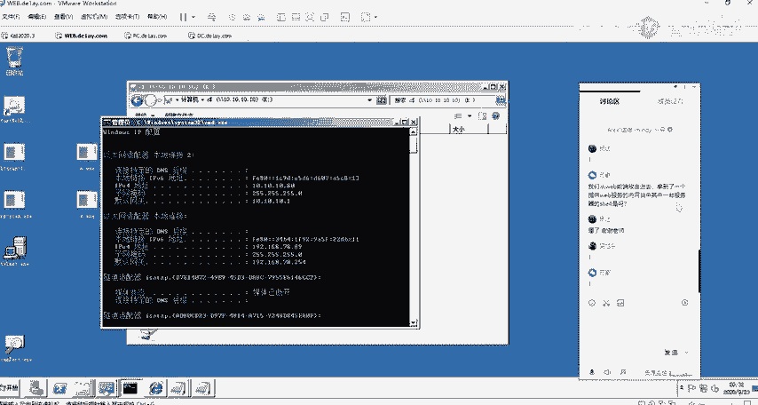

好，应该能你讲。呃，这边的话就是呃关于什么是内容声的话，刚刚给大家介绍了。那麦可能检测到端口是否开放。呃，端口开放无法访问的话哦，有啊，就是说你的你你不是说所有的端口都能够去给你直接去访问到的，是吧？

呃，他的这个机器的话，它有做这样子的相应的，就是说对这个端口有做这样子的一些呃性质策略，就是不允许你去访问的话，你是它它的这个端口虽然开放了，但是的话你是会就扫不到的。

就呃前面讲rap的一个端口的一个扫描状态的话，应该给大家有介绍吧。就是说他有呃5种5种状态吧，就是开放呃，关闭过滤，还有还有什么什么什么的，我有点忘了，大家可以去回顾一下蒋要要补的一个内容。

就应该是端口信息收集的时候有给大家讲了。当哪。好，然后我们继续。好，下面的话就是给大家跟大家一起来了解一下是工作组，什么是工作组。呃，这边的话我这边念的内容的话有点多，在这边就是带大家大概的了解一下。

我这边念的一个内容的话，不是说呃我是这边就是直接在课上给大家读给大家听啊，就是说到时PPT给大家，就是主要是给大家看的。我这边的话就是大概的带大家就是了解理解一下它，好吧。有呃工作组的话。

它就是一个就是最简单的最普通的一个资源管理模式，就是将不同的一个电脑按功能分别列入到不同的一个组中，以方便管理。我这边他是摘的那个百度百科的。就呃我们怎么去理解呢？就我们的一个默认情况下。

所有的一个计算机，它都是处在一个名为work group的一个工作组中。就这个work group，它其实就是工作组的一个意思。就我们呃我们的一个电脑，我们去连接一根网线，对吧？连接这个网线之后的话。

你在公司你去连接连接网络之后的话，它就你的这个机器的话，它就会自动的去加入到这样子的一个呃work group的一个工作组当中。就是在这边我们可以看到，就大家如果在电脑旁边，你可以去打开呃。

就啊右键此电脑。右键池电脑，然后就是属性嘛，属性在这边的话。呃，属性这边的话，我们在这边不是有这样子的一个计算机名域工作组嘛，对吧？在这边有显示相应的一个信息。在这边话就是这个是我的一个计算机名对吧？

然后呃这边的话就是我的一个工作组。是吧。就默认的话，它是在work group的一个工作组。我们在这边的话可以去更改哈。得去更改它。然后我。以及如果呃在后面刚才讲域，就是说我们去把我的这个机器。

把这个机器加入到一个域中。这个的话后面会介绍。然呃第二个的话就是。他的这这样子的一个管理模式，就是适合网络当中计算机不多。然后的话对管理要求不严格的一个情况。

就是说适合就我们普通的这种呃就是一般的这种小规模的一些公司，对吧？你不需要去对啊每一个接入到网络当中的这个计算机去做一个管理。就呃默认的话，它就是使用了一个work group的一个工作呃。

还有其他的话，这边的话我就不一的去说了。然后呃在这边的话给大家介绍这个的话，其实就是呃为了与我们后面去讲的这个域去做一个区分啊。以及还有这里有一点就是不同就是相同组中的一个不不同用户。

就可以通过对方主机的一个用户名和密码来去查看对方共享的一个文件夹。就默认共享的话，它是一个优者式的一个目。就是说我们在同一个这样子一个高普的一个工作组当中话。

我们想我们可以通过呃对方的一个组机的一个用户名密码来去查看它共享的一个文件夹。就是说在这边我们的。跟我们好。啊对。那我们在这边的话会有这样子的一个网络，对吧？这里的一个网络的话。

当话呃如果你第一次那个的话，你点这边的话，网络它会在这边会有一个黄黄条啊，就是你需要去开启，就是呃发现这一个网络共享。嗯。就是。就这个你需要去启用它的一个网络发现。

我才能够去啊去发现在同一个组当当中的这样子的一些啊机器。哎。对个。然呃在这边的话，我们在这边网络的话，我这边呢是打开了。然后我们在这边的话，我就能够去发现到我的这一个工作组当中。

也就是work group工作组当中有这样子的一些机器，对吧？这些机器的话这边的话就是它的一个主机名嘛啊然后的话我们就能够去呃去进行一个访问。当然的话我们访问的话。

你首先的一个前提就是说你需要去啊知道它的这样子的一个呃。用户名以及密码。然后的话你知道他一个用户名密码的话，你就能够去查看到他的一个呃这个用户的一个优者目录。就说这个用户。

你这边登录的这个用户目录下面的一个文件夹就能够去访问了。然后他就。第一个。然后还呃下面的话就是。嗯。下面的话就是本机的一个信息收集。呃，在这边的话，我这边的话念了这样子的一些啊。

就是呃我们后面的话会一一的去有介绍。就这边的话，大家大概看一下，我就不一的去呃给大家解释了。啊，主在这的话。着重说一下这个就是如果是域内的一个主机的话，那么操作系统还有应用软件补丁服务等等这种刷网。

一般的话它是批量安装的。就是说我们的在一个域，就是说域当中的这样子的一个机器的话，因为它的就是说我们去使用这样子的一个域的这样子的一个管理模式的话，就是说我们是面向于那些就是说啊你的一个主机数数目很多。

呃，想问一下什么是玉，这个的话，待待会会有介绍。Yeah。这个的话先呃知道这个当会人有介绍，好吧。然后的话就是说如果说我们要去管理到管理很多的这样子的一些机器，对吧？

比如说呃这一个机器它存在存在这样子的一个，你想要去安装一个服务，安装一个软件，对吧？那么我们我们不可能说对整对所有的，比如说你的这一个网络结构当中的几百台的一个机器上面一一的去进行一个登录。

然后的话去安装，对吧？这样子的话，就是不太现实的。就是说我们如果说是把这样这一些主机的话，它是在域内，那么我们我们会有这样子在域内的话，它会有这样子的一个角色预控。

然后的话在呃我们就能够去通过这个预控的这个主机来去进行一个批量的去安装在呃这一个域当中的这样子的一些主机来去啊安装它的这样子的一些软件。因为预控的这样子的一个预控的话，它能够去管理。

在这个域当中它所有的这样子的一些主机。那么我们就能够去批量的去管理他的这样子的一些软件，以及补丁啊等等沙网的这样子的一些安装以及啊管理。

然后下面的话就是我们呃正式的一个工作组的一个信息收集相呃相应的一些内容。所以第一个话就是内网网段的一个信息收集。呃，内网网段的话呃，我们去收集它的一个内网网段。

它的一个意义的话就是为我们去进行一个纵向渗透，做一个准备。就是呃在这的话有涉及到两个概念，就是纵向渗透以及横向渗透。就我们知道纵向的话就是。一了。嗯是。就纵向的话就是这这样子嘛，对吧？

横向就是这样子对吧？那么我们。横向这的话，什么意思呢？就是说比如说我这边拿下一个主机，对吧？拿下一个主机是10。10。010的这样子一个网段。那么我们要去横向渗透的话。

就是说我们针对这样子的1个10这个网段。这个因为我们拿下这个主机的话，它能够去访问到的一个网段的话，就只有10这个网段，对吧？那么针对这一个网段的一个机器的话。

我们能够通过这个机器做一个跳板来去进行一个访问。那么我们就能够去进行一个横向的一个渗透，来去渗透这个10这个网段的一个机器。对吧那么纵向渗透的话就是说针对不同的一个网段，对吧？

比如说我还发现有这样子的1个10。10。11的这样子一个网段，对吧？那么我们的这样子的一个机器的话，它是无法去直接访问的对吧？但是的话我通过这样子的一个横向渗透，发现有有某一个机器。

有有这样子的一个机器，它是1个10010，比如说10010的一个。20的这样子一个机器，它有两个网卡。然后他有一个网卡的话是10。10。11。20是吧？那么我通过这一个机器，这个机器的话。

它有这样子1个11的网卡，能够去访问到这个机器，对吧？那么。我就能够去以这一个机器做一个跳板，还去呃纵向的去渗透这个11的1个网站。同理的话，我们还可以去有其他的一些网站嘛。

这这个的话就是纵向的一个渗透嘛，对吧？就是纵向的。那你。然后呃我们去找到不同的一个网段，我们才能够去进行一个纵向渗头，是吧？因为我们需要去知道有哪一些呃网段是能够去进行一个渗透的。嗯。

然后呃网段信息收集的话，我这边大概列了这三点，就第一个就是内网网站的一个扫描，对吧？就是啊你对这一个内网网站去做一个扫描，去扫描它存活的这样子的一个网段。

然后第二个的话就是对这样子的一些文件共享FTB的一些连接记录，还有你浏览器的访问记录，还有你啊你的一个远程桌面的这种连接记录。我们通过这样子的一些记录来去发现不同的一个网站。🤧嗯。

像比如说呃我们的一个浏览器访问记录对吧？你在内网的话，你在内网的一个机器上面的话，呃，它可能会有相应的就是说一些服务，对吧？你需要去去访问，访问到内网的一些呃网段的所开放的一些服务。

比如说是某一个网段它的一个外围服务。那么你在浏览器当中的话，你去访问的话，它会有相应的一些记录，对吧？还有的话就是FTP的一个连接记录，以及呃就比如说。我这边对吧。就我们在比如说我们通过资源管理器。

对吧？FTP你去连接，对吧？我这边输入FTP的话，我在这边能就能够去发现有这样子的1个FTP的一个连接记录，对吧？还的话像MSTSC的话，呃，就是我们的一个。我们那个远程桌面的一个登录嘛，对吧？

就呃你可以去发现有这样子的一些就呃我这边通过这一台机器去登录的这样子的一些网段，对吧？那么那么的话我们在这边的话，我们去呃，就说他有这样子一个记录的话，就意味着他的这个机器的话是有可能去访问到。

能有可能能去访问到这样子的一些IP的，对吧？横向渗透是整个1一段渗透的。就是说呃你横向的话就是说其实这个横向的话不是说呃只一个C段嘛。

就是说你的你通过你的这个跳板机能够去访问到的其他的就是说这样子的一个机器，你都属于是一个呃横向渗透网，对吧？然后的话你通过横向渗透，拿下的这样子的一些机器。然后的话你还发现有其他的一些网段。

就是说你通过这样子的一个跳板机，原先的这边这一个跳板机，你无法去访问到的这样子的一个机器，对吧？但是的话你通过横向渗透，拿下的其他机器，能够去渗透这样子的一个原本这一个机器，它无法访问的这个机器。

那么这个就算属于是一个纵向的一个渗透啊，就横向渗透的话，你不要局限是于说只是这个要连这一个C段，对吧？你只要是你这一个机器能够去访问到的这样子的一个网段，你都属于你都能够去直接的去进行一个渗透嘛，对吧？

这个的话呃大家思路放。开一点，就是不要太局限。还就是路由器交换机等等呃，这样子的呃，就是说在这些路由器交换机上面的话，有相应的一些就是呃网络的一些配置，对吧？

那么的话它会有记录的相应的一些呃不同的一个呃网段。好呃，然后第四的话就是用户的一个信息。呃，在这边的话。

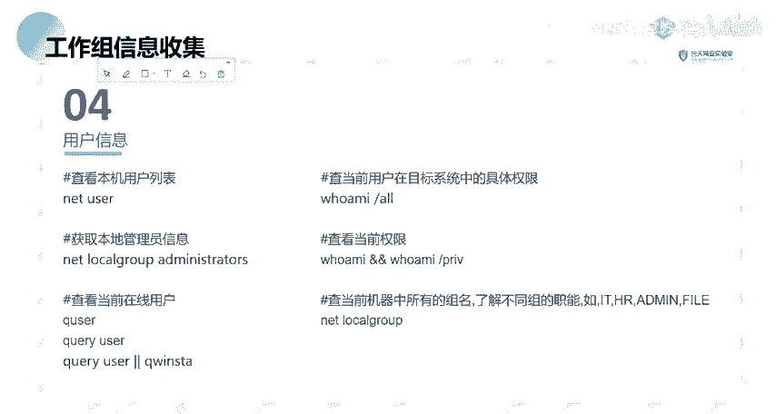

呃，在这边我去演示的话，我通过。

就啊我就是。通过这1个CS吧。就是。我这边的话呃再去进行一个演示的时候的话，我这边先说明一下，就我这边的话是已经拿到了一个机器，拿到了一个机器的一个需要，是通过CS拿到的啊。

然后的话这一个机器的一个需养的话。嗯，我这边的话就是这个靶靶场，就我这边的话已经通过了一个他的一个外表漏洞，拿到这个机器的一个线。

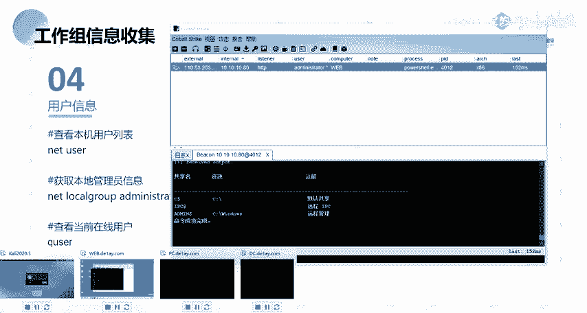

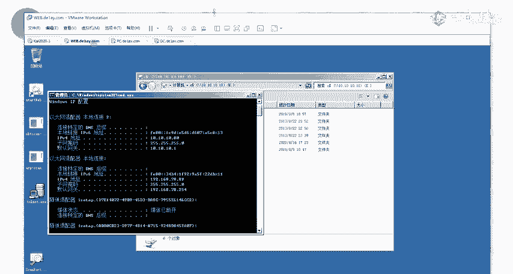

然后的话我在这边的话，我是呃我后面的这样子的一些就是说这些信息收集的一些命令，我都通过这样子的一个方式来去给大家演示。Yes。就呃如果大家没有这样子的的话。

你就是说你直接其实直接就是说你自己的1个CMB是吧？作为一个你得到的一个需。去进行一个操作。就在这边的话，其实就是一些命令的一个意思。就是说我们通常会去使用这样子的一些命令。

去收集我们想要的这样子一个信息。好，首先第一个就是这个net的。那些腰枕的话，大家应该都是常进也是常用的对吧？嗯，哎那个。啊，是的，因为因为我这边的话是搭在内网呀，我这边的话肯定是一个内网的一个网段。

内网用的一个内网的1个I啊。

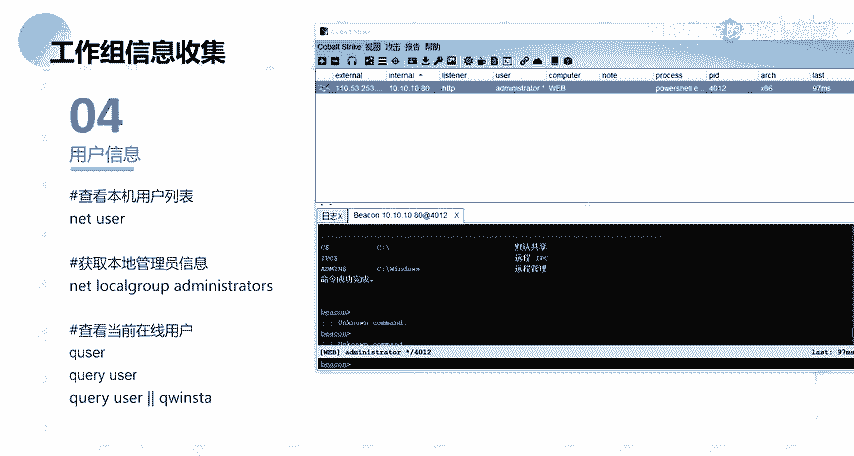

但是的话，如果说你这个机器它是一个外网的一个机器的话，你会有这样子的一个就是外网的1个IP啊，你才能够去访问到这个机器嘛，对吧？因为我这边的话是一个把机啊，不是不是说一个真实的一个外网的一个机器啊。

能理解吗？就你把它在这边你理解为1个外网的1个IP嘛。然后这个的话是一个内网的1个IP嘛。

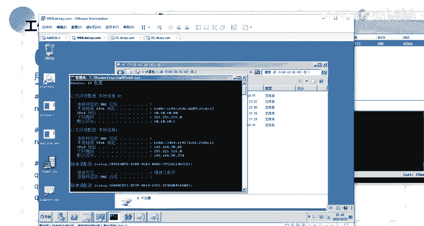

然后这一个n1的的话呃就是。是大家比较熟悉的一个面，对吧？就是大家玩问的时候的话，应该都知道，就是我们通过net user来去查看到当前呃，就是说他有这样子一个记录的话。

就意味着他的这一个机器的话是有可能去访问到能有可能能去访问到这样子的一些IP的对吧？

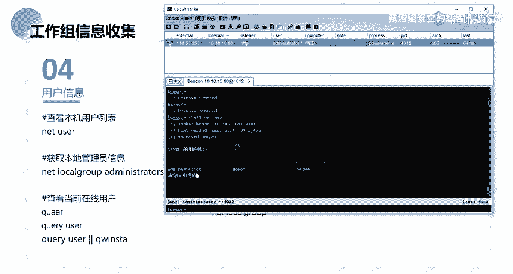

Okay。横向渗透是整个C一段渗透的。就是说呃你横向的话就是说其实这个横向的话不是说呃只一个C段嘛，就是说你的你通过你的这个跳板机能够去访问到的其他的就是说这样子的一个机器，你都属于是一个呃横向渗透嘛。

对吧？然后的话你通过横向渗透拿下的这样子的一些机器。然后的话你还发现有其他的一些网段，就是说你通过这样子的一个跳板机，原先的这边这一个跳板机，你无法去访问到的这样子的一个机器，对吧？

但是的话你通过横向渗透拿下的其他机器，能够去渗透这样子的一个原本这一个机器，它无法访问的这一个机器，那么这个就算属于是一个纵向的一个渗透，啊，就横向渗透的话，你不要局限是于说只是这个要连这个C段，对吧？

你只要是你这一个机器能够去访问到的这样子的一个网段，你都属于你都能够去直接的去进行一个渗透嘛，对吧？这个的话呃大家思路方。开一点，就是不要太局限。还就是路由器交换机等等呃，这样子的呃。

就是说在这些路由器交换机上面的话，有相应的一些就是呃网络的一些配置，对吧？那么的话它会有记录的相应的一些呃不同的一个呃网段。🤧嗯。好呃，然后第四个话就是用户的一个信息。呃，在这边的话。呃。

在这边我去演示的话，我通过。

就呃我就是。

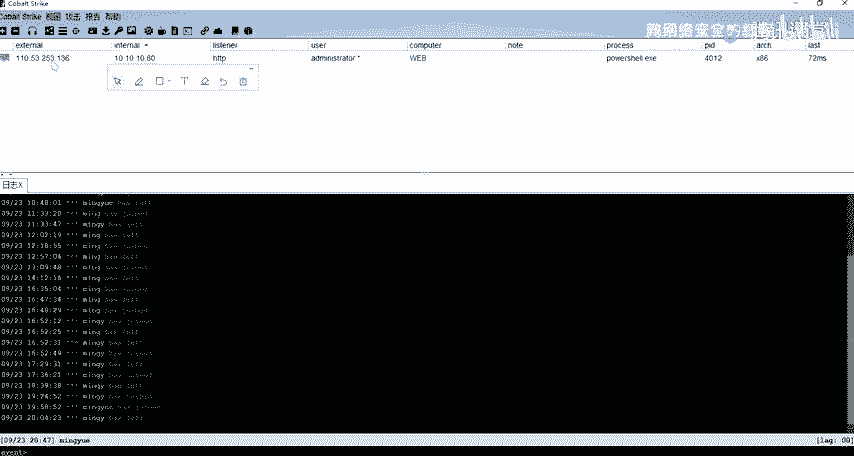

通过这1个CS吧。就是。我这边的话呃再去进行一个演示的时候的话，我这边先说明一下，就我这边的话是已经拿到了一个机器，拿到了一个机器的一个需要，是通过CS拿到的啊。然后的话这一个机器的一个需要的话。嗯。

我这边的话就是这个靶靶场，就我这边的话已经通过了一个它的一个外表漏洞，拿到这个机器的一个线。

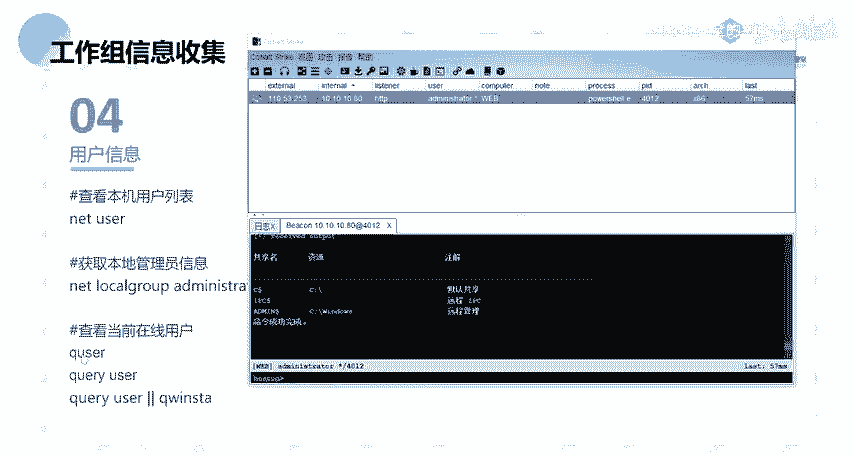

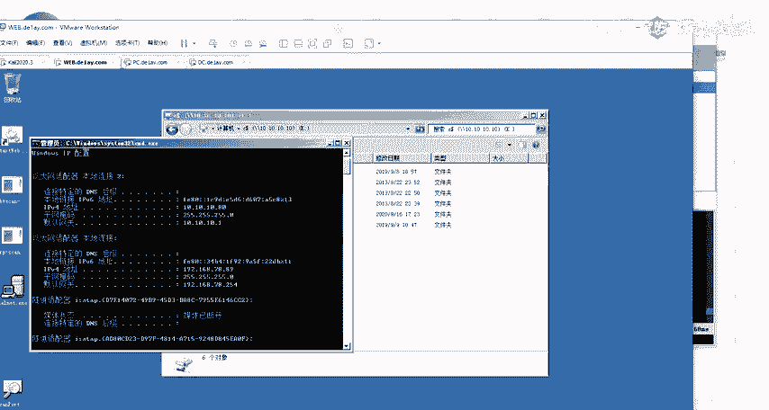

然后的话我在这边的话，我是呃我后面的这样子那些就是说这些信息收集的一些命令，我都通过这样子的一个方式来去给大家演示。就呃如果大家没有这样子的的话，你就是说你直接其实直接就是说你以自己的1个CMD是吧？

作为一个你得到的一个需。去进行一个操作。就在这边的话，其实就是一些命令的一个意思。就是说我们通常会去使用这样子的一些命令，去收集我们想要的这样子一个信息。好，首先第一个就是这个nE的。那些腰枕的话。

大家应该都是常进也是常用的对吧？呃，哎那个。啊，是的，因为因为我这边的话是搭在内网呀，我这边的话肯定是一个内网的一个网段，内网用的一些内网的1个I啊。

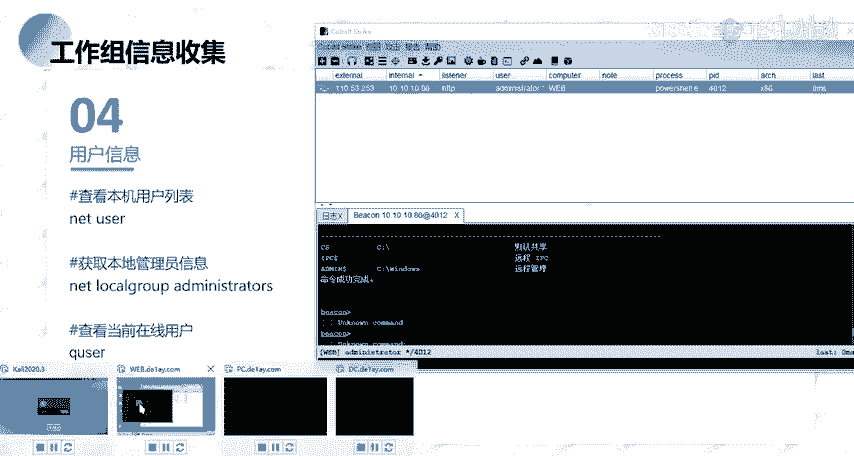

但是的话如果说你这一个机器它是一个外网的一个机器的话，你会有这样子的一个就是外网的1个IP啊，你才能够去访问到这个机器嘛，对吧？因为我这边的话是一个把机啊，不是不是说一个真实的一个外网的一个机器啊。

能理解吗？就你把它在这边你理解为1个外网的1个IP嘛。然后这个的话是一个内网的1个IP嘛。

。然后这个ge腰枕的话呃就是。是大家比较熟悉的一个命令对吧？就是大家玩问的时候的话，应该都知道，就是我们通过net user来去查看到当前计算机上面有哪一些用户，对吧？

这句的话我们能够去查看到它的一个用户。然后还有就是呃获取本地的一个管理员的一个信息。在这边的话呃，我们就是大家应该也去使用过，就是说我们把我们自己的一个呃用户对吧？加入到我们的一个本地管理员组对吧？

就是这个local group这个组当中，那么我们要去查看到这一个本地管理员组当中它有哪一些用户，也就是有呃哪一些用户有一个管理员的一个权限，对吧？那么我们可以通过这一个命令。

通过这一个命令来去查看到这一个add面组，就是管理员用户组当中的有哪一些用户。在这里的话有这样子的三个用户啊是吧，那么我们就能够知道在这三个用户的话，它是有一个管理员的一个权限的。

然后就是呃查看当前的一个在线的一个用户。在这的话，这三个命令都能够去查看。Cioio的。就哦在这边的话，我们可以看到就是当前的话有这样子的一个用户，就是有一个ad面的一个用户。

他是处于一个登录运行的一个状态。然后其实我们可以看一下。我当前的一个用户的话，其实就是一个的面的一个用户。

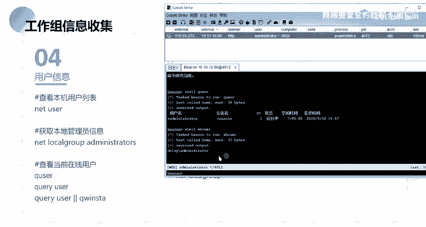

然后我我这边的话呃，我这边的话也是一个面的一个用户。

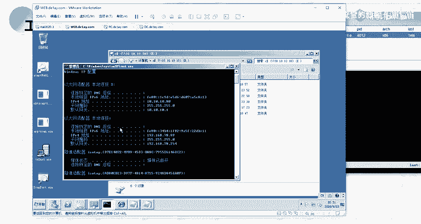

是吧。然后还有其他的一个呃，其他的几个面的话，他的一个结果的话都是一样的。啊，我就唯一的去演示了。呃，啊，对了，其实。在讲这个之前的话，其实我还是要说一下，就问大家一下，就是大家对这一些的话。

对这些命令的话，大家呃知道吗？就如果说大家知道的话，我这边的话就带大家只大概的过一遍，我就不我就不去呃操作，然来去让大家看一个效果了。啊。大家对这样子的一些定的话呃能了解？有了解吗？是。呃，了解的扣一。

不了解的扣2，好吧。没有了解。就是呃需要呃，我这边。操作一下，给大家看效果是吧？好，其他同学呢？呃，大家呃。一是有了解是吧，知道几个简单的。直到个别。好呃，那我那我这边的话就是呃就是我大概的操作一下吧。

其实也是一些比较基础的一些面料。我大概操作一下，然后的话可能就是。windows不了解。呃，你不用windows了吗？你你日常的一个就是日常使用的一个系统是lining1，对吗？

windows的话应该就是呃大部分的同学的话应该呃用的使用的应该是windows，就是日常使用的话，对吧？然，那么我这边的话我就呃我就不会去不细讲了吧。然后的话我这边的话就就是比较快的给大家操作一下。

演示一下，好吧。

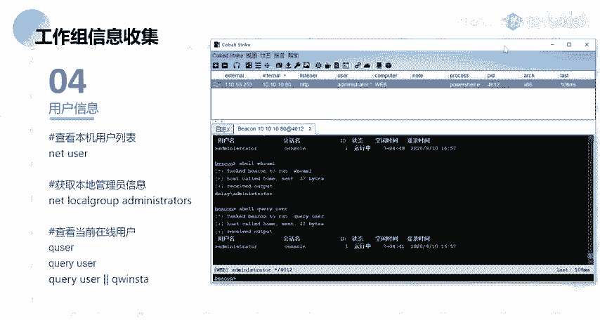

因为呃这个的话，其实大家自己去课后的话去呃操作演示的话也是一样的，好吧。

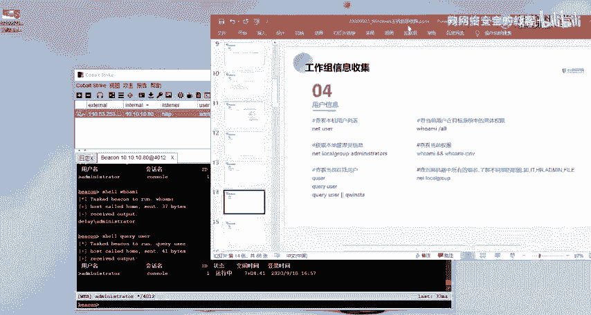

我这边话就大概的。过一下。好，我，查看当前用户在目标系统当中的一个具体的一个权限。O的哦。呃，我这边的话先呃大家先休息一下吧，好吧，先休息一下。

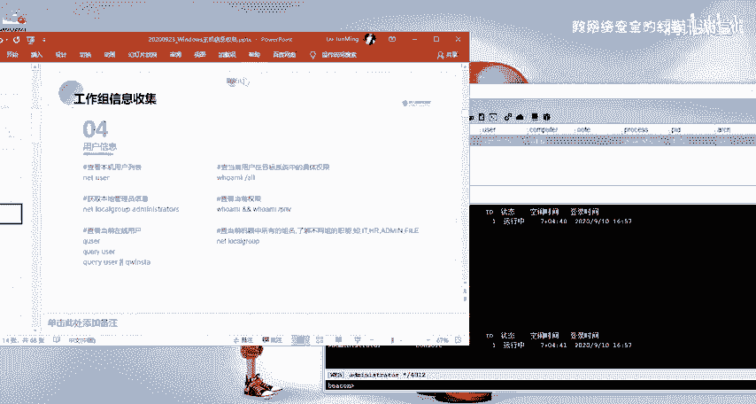

呃，我这边的话，因为现在的话改了就是第就是一个课时的话，45分钟对吧？现在的话已经54了。忘记了呃，先大家先休息三休休息5分钟吧。好吧，就是9点钟的话，我们正式开始。我这边话先断掉。呃。

这边这这些命令的话，我我这边。要不不操作了吧。好吧，大家自己课后去操作可以吗？就反正PP的话会发给大家。然后这边的一些命令的话，我也有相应的一个解示，对吧？然后我就大概的给大家就是过一遍。

我就不故一的去操作。因为操作的话可能花的时间的话比较多。Yeah。好呃，这边的话就是一个用户的一些信息。就用户信息的话，我们主要他就是去啊查找，就当前的我们得到这个机器，对吧？我们这边得到的这个机器。

他所拥有的这样子的一些用户，他有哪一些用户，以及他的这些用户，他是分别有什么样子的一个权限，对吧？这个的话就是我们去收集它的一个用户的一个信息。然后然后的话就是一个系统的一个信息。

系统信的话主要的话就是去收集你的这个系统，它是什么样子的一个版本，对吧？以及你的这个系统，它对相应的一些呃运行的一个软件以及服务。你还有就是呃这个话其实应该算是前面的1个IP信息啊。

就我们通过这个IP confi或这个面的话也是我们采用的，就在后面的话也会有。对。也会经常的去。我会有说到，就是说我们通过这个IP供fi。我们知道IV工具的话就是呃。

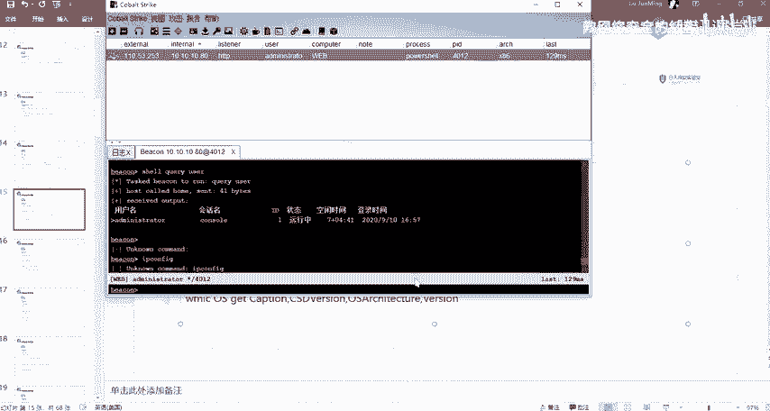

能够去查看到当前的这个机器，它的1个IP的一个信息，对吧？那么在这边我们查看到的话，其它其实是一个比较简略的一个信息啊，我们可以通过加一个干货。来去查看到更详细的一个信息。

然后在这边的话我们可以看到在这边就是有比如说他的这个机器，它的一个主机名，对吧？主机名的话是这一个web。就呃主机名是什么意思呢？就其实就是我们刚刚给大家那个呃。

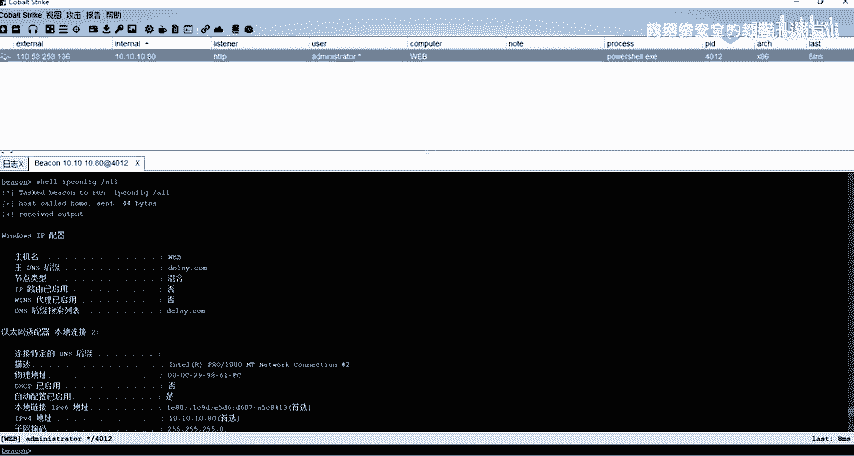

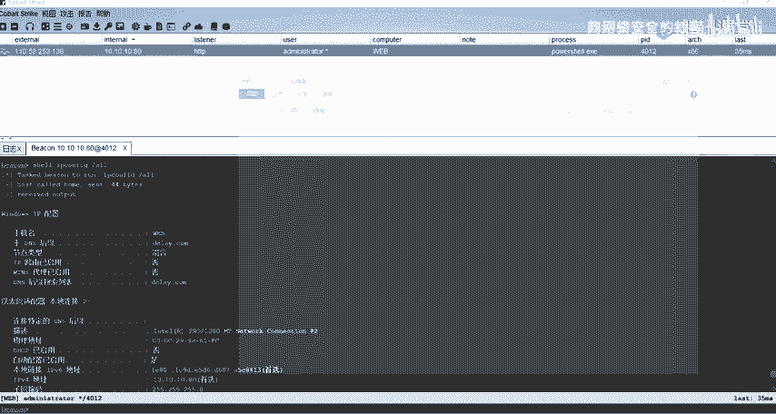

就大家要分析一下，就是主机名，就是说这个这个的话它就是一个主机名嘛，然后以及你右键此电脑，然后属性。这边这一个的话就是你的一个计算机的一个名啊，正确的说话应该算是说计算机名啊，就你一个主机名。

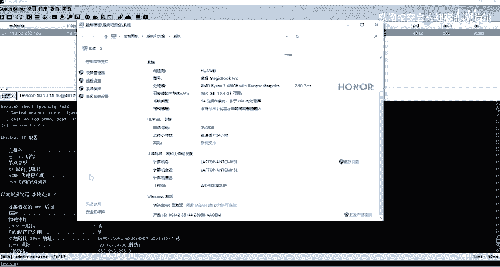

在这边它主机名就是这个，也就是说它的这个计算机名主机名的话是web，然后电S后缀在这边的话呃，它是一个这样子的一个Dlay点com。这个的话呃就是。呃，我们在后面会讲，就讲玉的时候会介绍到。

就是说在这边如果说我们发现有比如说他的1个DNS的这种后缀，以及在这边他的一个呃。这边DS的一个后缀的一个这种搜索列表。像这种信息的话，它是这样子的一个。像域名的一个形式，对吧？那么我们能够去知道。

就是说当前的这个机器的话，它是处在这样子的一个delay点com的这样子的一个域当中的。也就是说这个机器呢是一个域内的一个主机。然后还有在这边的话，有能够去查看到他的一个就是啊网卡的1个IP的一些信息。

对吧？比较详细的一些信息。对IP地址还有DNS。然后呃在这边的话，DS服务器在这个的话也是我们要去着重要去注意的。就说我们在域当中的话，我们通可以通过这样子的一个，就说如果我们知道当前的这一个主机。

它是在这样子的一个域当中，对，那么我们可以去通过这样子的1个DNS的一个服务器。它所对应的这样子的一个地址，能够去判断这个地址的话。

它是一个预控的1个IP也就是说我们当前的这个预这个DD类点com这个域它的一个预控的IP的话是10010010这个IP。然后呃这边大家不理解的话，我们等会会说啊，就是说我们的一个预控的话，它的一个作用。

它其实就是说我们的1个DNS服务器。因为我们在预当中的一个主机要去找到其他的一个主机的话，他需要有这样子的1个DNS的一个解析。就说他知道他知道我们的1个预控的1个IP地址。

然后的话他想要去访问到其他的一个主机的话，我们需要通过这个预控啊。也就是在这个预控上面的话，他需要有这样子的1个DNS的一个服务器。我们的一个域内的一个主机所有的1个DNS。啊。

就他的1个DS的一个啊就是一个。呃，DNS的1个IP的话，需要去指向我们预控的1个IP。以及还有其他的这样子的一些信息是吧？其他网卡的一些信息。

这里的话就是这个IP confi。还有的话就是查看就是操作系统，还有软件信息等等。在这的话像啊就是英文的话就是像这样子的OS外选，其实就是通啊通过这个fin join这个fin join的话。

就是啊一个就是查找匹配，就是在windows上面的一个查找匹配字符字符，还有就是啊相应的一个。你就可以把它理解成为是一个查找命令嘛。

就呃可能用就大家一般的话就是在历史里面会用用的比较多的话的话就是你在历史里面你去查找呃，去检锁一个。文件指定的一个文件名的话，你会去使用这个方能令，对吧？然后在windows里面的话。

它我们通常的话会使用这个fin式券来去匹配你这边指定的这样子的一个呃字符。然后在这边它其实就是通过从西 in这样子的一个信息当中去查找你的这个二手的名称，还有二0的一个版本。你什么你还出去。啊。嗯。

然呃还有就是查看当前的一个系统版本。在这边的话，我们使用这个WMIC呃，关于这个命令的话呃。我这我这边的话，我就不会我不去多讲了呀。就呃详细的一个使用的话，大家可以去直接去百度。然后的话呃也可以就是说。

啊，就是在这一期的话呃。诶。稍等一下。以及呃就是大家可以在全。群文件当中啊去查找到就是我们第一期的1个PPT就是。诶，你走了？就是呃在那个。

这这1个PPT啊就是生态测试需要命令这个PP然后在这一期的话呃，就是没有去着重的对这个命令去做一个详细的一个介绍。你可以去啊。如果你对就是说对windows以及lin上面相关的这样子的一些需要命令。

你不熟的话。你可以去看一下这个PPT。然后的话大家去敲一下，就是问我在这边的话。有列呢就是在windows下面，还有windux下面的这样子的一些命令的一个详细的一个使用方法。

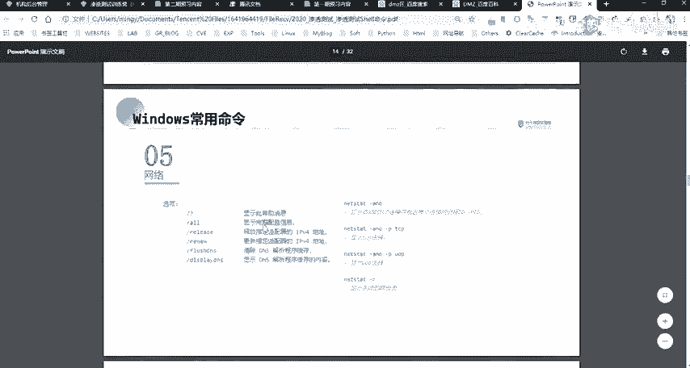

然后因为呃这个命令这个东西，这种命令这种东西的话，其实对于我们来说就是没有很大的一个学习价值啊就。这一个呃就是我们要去学习的就是最有价值的一个东西是就是说呃相应的一些思路以及知识点。就是像这种命令。

还有工具这种东西的话，其实价值不大，对吧？就大家自己去百度啊什么的，都能够去学会的对吧？所以的话呃在这的话就在本期的话就把这些东西都省略掉。但的话这些就说这些命令的话是需要大家去了解的。

因为我们经常会去使用到。而且这个面的话，它的一个功能的话也是很强大的。就我们以以这个为例，我们可以通过这个命令来去查找到当前系统下面的这样子的一些系统版本啊，还有它的一个就是它的一个呃位数，对吧？

它的一个版本。以及它的一个系统的一个类型。我这边的话是它是一个windows设，2008R2的这样子的一个机器啊。然后还有就是系统的一个体系结构。这个的话其实就是我们的一个系统架构。

就我们可以通过这这样子的一个。来去查看到可以看到在这的话就是一个叉86。这一个架格。还有就是本机的一个服务。本机服务的话就是service。就我们通过就是。比如说你这个文件，就是我们的这一些服务对吧？

我们通过这个命令的话，就是查询到的就是这边的这一些服务的一个信息。就通过这个命的话，能够去列出。当前的一个系统下面，当前这个主机下面有哪一些服务，它是开放的，以及它的一个呃相应的一些信息。

比如说它的1个PID啊什么。嗯。等等的这样子的一些信息。啊。可以看到在这边的话是他的一个服务名，对吧？然后的话它的1个PID以及它的一个运行的一个状态。在这里的话我们都能够去查看到。就这些服务的话。

我们能够去知道这个系统当中它运行的哪一些服务，对吧？以及它服务的一个运行的一个状态。还有就是安装那一个软件版本路径等等。就是啊去分析去收集我们的一个系统当中，他所安装安装的一个软件的一些信息，对吧？

然呃，在这里的话大概的就是介绍一下，大家可能会有疑问，对吧？就是说我收集这些东西干嘛呢？有什么用，对吧？那比如说我们的一个系统的操作系统软件等等这些信息，对吧？那么我们收集这些信息的话，为我们后面的话。

就是说我们后面会有相应的一些内容，就是会去使用到这一些信息。呃。运行一下这个命令，你说的这个命令的话是哪一个？刚刚的话没有看到嗯。查询系统及软件信息的一个命这一个是吧？

那我这边的话是一个中文的一个系统的话，我就用这一个。

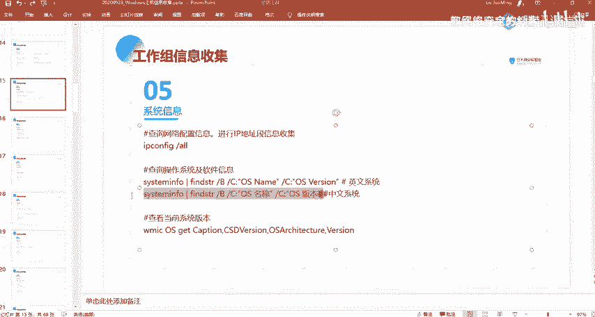

就效果的话就是像这样子，就是20名称。就其实在这的块它是用这个fin join，然后的话呃就杠C的话就是去匹配去匹配。呃，这边输出的一个信息当中，它的有没有这个二手的一个名称。如果有的话。

它就输出这一行嘛，然后的话还有二0版本，对吧？呃，其实你可以自己试一下嘛，对吧？就这一个的话也可以就是就类似于grape嘛，类似于grape。然后呃回到刚刚的，就是说我们收集这些操作系统，还有软件。

就是说这个操作系统的一个版本，对吧？我知道了它的一个系统版本。那么针对这样子的一个系统版本，像比如说我们后面讲提全的时候，就提全的话，就需要去知道你的这样子的一个系统的一个信息。

以及呃你这个系统当中它所运行的一些服务，还有你安装的一个软件。就安装的软件的话，就是有还有一些软件，或者说有挺多的一个软件的话，它可能会存在相应的一个漏洞，对吧？我们可以利用这样子的一些软件。

或者说服务的一个漏洞来去进行一个提全，以及能够去呃进行一些呃权限的一个维持。还的话就是进程信息。进程信息的话，我们采用的一个面号就是test list。嗯。就我们能够去。

能够去查看到当前的一个计算机当中，它运行的哪一些进程。

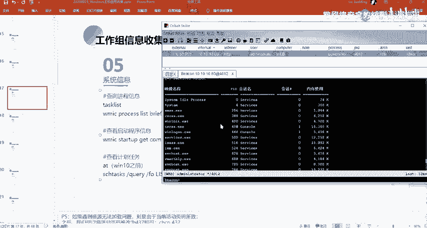

以及其实在我们CS当中的话，我们可以直接就是说右键在这边呃目标有一个进程列表。就我们在这里的话也能够去查看到这个主机当中它的所有的一个进程的一个信息。以及在这边的话。

它有相应的一些功能哈就像比如说kill，也就是把这个进程停止掉。还有可以去呃偷取就偷取进程的一个toing。

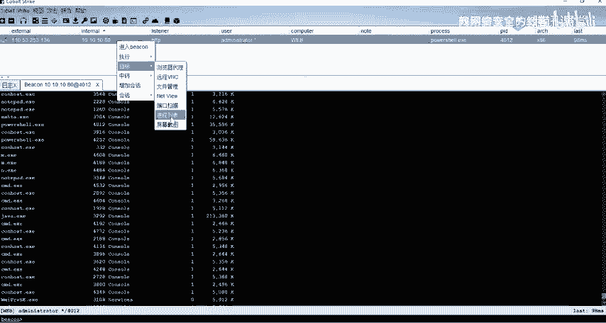

好，这个后款的话，在座的话大家先了解一下，后面的话会给大家讲。然后以及还可以通过这个WMIC来去查看，以及还有查看启动启动程序的一个信息。这边的一个启动程序的话，其实就是我们的一个自启动。

就是在这边就我们通过这个面的话，就是查看查询到的一个信息话，其实就是在这边的一个启动，这边启动项的一个信息啊。

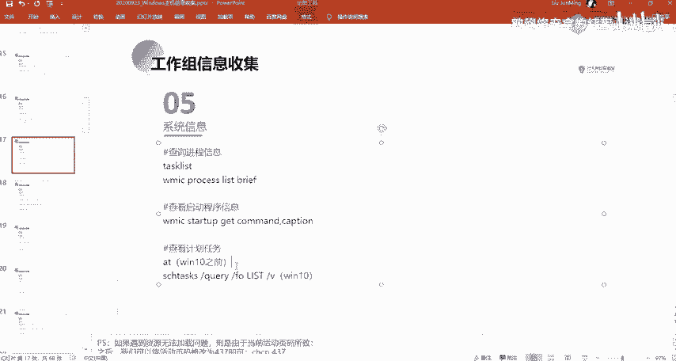

还后就是查看计划任务。这个查看计划任务的话，就是我们的这一个机器。呃，杠B呃，这边的话。

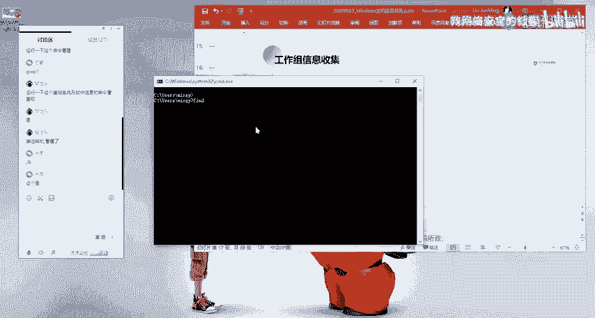

房子时惯。你可以通过就是你直接在windows上面，你执行这个fo卷杠斜杠斜杠问号来去查看这个命令它的一个详细的一个使用。好吧，我这边的话我我就。

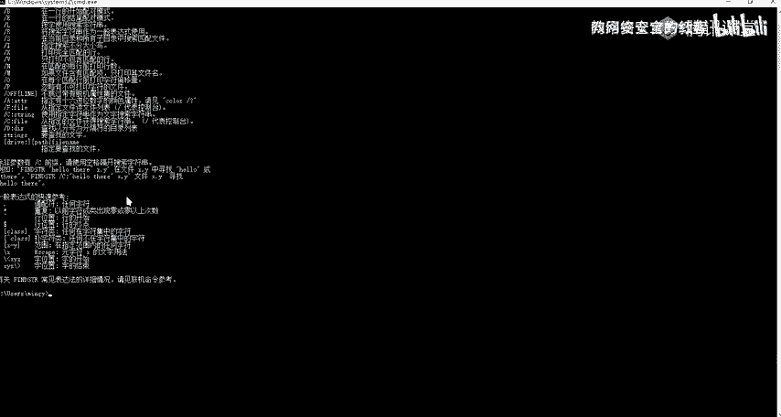

就不会说就是一个一个的给大家去讲他的个选项。像这种这种命令的话，呃，你直接在命令函当中去查看他的个帮助信息，你就知道了。好吧，如果实在不知道的话，你再来问我。

或者是说其实百度就百度的话就能够去解决你大部分的一个问题了。就如果就其实有句话还是说的好，就是你百度的话就能解决大部分的问题了。如果你百百度都解决不了的话，我我这边肯定也解决不了，对吧？

当然的话当然的话有一些东西的话呃有一些东西的话，百度上面也不一定有。就呃就学会大家自己学会去百度的话，百度谷歌就是很多的这些问题它都其实不是问题。就你碰到这些问题，你不知道怎么去解决的话。

你的一个问题的话不问题的话，其实不是说你不会。而是说你不会去查找去查找这样子的一些问题的一个解决方法。就好其实建议大家的话在碰到问题的时候，其实不要说第一时间就去问别人，是吧？就你你的第一时间的话。

你的一个想法应该是说我碰到这个问题，对吧？我要去怎么去解决，对吧？然后解决的有哪些方法对吧？首先的话肯定你实在不知道的话，就是你精验有限，那么你就直接去百度嘛，去百度查找看是否有没有是吧？

如果实在就是说你百度也解决不了的话，你可以去问别人。呃，这边的话就是呃查看计划的就是呃艾这个面的话，它是在就是像我们那个windows22003还有2008的这些比较老的一些机器上面的话。

就是使用的这个艾命量。然后我们在新新的一些系统上面的话，像ms，还有2008哦，不202012serv我的这些机础上面，它都是使用这1个SC task。干子一个命令就是计划任务。

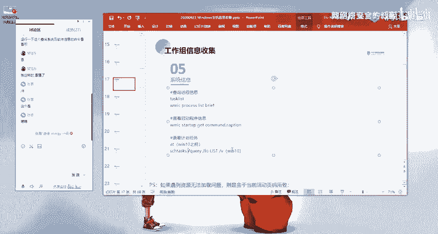

好我，在这边的话，我有这一个。

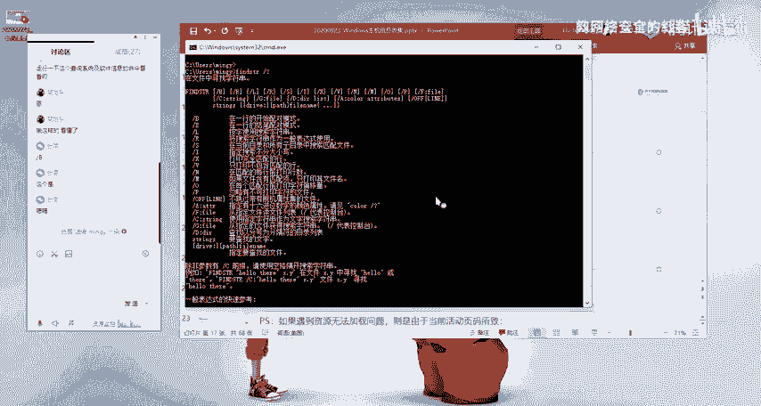

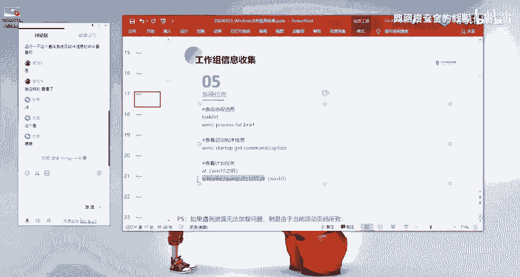

我这边执行这个面的话，它就会列出所有的这样子的一些计划任务。就这一个计划任务，它是什么意思呢？就是说你的这一个系统当中的话，它会有这样子的一些定时的一个任务。这些任务的话。

它会在啊就是说相当于是一个就是冒重一样，对吧？

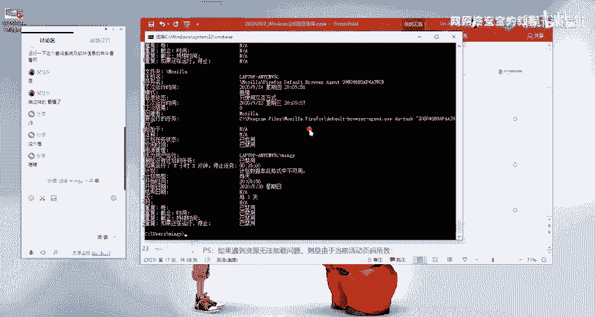

打个比喻，就是闹钟对吧？你闹钟的话，你定个时间，你定了这个时间，你到了时间，你闹钟就会响，就定计划任务的话也是同年。就是说你设置了这样子的一个计划任务，对吧？那么你到了这个时间。

或者说到了在这个时间范围之内，对吧？那么他就会去运行相应的一个任务去执行相应相应的一个任务，比如说去执行这样子的一个程序，对吧？

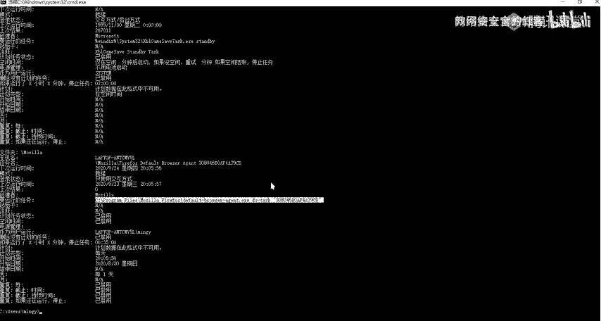

这个的话就是计划任务。然呃就是说大家再去进行这样子的一个计划任务的一个执行命令的时候，可能会碰到这样子的一个问题啊。

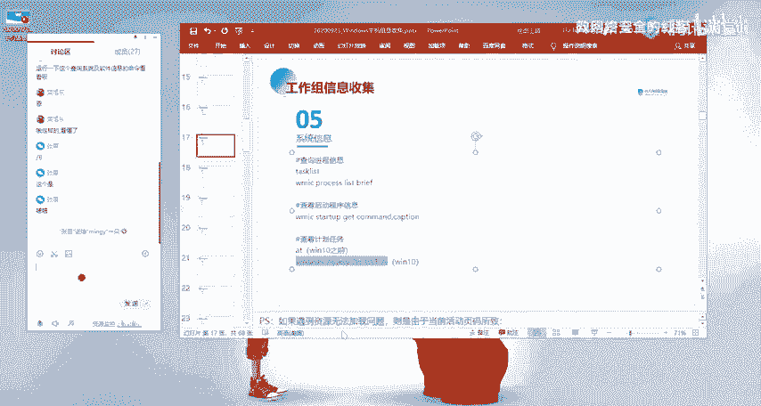

像比如说嗯。像比如说我在我这边我在这个机器上面，我执前的话，他会有报这样的个错误，就说错误无法加载列资源。啊，对这个at也是可以用的。但是也是可以用的。就是呃在这边的话，哎这个命令也是可以用的。

然后呃我这边的话就是就就新版新的比较新的一些系统的话，都是使用这个。我在这边的话，之前这个话他会有这样子一个错误啊。在这边的话，它是就是。我们需要就是说你要让他执行正常的话。

你需要去更改一下他的一个编码，就更改编码的话就是CHCP。在这的话需要去把它更改成，就是每版的一个。啊，437的一个编码，像这样子，然后的话你再去执行的话，它就没有这样子的一个问题了。

就是能够去输出它的一个正常的一个结果。

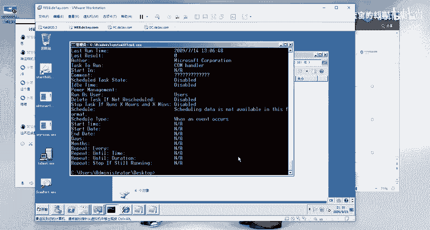

这个的话给大家提一下。啊还有呃相应的一些其他的一些系统信息。呃，我这里的话就着重的介绍一下，就是查看端口列表以及本机开发的一个端口所对应的一个服务，还有应用程序。就这个nett。

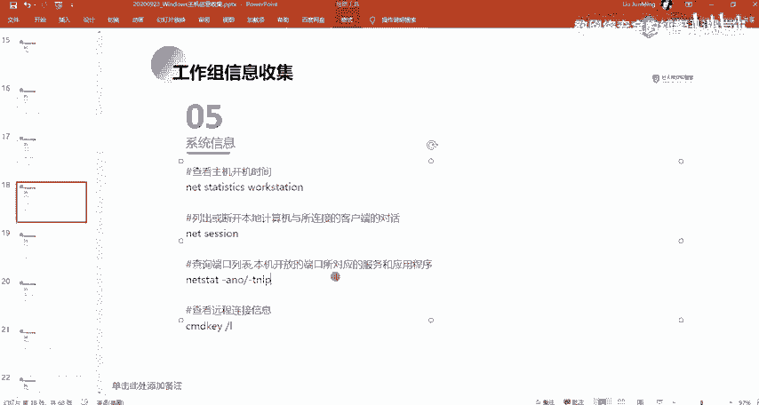

这个面的话也是就是常用的一个面料。就。我们常用的这个nstar杠ANO这样子一个命令。这个命令的话它会列出来，就是说当前的一个机器项。就他会列出单前机器上面呃，它的一些呃本地的一个端口的一个信息。

比是说它开发的一个端口的一个信息，以及它的一个状态。

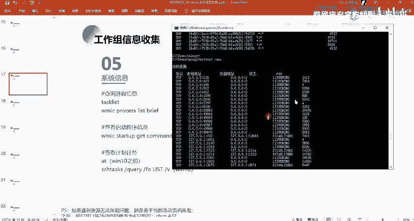

在这边的话，我们可以看一下，就是像在这边，我们可以看到有这样子的本地地址，还有外部地址对吧？然后我们本地地址在在这边的话有这样子的一些呃端口的一个开放，对吧？像445135等等，以及它的一个状态。

是一个处于一个今天的一个状态。

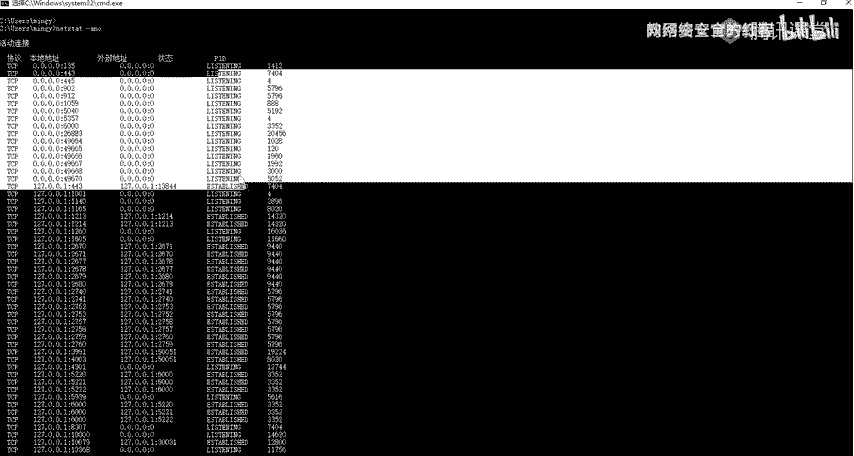

然后还有的话就是在这边的话，我们可以看到有这样子的一些外部的一个地址，对吧？在外部的地址的话，就是说与我们的这样子一个端口有相应的一个连接，它是处于一个连接的一个状态。

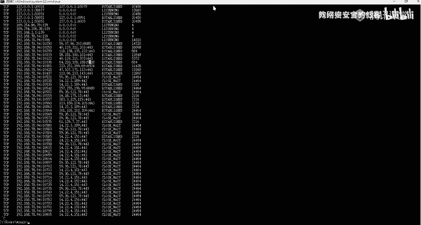

以及还有就是呃这个杠TNLP。这屁。嗯。嗯。你哪里错了？嗯。可以。

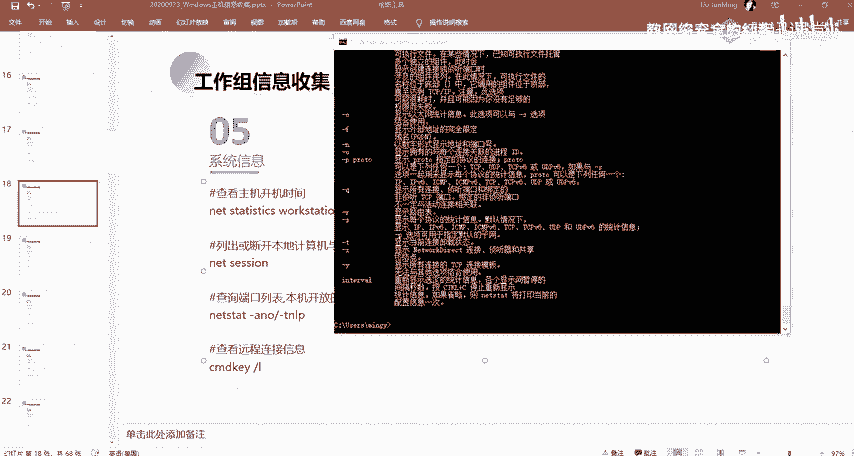

可。

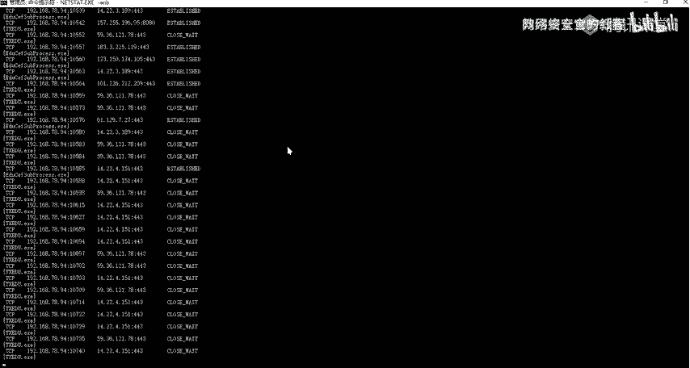

啊，这边的话命令错了呀，这边的话没有这个L。就是呃我们常用的话就是这个ANO，就反正我是常用的话，就是这个ANO就是呃我们要去。

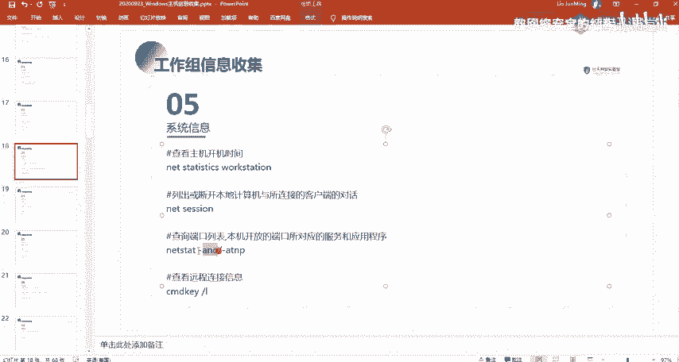

我们要去查看查找，比如说我当前的这个机器，它开放的哪一个端口，对吧？就是查找一下它这个机器。呃，我这边指定的这一个端口，它是否开放，比如说45的一个端口，对吧？那我们就可以通过这个nstarO。

然后加这一个管道符。管道服的话大家能理解吧？就是说我们前面的一个结果的话，作为一个输入。然后的话呃。呃，就是前面结果的一个输出作为后面的一个命令的一个输入。也就是说我们这边执行的一个结果的话，呃。

他会通过这个方式专命点来去查找这边的一个结果。执行结果当中它是否有包含445的这样子的一个字符啊。然后这这的话我们就能够去查找到它的这个机器它开放的这样子的1个445的一个端口。以及还有其他的一些窗口。

我们都可以通过这样子一个命令来去查看。

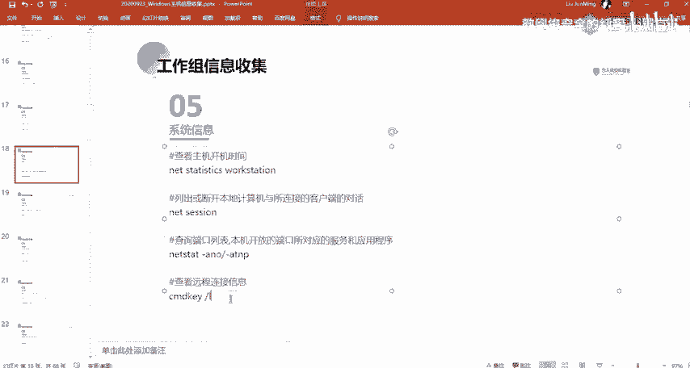

还有这个呃someDP。

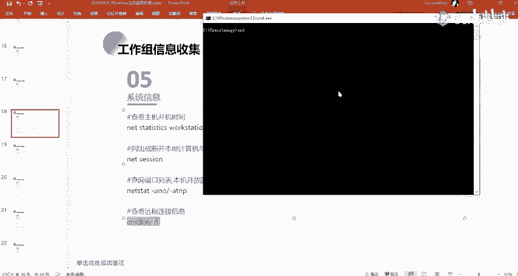

这边的话呃这个s机 key的话，就是它是用来查找我当前计算机上面的这样子的一个。

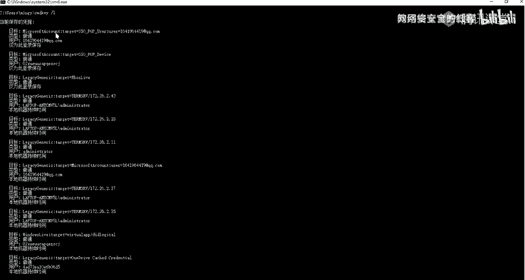

就是所保存的一个凭据啊，这里的一个凭据的话，哎呦我去我这边。泄露了我的信息啊，就这边的话这一个凭据的话，其实就是啊我们去访问某一个资源的时候，他会在本地他会有存储这样子的一个呃登录的一个信息。啊。

像比如说我这边我去登录这个机器，对吧？我是用的是这一个用户去进行一个登录的，以及我这边呃登录用这个账号去进行一个登录，还有登录的这样子的一些机器。我们在这的话都能够去查看到。然后呃还有像。啊。

在这边的话呃，我这边的话其实是我自己加的添加了一个，就实际的话，这个把件它上面的话是没有。就我们在这边就是说我们可以通过这样子一个命令来去查看目标机器上面它是否有这样子的一个。啊，就是存储的这一个频据。

然后存储的这个频据的话，我们就能够去知道这个主机它啊就是。呃，就是能够被哪一些机器来去进行一个访问，就是用什么样子的一个用户来去访问。就这边的一个凭据，它存储之后的话，就是说其他的一个目标机器。

比如说这个他给他给的这个机器来去访问这一个机器的话，用这个用户来去访问的话，他是可以不需要去进行一个密码，就可以直接去进行一个名义的一个访问。

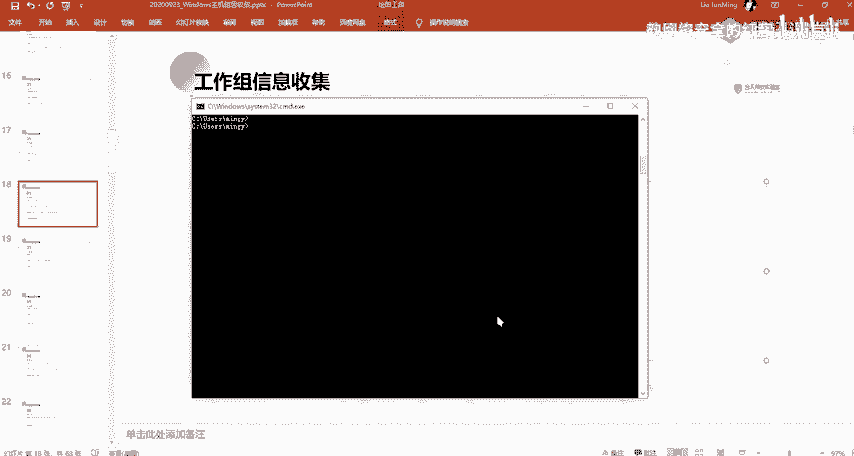

被告人你讲。还，就还有就是查看补丁列表。呃，查看补丁列表的话。

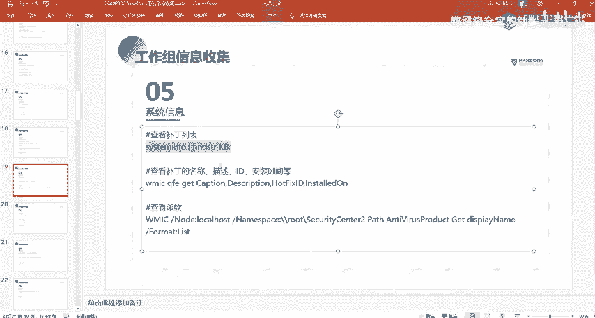

就这个 system什 in就其实还是同样的。

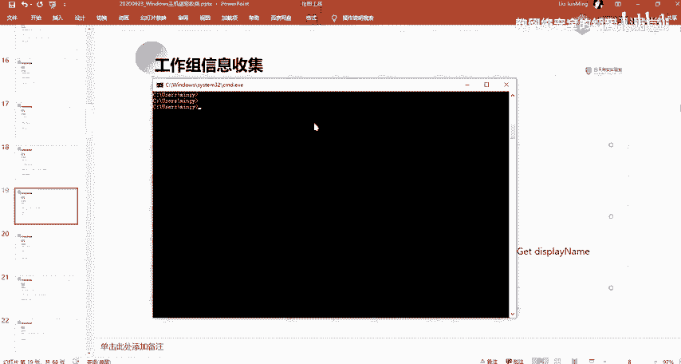

嗯。就呃可以通过这个命令能够比较直观的去查卡查找就是说当前的一个主机上面它打了哪一些补丁。好，查找这些补丁的一个作用的话，就是为我们后面就是说相应的一些像提全啊，对吧？我们提全的话。

就像这种windows系统的话，它相应的一些提全的一些漏洞。

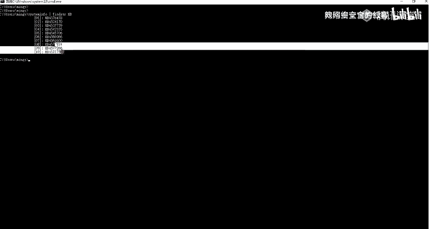

如果说他打了一个补丁的话，那么我们无法去进行一个使用，对吧？如果说他没有打补打这个补丁的话，那么我们就知道可以去使用哪一些呃漏洞，哪一些攻击手法去进一个。利用嗯。然后还有查看补贴的名称、描述。

还有查看杀网。呃，这边的话我们可以通过这个命令来去查找，来去查看到当前的这个主机上面它安装了哪一些杀毒软件。

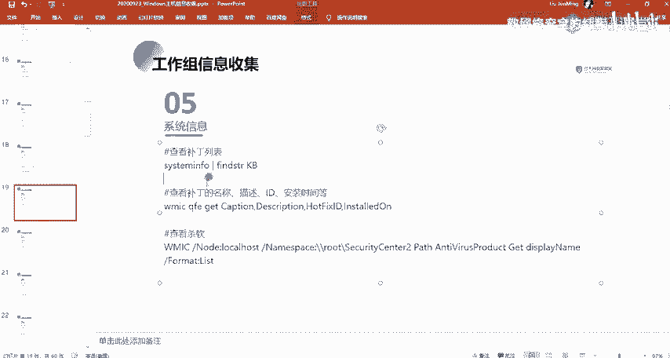

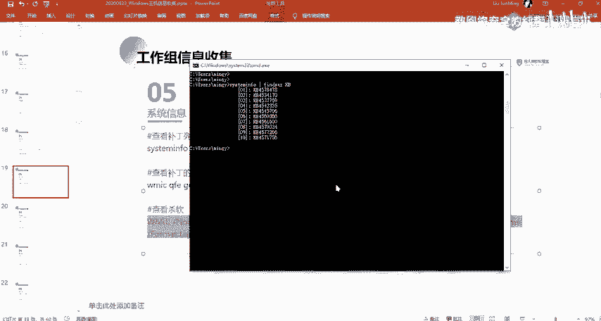

就在这边的话，我们可以我这边的话是装了一个火龙，还有就是windows系统它自带的一个windows def对吧？在这的话，我们可以通过这样这样子的一条命令。

能够去紧锁到我这边的一个呃杀毒软件的一个情况。

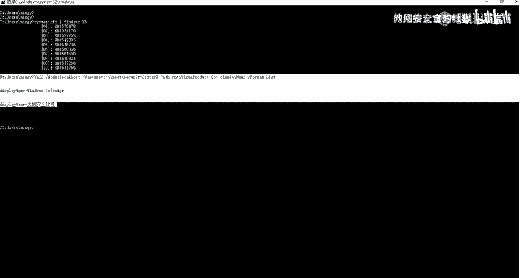

呃，这边的话应该是没装吧。看一下。呃，这边的话是没有删了。

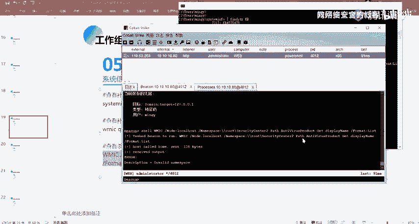

就这个机器没说。然后还有其他的像呃查看house的文件，就在linux下面的话是这样子的一个housese的文件。然后windows下面的话是这一个路径。

我们可以直接。

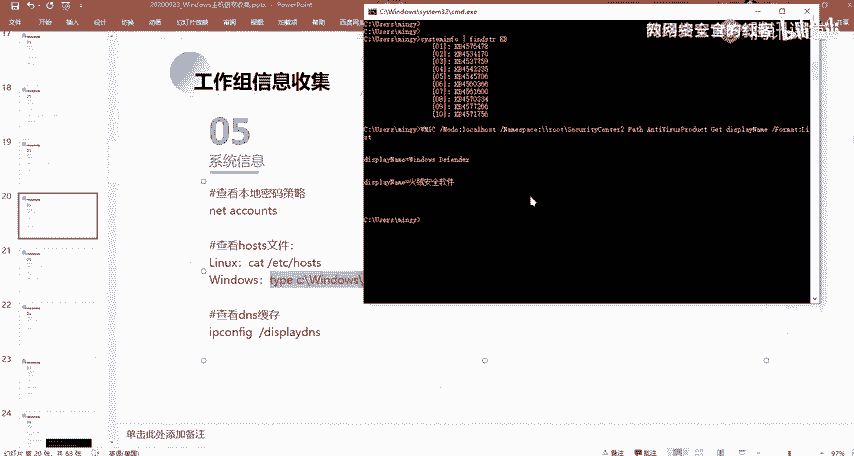

有吧。

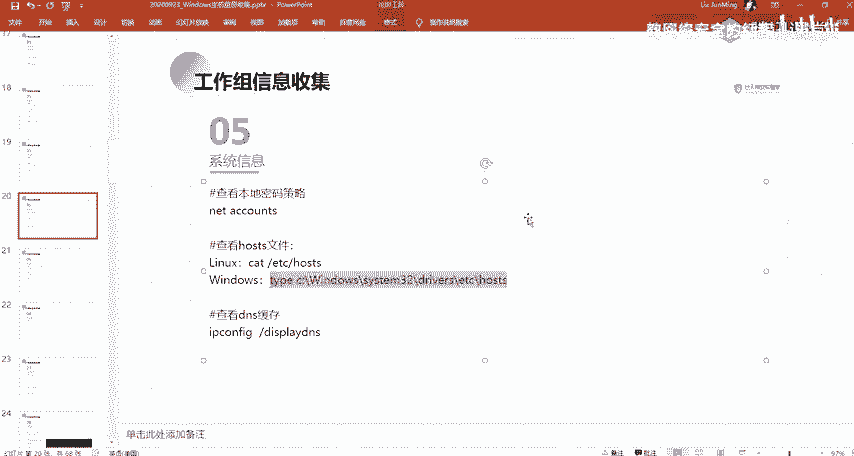

嗯我真。

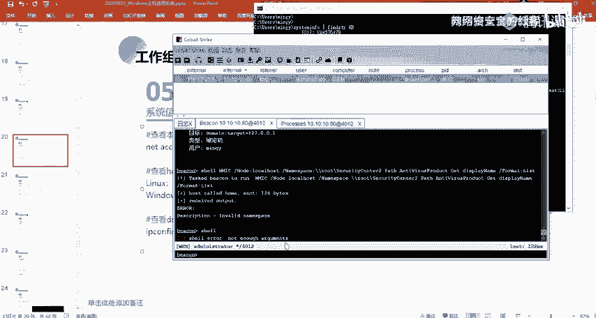

嗯。然后呃我这边执行之后的话，我就能够去查看到他的这样子的一个主机上面，它的hos的一个文件里面的一个内容，对吧？当然这这边的话，它是没有内容。还有呃其他的看一下。我这边的话跟前面重复了。嗯。三个。

看这个。啊，这这边的话就是前面已经讲了呀，就是还有这个NO。就是刚才已经执行了呀，对。

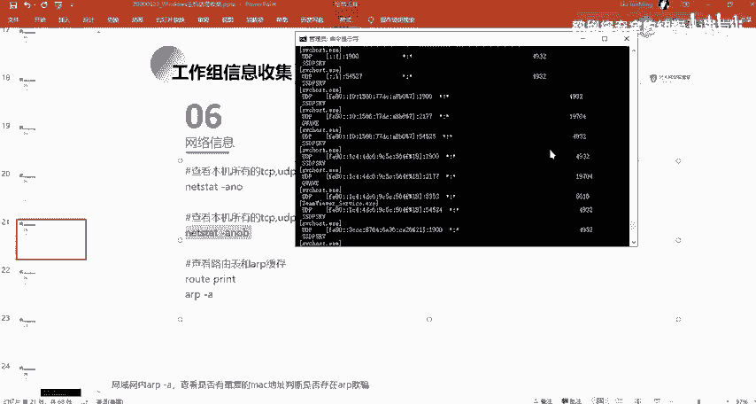

嗯。就是我们在这的话能够去查看到，就是说它的一个端口以及它的一个运行的一个程序的一个名字。我们在这边都能够去看到，以及他它的呃一个协议的，它是1个TCP还是1个UDP的一个端口。

在这边我们都能够去查看到。

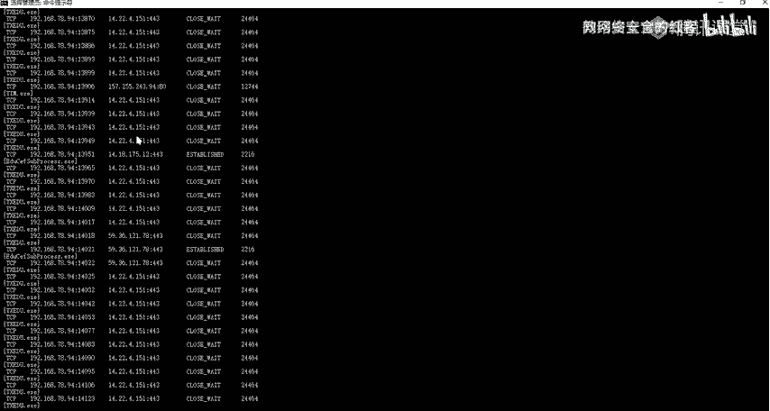

呃，看一下还有。还有这一个就是呃查看本机的一个共享列表，还有可访问的一个这种预共享列表。就我们通过这个net share。这个的话也是呃我们在后面也会有去介绍到的。

也是大家需要大家去理解的一个样子的去了解的这样子一个东西。就我们之前这个nett share的话，我们能够去查看到当前这个机器它的一些共享。就这边的一个共享的话，其实而这些的话都是默认的一个共享。

就是说您可以在你自己的一个机器上面去执行这样子一个命令。那需要然后的话你会发现有这样子的一些共享。比如CDE我们可以看到就其实就是你的一个磁盘嘛，就是C盘D盘E盘它都是一些默认共享。

还有IPC的一个远程啊，远程共享，还有这个admin。然后这一些共享名，它所对应的一个资源的话，它能够去访问到那个资源它是不一样的。就像CD这种的话，都是C盘D盘E盘对吧？等等的这样子一些。然后呃。

ok。然后呃磁盘印射。磁盘映射的话，在这边的话就是说如果说我们知道了某一个机器，就某一个机器它的一个用户名义经密嘛，那么我们就能够可以通过这个mat share。

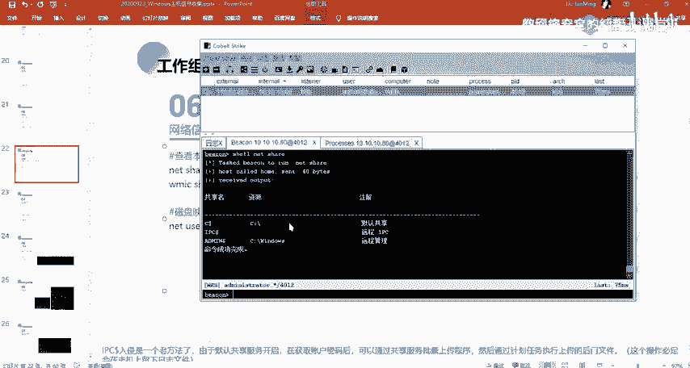

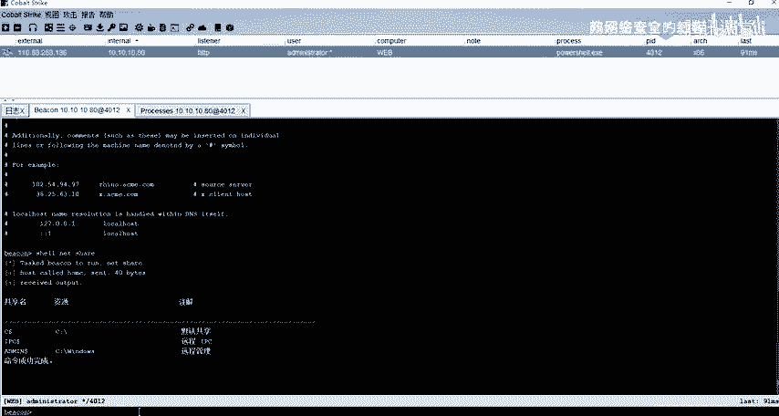

net柚来去进行一个进行一个连接。就我这边的话，我可以通过net柚来去连接到我这边指定的这个机器上面来呃它的一个共享名为C，也就是去连接到这个目标机器上面的一个C盘的一个目录。好呃我这边的话。

因为我这边直接去那个U子的话，它是会机进行连接。然后的话其实呃我们可以把就是说目标机器的一个C盘，把它给就是映射到我们本地了。像比如说我在这边的话，映射到我这一个。呃，一盘。啊，直接预控。哎呦，我去。

嗯。嗯。嗯。

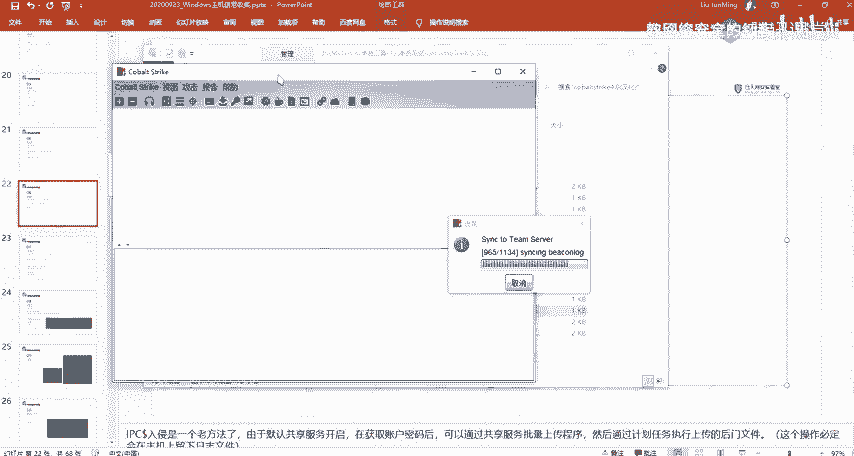

我这边的话是。没有出需要。然我这边之前的话，你会发现可以就已经面令成功了。就这边命令成功的话，就是说其实实际的话呃，就如果说你是一个普通的用户，你去进行一个连接的话，你是需要就是账号密码的。

然后因为在这边的话，我这边的话，它其实是一个。他其实是一个预用户，就是说他能够去呃他的一个权限，它是一个预用户的一个权限。也就是说他能够去隐密的。就是说你他当前的一个权限的话，是能够去直接去登录预控的。

所以的话我这边的话就是没有输入密码。呃，但实际的话就是说你没有这个权限的话，你去。就是。呃，你当前的一个用户是没有权限去直接去连接去访问这样子的一个共享。

所以的话你需要去输入他那个账号密码来进行一个登录。然后我这边我把它那些柚子共享到了我的一个E盘，那么我可以直接把它。Yeah二。我直接可以加压查看我的一个当前的一个E盘。

那么我就能够去查看到呃远程远程机器上面就是远程的这个10010这个机器上面的一个C盘的一个目录。啊呃，且呃，我这边的话。

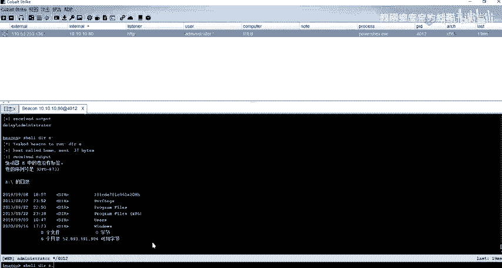

我们可以在这个我这边主机上面看一下。就是啊这个。我们可以看到这个的话就是我们刚刚进去的这个邻居。这边的一个呃内容的话，其实就是我们那个10010的一个这个远程主机主机上面的一个啊目录啊。

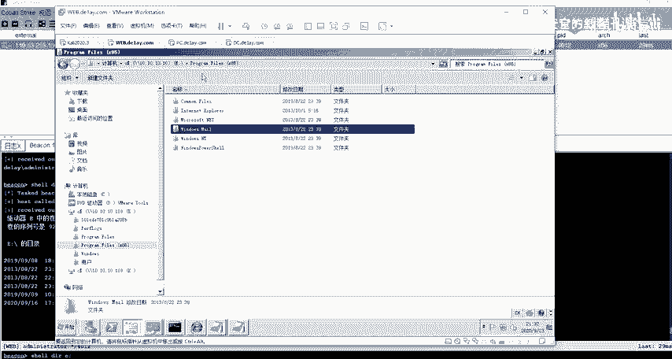

。

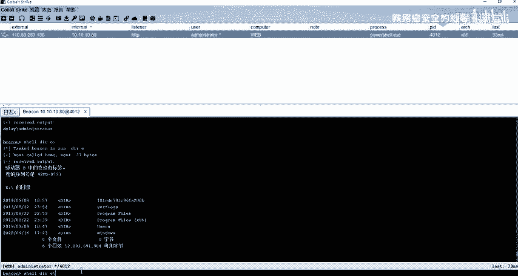

这是一个呃nett尔的一个共享。呃，在后面的话会去使用到，就是说用这样子的一个共享。呃，就是我知道了目标机器的这样子的一个账号密码，对吧？我就可以通过这样子的一个共享来去进行一个呃来去进行一个横向移动。

来去呃执行相应的一个命令以来去呃反谈系。哎，就是呃关闭防火墙这里的话呃，我这边的话我就不讲了，就大家课后的话去看一下。面令的话还是比较多的，这一些面令。然后呃第八个的话就是代理信息。

就其实前面的话有给大家有讲，对吧？有提到就是说我们呃在内网在内网的一个机器上面的话，它的这些机器上面的话，它可能会有这样子的一些代理的一个服务器，对吧？

然后的话我们在内网的这些机器要去访问到其他的一些网站或者说出网的话，它可能呃它会有配置相应的一些代理的一个信息。那么这些代理的一些信息的话。

也就是这些代理的一些IP代理的一个IP的一个地址以及它的一个方法的话，我们怎么去查看的。就我们可以通过这样子的一个命令。拿去查看啊，这边的话它是呃他其实就是他的一个信息的话。

它会存储在这样子的一个注册表象当中。然后的话我们可以通过IG query这样子的一个命令。来去查看这个注册表当中的这样子的一个代理的一个信息。

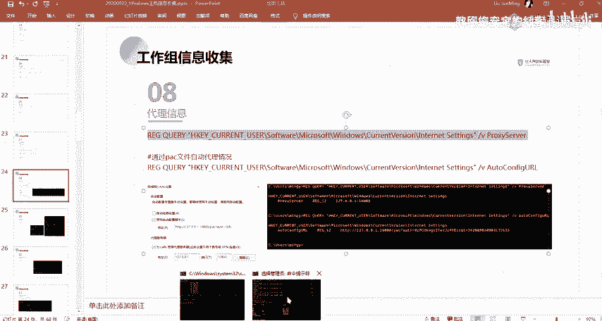

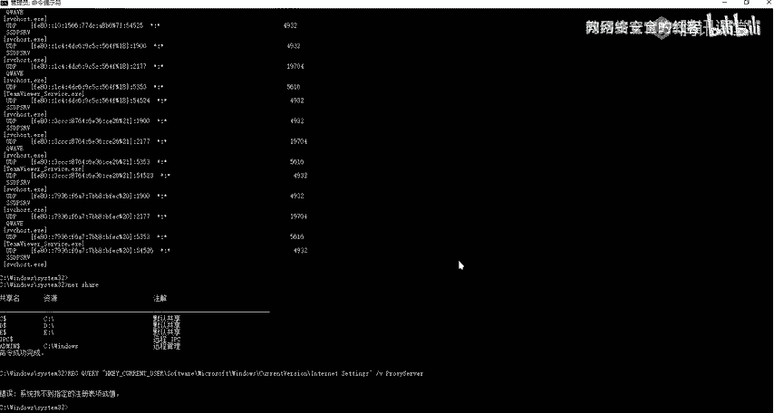

系你看。我这边的话开个代。

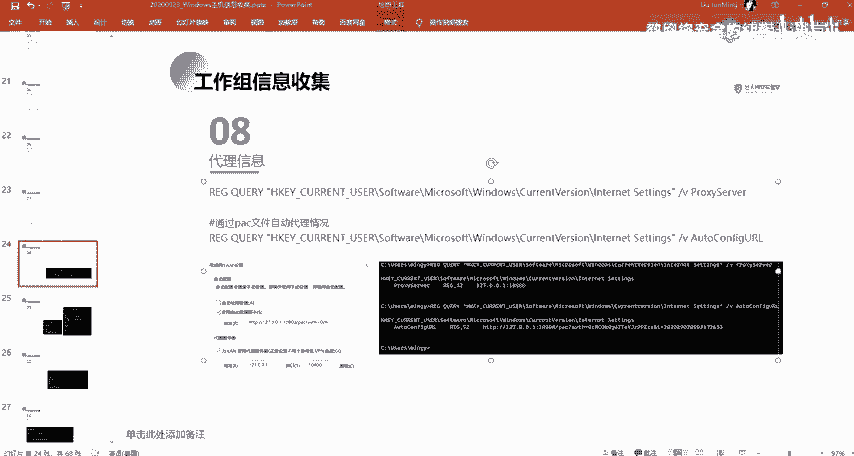

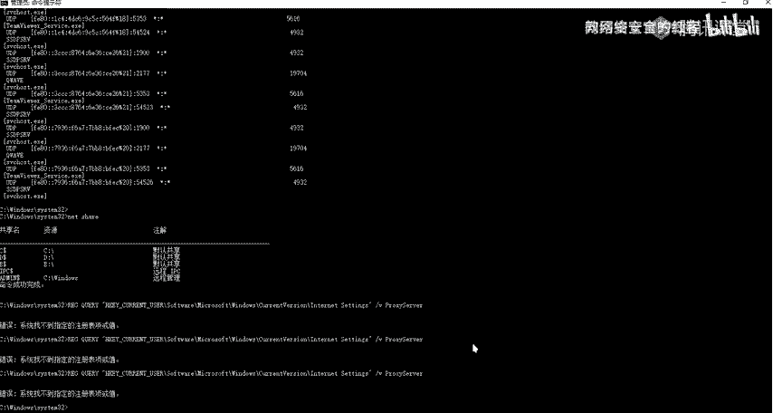

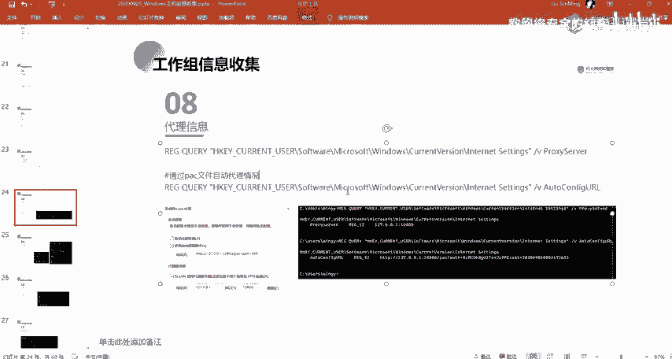

好呃，在这边的话，我们可以看到在这边我。我通过这里的这样子的一个命令来查看到了有。好，这样子的一个值这个值的话，我们可以看到在这边它是一个这样子的一个呃链接的一个形式啊。

就这边的话就是1个PA的一个方式啊。就大家如果。啊，这边看不到你们。我这边他是开了这样子的一个。开了一个这样的1个SR呀，他的一个代理。有。而且我使是呃选择它是1个PAAC的一个模式。

然后他如果说你是用的这样子1个PAAC的一个方式的话，它是会显示的这样子一个呃样子。啊呃我上面这边没有查到的话，就是说呃。

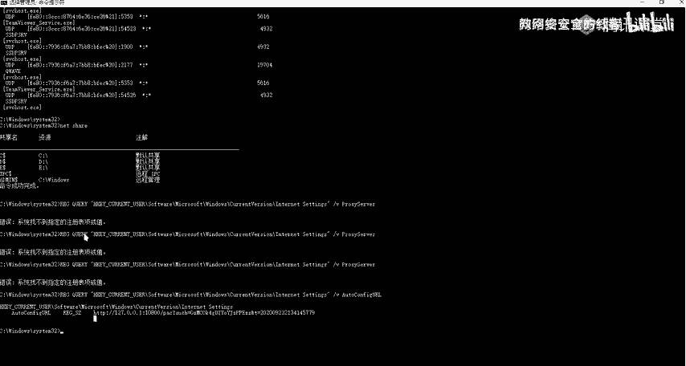

他不是使用的这样子1个PAAC的一个文件代理的一个情况。好吧。佢。哎。就其实我们在这的话也能够看到，就是他在这边有一个脚本的一个地址，也就是我那边的1个POC的1个脚本地址，我这边把它给关掉。

然后我这边。手动。108年对吧。

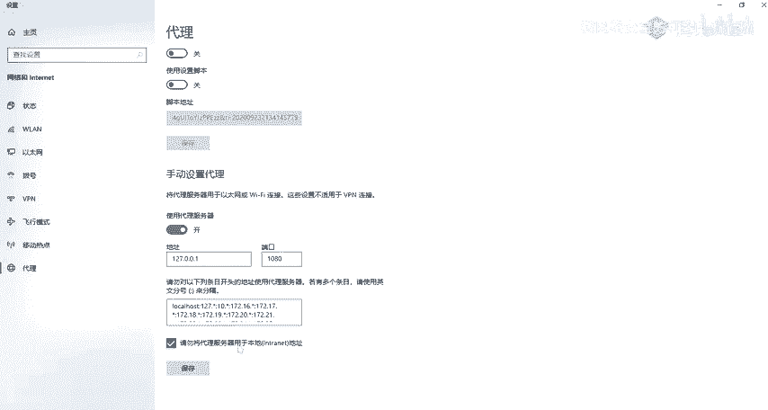

如果说我不使用1个P的一个方式。那么我去执行这一个的话，我们可以看到在这边能够去查看到他当前的一个主机的话，他使用的个代理的1个IP以及D呃IP以及端口。

就是他在本地他是使用的这样子的一个代理的一个呃服务器。

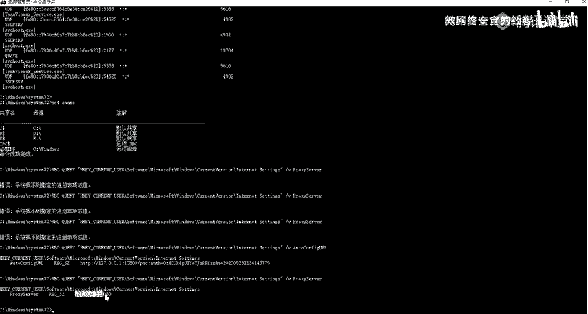

是谁映射到了谁上面？

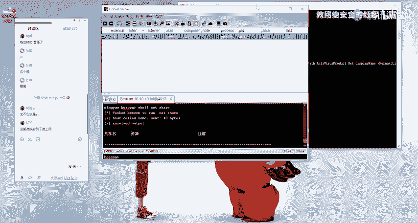

呃，这个的话是呃就是把远程主机。因为我这边的话是1个10。10。10。80的一个机器，对吧？然后到我这边把机的话，其实就是我这边是。

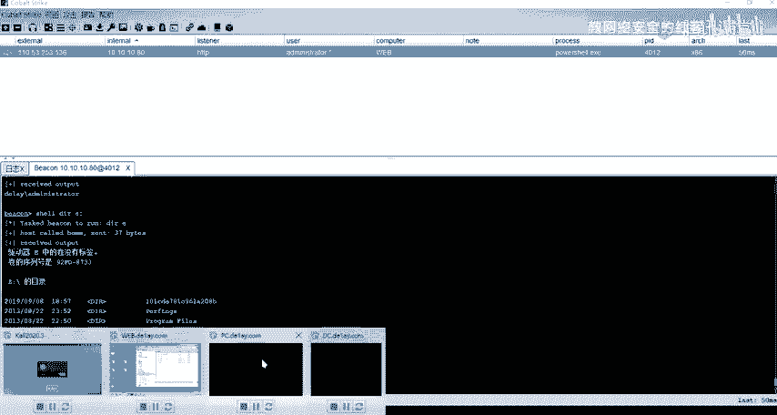

好，这个这个机器，然后这边呢这个机器的话就是那个10010010的那个机器。

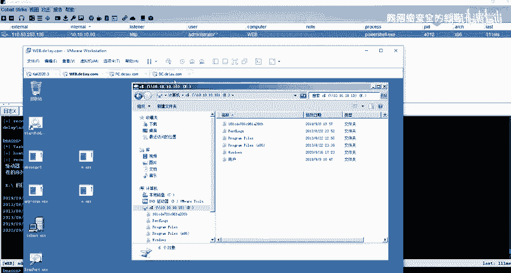

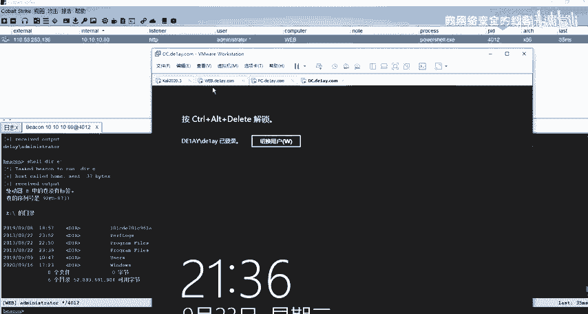

然呃，我们映射的话在这边是。我这边执行了对吧？执行的这一个命令是这样子的。啊，那就需又一，然后远程IP，然后共享屏的话是C，也就是啊映射到好不，也就是把我们远程的这个10。10的这个主机的一个C盘。

把它给映射到我们本地的一个呃E盘。然后要注意的话，这边那一个这边的一个磁盘的话是需要你就说没有被占用啊。这个能理解。

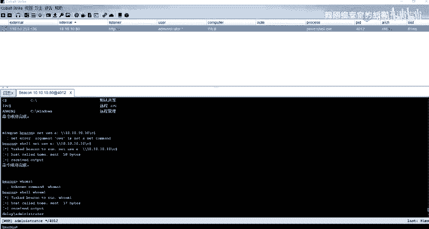

就说你的一个磁盘的话，对吧？你有C盘，有D盘，对吧？这两个驱动器的话，它其实已经被占用了，对吧？那么你就是可以你需要去把它映射到，就是没有被占用的。像比如说EFG等等，这些都可以啊。

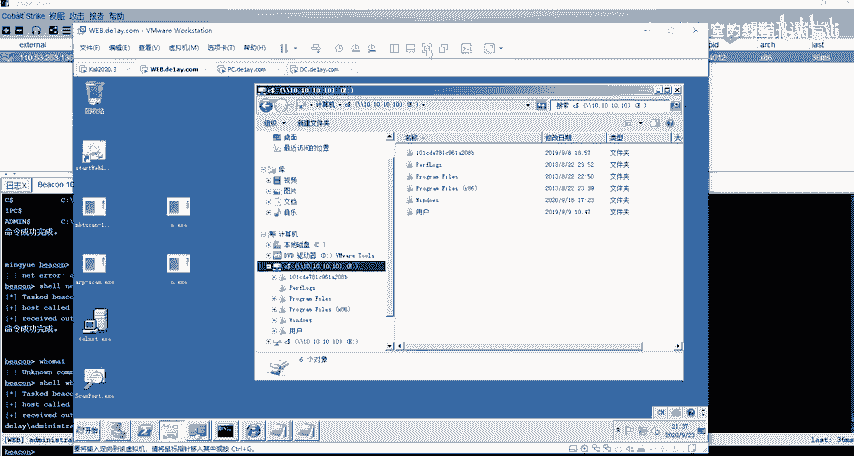

就是把远程主机的1个C盘，把那个映射到我们本地的一个E盘。

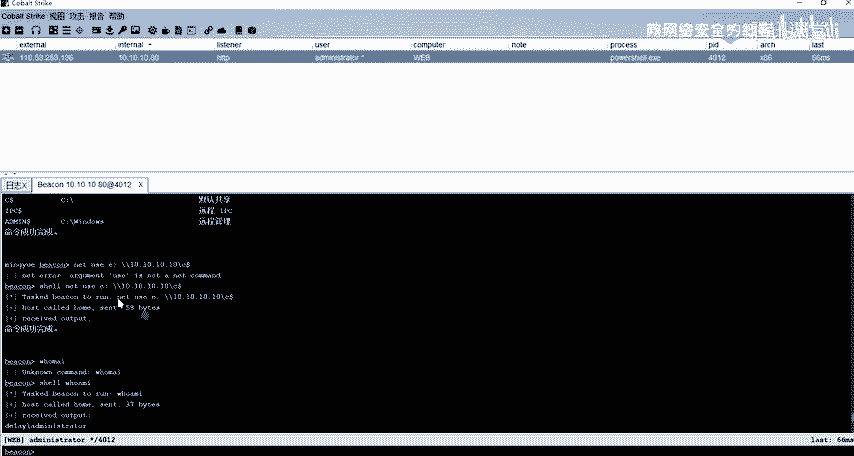

这个应该能理解。好有关。这个的话就是一个代理信息的一个查看。啊。然后还有就是呃wifi密码，像呃这边的话，这一个的话也是大家大家应该比较常用的对吧？就是如果说你的一个电脑上面也的一个wifi密码。

你连接之后的话，你忘了你忘记了它的一个wifi密码，我们可以通过这样子一个方法去进行一个查找。就是呃通过这个let share舆认pri fire。这一个面的话，它就是呃在这边我们看看一下。

就查看当前的就是说你如果说你连接了这一个连接了这个wifi的话，它它这个这一个呃wifi的一个名字的话，它就会在这边有记录，对吧？就你连接成功了之后的话，然后的话我们在这边的话可以通过这样子一个命令。

就指定我们这边连接了这个wifi的名字。然后加一个Q点cle。那么我们就能够去查看到这个连接wifi的它的一个名额的一个密码。这个的话应该大家应该也比较熟啊。大家可以自己去试一下。然哦。

第十的话就是回收站内容的一个获取。啊，这边的话就是一个比较就是一个。技巧吧。就可能的话可能的话就是能用得到，也可能用不到。就是说呃在这边的话，我们回收站对吧？大家都知道就是回收站啊，我这边的话是空的。

我这边嗯。我这边的话呃。呃，我这边就是。删复制了这样子一个文件，我把它给删除掉，对吧？删除之后的话，如果说你面有群，就是啊就是。没有呃，我一般的话就是习惯用shift加date，就是它删除之后的话。

它不会放在回收站回收站当中。如果说你像一般的像你右键删除，对吧？你右键删除以及你直接按datete的话，删除的话，它会放到回收站呃，它会放到回收站当中，对吧？然后放到回收站它的一个好处的话。

就是你删除了之后，我我们可以复原嘛，对吧？就你可能你误删了，你可以就是把它给啊重新呃复原到我们的一个主机主机当中，然后在这边的话，其实我们。可以通过这样子的一个方法来去获取回收站当中的一个内容。

就说如果说呃你的这个机器它呃有这样子的一些敏感文件，对吧？这个敏感文件里面的话，它存放着一些比较敏感的一信息一些信息。然后的话管理员把那给删了，删了之后的话，在回收站当中，我们直接在桌面的话是看不到。

是吧？那么我们就可以通过这样子一个方法来去获取到这个回收站当中的一个内容。而且就是说我们一般的话都是通过命令函的一个方式直接去操作嘛。当然的话如果说你呃能够去直接得到他的一个。

就是像能够直接远程登录上他的一个主机去手动的去翻找的话，那么你可以就你直接在回收站当中就能够去找到嘛，对吧？然后呃在这边，如果我们想要去找到这样的一个内容的话，我们需要通过这样的一个方法。

这边的话就是一个脚本。这个脚本的一个意思的话，就是它其实就是一个货循环。然后的话通过这个VMIC这样子一个这边的这个命令的话，它其实就是去查找我们当前这个主机上面有哪一些用户的1个SID。

就这个SID的话就是呃。呃，每一个用户他都有这样子的一个唯一的1个SID的一个值，就是我们在这边的这个就这里我当前这个系统上面的话，有这样子的4个SID值。然后每1个SID的话，它对应的一个用户。

然后每一个用户下面的话，它就是我们都知道每一个用户它都有一个文件夹，对吧？那么我当前的这样子的一个回收站的话，它其实也对应的有就是我在我当前的一个用户下面的话，它会有一个文件夹。

它是存放着回收站的一个内容。也就是这一个啊，默认的话，它是这样子的一个目录。

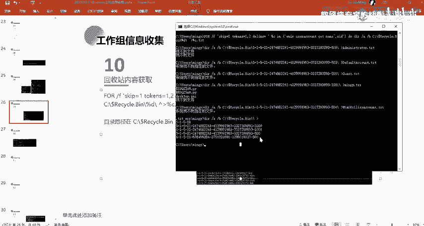

然后我们在这边的话，我们通过这样子这个脚本的话，我们能够去紧锁，就是说去紧锁这样子的一个呃路径。就这一个呃C盘的这个路径下面，它每一个用户的话，他的有这样子个SID值下面的一个目录。

就是说如果你有多个用户，对吧？你多个用户他你有都有删除的这样子一个文件放到回收站当中。那么它每一个用户他对应的1个SID目录下面的话，就是说回收账中当当中的一个内容的话。

他会呃放到对应的一个用户SID的一个目录下面。这个应该没理解。然后在这边的话，我们可以看到我们查找到有在这一个呃这个。用户啊就其实我们在这边能够知道我当前的一个用户是MIGY。

还有像admin的一个用户啊，对吧？还有个词的用户对吧？还有这样子的一个用户，他下面的话他都是没有这样的一个文件的。但是我这边的这一个文件的话，他可以看到是有的。那么。

那么我们就可以去进入到这样子的一个文件目录下面来去查找到它的一个文件。我们呃可以通过DIR杠A来去查看到这样子的一个文件夹。呃。这边的话是这一个。我可以CD进去，然后D家能够去查看到对吧？

有这样子的两个文件，然后我我可以直接通过typeap。来去查看。这两个文件的一个内容。然后可以看到，首先这一个多了I开头的这样子的一个文件，它的一个文件的一个内容的话，它是存放着我们的这一个文件。

它的一个路径。这边的这一个路径的话，其实就是我们在删除之前这个文件所处的一个路径。就因为我们这一个回收站当中的话，我们需要去。如果说我们需要把这个文件复原，对吧？就把它给还原的话。

我们需要知道原来的它的一个存放路径是哪，对吧？也就是说你的一个回还原操作的话，它会读取这一个文件当中的一个存放的一个路径，然后的话他会把这个文件把它给重新放到这样子的一个文件路径下面。好。

那么自然的我们下面的这一个文件的话，就是我们的这一个删除文件的一个内容，对吧？也就是呃这样子的一些内容。这边的话是一个呃拍的一个脚本。那的话呃这边的话有中文的话是乱码的对。

就比较正常。然后这边的话是一个回收站的一个内容获取。然后还有就是呃谷歌的一个历史记录，还有cookie的一个获取。啊。就我们知道我们的一个就是我们的一个主机，我们通常的话都会去使用浏览器去进行个访问。

对吧？像我们去浏览网页以及浏览相应的一些服务，对吧？我们会去使用这样子的一个浏览器。就框啊谷歌浏览器的话应该都是大家常用的是吧？反正我是常就最常用的话就是谷歌浏览器啊。然后的话呃谷歌浏览器的话。

在这边我们可以通过相应的一些操作来去获取到它呃浏览器当中所存放的这样子一个历史记录。还有我们访问的一个网站，它的一个一些cookie的一个信息啊。哦哦，在这边的话要了解一下，就是呃这样子的两个路径。

它分别的话是存放的就是说我们的一个我们的一个 cookieook的一个信息，以及我们的一个呃。访问的这样子的一个历史的一个记录。存放在这两个路径下面。好，我们要去读取它的这两一个呃文件的一个内容的话。

我们啊可以使用这样子一个minicast。就minicast的一个使用的话，下节课会给大家讲。呃，在这边的话，我们先就是看一下效果吧，好吧。嗯，看下。

然后在这边的话呃，我可以通过minicast它的这样子的一个。呃，调了他的1个API的一个接口。就让他这个API来去。这边太多了。就这样子的一个命令。

就呃有这样子的一个DAPDPAIcom这样子的一个呃这样子的一个模块。我们能够去读取这样子的就这一个路径下面的一个信息。然后这边的一个信息的话。

其实我们可以看到就是我们的一个访问的一个呃网站的一些呃信息啊，对吧？我们在这的话能够知道我这边的访问了哪一些IP对吧？以及哪一些域名。对吧都能够查看到这边的话。细看都是我的眼子。

。然后的话还有就是。

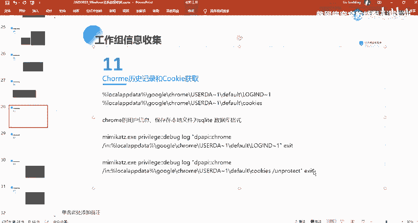

酷奇的一个信息。

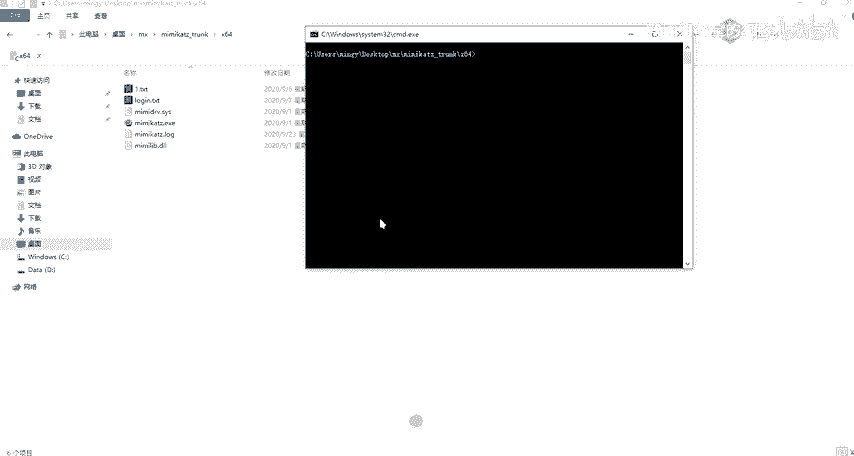

就我们访问的一些网站啊，对吧？啊，访问的这些网站的话，它会有存存储在存储的一些cookki值，对吧？像比如说在这边访问的这一个网站，对吧？然后它的存储的一个cookki值。以及还有相应的这样子的一些。

这边的话大家自己去尝试吧，好吧。对吧。我这边的话。就不细看了。

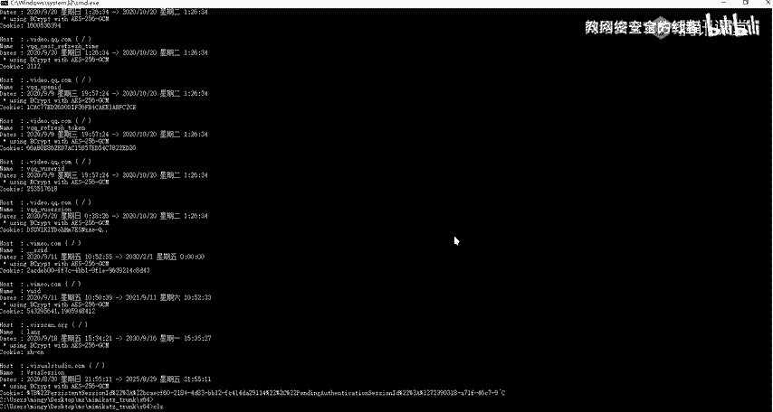

大家也去看一下自己的。然呃，还有的话就是通过抛 share。我们在这边的话就是通过的这样子的一个脚本的这个get information的这个脚本。它这个脚本的话。

它能够去获取到我这边写的这样子的一些信息啊，就FTP啊共享链接，还有呃驱动应用程序hos的文件内容进程，还有无线网络的一个记录。就是在这边的话啊把前面的相相关的有一些有一部分的一个内容。

他把它汇汇总到了这样子的一个脚本当中。然的话通过这个脚本的话，就能够去啊，直接去批量的获取到啊目标机器上面的这样子的一个信息。那还有的话就是通过MSF。就MSF的话呃，也是大家常用的对吧？就我这边的话。

我我不演示了。大家可以就是自己得到这样子1个MSF的一个选，对吧？然后我们可以利用MSF当中的话，它自带的这样子的一个模块。我这边话介绍两个模两个信息收集的一个模块，就是这个cho。

还有这个呃M这样子的两个模块。这两个模块的话，它呃，他收集的一些信息，我们从这个截图当中，我们能够去查看啊。就是说他其实它是相当于也是一个脚本，对吧？然后这个脚本的话，他会去执行这样子的一些命令。

就我们在这边可以看到像比如说RP干就是查看我们的个RP的一些记录，还有IPIPfi干，对吧？他会去一一的把这一些信息去进行一个紧锁收集。然后还有呃问边M的话，同样的他也呃哎。好，这边。这边截图搞错了。

呃，这边这边的这个scrapper这个截图搞错了，这边截的话是这个跟EM嘛。的一个截图啊，就是说这个VVEEM的它的一个功能的话，就直行这样子一个面料。呃，这个的话我有点忘了。

这边截图搞错了。就系统信息。然，大家自己去啊，在自己用MSF去执行一下就知道了。好吧，我这边的话我就不多说了。我这边的话呃，截图搞错了，这边放错了。啊呃。

以上的话就是呃工作组的一些信息收集的一些方法以及思路。呃，这边的话。讲的有点多了。诶。常用2G呃2G呃常用2G2G也行，现在2G浏览器的话还可以。搜索软件搜索软件叫Utos。呃，抛屑脚本的话呃。

沙网会难，但是我们可以有相应的一个方法可以绕过。就可以绕过绕过三轮的。再后面的话可能会给大家呃有介绍。然后其实大家可以去看一下前面的就看第一期的一个内容，里面也有相应的一个那个。啊。

关于前面的这一个内容的话。大家有没有什么疑问？前面那个。前面的这样子的一个工作组的一个信息收集的一个内容。Oh。啊，没有疑问。啊，没有疑问的话，那么我们继续啊，我们抓紧时间把后面的一个呃。

内容给过一下吧。

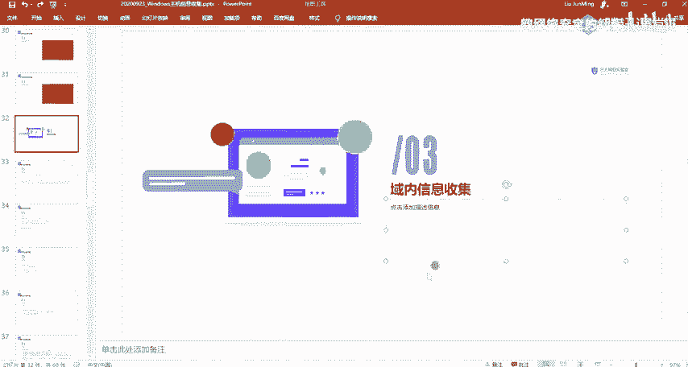