# 2024网络安全系统教程！清华大佬花159小时讲完的网络安全系统课！别再盲目自学了，学完即可就业！零基础入门网络安全！（渗透测试／漏洞挖掘／CTF／黑客技术） - P35：22.域内信息收集.mp4 - 教网络安全的红客 - BV1ft421A7Nj

好呃，下面的话我们一起来看一下，就是域内的一个信息收集。就其前面的话我们讲的是一个工作组对吧？工作组的话，其实我们常常见的就是工作组，对？在域内的话呃，可能大家呃。接触的应该比较少，对吧？

然哦前面现在有同学问就是什么是玉是吧？就这个玉到底是什么？然后与我们前面那一个工作组，他有什么区别？然呃就详细的关于这一个工作组和域的一个区别的话，就大家去看一下这篇文章吧。我这边的话我就不细说了呀。

就他这边文章的话，他就是用他自己的一个语言对吧，就是。就可能大家更好理解一点啊。就呃他用他自己的一个就是比较好理解的一个语言来去介绍了就是工作组，还有域他的一个区别，以他的一些特点。

我这边话就大概的给大家就是介绍一下，就是玉。就域的话它是一个有安全边界的一个计算机集合。就其实就是呃跟我们前面那个工作其实也是比较类似的。就它是呃多个计算机的一个集合，就集合起来组成了一个域。

然后这个安全边界怎么理解呢？就是说在两个域中，一个域中的用户无法访问另一个域中的一个资源。就说这是有一个边界。就是说你在一个域中的一个主机。就是在同一个域中的一个用户的话，他是可以去互相访问的。

如果说你不在同一个域的话，那么他就无法去访问，无法去直接访问。但样的话我们也呃我们可以去配置相应的一个域性能的一个关系来去实现这样子的一个呃跨域的一个就不同域的这这样子的一个访问资源的一个访问。

然后呃玉的话就是说他是将网络中多台计算机逻辑上组织到一起来去进行一个集中管理。就其实前面也说了，就是说他相比一工工作组的话，他那个优点的话就是他是呃。他是能够去批量的去管理呃更多的一个主机，对吧？

如果呃在我们工作组当中的话，他是呃他的这样子的一个管理模式的话，他是呃无法去批量的去管理所有的一个主机的。所以的话工作组它是只适合这种小规模的一个计算机的一个集合啊？就把在呃就小规模的去呃。

在把一些计算机按不同的一个功能来去进行一个分组，对吧？而而在玉当中的话，他是。能够去批量的去访问，去管理，去控制。就是说在这一个域当中的所有的一个机器。然后在这一个域当中的话。

它会至少有这样子的一个预控预控制器。这个预控制器的话，它保存着整个域的一个用户账号，还有安全数据库。就说在预控机器上面的话，它保存着所有用户的一个账号的一个信息，就账号密码的一个信息。

然后的话我们的在域内的一个主机，要去访问其他的一个主机的话，它都会去呃在预控制器当中去查找去查找到目标机器上面的这样子的一个呃用户账号的一个访问权限。然后的话才能够去访问到其他的一个机器啊。呃。

这边的话呃在后面会就是说在讲它的一个capcos的一个协议。就是说在域当中的话，它的这样子的一个密码印证的一个协议的。这时候的话会给大家去介绍。在这边的话呃提一下。

然后呃域它有相应的一些就是需要大家去了解的一些点，就是呃预成云计算机在登录的时候，可以选择登录到域中或者此计算机。就说呃我这边的话。

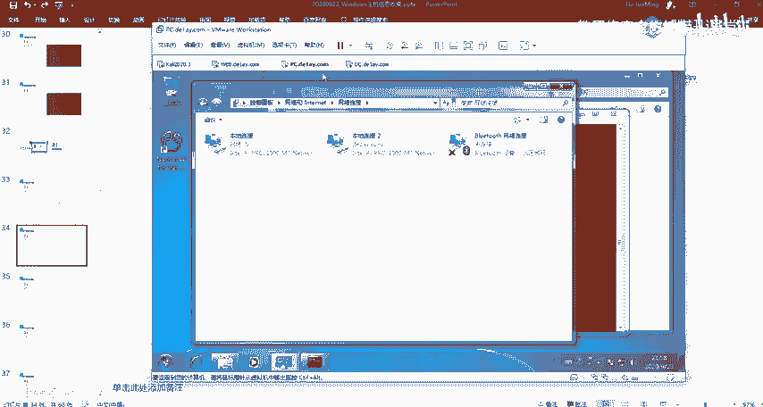

以这个机器为例。比如说我这边这一个机器对吧？我当前的话是登录这个E类mycycl这样子的一个用户，对吧？然后的话其实呃。我可以。呃，我要我要去登录域的话，我需要首先的话输入一个域名。就是登录域的话。

有这样子的方法，有两种登录域的一个方法。我这边的话就先说一下第一个。第类就是我这边当前的一个登录需要去登录的一个域名，然后的话输入我的一个用户。这ば。我用addmin的一个用户去登录这一个呃玉。

然后的话密码是。可以看到在这边的话已经成功的登录进去了啊，这边的话就是我以addmin的一个用户而登录到了，就是已域就登录到了这样子的一个域B类的这一个域当中啊。这边的话。再切换一下用。

就呃首先刚开始是是用的这个mycycl的这样子的一个用户去登录的。然后就注意的话，在这边我都是登录的这个delay的域对？那么我可以选择，就是我不登录。就只登录到就是这个机器这一个主机的话。

我们可以看到它会显示这一个登录到PC这个PC的话其实就是这个机器的一个主机名。就我们的那个计算机名。然后呃密码应该是。Yeah。去。見ます。嗯。呃，我这边忘记了他这个密码了呀。这是什么呃，这个的话。

因为我这边的话是就是用的那个别人的一个把机啊。

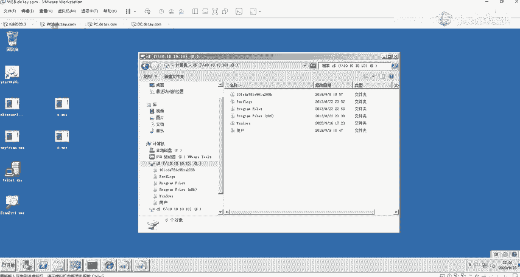

就是我这边就推荐大家去下载的这几个把件，我是用的这一个就wins style3。因为因为其实搭建预环境比较麻比较麻烦，所以的话。

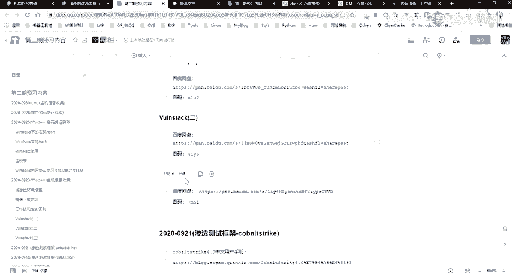

呃，我推荐大家我建议大家也去下载这样子的，就是别人已经搭建好的这样子的一个预环架。然后的话它的这个预环间的话，它里面也有有相应的一个呃。就是漏洞啊，可以去直接去利用，就方便大家去进行一个另手。

然后我这边话是用的它的这个winnes3的这个把件。哎呃，考虑到大家其实我自己不不是很喜欢搭这种环境，就搭环境浪费时间用。而且就比较麻烦，就我建议大家的话就是刚开始学这个的话，呃。

还是就是不要把时间花在搭环境上面。就是大家可以先就是先知道这个东西是什么，对吧？然后的话怎么去进行一个使用啊，什么之后的话，如果说你想要对这样子的一个预环境的一个搭建，更更了解的话。

你可以呃自己去动手搭。然后的话其实网上也有这种搭遇的一个教程嘛，对吧？

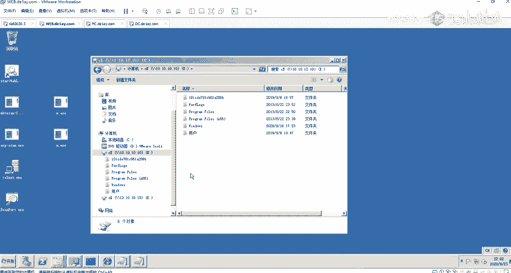

嗯。呃，我这边的话呃这边的话实际的话是可以去登录到我这边的一个机器的，就是登录到本地的一个啊以本地的一个用户。然后的话呃登录到狱中的时候，就是身份印证。在这边的话，就是前面有提到，就是身份印证。

它是采用到这样子的一个cos的一个协议，它是在预控制器上面去进行的。就是说他登录到域中与登录到本地计算机，它的一个身份验证的一个方式，它是不一样的。然后登录到本地的一个计算机。

也就是我们平常的我们平常呃。咁。查个什么呃。就我我平常我这边我去登录我的这边的一个用户，对吧？我登录这个用户的话，就登录到本地计算机。他的一个身份验证。就是首先我们需要去输入我们的一个账号密码，对吧？

输入我们的一个账号密码。然后他输入账号密码之后的话，它会通过这样子的一个印证，就印证你的一个账号密码是否正确，对吧？然后它的一个印证的话，它会是通过这样子的一个就是sam，就这个sam的话。

它是存储在我们计算机本地的一个文件。这个文件当中的话，就存储着我们当前计算机上面啊，所所有的这样子的一个用户的一个啊呃用户的一个信息。就包括你的一个账户账号名以及密码信息。然后它的一个密码的话。

它是通过1个NTMNTLM的一个呃印证。就它是一个通过NTM的一个呃加密算法来去进行一个呃加密的。好，关于这一个的话。呃，下节课会给大家具体的讲一下。

就是这个NTM就是说我们在下节课讲我们的一个密码哈希获取的时候，会介绍到这样子的一个，就是说windows上面的一个哈希的一个内容。这边的话大家先了解一下，然后登录到狱中的话。

它是采用的这个coice的一个协议。呃，这个的话后面也会讲啊，大家先不要急。先了解一下。哦呃，默认情况下的话，预用户可以登录到域中的所有的一个工作上。也就是说呃。

你是一个如果说你得到了一个预用户的一个账号密码，那么你就可以去登录域中的其他的一个主机。当然的话它是不包括预控制器的。预控制器的话。有控制器的话，你需要预的一个管理员的一个账号才能够去登录啊。嗯。

然后呃在奖玉的话，就需要给就大家需要去了解的几个概念，就几个。呃。就几个专有的一个名词吧。首先第一个的话就是预控。就预控的话，其实前面我们提了很多了，对吧？就在预当中的话。

必须至少有一个这样子的一个角色，就是这一个预控，也就是DC就是这个domon control。就是啊预控制器嘛。然后的话在。就预架构预架构当中的话，预控它是用来管理所有的一个客户端的一个服务器。

也就说我们如果说我们登录了这样子的一个预控制器，那么我们可以在这个预控制器当中去管理单前域当中的所有的一个机器。所以说我们再去进行一个渗透的时候，去去进行这样子一个预渗透的时候。

我们最终的一个目的其实就是去拿到这样子的一个预控的一个权限。如果我们拿到了预控的一个权限的话，那么当前的这个预下面的所有的一个主机都是我们可以随便的去进行一个登录去修改。

我们我们能够去对这个域当中的这一些主机有一个完全控制的一个权限。然后的话呃预控的话，它是我们预架构的一个核心啊。然后在预控制器上面的话，它包含有这样子的1个AD活动目录的一个数据库。

这个活动目录数据库的话，它这个数据库当中的话，它就是呃存储着我们的所有的一个预用户。好不，所有就是我们呃当前域下面的所有的一个主机，它的一个呃账号密码的一个信息。

它都存储在这样子的一个活动目录数据库当中的。大家要注意的话，就是说在域当中与我们本机的这样子的一个登录，通过这个s目文件，它的一个区别就是在域域当中的话，你的一个身份印证的时候。

你是需要去呃通过这一个域的，就你首先需要去访问预控制器。然后的话在预控制器上面，它会去审核你的这样子的一个账号密码，它是否正确。它去审核你的账号密码的话，它会通过这样子的。科巴斯的一个协议。

然后他在中间的话，它会有系一系列的一个过程，然后他会去在这个数据库当中去去查找你的这样子一个登录的一个账号密码。它是否正确。如果正确的话，他就会允许你去访问到其他的一个机器。然后的话呃，就。

在一个域中的话，可能。就至少有两个预控，就一个作为一个就是DC就是主预控啊，也不是主预控，就是一个正常使用的1个DC预控。一个的话一个备份的1个DC就是说备份的的话就是当我们的1个DC控制器。

它就是崩溃了，对吧？或者是说呃损坏了坏了，那么我们的一个备份DC的话就起到了作用。因为我们如果说你DC你的一个预控制器，啊，你崩溃了，你崩掉了。那么域内的所有主机它都是不能够去互相访问到的对吧？

因为你要去访问到其他机器，其他机器的话，你都需要去首先去访问预控。这然后的话有预控制器去进行一个这样子的一个呃。印证审核。然后呃活动目录，也就是前面我们讲的这个AD的一个活动目录数据库。

就呃它是预环境当中提供的一个目录服务的一个组件。呃，它它的一个主要的一个作用的话，就是我们所有的一个网络对象信息，它都是以。一种结构化的一个数据来存储在这样子的一个活动目录当中的。

就这个activedirecty。然后网络对象有哪一些呢？像比如说我们的一个用户，还有主计算机、共享资源、打印机联系人等等这样子的一些网络对象的一个信息，它都存储在这一个目录当中。

也如是说我们所有的一个用户，他的一个信息以及组的一些信息啊等等的这些信息，他都存储在这1个AD活动目录当中。然后的话呃AD活动目录的话，它的一个服务器就是我们的一个预控DC。

也就是他的1个ID活动目录的服务器，它是在预控预控制器上面的。呃，以及活动目它的一个主用功能的话，这边的话大家自己课后去看嘛，我这边我就不一一的去介绍了。然呃还有就是这边的几个就是容器。

这边的一个容器的话就是。呃，如果大家有去有去。

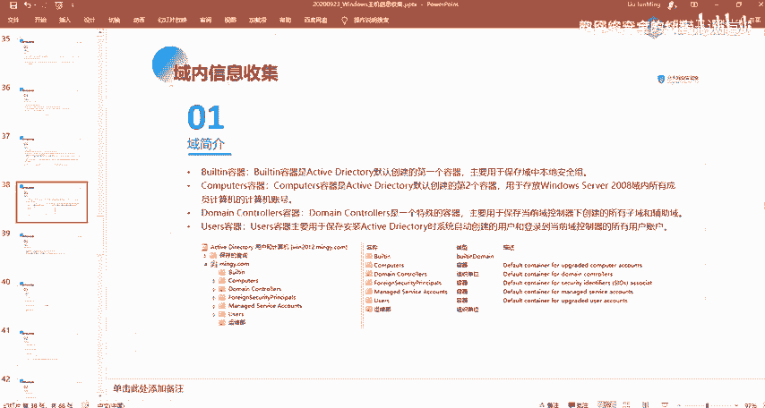

用这样子的一个玉的话。嗯。

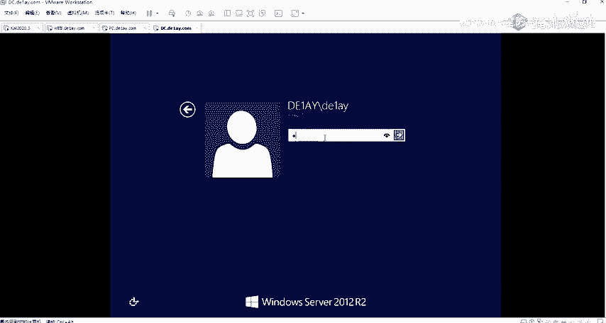

用这样子一个域的话，你进入到它一个预控制器之后的话，它会有这样就是在这样子有一个AD的一个用户计算机的这样子的一个东西啊。在这边的话有这样子的一些呃选项，也就是这样子的一些容器，还有组织单位等等。

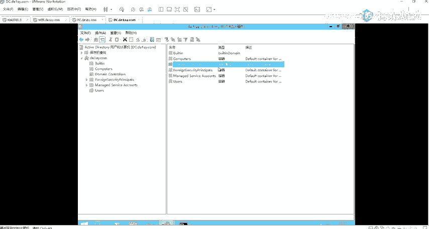

然后在这边的话，我们来大概了解一下，就是说这样子的一些容器它的一个作用啊。对我们知道这样子的就是ADAD的一个活动录的话，它是存放着一些啊我们的啊网络对象的一些信息，对吧？包括用户的一些信息啊等等的。

对吧，然后的话在这个AD的一个控制器当中吧，好不AD的这样子的一个活动目录当中的话，有这样子的一些容器。像这个B名容器，它是AD默认创建的第一个容器，就主要用于保存域中的一个本地安全组。

然后我们可以在这边就是选择这个辫子里来查看到在这边的话，它存储了这样子的一些安全组。就本地域的一个安全组。然后在这边他有这么多的一些安全组啊，然后呃这边的话也有相应的对这个组的一个描述。

像比如说这个优者。呃优折的话呃，优者的话就是我们的一个用户组嘛。我们本地的一个呃用户组。呃，还有ad命主要就是我们的一个管理员组，就是他可以对计算机，还有域的话有不慎不受限制的一个完全访问权。

就是说有这样子的。如果说我们的一个用户他是在这一个呃组当中的话，那么我们。那么他的这个用户呢就是一个管理员的一个用户。就是关于这一个标题容器，它是存放保存域中的一个本地安群组。

然后com呃computerscomputers这一个容器的话就是呃用于存放我们的一个就是windows服务器的。好。这个不是windows设为的708呀，是用来存放。

应该是windows server域啊，就是说用来存放我们当前的这个呃域当中的所有成员计算机的一个计算机的一个账号。就是说我们可以在这边来看一下computer这边的话有两个计算机，对吧？

然后这两个计算机的话，它的一个就是说它我们就是这两个计算机啊，就是这一个web还有PC的这两个计算机，然后的话因为它是在域当中，对吧？在域当中的话，它加入到了域当中。

我们如果说web这个机器要去访问这个机器，要去访问这一个机器的一个资源的话，那么它中间会有这样子的一个过程，就它首先这个web机器它会去访问预控。

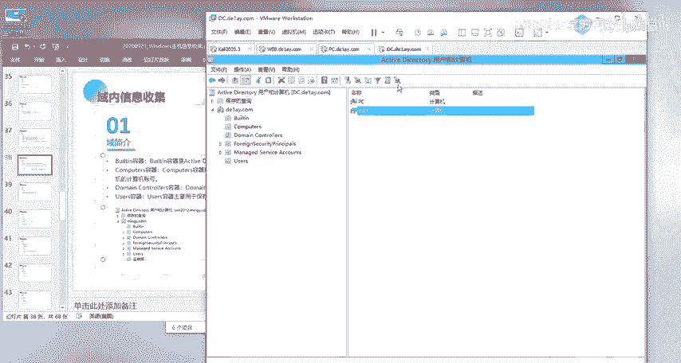

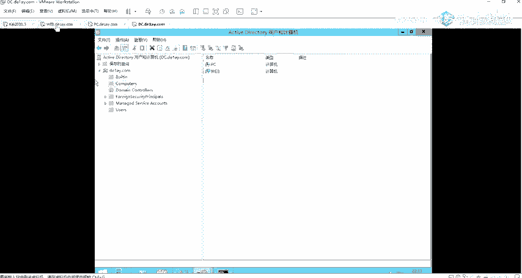

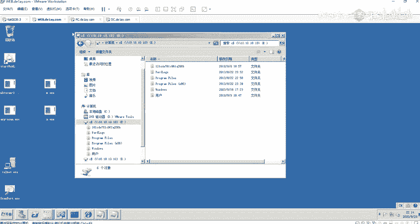

然后的话在预控当中，他会在这个AD目录当中去查找，去印证你的给出的这样子的去就去访问这个资源，他需要他的这个用户名以及密码，对吧？那么他就会去在这一个目录当中去查找。去找到对应的这样子的一个计算机。

它存储的一个呃呃用户名密码的一个信息，对吧？然后的话与这边给过来的去进一个匹匹配。如果匹配正去了，那么它就能够去访问到这个机器的一个资源。所的话在这边的话。

他在这里的话就是存储的啊域当中的所有这种用户的一个账号的一个信息。啊呃，这个doomain domainin controller就是预控嘛。

在这边话就是我们可以在这边能够看到在这边它是存储着预控的一个信息啊。就其实就是我当前的这个机器，它的一个信息啊。

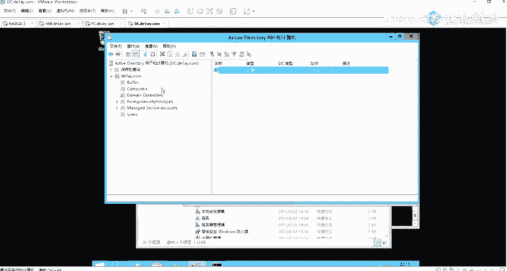

然后还有就是呃优着使容器。要者是容器的话就是用来保存，就是在安装预控，安装这个ADAD的时候，它系统自动创建了一个用户，还要登录到当前预控制器的所有用户的一个账号。

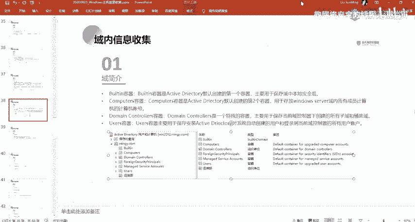

嗯。我们来看一下。就是啊在这边像比如说我们这边有一个delay的这样子一个用户，对吧？这一个用户的话。就是我们能够去进行一个呃，它是一个预用户，还有这个m ja set。My s circle。对吧。

还有这一个administer的这样一个用户，这这三个用户的话，还有这个ghost4个用户的话，他就是一个预用户啊，就是等于在这边的话，他是有4个预用户。也就是说我们这四个用户的话。

我们都可以去我们可以用这四个用户来去登录。啊，在域在这个域当中的这样子的一些域的一个主机。

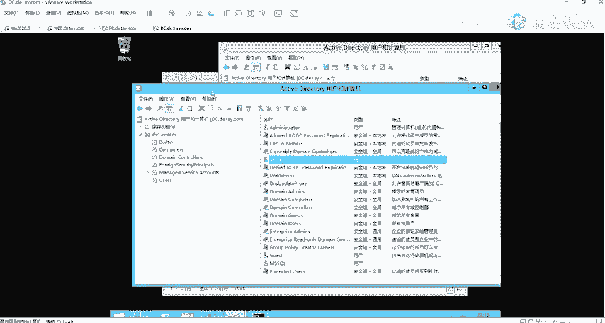

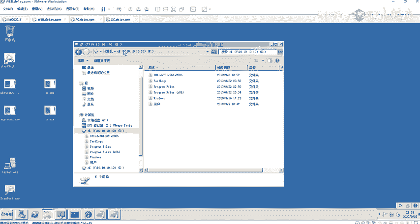

像比如说在这边啊，我们可以登去登录这样子的一些主机。嗯。呃，DC崩溃了。呃，对，到时候的话我们有所以的话我们需要有这样子一个备份的1个DC嘛。对。就你你的这个DC你崩了的话，我们有一个备份DC的话。

你那个DC你崩了，我们这个备份的DC我们可以直接就提起来嘛。就不会去嗯。

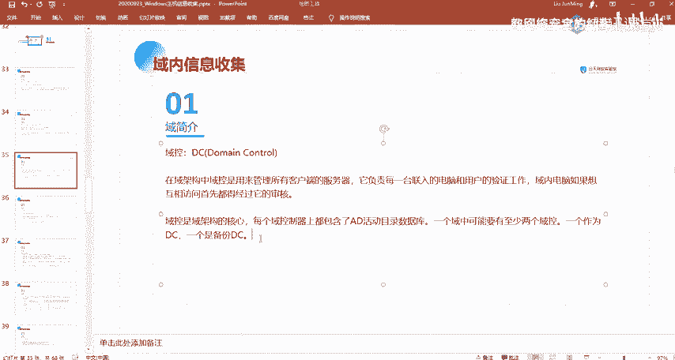

影响他的这样子的一个。影响他的一个浴环境嘛。影响呃各个主机之间的这种访问。

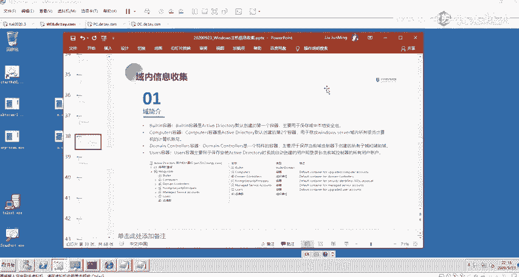

呃。还有一个呃，还有一个东西的话，就是这个DNS的一个域名服务器啊，就其实前面也有提。这DS域名服务器的话，大家要注意的话，就是呃我们的一个预控服务器。

它是要求DS服务器按名称来去查找计算机成为服务器和网络服务的。也就是说我们的一个预控器预控，就是说在域内的一个机器，我们是需要按照这样子的一个计算机名，还有像这种网。

按照这种名称来去查找对应的一个计算机的对吧？所以的话我们需要有这样子的1个DNS的一个服务器来去进行一个解析。然后它的一个作用的话就是通过它的1个A记录将域名解析成IP地址嘛，是吧？

那么我们就说在预控就是说在预控制服务器当中的话，它有这样的一个DS服务器，能够去把来自呃域内的一个主机，他去请求的这样子的一个计算机名。来去把它解析成对应的1个IP地址来去进行一个访问。

然后呃DNS域名服务器的话，我们可以用来去定位我们的一个呃活动目录服务啊。就是说我们知道就是说DNS服务器的话，它是在预控上面的，那么我们就能够知道呃这个DNS服务器。

它的1个IP就是我们的1个预控的1个IP。那么。我们也能够去知道，就是说我们的一个活动目录的话，因为我们活动目录的话，它是在预控上面嘛，对吧？这呃，通过DNS来去定位预控，在后面的话也会有介绍的讲到。

然后呃下面的话就是在域内的一些信息收集的一个面令。呃，在这边的话我就不细讲了呀。好吧，这一些命令的话，我这边的话有很详细的一个介绍。就其实这些命令的话也是比较常用的，而且就你。就大概讲一下吧。

讲一下比较常用的。像比如说这个啊net be dorm，这个的话是我们。经常用到的这样子的一个命令，我们可以通过就netre的话，我们可以通过这个命令来去查看到当前的这个多门。

就查询当前这一个主机它是存在哪一个域当中。然后在这边的话，我们就能够去知道它的一个域名是这个第一。DEAY这样子的一个域。我们能够通过这样的一个命令来去判断当前的一个主件它是否在域当中。

以及它的一个域名是什么。就是说我们在前面再去进行分析我们的一个内网环境的时候，对吧？有提到这样子的一个呃东西。然后还有就是我们查询域内的所有的一个主机。所有的一个计算机，对吧？我们可以通过命令来去查看。

要。Next you。SB啊。就啊我们可以通过这样的一个命令，就是。在这边的话，我们通过net view，然后加这样子的干多门。这边的话干多门的话呃。

我们在后面会经常会碰到这样子的一个就是命令参数的一个格式。就大家在windows机器上面的话，其实我们能能够知道我们很多的一些命令券。

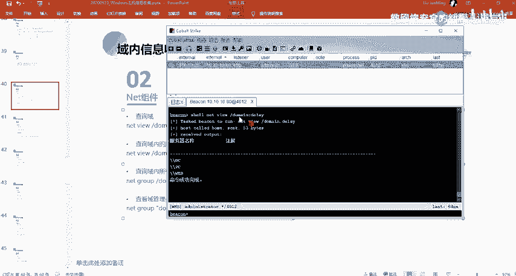

就如果大家如果经常玩win的话，会经常使用到这样子的一个横盖，对吧？然后在windows下面的话，它是一个斜杠来去表示这样子的一个参数的。像比如说我们的一个IPb，对吧？不是这样子的横杠过，对吧？而是。

鞋带好。对吧。然后同你在这边的话，我们这边的一个干多门。它其实就是指定了这样子一个多门的一个参数，对吧？然后其实就是指定我们的一个域名嘛。然后我们在这边查询到的域名是DEIY对吧？

然后这边的一个命令的意思的话，就是查询在域当中，在这个Dlay这个域当中有哪一些计算机。我们可以看到在这边有三个计算机，对吧？这三个的话，这三个计算机大家注意这边显示的都是计算机名额。

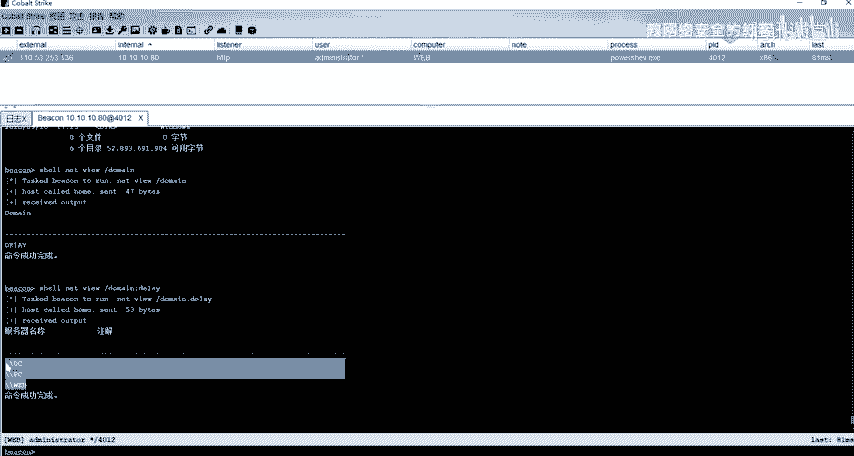

啊。就呃之后的话也会大家会经常会碰到，就去看到这样子的一些形式，这样子的一个形式。呃，以及。查看预控制器。这个也是我们。经常会去用到的，就是说我们需要知道，就是说我当我当前的这个域当中的话。

它的一个预控制器是哪一个？对吧？我们在这边的话，我们可以通过这样子一个命令，有预控制器的话，就是doin controllert，它是在这样子的一个组当中的。

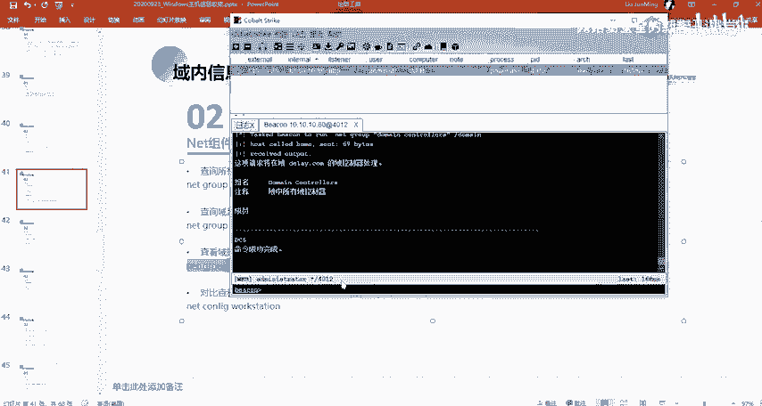

然后的话我们可以找到有这样子的一个成语DC也就是我们能够去知道在这边的这个主机名为DC的这一个呃这个机器的话，就是我们的一个预控。

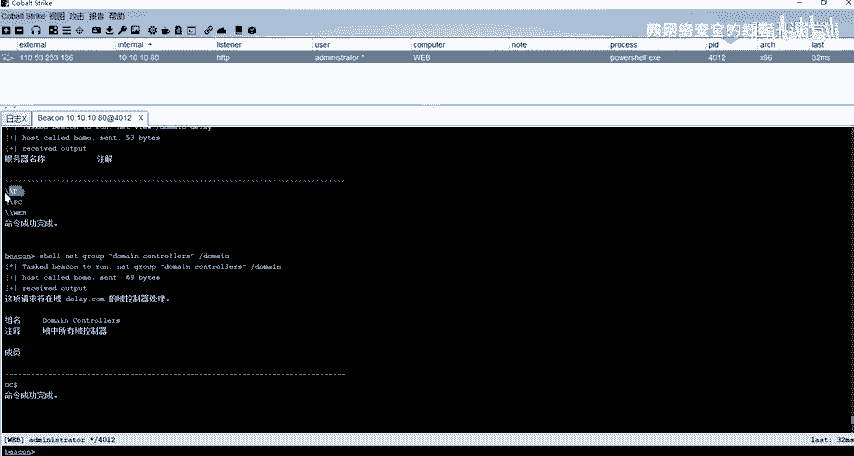

但的话这边的话它是命名的话是以DC命名的嘛，对吧？就我们通过命名的话，也能够知道。但的话如果说他不是按照这样子的一个命名的话，那么我们需要通过这样子的一个方式来去判断你的这样子的一个主机。

它哪一个是预控。嗯，还有可以查看域内的一个所有账号。就是你的一个在当前这个域当中，它有哪一些用户。就我们可以看到在这边的话有这样子的一些用户。这里的话除了这个catcat就是KIBTTT这一个用户的话。

这个用户的话呃在后面会给大家讲。这个用户的话是比较特殊的。他这个用户的话，他是就是说。呃。嗯，他是一个不能够去登录的一个用户。但是他的这个用户的话，就我们再去进行一个开协议的一个认证的时候。

会去用到就是说呃域内的一个主机去向我们的一个预控区进行一个验证审核的时候去进行一个资源访问的时候，会去用到这样子的一个ke呃KRBTTT的这个用户他的一个哈希子。好，我在这边的话。

我们可以看到在这边有这样子的4个用户，这四个用户的话，其实都是我们的个域用户啊，就在域内的这样子的一个用户是吧？就是就是对应的我们这边的。

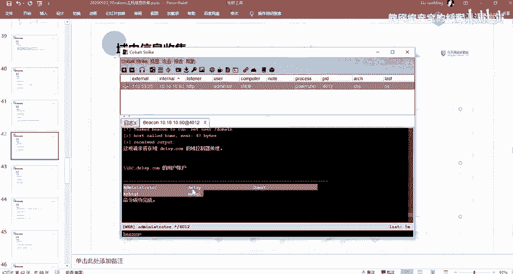

这里的4个用户，对吧？

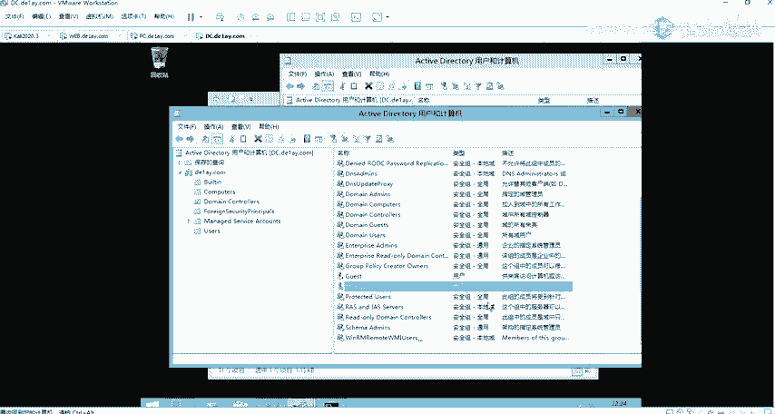

然后还有其他的这样子的一些方法，我这边的话我不一一说了，还有就是通过这个di discra。这一个工具，然后吊坠的话，这一个工具一般是在浴控上才有。就这个Ddier。

我们可以通过这个命令来去查看就域中的账号名啊，还有啊主名啊等等这些功能。然后我们其通过net这一个自带的也能够去实现。是。这个的话就是介绍有这样子的一些方法，能够去进行域内的一个信息的一个收集。

还有其他的一些，像比如说查看域内的一个信任关系，以及查看预控制器的一个机器名。就通过这个NL test。这个命令，还有我们可以通过N look up来去，就是看域内的一个就邮件服务器啊。

还有这种DNS的一个服务器。呃，大家注意这边的话，这边的话是我的一个域名。有呃，不是我这边的一个机器，是我另外的一个环境。有的话。呃，我另外的一个房间的话是这样的这个MIGY点comM的这样的一个域。

还有就是呃第五个就是定位预控。就定位御空的话，就呃有这样子子的几个方法，我这边念。就就通过前面的话，前通过前面再去介绍这些命令的时候，其实已经大概给大大概给大家介绍的差不多了。就是这一个就比如说。

第1个IP通就我们直接IP通的干货的话，能够查看到它的一些信息，对吧？像DNS的一些信息。就DS的一个服务器，这个IP地址以及DNS的一个这种勤奋，对吧？我们就能够去。大概的判断。嗯。

能够去大概的呃获取到当前的这一个啊域名。对吧也就他呃他的就是预控的1个IP地址，对吧？这样子的一些信息。就主要的话就这里的一个电源室的一个服务器啊。然后其实我们也可以通过，就我们知道了这样子的一个。

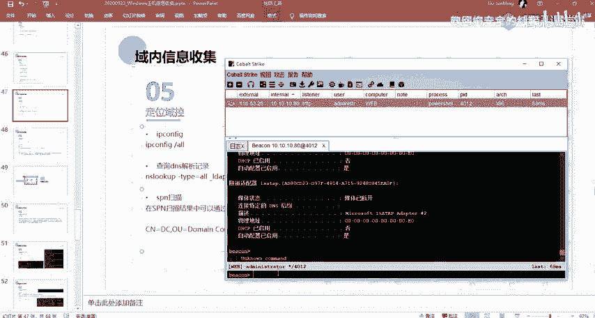

好，我们想要去知道它的一个预控那个IP对吧？我们可以通过。那直接看对吧？我们直接去解析这样子的一个预预控名。然后我们。就能够去解析到他的这样子的一个。预控的1个IP就这个。

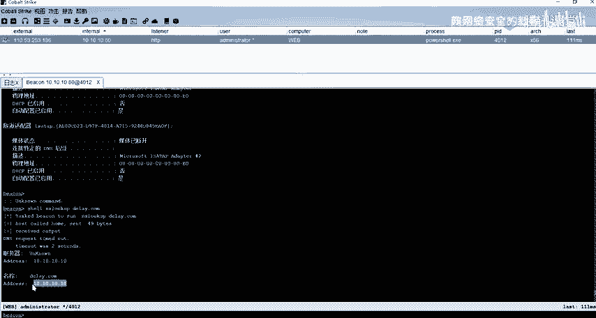

。因呃直接通过A按来去去呃解析我们这边的一个域名。然后的话我们就能够去得到我们预控的1个IP啊。然后以及还有通过前面的就是去定位预控，对吧？呃，去查找就是预控的一个主机名，对吧？来去定位。

还有通过DNS记录，我们可以通过S的然后通过这样子的一个方式来去定一个呃定位。还有呃这1个SPN那个扫描。SPN扫描的话呃。嗰边。哎，后面后面的话有相应的一个内容会讲。应该这边的话大大概先了解一下。

就是呃在这边的话呃，我们可以通过这样子的一个方法。通过SPN的一个扫描来去查看到。像比如说在这边的话，有这样子的几个呃东西，就是CN就是呃DC就表明我们当前的这一个它是一个。呃。

它的一个计算机名是1个DCOU的话就是它的一个doin controller，也就是它是一个预控制器。以及我们DC的一个。你这边少了吧。这个。然后还有的话就是呃通过net group。

就我们刚刚说到的对吧？来去查找到啊这个在这个doin control这个组当中的一个主机名。他的一个成名，他的一个名字是哪一个？然后的话我们就能够去定位到他的一个主机。还有话就是端口识别。

这端口识别的话，其实就是呃。这两个端口就是389389的话就是我们的1个LDAP这个LDAP的话，它是一个目录访问协议，就是它是我们可以通过就。就在预控当中的话。

它会开放这样子的一个目录访问的一个协议的一个端口。就是这个389的一个端口，它是起了这样子1个LGAP的一个服务。以前有53的话，就是我们的1个DNS的一个服务端口嘛，默认的对吧？

因为我们的一个预控上面的话，它是有一个这样子一个DNS服务器。那么我们可以去呃通过扫描呃，通过发现呃主机的这样子的两个端口来去判断这一个主机它是否是一个预控对吧，能够有一个基本的判断。

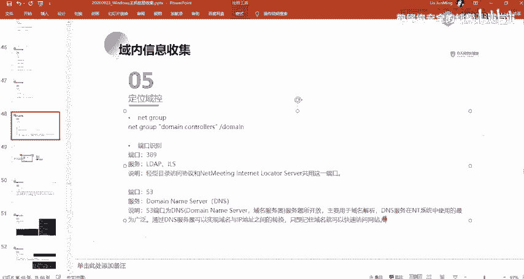