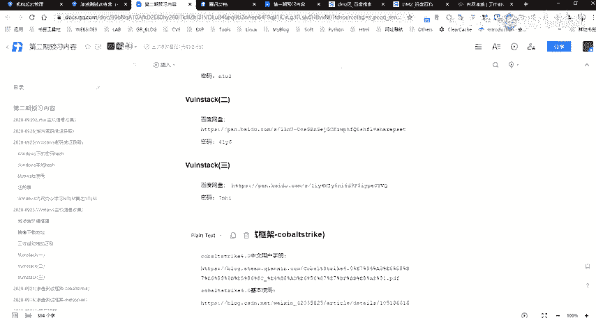
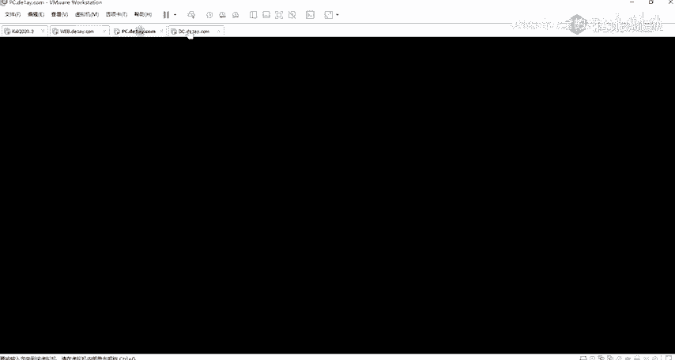
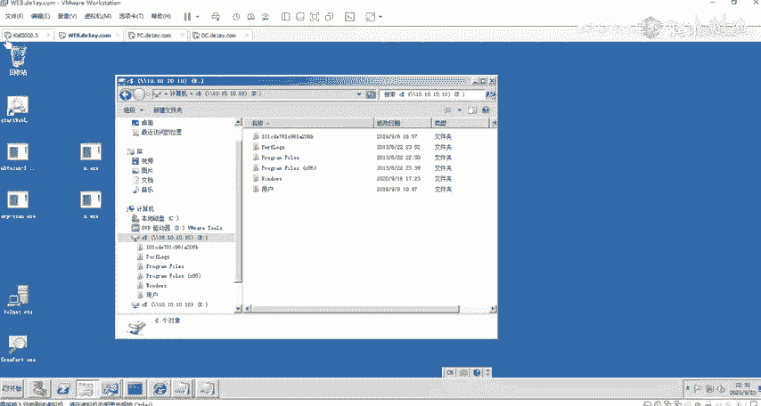
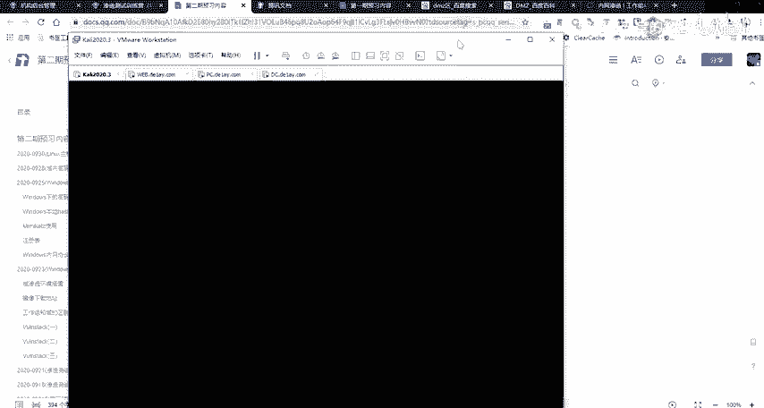
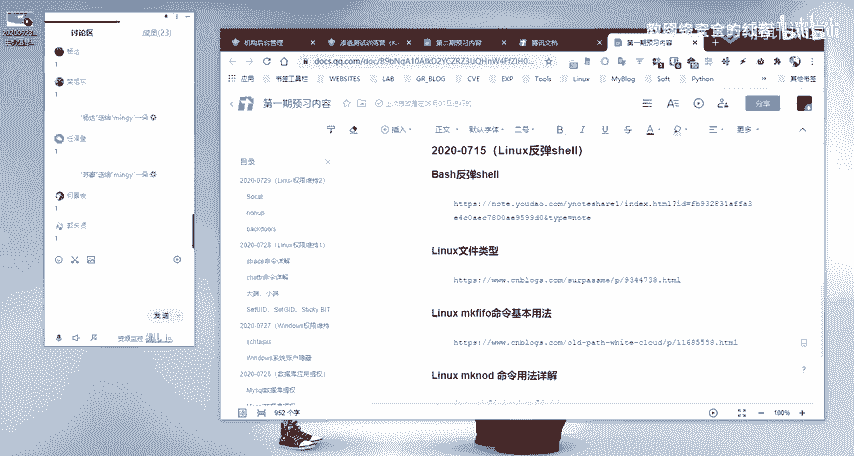

# 2024网络安全系统教程！清华大佬花159小时讲完的网络安全系统课！别再盲目自学了，学完即可就业！零基础入门网络安全！（渗透测试／漏洞挖掘／CTF／黑客技术） - P36：23.内网存活探测.mp4 - 教网络安全的红客 - BV1ft421A7Nj

呃，后面的这一个。内网生活探测的话。呃。我这边的话就不讲了吧，因为呃讲的有点多了呀。现在。又超超时了。哦。不好意思，又忘记看大家的一个问题了。今天讲了好多呃，有点多啊，后面的内容其实都挺多的。

就是所以的话其实我让大家就做好心理准备嘛。就是呃剩下的话下节课再讲呃，下节课还有其他的内容啊。就和大家先。大家先我等会儿把PPT发给大家好吧，然后的话大家先可以先自己先看一下了解一下。

然后的话好好的消化一下我前面讲的一个内容。然后后面的内容的话，如果大家觉得有必要去讲的话，我抽个时间给大家讲是吧？然后我可能下节课的话还是讲的下节课的内容。因为我有下节课的一个安排啊。

重修两三次没必要的没必要。其实呃这东西的话呃也不是说很难，就其实也不是说很很深奥的一些东西啊。就可能大家刚接触的话，可能还是一时半会啊，有点接受不了。然后没关系，你呃你沉下欣，你跟跟着我这边学的话。

然后你有有问题你直接问啊，还是可以掌握的。当呃就这一期的话，因为加了就是有加了预渗透的相关的一些内容。可以呢就所以的话会呃可能大家一时半会比较难理解。就有些东西的话，因为有些东西的话。

可能我这边只是单纯的给大家说介绍，可能大家不是有很深的一个印象，所以的话建议大家一定要在课后自己去进行一个操作。因为我们现在的一个课程的安排的话，是中间有一天的一个时间，对吧？就两节课的话。

这一天的时间的话，大家就是留给大家自己去操作的。然后呃所以的话就是大家自己去在本地，建议大家自己去本地，就是呃可以跟我一样去下载一下这样子的一个把机。这是有这样子的三个机器。

这三个机器它是一个预环境，就不用大家自己再去搭了嘛，对吧？你自己去搭的话，你还要去安装这种系统啊，对吧？然后的话还要去配置。虽然配置的话其实也不是很难了。

但是能节省自己很多时间嘛，当当然的话就是下载的话需要时间。

然后你再加一个卡里的话，你就能够去呃就组成了你的一个就是学习的一个环境。

嗯。好吧。呃，解压呃，应呃应该是的呃，是的，就是你解压之后的话，你当然的话你还是需要去配置的，就你需要去进行一个相应的一个网络配置。当然的话你网络配置你不知道，你可以问我好吧。你直接在群里问。

只要在群里问就可以了。就是你需要配置网络吗？比如说我这边的话是桥接，还有就是自定义的这样子的一个。嗯。云木 name。大家呃有什么问题吗？应该没有什么问题啊。嗯。好，就是我这样子给大家讲课的话。

大家能接受吗？哦，或者是说呃就是大家有有什么就是建议，对吧？如果我觉得你的建议可以的话，我可以采纳的。就是主要的话最终目的是要让大家能够去就是理解我讲的一个内容啊。我呃现在大家不好说的话。

大家可以就是私聊我好吧。就如果觉得我这样子就是讲课的一个方式，或者是说内容太多了，对吧？内容太多了，这个其实也是一个问题啊。以及我讲课的一个节奏，命令不要讲太多呃，好，可以。就是呃前面的话。那前面是呃。

不是有同学，就是说就是这些病的话不是很了解嘛，是吧？嗯。好呃，应该没有其他的。后面的这一部分内容的话呃，PPT发给大家，大家自己去看一下吧。其实我这边的话已经写的相当详细了。对吧。

包括命令以及呃我这边的一个使用的一个截图结果是吧？也就是一个内网的一个存环探测，就是通过在这边的一个net bus协议，然后的话。以及还有像SMP。还有UDP的一些协议。

AIRP还有一个端口扫描sber协议，对吧？等等等这样的一些协议来去进行一个内网的一个主机的一个存环探测。以及在去利用这些协议的时候的话，我们经常会去用到的这样子的一些工具。像比如说MF。

对吧我们可以通过m的这样子1个NBT state这样这样子一个自带的一个脚本。还进行一个netbu的一个协议。利用这个netbu协议来去探测呃这个网段它的一个存活主机。对吧还有用MSF啊，对吧？

还有这样子的1个NPTNBT scan这样子的工具。这工具的话是常用的一个工具啊。就是很他的一个速度很快，而且就是呃他的一个这种回旋的话，我们很很好理解。还有SMP的话，就是其实就是我们的king嘛。

是吧？就我们可以通过这样子的一些命令行的一个方式。以及通过map，还有port sharesp share的这样子那些脚本。好吧。这边话我就不一的说了呀，就是一些。常用的一些方法给大家已经汇总好了。

大家只需要了解就可以了。呃，对呃，其实就是一个预环境嘛。因为呃因为在后面的话，在讲玉的时候的话，也会。呃，PPT备注吗？备注的话，我应该没有什么备注吧。呃，如果有的话，我。备议组有的话，我呃。

我另外发个文档吧，好吧，就把备注内容，我发文档里面，或者我直接发在这边的一个在线文档上面，好吧，我直接贴到贴到这边。哦。还有其他同学还有问题吗？没有问题的话，我们就下课了。今天的话呃。没问题的扣一。

有问题的扣2。OK okK都没问题啊。好的好的，那呃。那我们下课吧。好呃，大家呃早点休息。今天的话又讲的比较多了。时间长了。好，大家早点休息啊，晚安。这怎么下了？

