# 2024网络安全系统教程！清华大佬花159小时讲完的网络安全系统课！别再盲目自学了，学完即可就业！零基础入门网络安全！（渗透测试／漏洞挖掘／CTF／黑客技术） - P37：24.windows Hash简介.mp4 - 教网络安全的红客 - BV1ft421A7Nj

我们今天的话主要给大家介绍一下windows的一个密码凭证获取。然后呃主要的话我这边分为了3块内容。第一块的话就是给大家介绍一下windows的话哈希，就说什么是呃windows下面的一个哈希。

第二个的话就是系统用户密码的一个凭证获取。第三个的话就是az我这边的话就包括了呃其他的一些方法，就是说不仅仅是你系统用户的一个密码，以及包括了你系统当中的一些呃软件，以及相应的一些。

像比如说我们的一个IDP的这种连接。你的这种连接的话，有保存的这种凭据。我们尝试去获取。这种RDP的连接着它的一个密码。好，呃首先第一部分就是windows的一个哈希警戒。

那么什么是windows的哈希呢？就说呃。windows哈希的话，我们简单理解就是windows加密过的一个密码口令，我们可以称之为一个哈希。哦呃这个哈希的话在这边我们知道它是就是说我们的一个密码口令。

比如说我们是一个addmin这样子的密码口令。那么它经过加密之后，它有这样子的一个加密的一个算法。加密的一个函数，把它加密之后的话，我们就会生成有这样子的一个哈希纸。那么在这边的话。

我们需要知道它有windows下面的话，有什么样子的一个加密方法呢？呃，windows系统下面的话会使用两种方法对用户的一个密码进行一个哈希处理。他们分别是呃lenman，就仅称的话是LM。然后的话呃。

net learn manage manage的话就是NTM。就我们一般的话都是说它的一个检测就是LM哈希，还有NTM的一个哈希，就是呃比较呃比较方便说嘛。哦呃这边的话还要知道的话，就是说我们。

看一下这边，看一下这边第二页PPT的这个图。就说我们在windows下面的话，它有两种这样子的一个M哈希的一个加密的一个方法，对吧？然后的话在这边要注意的话，就是说LM哈希的一个密码，它最大长度为14。

然后的话如果说你的一个就是说你的一个密码口令，它的一个长度超过了14的话，那么LM它是无法去对它进行一个加密的。它是呃如果超过了14位的话，它就会使用我们的1个NTM的1个哈希。

以及的话就是说LM哈希的话，它是有。就是存在缺陷的。所以的话在新版的这样子的一些系统上面的话，它默认的都是使用的1个NTM的1个哈希纸。所以说在后面的一个内容的话。

我们不会过多的对这个L哈希做过多的介绍。主要的话关注这个NTM的1个哈希。哦，哦。大家要知，但是大家一要知道这样子的1个MLM的1个哈希啊。因为我们在后面的话会也会去用到。

就是说有一些工具以及呃命令的话，你需要这样子的1个M哈希以及NTM哈希的一个格式。好，呃，然后的话还有大家要知道的话，就是说NTM哈希的话，它已经有了这样子的就NTMVR的一个版本。

就是说它有两个这样子的一个版本。它每一个它的版本的话，它的一个加密的一个方法的话，它是有区别的。以及呃Cs的一个验证体系。关于Cverse的一个协议的话，其实上节课也有提。

然后我在后面的一个内容会给大家展开的介绍。嗯。🎼前面这边的话，我们主要的话就是关注关注我们的这样子的一个win下面的1个NTM的一个哈希。然后以及我们的windows系统下面的一个密码，哈希。

它默认情况下是由两部分组成的。就是说我们的第一部分的话是LM的一个哈希，第二部分是NTM的一个哈希。它中间的话是由一个冒号，就是说这个这个冒号做一个分隔。啊，我们可以具体来看一下。

他的一个哈希的一个密码格式。密码格式的话就是像我这边所呃这边所写的。首先第一个的话就是说你的一个用户名称，然后的话冒号注意冒号的话，它是一个分隔，就是分隔两个部分的一个呃符号。

然后RID的话RID这边的话就是它的一个呃。说到这个RID的话，我们先看一下这边我这边贴的一个图。首先我这边的一个用户名称是administrate，对吧？它的RID的话就是500。然后大家要注意的话。

这边的1个ID的话，它其实是啊唯一的。就是说。哦，等会的话再展开介绍。然后后面的话就是接我们的1个LM的1个哈希值。LM哈希子后面的话以冒画分隔分隔之后的话，后面就是NTM的1个哈希子。

就是说我们这里的这一部分是LM的一个哈希。后面的这一部分的话就是我们的1个NTM的1个哈希。然后后面的多个冒号的话，我们不用管它这一部分的话。然后呃还有在这边还有其他的一些用户。

像比如说我这边的1个winIN7用户，他的1个ID的话就是1000，对吧？还有还有特使的用户，个词的用户，对吧？他那个IID值的话，它是不一样的。然后这边的1个RID我们如何去知道它是什么呢？

就是说呃比如说我就在我当前的这样子一个windows的一个机器，对吧？

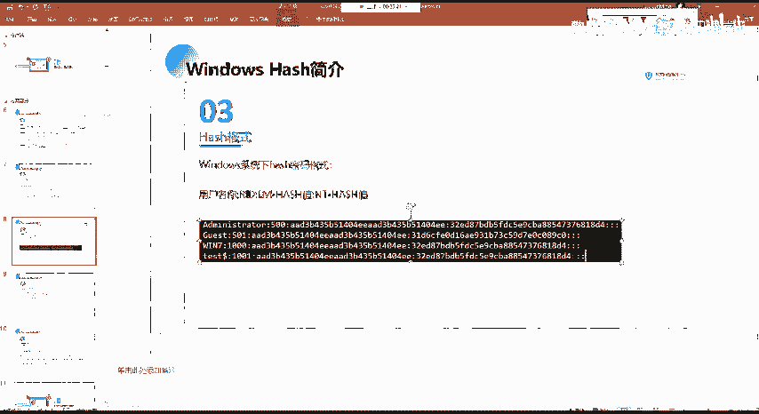

关咪。是我的一个。

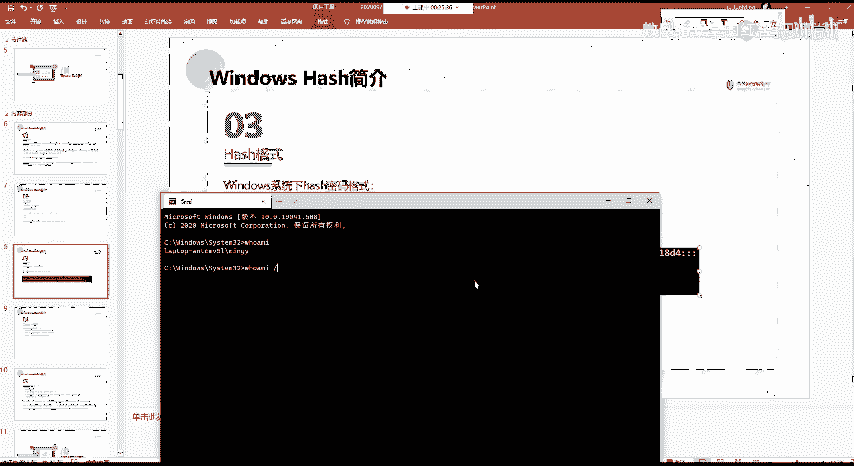

我换卖干货干货的话，我们上节课有讲就是。呃，有这样子的一个命令，对吧？我们通过这个命令能够查看到当前用户他的一些呃，比如说他的一些主信息，用户信息以及他的一些特特权信息。然后在这边的话。

我们可以看到当前我的一个用户是这个MIG的一个用户，对吧？就这一个用户，然后这这边的话有1个SID的一个值。这个SID值的话，它是一个唯一的。就说你的一个windows系统上面的话。

它每一个用户它都有一个唯一的这样子的1个SID值。然后这边的1个SID值的话，我们注意后面的这一部分有一个这样子的一串，对吧？1011001这一串的话就是我们的一个用户的这边的1个RID。你经我。

看一下。😔，稍等一下。呃，这边的话我通过这个WMI这个命令，就是这一这里有一个user count。这个U在看的话，我们通过这个密的话能够查看到，就是说你当前的系统下面它的所有用户的一个账户的一个信息。

然后在这边的话。嗯。然后在这边的话呃，我们可以看到在这边我可以看到在这边能够有这样子的5个用户，对吧？这5个用户的话，他每一个用户这边他是他的一个用户名，对吧？用户名。

然后这边的话是它的1个SID的一个值。这边的1个SID值的话，其实我们可以看到前面的这一部分的话，它都是。啊，一样的对吧？前面的这一部分都是一样的。对吧就每一个用户他的SID前面的这一段都是一样的。

然后它的一个不同的话，就在于我们后面的这一个这一串这一串的话就是我们的这边的1个IID。然后它的一个唯一的话就它的一个不同的地方其实就是在于这个RID的一个值。

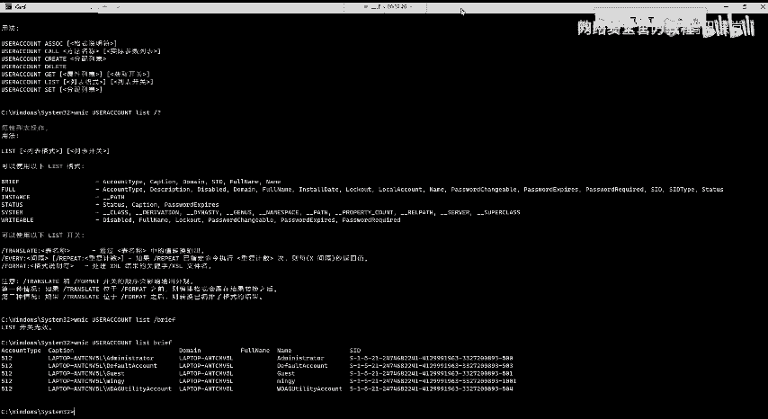

就呃大家可以自己查看一下自己的一个。大家可以查看一下自己电脑上面的这样子的一个用户的一个信息啊，就能够知道。然后所以的话在这边的话，我们就能够去理解这样子的windows下面它的一个哈希的一个密码格式。

它是怎样子怎样去组成的对吧？

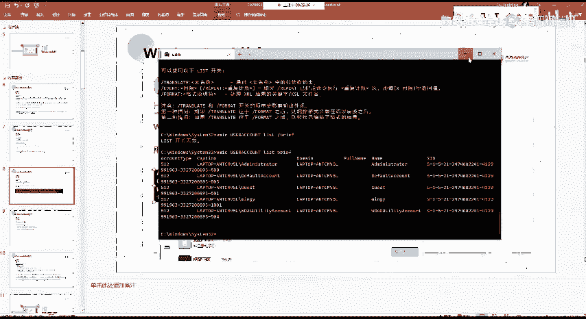

这个的话能理解吧。应该没有什么问题啊。呃。你们是都是呃，还在上学，对吧？就是上学要上课是吧？呃，那。那你们的话更加要就是要。更加要呃多花点时间，对吧？因为你白天的话要上课的话。

你我这我们这边的一个课程内容的话，可能你就做的会比较少。那么那么你课余的这些时间，还有周末的时间的话，还是要抓点抓紧一点就是。好的，能理解。那么我们继续。然，下面的话我们给大家介绍一下。

就是说windows的一个认证基础。在这边的话呃，其实本来的话应该是在后面会给大家去讲啊，就是windows认证的一个基础，以及就是说windows认证的三个部分。就有这样子的三种认证方法。

首先第一个就是本地认证，就本地认证的话，它是用户直接操作计算机去登录账户。就说我们这边的一个本地认证，其实就是我们平常我们登录我们自己的一个电脑，对吧？我们。我们登录我们自己的一个电脑，这边登录电脑。

我们使用我们的一个用户名，然后的话输入我们的一个密码，就登录到了我当前的这样子的一个系统，对吧？这个的话就是一个本地认证。然后呃网络认证的话就是远程的去连接到工作组中的每某个设备。就是说我去远程的。

比如说我用FTP，还有我用呃这样子的一个文件共享，对吧？我文件共享这种我要去连接到我这一这一个work group这个工作组当中，或者说某个工作组当中的其他的一个设备。那么这边的话它的一个认证方式的话。

就是网络认证。哦哦，预认证的话就是登录到预环境中的某个设备。在这边的话呃，后面呃在这边的话，本地认证以及网络认证这个的话。呃。我不知道大家有没有去看，就是说我这边给的一个预行内容啊。

这边给的运行内容的话，其实大家看了这几个文章的话，应该也能够有一个基本的一个理解以及印象，对吧？叫呃这里的这里有这样子的一个NTM哈希以及nettNTM哈希这边的NTM哈希的话。

就是我们本地的这样子一个认证的话，它是使用的这样子的一个哈希，对吧？然后这一个netNTM哈希的话，就是说我们这边的一个网络认证方式的话，它是通过这样子的一个。呃，这篇文章的话我就不打开了。

大家预习的时候有去看嘛，对吧？以及还有就是呃NTM的一个呃详细的一个介绍，以及这一篇文章的话有。以及这一篇文章的话，就是你看了这一篇文章的话，应该就能够去理解。就是说这边的1个M哈希以及NTM哈希啊。

他在这边的话也介绍了就是说他的一个加密的一个方法。就如果大家对这种加密的方法就是感兴趣的话，可以去研究一下。当然的话在这边的话我不会去对这一些做过多的一个讲解。

然后的话呃我们这边的话我们主要的着重的就是给大家介绍一下windows的一个本地认证。啊，问的是本地认证的话，呃，大家看一下这边，就我这边的话把它分成了这样子的四个步骤。就是四个就是中间的四个过程。

首先第一步就是用户输入密码，对吧？我们登录一个登录一个系统。

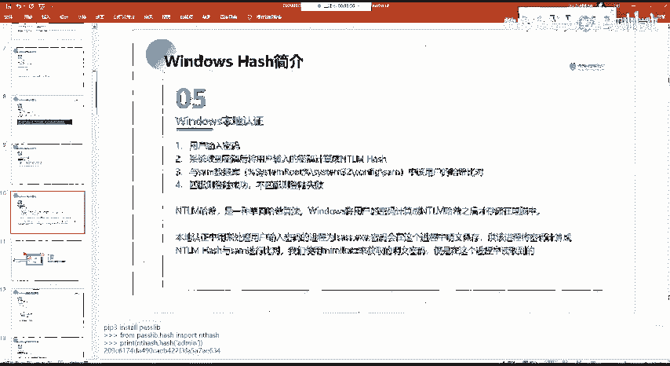

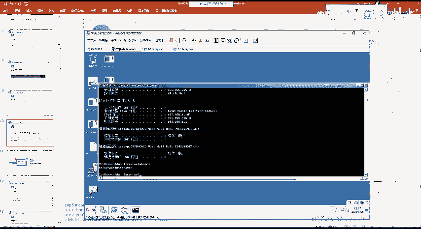

我这边。登录这个系统，对吧？我先输入密码对吧？我随便输入一个密码，然后的话呃输入用户名以及密码，对吧？我这边随便输入。然，输入之后的话，就是说系统它在接收到你这边输入的一个密码之后，它会做什么呢？

它会将我们用户输入的一个密码，它会计算成1个NTM的1个哈希。然呃在这边的话要注意的话，就是说你新版本的一个系统上，它都是用的1个NTM的1个哈希嘛，对吧？然后的话如果说你是一些老版本的一些系统的话。

你的一个密码长度没有到14的位的话，它可能是用的1个LM的1个哈西的一个加密算法。这边的话应该能理解对吧？然后他把我们的一个密码计算成这个NTM哈西之后，它会与我们的一个samsam数据库。

这个sam数据库呢，它是存储在我们的一个windows的一个本地本地系统上面的。它的一个位置的话就是在这一个路径下面。就是在这一个路径下面。然后呃这个路径下面的话有这样子的一个sam文件。这个文件的话。

它它就是存储着我们这个windows系统上面的所有的一个用户名的一个呃这样子的一个哈希值。然后呃当我们要去登录这个系统之后，输入密码，它会把我们的个密码加密成NTM的1个哈希。

然后的话在与我们这边的1个s数据库里面所保存的这一个用户所对应的1个NTMM哈希值去进行一个比对。如果说你比对成功了，也就是匹配，那么就能够去成功的登录这个系统。如果不匹配的话，它就会去登录。

它就是登录失败，对吧？嗯。然后像比如说我这边我登录。啊，我这边登录之后的话，它会有它就会有这样子的一个过程。它会把我们的一个输入的一个密码，我这边要输入admin，对吧？

它会把我们的这样子的一个addmin的一个密码加密成NTM的一个哈希值。然后的话再去进行一个比对。然后这边的一个呃。NTM哈西的话，大家可以用这样子的一个pathon的一个模块。

就这里你首先需要去安装这样子的一个pass lab这样子的一个库。然后的话可以调用它这一个库当中的这样子个NT。哈希这样子的一个。这个方法。

然后的话把可以去把我们这边给定的一个呃字符给它加密成我们的1个NTM哈希的一个格式。啊，像在这边的话，我们呃admin的一个哈希值的话，NTM哈希的话就是这这一串。啊，我这边。把代码发给发出来吧。

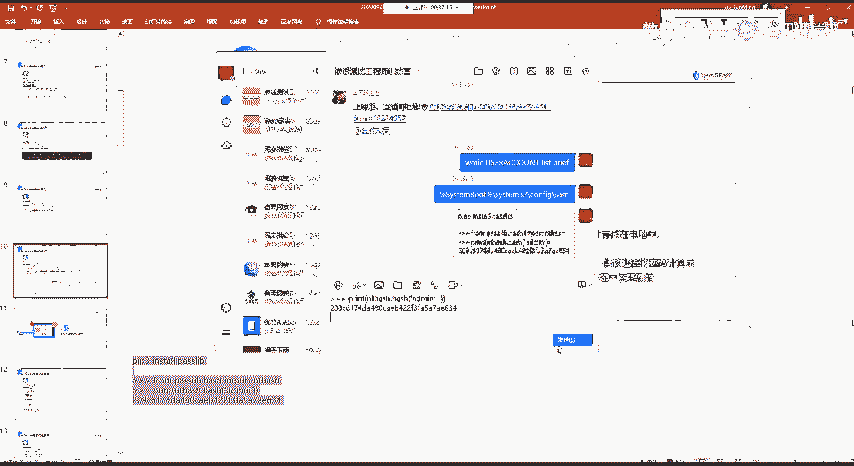

然后我们。这边看一下。我就不敲了，我直接付。然后这边的话就得到了我这边ad面这一个字符，它的一个铁磨哈西。

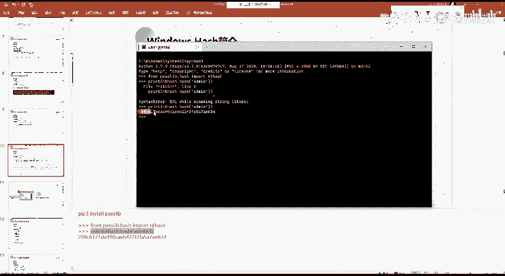

然后像这种NTM哈希的话，其实像这种比较紧的NTM哈希，我们可以去进行一个解密。就是这边的话。

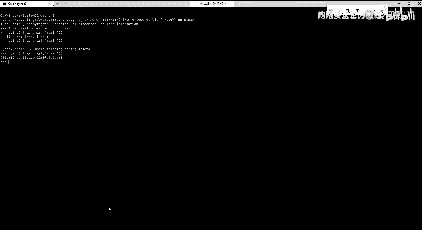

待会会讲啊，我这边先让大家看一下效果吧。啊，就这个CMD5这个网站的话，大家应该都知道对吧？我它里面可以解密很多的这样子的一个呃。一个加密的这样子的一个。呃，串。

然后的话在这边其实他也有NTM的NTM的一个解密啊。我这边的话直接查询。应该是能查出来，然后可以直接很快的就查出来。像这种比较简单的这种密码的话，它的一个哈希值的话，我们可以很快的去查出来。

然后可以看到在这边它的一个类型的话是自动的识别为了1个NTM，对吧？就是说它是用NTM哈NTM的一个方法加密的这样子的一个值，然后解密的一个结果是at命。

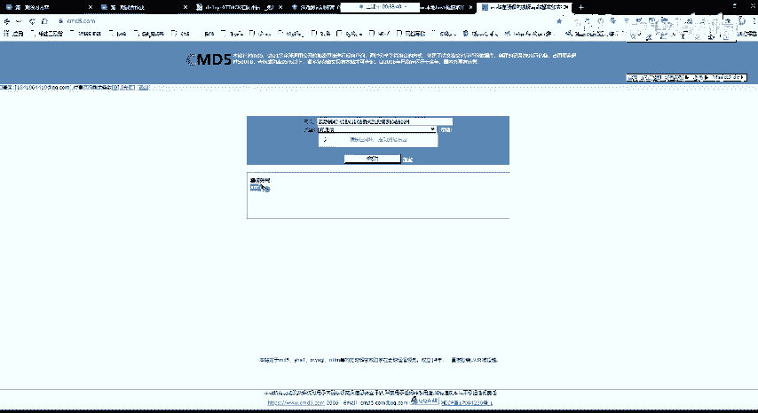

所以说呃。我们等会的话会给大家讲，就是说我们如何去获取到系统当中的这样子一个哈希子。然后的话我们通过这个哈希子的话，就能够去解密成我们的这样子的一个铭文的一个密码。

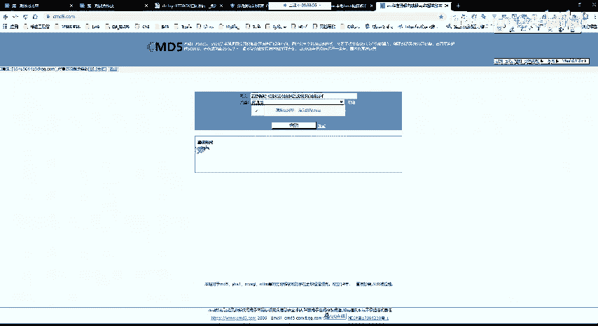

然后的话会给大家介绍呃多种解密的一个方法。啊，不是多种获取这个哈希值的一个方法。

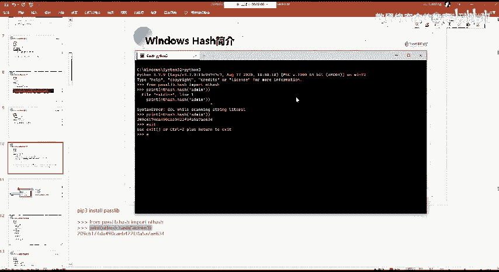

然后的话呃。NGM哈希它是一种单向的一个哈希算法，就我们的一个用windows，它会将用户的一个密码计算成这个哈希值之后的话。存储在电脑当中，就说你的一个你在创建用户，就比如说你创建一个用户。

你创建用户之后的话。你需要输入密码，对吧？那么你创建用户之后的话，这个密码的话，它就会把它计算成NTM那个哈西值存储到这样子的一个s数据库。啊，关于这个s姆数据库的话，大家可以去看去这一个目录下面去看。

当然的话你这边直接的话是打不开呃，直接的话是你打开的话是一个乱码，就是你看不到里面的。实际的一个内容，因为它是一个加密的嘛。嗯。而且在这边的话要注要注意，就是说这一个的话，你是需要一个管理员的一个权限。

你才能够去访问的。所以说在后面的话，我们我们要去获取到这样子的一个，就说从这样子的一个sam数据库当中去获取它的一个哈西的话，你是需要一个管理员的一个权限的。啊，在这的话有这样子的一个sm的一个文件。

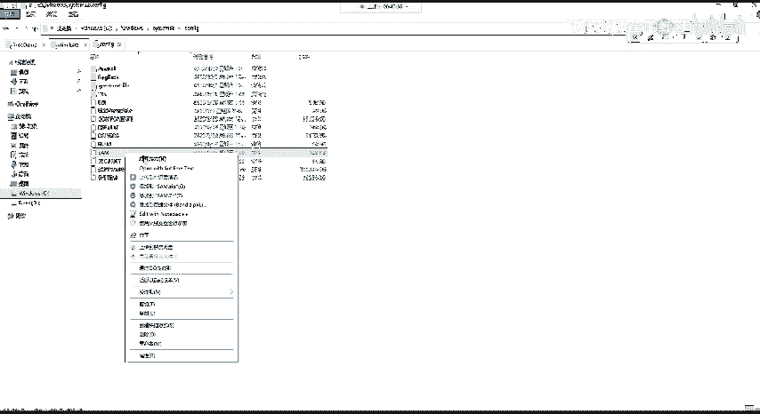

这个文件的话。这个文件的话。

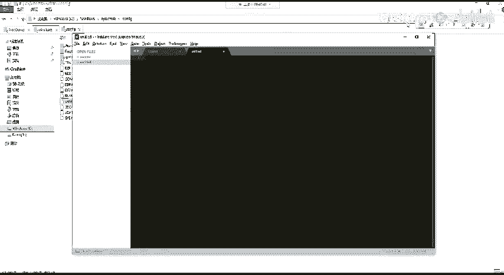

你这边打开了，打的话是打不开的，就是说你看不到它里面的一个内容。啊。后面的话可以介绍我们如何去获取它的这样子的一个哈希值。然后呃还有的话就是我们本地认证。本地认证的话。

它中间的话有这样子一个特殊的一个进程，这个进程也是待会会去涉及到的。在这边的话给大家介绍一下。就是说我们再去进行本地认证的时候。

它windows系统下面有这样子的一个进程叫LSASS点1XE这样子的一个进程。这个进程的一个作用的话就是用来处理我们用户输入的一个密码。就是说我们的输入的这样子的一个铭文的一个密码，对吧？

在windows系统上面，它需要把它进行一个加密，对吧？那么这个铭文的一密码的话，它会在这样子的一个进程当中保存。然后的话。在这个进程当中的话，再把我们呃输入的这样子的一个铭文的一个密码。

它把它加密成我们的1个NTM的1个哈希，对吧？然后的话再去进行一个比对。但是在这边的话就是说有一个问题，就是说我们这边的一个密码的话，我们输了一个密码，它会在这个进程当中做一个铭文的一个保存。

那么我们可以通过相应的一些方法来去从这个进程当中获取到它的一个铭文的一个密码。然，呃在后面的话会有讲到，就是说使用这一个mini cards来获取名为密。就这边他获取名为密码的话，获取名为密码的话。

它其实就是在这一个进程当中去进行一个读取的。

