# 2024网络安全系统教程！清华大佬花159小时讲完的网络安全系统课！别再盲目自学了，学完即可就业！零基础入门网络安全！（渗透测试／漏洞挖掘／CTF／黑客技术） - P38：25.系统用户密码凭证获取.mp4 - 教网络安全的红客 - BV1ft421A7Nj

嗯。呃，第一部分内容的话，大家能理解吧。应该没有什么问题吧，就大家有没有什么疑问？能理解我这边讲的吗？就是说能能接受我这样子的一个呃介绍吗？能能接受能理解的在讨论区扣个一。就有问题的话呃，扣2。ok。

应该都没什么问题啊。那么我们继续。好，第二部分第二部分的话就是我们今天的一个主要内容，就是系统用户的一个密码凭证获取。在这一部分内容的话。

我我会给大家介绍这样子的10种方法来去进行一个呃我们的一个密码凭证的一个获取。在这边的话会就是说会涉及到我们前面所介绍的一个哈希，就是说通过相应的一些方法来去获取它的一个哈希。嗯。

首先第一个的话就是呃mini cards。min mini cards的话，它是一个就是说呃相当有名的这样子的一个。呃，工具啊这个工具的话，它的功能很强大。然后的话也是我们经常会去使用到的。

就是说它能够去读取啊系统的一个密码，以及能够去。解密解密我们的特定的这样子的一些啊加密的这样子的一些密码。第二个的话就是呃抛 share尔的一个一些脚本。

就是说我们通过抛 share的一个方式来去加载啊获取哈希的这样子一个脚本。呃，以及还有下面这一个的话，我就不一一的去说了。这边的话呃等会的话会一一的介绍。好。

首先的话我们先来看一下第一个就是mini cars。明你看着的话，呃，大家可以去这一个网址去下载。然后呃在工具包里面的话，其实也有也有给。

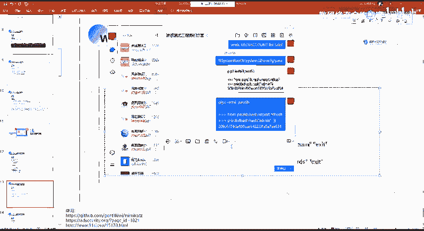

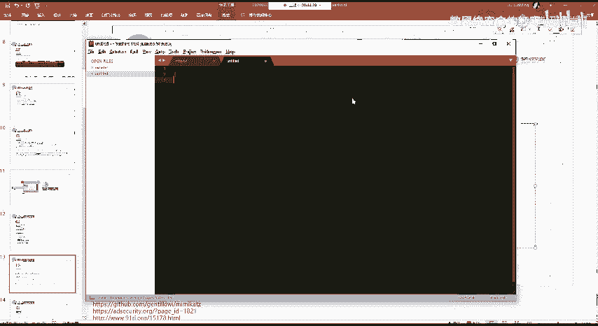

就去这一个网站去下载，就是在github上面。先呃最近的话他应该有更新啊，就7天之前的话有更新了。然后呃他在这边的话。呃，集成了就是说最近爆出来的一个域内提全的一个漏洞，就是这个zerologgan。

这个的话在后面的话呃应该会给大家去介绍，就说我们可以直接用这这样子的一个min令 cards来去进行这个呃域内提群的这样子的一个。呃，漏洞就说这个漏洞的话，我们可以就利用它的这样子的一个协议。

利用它里面的一个协议来去协议的一个漏洞。来去把我们的预控的它的一个用户密码，把它置为空。然后的话我们就能够去啊去得到预控的一个权限。就就是一个提全的一个呃漏洞。呃，因为我们知道我们得到了预控的话。

那么它就能够对这一个域当中的所有主机都有一个完全的一个控制嘛。好。然后的话呃。下面的话介绍一下就是说min卡的一些用法。呃，这边的话就是一个使用的一个就是本地非交互士的一个凭证获取。

这也是我们经常会去用到的。就是说我们的一个mini卡的一个工具的话。嗯。I know。就你下载下来之后的话，是这样子的。然后的话在这边的话有这样子的一个程序，对吧？然的话你直接输入咪。因为看。

然后的话他就会去进入到这样子的个交互式的一个界面。然的话就去输入相应的一些命令，对吧？当然的话这样子的话就是适用于就是说。

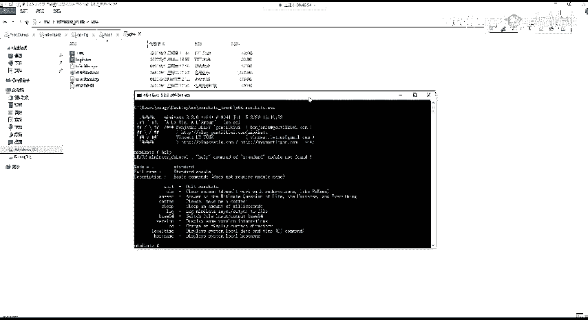

就我们实际的话我们实际去执行的话，就是说呃你不可能你直接直接有这样子的一个交互式的这样子的一个命令函，对吧？除非你直接得到了它一个，比如说你远程桌面登录上去，然后的话把它传上去，然后去执行，对吧？

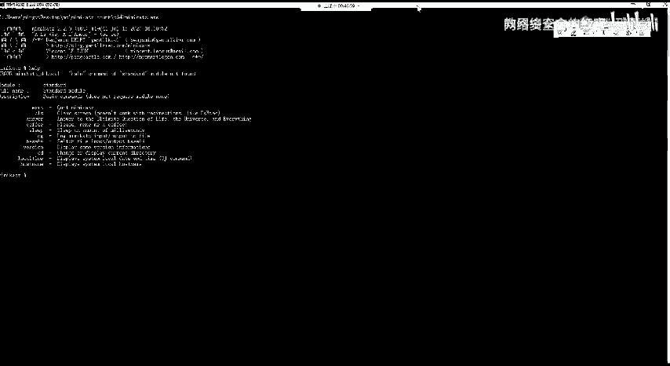

就去这样子的一个交互式，就一般的话都是常用的用非交互式，就直接获取。通过这样子的一个非交互式，通过一条命令。呃。通过执行这样子一条命令来去获取我们这边的一个呃密码哈希。然后这边的话我们看一下呃。

大概的介绍一下关于它的一个具体的一个使用的话，大家看我给的那个预习的一个内容，里面有啊关于这个mini卡的一个详细的一个使用，对吧？好，呃在这边的话我们大概来看一下，就是我这边给的这两个min令。

首先这边的话呃min令 cards然后。在这边的话，每一个语句的话，它是用的一个双引号去做一个分隔。然后注意要有有空格的，是有空格来用双引号去包裹每一个命令。这边的loggoIES点tex的话。

就是说这个log的话就是记录嘛，就是说它会。呃，把我们在这后面执行的这样子的一个结果的一个内容，它会写入到我们这边的一个文件当中。就这个呃指定的这个名字IES0tex。哦。

呃这一个第二个面的话就是进行一个提全。就说我们要去把我要去就是说我们这边执行命令看的话，我们首先需要去执行这一个命令。这个命令的话就是呃把我们的一个呃就是进入到我们的一个Dbug调试的一个模式。

然后你要去进你要能够去进入这个debug的一个模式的话，你首先你需要有一个就是管理员的一个权限，你才能够去进入啊。也就是说你要去获取这样子的个用mini卡来去获取密码的话，你需要有管理员的一个权限。呃。

然后的话就是这一个。Talken average。这个我有点忘了呀。这个是呃获取。系统的一个拖ken来去进一个提群。真的。我这边话用交互式的一个方式给大家演示一下。

可以看到这边它返回了1个200，就说说明我们已经进入了这一个debug的一个调试模式，也就是。

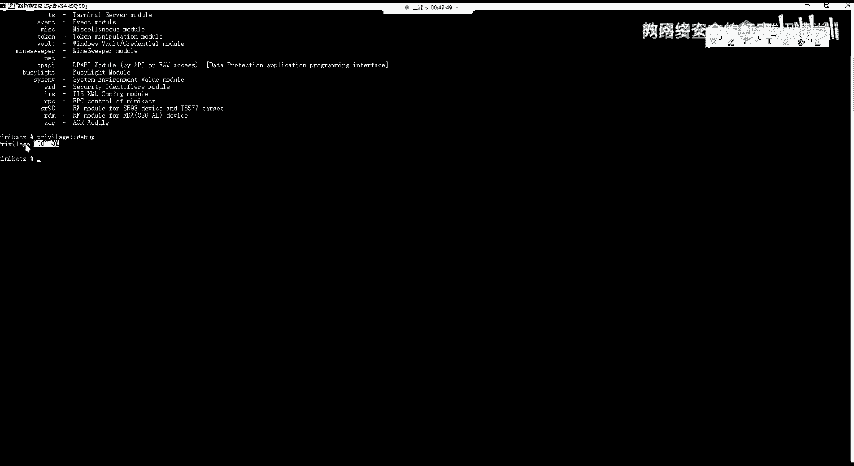

进行了相应的一个提全。然后的话呃。这个taken的话。呃，token的话，这边的话，它是我们可以用这个token。

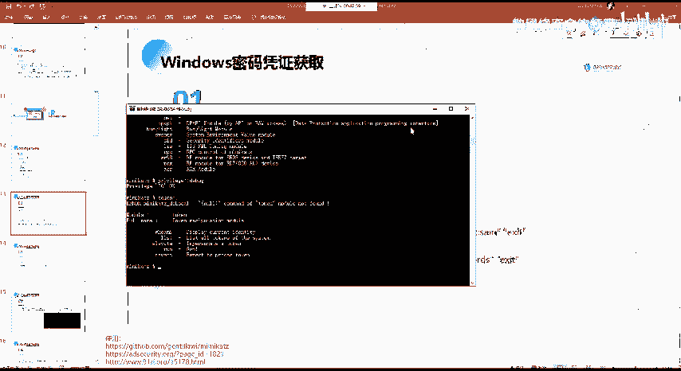

嗯。就我们可以通过利用它的这个功能，就是token list来去列出当前。就是说当前系统上面的话，我们可以去用哪哪一些token。就关于这个token的话，在后面会给大家介绍。

这边大家只需要知道有这一个托ken就可以了。然后的话呃我们可以就是说。这个用windows系统下面，它所保存的这一个拖ken来去进行相应的一个提全。在后面的话也会介到介呃介绍的就是。呃。

token的一个呃to取获取以及token的一个注入提全。然，这边我们就是token average的话，就是用它系统自带的这样子的一些token来去进行一个提全。就im person这个是。啊。

模仿就是。就是他会去模拟呃系统当中所存在的这样子一个token来去进行来去得到相应的一个权限。

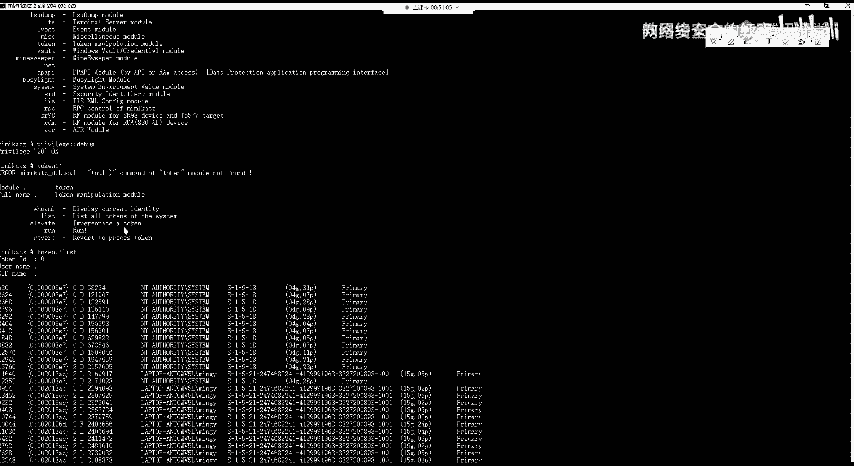

然后的话呃这个LSds的话，它就是会去我们的一个sam数据库当中去获取到我们的这样子的一个哈希值。这边的话呃。

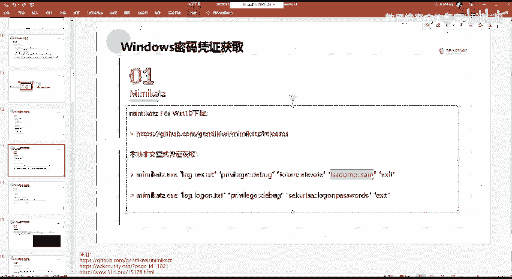

在这边。

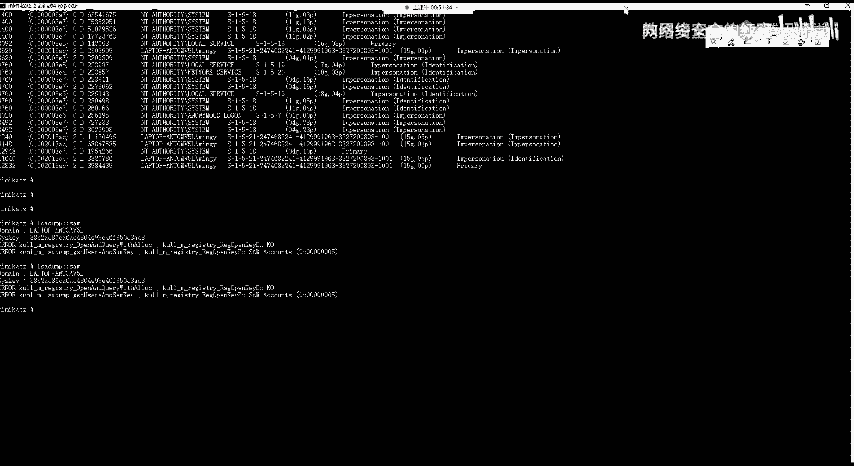

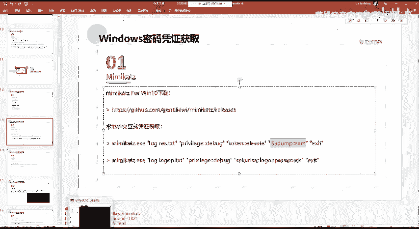

在这边。

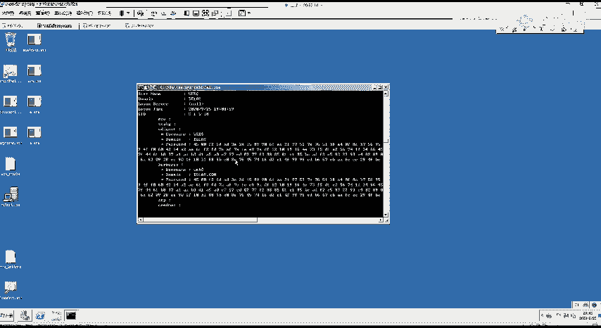

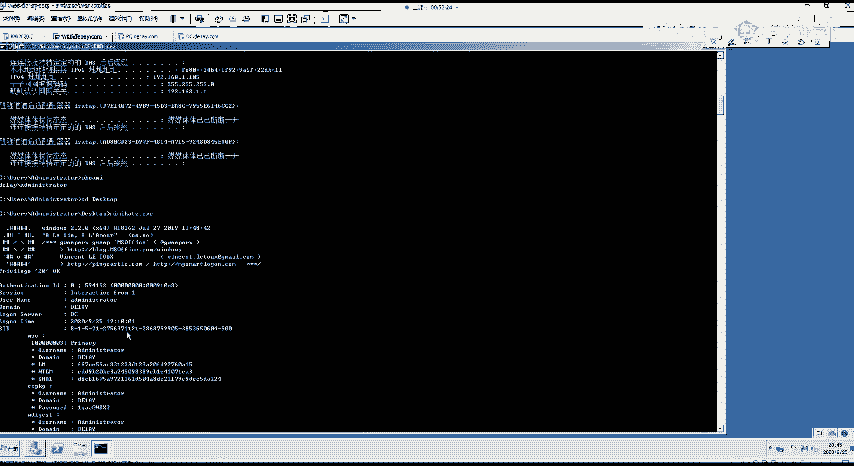

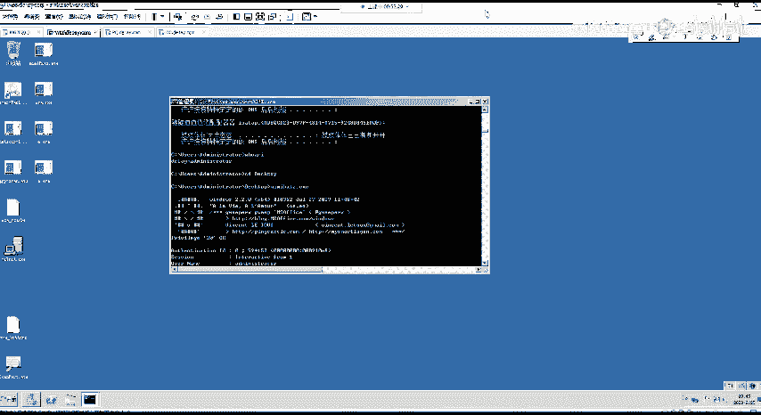

F。呃，已经46了，我们先休息5分钟吧。然后的话呃。我们先休息5分钟，然后呃我这边的话先把课断一下，然后50的时候我再上来。

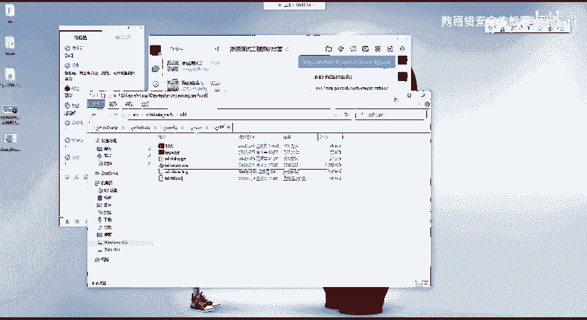

好吧。然，刚刚话我们讲到用这个mini cards，对吧？

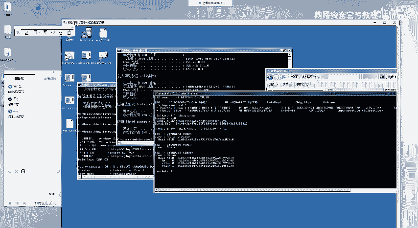

然后在这边的话呃。大刚刚大家应该也有看我操作吧，是吧？就呃首先你用mini cards，你进入这个交互模式，然后你首先需要用这一个privi debug进入debug的一个模式进行一个提全。

然后在这边的话。用这个tken talkingken average来去进行来去。进行一个呃token的一个模拟。然后这边token的模拟的话，其实我当前的话是一个面的一个权限。

然后的话我这边通过token那一个模拟的话，能够去把我当前的一个权限把它给提到我们的一个stem的一个权限。然后的话我再用这个Ld来去dmp我们的一个samp。三姆数据库当中的一个呃内容。

然后这边的话就是我这边d下来的一个内容啊，就是。可以看到在这里的话呃，有这样子的一个userusmin，然后他的1个NTM的1个哈希值的话就是这一串，对吧？以及还有这个呃DDEAY这样子的一个用户。

这个用户的话，我们可以看到他这边呃有呃NTM的一个哈希，然后的话还有L的一个哈希。在这方我们都能够看到。Okay。喂。去怎么断掉了呀？

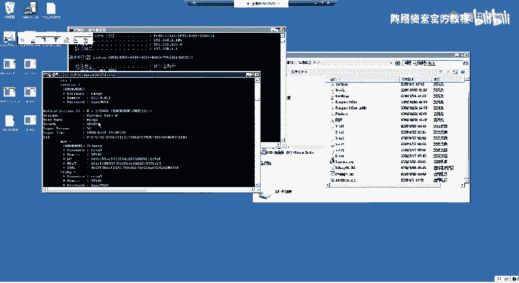

哎呦。嗯。这环境有点卡呀。这么卡呢？

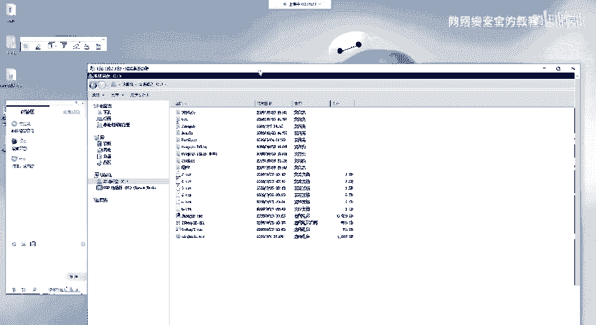

有点卡啊。然后这边的话我们获取到了我这边add面这一个用户，他的一个哈希值，对吧？那么我们得到这个哈希值的话，我们可以尝试去对他做一个解密。

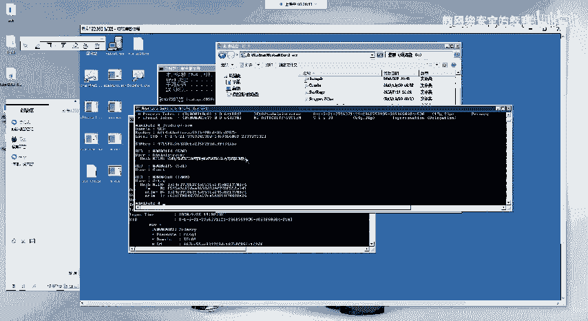

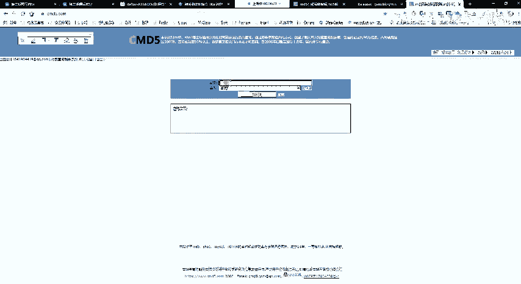

小林你粘贴过嚟嘛。哦。哎，这环境有点问题啊，疯了。呃。演示的话就这样就这样，好吧，大家应该能能理解，就我这边得到了它的一个哈希值的话，就其实就跟我们前面一样，对吧？我得到了那个面用户的一个哈希值。

那么我可以尝试去进行一个解密，就是用这种在线的一个解密网站去进行一个解密。当然话这种解密的话，你不一定能够去解出来的。就是说呃如果说呃这这边的话就是后话啊就是说这些哈希值，虽然我获取到了。

但说这个哈希值的话，我去进行一个解密的话，解密不出来，对吧？就是说它的一个密码的话，它是很复杂的，他得到这一个哈希值的话解密不出来。那么解不出来的话。

我们后续有相应的一个方法能够去用利用这一个哈希值来去进行一个横向的一个移动，横向的一个渗透。

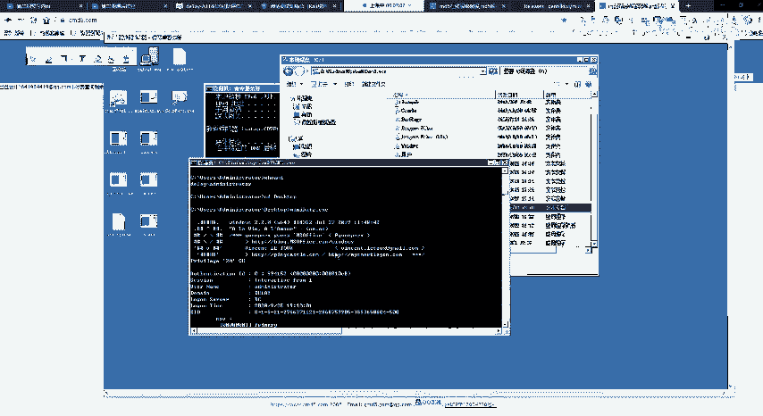

这边的话我给大家提一下。后面的话会具体的去介绍。然后呃这是一个，然后还有下面的这个的话也是同理啊。下面这个的话就是呃我们可能够去尝试获取到它的一个铭文的一个密码。

就用这一个呃loggan pass password。能够去得到他一个名文密码。其实在这边的话。

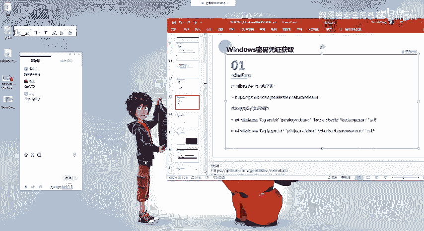

这两。

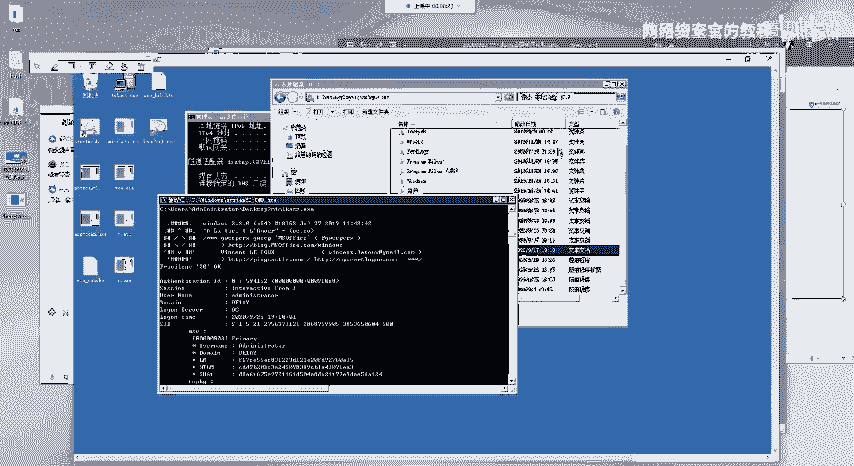

就在这里的话，我这边执行了这样子的一个minicast。这个minicast的话，它是啊就是呃你直接执行的话，它就会去获取我们的这样子一个名文运用。它其实实际的一个操作步骤也是使用的这样子的一个方法。

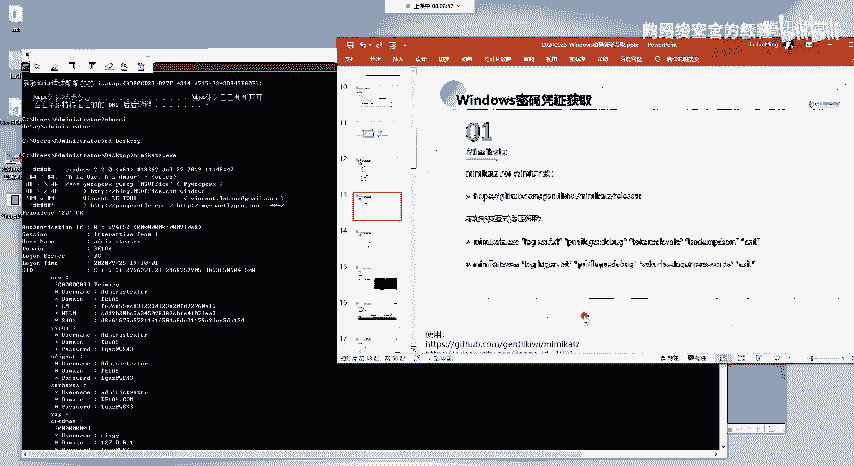

然后在这边的话，我们可以看一下它的一个效果。就在这里我执行之后的话，他也同样的会去进行一个提权，对吧？然后的话获取我们当前系统上面的。所有的这样子的一些用户，他的一些铭文的一个密码。以及它的一个哈希值。

然后在这边的话，我们可以看看到，就是首先这边user name这个admin这个用户。好等会。然后的话，他是所在的一个域的话，是这一个这一个域。嗯。然后呃在下面这边的话。

他就列出来了相应的这样子的一些呃账号，它的一个哈希子以及它的一个铭文密码。然后在这边其实我们可以看到呃这一个admin的一个用户，他是这一个呃这一个d delaylay这一个域的，它的一个铭文密码。

是这一个对吧？我们可以直接获取到。Yeah。以及呃还有这里这这边的话就是这个cres，这里的话就是。呃，看。就其实我们上一节课有。有给大家。我有给大家演示啊，就是存储在本地的这样子的一个。

存储在本地的这样子的一个凭据。就说这里的一个凭据，我们可以看到，就目标的话，它是这1个127。0，对吧？然后他的一个密码的话是这一个。是这样子这样子的一个呃凭据。然后还有下面的话。

还有其他的像这样子的一个M。MScycl口的这样子一个用户，他的一个呃哈希，对吧？以及他的一个铭文的一个密码等等这一些呃底下这些的话都是类似的，他会列举出当前系统下面这些用户。

能够去枚举出来的这样子的一个哈希子以及它的一个密码。可以看到在这边的话，他都已经获取下来了。

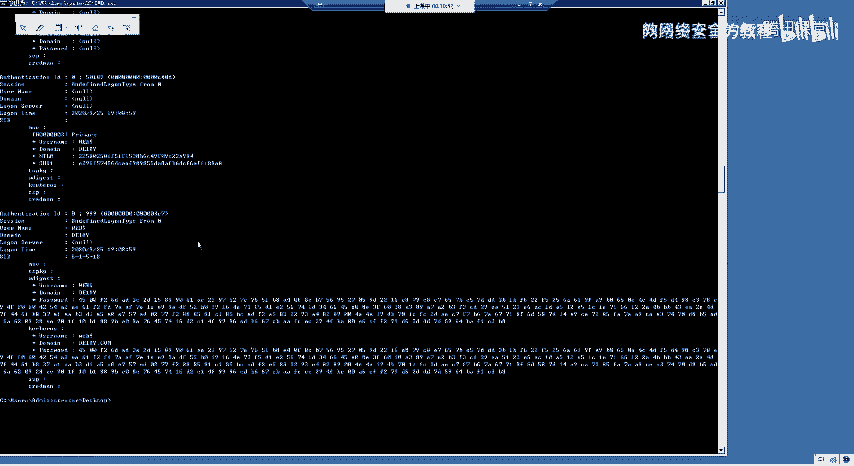

这样的话就是mini cards它的一个使用。

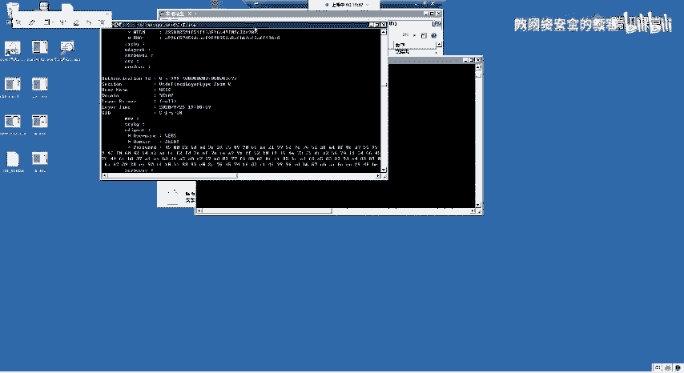

那么我们在这边我们得到它一个铭为密码，那么我们就可以去登录到这样子的一个系统。然后的话得到这一个系统呃，对应的这个用户的一个权限，对吧？这个。

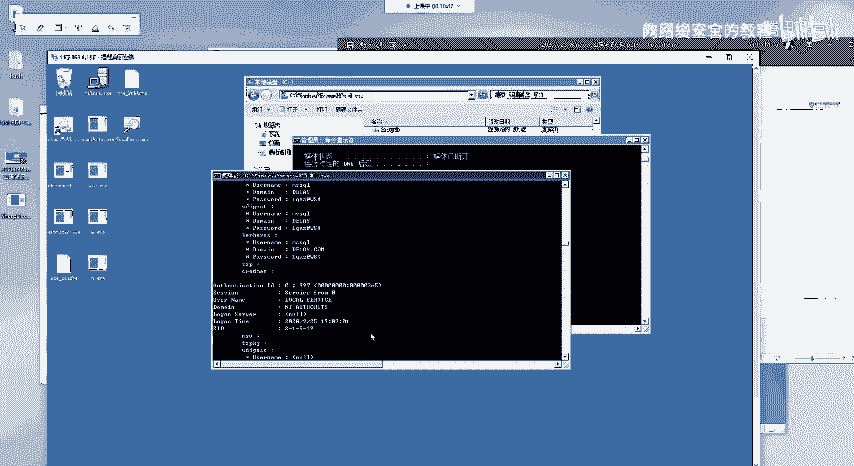

应该能理解。啊，呃，下面的话就是呃这边的话其实就是给大家提一下，就是我们现在的话一般的话都是用的新版本的，就是呃2。02点多的一个版本。就老版本的话，我们以前的话是用的这1个一点多的一个版本。

就是它的一个命令的话，它是跟现在是不一样的。前面这里的话就是提升权限是一样的。然后在后面这边的话，我们就说它是有这样子的1个DL文件。我们需要去把这样子的一个D文件注入到这一个进程当中。

我们才能够去获取到这个进程当中所存储的一个密码。嗯。然后2点多的话就是啊按我刚刚的一个介绍来去进行一个操作。这边的话其实就是让大家就是啊就是告诉大家，就是如果你比如说你看别人文章，对吧？

你看到他使用的一个命令跟我现在用的一个命令不一样。那么你这个时候你不要奇怪，对吧？那么他可能是用的一点多的一个版本，就是比较老的一个。比较老的一些文章了对吧？

然呃第二个的话就是power share脚本来去进行一个加载。就是说mini card的话，它有一个power share的一个呃power share脚本的一个就。呃。

就是有一个用po希尔的这样子一个脚本的一个呃写的一个mini class的一个。呃，脚本啊就它的一个脚本功能的话，就是实现实现这样子的一个minicast的一个功能，就是来去获取系统当中的一个铭文密码。

好，我在这边的话。呃，大家对。抛 share。有了解吗？呃，上节课的话其实也有提到这样子的一个抛现啊。大家呃了解抛絮吗？就是呃知道知道他的一个基本的一个使用没有。Okay。我没有什么意思？

就知道抛希尔如何去进行一个基本的一个使用，来去进行这样子的。像比如说去加载这样的一个脚本执行，对吧？本地的去加载以及远程的一个加载。不了解。呃，不了解的话，我这边大概的说一下，然后呃。

不过呃就是其实后面的话也会涉及到这一个。涉及到这涉及到这样子的一些内容。啊，我看。一点点。呃，po share尔的话比CMD比CMD要强大。但是呃抛 share它是windows下面的一个自带的一个呃。

应该说是。一个。工具。一个模块的一个一个工具模块嗯。你百度一下吧。可能我这样子描述不是很准确，就它是呃个命令行的一个外壳程序脚本环境。就呃。抛下面的话，它有自带的很多的这样子的一些功能以及脚本。

我们可以直接去进行一个使用来去啊操作我们的一个系统，去获取相应的一个信息，以及能够去执行相应的一个命令。嗯。啊诶。如果大家对抛 share不是很了解的话，我后面的话看抽一个时间。

像比如说周末什么时间给大家介绍一下抛 share的一个使用吧。然后后面后面的话，因为也会经常去使用到。好吧。如果当的话，你可以自己去你可以自己去。了解一下，就自自己去百度相应的一个资料。

去了解它一个使用，好吧。然后这边的话大概的介绍一下。呃，我这边的一个语句，它的一个作它的一个作用。就是。嗯，可能我现在讲的话，大家不是很理解，但是没关系啊，你先有一个大概的一个印象。

然后的话你后面你自己去，或者说我后面讲的话再去细讲，好吧。然后这边抛IEXIEX这一个的话就是一个嗯。

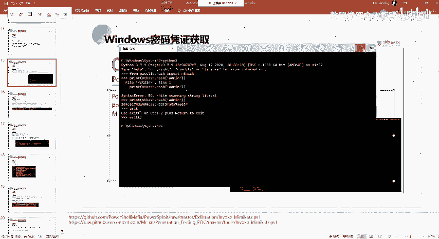

呃，我先进抛，然后你输入一个help的话，能够去查看到。查看到。相关的相关的一些命令以及一些参数，对吧？然后在这边的话，我们可以通过这个get help来去获取到相应的这样子的一个命令。他的一个。

详细的一个信息，就包括名称以及它的一个语法，还有别名，以及它这一个呃它的一个具体的一个使用。具体的一个使用。然后在这边的话，这一个IEX的话。

它其实这一个inwork expression的它的一个别名。这里它的一个意思的话，它是我们可以去执行相应的一个命令，就是说把我们的在这边。

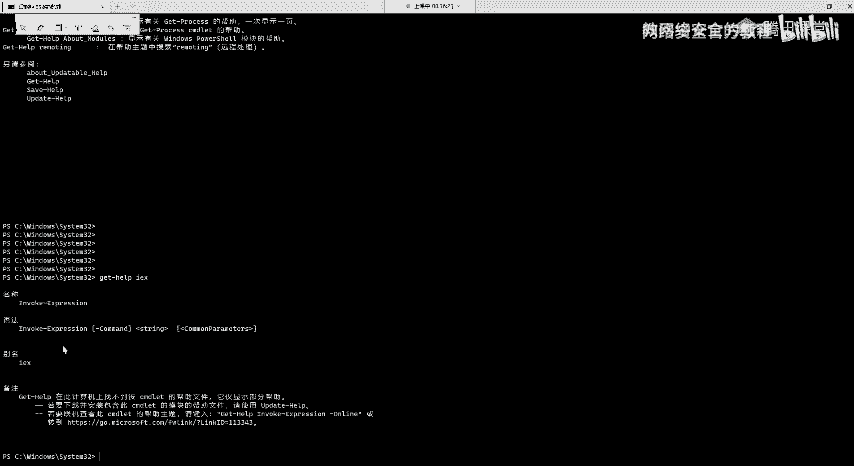

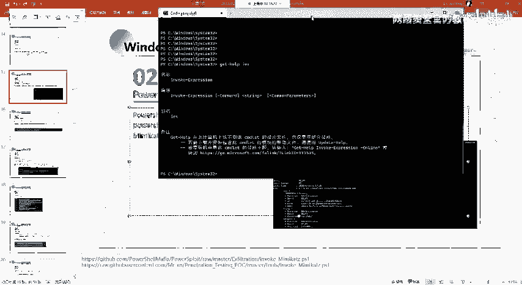

把我们这边用donor drive去下载的这样子的一个po的一个脚本，把它加载到内存当中去进行一个执行。这个的话就是这个IEX的一个作用。好这个IEX要注意的话，它是这一个。

invo exposureion它的一个别名，就我们可以通过这样子的一个简写的一个方式。然后下面这边的话new objectject net web client这里的话就是这一个new objectject的话。

就是创建这样子的一个对象。这个对象的话就是这个net web client，这个是呃啊就是donnet。因为我们的一个 share的话，它其实是一个。呃。

利用的是这个donnet framework这个框架的一个强大功能。嗯，就呃在这边的话，我们创建了这样子的一个web client，也就是呃web的一个客户端的这样子的一个呃对象。这个对象的话。

他有这样子的一个方法。就这个donload drive的这个方法，这个方法的一个作用的话就是去下载我们这边给定的这一个链接的一个内容。然后这边的一个内容的话就是我们的一个远程的一个脚本。

我这边脚本的话是放在我的这个VPS服务器上面的。然后的话当然的话你也可以就是说呃，就我这边的话有给这样子一个脚本。就是说比如说这一个脚本。这个脚本的话，你可以。做饭啦。Okay。嗯。嗯。有。我去。

Okay。不是。呃，就是这一个脚本。哎，怎么还不到呢？Okay。呃，要翻墙啊呃，要要要翻墙才能够访问到。Okay。然后这边的话就是它的一个脚本的一个内容啊。当然的话你你可以直接就是说用这样子的一个链接。

对吧？这一个链接的话就是你可以直接把它框ll到这边来。来去进行一个直接下载这一个链接。但是的话这一个啊一般的话就不不推荐大家去用这样子一个方法。因为。

我们从这边的话也能看到它是挂它是放在我们的一个github上面。那，github的话，你去直接去访问的话，你是需要去翻墙的。比如说你在国内的话，用这样子一个方法的话。

你去进行一个远程的去加载这样子一个脚本的话，它会有报错。就是你连接不上这样子的一个github它的一个域名，对吧？你访问不到它。而他一般的我们的一个呃操作，他就是把这个脚本把它给就是下载下来。

下载到放到我们自己的这样子的一个呃服务器上面。

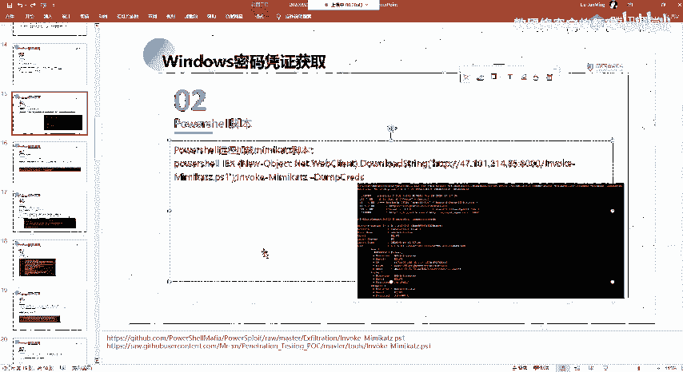

我这话呃放在了这边，就是已经就放了几个脚本。这边的话有这个e cards这个脚本。然后呃我通过就是pathon。还提个简单的1个HP的一个服务。然后呃默认的话，那是开放在80087的一个端口。

你也可以去指定其他的一个端口也是可以的。

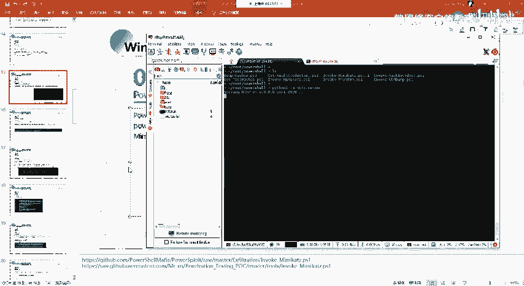

然，在这边的话呃，在这边的话。前面这边的话就是去利用这个IEX，把我们这边下载一个脚本加载到内存当中，然后去执行。而且这边的话是一个远程的一个呃远程的一个加载。然后用分号去进行一个分隔。

就分隔前面的一个命令，就后面的一个命令。在在这边的话就是说我们前面已经加载了这个脚本之后，我们可以用这样子的一个呃，用调用它的这样子的一个呃命令来去执行。然后这边执行了一个呃执行了一个。

达到一个效果的话，就是像这边我这边的一个截图啊截图所示。就是说其实跟我们前面呃直接用min cards来去获取它的一个铭文密码，它其实是类似的。我们可以看到在这边。然后呃看一下实际的一个效果吧。

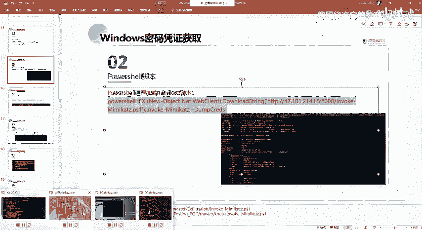

对。然呃在这边的话，我们其实可以看到。

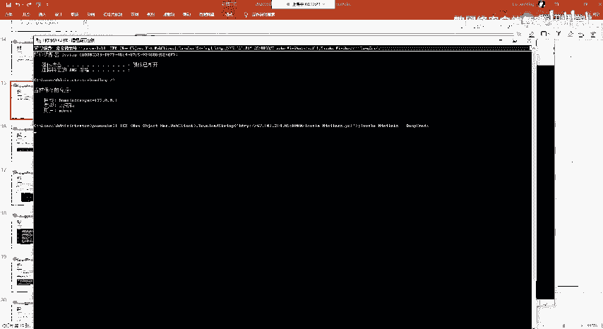

他会来这边去加载。

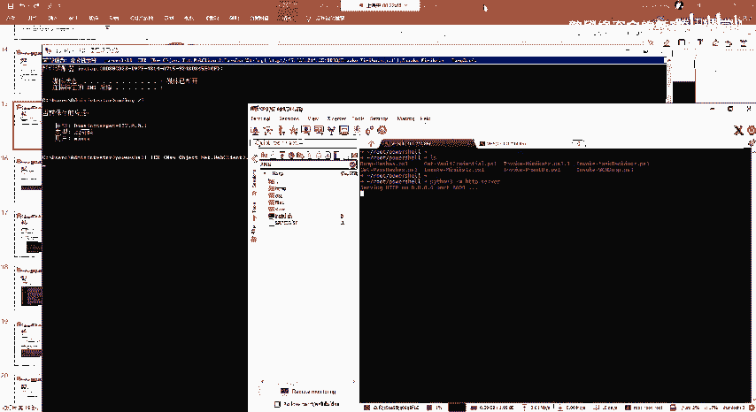

呢做咩反应？

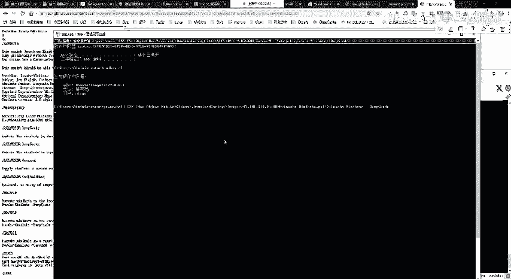

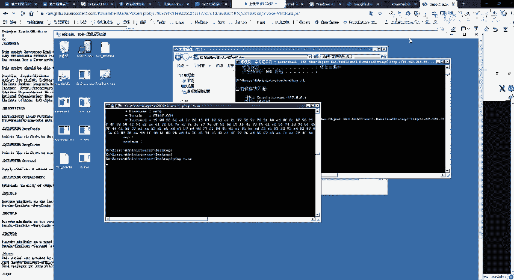

呃，这边的话应该是。网，络的一个问题啊，下得有点慢。你看到在这边的话，他已经呃发起了这样的一个请求，就是来请求了我这边的这个脚本，对吧？然后他这在这边的话，他加载到内存当中。加载加载之后的话。

他会去执行执行我这边的一个invo mini卡的一个命令。这边的话需要等待一下。还需要一点时间。我们。呃，我先让他跑在我们继续后面的一个内容。

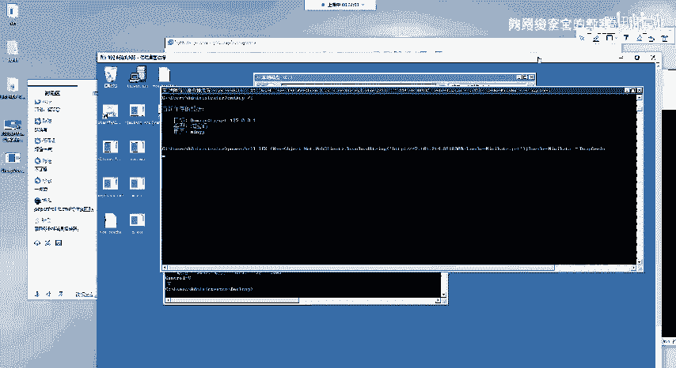

必须。搜索猜。搜索是插件，就是这个youtu吗，你可以。你可以你去下载一下玩一下嘛，它里面有比较多的一些插件。呃，我是习惯用这个，就是里面它的一个功能的话还是挺多的。

开启过1个HTP服务就能用这个命令吗。呃。怎么说呢？你你没你没你可能没明白我这里的一个意思啊。就说我这边的话，我是下载好了这样子的一个脚本。这个脚本的话。

它的一个功能的话就是实现的minicast的一个功能。然后的话我把它放到了我这边的一个呃。

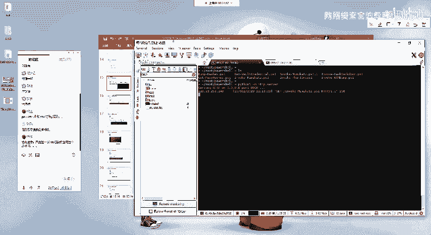

你平时那个服务器上面。啊，因为在这边的话，我是通过就是说通过这样子的一个呃，其实你这边的一个对象的话，其实你就可以把它理解成就是一个呃下载。就说下跟我们在浏览器上面去下载，其实是同理的。

然后他他会去下载我们这边的这样子一个脚本。然后这边的一个脚本就。你对HDP的一个请求应该能理解吧，是吧，这个的话就是一个一个链接嘛。然后的话他通过发起1个HDP的一个请求，请求我这边的一个。啊。

请求我这边的一个链接嘛，请求我这边这个链接的一个内容嘛，也就是我这边的一个脚本内容嘛。然后的话通过这个IEX把它加载到内存当中去执行。然后在后面这边的话是接我们具体的一个命令。

然后这边的一个具体的一个命令的话，就是说呃基本的这种的一个脚本大家还是要能会看哦。就是其实在这边的话，它有这样子的一个方可选的一个声明，就是它是声明了这样子的一个invo。

就其实我们这边执行的一个就是调用的这样子一个命令的话，就是这个invo。然后在这边的话有相应的一些注释。就使用的话就这一个这一个命令其实是。对，是你。

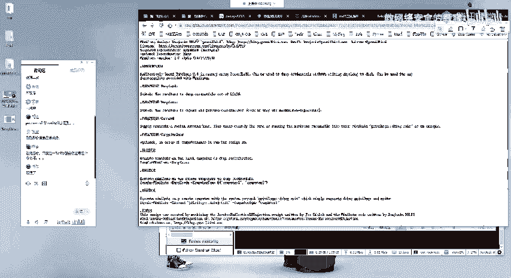

Okay。看下应该可以了。

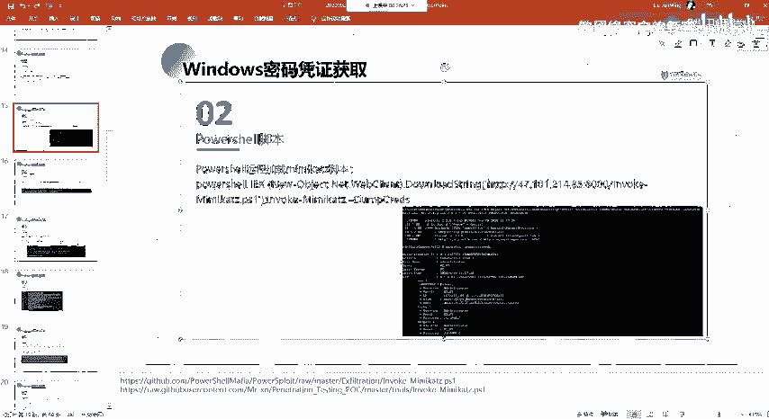

呃，可以看到在这边的话已经。好出来了呀。就是呃因为在这边的话，他有这样子的一个过程啊，这过这一个过程的话就是去下载这样子的一个脚本。下载脚本的话，他会要加载到内存当中去执行它。

不然的话呃你可能网络啊什么的呃，机器什么的，这样子的一些导致他的这边执行的一个命令的话，可能会就是。返回的一个结果会比较慢。然后其实在这边他可以看到在这边执行的一个呃结果的执行的一个命令的话。

其实就是这一个seec log and password。就我们刚刚讲的这一个。通过这一个呃命令来去得到他的一个名文的一个密码。

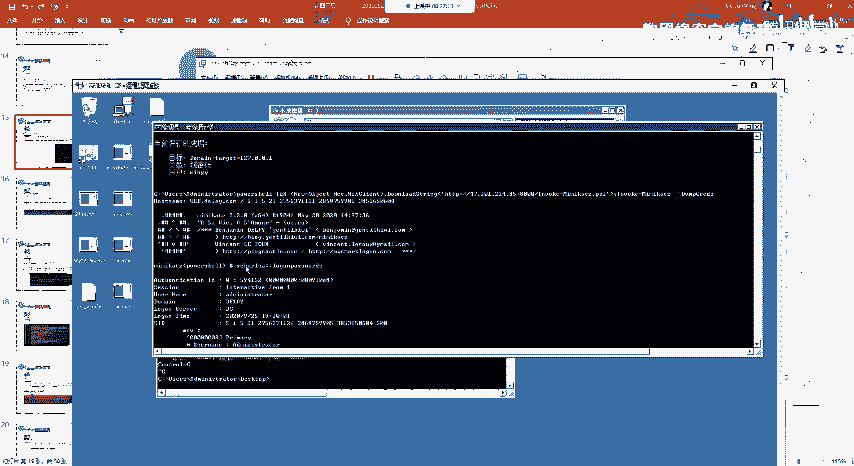

Okay。呃，这边的话是通过p share脚本来去加载这样的一个命令cast的一个脚本。然后第二还有的话就是通过p share加载这样子的一个pa哈这样子的一个脚本。这个脚本的话就呃简单直接了很多。

就是说呃我们可以看一下这边我这边执行的一个结果，这边执行之后的话，可以看到他没有多余的一些内容，他直接就把他的一个就是呃哈希就NTM哈希的一个格式，对吧？他按照NTM哈希的一个格式。

把他把当前这一个系统下面的用户，他的1个LM哈希，还有NTM哈希的一个值都给列出来了。

Yeah。

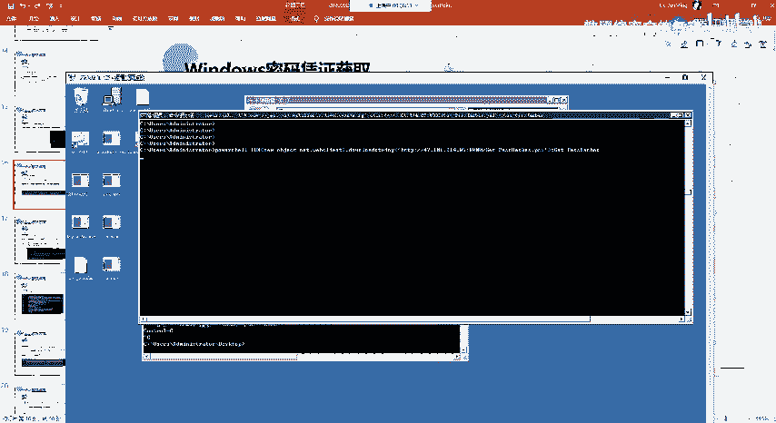

这边同样先让他跑的吧。好，我们看下面啊，第三个他就是WCE。WC的话，它是跟前面面利卡子齐名的一款哈西管理工具。这个工具的话，它的一个功能也是比较多的。然呃它的一个作用的话。

同样就是呃它是这样子1个EXE的一个程序。我们执行之后的话，他就能够直接返回呃，返回用户的一个哈希值。这边的话我就不演示了，就看截图好吧。然后呃这边有给了，就是这一个工具。

它的一个详细的一个使用也不多说了，大家可以自己去呃。关于这些工具命令的话，大家自己去研究一下，自己自己去自己去呃执行一下就你就能够知道了。

然后第四个话就是这个PW的Dd7这个工具的话同样的呃可以读取当前系统的各个用户的一个密码哈希尔。然后这边呃它是这样子一个EX的一个程序，我们直接执行之后的话，执行之后的话它会自动的去关闭啊。

就是它会你执行之后的话，它会。呃，直接会关闭，也就是它不会引留一个窗口这样子的一个东西。所以的话你需要把它执行之后的一个结果，把它给输出到一个文件当中来去进行一个查看。

得到的一个结果就是像这样子的一个呃哈希的一个格式。嗯。以及第五个的话就是这个OPHcrack。这个的话就是呃。如果我们用网站无法去破解这样子的一个哈希值的话。

我们可以用这样子的一个工具来去进行配合彩虹表来去进来去进行一个破解。关于这个彩虹表，这个的话，大家看那个预习资料吧。呃，都是。就是理解他是一个什么东西就可以了。而其实际的话，实际的话。

你实际碰到这样子的哈西的话，你可能你不会说去呃跑这样子的一个，反正我是会觉得很麻烦。就是因为你跑这个东西的话，你的一个时间成本的话是比较高的，而且不一定能够跑出来。嗯。呃。没有。就是。咦。😊，啊。

我这边。呃，大家去看看一下第一期的那个预行量容吧，我这边应该是忘记贴上来了。就个。就是呃彩虹表的话，它是就是根据我们这边呃根据一些给电的这样子的一个哈希。

它是有这样子的一个就是有一个比较复杂的这种这样子的一个算法，能够去呃根据给定的这样子的一个哈希来去呃得到它的一个铭文啊。就这个东西的话比较比较复杂，你就大概知道有这一个东西就OK了。好吧。

然后呃第六个的话就是用这个pro dump加min cards。啊，这里的一个pro。好，这种范围的话是我们。呃，比较常用的就是这个pro dump这个工具的话，它是微软，它的这样子的一个工具箱里面。

它自带的就这个SYSinnet这一个工具箱这个工具的话，它是呃。在这一个工具箱里面的话，它的这一些工具，它是有微软的一个清名认证的，也就是它是微软出品的这样子一些工具。

这工具的话就是说能够比较好的去进行。就是说杀网的话，对这一些工具的话。啊。就是能够去绕过沙轮吗？他不会去查杀他。然的话我们可以用这样子的一个工具去把我们的一个呃。去。

从我们的这样子1个LSIS这个进程当中去导出我们想要的这样子的一个呃。一个哈希子以及铭文的一个密码。然后的话我们导出来之后的话，就是从这个进程当中导出这样子的呃，它的一个内容，它保存的一个内容。

然后的话我们使用minD卡来去进一个还原即可。这边话是他的一个使用的一个方法。呃，就是说我们的。这样子的一个mini这种方法的话是比较常用的。

就我们的mini cards杀软对mini cards这个工具的一个查杀的话是呃就是已经比很严格了呀。就是说mini cards的话，你想要直接去进行一个执行的话，你需要去做一个秒杀。

就是对它进行一个秒杀。你要对它秒杀的话，你就需要去研究，呃，去你要去知道它的一个代码是它是怎么去写的。然后的话去你要去研究呃，它的一个秒杀的一个方法。那怎么乱吧？怎么回事啊？我操。呃。

这边的话有这样子的一篇文章，这里的话就是呃他总结了min cards的一个秒杀的一个方法。大家对这个感兴趣的话，你可以去研究一下它里面有很多的这样子的一个min cards的一个秒杀的一个方法。

它都总结出来了。好。呃呃，第七个的话就是注册表导出哈希，就是说从注册表当中去导出我们那个哈希纸。就是在windows系统上面的话，呃，我们的一个密码嗯。我们与密码相关的这样子的一些东西的话，呃。

大多呃以及这些工具啊，就有一些工具。他去获取这样子的一些windows系统啊，包括软件以及这样子的一个哈这样子的一些哈希值的时候。大多是从呃就说注册表当中以及他的一个。还有什么？我。呃。

我去突然突然忘了要说什么了。就是从注册表当中，还有就是呃。一些就是软件的，它的一些特定的，像保存这种密码文件的这一些路径当中去获取到它的一个密码信息。所以的话在这边的话，其实我们呃在注册表当中的话。

它同样的。有存放这样子的一个呃系系统用户系统当中用户的这样子一个密码的一个哈希。然后的话我们只需要去用这样子1个IEGC这样子一个命令，就是说从这样子一个注册表象当中去导出它的一个内容。导出内容的话。

保存成这样子的一个文件。然后的话我们就可以用min令卡来去呃获取这文件当中它的一个密码的一个哈希。以及还有通过这样子的一个secrets这样子的一个工具，也能够去获取到。嗯。

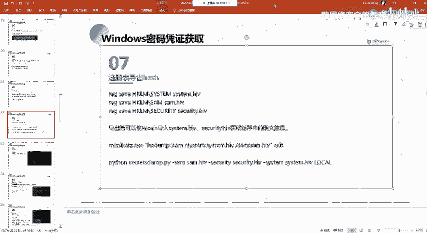

呃，这边。呃，这前面的这些啊，我先讲完吧，先讲完。

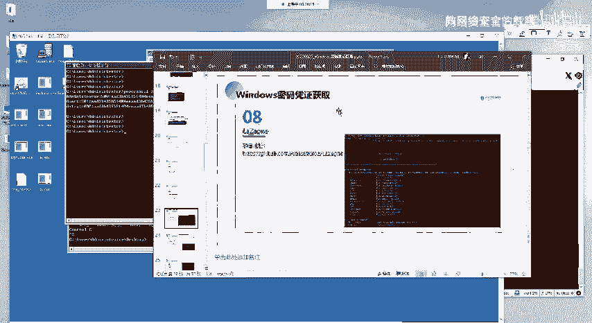

然后第八个的话就是这个拉。呃，LAGAGNE的这样子一个工具。这个工具的话，它是一个呃也是。经常使用到的这样的一个工具啊，这个工具的话，它功能的话很强大，就是它这一个工具它里面已经写好了。

就是说呃我们可以用这个工具来去获取相应的一个密码。然后在这边我们可以看到。在这边他有这样子的一些选项，他能够去获取到相应的这样子的一些呃密码。像比如比如说bs。就是浏览浏览器。

还有呃dabbase就是数据库啊，还有一些游戏啊，地址，还有mail。邮箱对吧，还有。一些SVN啊等等这一些呃项目，还有wifi，还有windows系统的这样子的一些呃。

密码就说我们可以指定相应的这样子的一些模块来去获取到相应的一个密码的一个信息。嗯。

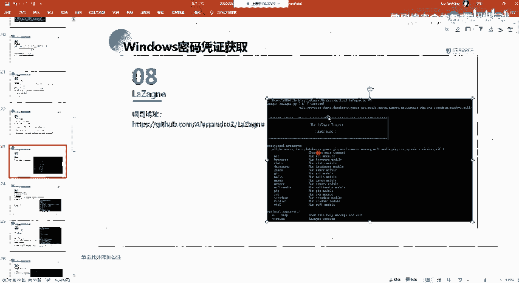

然后这个工具的话也是比较有名的，就是一些APT的一个组织，也也也有去使用这样子一个工具啊。

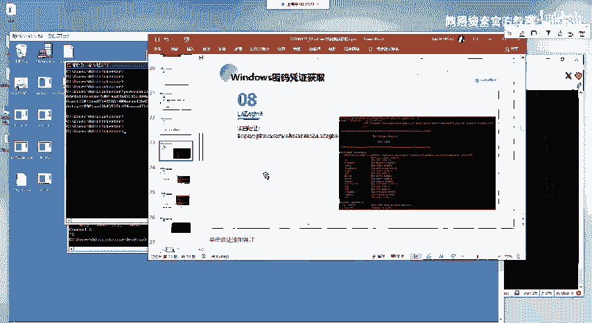

呃。

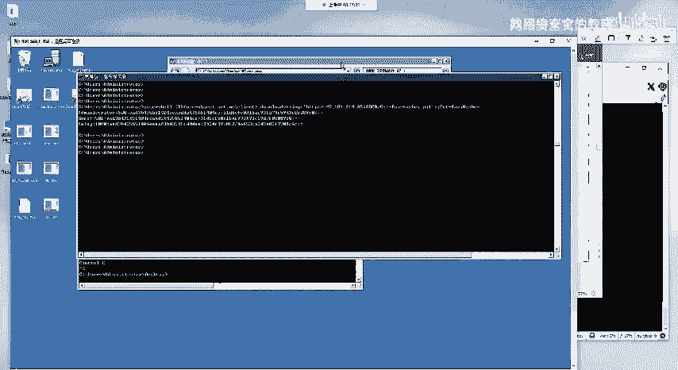

这边的话我们来看一下呃，这边的话有这样子的一个E一个程序。对。我们可以来执行一下。我这边的话直接哦就是呃获取他所有的就是调用他所有这边提供的一个模块来去获取当前系统下面所有的。

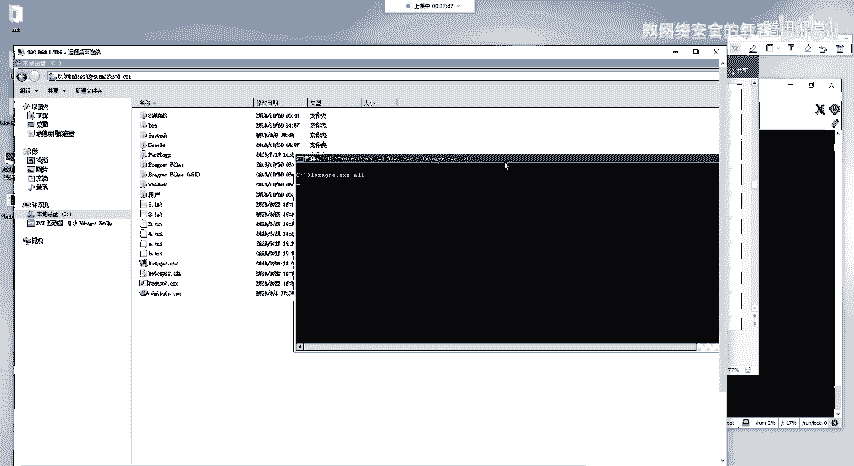

他这边能获取到的这样子的一些密码的一个信息啊。

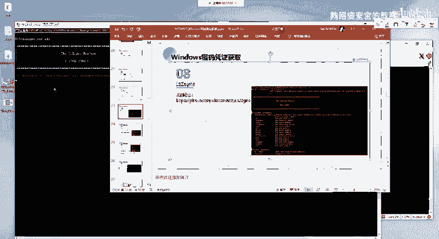

呃，这边的话先让他跑着吧。

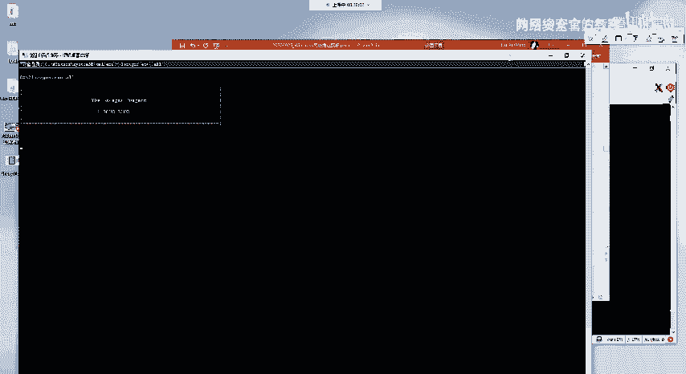

因为他需要一定的一个时间。然呃第九个的话就是呃前面讲到的，前面应该也有讲，对吧？就讲MSF的时候有给大家介绍，就是说我们得到一个mat的一个筛选之后的话，我们可以用mat里面的这样子的一个一些模块。

来去进行一个密码哈锡的一个获取，就韩熙dump。然后呃在MSF里面的话，有这样子的两个模块就是。啊，这一个。这一个hh dump以及这一个small h dump。

这两个模块然后我们只只需要执行这两个模块的话，就能够去进行一个密码的一个哈希的哈希值的一个获取。嗯。然呃。具体的一个效果的话，我们看我看一下，看一下我这边的一个截图啊。

就我们得到一个m的一个需要之后的话，然后也要注意的话，就是说你这边要去进一个哈西的个获取的话，你需要有一个管理管理员的一个权限，对吧？然后有管理员的权限的话，我们就可以把它提全到我们的一个stem。

用呃get system的一个命令去进行一个提全。对吧？然后的话我们在这边的话，我们可以直接执行这个哈希d来去获取当前系统下面所有的一个哈希值。以及我们呃MSF里面的话，就是mat这一个呃组件的话。

它里面有。集成了这样子一个min令 class的一个呃。这样子的一个模块啊。就说我们可以通过load mini cards来去加载这样子一个min cards的一个模块来去使用它的一个功能。

我们知道命令卡的话，它能够去获取到它系统的一个铭文的一个密码，对吧？然后的话在这边我们可以通过MSVI还有等等的这样子一些命令来去获取到系统当中它所存放的这样子一些铭文密码。在这边的话可以看到呃。

这边直接获取到了它的一个铭文啊。addminist还有优质2的这样一个用户。嗯。以及还有其他的呃，以及我们可以用mini cards。command去执行指定的一个命令。比如说这个s seven。

5就是获取我们那一个哈西。以及我们这边的一个呃。s pass word这边他同样的能够去获取到它的一个名为密码。然后关于这个命令 card的一个使用的话，我这边呃就不做过多的一个介绍，前面应该也有讲了。

然后主要的话就是在你的他的一些命令。我这边的话呃也有相应的一个注释解释。

啊，第10个话就是construct获取哈西。呃，这边的话就是。CS获选哈息的话，比MSF的话呃。简单直接一点，就呃我们得到了这样子的一个需要绘画之后的话。因为我这边的话。正好有一个。

就这边前面的话已经。对吧首先呃用sleep来去调整一下他的一个就是睡休眠的一个时间。呃，因为我这边我只是本地演示的话，我一般的话就直接把它给调为零啊。就是你直就是你直接执行执行命令之后的话。

他就会去立马的把这一个请求发送到我们的这样子这个back。然后的话执行之后的话返回结果给我们就是比较快嘛。然后实际的话可能就是呃不建议大家调为零，就调为零的话，就你的这样子的一些请求的话，比较频繁的话。

很容易被发现。然后的话呃我们想要去获取他那个哈希值值的话，我们只需要就是。


执行执行我们的一个哈希。就直接在beck这边执行哈希电用款的话，就能够去直接获取到他那个哈希，就这里。然后这一串。


阿西的话应该可以解密啊。这边设的比较简单的。恐龙。


空裕文。

Yeah。


是吧。


哦，这边的话解出来了呀，可看到。


就这种比较简单的话，直接用这种在线网站去进一个简密即可。有。哦哦还有的话就是在。CS当中的话，它同样都可以去使用mini cards的一些功能啊，就是它里面也有集成了mini cards的一个模块功能。

然后我们可以直接执行这个loggan password来去获取到。因为在这边的话只是获取到了它的一个哈希值，对吧？


然后我们在这边的话，我们可以通过login passwordword直接执行它。来获取到当前系统下面的就是说能够获取到的一个铭文的一个密码。你看到在这边的话已经返回了一个结果，就这边执行的一个结果的话。

跟我们前面用mini cards得到的一个结果的话，是类似是一样的。一样的。好，这边的话我就。


不一一介绍。然后的话我们可以用mini cards里面的一个，就是它模块啊。就是用min令cast的一个命令。因为我们。呃。

mini card的话不仅仅是只有这样子的一个loggan password获取它一个名为密码的一个功能，对吧？它还有其他的一些功能。然后的话我们想要去执行，想要去使用其他的一些功能的话。

那么我们可以使用这边使用它这边。嗯嗯。


起错了。啊，没有没有参数啊。好。这边他是呃没有加参数。呃呃，在这边的话我们可以看到呃加个问号的话就是输出它一个帮助信息嘛。然后其实就跟我们前面去进行一个呃用mini cards是一样的呀。


然后这边的话我们可以直接mini cards接我们这边的一个就是用这个secak。


log password其实这边的一个logan password，就我前面执行的这一个logan password，它的个功能跟这边的话它是一样的。只是的话我们在这边min看啊，不这这边CS里面的话。

它已经有它已经就是写好了这样子的一个功能，就我直接执行log and password的话就能够获取。就能够去呃，相当于在这边执行这一串命令的一个功能。


可以看到呃，跟上面的一个结果的话是一样的。嗯。呃，然后的话呃前面的这几个工具需要给大家演示一下吗？就是说怎么去进行一个使用。再把机上访问自己的服务器的脚本并执行。对。就说呃因为我们自己的一个机器的话。

你去访问的话，你去访问的话是没有说不像在getha上面那样呃，有这种。呃。就是不能访问的一个情况嘛。只要你在你自己的机上面开一个wordb服务，开一个简单的wordb服务。

然后的话通过web的一个方式去访问。嗯。呃，前面的这样子的一些工具需要我去做一个演示吗？应该不用吧，就是呃到时候把PPT发给大家，然后大家自己在法机上面去操作吧。呃，这些工具的话，我这边也有给链接。

对吧？就是怎么去下载，在当里下载。然后如果不知道的话，如果找不到的话。呃，找不到的话，你再找我吧。哦哦，工具库里面应该其实有的呃，那就是如果工具库里面没有的话，是呃因为那个工具库的话。

是我这边就是整个利益吧，就是比较就。内容的话不是很全，就只有一小部分，但是就是发就是明就是直接发出去的嘛，就是呃所有人。就是来去了解这样子的一些东西的话，都发给他了。所以的话不是很详细啊。

就是有很多的一些东西都没有加进去。然后后面的话如果大家有需要的话，我这边可以去整一个就是啊我们包括我们生透测试相关内容里面所使用到的一些脚本啊，工具什么的，我都可以把它整成一个工具库。

到时呃可以发给大家，就不需要去不需要去自己去giHub上面去找，是吧？哎呃如果大家没有不能发墙的话，你去geHub上面去下这些东西的话，可能会比较痛苦。嗯。然呃，在这边的话。这边的话应该没什么问题啊。

呃，在这边的话就是呃提一下。


就大概的提一下，就可能大家呃使用这样子的1个CS，就我呃我是习惯的去使用这1个CS就MSMSF5的话呃，MSF的话就相比CS的话可能。呃，它的功能的话其实要多要多很多。但是使用起来的话。

CS的话要稍微方便一点，就确实要方便一些。对。然后MSF伏的话就是呃。操作的话就是比如说你突然网断了，对吧？你网断了的话，你前面的那些东西全断了就。挺挺那个的。

然后呃在这边的话就是说我这边是以以这1个CS为量，就是在MF的话，其实也是同理啊。就你MSF的话，你直接得到了一个筛选的话，或者说你直接得到了一个需的话，对吧？

你可以直接比如说你里面你直接执行一个直接执行需要。


对吧你直接。直接直接下。你直接执行CL的话，就能够去得到1个CMD的一个命令函了，对吧？以及你在直接在。呃。你直接在。m correct下面。你直接在m下面也能够去执行相应的一个命令，是吧？

然后呃在这边的话就是说就是可能大家之前的话没有这样子的一个用这些工具来去执行命令的一个概念。


所以这边的话大概的介绍一下，就是说比如说我前面这边我有讲对吧？我有讲这样子的一些工具或许他些的一个工具，对吧？那么我这边我谈谈那个需要谈到CS或者MSF上面。那么我这些工具我要怎么去进行一个使用啊？


像比如说我这边1个WWCE这个工具，对吧？我这个是1个ES的可执行程序。那么我要执行的话，我需要上传到我的这样子的一个这一个靶机上面，对吧？我需要把它上传上去。


然后上传上去的话，在CS里面的话，我们可以通过upload这样子的一个命令。就通过upro。其实在MSF里面也是一样的对吧？通过upload这一个命令。

你就能够去上传去上去选择你要去上传的一个这一个程序，对吧？然后的话上传到这个目标机器上面。然哦这是一种。然后还有的话就是。这S里面的话，它有这样子这个文件管理器，对吧？


文件管理在这边的话，我们直接可以进行一个文件的一个操作，对吧？然后的话我就我就可以直接把我的这样子一个程序上传上去，对吧？通过upload上传上去，上传到指定的一个目录下面，然后的话。

然后的话你要去执行的话，像比如说呃在这边。我以这个PWDD7为例吧。对吧我这边前面呃在介绍这一个的时候，对吧？P他D7，我要去执行它。


然后的话得到他的一个哈息的一个结果。那么我在这边的话，其实就是通过这样子的一个方法嘛。我直接需要执行这这样子的一个程序。嗯。电话漆。


月1。


没写错。然后的话，我这边要去执行执行之后的话，我的一个结果需要导，需要就是输出到一个文件当中，我才能够去查看到对吧？比如说我输入到要点text。这样子的一个文件当中。然后的话，我这边执行。


。执行之后的话，他会在呃我们从把机上面这边来看的话来看吧，比较直观一点，对吧？


然后在这边的话，我们。看一下。嗯。有点卡。Okay。怎么回事？Yeah。


🤧嗯嗯。这边的话，你执行的话，你执行之后的话，他会有这样子的一个就是说呃需要去等待一些时间。因为你执行执行的话，它需要时间的，以及你在这边执行，你在CS上面，你执行。


就是说你这边输入命令之后的话，他会呃把我们这边要执行的一个命令的一个请求发送到我们呃这个把机上面的这个backken，对吧？然后的话在backken上面执行之后，它才会返回结果返回给我们。


然后在这边的话，其我们从这边的一个。呃，标识也能够知道，就是说他这边的话是呃发送了这样子的53字节的这样子的一个请求。就是说我们这边的一个命令，对吧？


你要过一会才有结果。


还，怎么。怎么突然这么卡呢？😔，Okay。哦。


我这边的话就是在输出这个t始的时候没有加。那个加C盘的一个路径，就是应该是在直接在当前的一个路径下面6点。Yeah。


应该是有的吧。呃，其实在这边的话已经有了这1个6点t的。对。


但是没有内容，那这边的话呃应该还在执行，可以看到呃在。嗯。


还没写进去吗？


Okay。


重新写一下。


嗯。

那怎么突然这么卡呢？😔，我收环。Okay。


。嗯。懂。呃，我们以这一个为例吧，就以这1个WCE为例吧。因为这边的话，WCE的话，你直接执行之后的话，它就可以去返回结果的。然后我这边的话执行的话就直接需要。

然后的话接我这边上传上上上传上去的一个这个程序的一个路径，对吧？然后的话他就会去执行。执行之后的话，在这边就能返回结果，就这样子的一个方式。然后上面这一个这一个的话呃，就说我们这我们直接执行之后的话。

他不会把结果直接返回给我们，对吧？那么我们可以通过就是说把我们执行之后的一个结果重联向到一个文件当中。然后的话通过type这一个命令来去进行一个查看。


这边不知道为什么没写进去。


卡了。Yeah。没需带。


好。


Okay。本来的话就是你这边执行之后的话，他会有这样子的一个回响，就是。


Yeah。还没写进去。


Okay。然后可以看到这边的话已经有了呀。


嗯说。这边在CS上面执行的话有点慢了呀。


就是呃正常的话是这边执行之后的话，它也会有这样子的一个回响。就是像在这边执行之后的话，有这样子的一个，然后的话它会有这样子的一个output。


就是在这边。


他会显示，然后你看到了这个话就说明我这边执行的话已经执行完成了，对吧？就像在这边有这样子的一个output。嗯。然后的话我们直接type这一个文件的话，就能够去查看到它的一个内容。这边的话就是呃。


介绍一下我们如何通过这样子的一些就是。在CS以加MS上面，如何去使用这样子的一些工具啊，就可能大家没有这方面的一个经验的话，就是你不知道这样子的一些思误啊。


以及同样的同理的这一些也是一样的嘛，对吧？你直接通过这样子的，就把这个程序上传上去，然后执行获取到他的这样子的一个文件。然后然后的话下载下来下载到本地。

然后我在本地再用mini cards来去进行一个解密。就能够去得到他的去还原他的一个密码。注册表同理啊，就我这边的话同样的可以去执行这样的一个命令，得到这样子的一个文件，对？嗯。啊呃。

关于这第二部分的一个系统密码的一个。


凭证获取的话，大家有没有什么疑问？就。有没有什么问题啊？应该都能理解吧。Okay。不对。Okay。呃。有。大家还在吗？是不是？都睡着了呀。还在听吗。呃，在听的话就呃。给我点反馈嘛，是吧。

就是你这不跟我交流的话，你这不跟我交流，我不知道就是大家有没有就是说。有没有什么问题，或者说能不能听懂，以及我这样子去给大家讲大家能不能去接受，对吧？在。听起来没问题，实践的话实践的话。

那么你肯定就是要你自己去多去操作了呀。就是多多自己动手去操作，然后碰到问题，碰到问题直接问。就其实就大家去学学这些东西的时候，学习的时候，其实你问的问题越多，你学的会越多。

当然的话当然呃就是在这边正好就说一点，就是你问你问我们问题可以，对我们知道的话，我们肯定会给你回答，就是肯定会回回应你。我，说了这个我。我突然想起来。昨天晚上有位同学问我问题，我今天忘记。

我我今天忘记看了呀。呃，这位同学啊。就这个人是你是吧？应该不是吧，明星尽兴。下下页。啊，行行吧，就是你问的话，你还是就是白天问嘛。就而且有时候的话，我虽然看到了，但是可能我自己这边有事的话就忘了。


然后大家就是尽量多提问嘛，对吧？因为呃其实你实际的话，这些东西你可能很多东西的话。你可能直接问别人的话，是比较好的一个选择。当然首先的话。

你首先你需要首先是要自己去进行一个找去尝试寻找这种解决问题的一个方法，对吧？然后的话你如果实在解决不了，你可以来问我们。如果我们知道的话，我们肯定会尽力的去回答你们嘛。对，就是这个的话就是。就是。

这样子的一个怎么说呢？就我们其实也是一个服务业，对吧？就是为你们服务的。嗯。然呃，其他的一个情况也不多说了呀。然后呃就是稍微给大家唠下嗑，然后我们继续我们后面的一个内容。后面的话还有一部分内容嗯。

也也就是第三部分的一个阿。


啊。