# 2024网络安全系统教程！清华大佬花159小时讲完的网络安全系统课！别再盲目自学了，学完即可就业！零基础入门网络安全！（渗透测试／漏洞挖掘／CTF／黑客技术） - P39：26.Powershell脚本获取RDP连接记录.mp4 - 教网络安全的红客 - BV1ft421A7Nj

呃，首先的话第一个就是power尔的一个脚本获选ITP的一个连接记录。就这里的话呃这里的一部分的话就是。好，给大家介绍一下，通过一些方法来去获取我们呃本地的这个IDP的一个连接它的一个密码。Okay。

首先第一个的话就是呃在这边的话，我们。首先介绍一下，就是这一个呃。脚本。这里的一个po的一个脚本，这个脚本的话，它是呃这一个上级stutudent，他写的一个脚本。

这个脚本就是来获取你windows系统下面的这样子的1个RDP的一个连接。就呃具体的话我们来看一下这一个图啊，就是在这边的话。我们可以看到在这边他列出来了。

就我当前的一个用户的话是1个MNGY的一个用户，对吧？然后在这边他列出来了，就是呃有这样子的一些连接。我们可以看到就是呃我有连接了这个，比如说172。26。2。35这样子的一个呃机器。这一个机器的话。

我使用的一个用户话是这样子的一个面的一个用户去进一个尝试连接的对吧？还有其他的这样子的一个机器，而在这边的话，他就列出来了，我RDP的一个连接记录。那么从这个RDP的一个连接记录，我们也能够去知道。

就其实呃上一节课就有讲对吧？就是说呃做这样子的一些信息收集。就是说在这边我通过它的1个IDP的一个连接，我能够去知道当前的这个机器，它能够去连接，也就是说它能够去访问到哪一些网段的这样子的1个IP对吧？

以及他呃能够以及他有去有去用IDP的一个方式去连接这样子的一个机器，对吧？那么我们知道了我们知道了它的这样子一个密码。那么我们就能够去进行一个呃连接这一个机器，也就是一个横向的一个渗透横向的一个移动。

对吧？

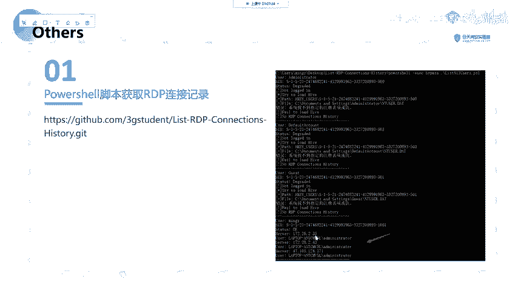

然后呃。

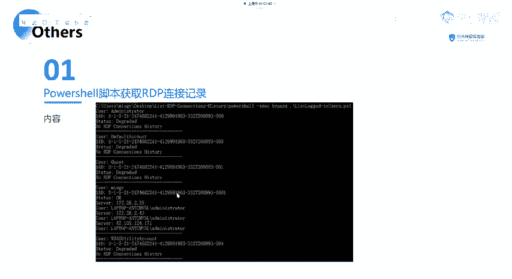

嗯。可楚。这里的话呃这两个图的话是一样的。哎，我这边。

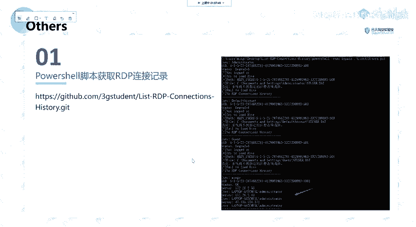

一。这这边的话这是一样的，就一样的一意思啊。然后在这边同样的就获取到了他的一个记录。呃，然后在这边可能大家对这一个会有疑问，就是在这边我是用的这样子一个方法，抛杠EXEC by pass。

然后的话还去加载执行的这样子的一个脚本。这里的一个方法的话就是说我们再去加载我们本地的这样子的一个抛 share的一个脚本。

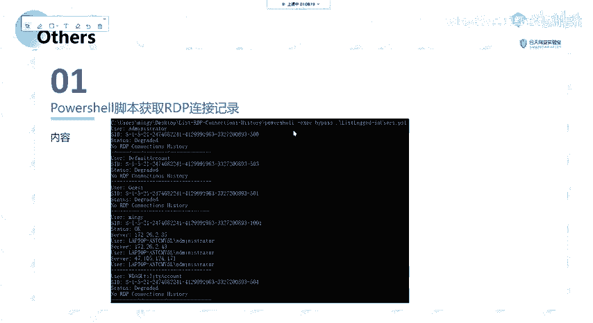

呃抛摄他。呃，就是。嗯。就是抛蟹。po share他有提供了这样子的一个就是怎么说呢？就是扩展或者说呃接口这样子的一个东西。对吧？

然后的话我们可以通过它的这样子的一个PS抛 share的这样子的一个呃语言。呃，怎么说呢？就是P。啊，PSPSE的认子这个脚本语脚本语言。就他有他自己的一个这样子的一个呃规则。

然后的话我们通过编写它的这样子一个脚本语言来去调用系windows系统上面的它所提供的这样子的一些呃接口啊，一些扩展啊，来去达到相应的一个目的。像比如说我去呃执行。比如说我去获取我系统的一个信息。

抛线里面的话，它有自带的这样子的一个脚本就是。呃，应该是什么？就比如说你要去执行一个system in这样子的一个获取到system in的一个信息。我们在抛项里面的话。

我们可以直接去呃有这样子的一个方法来去获取到对应的一个信息。然后关于抛蟹那个脚本的话，在这边的话你就。呃，建议大家去学习一下。然后在这边的话，在这里的话，我在课上的话，因为一时半会也讲不清啊。好吧。

一时半会也讲不清这个东西。你就呃理解他是。哦，我我们看一下吧。Okay。嗯，呃这些这些东西就你让我讲讲解释这种概念，说实话。说实话，我也不是说很很那个，因为。谁没事会去谁没事研究这种东西是吧？是。然。

我们看一下，就是这这这里的话就是一个po的一个脚本。

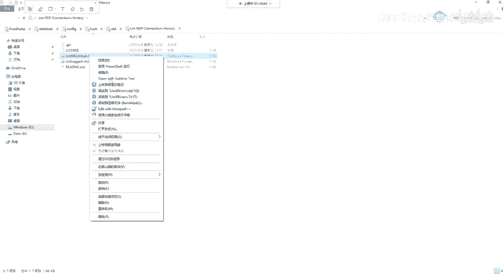

然后可以看到在这边的话，就是抛弃尔的话，它这个脚本上话，它有相应的一个格式的就是。像比如说在这边的话，就是他的一个注释。然后他的这一个脚本。呃，可以看到这这边get VMI object。

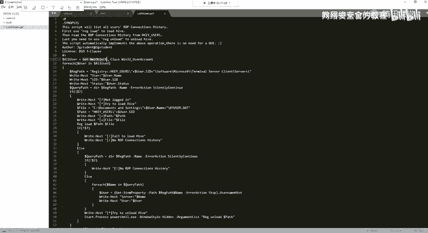

就这个的话这个的话其实就是呃我们。

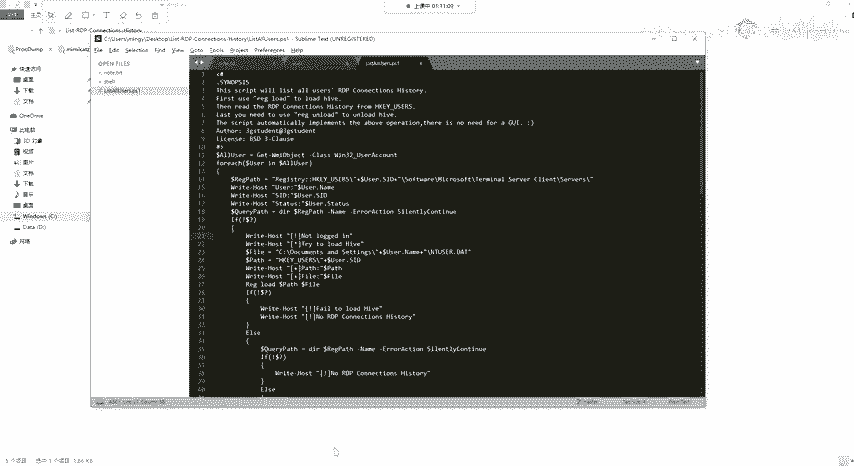

就在p share里面的话。嗯。他跟我们的这个WMIC它是一样的。一样的一个功能。比如说我们ge help。应该有吧。

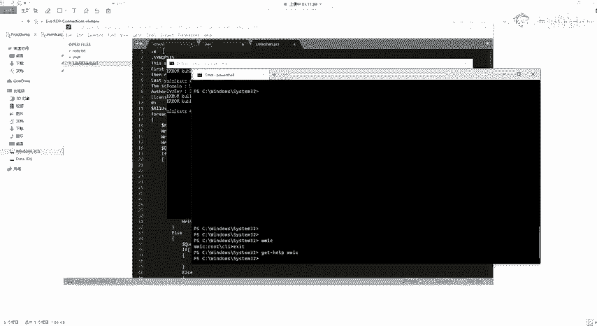

对。就这一个。呃，我记得应该是。就是这一个geWMI。就是这这一个功能的话，它跟我们直接执行WMIC它的一个功能是一样的。但是的话在这边它是用p share的一个方式。

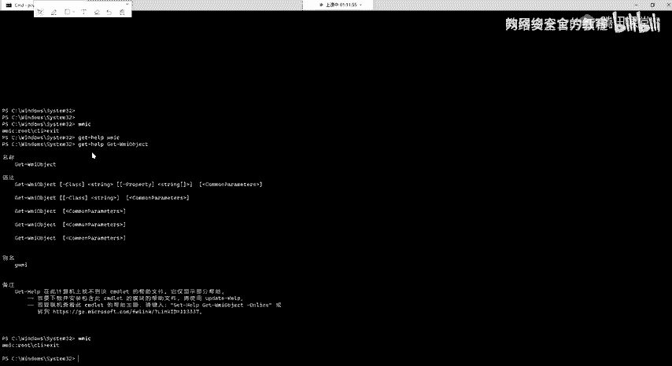

一。

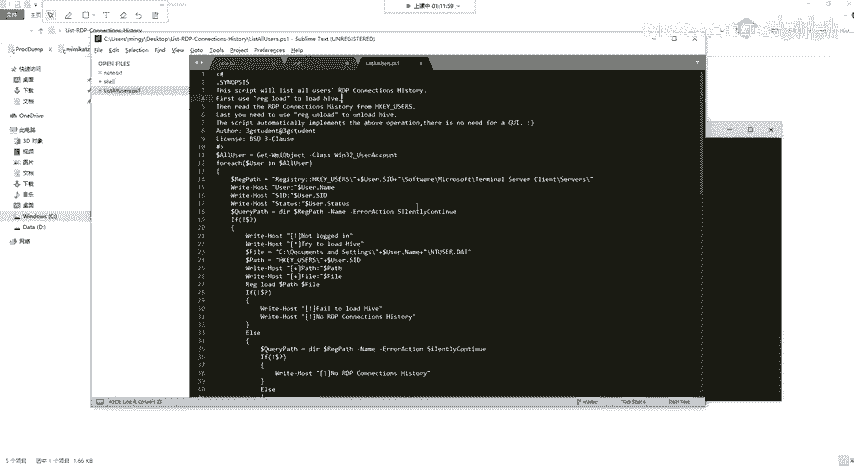

看到在这边执行的话，他在这边。呃，应该也可以那个吧。Okay。

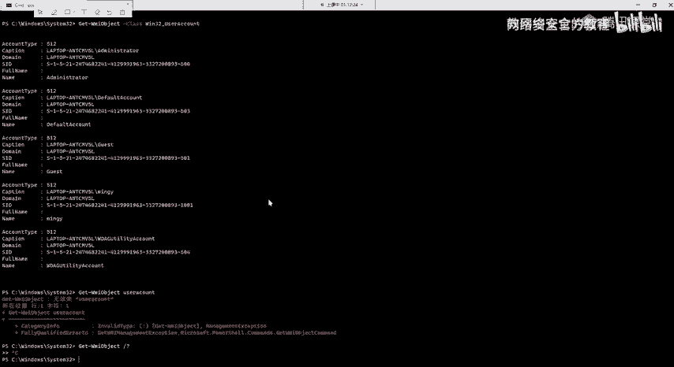

呃，我我有点忘了呀。就是呃它是实现了1个WMIC的这样子的一个功能。

然后的话呃还有后面的这一些的话，具体这一个的话就是。嗯。这个东西。呃，在这边的话，我先不讲吧我先不讲吧。然后后面的话呃后面的话我抽时间就是。给大家讲一下抛哮啊吧，就是基本的一个语法。

当然的话具体的这样子的一个写法的话，肯定一是乱一写讲讲不了。

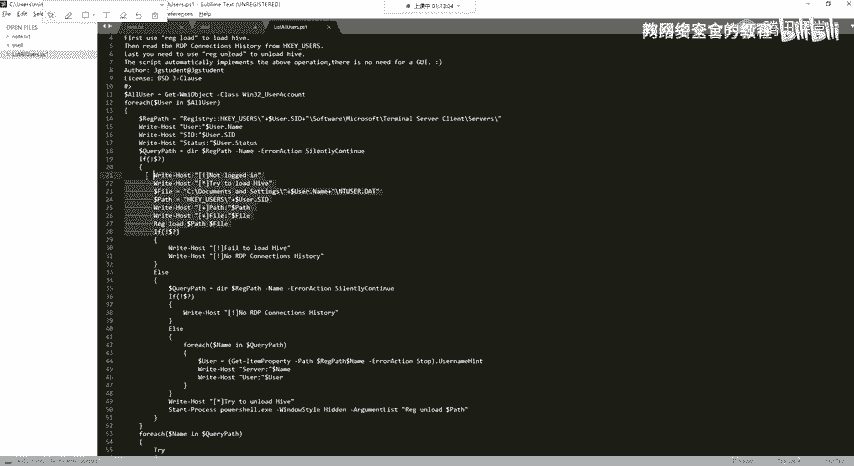

没有。

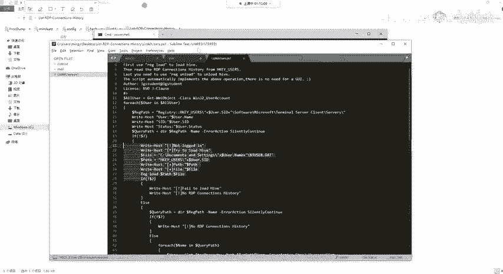

因为我我我都不知道我从哪里讲，你们能够去就是能够去理解啊。就你需要你首先现在的话，你先对它有一个基本的一个概念就行了。IDP连接。呃，IDV连接的话就是就是这一个。就远程桌面连接啊。

就remote desktoptop嘛。然IDP的话，它是一个就是协议嘛，就是我们这一个远程桌面的一个协议，有 desktop啊 project。Okay。这样的话就是远程就是IDP啊。啊。

就呃可能习惯的就是说说这些。

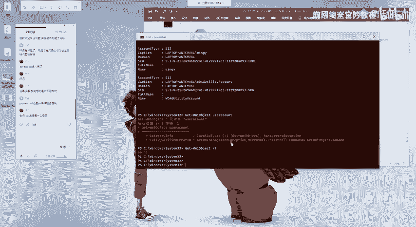

啊。

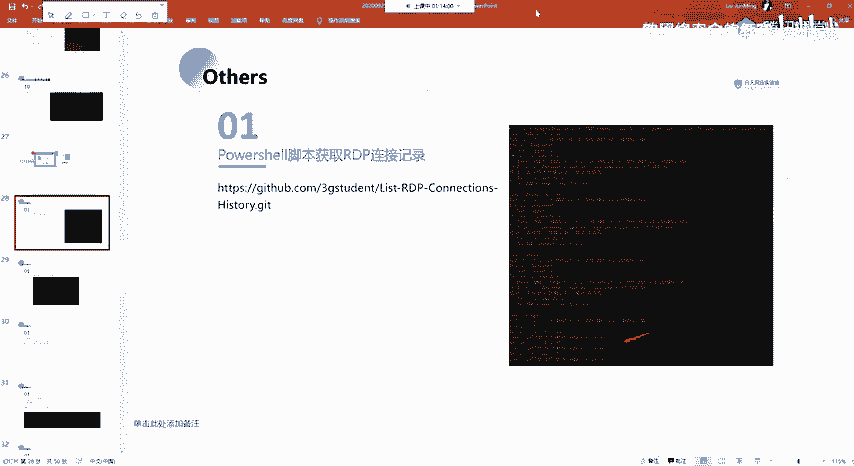

啊呃。言归正传。嗯扯远了又。

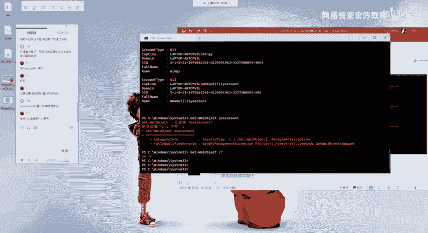

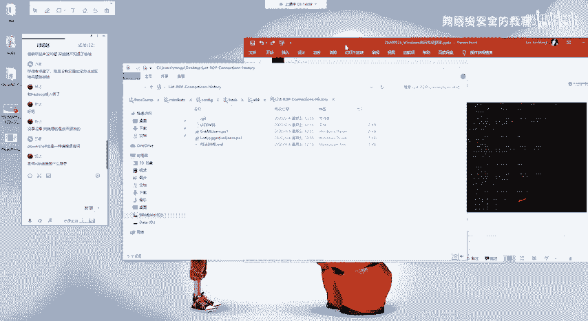

好，在这边的话，我们想要去。呃，我们想要去执行他，我这边下载到本地的这样子那个p share的一个脚本。我们。提现的一个方法呢就是这样子。

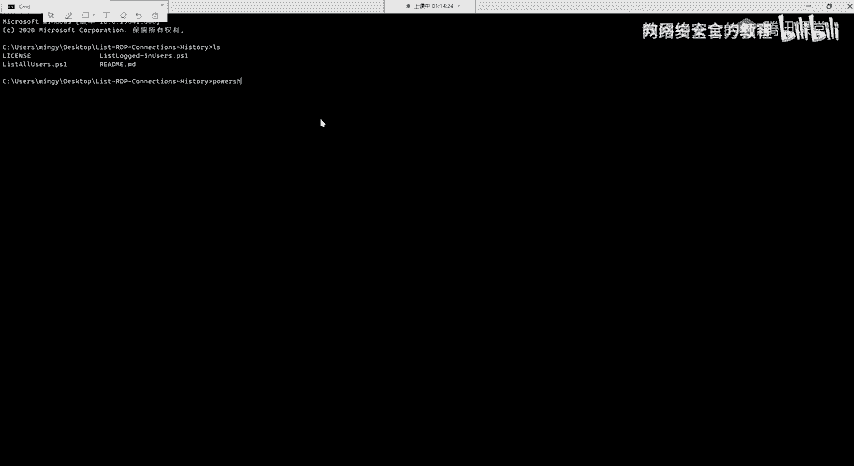

花絮，然后的话。呃。

执行的一个这样子一个方呃，执行这个脚本的一个方法，就是像这样子，就是杠F来去指定我们要去加载的这样子一个脚本。然后在这边的话，你会碰到有一个问题啊。比说要碰到这样子一个报错，碰到这个报错。

大家不要呃不要急。就是说在这边的话，抛希尔的话，它有这样子的一个就是运行的一个规则，就是有一个策略。睇诶要。几个有有有三个策略吧，就是三个还是4个，我忘了就是呃他允他你默认的话。

你在word上面你去执行抛弃的一个脚本的话，他不会去允许你去执行。就你默认的一个规则的话，它是禁止你在系统上面去运行这样子的一个抛弃的一个脚本的。就为了安全性的一个考虑。

然后还有的话就是还有大家可以去就是可以去更改它的这样子的一个规则。像比如说更改成为就是能够去就是没有限制，没有任何限制，就是你可以远程的去加载，也可以再加载本地的。然后还有的话还有一种策略的话。

就是呃不允许远程的，就远程去加载这样子的一个抛弃的一个脚本。然后在这边的话，我们可以去通过这样子的一个方法。Bypass。就干XEC by pass就是呃来去绕过它的这样子的一个运行策略的一个限制。

好的话，我们可以来去执行。这样子一个脚本对吧？可以看到他在这边他就已经没没报错了。本来的话它是禁止运行的嘛，我们通过这样子的一个方法的话，能够去绕过它。

然后在这边的话就列出了我当前系统下面的这样子1个UDP的一个连接记录。就主要的话就在这边，对吧？

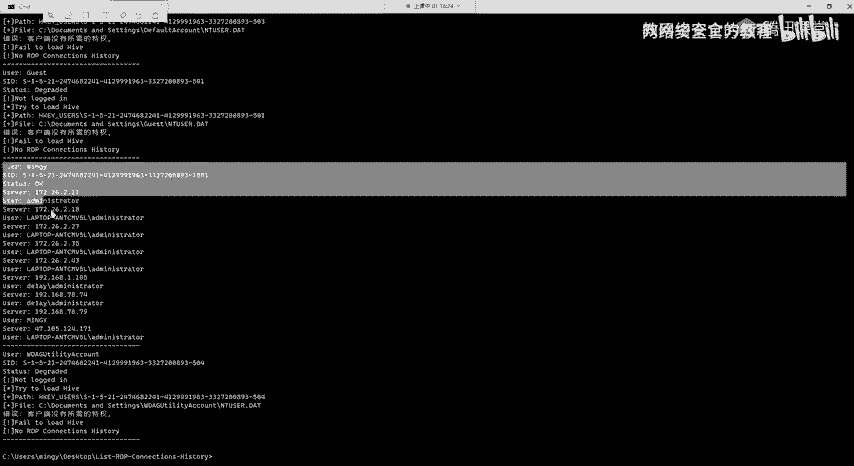

对，看到。而不是UDP是RDP的。就远程桌面连接的一个记录。然后我们。得到这个记录之后的话，我们能够去干嘛呢？对吧？我们可以去获取到它的一个连接记录的一个就是这种IDP连接，就原程桌面连接它的一个密码。

屁。然后它的一个密码的话，它其实有是进行了一个加密的。那么我们需要对它的一个连接密码做一个解密。在这边的话，我们解密的话，我们使用到了一个工具的话，就是这个minicast。嗯。P。うん。呃。

然后的话呃在这边的话，我们一起来看一下就是。其实在这边我们想要去查看您在本地连接过的一个目标机器的话，我们也可以通过注册表的一个方式啊，就通过查询他的这样子的一个注册表来获取到呃连接的一个G。

它的一个注册表的一个值的话就是在这边。我们来看一下效果。可以看到这句话就列出来了啊所有的这样子一些记录。就比如说这个主机我使用的一个addmin的一个用户去进行一个登录的对吧？还有其他的一些主机。

然后的话呃。第二步的话就是要查看你当前用户下面的这个目录，它是否有这样子1个IDP的一个密码文件，也就是这一个目录。

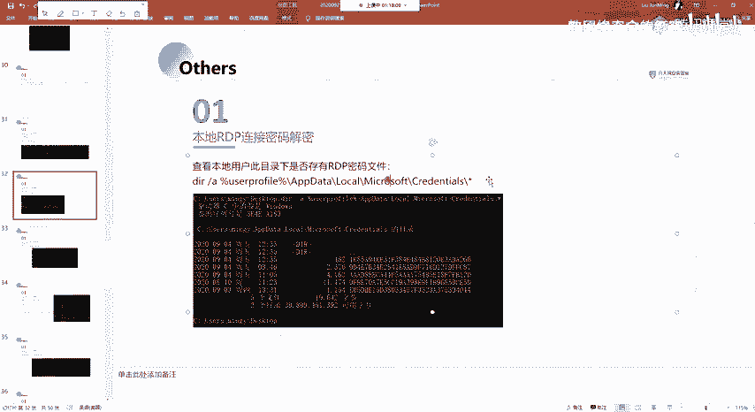

看一下。这个目录如果有的话，它就会显示这样子的一些。显示这样子的一个呃。文件。

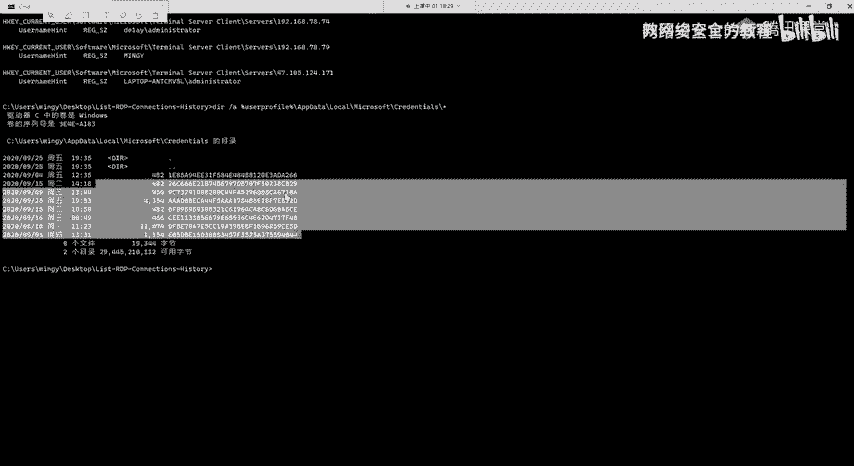

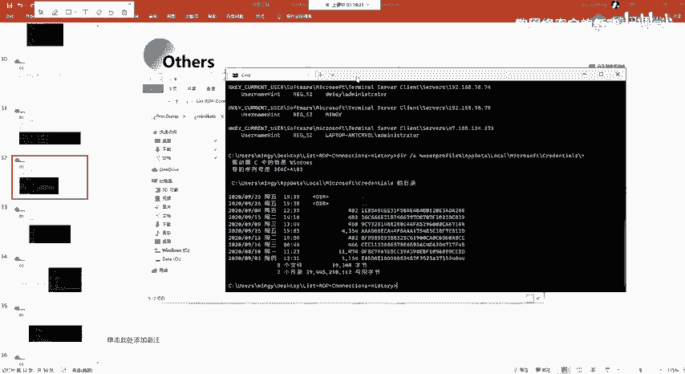

它会显示这样子的一个文件，然后的话嗯。在这边的话我要提一点，就是说大家可能不知道，就是说我这边的这一个密码文件它是怎么来的。是吧就说你可能你会你会你你去看看你自己的话。

你会发现你没有这样子的一个密码文件是吧？那么为什么为什么你呢会没有呢？就说你可能你没有去用这个RDP。

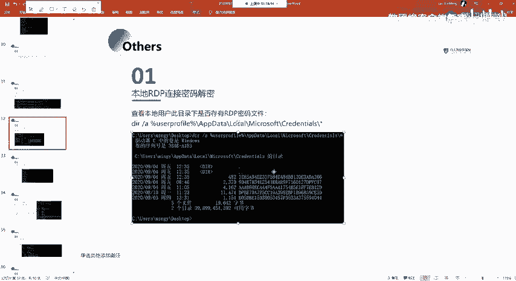

就是说呃很多时候的话就管理员他为了方便，对吧？或者说你自己也为了方便，你要去连接某一个机器对吧？比如说你去连接这个机器，你连接这个机器的话，你就是说你每次都要去填写这样子的一个用户名以及密码。

就主计算机的话肯定是要填的对吧？然后的话你每次去连接同一个计算机的话，它都要填这样子一个密码，对吧？那么我要我下次要去连的话，我还要去填。那么这样的话肯定就是。如果密码多了对吧？

那么你可能记不住或者搞混。所以的话在这边。我们。可以去勾选这一个就保存我的一个频据，就允许保存我的一个频据。那么我再去连接这个的时候。就我连接之后的话，如果他之前的话有保存，我这边的话是不是这个机器了。

这个机器。对我这边去连接的话，他在这边的话，他会要输入我们的一个密码，是吧？啊，连接。然后在这边的话，我们。下次还要去连接这个机器的时候，对吧？那么我们只需要去。呃。填写我们这边的一个主机名。啊。

我计算机名。然后的话他在这边的话可以看到在这边的话，它已经保存了我们的一个频据。就是说我们输入了这个计算机名，它会保存它已经保存了我们的这样子的一个凭据。这个凭据的话就是登录这一个机器的一个密码凭证。

然后我们下次再去连连接的时候，我们就可以不用再输这样子的一个用户名密码，对吧？然后去进行一个连接。

对吧我在这边的话，我就没有。

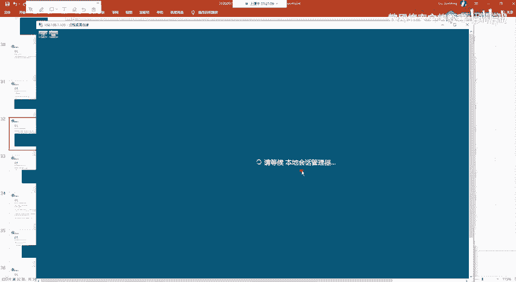

没有再输这样子个密码。然后的话在这边我们这边保存的一个凭据，那么它在哪里呢？对吧？因为我们这边这个凭据，我们下次再去领的时候，它不不需要我们输，那么它肯定是保存在我们本地的某一个某一个文件当中，对吧？

某一个地方。然后他保存那个地方，就是在这一个目录下面。就是也就是在这边显示的这样子的一个文件。就密码文件。然后呃查看保存在本地的一个远程主机信息。这里的话呃上节课的话也介绍了呀，对吧？

这边的话我就不多说了，就我们在这边的话也能够去查看到我们远程连接的一些呃信息。

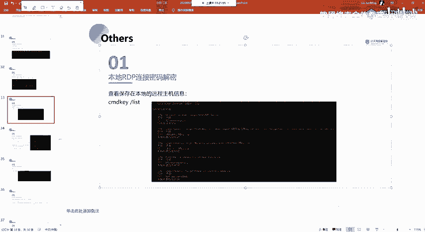

一些主机信息。然后的话我们本地呃我们要去我们获取到了它的这样子一个密码文件。那么我们怎么去对它做一个解密呢？减面的话，我们在这边需要用到这个命令 cards。这边mini卡的话。

需要用到就说这边的这个DPAAPI这个cedit它的这样子的一个啊功能。这个模块。然后我们需要去指定我们这边想要去解密的这样子的一个文件。的一个呃路径。然后我们在这边要去指定路径的话。

记住是用这一个杠斜杠印，斜杠印的话，你可以理解成就是说我这边的一个呃要去解密的一个东西的话，它是在这样子的一个文件当中，对吧？就是印在这一个文件当中。就是接我们的一个文件的一个路径。然后的话。

在这边我们执行之后的话，它会有这样子的一个值。就我们需要得到的其实就是这一个值GUID的1个ma key这个值。啊，我们得到了这个值之后，我们需要通过这个值来去找到它对应的一个ma key。

也就是这一个我们要去怎么去得到它一个master key呢？就是通过这个sDPAAPI就通过min。通过命令卡这个命令。来去得到它一个ma key。然后的话这个ma key的话。

如果说你有多个这样子的一个呃用户以及连接的话，那么它在这边的话，它不会仅仅是只有一个，它会有多个。然后的话那么我们怎么知道就是说我们的这个master key它是我们想要的呢，对吧？

我们想要的解密的这个文件呢，就是说通过这个GUID master key。来去进行一个确认。就说我们可以看到在这边有一个GUID对吧？是这一个我们前面这边获取到的这一个文件，从这个文件当中获取到的。

那么我们这一个GUID所对应的一个ma的 key，也就是我们需要我们需要去用到的。也就是我们要去进行一个解密的这样子的一个值。啊我们要解密的话，就是通过这一个。呃。

同样的也是通过这个DPAPI啊这个creeds。来去解密他。解密的话，我们需要通过这样子的一个就是把我们那个ma key把它给加加进来。就。加进来，然后执行执行之后的话，就能够去解密到他的一个呃数据。

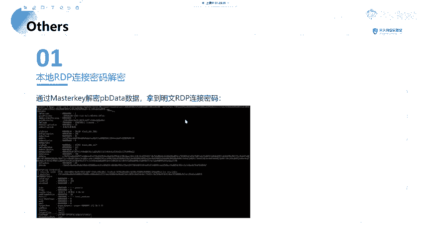

来去拿到他的一个名文那个IDP的一个连接密码。在这边的话呃，可能这边拉大一点，看的清楚一点。

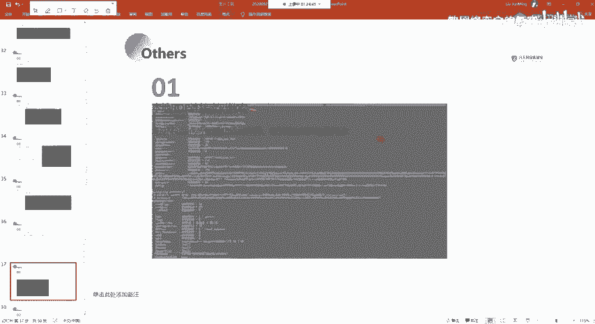

对，就是呃通过mini cards。首先指定我这边解密的一个文件，然后的话。指定我这边前面通过GID masterster key得到了这个musster key。对吧，得到之后的话。

我这边执行之后的话，他会返回相应的一个信息。返回的相应的一个信息的话，再注意在这边，在这边的话，他就会。返回我们的这样子的一个密码。可以看到在这边我们的一个t name。

也就是这个我们去连接的这个172。26。2。43的这个主机，对吧？它的所使用到的就我们在本地去连接所使用到的一个用户名的话，是这个adminadmin，对吧？以及它的一个密码的话是root。

因为在这边的话，我是使用的一个root去登录的。所以的话。得到了他的一个铭文密码是root。那么我们现在的话就已经得到了这一个登录这一个。呃，机器的一个ad me管理用户的一个铭文的一个密码，对吧？

那么我们就能够去直接的去登录这个机器，对吧？就是横向的移动，得到了这一个机器的一个呃权限。

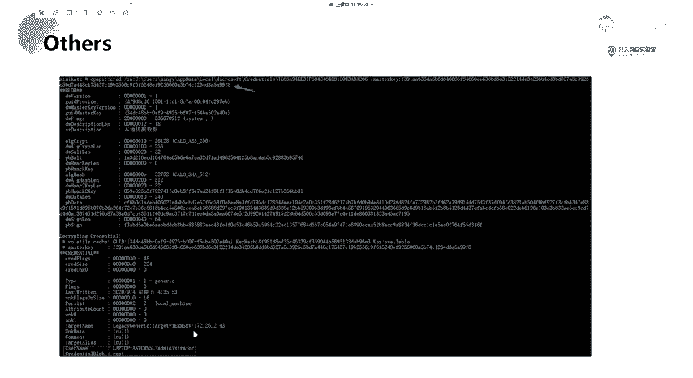

🤧嗯。以上的话就是呃。通过获取本地的这种RDP的这个连接的一个密码，然后对它进行一个解密来去进行一个呃横向的一个移动吧，是吧？

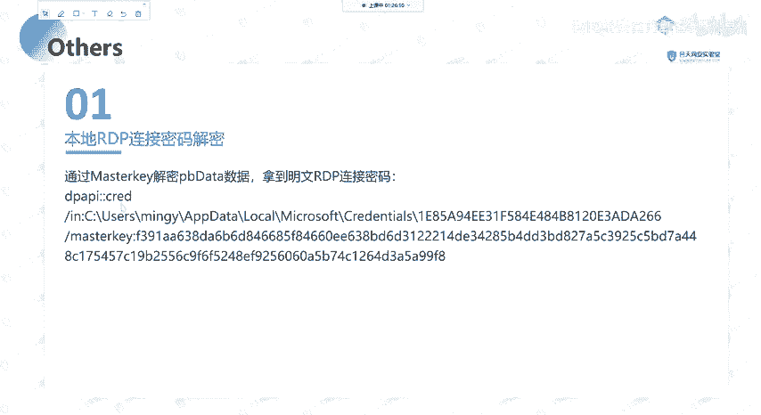

因为呃在windows机上面的话，用这样子的一个远程桌面连接的话是很普遍的一个操作，是吧？

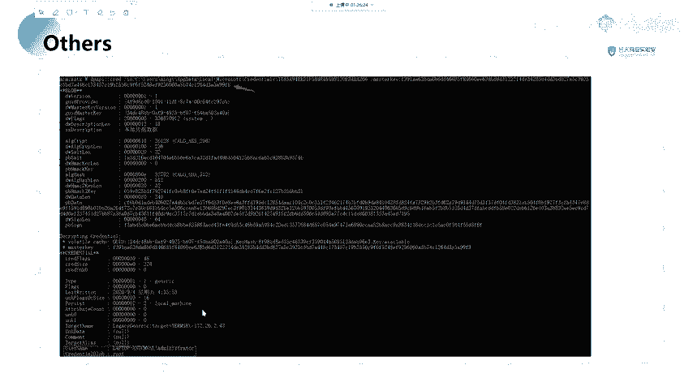

嗯。