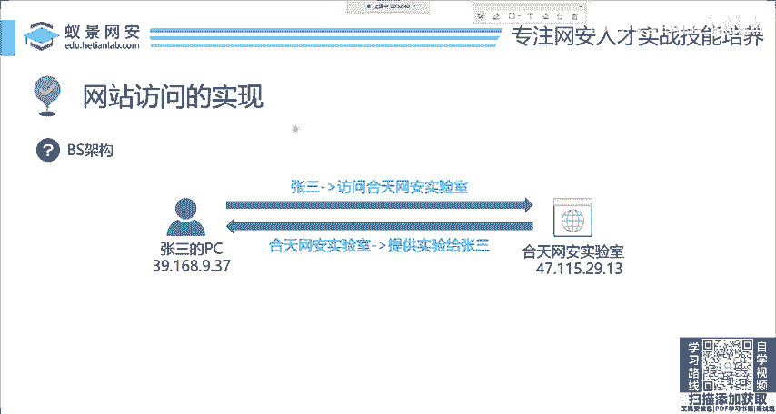
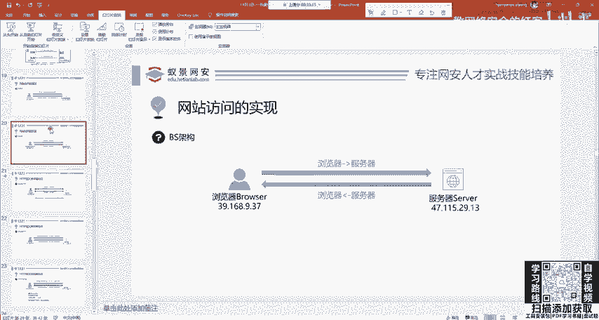
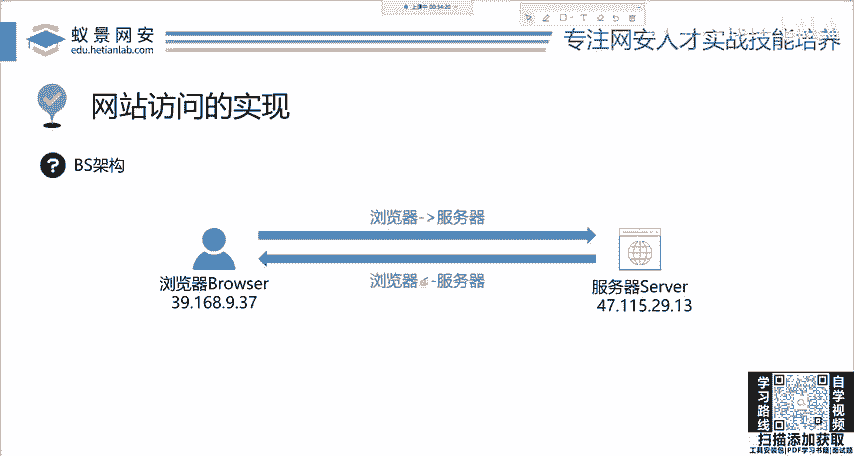
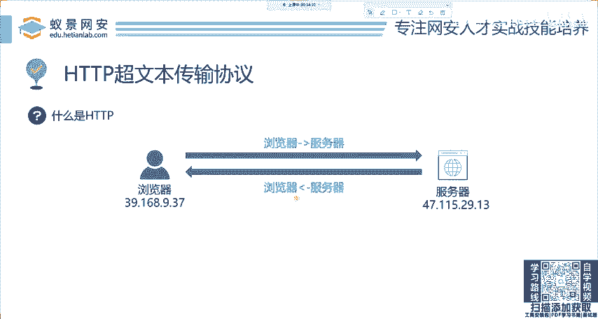
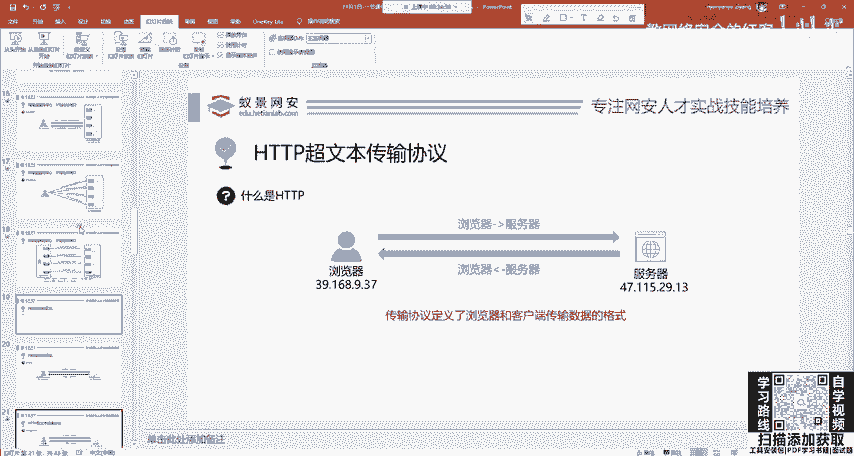
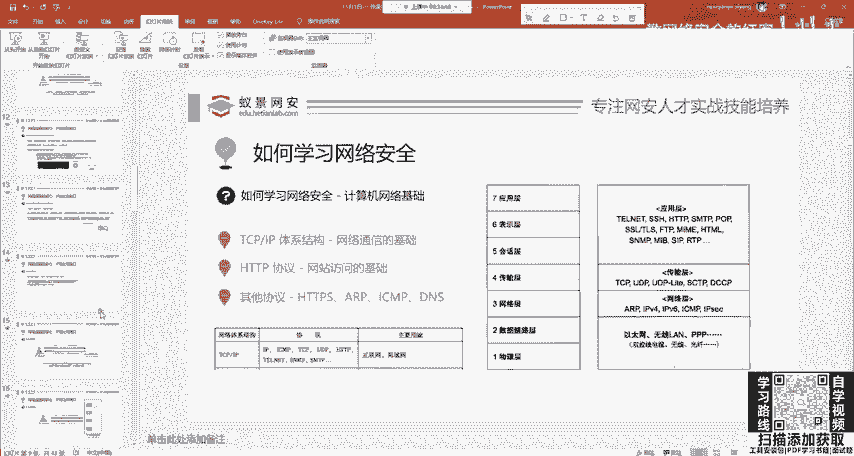
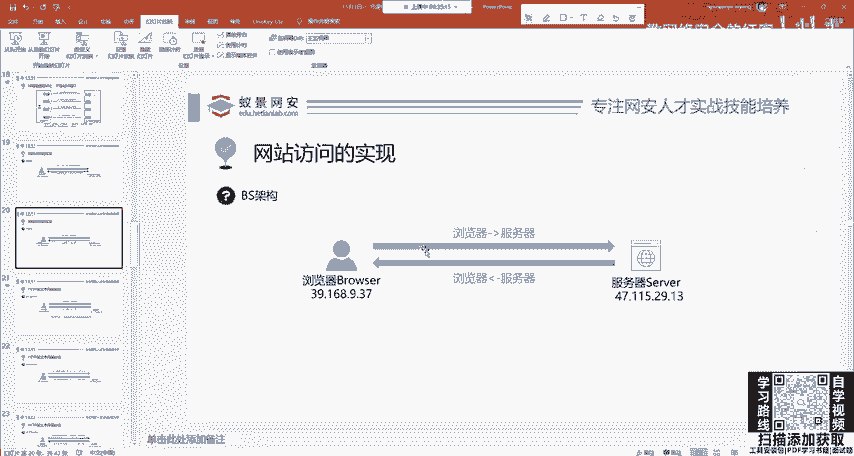

# 2024网络安全系统教程！清华大佬花159小时讲完的网络安全系统课！别再盲目自学了，学完即可就业！零基础入门网络安全！（渗透测试／漏洞挖掘／CTF／黑客技术） - P3：3.HTTP基础-网站访问的实现.mp4 - 教网络安全的红客 - BV1ft421A7Nj

这个地方就是端口的一个事界。到这里大家应该能够理解吧。IP和端口。IP和端口，我保证你不会忘。如果你忘了的话，你到时候加班主任啊，你把你让班主任啊提出你的问题，我随时给你解答。好吧。

这个IP和端口知道这些就OK。而后面呢就是网站访问的实现。

OK大家学到这里，你会发现我们刚刚解决的问题，这个网络通行的基础，我们现在解决了就计算机网络，你学习网络安全，你就听着。20分钟。基本就OK了。那下面呢我们来讲这个。HHTTP协议。

就是这个网站访问的基础。啊，大家如果有问题不好意思问的话，我们后面在课程最后会有一个集中提问的一个环节啊，大家可以不要急。

那首先呢这个网站访问你想你就想你怎么打开百度，你一定要带入啊，要带入自己。怎么访问百度打开浏览器，输入3W百度点com回车就访问百度了。那首先是不是引入了两个东西。

一个叫做B叫做broerbro就是什么浏览器，一个呢是服务器就是百度的服务器叫s。啊，这两个东西就构成了网站访问的一个基础架构。啊。

我们来看一下一个地方现在来回顾一下我们刚刚讲的比如说张三的浏览器就访问和天网安实验室的服务器，就是这样一个过程。浏览器像服务器发起请求服务器像浏览器发回这个响应，这个响应信息呢就包括了什么。

包括这些网站的内容。你搜索的结果，你想看的视频，你想看的图片都会返回给张三啊，就是这样一个概念。那现在遇到的一个问题，就是HTTT协议。这个协议中文名称叫做。

做超文本传输协议。首先请问大家为什么要引入协议？

你说啊这些网络工程师是不是闲的没事，就是让我们去学习的。他整这么多协议是为了干啥呢？你看这么多协议，首先告诉大家。

现在张三他就访问网站。张三发送的东西是不是要让这个服务器要能够听懂？要能够听懂是吧？就像交流一样，比如说你和一个美国人交流，那你们是不是要规定一种语言？比如说你说英语，那美国人也说英语。

你们两个就能够正常的交流。如果他说英语，你说中文，你你说什么他也听不懂是吧？所以说协议就是规定了计算机网络传输的统一标准规范你。

