# 2024网络安全系统教程！清华大佬花159小时讲完的网络安全系统课！别再盲目自学了，学完即可就业！零基础入门网络安全！（渗透测试／漏洞挖掘／CTF／黑客技术） - P40：27.PPTP口令获取.mp4 - 教网络安全的红客 - BV1ft421A7Nj

然呃第二个的话就是这个PPTP口令获取。这个的话PPTP的话大家可能接触的不是很多啊，就是这个点对点的一个隧道协议。就我们可以我们在问的系统上面的话，我们可以就通过拨录这个ISP来去访问企业的一个内网。

就是通过这个PPTP的一个协议。呃，在这边的话，我们。Okay。嗯。你片。

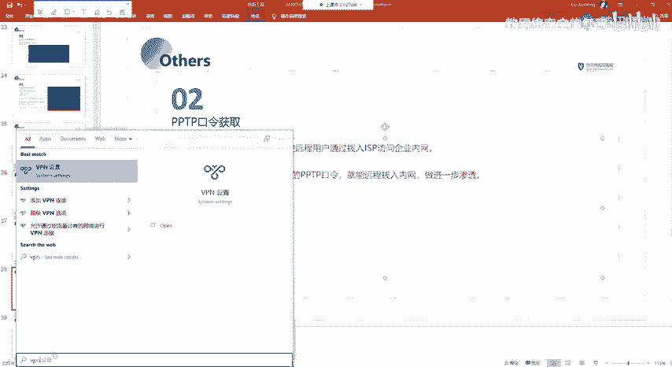

就是这呃。

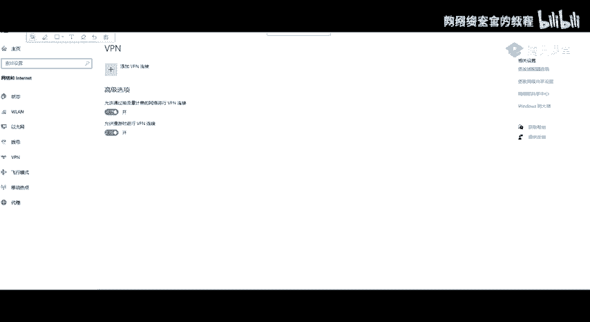

就是这两。Yeah。Okay。就是我们这边的1个VPN啊。

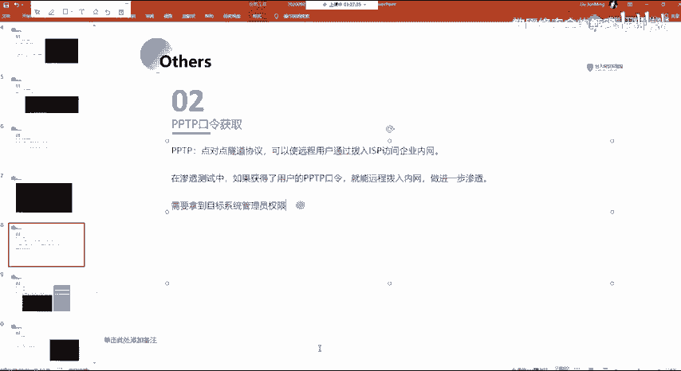

然后我们在这边的话，我们可以去添加我们的这样子的1个VPN的一个连接，对吧？来来去连接到我们之间的这样子的一个呃就是VPN的一个网络。

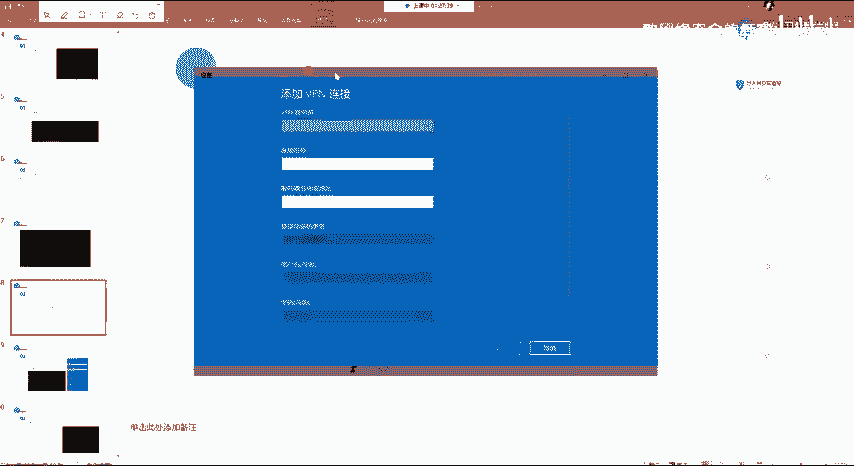

然后我在这边的话，我们就是配置好之后就注意的话，就如果说你是使用的这样子的一个VPN那个类型的话，是这种顶对点的一个隧道协议的话，就像我这边的一个截图这边对吧？然后的话你连接连接之后的话。

你就是说如果说你得到这个机器，它还存在这样子的一个连接的一个信息，那么我们可以啊获取到它的连接的一个密码。那么我们获取到它的一个连接的密码的话。

那么我们就可以在它的这个机器上面来去通过这个VPN通过这个PPTP的一个隧道来去连接到我们指定的这个服务器，对吧？

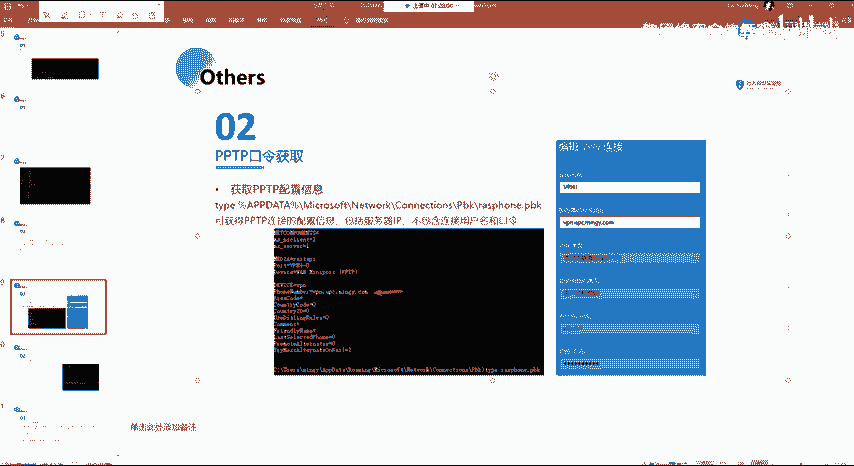

然后首先我们去获取的话，获取它的个密码的话，第一步我们需要获取它的一个配置信息。它那个配置信息的话，它在这样子的一个路径下面。

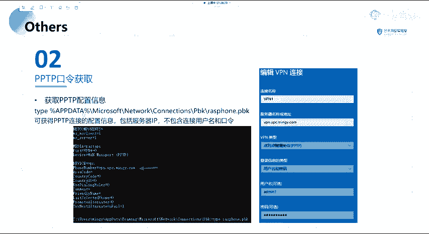

就这一个路径。

嗯。找着了。

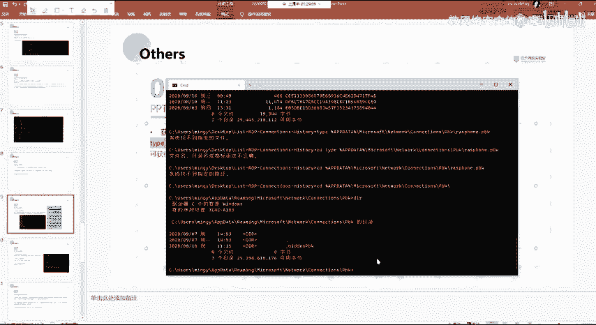

呃，在这边的话你找不到的话，是因为呃我这边的话没有串这一个，就是没有添加这样子的一个U片。因为我这边的话没有。

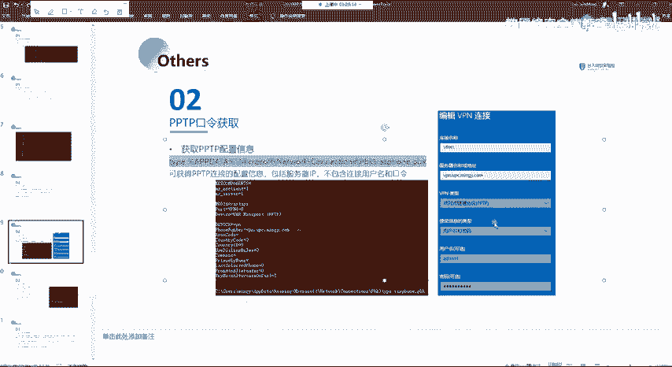

当然的话。诶。

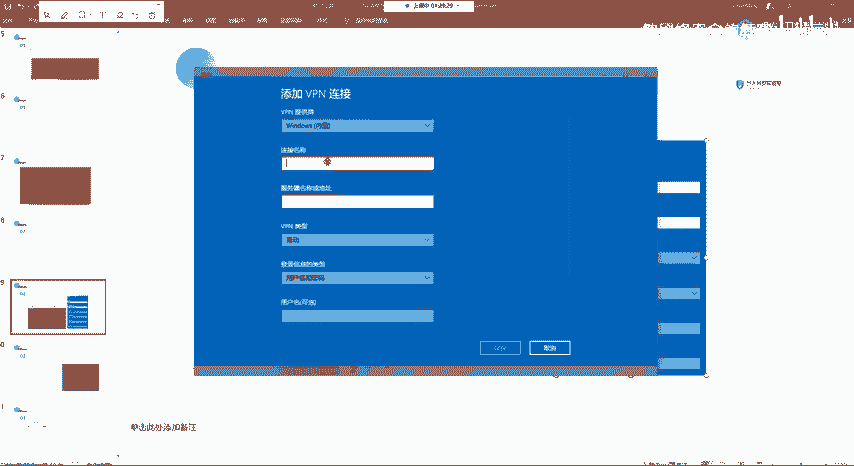

我这边随便创一个吧。

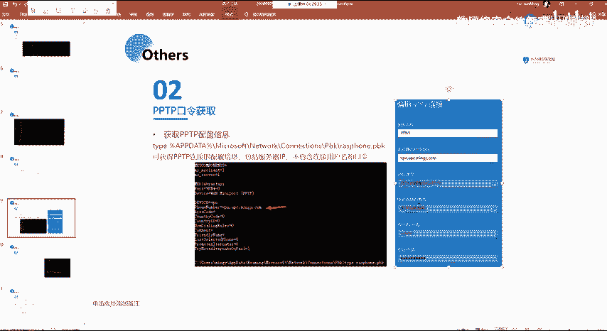

啊，我这边不是了吧，你们呃你们自己如果想要去获取的话，你自这边的话，你随便去进行一个写过，就你不需要有这一个，你不需要有这样子的一个预片。

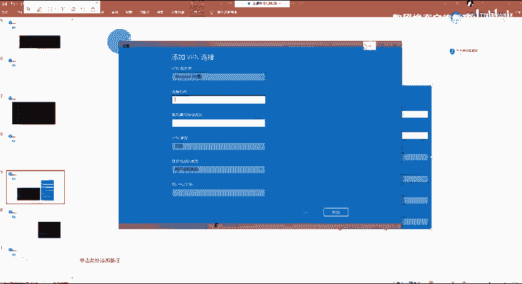

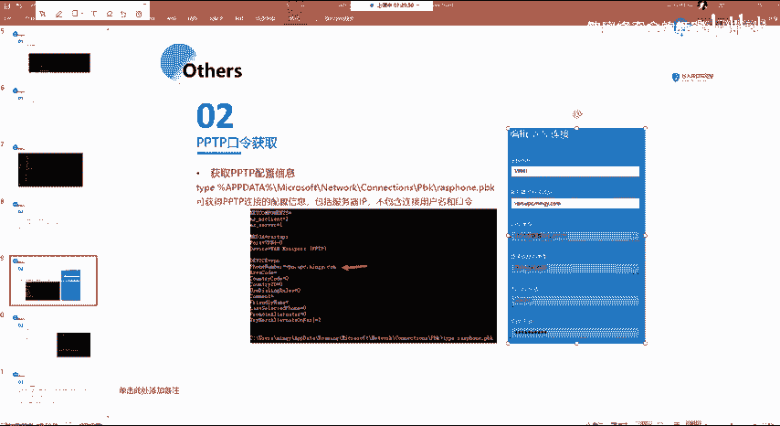

你就呃随便输入这样的一个信息以及用户名密码。然后的话你可以去尝试去获取它的一个你这边输入一个密码，对吧？然后在这边的话，你配置完配置完之后的话，它会在这个目录下面，它会有这样子的一个文件。

就这个文件的话，它就是存储着这个连接的一个配置信息。当然的话，这里的一个配置文件里面的话，它是不包含用户名以及口令的对吧？那如果有的话，那么我们直接在这一个文件当中就能够获取到嘛，对？

一般而且像这种的话也不会说是一个铭文的一个存储。

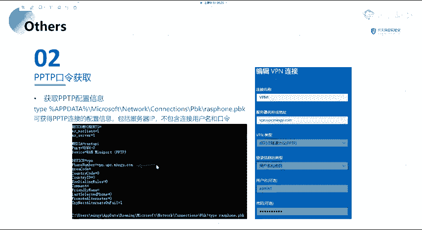

然后的话在这边的话，我们可以通过mini cards。来获去获取到他的1个PPTP的一个密码。嗯。然后获取的一个方法的话也比较简单，就是呃通过这样子的一个方法，就用这个LA secrets。

来区间一个后区。

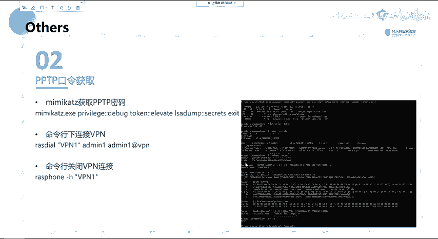

就呃具体的一个步骤的话，看这边吧。我就不演示了。然后我在这边的话，执行之后的话，他就会去获取我们的这边的一个secret。然后主要的话就是看这边。在这边的话，我们就。得到了我这边的一个铭文的一个密码。

就我的一个用户名的话是艾min一密码的话是艾min一啊V篇，也就是我在这边输入的这一个。Yeah。而我们得到了它的这样子一个密码，我们可以通过就是说通过这样子的一个命令来去进行一个连接。

就是连接这个VP。那么我们就等于就是说我们通过这个VPN进入到了另外的一个网网络，对吧？

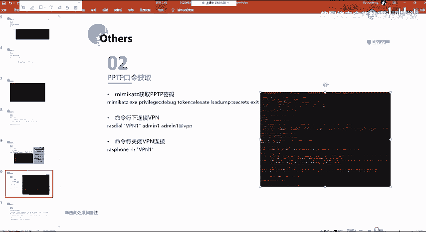

那么等于就是说呃进入到了另外的一个，可以说是内网，或者说是另外的一个网段。就通过这样子的一个方式来去进行一个连接。就ISDAL，然后关闭的话就是通过这样子一个命令。

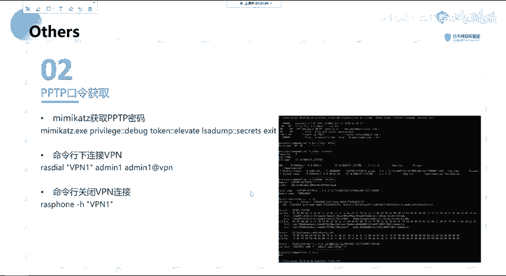

这边的话我不一一的演示了。然呃，第三部分的话。呃，先因为时间也不晚了，我这边的话我就抓紧一点时间呃。

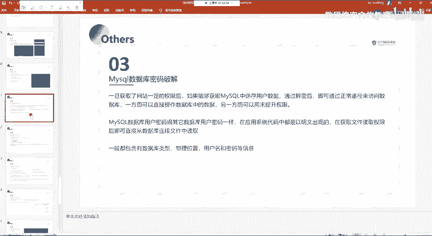