# 2024网络安全系统教程！清华大佬花159小时讲完的网络安全系统课！别再盲目自学了，学完即可就业！零基础入门网络安全！（渗透测试／漏洞挖掘／CTF／黑客技术） - P41：28.MySQL数据库密码破解.mp4 - 教网络安全的红客 - BV1ft421A7Nj

第三部分的话就是my circle的一个数据库密码的一个扩解。就是呃因为my circle数据库的话也是我们常用的对吧？然后的话如果我们一旦获取了我们网站的一定的一个权限之后的话，我们可以获取到。

这一个机器上面它所运行的这个mycycl。他保存的一个用户的一个数据。然后的话这个用户数据的话，我们可以通过解密来去获取到他的一个数据库的一个呃用户名密码。嗯。

然后的话呃就mysl的一个数据库用户密密码的话，它跟其他的一个数据库，它其实一样的。就是它在系统的一个代码当中，它是以一个铭文出现的。然后的话我们获取到它的一个读取权限。

其实可以直接从数据库当中去进一个读取。啊，呃，关于这一个的话，大家自己看一下吧，我就不一一说了呀。然后呃主要的话就是介绍一下就是mycycl的一个数据库的一个文件类型。就说my这个数据库的话。

它总共有这样子的三种文件。我们重点要去关注的话，就是这一个就是说与用户相关的这三个文件，就是优着点FRM还有MYDMYI。然后的话我们mysql数据库用户密码的话。

它都保存在这样子的一个us着点MYD的一个文件中，就包括root用户，还有其他用户的一个密码。所以说在这边的话，这个U着点MYD是我们需要重点去关注的是吧？因为我们目的是要获取到。呃。

去寻找他的一个数据库的这种用户名密嘛，是吧？哦。说到密码的话，我们需要去了解一下，就是mysql的它的一个加密的一个方式。这边的话主要就是呃了就是了解。就了解一下呃，我们my circle的话，它在4。

1还有4。1版本之前，以及之后的话它的一个加密方法它是不一样的。就现在一般的话我们都是401嘛，所以的话我们的一个加密的方法，它都是这个mycycl的1个SHAE的一个加密方法。然后的话呃。

我们其实mys数据库当中的话，它自带有这样子的两两个函数，我们可以通过这两个函数来去呃进行一个查询来。就是比如说以我这边的一个例子，我通过这个password这个函数。

这个password函数的话就是在新版的就是401版本之后的话，我们可以用这个password这个函数来去生成。嗯。来去呃。呃，查询到这边指定的这个root。他的一个就是他加密之后的一个数据。

也就是这边这边的这个数据。嗯。然后也就是说如果说我们在呃我们都获得的这一个。呃。在mysql呃这一个文件当中获取到的这这样子的一个。加密之后的一个数据是这一串的话。

那么我们就能够去知道它的一个铭文的一个密码是这一个root是吧？所以的话呃在这边我们怎么去获取到他的这样子的一个。这一创值呢。嗯。诶。然后前面我们有介绍，就是说。在这一个优者点MID文件。

它是保存的root用户有其他用户的密码，对吧？那么我们在这边我们如果得到了这一个机器，它的一个就是它的一个权限，我们可以直接获取到就是说在它的一个my数据库的一个d文件夹下面。

就保存的这样子的一个文件的一个呃路径下面找到这个文件。然后的话我们可以把它拖下来，就下载我们本地。然后的话我们可以通过用win hack或者是说用呃能够使用二进制的一个模式查看的这样子一个编辑器来打开这个文件。

就能够去找到它的一个加密之后的这样子一个值。就像在这边的这一串。加密的一个密码那一个哈希值。然后这一串密码哈希值的话，就是我们需要去进行一个解密的。然后解密这样子的一个哈希值的话。

我这边的话介绍这样几种方法。首先第一种的话就是呃在线的一个网站破解。就在线网站破解的话是我们用的最多的对吧？就。那比如说我这边的这一串对吧？可以看到在这边的话，我这边直接查询之后的话。

得到它的一个结果就是root，然后它的一个加命的一个类型是mysq5。嗯。我。就是呃一种啊，然后然后的话如果说你在线破解不良的话，我们可以选择就是用这一个hush cat。Hca的话。

它是一个密码破解的一个工具啊，它里面支持很多的这样子的一个密码破解的一个呃一个方法。然后在这边的话，我们呃就大概的介绍一下。就呃在这边使用这个哈 cut h cat的话。

我们要去解密我们的一个my circle的一个这样子一个加密的一个哈希值。我们需要。这样子的。呃，两个参数就可以了。首先第一个参数就是这个杠M。赣澳亩参数的话呃。先。Iush cat。

就是这一个。我们可以通过ha cat干H来查看到他的一个帮助信息。然后在这边的话，你会发现会有很多的这样子的一些信息反馈给你啊，就是他支持的这样子的一个。呃，功能相当多。

就是他能够去解密的这样子的一些呃。这样子的一些。就他的一些加密的这样子的一些。呃，算法呀，还有指定的一些。呃，像比如说。thon的一个pas这样子的一个方法，它的一个加密方法，它能够去进行一个解密是吧。

还有其他的一些指定的一些功能。像比如说PDF的这样子的一个。指定版本，它的一个加密，它能够去进行一个解密，还有其他的一些等等的这样子的一些功能。然后在这边的话，我们。

可以看到就是我们这边的一个杠M的这个参数的话，其实就是指定的这个哈希mod。也就是我们要去解密的一个这样子的一个哈希，它是什么样子的一个类型。

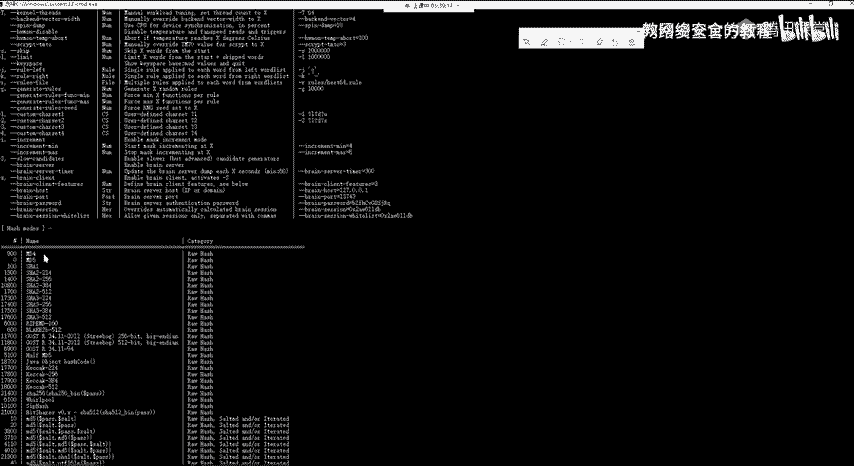

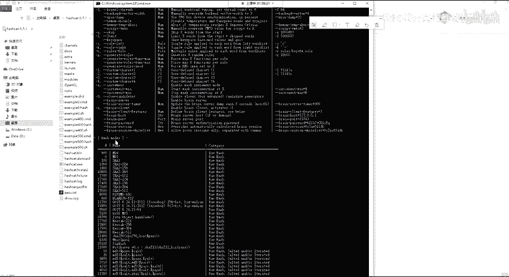

然后我们这边的话是1个300，其实呃。

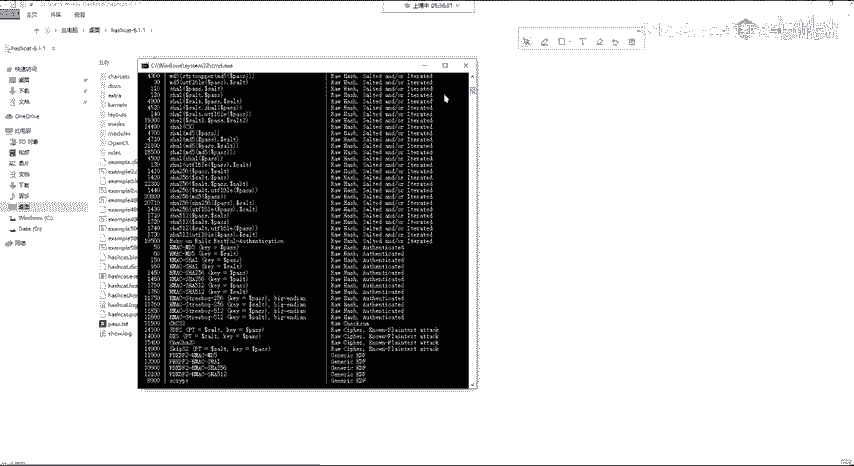

在这边的话，我们找到就是三00所对应的这一个。Yeah。嗯。Yeah。这里啊就是300所对应的它的一个就是解密的一个类型的话，就是这个mycycl4。1，还有my mycycl5对吧？

然后的话我们在这边的话，我们要去解密的话，其实就是这样子的一个呃，它这个mycycl版本所对应的一个加解。

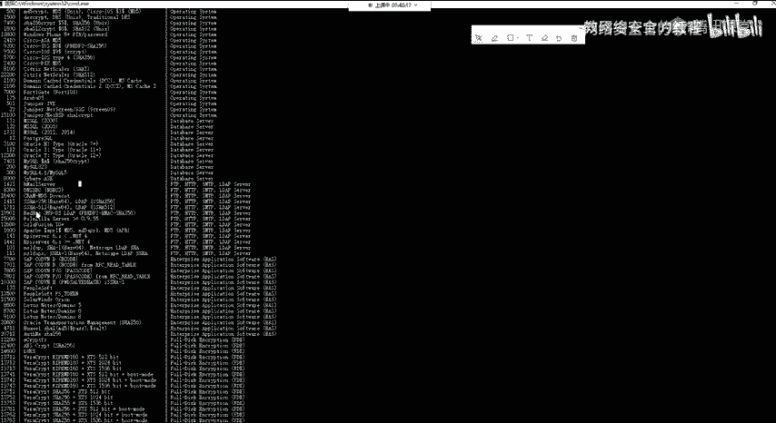

加密的一个类型，对吧？然后在这边的话嗯。Okay。然后在这的话，我们需要杠M指定这个300以及杠A指定3的话，这边杠A的话就是指定你要去呃。解密的一个模式。就这边指定三的话。

就是一个爆破的一个模式去进行一个解密，就是用他自己的，他其实有内置的这样子的一个解密的一个方法。

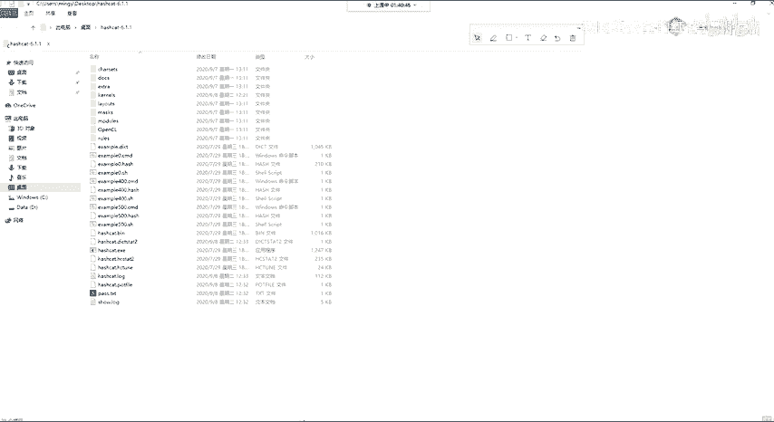

加起。系。这边内容有点多啊。看一下这个就attack mode就是攻击的一个方法。嗯然后这边的一个攻击方法的话，就呃就你就使用它默认的一个三就可以了。

它是用一个呃他有自己的一个就是爆破的一个方法来去进行一个解密。

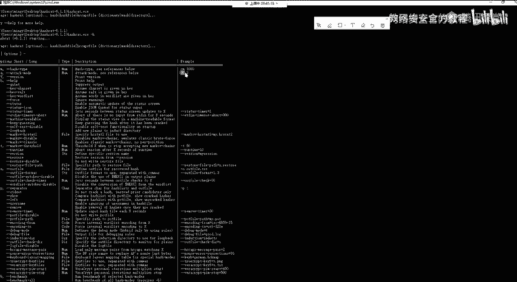

Yeah。然后在这边的话。看一下效果吧，就这个的话因为比较简单，应该可以直接就跑出来。

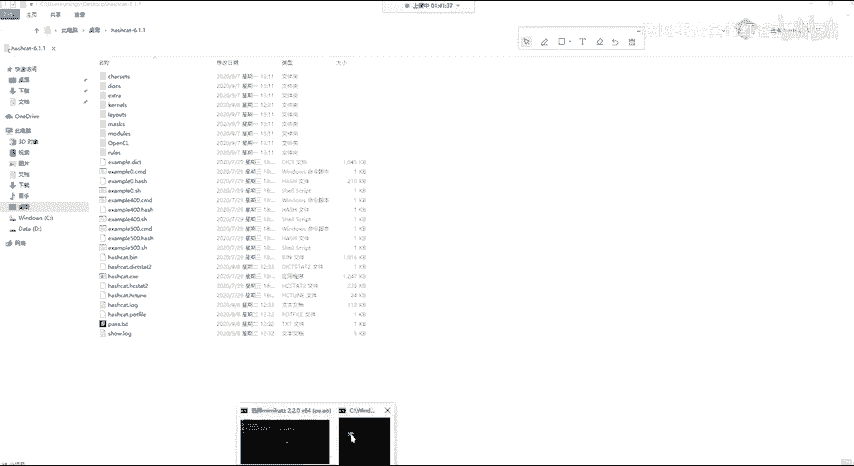

嗯。不你。对。Okay。你名称。そ嗯。

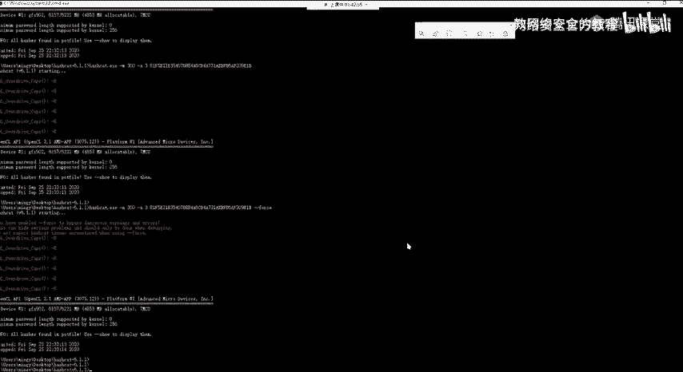

这边怎么没出？嗯。呃，这边的话是因为就是你哈希克的话，他在这边他去跑的话，他会。是刚刚发少的吗？你去跑的话，他默认会他是会用那个GPU啊。啊，我记得是是这个。有点弯了。Okay。

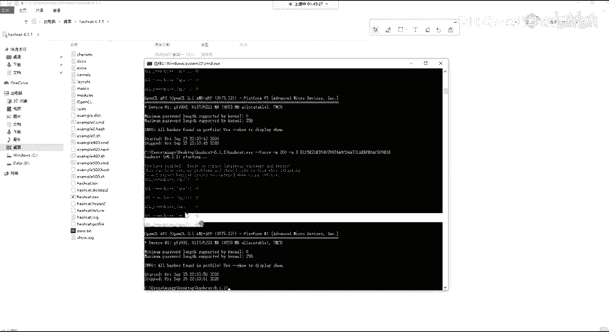

嗯。哦，这林的话先先这样。我等会去看一下，我在这边我忘了，就他在这边的话，这个报错的话是可以忽略掉的。就是说呃你用哈q的话。

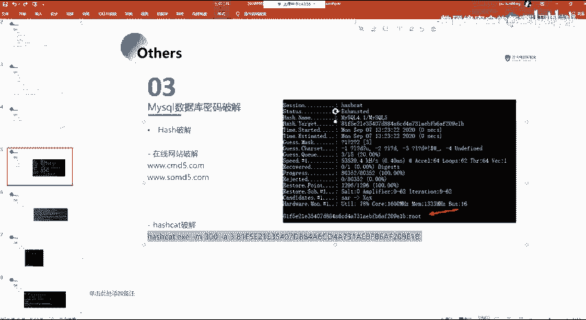

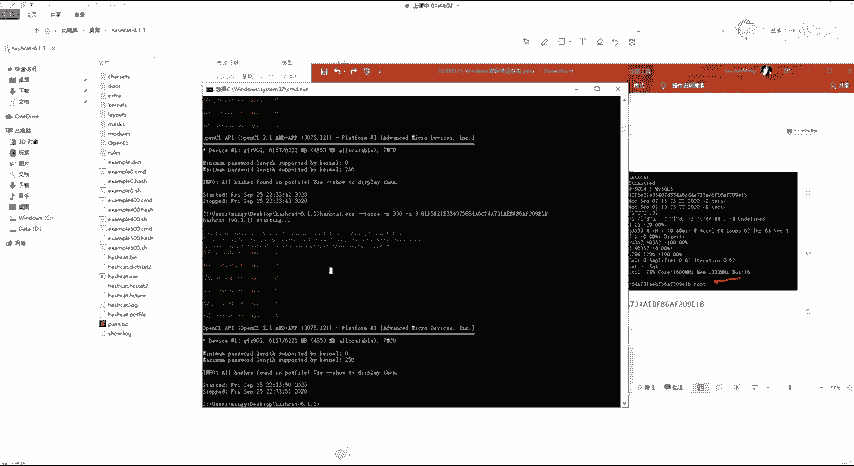

因为你去跑这个的话，它需要资源挺多的。然后的话它是其实就是一个爆破嘛。

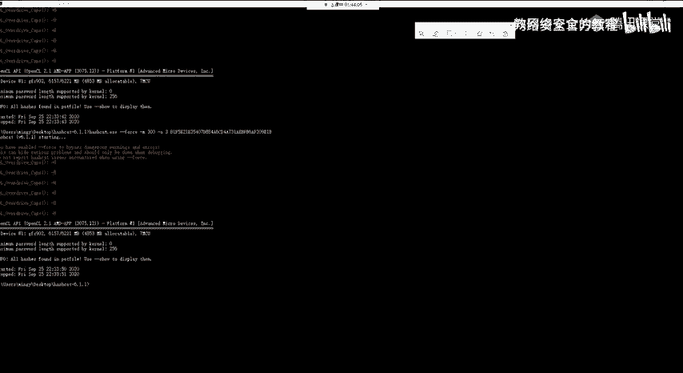

然后他这边他默认的话，呃，他是会用那个就是GPO的一个方式去跑。然后的话如果你的1个GPO呃是不支持还是怎么的？我可以用一个参数去把它就是不用GPU去跑。然后的话就不会有这个报错。

然后这边我忘了这个参数了。

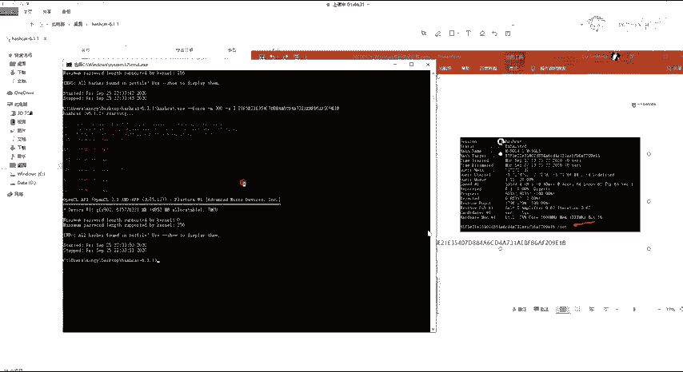

然后这边参数太多了，我觉得一个一个找的话，太麻烦了。然后我们在这边的话看一下，就看这一个截图，它的一个结果吧。就正常的话，你跑的话，跑出来之后的话会是像这样子。就在这边的话。他跑完之后的话。

他会在这边有这样子的一个结果，就是这一个哈西所对应的一个铭文的一个密码，就root。嗯。然后还有就是用这个ju，也就是呃。这1个GOH是看你里面自带的一个工具，也是一个常用的一个密码爆破工具。我们。

用这样子的一个工具去进行去进行一个爆破，也是可以得到的。

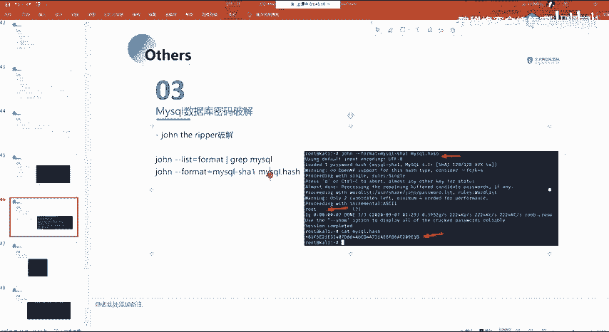

啊。