# 2024网络安全系统教程！清华大佬花159小时讲完的网络安全系统课！别再盲目自学了，学完即可就业！零基础入门网络安全！（渗透测试／漏洞挖掘／CTF／黑客技术） - P42：29.常用软件密码获取.mp4 - 教网络安全的红客 - BV1ft421A7Nj

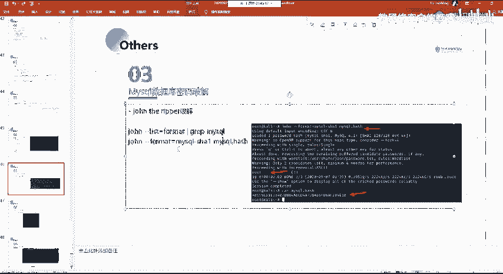

然后还有呃就是系统当中所常用的一些软件密码。

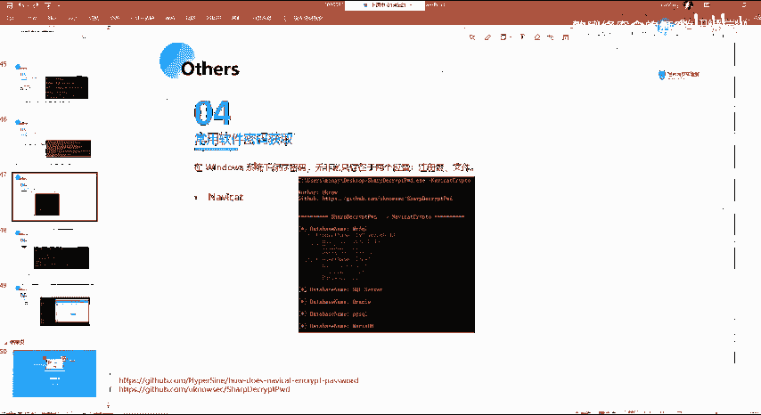

呃，这边的话大家自己课后去尝试吧，好吧，我这边的话其实截图啊也给出来了。然后主要的话就是用到了他的这一个ship。

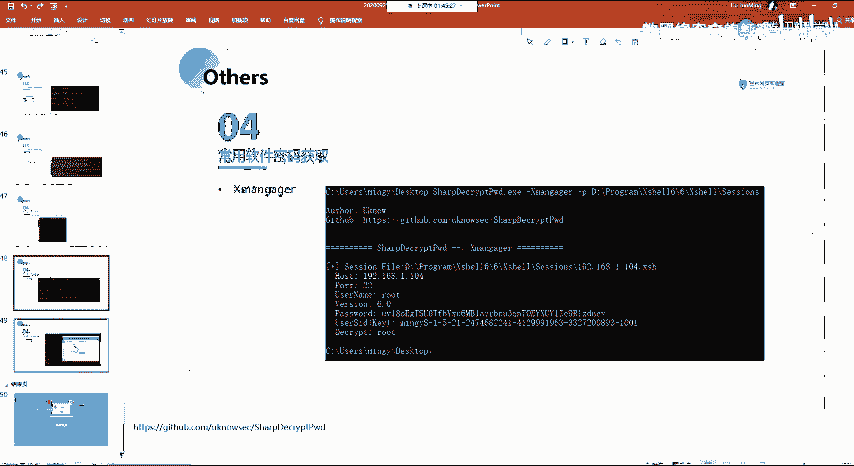

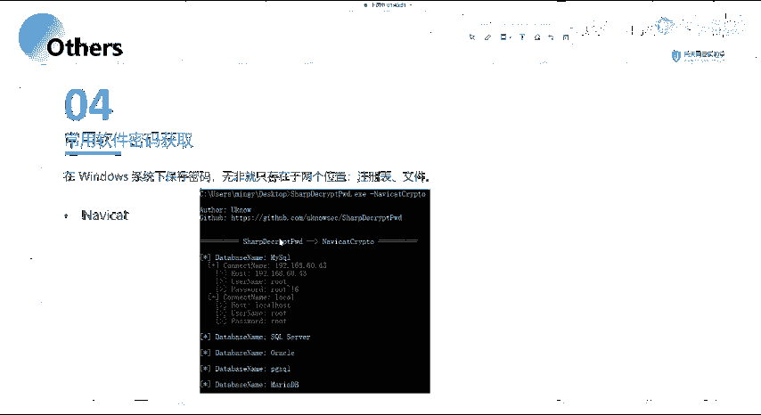

这个工具啊这个工具的话很好用的一个工具，就是能够去获取你系统当中，像比如说MV cat这种，还有叉 manager啊，就叉，还有te等等的这一些呃常用的这种软件，它里面的一个密码能够去获取出来。

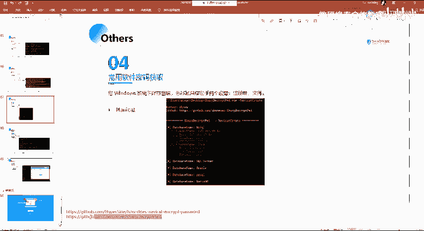

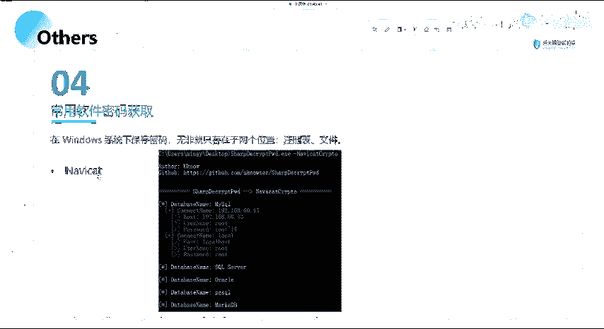

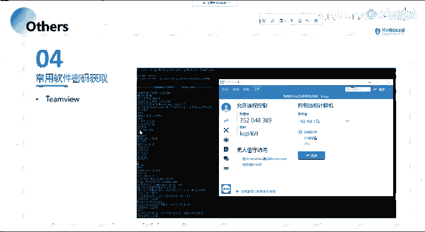

呃，其实我前面要说的话，就是这一句话，就是在wind系统上保存这个密码，就无非就是存在这两个位置，就注册表，还有文件是吧，就你在注册表当中。从注册表当中获取。

然后的话还有就是呃从这样子的一些他的这样子的一些路径。像比如说这一个插序。

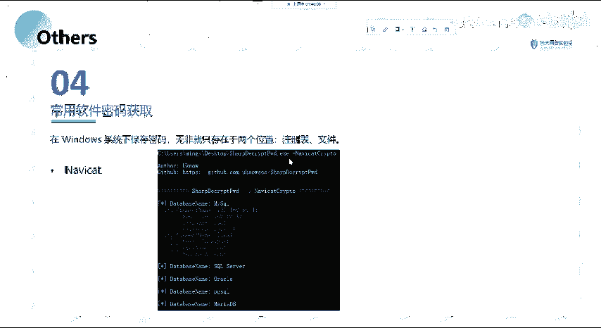

就插需L的话，你安装插需L之后的话，它会有这样子的一个筛选时的一个文件。然后的话你的这样子的一些存储的一个密码的话，它会在这一个筛选文件当中。也就是呃它会存储在这一个路径下面。

然后的话我们可以用这个工具来去获取它的一个筛选里面的一个加密的这样子的一个铭文的一个密码。

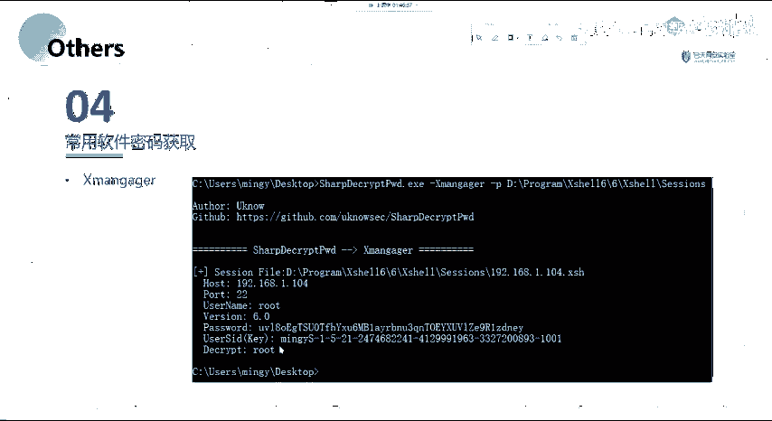

你家有T目，题目的话在这边我们可以看。呃。就在这表，我们可以看到在这边他。是这样子的一个就ID还有密码，对吧？然后以及在这边的话，我们可以在这边可以看到它直接获取到了你T上面所有的这样子的一些信息。

就包括你的1个ID以及密码。还有你想要去连接的这样子的一个I，以及你的一个姓名啊等等的这样子的一些信息。

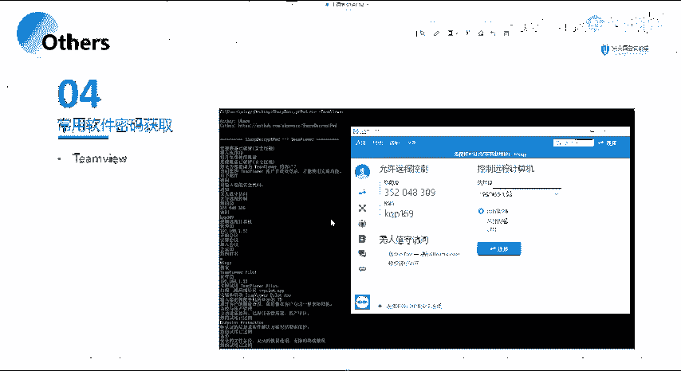

都能够获取到。好呃，以上的话就是我们本节课的一个所有的一个内容。

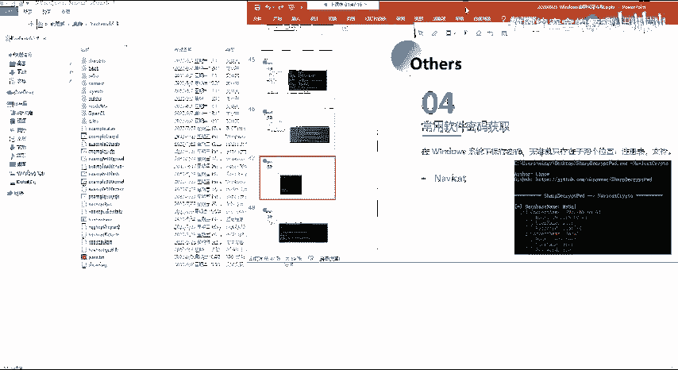

呃，我发现内容还是有点多啊呃，我看一下。

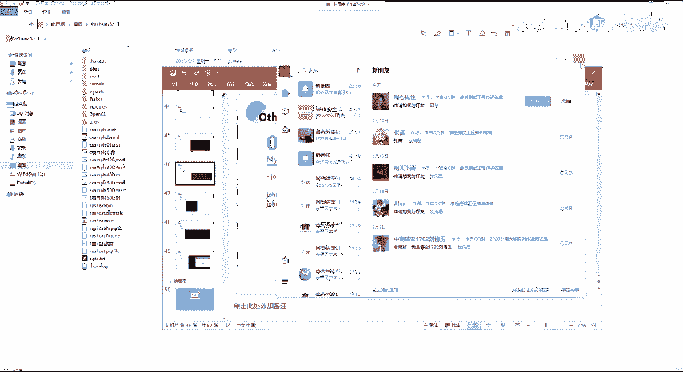

还有21位同学在。呃，大家对今天的一个内容的话，有没有什么疑问？

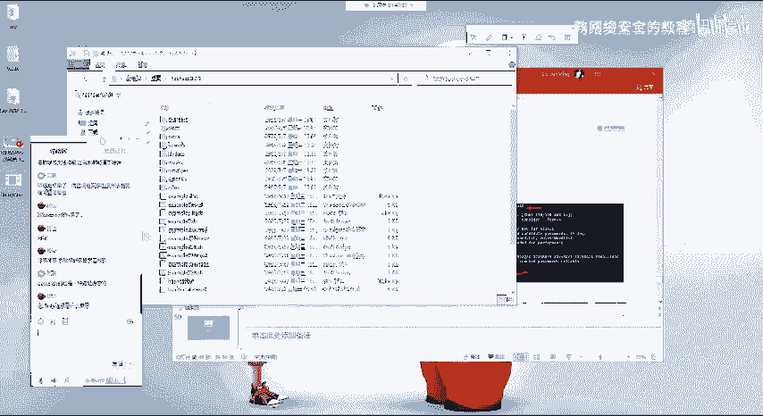

呃，因为后面的话就是后面这些的话。

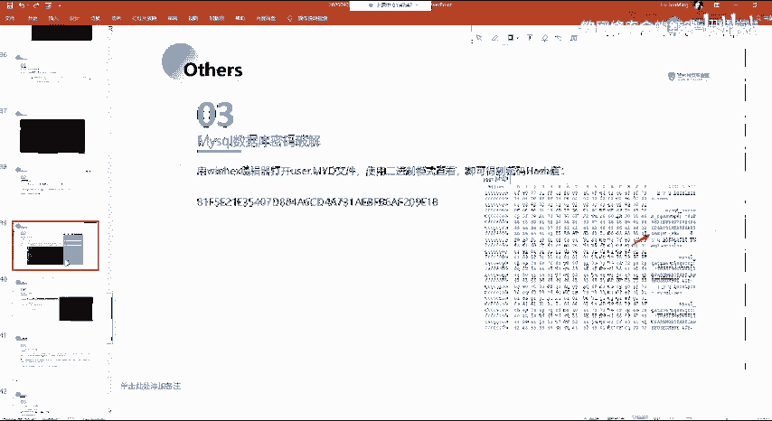

后面这些的话我没有一一一的去进行一个操作。因为每一个操作的话可能。

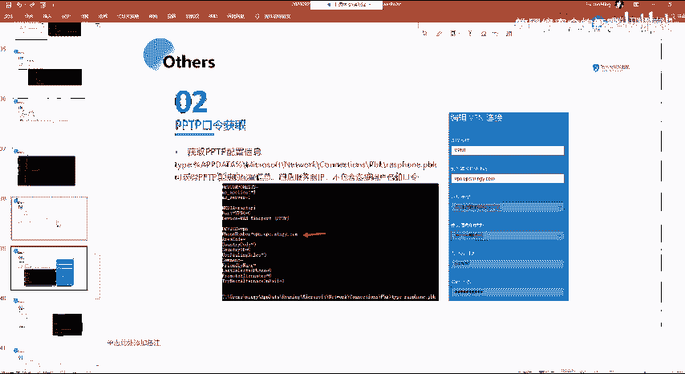

诶得翻。一两个小时才能搞完啊。

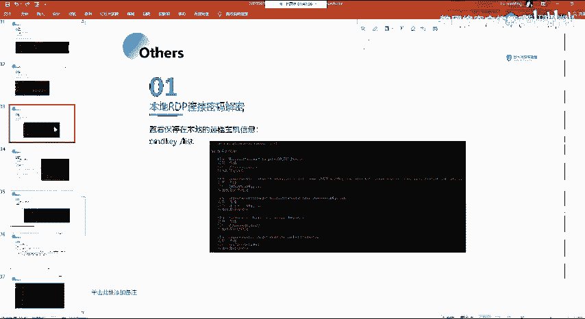

然后因为我这边PP的话已经很详细了呀，就是包括步骤啊以及截图，对吧？所以的话这一些操作步骤的话呃。我就稍微省略了呀。嗯就挑了一些。

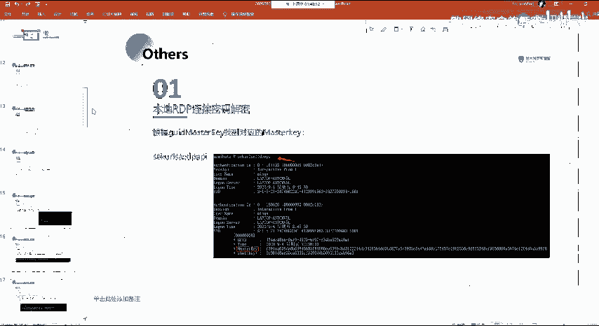

重点的一些东西的话给大家演示了啊。

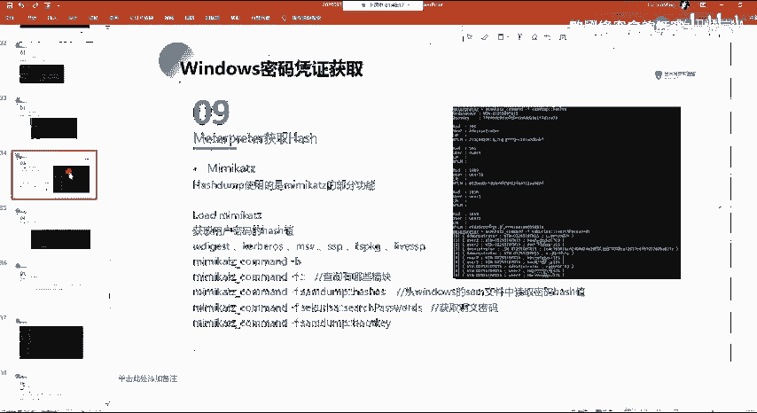

然后剩下的这些东西我们要去演示的话，就留给大家自己课后去进行一个操作啊，反正PPT的话也会也会给大家相关的一些东西的话，都在PPT上面以及还有预习内容。

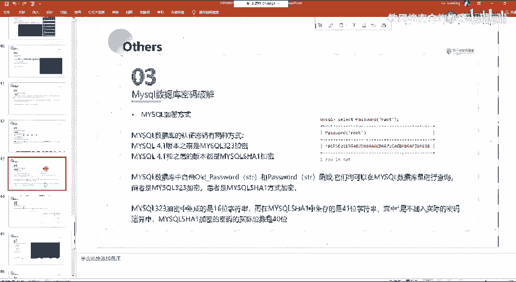

呃，讲的太详细了，就是呃讲的太详细，是你觉得好还是？不好。🤧嗯。好，对吧。嗯，好的话，那就行。虽然讲的确实有点累啊，说实话可能你们听着也累，但是。但是我但是其实讲课的人才是最累的，你们只要听就好了。

当的话呃，其实主要目的还是就是让大家能够去。就是把我这边的一些内容都能够理解。就讲详细的话，其实我也可以就是说就是稍微的过一下。但是可能很多东西的话，我不讲的话，因为。

我不清楚大家就是说对这些东西有没有接触过，就一我觉得应该就大部分同学都都没有接触过吧，是吧？所以说很多很多的一些东西你可能都没有一个什么概念，都没有这样子的一个概念。

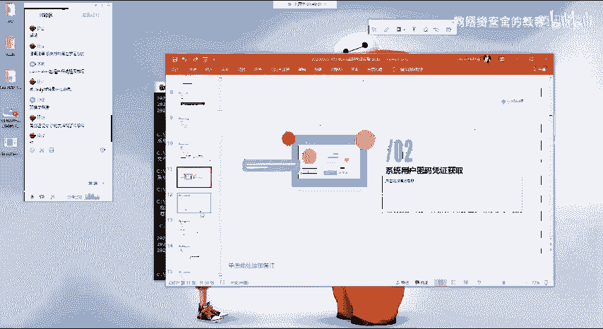

有话呃。就不让大家能够听懂的话，就是可能。我这边就尽力吧就尽力能够讲讲细一点，就是把我觉得就是大家可能会有疑问或者是说呃。可能需要去给大家解释的一些东西都给大家有做解释，好吧。🤧嗯。啊诶。

给大家一分钟的时间就提问吧。如果没有问题的话，就下课了。然后呃今天又。今天又又又又加班了。要加班了。一节课。阿咪。3个小时呃，没有吧，没有3个小时吧。辛苦的话辛苦的话也说不上嘛嗯。都是为人民服务。哎。

都是为你们服务是。啊呃，没问题的话，给我送朵花吧。好吧，有问题的话直接提，然后我就。没有问题的话，我就下了。然后大家也早点休息，就是就是大家。自己在课后的一个时间多去操作一下，好吧。因。

这个东西你不自己去操作的话，你看我讲，或者说你就看我PPT，你可能觉得哎就就就这一条命令对吧？这一条命令就出来了。但是呃。你可能你看的话，你没有你自己操作那么体会那么深。而且容易忘记。好的。

都没有问题啊。我们一般我们一般如果不讲课的话，一般下下班就可能。啊，不会很关注群里啊什么的，单的话，你要发了的话，看到的话还是会回的。嗯。

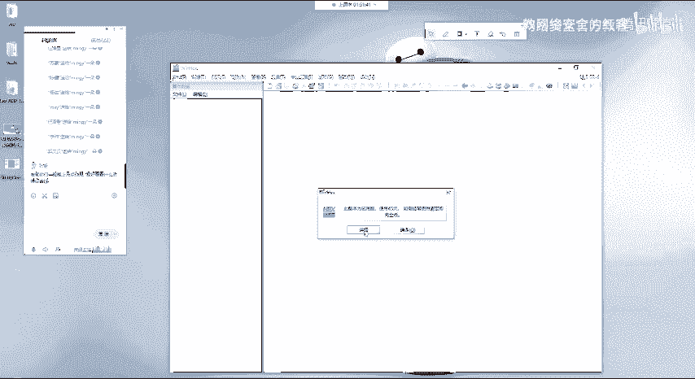

啊，毕竟下班时间的话，像其实我们晚上在这讲课其实也算加班了嘛，是吧？要加班给你们讲，你白天一样的也要上班然。一般呃就你就七八九点这种这种时候你问的话。看到了会回你是吧？要是再晚一点。

说不定就可能看到了也不会回。然后因为可能电脑什么的也关了，对吧？躺床上了，这个时候。嗯。就可能。也有可能就是已经睡着了，对吧？这个时候就互相都。啊体谅一下好吧。嗯。然然的话尽量的话看到了会回你了。好。

都没有没有没有问题的话，我就就不多说了呀。就大家早点休息吧嗯。