# 2024网络安全系统教程！清华大佬花159小时讲完的网络安全系统课！别再盲目自学了，学完即可就业！零基础入门网络安全！（渗透测试／漏洞挖掘／CTF／黑客技术） - P43：30.Volume Shadow Copy.mp4 - 教网络安全的红客 - BV1ft421A7Nj

呃，本节课的话主要有这三部分的一个内容。第一部分的话就是呃应该是说前具体来说的话就只有两部分啊。就前面的一二部分的话，就是说呃给大家介绍我们如何去获取域内的这样子的一个呃所有的这样子的一些密码凭证。

以及他的一个哈希。前面的一二部分都是呃获取域内的一个密码凭证的一一些方法。然后第三个的话，也就是第二部分的话。

就是我们如何去解密我们获取的这样子的1个NTDS点DIT的这个文件里面的一个啊域内的就存储的域内的一个用户的一个密码哈希。首先第一部分呃，这一个wem需 copy。也就是呃USSC。然后再讲这个的话。

我们先来呃提前了解一下，就是说活活动目录活动目录数据库。呃，什么是活动目录数据库呢？就是这1个NTDS点DIT的这样子的一个文件。这个文件的话就叫呃活动目录数据库，也叫就AD database嘛。

就AD的话就是我们的一个activity director，也就是我们呃之前讲的那个呃活活动目录。然后这一个数据库的话，它包括有关域用户组，还有主成员身份等等的这样子的一些信息。

以及包括域中所有用户的一个密码的一个哈希值，它都包括在这样子的一个文件当中，然后我们知道就我们前面在给大家讲域的时候，以及讲工作组的一个区别的时候，对吧？有给大家介绍，就是说在工作组当中的话。

我们的一个主机的一个密码的一个信息，它是存储在我们的一个sam文件当中，对吧？就是说在我们的一个啊就是sstem root。在我们的一个就是呃系统那个安装目录下面的一个config。下面有一个。

sam文件这个文件的话，它就是存储着我们的啊工作组，也就是我们本地计算机的这样子的一个。用户的一个哈希密码哈希对吧？然后我们也要讲，就是说我们通过mini cards来去获取，来去获取我们的。

一个密码的一个哈希值的话，它就是通过在我们的这一个sam文件当中去读取，去解密它的一个呃哈希值。然后在这边域的话呃也有介绍，就是说在域域在域内的话，我们所有用户的一个就是说在域内当中的所有主机。

它的一个呃密码，用户密码。它都是存放在我们的一个存放在我们的一个预控上面的。然后在这一个预控上面的话，它就有这样子的一个文件，也就是存储着我们所有域中用户的一个密码哈希。

然后的话呃为了保护我们的一个密码哈希值。我们。就是说windows系统的话，它会使用存储在这样子的一个stem注册表配置单元当中的一个密钥。对来去对这一个哈希值进行一个加密。也就是说。

存储在这样子的一个s姆文件，以及这1个NTDSDIT的这样子的一个文件当中的一个哈希值，它是会使用这样子的一个stem注册表当中的一个密钥来去进行一个加密的。因此的话。

我们呃要去破解我们的一个sam文件，以及我们这里讲到的这个NTDSDIT文件的话，都需要拥有这样子的一个st文件。这个stem文件的话，它是跟我们的一个sam文件，它是存放在同样的一个目录下面的。

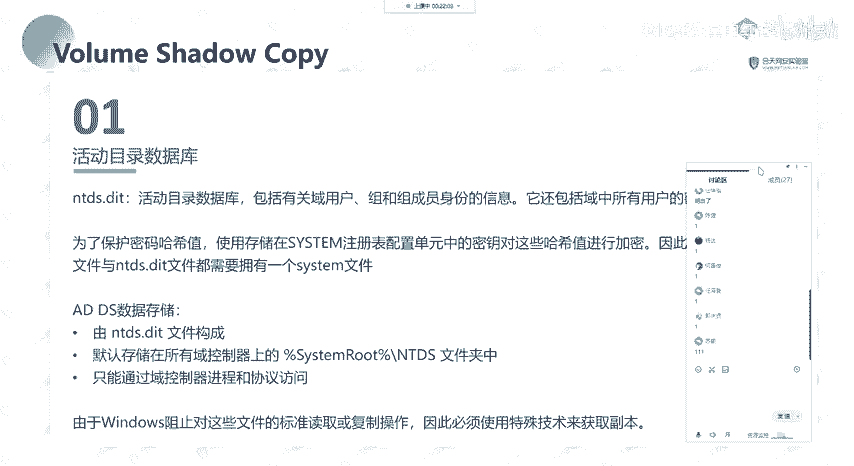

我们来看一下吧。

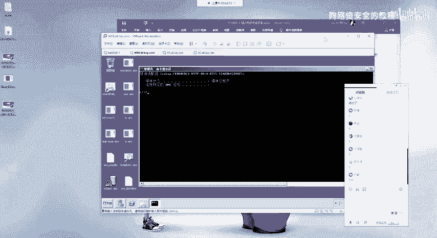

可以这一个机器。

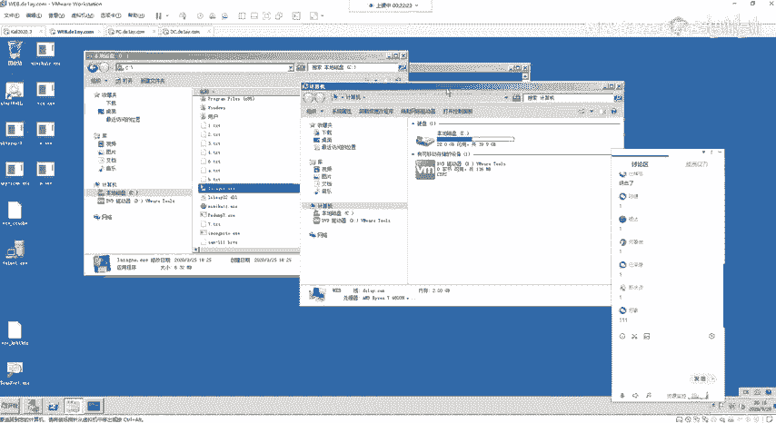

呃，它所s文件它所存放的一个目录的话，就是在我们的一个系统的一个安装目录，也就是在我们的一个windows目录，就是一般的一般的一个windows系统的话，它都是会装在C盘，对吧？

然后的话它的一个sstem root的这样子的一个呃路径的话就是这一个C windows。然后在这个windows上面的话，有这样子的一个空tri的一个文件夹。喂。啊，不是是有一个sst。S32呀。啊。

不好意思，我这边绕了，就是啊window目录下面显32。目录下面有一个config这样子的一个文件夹。这个文件夹下面的话就有这样子的一些文件，有一个sam文件以及stem文件。

这两个文件也就是我们啊所需要的。首先这一个sm文件的话，就存储我们的一个本地的这样子的一个呃用户密用户密码的一个哈希，对吧？然后这个stem文件的话。

就是我们所需要的一个要去解密这个sm文件里面的一个呃密钥的这样子的一个呃文件。呃，具体的一个文件的一个位置啊，就是这三个文件。我们呃经常会去用到的这三个文件的一个位置啊。然后在这边呃说一下。

就是这个stem root，这个的话就是我们的一个系统的一个安装目录。像比如说。

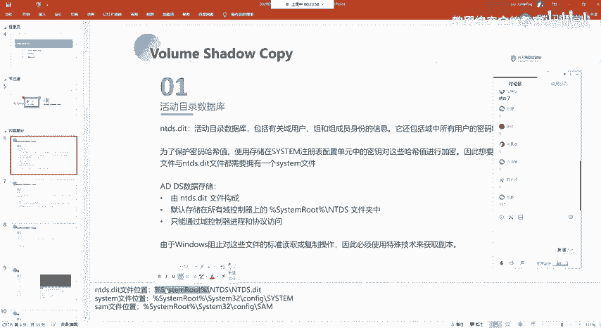

比如说我本机对吧？我本机的话。我想要去查看我的一个系统的一个安装目录，我们可以通过这里apple这一个。呃，两个百分号包括包裹的这个stemroot。然后apple一下输出的话。

它就会输出这样子的一个目录。这个目录的话就是我的一个系统的一个安装目录，也就是C windows。

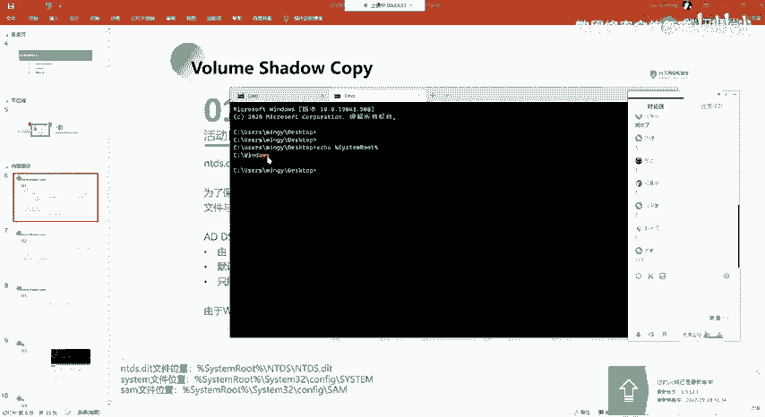

然后呃还有这一个文件，我们来也来看一下吧。windows下面有一个。NTD S。Yeah。

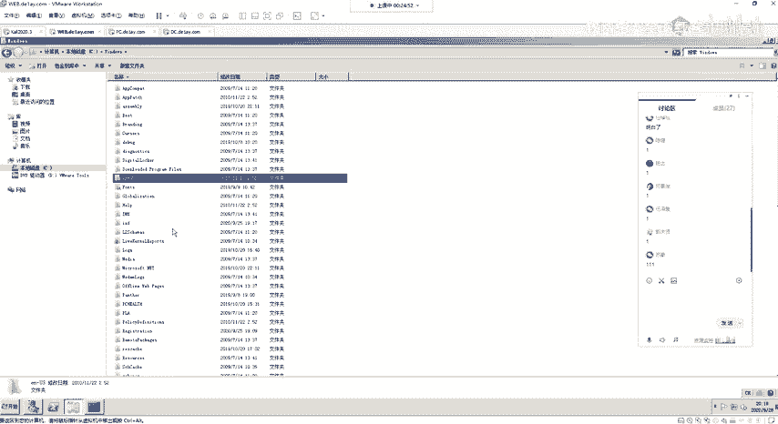

哦，这个的话要在预控上面去看。呃，这个的话要去预控上面去看。

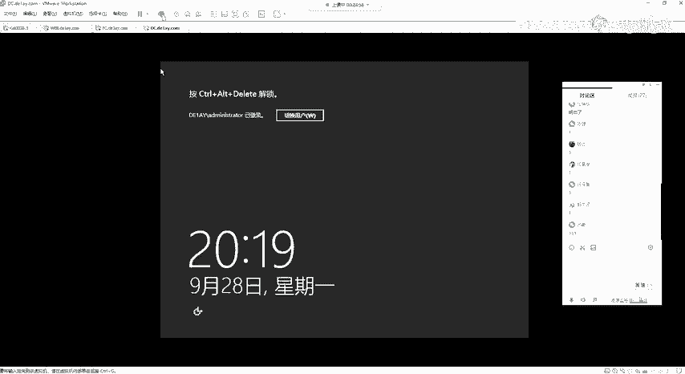

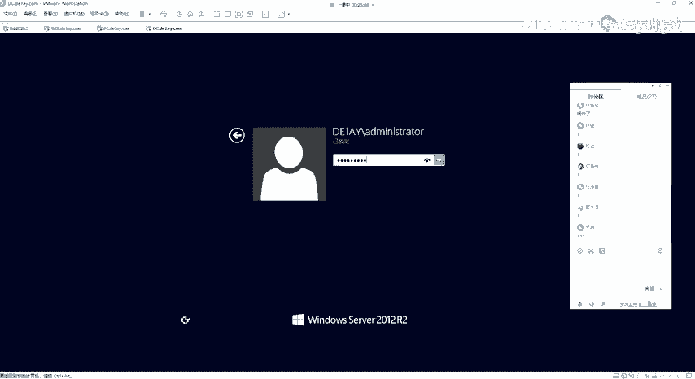

因为呃因为这1个NTDDS的话，这一个是它是一个呃活动目录数据库，对吧？所以说它只存在于啊有AD的这样子的一个，也就是在我们的一个预控上面，它才存在，对吧？因为我们的一个用户密码信息的话。

它都是存放在我们的一个预控上面的。嗯。然后是在C盘windows下面的话，有一个。有一个这样子的一个文件夹，NTDS这一个文件夹下面的话就有这样子的一个文件。

NTDS点GIT这个文件的话就是里面它存放着我们的呃所有的一个密码哈希，就域域内当中的所有用户的一个密码哈希，它都存放在这一个文件当中。

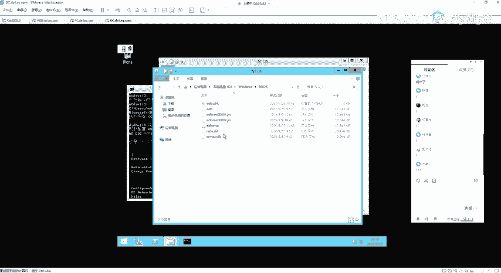

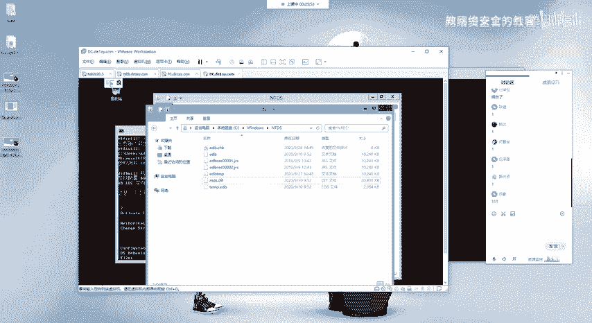

然呃。这边的话。大概了解一下，就是ADDS的一个数据存储。啊，我这边的话列了这三点，就是呃它是由这样子的一个文件构成。就是我们的一个密码信息的话，它都存放在这个文件当中。

然后它是默认存储在预控制器上的这样子的一个文件夹当中。然后以及他只能够通过预控制器的一个进程和协议来去访问。也就是说呃，你只有是是预控，你才能够去访问这样子的一个文件。然后呃由于windows的话。

它会阻止对这一些文件的一个就标准的一个读取，还有复制的一个操作。所以的话我们必须去使用一些特殊的一个技术来去获取到这样子的一个文件。这这句话怎么理解呢？就说大家可能会想对吧？

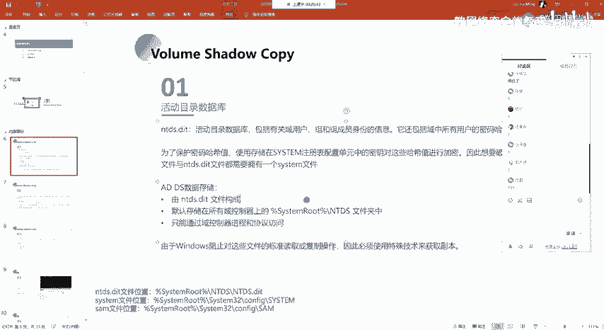

我这边的话我这边的话已经就比如说我得到了这一个预控的一个权限，对吧？我想要得到所有域域内所有域域内用户的一个密码哈希，那么我就需要获取到这个文件来去进行一个解密，对吧？那么我去解密的话。

我不是直接就能够去得到这个文件吗？对吧？但是问题的话就是。呃，在这边的话我们可以看一下，比如说我得到了他一个权限，我想要得到这个文件，然后我去进行一个。比如说我把它复制，我把它复制出来，是吧？

比如说我要去进行一个移动，就说。他这边的话它是不允许的，他会有这样子的一个，就是说这个文件的话已经被打开，也就是被占用了。然后的话，windows系统的话，对于这种文件。

它是你是不允许去进行一个呃复制读取的。以及你要去查看的话。也是看看不了的。所以的话我们。怎么去获取到这样子的一个文件里面的一个密码哈希呢？也就是我们本节课要给大家介绍的这样子的一些方法。

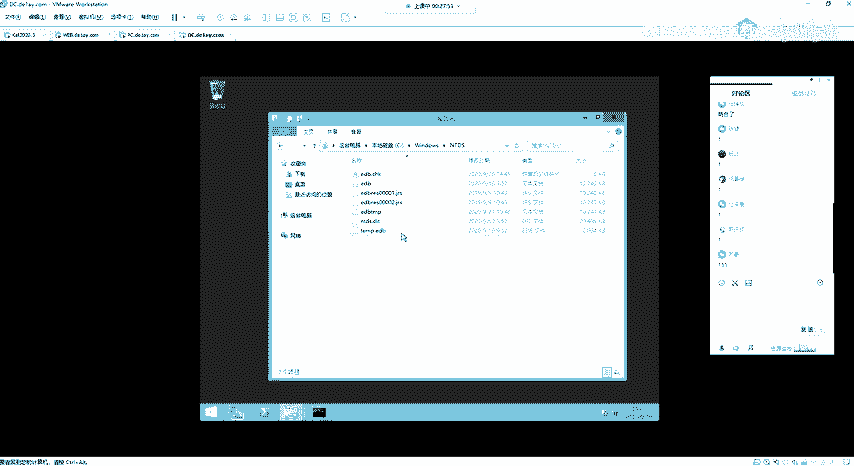

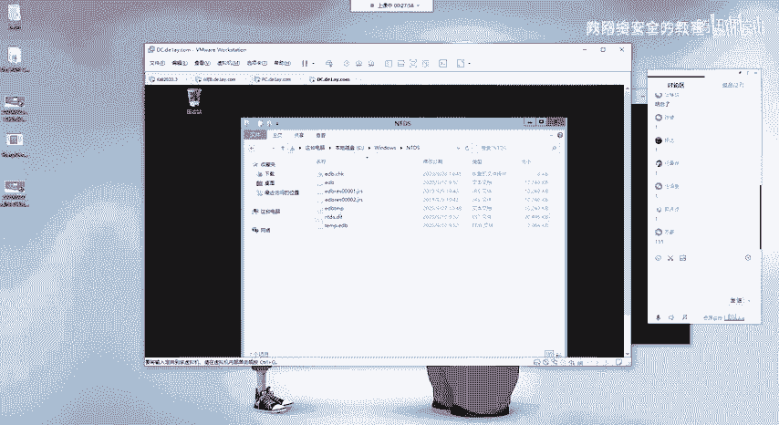

好呃，第一个第一个的话第一个方法的话呃，不是就是说第一类啊，第一类的一个方法就是用这一个rener需的 copypy service。这个的话它是一个就是windows系统上面的一个服务框架。

他这个框架的话就是一个呃卷演的一个卷眼复制的一个服务。就run了么的话就是卷嘛，就是这一个。需要的话就是演嘛， copypy的话就是复制嘛，卷眼复制sy时的话就是服务。嗯啊呃。

这一个的话就是利用的这一个服务啊。Thank。然后呃我们大概来了解一下这一个服务，它是它是一个什么东西，以及它有什么作用。呃，这个服务的话呢是用于一个数据备份的。

以及它是呃支持就是window122003以上的一个操作系统。然后的话呃它是系统默认，它会在特定的一个条件下，它会自动的去创建我们的一个数据备份。然后使用的话就是这样子的一个服务。以及呃这个服务的话呃。

它是会就是默认它是会开启的。就是如果禁用了的话，它会影响很多的一影响系统的一个正常使用。好呃下面的话就是介绍一些方法。这些方法的话其实就是呃它自带的一些工具。以及呃一些外部的一些工具。

我们利用这些工具它所利用的一个原理的话，它其实就是啊利用的这1个BSBSS的这样子的一个服务。好，首先第一个就是这个NTDSUTIL这样子的一个呃程序。这个程序的话。

它是一个呃就是我们的1个AD就是活动目录提供管理设施的一个命令行工具。就预环境的话，它是默认安装的。就说它是一个管理我们的1个AD的一个呃命令行的一个工具。以及他支持的一些系统，就是呃2003以上的嘛。

都都都能够支持。好，呃下面的话就具体来看一下我们如何去使用这样子的一个工具来去进行一个呃获取这样子的一个呃我们想要的这个NTD呃，就是这个活动目的一个数据库，也就是这个文件。嗯。呃。

首先第一个就是呃交互式的。啊，其实这个交互室的话，其实就是要就是让大家就是理解我们使用这一个命令函的话，它的一个步骤。就一般通常的话呃。一般通常的话会使用后面的这种非交互式，对吧？

就我们比如说我们在CS上面，我们得到，我们能够去执行命令。那么我们执行的话呃，不可能是说有这样子的一个交互式的一个环境。我们都是通过就一条命令执行之后的话返回结果，对吧？哦呃，交布式的话，我们来看一下。

就它的一个流程，就我们如何去进一个利用。呃，这边的话看一下这边的一个截图啊，其实它的一个使用的话比较简单。就我们直接呃执行在我们的ex个c上面执行。执行之后的话呃，输入这样子的1个SNAP shot。

这个SSNAP shot的话就是一个快照的一个意思。然后的话呃，执行这一个active install instance NTDS也就是启动一个这样子的一个NTDS的一个实例。

就设置就是设置我们的一个呃活动实力的话，为这1个NTDS然后。呃，输入一个create，也就是创建对吧？然后创建一个快照。创建快照之后的话，它这边它会返回这样子的一个呃GUID。

也就是这一个这1个ID值。这个ID值的话，我们这个ID值的话，它就是一个我们这边创建的一个快照的1个ID。然后这边的一个快照的一个ID的话，我们通过这样子一个mount的一个命令来去进行一个挂载。

就这一个mount的话，如果大家呃就是呃使用linux的话，应该比较熟悉，对吧？我们经常会去使用到这样子的一个命令，我们要在linux上面，比如说要插个U盘，对吧？要去挂挂一块硬盘。

都会去使用到这样子的一个mount命令来去进行一个呃磁盘的一个挂载，对吧？然后呃我们挂载之后的话，它就会呃返回到返回给我们这样子的一个路径。

这一个路径的话就是我们这边的一个生成的这个快照的一个呃可访问的这样子一个路径。就是说我们在这边挂载的话，它会挂载到我挂载到我们的一个文件管理器当中，也就是在我们的一个呃C盘下面。然后的话。

快子快子的话就是退出。以及呃我们就是说。呃。这边关于这个。按以及 delay的话，我们先来就是看一下我这边的一个操作吧。

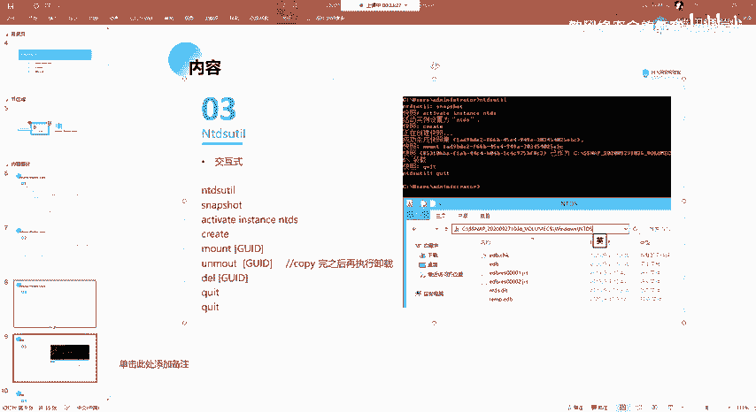

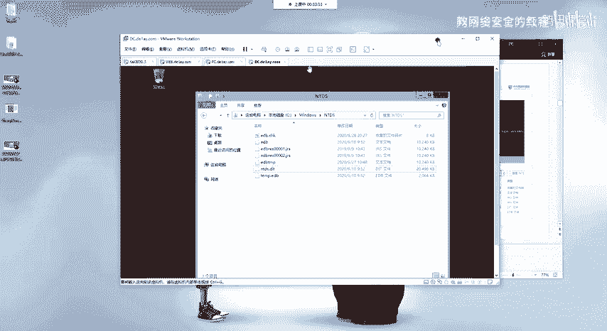

然呃大家有环境的，也可以就是跟着我来去进行一个操作。

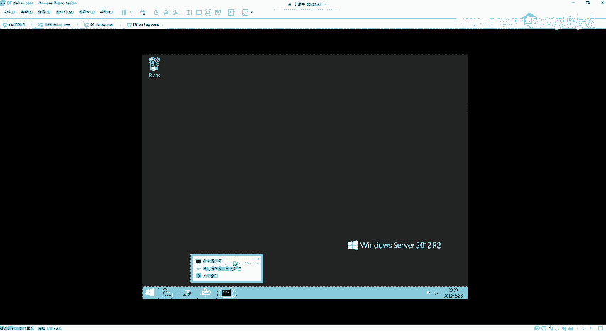

然呃。所以的话呃直接在CMD上面执行这样子的一个命令函。😊，这个。😔，看下。直接执行之后的话，我们输入1个SNAP shot，也就是创建一个快照。创建快照的话，我们呃需要去启动我们的一个实力。VI。

然后的话设置好之后的话，我们create来去进行一个快快照的一个创建。创建好之后的话，它会返回这样子的1个GUID的一个值。然 the话。我们需要去挂的。呃，在挂载之前的话，我们先来看一下，就是C盘。

C盘目录的话是这样子的一些文件，对吧？哦，我们。来去进行一个挂载。挂载之后的话，可以看到它在这边它是就是说快照已经就是挂载到了这样子的一个路径下面。然后这个时候的话我们可以来看一下。

在我们的1个C盘下面的话，就多了这样子的一个文件夹。这个的话其实是一个文件夹，就它是挂载到了我们这边的一个C盘下面。然后我们双击的话可以打开。然后其实你打开之后的话，你会发现啊。你会发现你打开之后的话。

它这里面的一个文件跟我们C盘下面的一个文件内容，它是完全一样的。就是说就是说它的这样子的一个功能的话，它就是把我们那个C盘，它打了一个快照，就像我们EM。呃。也不是就是做了一个备份一样的对吧？

就是把这一个东西把它给啊备份到了这一个目录下面。然后我们在这边的话呃，已经装载装载好了，对吧？装载好了之后的话。我们在这一个文件夹下面的话，我们就可以去找到有这样子的一个windows的一个目录，对吧？

以及我们对一个。sstem32的一个目录对吧？以及confi。然后在这个目录下面的话，就是有我们所需要的这样子的一个文件，对吧？就比如说s文件以及stem文件。这个时候的话我们就可以去做一个复制，对吧？

以及。呃，我们的1个NTDS。刚刚的话刚刚我有去做一个复制以及移动的话，是不允许的对吧？然后现在的话我们直接。拖直接复制复制之后的话，可以看到这边呢我们所需要的三个文件。

就存放着我们的啊域内的所有用户以及本地的这样子的一个用户的一个密码。哈希的文件，我们都获取到了。没的话打不开。对吧而呃在我们命令函上面去操作的话，就是说。我们这边的话已经创建了这样子的一个快照，对吧？

然后这个时候的话我们就可以直接通过呃CMD的一个就是copy的一个面，对吧？通过 copy。呃，copy的一个路径的话，就是我们这边的这个。Yeah。这一个路径下面的一个windows。

这个路径下面的一个windows目录，下面的1个NTDS是吧？然后我们要复制的一个文件是NTDS的DIP这样子的一个文件。然后我们把它复制到，比如说复制到C盘下面呃1个NTDS。点击IT看一下。这里面。

把这些人面都删了。现在的话已经没有了。好，我们copy一下对吧？然后现在的话就能够去进行一个正常的一个复制以及移动，对吧？也就是获取到了我们的这样子的一个文件。

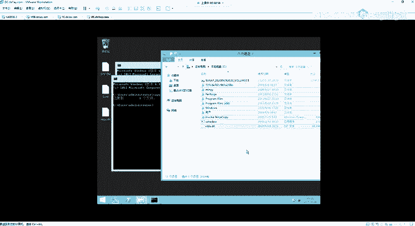

然，这里的话就是通过这个NTD呃。的这一个工具啊，这一个命令行的一个工具，然后通过交互式的一个方式来去得到这样子的一个东西啊。然后我们这边copy完之后，对吧？copy完之后的话。

这一个我们可以通过这样子的一个方式去进行一个卸载。

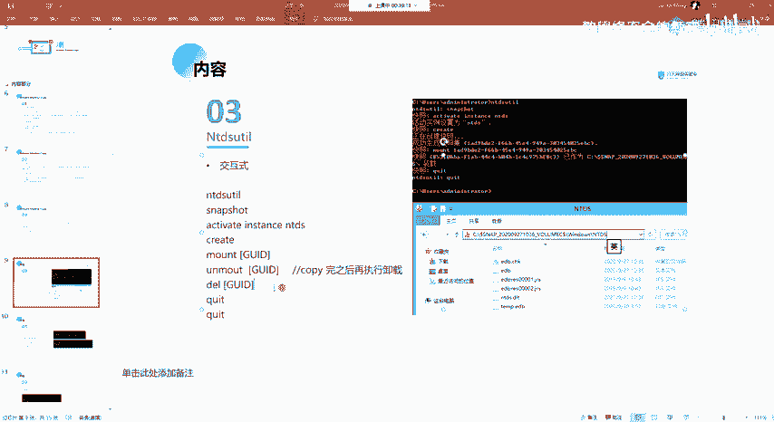

嗯。要通过阿慢。第。来去卸载我们的这里的一个快照。卸载完之后的话，我们再去做行进行一个删除。dlate这一个快照。然后的话我们。就可以退出。然，我们做了这样子的一些操作之后的话。

我们可以看到刚刚的这一个就是挂载的这一个快照的话就已经呃消失了。但是我们顺利的得到了这样子的呃这一个活动目录的一个数据库文件。

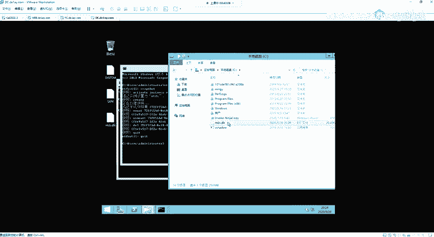

就是呃交互式的这个的话就是让大家就是理解他的这样子的一个过程以及步骤。而下面的话就是我们实际去用到的，就是通过这样子的一个非交互的一个方式。呃，其实他说呃说是说是非交付。

但是其实就是呃通过把我们的这样子的一个命令，就是一行一行的去进行一个呃，执行嘛，对吧？首先第一个的话就是呃第一个的一个步骤就是查询当前系统的一个快照。也就是说呃。这里的一个命令的话。

就是查询你当前系统啊，看是否有没有去创建一个快照。就这一个命令，它的一个就实际的一个意义是什么呢？就是说如果你的一个系统当中正好就是说呃已经有了创建好的一个快照，对吧？那么这个快照的话。

我们可以把它挂载到本地，就挂载挂载。通过挂载。挂载之后的话，我们就能够去进行一个访问里面的一个文件，对吧？那么这个时候如果说是管理员，或者说啊这个系统的一个呃管理者，他创建了这个快照。

它是有就说以前的就包含了系统这个系统里面以前的一些文件等等的一些东西，对吧？那么我们从可以从这里的一些快照当中去获取到它系统以前的这样子的一些内容。

就呃可能会有呃相关的一些就是以前的一些敏感的一些信息等等的一些有价值的一些数据，对吧？然后呃具体的一个命令的话，就是通过这样子的，就直接NTDS呃SNAP shot然后list all。

然后快的快的话就是退出。对啊，他执行的一个结果的话就是这样子，就其实就是呃。我们把前面执行的一个命令，把它放到一行去进行一个执行就就就可以了。它就会返回相应的一个输出嘛，对吧？

以及呃还有可以通过这一个list来去进行一个列出啊。然后可以看可以看到在这边我截图这边的话，有创建了这样子的两个快照，对吧？以及有创建的一个时间。他都呃有有列出来。然呃第二个的话创建快照的一个命令的话。

就是就其实就是我们前面的这边的一个步骤嘛，对吧？就我直接执行之后的话来去进行一个呃，把前面的一个命令，把它放到一行。然后create来去创建一个快照。创建快照的话呃，这边的命令执行之后的话。

它就会返回我们所需要的这样子的一个快照的一个GUID对吧？然后的话我们就可以来去进行一个mount的一个挂载，就mount挂载这样子的一个GUID。挂载之后的话。

我们就能够去啊copy里面的啊就是copy这边的一个挂载的一个。目录下面的一个文件。来去呃复制里面的一个文件。然后我们复制完之后的话，我们就做一个卸载，就使用这个man。然后卸载之后的话。

注意把这一个快照给删除掉啊，就不留下。不不留下这样子的一些记录。

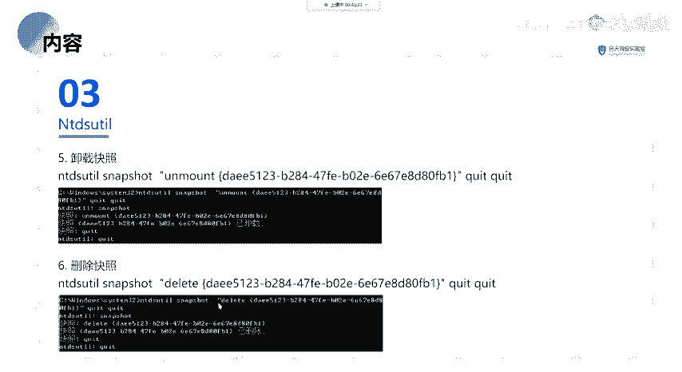

然呃这边的话就是第一种的一个方法。然后后面的话呃下面的话还有第二种了。第二种的话，这一个的话就比较比前面的话要呃简单很多。嗯。就前面的话呃前面的一个步骤的话比较多啊。

然后这一个的话只需要这样子的一条命令，就只有这几个步骤，就能够把所有的一个呃东西都给呃。都给做好，我们来看一下呃，前面的两条面的话都是一样的呃，不同的一个地方就是这这里我们输入这个IFM。

然后输入之后的话，我们输入这个create forcre for，然后的话接我们呃的一个就是指定的一个路径。我这边的话呃，具体来看这个截图吧。因我这边的话create for呃指定的一个路径的话。

就是C下面的1个MNGY这样子的一个文件夹，对吧？然后我们在这边指定之后的话，它就会去创建快照。创建快照的话，它会自动的去做一个挂载。就是他创建好快照之后，他会呃返回这样子1个GID对吧？

然后的话它会自动的挂载到这样子的一个路径下面。挂载之后的话，它会呃去进行一个快照的一个装载。以及他会把我们这边的一个就是数据库。的这样子的一个文件。

他会把它给就是放到就复制到我们这边的一个指定的这个呃文件夹下面。我们可以看到他在这边的话有复制，就是呃sstem以及security以及我们的一个这边的1个NTDS点DIT的这样子的一个文件。

然后的话它会自动的放到这样子的一个文件夹下面。嗯。

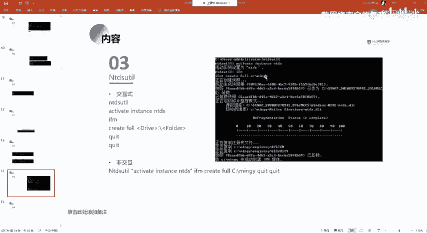

然后我们可以来看一下我这边。呃。这个的话就是其这个的话就是我之前执行的呀。可以看到在这边的话，他就有这样子的一个文件。他把这样子的1个NTDS，还有我们注册表当中的我们所需要的一个stem。就是。

你这一个文件也给他获取下来了。呃，你演示一下吧，这边的话先把这个删掉。

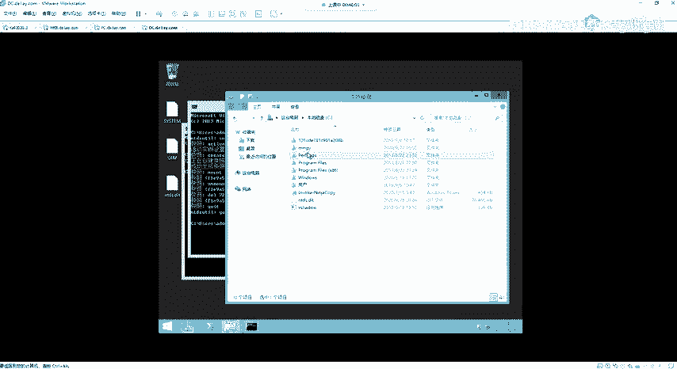

不直。呃，因为这里不能复制啊，我手敲一遍吧。

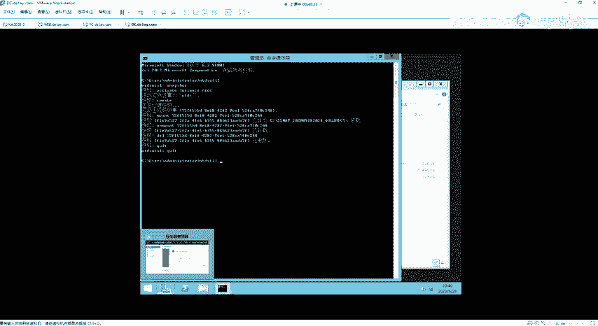

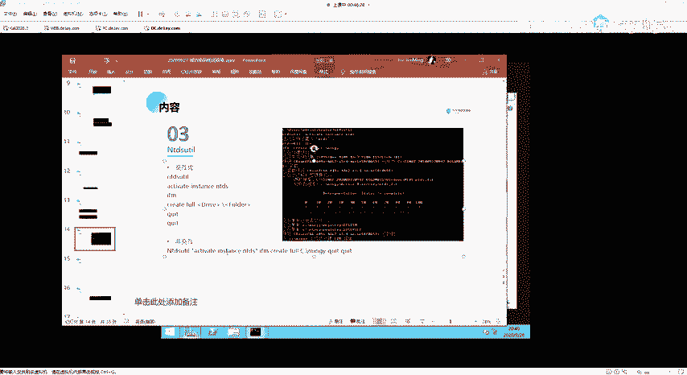

是听。Good人的。明天点。然呃，注意就是。就你一条命令的话咦。

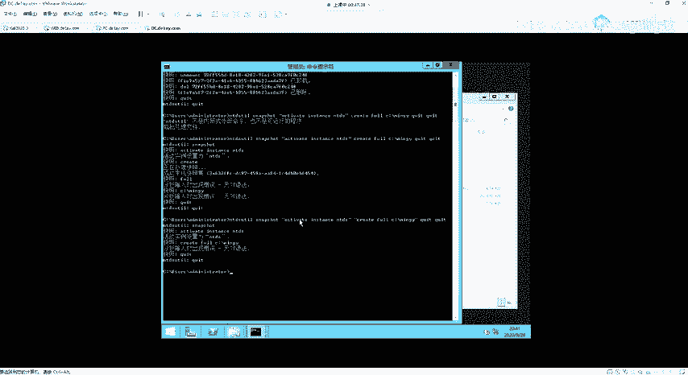

写错了吗？我看一下。Yeah。

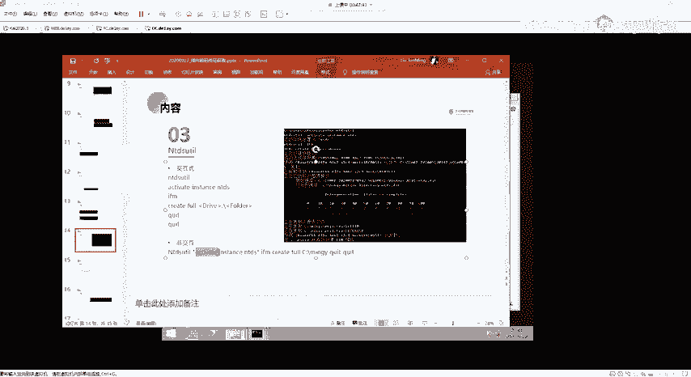

好。少了1个ISFM。

没写错啊。下呢天。还没图。😔。

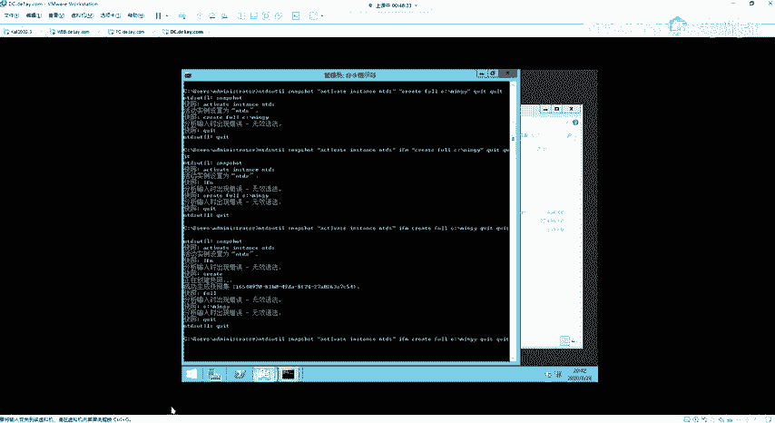

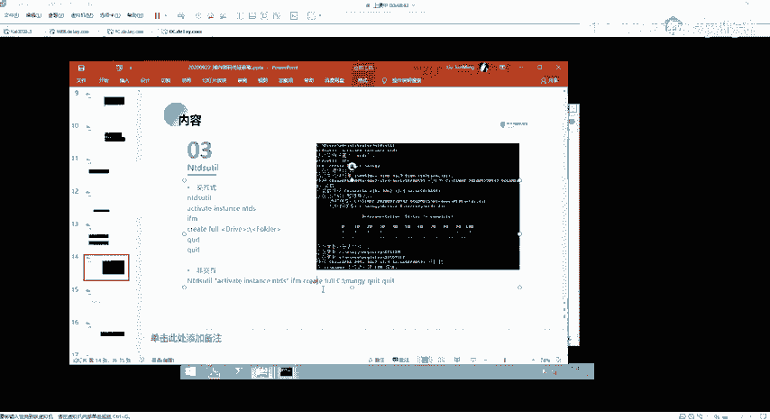

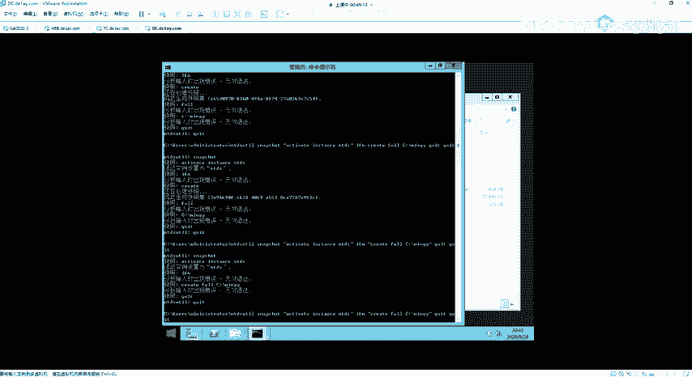

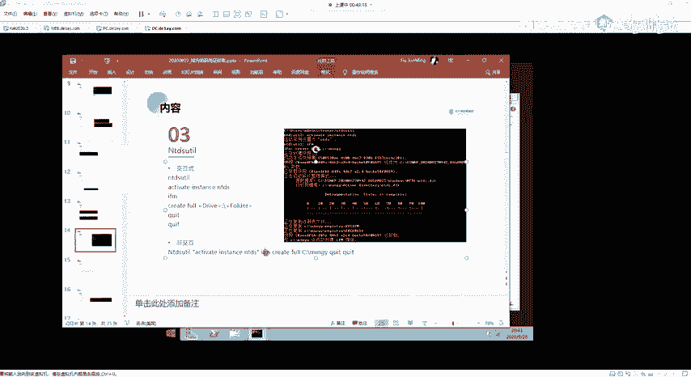

没有这一个。没有这1个SNAP啊。就直接呃直接进入这个IFM不是进入SNAP的一个快照。然后在这边的话，执行之后的话，它就会有这样子的一个自动的一个呃生成快照。然后的话自动挂载。

然后的话读取里面的一个文件。读取之后的话，它会保存到你指定的一个目录下面，也是也就是在这边MIGY对吧？然后这边的话就是我们想要的一个文件。

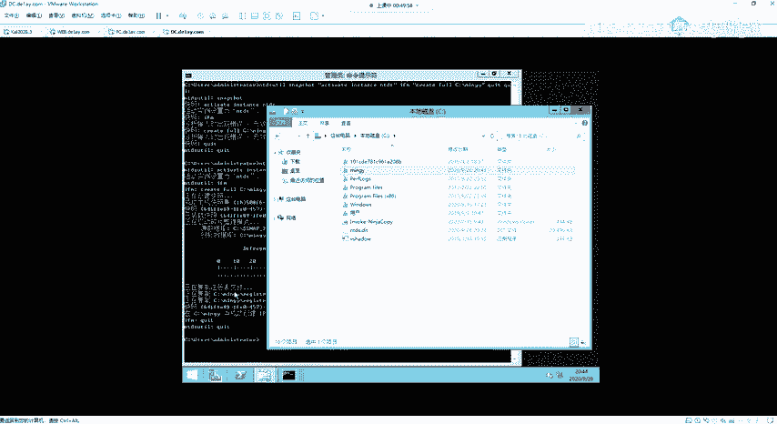

呃，大家对这里的。

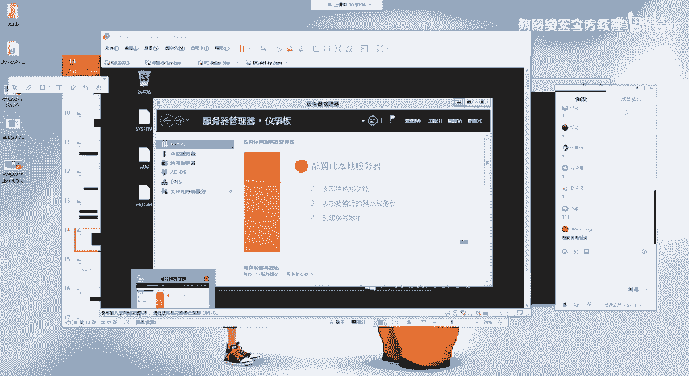

大家对这一块内容有有疑问吗？应该没有什么问题啊。应该没有问题吧。那个sam怎么了？您说呃那个s姆文件没那个吗？呃，我们这边的话我们这边的话只需要这1个NTDS点DIT就可以了呀。

就是这里的这一个文件的话，就是已经包括了域内的所有用户的一个呃一个那个密码的一个哈希嘛，对吧？然后的话那个萨姆文件的话就是说是你的一个本地的一个工作组，对吧？就你工作组的话。

其实就用不到这样子的一个工具啊，也而且也没有这样子的一个工具啊，这样子的一个命令。就其实我们只需要这1个NTDS点GIT以及那个stem那个文件就能够去做做一个解密了，能理解吗？

因为这一个文件里面就存放着所有的一个密码的一个哈希值了。好呃，下面的话就是这个VSVSSI的命。这个VSSR的面的话，它呃同样的是。这样子的一个就是我们前面所说的这个卷影复制服务的一个管理工具。

然后他也是预环建一个默认安装的。嗯。然后我们一起来大概了解一下，就是说关于这个工具它的一个功能吧。呃，这边的话大家看一下吧，就其实我在预习内容的话已经也贴了，对吧？就如果大家有去预习的话。

应该能去大概的理解。啊就这里的话，它就是我们前面所说的所说到这个呃 copy server server的这个服务的一个管理工具嘛。

那么它同样的也是利用的这个VSS的一个服务来去进行一个呃卷影副本的一个呃创建以及啊以及。删除。然后他同样的也是通过这样子的一个工具来去就是呃创建快照。但是的话呃它的一个区别的话。

就是这边的一个创建快照的一个命令，它是不一样的。好。然后我们具体的一个使用步骤的话，就是呃同样的，我们可以通过这样子的一个list shoulders来去呃列出当前的一个就是呃当前系统下面所已经所创建的就已经创建好的这样子的一些快照。

然的话如果没有的话，我们可以通过这样子的一个命令。就是create干干货等于C。这里的一个干货等于C的话，就是说我们这边创建的一个快照的话，它会呃放到就是。啊。

就是给我们指定的这个C盘来去进行一个快照的一个创建。就是指定我们的个C盘。因为我们的个C盘的话，就是我们的一个windows的一个系统盘嘛，是吧？然后当然的话。

如果说你的一个系统盘的一个磁盘名不是C的话，那么你就啊就是你要找到你的那个系统盘的一个磁盘名。来去进行一个呃对应的一个修改。好吧。啊呃。具体的话我们看一下具体的一个效果，我们看一下这个截图啊。

就是呃在这边的话，执行这一个命令之后的话，他就会对这个C盘。做一个卷印副本，就生成一个快照，然后的话会返回这样子的1个ID以及我们副本的一个菌名。然后这个卷名的话就是我们。等会要用到的。

就是说这边的一个就是呃这一个副本卷名的话，其实就是呃我们可以去进行一个访问的，就相当于就是说。在这在前面这边对吧？我们呃生成了一个快照，生成快照之后的话，我们需要去把它挂载，挂载到一个目录下面，对吧？

然后的话我们才能够去进行一个访问在系统里面。然后在这边的话，它生成的这个绝影副本名的话，就是这样子的一个路径。这个路径的话，我们可以通过命令去进行一个访问。就我们可以通过啊copy，通过copy命令。

来去获取到这样子的一个就指定的这个目录下面的这一个我们所需要的这一个文件。然后的话呃 copypy到指定的一个目录下面。然的话呃，同样的就是我们创建好之后的话，我们需要做一个删除啊，就是。

删除这样子的一个创建的一个需要的这样子的一个卷有副本。49。

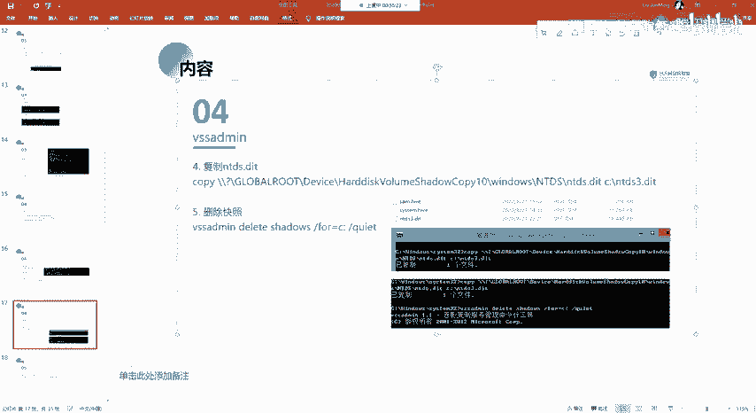

吓嗯。已经49了，然后呃我们休息5分钟吧。休息5分钟，然后我们再继续。

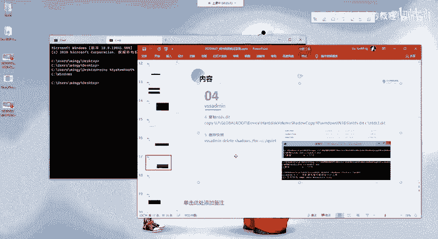

Yeah。你应该不是刚刚过来吧。我刚刚不是有给你解释吗？就是说我们对吧。

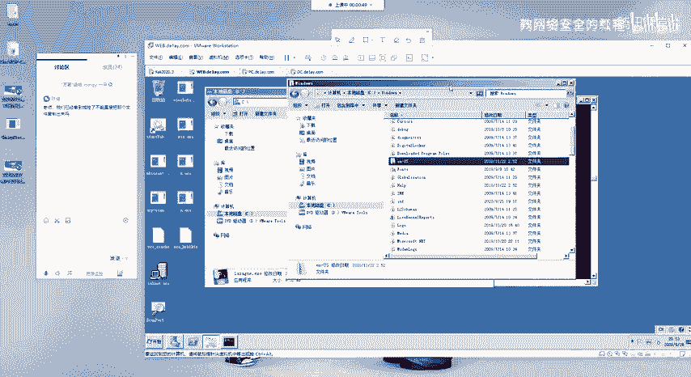

我们已经拿到了优控的一个权限，对吧？我们是不是能够直接去得到这个文件呢？你们可以看一下嘛。全码都叫我咩衫啊。对吧呃，这一个文件的话是在一个这一个目录下面，对吧？😊，我直接把它拖出来。

你会发现就是说你是无法对这个文件做一个操作的，以及你可以通过命令函的一个形式，对吧？你可自己试一下吧。就我同样的也用这样子的一个方式，用copy这个命令来去copy这个NTDS点击IT的这一个文件。

对吧？我把它放到C盘下面的这个MINGY这个。目录下面对吧？然后你会发现有这样子的一个错。就说这个文件它是正在使用的，因为这你的一个你的一个系统，你的一个你的一个。就是你的这个系统启动，启动之后的话。

你的这个服务，也就是你的这个活动目录数据库的话，它就会被被使用。

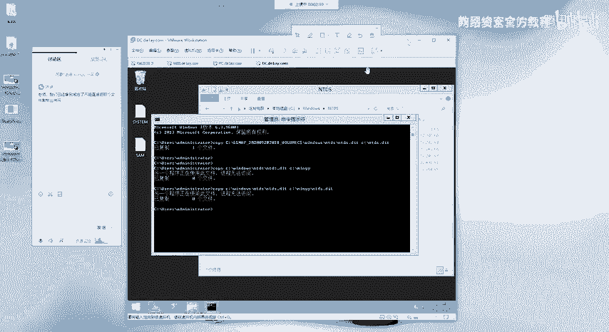

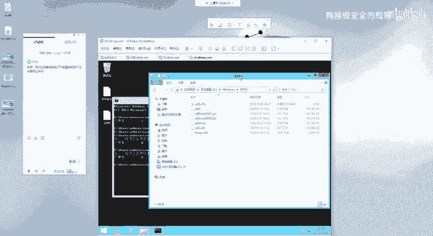

知道吧？那么你的这个文件的话，就是说你无法直接的去访问到的，也就是说无法对这个文件去进行一个操作。就我刚刚我在讲操作的之前的话，我就已经给给给大家解释了呀。应该是后面才过来的吧。嗯。你可以自己试一下嘛。

是吧？所以说我们才需要去用到这样子的一个方这样子的一些方法来去获取到这个文件。

嗯。好呃，我们继续。呃，这个的话应该不用我去操作了。其实。嗯，就呃照着就是我的1个PPT弄就可以了，就这几条命令。也是比较简单的，就跟他的一个原理的话，其实都是比较类似的，都是通过创建这样子的一个快照。

通过那个卷演服务。被个功能来去进行的一个利用。然呃，第五个的话就这一个VCR的这个VCR的话，它是一个指令行工具，就是它允许任何人去创建我们的这样子一个卷因拷贝。但是的话它系统默认它它是不支持的。

就我们需要在这样子的一个SDK中，就是windows的这一个呃开发者套件当中来去进行一个获取获取这个工具。嗯。不一首，喉咙。赌了一下。好，呃，我们需要在这样子的1个SDK当中去获取这一个工具。好呃。

这边的话其实。

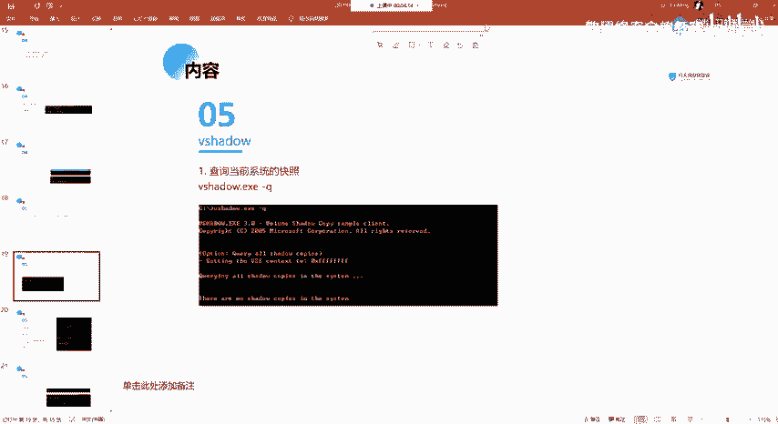

嗯。

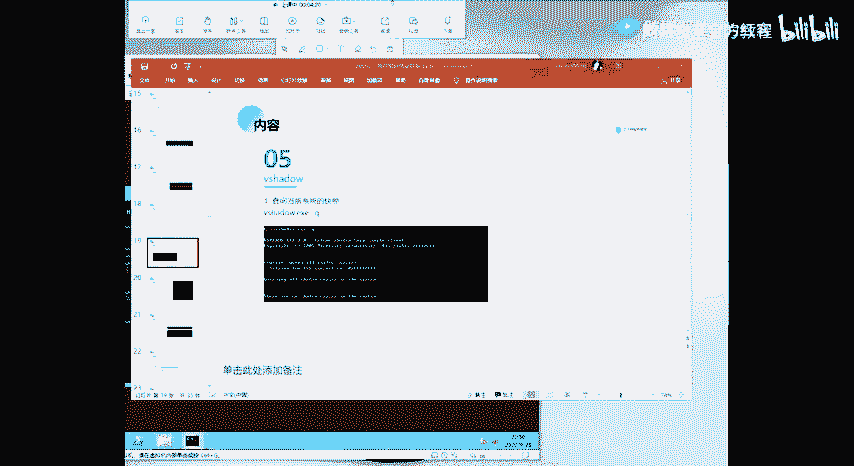

啥玩意？

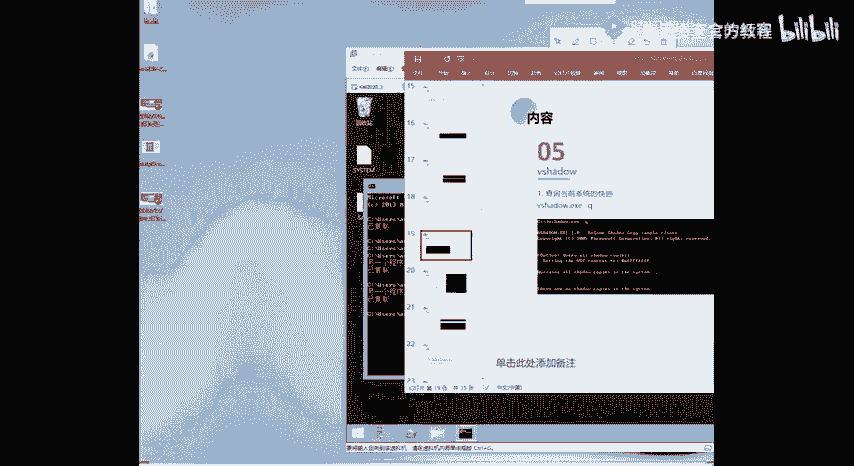

嗯。呃，这边的话。我这边的话已经有准备了，就是针对就是不同的一个系统的话，就是能够去使用的这样子的一个工具啊，就包括win10的，还有08呀、03的，还有XP的等等。

都这样子的一些一些系统的这样子的一个工具。然后我们可以利用这样子的一个工具来去进行一个卷影复背的卷影的一个拷贝。

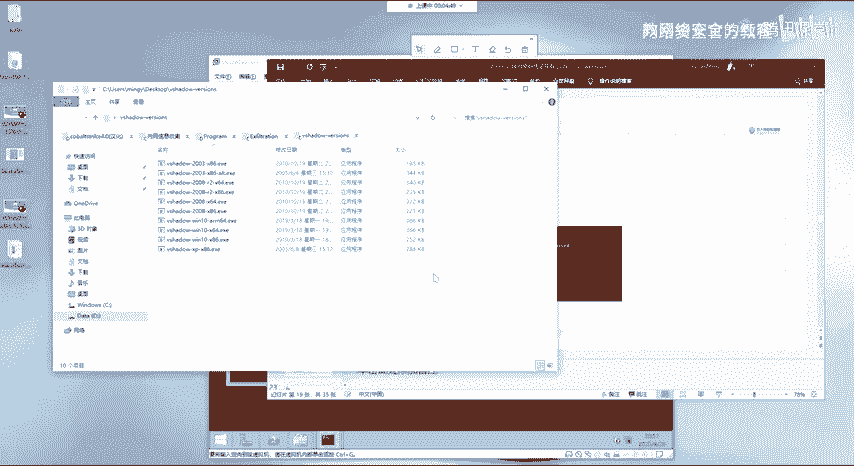

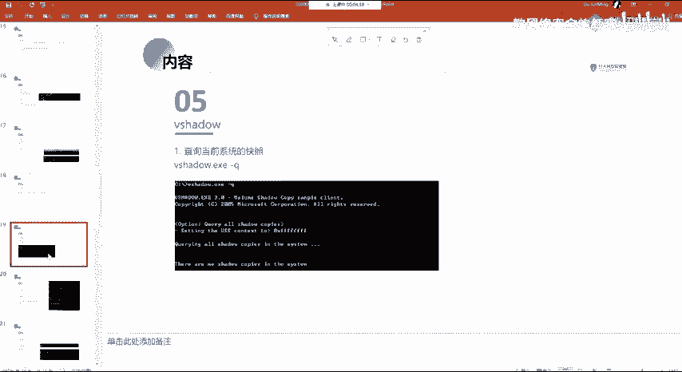

然后他具体的一个使用的话就是。呃，主要的话在这边。就是通过这样子的一个命令来去创建一个快走。哦呃他这边的话创建快照的话。我们主要的话要去呃就是获取的一个内容的话，就是在这边我标的这里的呃三个镜头。

以及这三个红框，也就是我们需要去获得这三三个内容。总这个话就是这一个快照的一个ID以及啊这个快照的一个s ID以及这个SNAP ID还有这一个呃 short copy device name。

也就是我们的这里的一个就是。均匀复制的一个名字。然后其实这里的一个名字的话，你会发现跟前面这边的这个工具，它得到的这一个啊name它其实是一样的就是。他的一个形式都是一样的。然后我们执行之后的话。

得到相应的这样子的一些内容。然后的话我们同就通同样的通过这样子的一个copy命令，就copy我们这边的这一个就这一个需的 copypy的一个dice name，也就是这里的这一个。

然的话卡片指典目录下面的这样子的一个文件是吧？哦呃，前面的这里的这前面的这两个的话，主要就是在后面这边我们去删除我们的一个快照的时候，说要需要到要需要用到这样子的ID。嗯。需要用到这样子的2个ID。

我们可以通过这两种方式来去就是指定对应的1个ID来去进行一个快照的一个删除。嗯。这是一个。然后呃具体的一个操作的话，我这边就不演示了。呃呃，第六个的话就是呃一些扩展。这边的一个扩展的话。

主要就是呃大家需要去了解的。就是我们再去调用这样子的1个VSS的一个服务的时候，它会产生相应的一个日志文件。就它是在这样子的一个sstem系统下面的。

它会有产生有这样子的一个even IDD的这样子的一个日志文件。然后。我们然后执行这样子的一个呃命令的话，就我们前面通过这样子的一个方式来去创建快照的话。

它会额外的产生这样子的一个就事件ID为98的一个日日志文件。然后这边的话为什么要提这提这个呢？就是说我们在预控上面去啊，其实这里的话是在后面去讲这种痕迹清除的时候。

就相应的这样子的清除我们的这样子操作日志的时候会给大家。讲的，但是这边的话，因为呃正好。呃，用到这个所以的话，在这边就是扩展介绍一下。就是说它会产生这样子的一个日志文件。那么我们在事后对吧？我们。

得到了这样子的一个文件之后，我们清我们需要去清理我们的这样子的一些操作的一个日子。那么我们再去使用这样子一个方法的时候，要注意这样子的。日志我们需要去做相应的一个清除。啊，以及第二个的话就是这边的。

就访问快照当中的一个文件。就说我们在前面通过这个VSIVSSI的命的时候去创建了这样子的快照，我们无法就是我们是无法直接的去访问到的对吧？

就我们无法在那个文件管文件资源管理器里面直接去访问到这样子的一个文件啊，这样子的一个呃路径的。所以的话我们可以通过这样子的一个方法，就是通过这一个创建符号链接来去访问这样子的一个文件。🤧嗯。

具体的一个步骤的话就是在这边啊吧。呃，首先的话我们在这边创建之后的话，创建了这样子的一个快照，对吧？创建好之后的话，它呃就有这样子的一个全有副本名嘛。然后这一个名的话，我们就。啊。

我们无法直接的去访问到的。所以的话我们可以通过这1个MMK link来去就是window下面的一个创建这样子的一个链接，来去把它链接到我们指定的一个目录下面。也就是把我们这边的一个卷影副本的一个目录。

把它链接到我们呃C盘下面。比如说C盘的一个testUSC这样子的一个目录下面，对吧？然后我们链接之后的话，我们直接去访问这个Ctest。这个文件我们就能够去访问到这一个绝影副本。里面的一个文件内容。

然后的话我们呃通过RD来去删除这样子的一个符号链接。然，这边的话就是一些拓展的一个一些点啊，就是也是需要大家去了解的一个点。

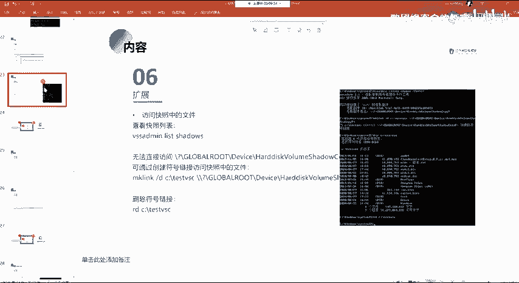