# 2024网络安全系统教程！清华大佬花159小时讲完的网络安全系统课！别再盲目自学了，学完即可就业！零基础入门网络安全！（渗透测试／漏洞挖掘／CTF／黑客技术） - P45：32.解密ntds.dit.mp4 - 教网络安全的红客 - BV1ft421A7Nj

好，那么我们继续。呃，下面的话就是呃第三部分。第三部分的话就是。解密NTDS点DIT就其实前面的话我们是介绍了呃，我们如何在预控当中，我们如何去获取这样子的一个保存着所有域用户。

以及就是在这一个域下面所有的这样子的一些用户啊，它的主啊等等的这样子的一些啊密码的一个哈希，对吧？有这样子的一个。呃，数据活动目录的一个数据库文件，对吧？然后我们获取到了这一个文件之后的话。

我们如何去进行一个就是说如何去把它里面的一个哈希值给获取出来呢？因为里面的一个哈希值的话，才是我们所需要用到的对吧？然后在这边的话呃给大家介绍四种方法。

首先第一种的话就是使用这一个夸克PW do的一个工具啊。这个工具的话，它是一个就是呃一个windows用户凭据提取工具，就它可以抓取平台下面的，就windows平台下面多种的一个用户数据啊。

然后在这边的话，我们主要的话使用它来去做一个就是说把我们的。把我们获取到的这个NTDS点DIT的一个文件内容里面的一个哈希子给获取出来。

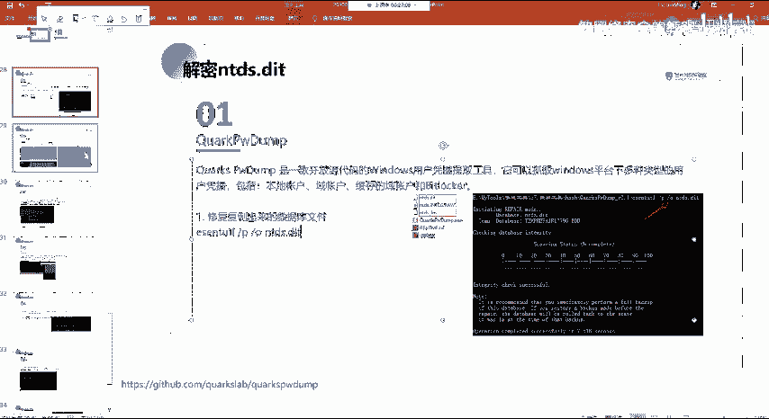

然后他具体的一个使用方法的话，就是这边。他具体的一个使用方法的话，呃，主要的话就是这三个参数啊。首先第一个就是杠杠哈希杠do就说这里的这个参数的话，因为它还有其他的一些参数。

就是它能够它不仅仅是能够去导出域域当中的一个哈希，它还有就是啊我们平常的工作组啊这样子的一些哈希，它也可以去进行一个呃获取。然后刚刚output的话就是输出到我们指定的一个文件。

当然的话你也可以直接向这边输出在我们的一个命令行当中，对吧？这个这边他就输出到文件当中。然后杠杠NTDS杠fi的话就是指定我们的这个NTDS点DIT的一个文件。呃呃，具体的一个效果的话就是像这样子。

就像我们这边的一个图图。两个图，然后这边的话就是我们获取到的他的一个哈希纸。具体来。

我们以前面这边获取到的一个。给大家演示一下。

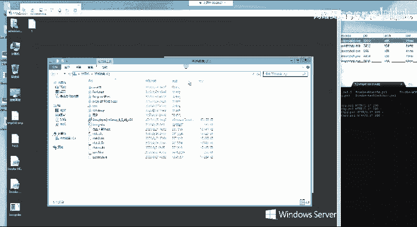

啊，就以这一个吧。这个的话是我们刚刚通过那个n copypy那个脚本获取到的这个这个预控当中的1个NTDS点DIT的一个文件，对吧？我这边的话，我把它给扩ll出来。把那个下载到本地。

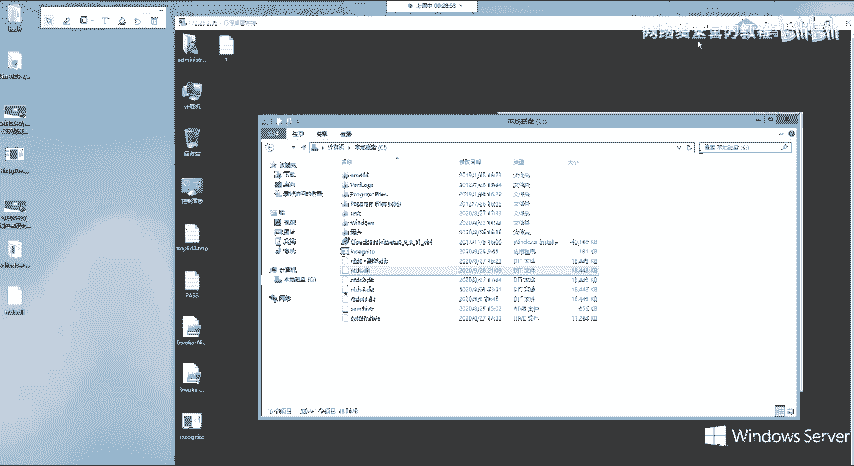

然呃在这边的话，我们在使用这一个工具。

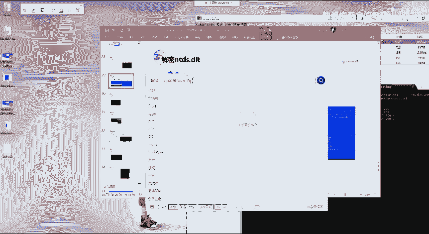

嗯。加问。对。

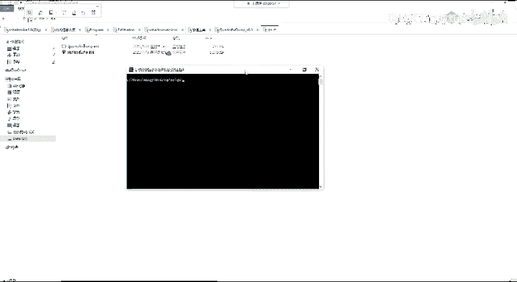

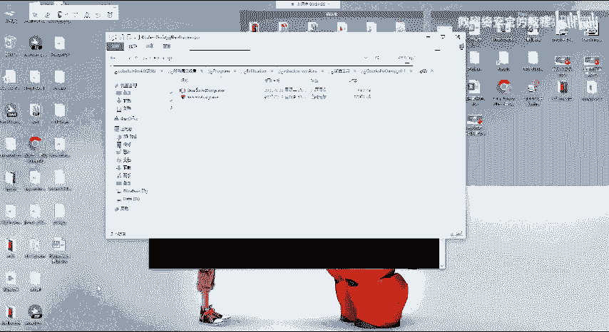

对啊。电用卡。阿0。我们。这个号就不输出了。直接指定这个。

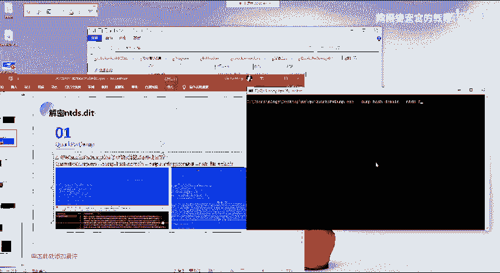

是。🎼Yeah。

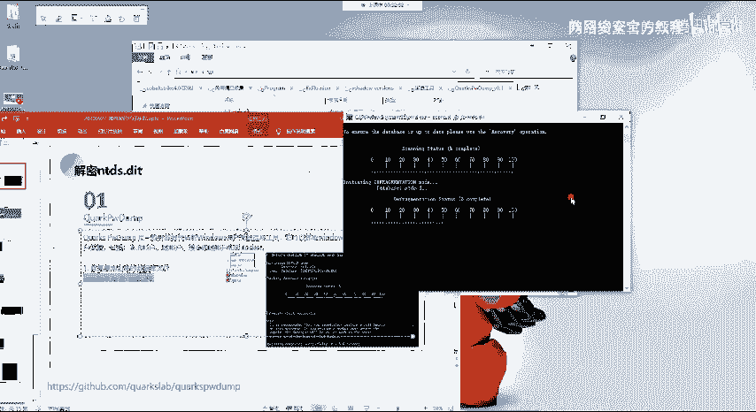

呃，在这边的话。稍微等一下。就是呃你直接导出了这一个文件的话，你需要首先要执行这里的这个命令。然后他的一个作用话就是修复复置出来的这个数据库文件。然后执行之后的话，再用这一个工具来去进行一个。导出。

这的话好慢。然后其实在这边的话，你可以看到它也会生成这样子的一些文件，就是在这边正在做相应的一个修复。用付的命令话呃，对，是自带的，就这个ES烟。

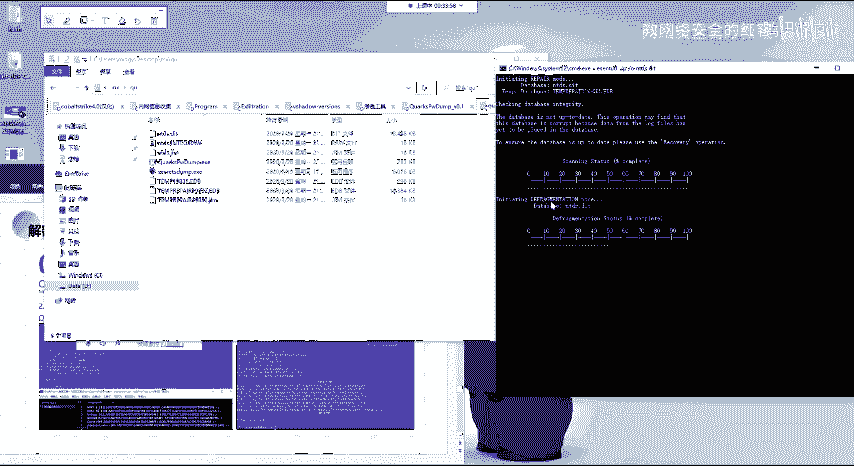

好，这边的话先让他跑着吧，我们先继续后面的一个内容。Yeah。然呃，第二个的话就是用这个secret du，这个也是呃比较常用的，就它是这个inpackate套件当中的一个脚本。

然后他的一个缺点的话就是速度有点慢，就是速度有点慢。然后其实呃用这个的话是最快的一个方法，就是你修复完成之后的话，直接用这一个直接执行的话呃，直接就会就可以直接出来啊。

好呃关于这一个s screen dump的话呃。大家看预习资料，就是有给了就是。这一个脚本。的一个地址，以及就是。关于这一些脚本所对应的这样子的一些事例，它的一个已经编译好的1个ESE的一个程序。

就是它原先的一个脚本的话，它是python的这样子的相关的一些脚本。这个python的这样子一些脚本，所以的话你需要有python的一个环境。然后的话呃，在这边的话，这个项目的话是就是。

这个作者他已经定义好的这样子的一些EX的一个程序。我们可以直接使用这些EXE的程序去进行一个呃使用。嗯。啊呃，具体的个使用方法的话，就是这里啊。这边的话我就呃就带大家看一下吧，我就不一一的操作了。嗯。

然呃在这边的话，我们看一下它的一个命令。呃，这边命令的话我们看看一下，就是在这边他指定的这样子的一些文件。嗯。嗯，第一个的话就是我们。就是解密这种sam，解密这种sam文件的话。

我们就是干sam指定我们的一个sam文件。然后还有我们这边的一个security，就secur的话，其实我们刚刚再去获取到的时候也有获取到这样子的一个文件，对吧？

然后干干stem就指定我们的那个stem的一个文件。然后下面这个话就呃就是解密我们的这个NTDS的这个文件，我们使用这样子的一个就是干 systemstem，指定我们的一个stem文文件。

然后的话指定我们的1个NTDS的一个文件。这里的两条面的话，就是分别去呃解密我们的个sam文件，还有我们的个NTDS的这里的一个文件里面的一个哈希。哦，我们在这边的话主要看我们这边的1个NTDS。

这边的话是执行之后的一个结果。执行之后的话可以看到在这边的话就呃已经把呃这一个文件当中所包含的这样子的一些密码，哈希都给念出来了。

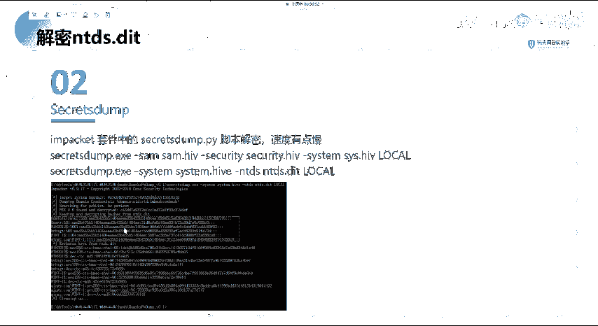

呃，这个图应该看得到吧。

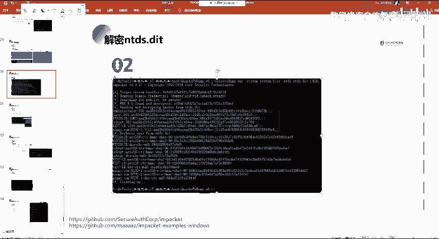

对吧以及还有呃还有下面其实主要的话就是这里啊，这里的话就是我们的一个哈希尔。嗯。以及还有下面这里的话就是呃。car比就是我们那个car的一个key啊，就是它同样的也是存放在我们的这个文件当中。

这个的话我们不需要去过多理解，过多了解。我们主主要的话就关注这边的一个哈希子。因为这里的话就是我们实际能够去利用到的。

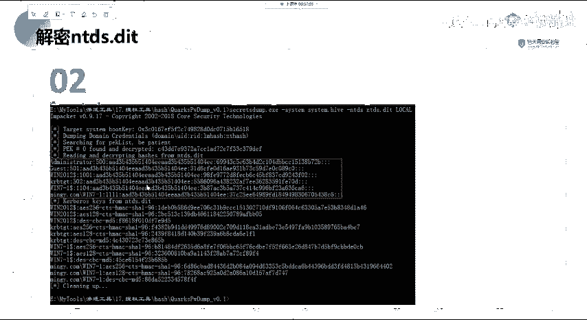

嗯。这是第二个。第三个的话就是这个呃NTDS的一个au。呃，这个的话这个工具的话就是他。可以十分高效的破解我们这边的1个NTDS文件。然后的话将它里面的信息全部提取出来。呃。

这边的一个执行的一个命令的话，就是其实跟前面的话也没多大区别，是吧？然后呃同样的需要去指定我们这边的一个stem的一个文件。然后的话呃指定我们的1个NTDS的一个文件，对吧？然呃这边的一个。

这边的话呃杠P还有这边那个杠杠U的杠CSV的话，就是我们这边指定的一个导出的一个就是内容的一个格式。就我们这边杠P的话就是导出到了这样子的一个t文件。当然的话你也可以。

通过这个刚刚有的CSV就是导导出到这样子的1个CSV的1个CSV的一个文件当中，就我们可以通过excel打开，就它就是按照呃格式做了一个排列，对吧？你看到在这边就是我们的一个域名，还有我们的一个用户名。

以及后面的话，还有他的一个就是。他的一个password。对吧还有他最后登录的一个时间，以及还有哈西值这边的话没有截出来。

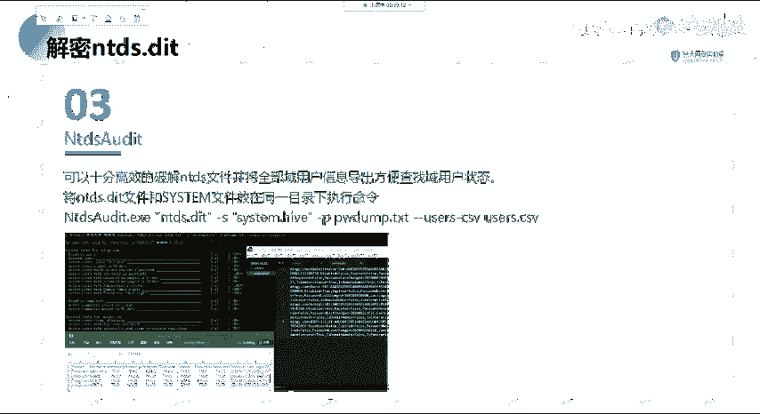

这是这一个。哦呃，以及第四个的话就是呃mini cards。mini cards的话可以说是我们就是最常用的一个就是去获取这样子的一些密码哈希以及我们的一个铭文的一个工具。

然后同理同样的mini cards的话，它有这样子的一个功能，就是这个DCSYNC的一个功能。就他可以利用我们的这边的1个DDRSS我们的一个目录布置服务。就利用他的这个服务。

从我们这边的1个NTDS的一个文件当中去提取我们的个密码哈西子。然后在这边的话，其实呃在这里的话，其实就是说我们实际使用的话，因为通常的话。

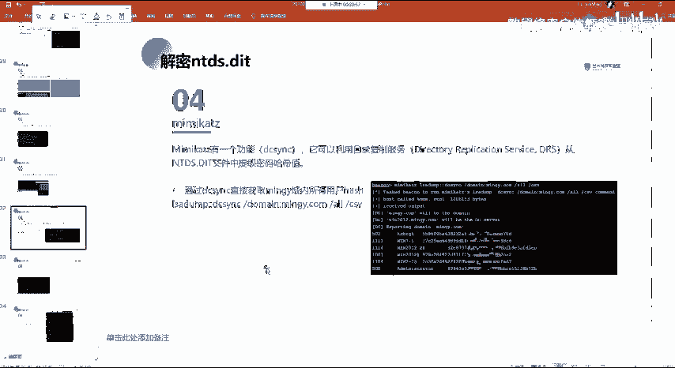

我们通常的话使用的CS的话比较多，所以的话我这边的话也CS给大家做一个演示。

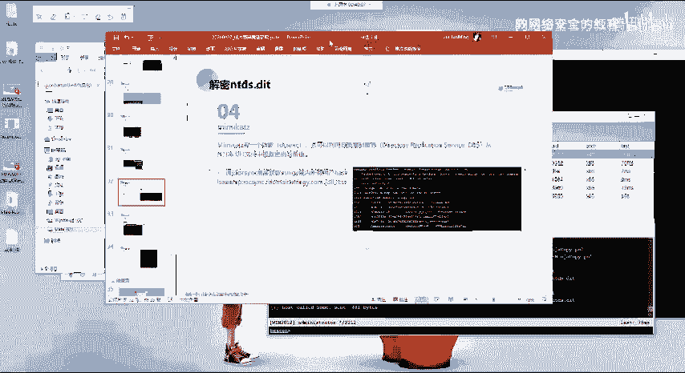

就在CS当中的话，呃，它同样的有集成的mini cards的这样子的一个呃功能。就我们可以直接在CS当中去调用mini cards的这样这一个工具。以及他对应的一些功能。呃。

主要的话我们是先来看一下第一个。第一个的话就是通过这个DCSYNC来获取。我这边的话是这个MNGY就我另外一个另外一个环境，就是我自己搭的一个环境。呃，它的一个域名的话就是这个MNGY的一个域。

然后获取这一个域当中所有用户的一个哈希，它的一个面的话就是这样这样子。主要的话就是用的用到这里的1个DCSYNC的这一个呃功能。然后指定我们的一个域名。然后杠2的话就是导出所有的。然后杠CSV的话。

就是呃像这样子的一个呃形式。去把它给念出来。这边话我们来看一下具体的一个效果。

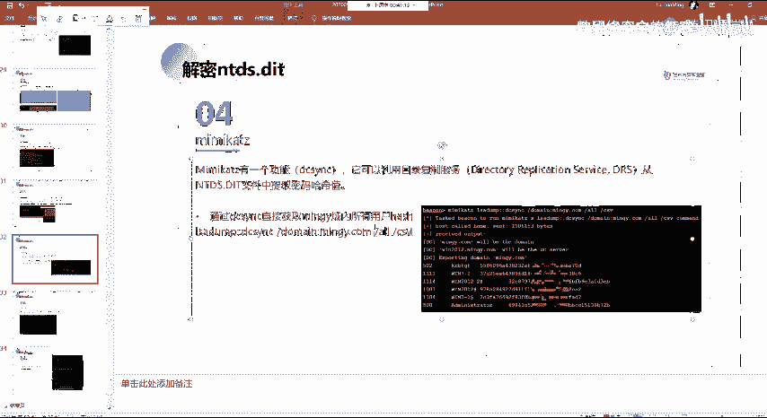

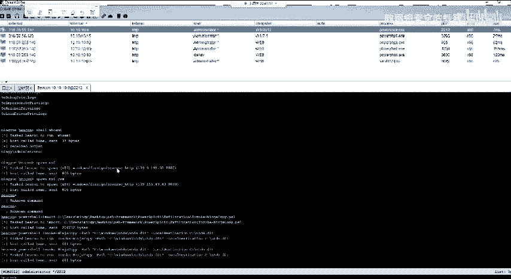

然呃，在这边的话。我们可以通过help来去查看到这样子的一个mini cards。它的一个功能，然后关于它的一个使用，如果你不知道，你可以直你可以在这边输入min card。然后。杠H。然后在这边的话。

他就会输出呃他的一个使用的一个帮助。就其实在这边的话，跟我们在windows系统上面直接执行命令cast点X的一个呃，就是他的一个帮助信息其实一样的。然后在这边的话呃。我这边的话，我就直接复制了。

就不敲了。

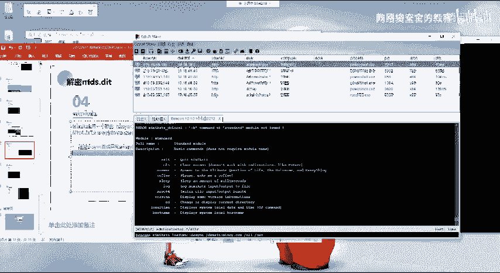

好。

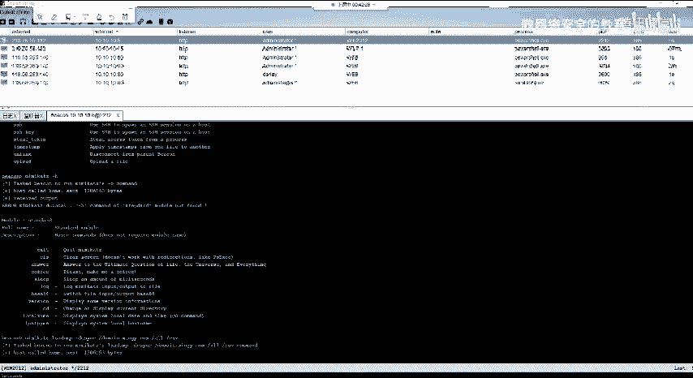

啊呃，其实在这里的话，其实。这一个就是说这这里使用min在CS当中使用min跟前面去进行一个哈希的这样子的一个解密，其实不一样的对吧？你会发现我们前面这边的话是通过就是说通过前面我们的一个一些方法。

对吧？离线的就是说把我们这边的1个NTDS的一个文件，通过离线的一个方式把它给复制出来。然后的话我们再用其他的相应的这样子的一些解密工具去进行一个解密，对吧？

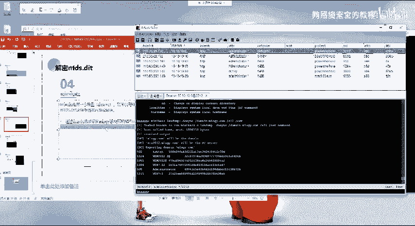

然后在这边mini卡的话，我们在CS当中的话，它其实是利用的这一个它系统里面的这自带的这一个目录复制服务，把它里面的这样子的一个文件给嗨哈息给提取出来，就就可以把它理解成是一个在线的一个提取。

在线的一个解历。啊，前面的这一些的话就是通过离线，就是离线的一个方法去进行了一个解密。

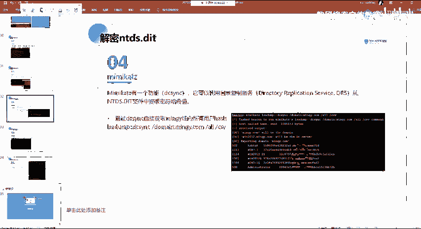

好，在这边的话，我们可以看到这里的话就是我们得到的一个结果，是吧？前面这里的这一个这一串的话就是我们那1个IID的一个值嘛，对吧？然后中间这里的话就是我们的一个用户名，后面的话就是我们的一个哈希子。

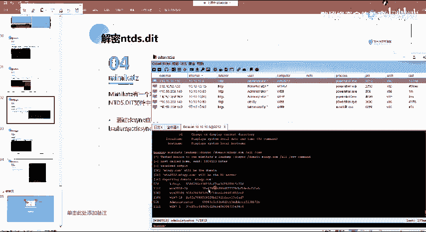

然后还有的话就是获取单个用户的一个详细信息。就说我们可以我们前面第一个命令的话，在这边的话，它是获取所有用户的这样子的一个密码哈西，对吧？

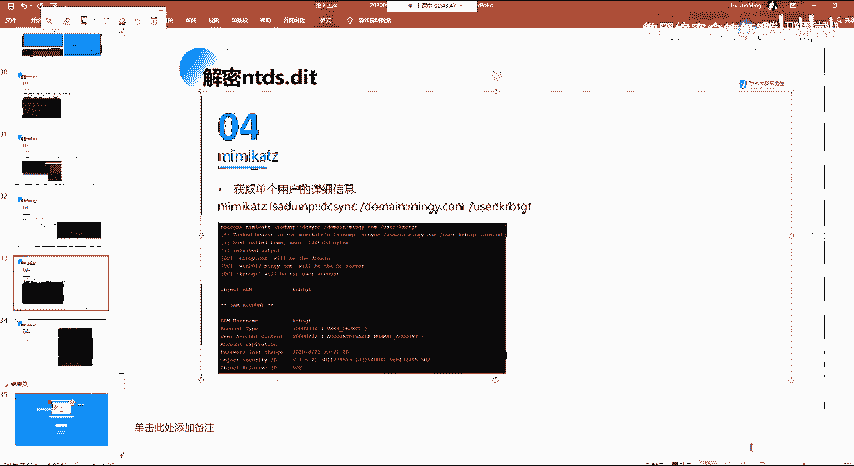

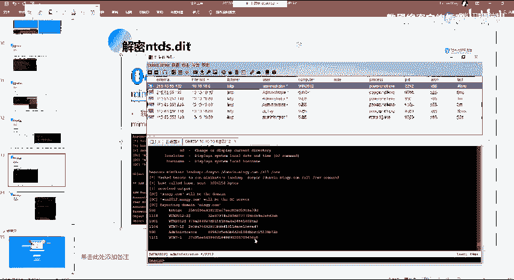

然后的话他还有其他的一些就是详细的一个信息，我们没有获取到。然后在这边的话，我们可以就是你想要单独的对某一个用户去获取他的一个详细的一个信息。那么我们可以通过这样子的一个命令。

就是其实就是在这边加一个这样子的一个参数，干U者这样子的一个参数来去指定我们的一个用户。哦，呃在这边的话呃我在这边举例的话，就是举的是这个KRBTGT的这样子的一个用户。

就这一个用户的话是一个比较特殊的一个用户。就这一个月呃。其实我们在第一节课讲，就是工作组跟预的时候，也有提到这样这样子的一个用户，对吧？这个用户的话，他是呃在预控上面比较特殊的一个用户。

然后这个用户他是无法去进行一个登录的。他的一个这个用户他的一个作用的话，他是啊就是我们再去就说在预预主机与预控制器当中。呃，去进行一个通信的时候，他在其中的话扮演着一个呃比较重要的一个角色。

他的这个角色的话就是他的这一个用户，他的一个哈希值是会参与到我们的这样子的一个呃。就是他的一个caps协议认证的一个过程。就我们会去使用到这样子的一个用户。

他的一个哈希值去进行一个呃数据包的一个加密以及解密。呃，当呃这边的话我在后面给大家讲cars的一个协议的时候，再具体的一个说啊。因为呃这个caps协议的话，它是就呃比较复杂的一个东西啊。

可能我到时讲的话，可能大家也不一定一时半会能接受得了。但是的话呃，这个。呃，是我们在后面。就这一条语句，我们在后面去进行一个啊域内的一个权限维持，也就是大家可能经常听说的一个白银票据。

以及黄金票据的时候，就再进行一个黄金票据的一个呃。呃，一个攻击的时候会去用到这样子的一个这条命料。就是我们需要去获取到这样子的一个cap啊KRBTGT的这一个呃特殊的用户，他的一个密码的一个哈希。

我们获取到他的一个哈希之后的话，我们就能够去伪造我们的一个黄金票据。嗯。然呃在这边的话，我们可以看一下它的一个效果就是。我们具体来看一下。

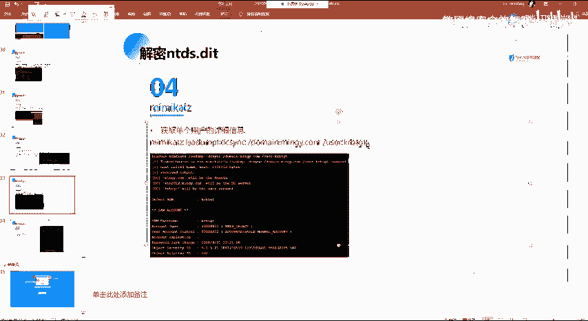

呃，然后呃在这边的话，顺便提一下嗯。就是我现在在这我现在这里的话，是在这样子的一个。呃，就是预预预控的这个机器，就是我这边自己搭的这个预控的一个机上品执行的，所以的话肯定是能够去。进行这样子一个操作的。

然后的话如果说你是获取到的，就是说比如说是一个普通的。就是一个普通的一个本地的一个这样子的一个管理员的一个呃用户。呃他不是一个域内的一个用户的话。

那么你是无法去获取到这样子的一个呃这个KRBTGT的一个呃哈希值的。就是说你想要去获取到这样子的一个哈希值的话，你首先你需要去获取到一个域内用户的一个呃权限。然后的话你需要以这一个域内用户的一个权限。

你才能够去获取到这样子这个你才能够去预控上面去获取到这个呃与这一个用户去进行一个就是信息的一个交互来获取他的一个哈希子。嗯。这边的话呃。给大家提一下。啊，呃，我们来看一下，就是说我们在这边的话。

我们执行之后的话，已经得到了他的一个详细的一个信息，对吧？就已经很详细的一个信息。好，我们主要的话看一下，就是在这边的话，他的一个。用户名是这一个对吧？

然后的话在这边它的一个哈西子N天门那一个哈西子就这一串。嗯。哦，呃，还有的话就是要注意，就是呃，就是这边的一个这个KIBTGT这个用户，他的一个哈希值一般的话他是不会去进行一个呃修改的。

就是说你在预控上面的话，他一般不会是说是去修改的。所以的话他我们可以就是如果你得到了他的一个哈希值的话，你可以持续的用这个哈希值去进行一个获取预控的一个权限。

也就是我们在后面会讲的就是预内的一个权限维持嘛，对吧？你可以通过获取的这一个哈希值来去进行一个权限维持。然后的话如果说就是说。这里的这个KRBTGT的一个就是他的一个哈希值改变了是吧？

就是说管理员他更新了他的这个哈希值。那么你通过原先那个哈希值，那么肯定是无法去呃再去进行一个。呃，得到预控的这样子的一个权限。当然的话一般的话这个他的一个用户哈息的话，他不会去有做改变。

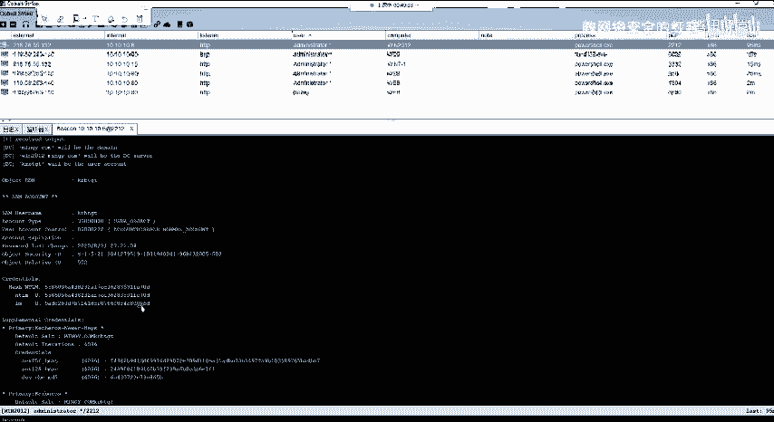

Okay。

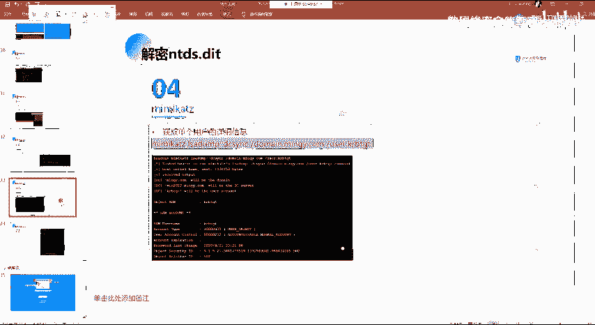

然后第三个话就是查看所有用户的这样子的一个所有的一个详细信息啊。

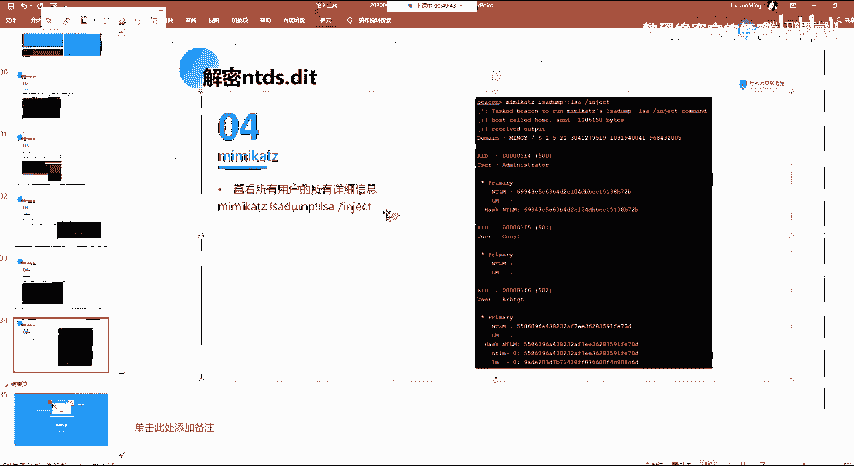

就通过这样子的一个力量。

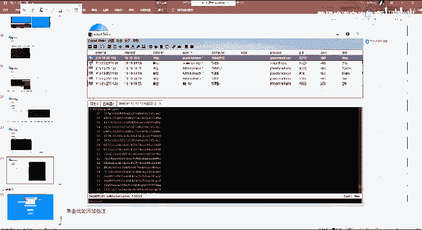

我们就能够去获取到啊域内的所有的这样子的一个。用户的一个详细信息。没看到呃，在这边的话，就包括了就是我们前面所获取到的这样子，这里的这所有的这一些用户以及他详细的一个信息。是吧。

我们可以看到有这个admin这个用户，他的一个哈西，对吧？以及还有其他的像。KRBTGT的这一个用户，以及还有其他的这样子的win7杠1的这一个用户。

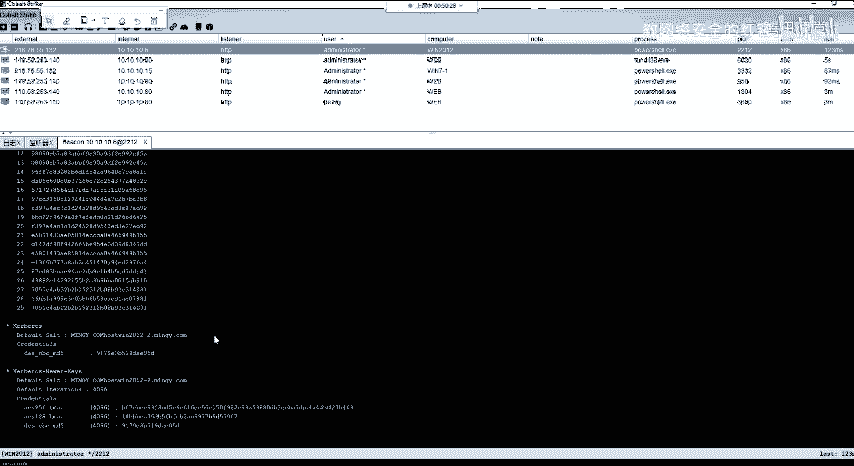

他把所有的一个用户，他的一个详细信息都获取出来了。

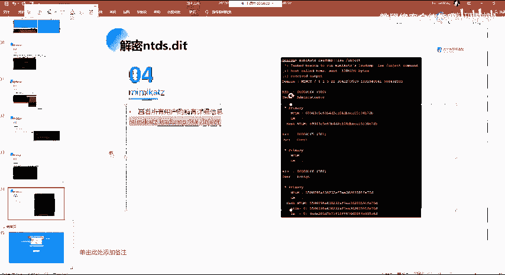

好呃，以上的话就是我们所有的一个内容。呃，在这边的话。

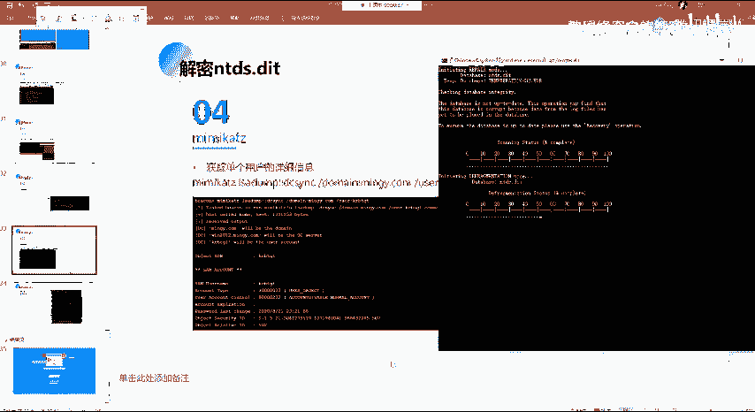

我来看一下前面的。那怎么卡住了呀？

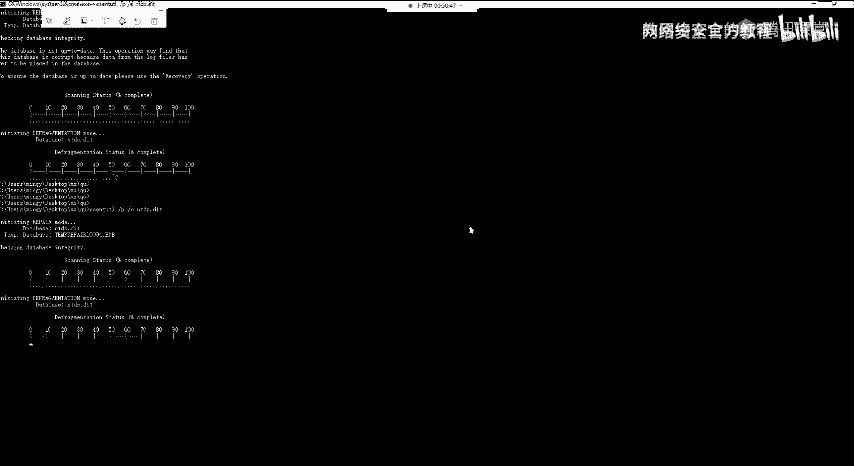

卡3个本嗯。

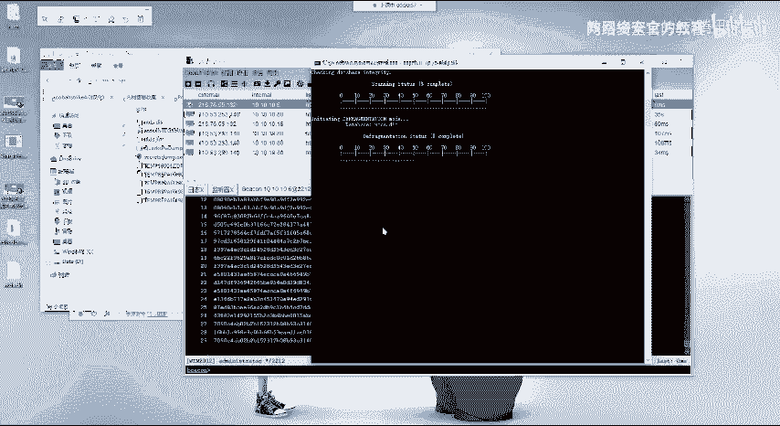

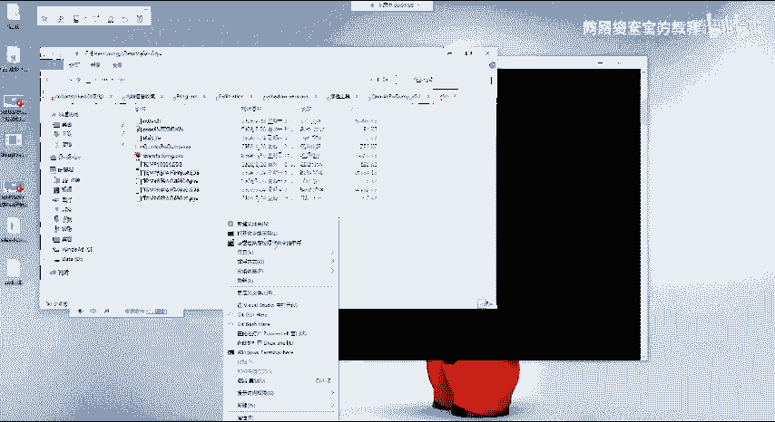

怎么不动呢？

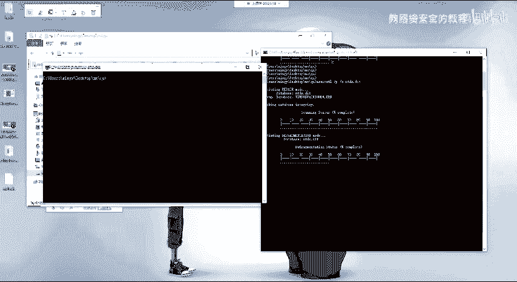

啊，证里话那么。用第二种方法是。大家演示一下吧。哦，还有个 system 的文件名我科取。

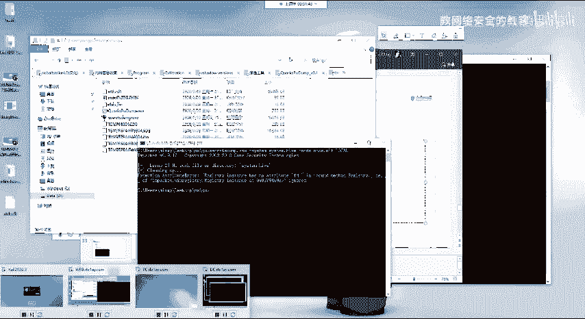

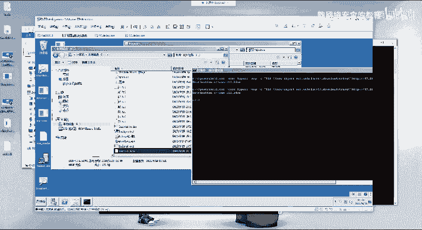

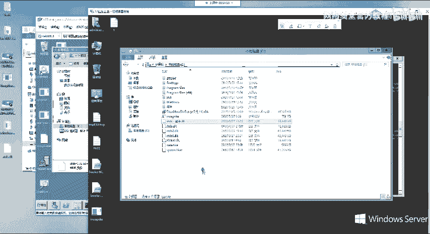

哎，不要再跑一点。

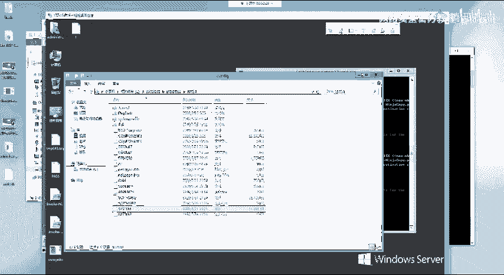

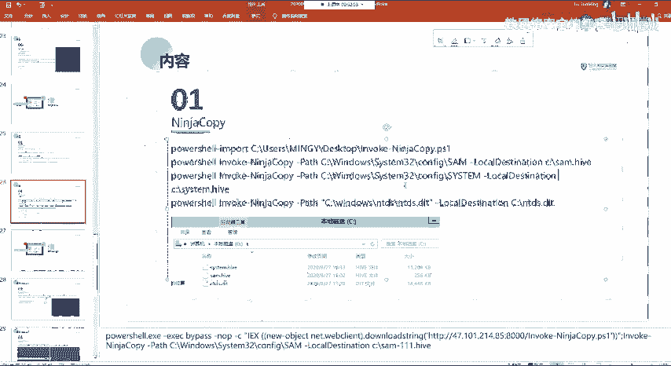

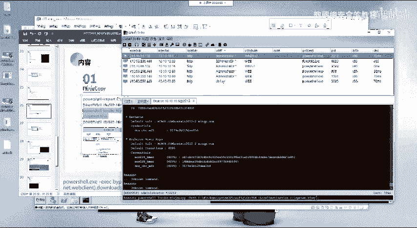

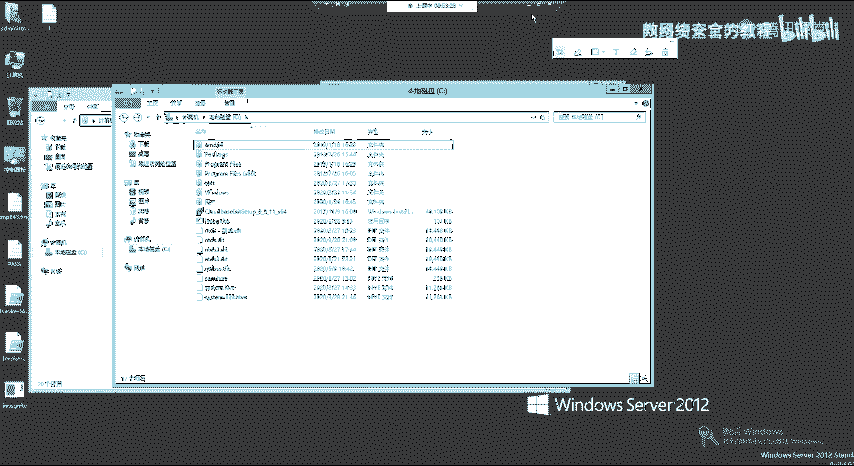

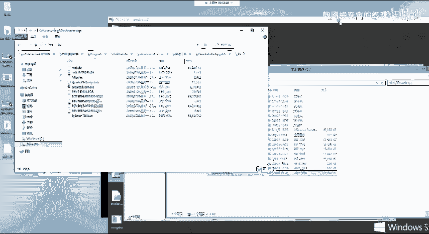

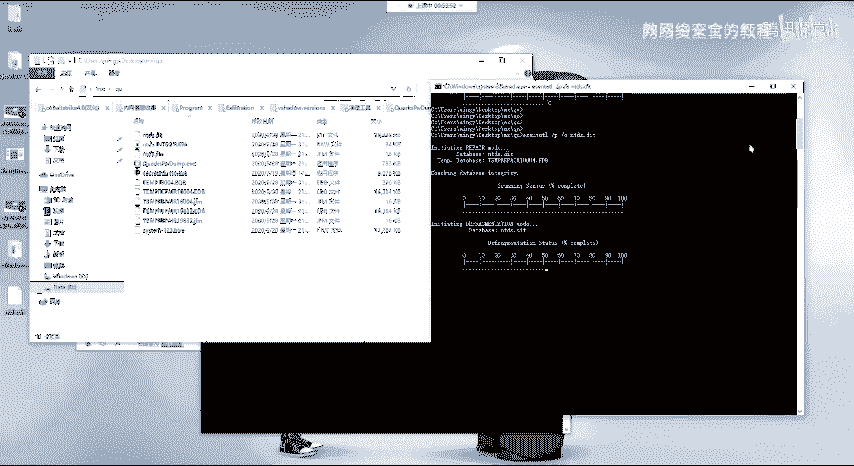

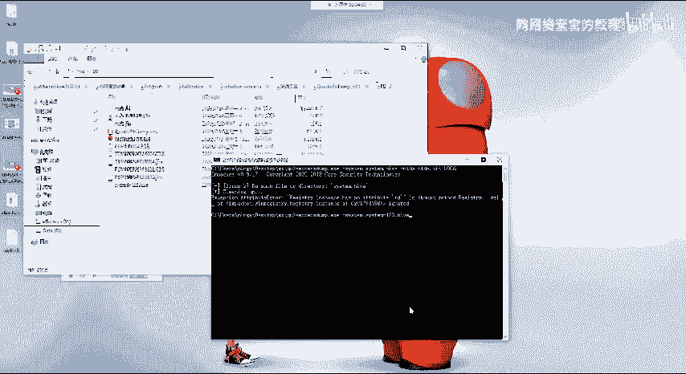

然后呃在这边的话，我们通过这一个就是impact这个套件当中的这个secret du这个呃工具啊，可以看到在这话已经成功的把它的这个里面的一个哈希纸给获取下来了。

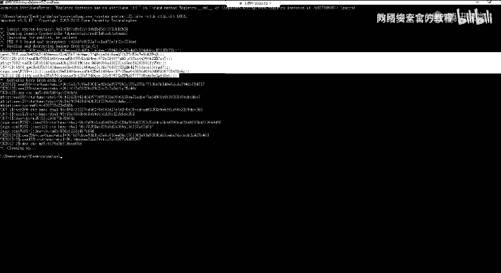

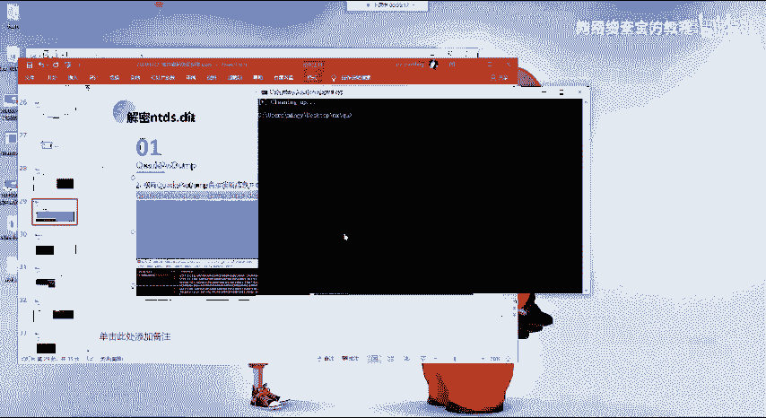

好，再一个怎么。他这一直卡在那不动。

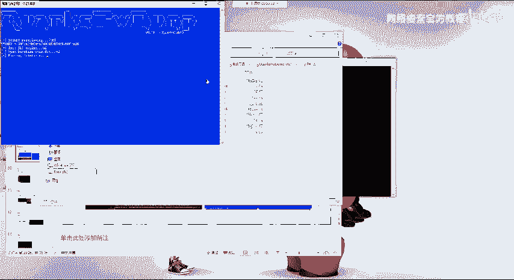

Okay。

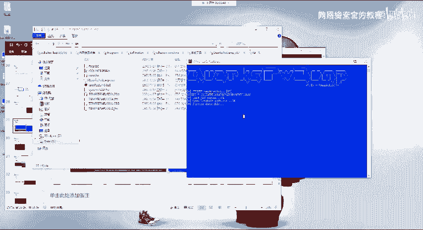


对。应该是没修复完成啊。不出来。还有的话就是这个NTDS order。我们看一下。先把这个删掉吧。看一下效果吧。


你看他在这边执行之后的话，呃，他这个的话挺很快哦。然后执行之后的话，他把结果他会输出来。


突出到一个tex文件当中，对吧？就呃包括域名用户名以及啊他的一个哈希值对吧？等的东西都输出来了，以及他可以输出到CSV。


的文件当中对。呃，这个这个工具的话，大家自己课后去跑一下吧。好吧，我这边的话我就不跑了。这个的话应该是应该是可以跑呃，不是说应该说是完全可以跑出来的。然后中间的话可能是。他那个不知道怎么就卡在那。

然后这边应该是没有修复完成，所以的话他就。用那个拷拷不出来哦。呃，以上的话就是我们本节课的所有的一个内容啊，大家有没有什么疑问？


或者说呃还有前面两节课，大家有没有什么疑问？就是呃你自己操作之后，对吧？你做过之后的话，也有什么问题没有？大家都可以提。好吧。给大家两分钟的一个时间。呃提问吧。包括本节课的一个内容以及上上上节课。

大家有没有什么问题？冇蚊。怎么都。没人回我呢。反正就是跟着PPT敲。对啊，你就跟着我PPT敲就行了嘛。你跟你跟着我PT敲的话，你。你应该能。想不到了。听到好晕啊。呃，郝晕是指哪里呢？就能具体一点吗？

就说你呃理解不了。这一些内容吗？获取哈息之后怎么利用，怎么利用的话，呃，在后面会给讲会讲啊，就是在横向移动的时候。在去进行横向移动的时候，会呃有专门的一个内容，就是呃针对横向移动的。

就我们获取到哈西之后，哈希之后的话，我们可以。就是说获取到哈希的话，第一种方法就是说进行一个解密嘛，对吧？我们可以直接对我们这里获取到的哈希值做一个解密。如果能解密出来的话。

那么我们就直接可以得到他相应的一个权限，对吧？就是我们知道账号密码，那么我们肯定可以得到他相应的一个用户的一个权限嘛。如果你解密不出来的话，我们还有相应的其他一个方法。我们可以利用获取到的一个哈希词据。

比如说去进行1个PTH，也就是一个哈希传递的一个攻击。来去定一个横向的一个移动。呃。放心啊，后面会讲的，后面会讲的，后面内容还是会很多的。实战环境中预管理会发现嘛。呃。就是说。


我们的这样子的一些操作的话，都是比如说你在CS里面操作，对吧？你没有说就说你的这一些操作，他也是看不到的呀。当然的话，如果说你有相应的这样子的一些监测工具的话，检测工具的话。

那么你的这样子的一些操作的话，很很有可能会被检测到。这个的话不可避免的。然后的话呃。然后还有还有其他问题吗？呃，前面这里的话呃，可能。就是因为这一期的话是加了玉的一个内容，就是预渗透的一个内容。

而且然后的话就是预渗透的话，关于玉的这一个东西的话就是。可能大家接触的比较少啊，就接触的比较少。然后对他的相关的一些概念的话可能不是很理解。这点的话大家就呃没关系啊，不用急，好吧，后面的话后面的话你会。

后面的话后面还有很多的一些内容呢，就是我尽量会让大家就是串起来。好吧。就是能够把这相关的一些内容给串起来。


就我们。呃，看看一下课表吧。


我这边的一个课课表的一个规划的话，其实。


我们现在的话是讲的就是内网信息的一个收集嘛，吧，其实呃今天的这一个内容的话，其实呃。不太算是内网信息的一个收集啊，就是域内密码的一个获取的话，这一这里一部分的话应该算是在后面的这里的一个就是说嗯。

横向移动的时候。横向移动的时候才会说去。呃，那个当时的话呃，因为。前面的话就是。内网信息收集就是密码信息的相关的一些东西的话，呃，前面的话给大家介绍完，因为后面的话也同样的有其他的一个东西。

就说前面这里的一个一些密码，哈希的一个获取的话，是为后面我们这边呃横向移动，对吧？我们通过相应的一些方法去进行一个横向移动，去利用我们前面获取到一个哈希值。

以及还有就是呃日常就是一般的话就像工作组的一个横向移动的话，呃，其实域内跟工作组的话，它相应的一个使用的话，其实没太大的一个区别。然后主要的话就是就是说你在工作组以及域内的话。

你的就是呃主机之金的一个关系，以及你主机资金的这种通信的一个呃。协议就说去进行一个。资源的一个访问去进行一个主机之间的一个访问的话，它以及密码的一个印证等等的相关的一些协议的话，它是不一样的。

然的话这里的话在讲那个。就是在讲横向移动呢，这边的话会给大家讲，就是讲呃。我们的这样子的一个。呃，域内的一个就是域内通信的一个协议，就个开verse式协议。呃。对，就是一般的话。

你就是你小公司的话也不会说有约。一般的话啊，你大公司的话都是有这样子的一个东西啊。min你卡的话mini卡的话有。就说mini cards你要直接去使用的话。现在的一般的一个纱网，他都能够去把那个杀掉。

所以的话你需要去做相应的一个敏杀。然后的话也不然后的话还有就是你不不一定是说你直接把min卡传上去啊，对吧？你要去获取他的一个哈希值，你可以有其他的一个方法。就上节课不是讲了嘛。就是哦哦对了。

就是在域域当中去获取本地的这样子的一个密码。哈希的话，其实跟在工作组当中去获取，其实也是类似的啊。就是说域内的一个主机，而不是说预控，就是说域内的这一些主机，它其实也是我们去获取它的一个哈希，对吧？

也跟前面我们在工作组当中去进行一个本地的一个密码。获取的话，它其实也是。啊，一样的。类似的。


Yeah。这个这个肯定的。你的。嗯。Yeah。这瞎操作的话，肯定肯定的呀。但是就是说你做不到说能做不到说能做到绝对的一个隐蔽。就是我们现在这样子这样子去操作的话。

你预管理员你不去说你不去仔细的去那个的话，因为我们这边也不是说直接去登录到他的一个主机，对吧？当然的话就是说你管理员你去是比较难去发现这样子的你的这样子的一些操作的。当然的话。

你因为你去在他的一个系统当中去进行相应的一个操作的话，对吧？会有相应的一些日志，以及你的一个流量的话，有相应的一个特征。就是说你的一个系你的一个内网当中的话，有这样子的一些流流量监测的一些设备的话。

以及你的主机上面有主机监控的这样子的一些呃。一些。就是客户端的话，那么我们的这样子的些操作的话，肯定也是会被。被被监控被发现的。我们只能是说能尽量的去隐蔽一点。


啊，已经10点钟了呀，应该应该没有什么问题啊。然后呃就是。就前面有位同学说。听了好晕，我其实。呃，怎么说呢？就说。你先不要急，好吧。就你听的有点晕的话，你可能是你刚接触这一块，对吧？你刚接触这一块。

你可能。


不太就不太能理解这一些东西。但是呃在后面的一些内容，你后面你呃接触后面的一些内容以及。你多去就是。你一时半会你听不明白，就是我在课我在课上的话会去讲，对吧？就是我中间我突然想起来，就是有相应的一些点。

我会讲，有可能你PPT上面没有。然后这个时候你。然后你这个时候你。多看一下我的一个视频嘛，对吧？反正要有回复。怎么拿下预控呃，会的。就其实我们现在我们现在对吧？我们这边已经拿到了他的，我们通过。


啊，当然。我们通过拿下就是域内的一个主机，对吧？拿下域内的一个主机，通过相应的一些漏洞，拿下域内的一个主机。然后的话我们通过域内的主机的一个就是说。啊，密码哈希对吧？来去进行一个拿下预控的一个权限。


就是我们预渗透的话，一个最最终的一个目标就是拿下预控嘛，这个肯定会讲的。嗯。我第节课不就说了吗？就是。呃，最终的一个目标就是拿下预控嘛。呃，作业的话其实作业的话，这里的话。作业的话没有什么太多啊。

就是你先把我PPT的这些内容，你都自己做一遍，好吧。然后的话你不理解的哪一个点，哪一些地方，你可以问我。拿下预控的话，那么你就是说你拿下预控的一个权限的话。

那么你这整一个域内就说比如说我这边拿下了这我这边的这个预控，对吧？然后的话我当前的一个预的话是。我当前的一个域的话是MNGY点com这样子的一个域。那么在这一个域内下面的主机。

这些主机我都可以去进行一个控制。就什么意思呢？就是说我预控的一个权限的话，我可以随意的登录，随意的去呃访问域内的所有的一个主机。

应该没有问题啊。啊，没有问题话，那么我们下课，大家早点休息，好吧。😊，作业的话就是把我PPT上面的一个内容自己自己动手做一遍，一定要自己动手做一遍，好吧。


啊，那下课。