# 2024网络安全系统教程！清华大佬花159小时讲完的网络安全系统课！别再盲目自学了，学完即可就业！零基础入门网络安全！（渗透测试／漏洞挖掘／CTF／黑客技术） - P46：33.linux系统架构信息.mp4 - 教网络安全的红客 - BV1ft421A7Nj

好，那么正式开始我们今天的一个课程内容啊。我们今天的话课程内容的话呃比较少啊。今天的一个课程任的话就是linux的一个主机信息收集。就是说呃前面的话都是呃给大家说的多的一点说的多的一个系统的话。

就是信息收集方面的话，都是在windows下面的一个主机信息收集，对吧？然后但是的话我们的一个lininux的一个系统也是大家常用的，也是常见的这样子的一个系统。而且的话就是说全球的话。

大部分的一个服务器的话，它都是使用的一个lininux的一个系统。当然的话，在内网的话，它同样的也会有这样子的lininux的一个主机，对吧？嗯。啊。

我们本节课的话主要的话就是给大家介绍呃linux的lininux系统下面的一些信息收集的一些命令。然后呃。这里的话呃主要的话就是给大家介绍，就是说我们在lininux系统下面的话。呃。呃，可以这么说嘛。

但是的话呃就是说lininux呃，在企业当中，其实在内网的话大多用的都是就是说你个人的一个主机啊什么的，大多都是用的windows的一个系统嘛，对吧？嗯。然后呢因为linux的一个系统的话，可以这么说。

就是说它的一个学习及使用的话是有一定的一个门槛的。嗯。然，呃本节课的话主要就是带大家一起来了解一下linux系统下面的一些我们如何去收集它的一些信息，就是说收集一些对我们有用的一些信息。当然的话其实呃。

这一部分的一个内容的话，呃，应该就是说我先问一下，就咨询一下大家，就是说对lin历史的一个系统的一个了解程度。就大家呃有历历史方面的一些基础吗？以及对相关的这样子的一些命令。

有自己独立的去使用linux系统的一个经验没有。就熟悉linux的在呃讨论区扣1呃，就是了解的扣2，不知道的扣3。了解 call。呃，大多都是了解的吧，就了解的一个程度是什么呢？

就是只会一些简单的一些命令吗？还是。嗯。做一些简单的命令。嗯。嗯，好的，那么本节课的一个内容的话，对呃对大家的话应该是没有什么难度啊。就是呃考虑到就是呃。就只有这几位同学吗？其他同学呢就是还在的。

其他同学就没有回的。都是了解是吧。没有说不知道的吗？就呃我这边的话就是有了解，就是就大家不是填那个问卷调查嘛。呃，有有3分之1吧，应该是有3分之1左右的一个同学是呃就是。

没有相应的这样子的一个linux的一个基础的。然后其实呃前面在讲那个环建搭建的时候，也有给大家介绍lining的一些呃基本的一个呃结构，对吧？好呃，其他的也不多说了，应该大都是了解。

那么本节课的一个内容的话就比较轻松了。就是大家呃听我介绍。然后的话我觉得就是呃比较需要给大家介绍的话，就重点介绍的话，我会给大家重点的说啊。

然后首先第一部分的话就是呃lininux系统的一个架构相关的一些信息的一个收集。就其实一些主要的一个命令。我PPT里面的话内容的话都已经呃比较详细的列出来了，就是相关的一个命令以及它的一个意思啊。

就是便于大家在课后的话自己去进行一个巩固。然后在课上的话可能会比较紧略的一个给大家介绍。首先第一个的话就是Uname杠A这一个面的话，大家应该用的比较多吧。嗯。片都是吧。

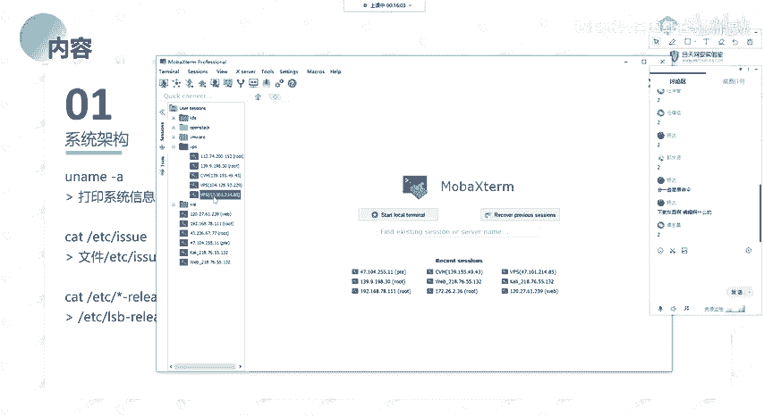

呃，Uname杠A的话，它是呃打印系统相关的一个信息啊。就我们要去查看一个linux系统，它的一个呃信息的话，我们通常都会使用这一个命令。

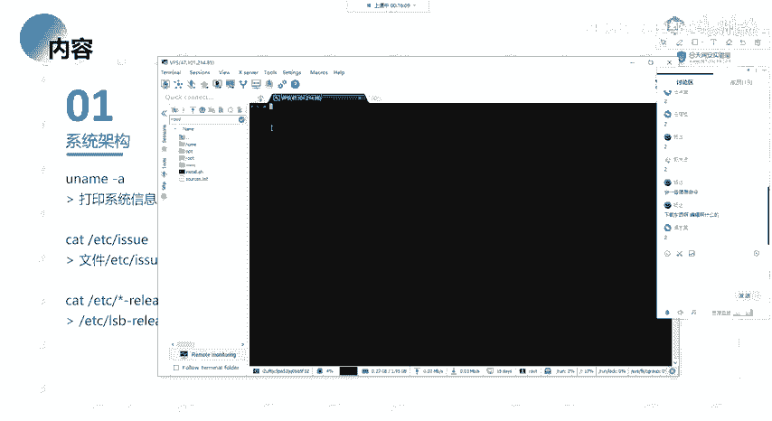

you name your name，你直接输you name的话，它会只是输出一个linux。然后U name杠A的话，它会输出啊就是说相关的系统的一个信息。

然后这里列这里列出来的它相关的一些信息的话，其实我们通过you name。干H这一个呃。刚干help。这一个命令能够知道就是说它对应的是哪一个呃哪一部分的一个内容。就是说它其实就有这么一些的一些选项。

对吧？每一个选项的话，它对应的查询的一个内容的话都是不一样的。然后在这边的话，首先第一个的话就是刚A就是列出所有的这样子的一个信息。然后下面这一部分的话。

就是分别的对应上面的一个部分的一个选项的一个输出。比如说我们用name杠S。你可以看到你U name杠S，它输的话输出的话就是linux，对吧？也就是对应的我们这边的第一个。

它这边干S的话就是con name，也就是你的一个内核名，就是你当前的一个系统是一个linux的一个系统，对吧？它是一个linux的一个内核。然呃感恩感恩的话就是输出你的一个n name。

也就是你的一个节点。就其实呃。我这边的话。我这边的话。我这边的话是使用的1个GSH啊，所以的话它没有显示全我的一个主机名。然后这边的话这一部分其实就是我的一个node name，也就是一个节点名。

就是我的一个呃主机的一个名字。然后这边杠源的话就是输出这边的一个内容，对吧？其实就是对应的我这边。P。然后同理后面的话都是一的去进行一个对应的。然后杠A的话就是输出所有的嘛。

就不你当然你要去查询你指定的一个信息的话，你不需要输出所有的对吧？

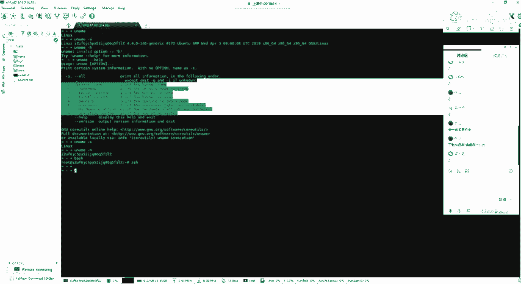

Yeah。然后第二个的话就是cat啊，就是ETC的医学。这个这个的话它是一个文本文件，就主要是包含要在登录提示之前打印的消息，还有系统标识。呃，这个的话。

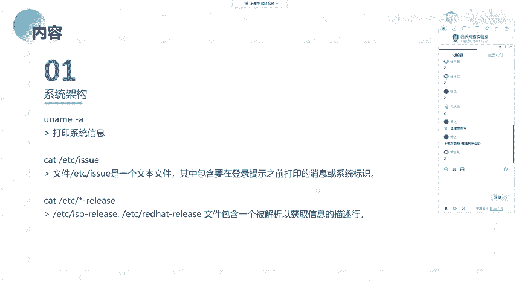

给大家介绍一下吧。嗯。就呃这边的话可以看到你这边输出的话，它是输出的这样子的一个内容，也就是你在呃去进行一个。登录的时候。其实我这边的话。就我这边的话，原本的话输出的应该就是这一部分那个哎。

因为这边的话我是用的这个工具，所以的话它会有加这样子的一些东西啊。就你实际去登录这样子的一个机器的话，它输出的话是会是这样子的一个东西，就是告诉你当前的一个系统的一个版本。

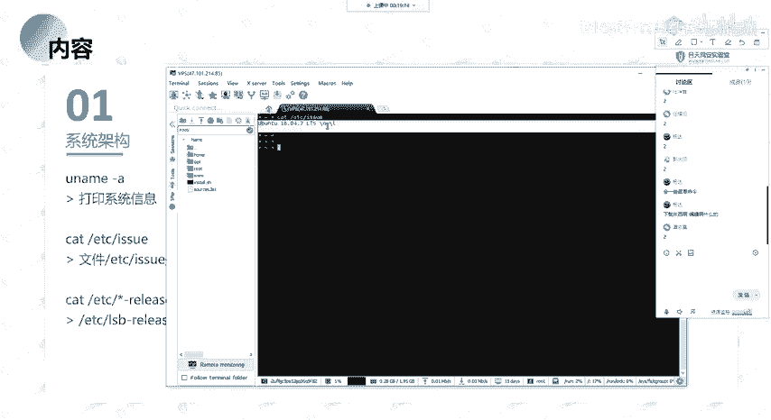

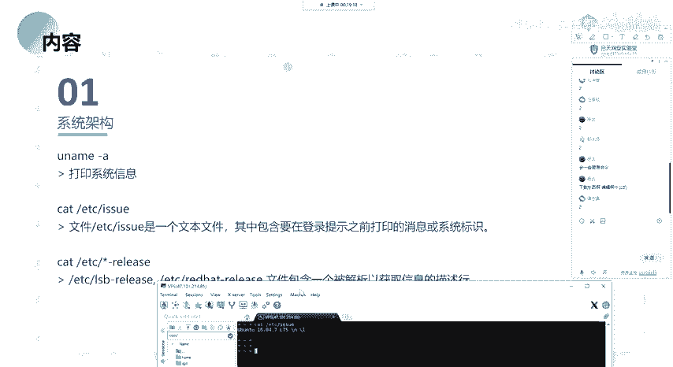

当然的话这边的这个内容的话，其实我们是可以改的啊，就我们可以改成我们自己想要的。也就是在登录的时候，你可以去加相应的一个东西，对吧？你也可以把它改成就是像这样子的一个内容，对吧？

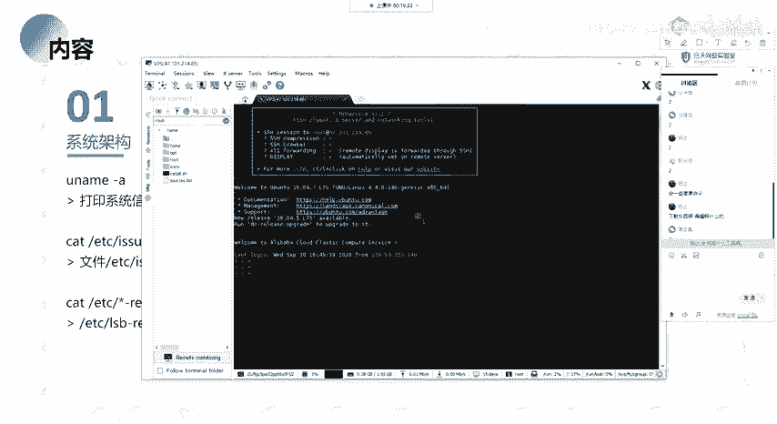

然后哦还有的话就是。呃，看。这个ETC下面的有这样子的一个文件。对吧。呃，默认的话就是在比如说低病系的，像我们的一个乌斑图啊，还有那一个呃。那个卡里对吧？他们都是低变系的这样子的一个系统。

所以所以的话这种系统的话，它它的一个它有这样子的一个文件，就ETC下面有1个LB点release的这样子的一个文件。我们想要去查看系统的它的一个信息。

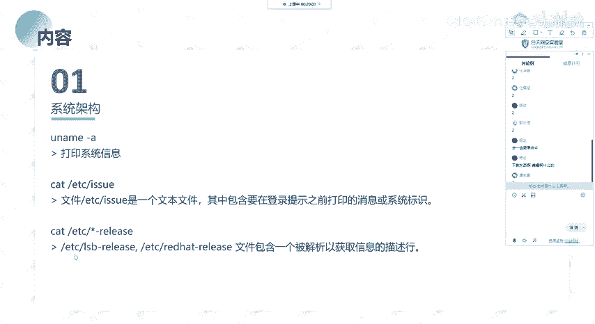

我们通常会去cat这1个LB。Release。然后在这边的话，它会显示就是你当前的一个系统啊，对吧？你的一个版本。版本。

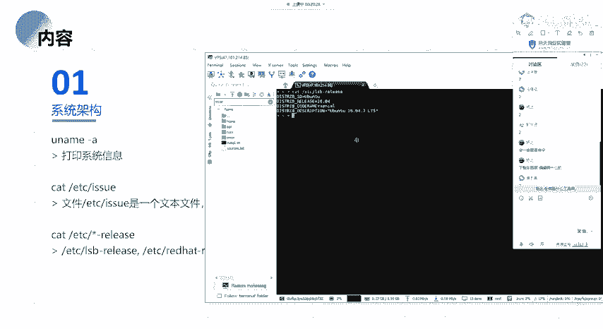

然，呃对应的就是说还有就是像red hat，也就是红帽系的。比如说n OS的这样子的一个系统。比如说圣透20的这样子的一个系统的话，它是。

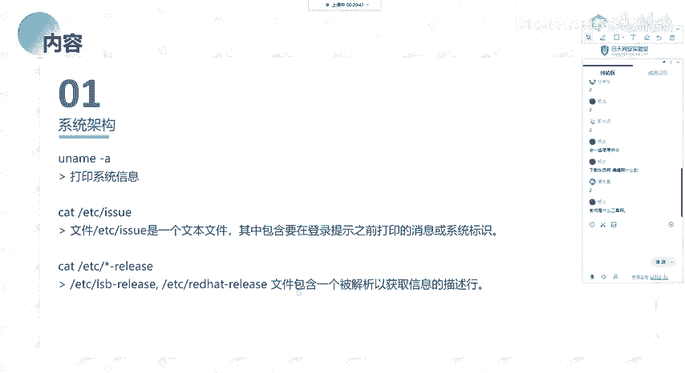

它是会有一个这样子的一个呃red hat杠release，就你可以通过就是说在这个ETC下面的一个文件，对吧？你不知道它是什么系统，你可以通过去cat这一个系统下面的这样子的一个文件。

如果说有这一个文件的话，那么它就是一个红帽系的就red hat啊细的这样子的一个linux的一个系统。

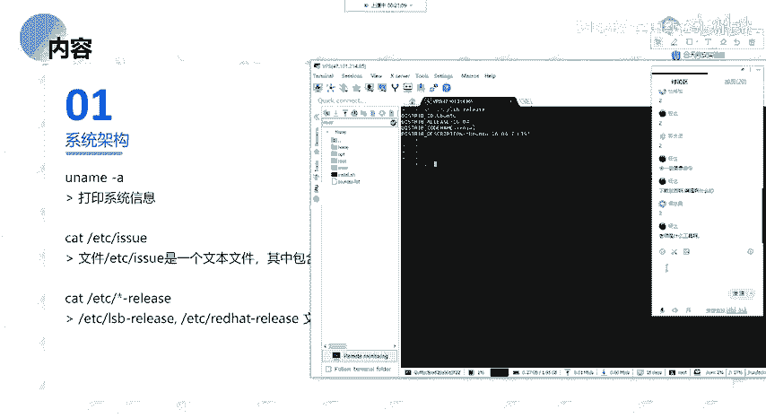

呃。你说的是什么什么工具啊，就我现在用的这个吗？还是什么？

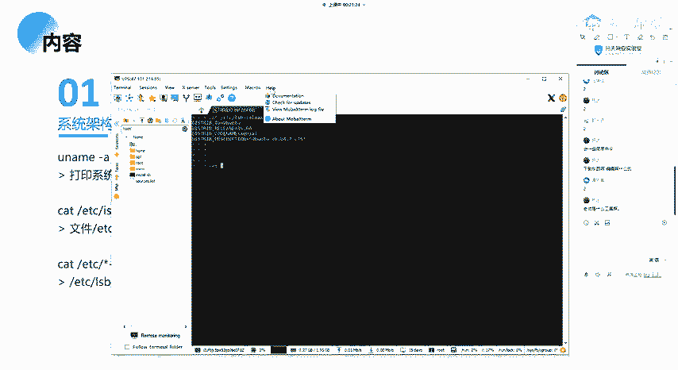

呃，我现在用的话是这一个工具啊，就。

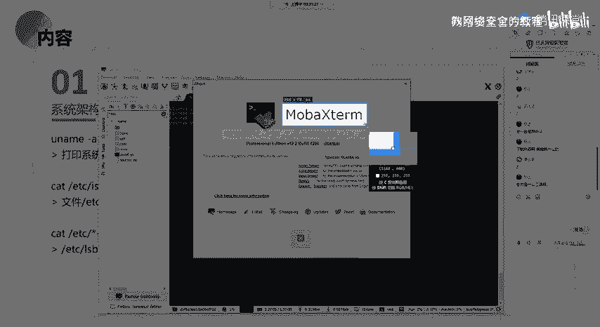

打开服务器显示的那个。就这个这个是一个卸有工具嘛，你说的应该就是这个啊。这个是一个呃免费的一个工具啊，就是你在呃它支持这个系统，就windowslinux，还有mac OS上面。都可以使用这一个工具。

就我觉得这一个工具的话是比较好用的。

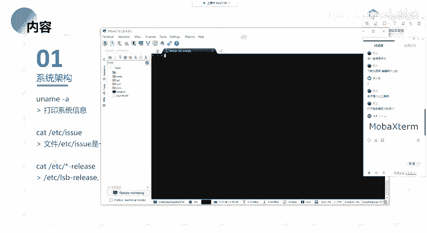

然后下面的话就是这一个呃查看lininux内核的一个指定的一个版本，就是呃查看这里。这边话我就不一的去敲了呀。然后以及还有就是它编译的像内核的这种GCC的一个版本。

以及它编译的一个实间等等的一个详细的一个信息，以及同你下面的这一个也是呃。

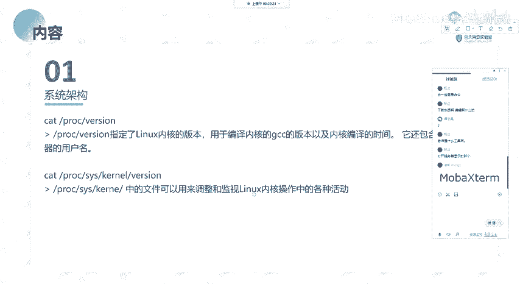

啊，类似的。