# 2024网络安全系统教程！清华大佬花159小时讲完的网络安全系统课！别再盲目自学了，学完即可就业！零基础入门网络安全！（渗透测试／漏洞挖掘／CTF／黑客技术） - P47：34.进程信息.mp4 - 教网络安全的红客 - BV1ft421A7Nj

呃呃，第二个的话就是进程，就进程的话，其实是我们就是操作硬池的时候经常会去使用到的这样子的一些命令。就说呃我们想要去查看我的一个程序，我启动之后，对吧？启动之后的话，它是启动的一个状态。

以及它的一个呃启动的一个。呃，它是否有没有启动，对吧？比如说我们去今贴一个端口，我们今天一个端口的话，它也会有这样子的一个啊。进程对吧？就是说你的这个端口它是由什么样子的一个程序去啊监听的。

我们通常会去使用这样子的一个啊PS的一个命令。就常用的的话是PS杠ELF还有。呃，PS杠AUX。就我们可以列出当前的一个进程。

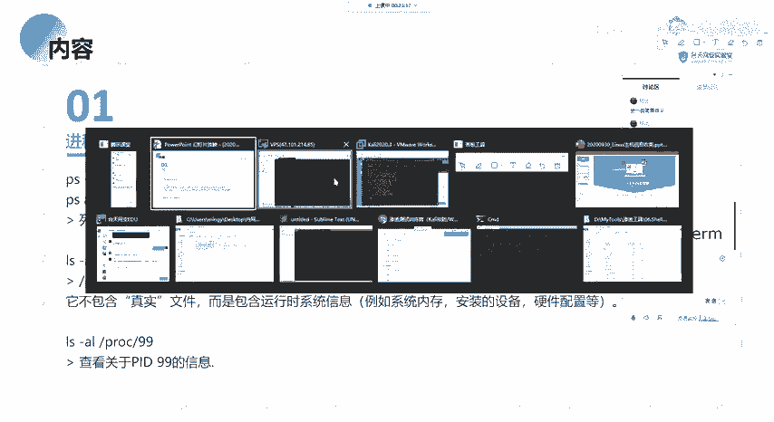

但的话呃，你直接输入PS的话，它是会显示就是说你当前的这样子的一些可以使用的一个hell。嗯。

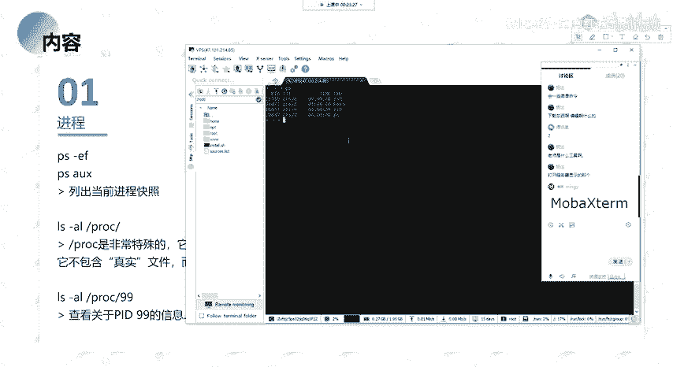

啊呃，PS杠ERF。嗯。然后在这边的话，他就会输出你当前系统下面的就是呃。

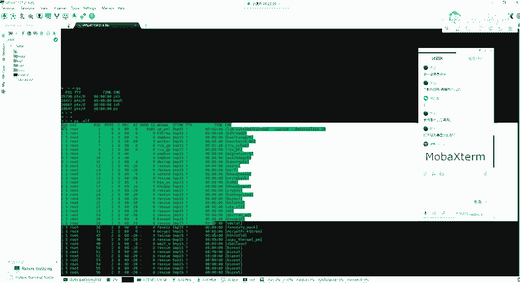

一个进程，然后他分别比如说这边。比如说我找一个就是。比如说我当前就是我当前执行的这个PS杠EF的这个命令，对吧？它同样的有这样子的一个进程。

就这个的话是它的1个ID就进程ID就是我们主要的话就关注这1个PID以及这边的1个CMD对吧？就我们想要去查找对应的一个程序，它的1个PID。因为我们要去，比如说我们要去结束这一个进程。

我们需要通过这个PID来去进行一个结束。

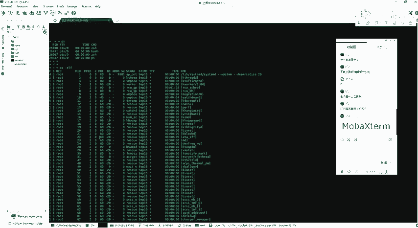

以及呃就是说可能就是你直接PS杠EF这样去打打印的话，它输出了一个信息过多，对吧？我只想要去就是说查看。就是查看我指定的一个信息。所以的话这个时候要配合我们的一个group的一个命令。

配合一个group的一个命令。就关于这个group的一个命令的话，它的功能很多啊就。很强大的一个呃工具，就是我们用用来做一个过滤筛选的。当然的话你也不一定说去刻意学，你刻以去学的话，也可以。

就是你想要对历史更了解，对吧？就是方便自己的一个使用的话，你可以去具体的去学一下这个mini。然后我们常用的话就是用这个group。比如说我要去查看这里的一个。呃，SSHD。对吧我只想要去列出。

就是说包含有SSD这样子的一个字符的这样子的一些进程，对吧？然后在这边的话就列出来了。他会去我们这边列出来的一些信息当中去匹配是否有没有这样子的1个SHD的一个呃字符。如果有的话，它就会输出来，对吧？

这样子的话就便于我们找我们就是针对性的去寻找我们想要的这样子的一些信息，对吧？以及PS杠。PS杠AX。其实呃输出的一个内容的话呃都是一样的。就是你可以去看的话，它输出的一个内容的话，对吧？

都是没有太大区别的。啊呃，第二个的话就是这个PROC的这个文件。就这个PLOC的这个目录的话，其实前面讲硬时的目录结构的话，应该有说对吧？它是一个比较特殊的一个呃目录。这个目录的话。

它是一个虚拟的一个文件系统。呃，在这一个目录下面的话，我们其实经常的话。

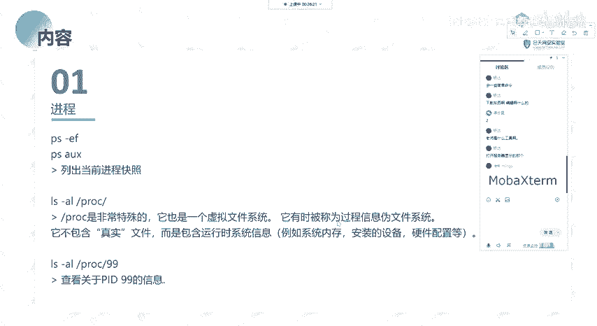

我们可以看一下，在这个幕下面的话，你L。去查看的话，你会发现有这样子的一些数字，对吧？这里的这一些数字的话，其实对应的就是我们上面的有相应的一个进程。啊，我们可以。去这样子的一个进程当中去查看它里面的。

这样子的一个这一这一个进程所运行的相关的一些文件。的一个信息。然后其实呃。像比如说嗯。

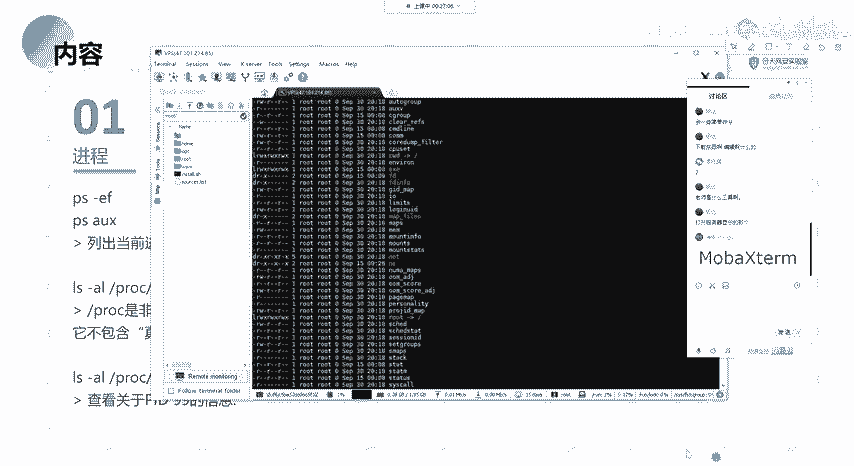

比如说我这边的话呃，我今天搞的一个就是。就是呃。我今天搞的这个。就是呃我们用来做作业的那个主机啊，我今天上去看的话，因为他一直发短信给我，我之前的话没去管。然后我今天的话就看了一下，看了一下他的这一个。

就是他说有一个Ddo的一个木嘛，对吧？要让我去处理。然后我今天呃因为。给主播庆身嘛，对吧？就。叫叫叫摸海鱼。然后就研究一下，然后就没有去弄其他的一些东西，就看看这个。然后其实在这边的话，它就有。

就发现了有这样子的一个建场，其实就是利用的那个给大家做作业的那个多壳，然后被别人中了嘛，就是种了挖矿的。他用的就是多壳的一个虚拟机的一个陶逸。然后呃。在这边的话，如果大家也去看那个的话，它会有这样子。

像比如说你在阿里云上面，对吧？阿里云上面的话，有这样子的一个原安全中心，他报的这样子的一个木马文件的一个路径，对吧？你会发现有这样子的一个东西。讲这个好像不太好。呃。就有这样子的一个东西。

就呃它会提示有这样子的一个路径，对吧？这个路径，然后PROC就是这个目录下面，然后有这样子1个1509。对吧这个1509的话，其实就是你的这个呃程序它的一个。

ID就是你的1个PID进程ID然后的话在这个进程ID下面的话，你可以去查看到对应的一个信息。在这边的话，它就是通过那个tom cat的那个呃管理员的一个后台的绕口令，对吧？它传了这样子的一个码。

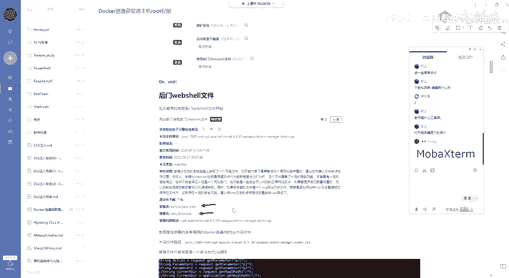

我以这个例子。

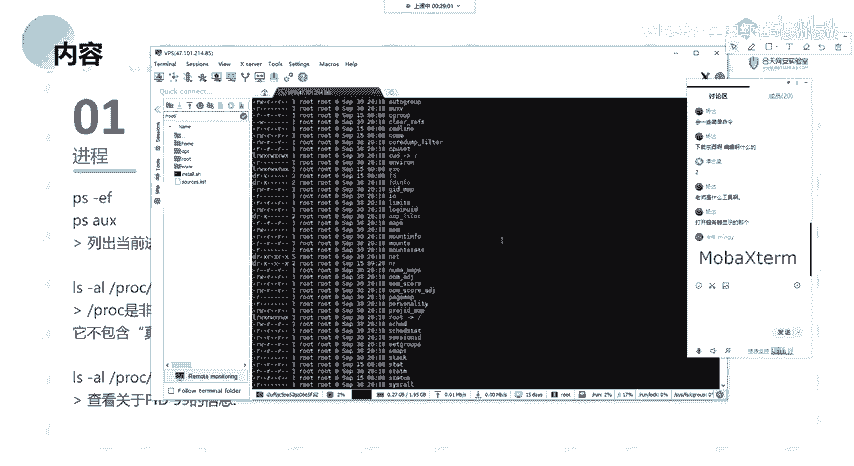

就没念啊。就是呃大家再去做这做做这种的话，去查找你的这个进程下面下面所运行的这样子的一个呃文件的话，因为它是一个虚拟的一个文件系统。它每一个ID它每一个进程ID它它里面会存有相应的这样子的一些文件。

就是它系统就是进程运行时候所需要的这样子的一些信息的一个文件。像比如说配置啊呃设备啊，系统的一些内存等等的这样子的一些东西。我们可以去这一个目录下面对应的一个进程ID当中去查找去查看。啊呃。

像L杠LPOC。这边的话就是查看这个PID99的一个信息，对吧？

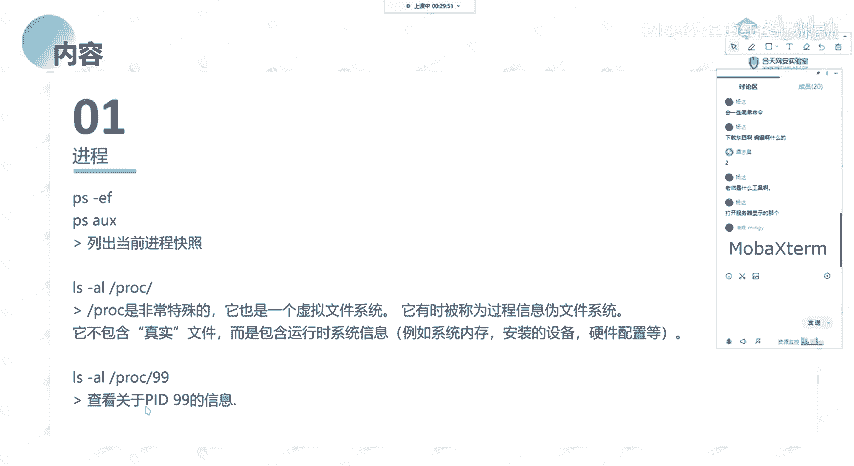

就我们可以通过这样子的一个命令。来去查看对应的这样子的一个进程。比说这边随便找一个进程。

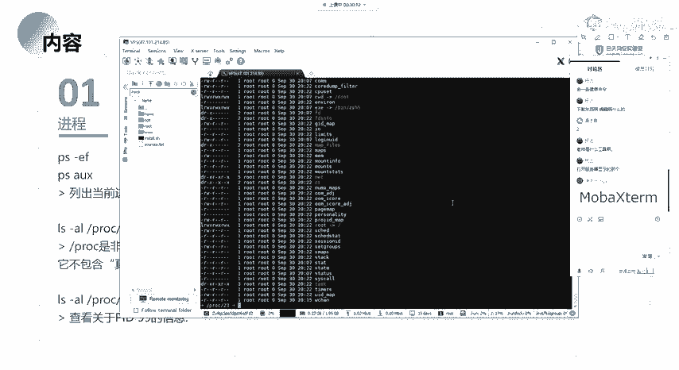

就是说呃其实就是查看这一个进程ID它的里面的一个文件吧，就是详细的一个信息。对吧。呃呃，还有的就是这一个top命令。top的话就是我们如果就是就大家搞运维啊什么的。

就是linux主机的相关的这样子的一些呃。去看去监控进程等等的。呃，大家有能看到吗？我这边它提示就是是断了吗？还是怎么的？没有问题是吧？好的，就是呃。

经常会去使用这样子的一个top命量来去显示我们的一个历ux机器的它的一个就活动，对吧？因为它我们前面的话。什么呀？😔，我们前面的话是通过大家能听到我声音吧，应该。能能好，那应该是没有问题啊。

他这怎么报这个呢？

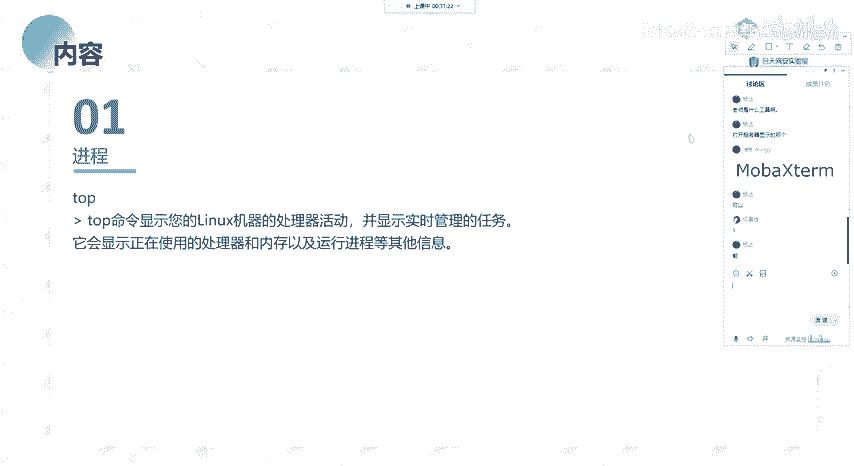

就是呃我们前面的话直接PS对吧？查看PS杠EF查看的这些信息的话，它是就是你查看的这一回，对吧？

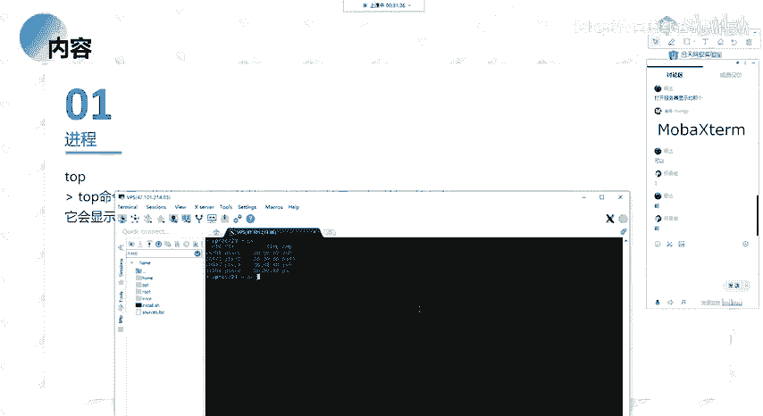

它的这样子的一些信息。然后我们使用top命令的话，它能够去实时的去就是显示你当前的呃这里的所运行的你当前系统下面所运行的这样子的一些任务。它会去实时的去啊更新。

以及我们可以根据就是比如说根据它的一个啊运行的一个内存，对吧？就是说它运行的一个内存的CPU的一个大小来进行一个排序，对吧？就是我们能够去找到呃当前系统下面有哪一些哪一个程序。

它所占的一个CPU是最大的，以及它的一个存储啊，对吧？然后在这边我这边的话因为是一个阿里云的一个机器啊。阿里云机器的话，它有这样子的一个阿里云对啊。

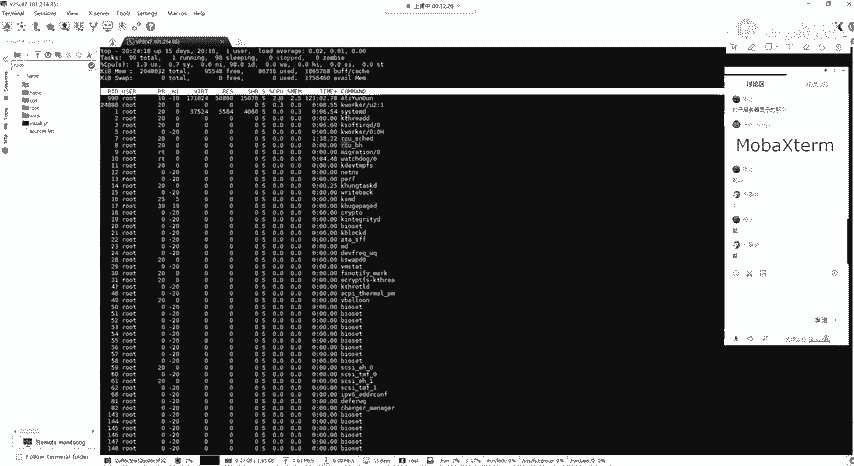

他是占的最多的。啊，关于这一个命令，他的一个详细的这样子的一个就是。把它孵出来。

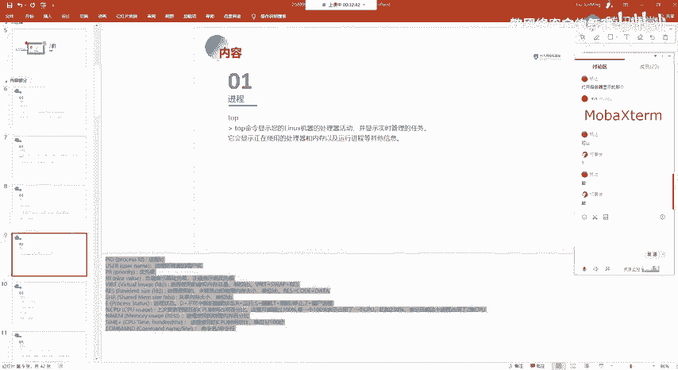

关于这个命令，它的一个详细的一个输出，我这边的话呃大概的说一下，就我们其实主要的话就关注呃。其实。如果大家不搞运维的话，对吧？其实也比较少用这个。当然的话这个命令也是常用的。

就我们只需要去关注这样子的一些信息啊。像比如说你的一个进程ID对吧？以及呃。还有CPU对吧？你CPU的一个占用的一个百分比，我们可以去查看。然后这边的话我就不一一的去说了呀。

以及还有你的这一个进程的一个优者，也就是你当前的进程的一个所有者是吧？

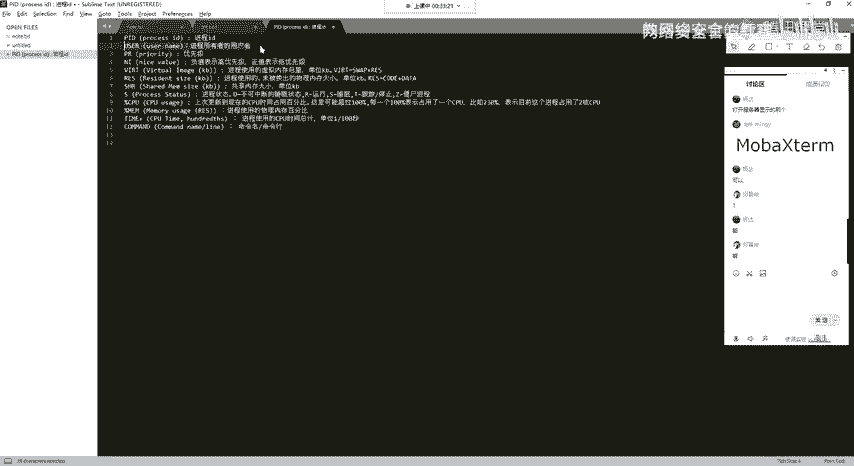

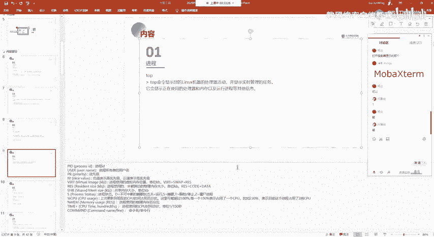

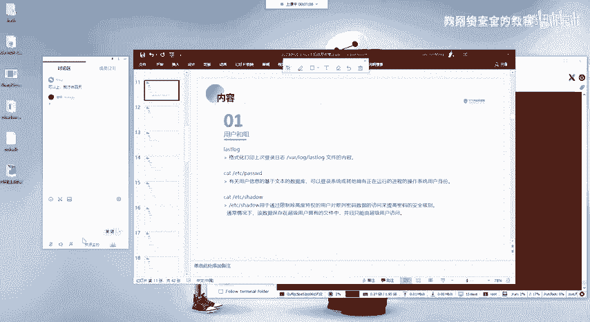