# 2024网络安全系统教程！清华大佬花159小时讲完的网络安全系统课！别再盲目自学了，学完即可就业！零基础入门网络安全！（渗透测试／漏洞挖掘／CTF／黑客技术） - P48：35.用户和组信息.mp4 - 教网络安全的红客 - BV1ft421A7Nj

然后第三个话就是用户和主，就是呃用户信息，还有主信息。我们可以通过这样子的一些命令，就常用的1个ID。ID的话就是我们能够去查看到当前的一个用户的1个UID还还有GID。

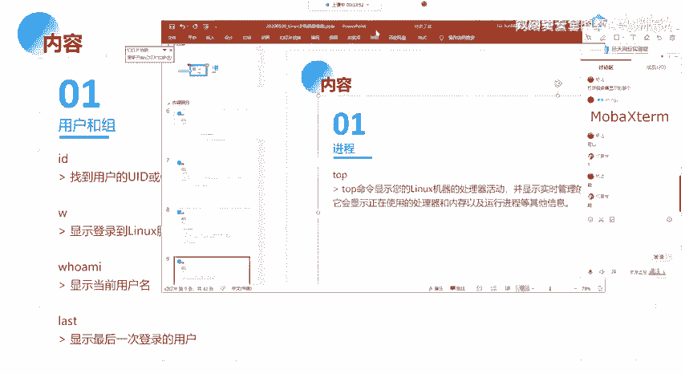

我就不全屏了，我就这样吧。比如说我输入1个ID对吧？然后在这边的话它会显示这样子的一个信息。这里的一个信息的话，它分别的对应的就是UID也就是我们的一个用户ID就是为ro。

比如是我当前的一个使用的一个用户的话，就是rootGID话就是呃主组就是表示你当前的一个用户它是处在处于什么组内，就是这里的一个root这边的一个gs也是。啊，表示你当前所处于的一个组。

也就是root组。因为我是一个root用户嘛。当然的话如果说你是一个普通用户，像比如说你通过wi share。对吧你通过web share，你得到的一个用户的一个权限，你可能是啊3W。

对吧相当的干ate，还有像阿帕奇。这样子的一个就是说这样子的一个普通的用户，像这一些用户的一个权限的话，就是你得到的。因为你是通过web share，其实你得到的一个权限的话。

就是那个web服务器的一个啊权限。这他的一个权限的话是比较低的一个权限。啊呃，W的话就是显示登录到linkux服务器的一个人人员。就比如说你当前的一个呃你当前的这一个呃机器，它是有多个。

就说有多个人去登录的对吧？那么你可以通过W来去查看到有哪一哪一些用户，就哪有哪哪几个登录的一个呃连接。然后在这边的话，我们可以查看到他当前所登录的一个用户，以及呃他是从哪1个IP登录过来的。

他登录的一个时间，对吧？我们都能够去查看到。然后换外卖的话，这个的话应该不用多说对吧？windows Linux下面都都都可以去使用这样子一个命令来去查看当前的一个用户。呃，TTY的话。

它是一个呃怎么说呢？这个我百度一下吧。

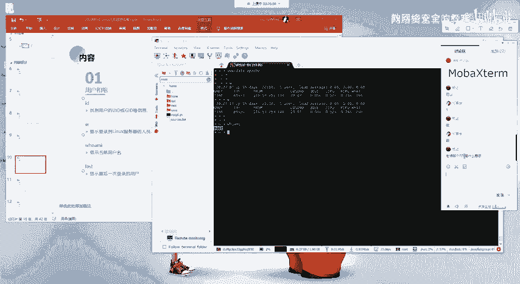

这个叫虚拟。虚拟什么？虚拟控制台。呃，关于详细的这个的话，你呃你想要去了解的话，你去百度一下吧。好吧，因为这个东西的话，说实话我没有说很去很关注啊。呃，配置空手口就是你TTY的话，就是说大家都知道吧。

就linux系统下面的话，它有多个这样子的1个TTY的一个终端，对吧？然后的话它有每一个控制台的话，它有这样子的一个优先级吧，还是呃什么呢？说实话我。

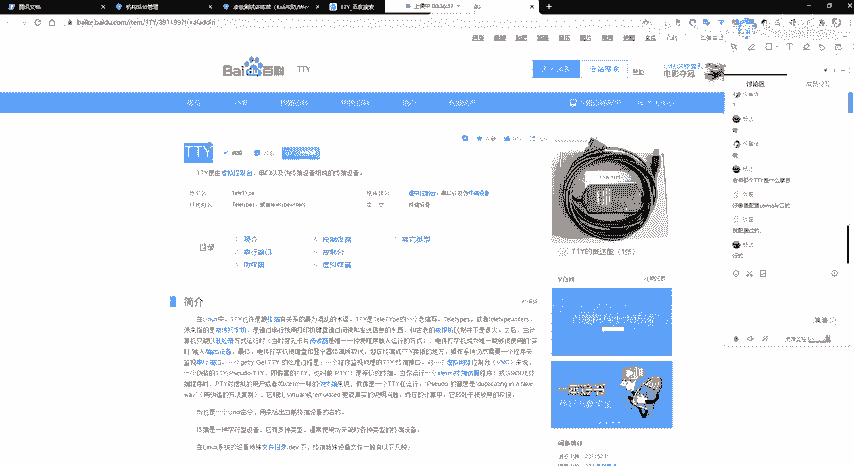

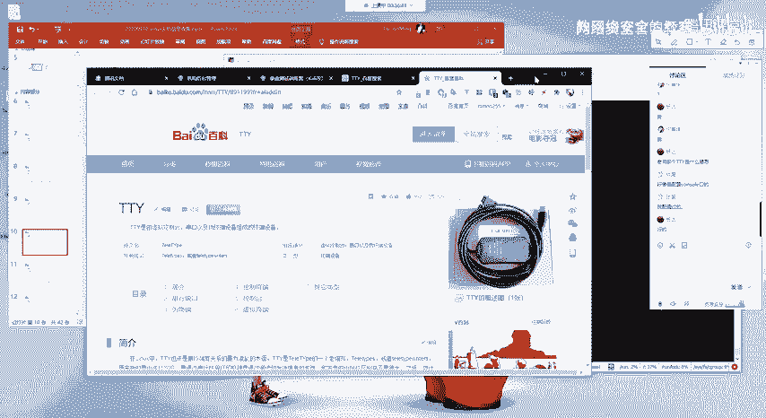

我有点忘了，就是。之前学金历史的时候，然后的话你比如说你在。呃。比如说我这边的一个看你的一个机器，对吧？它是有图形界面的，然后是TTY级的话，它是一个图形。

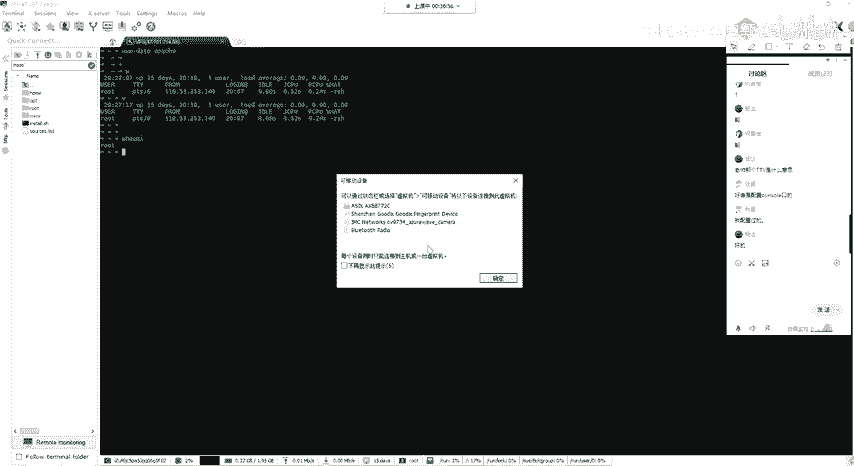

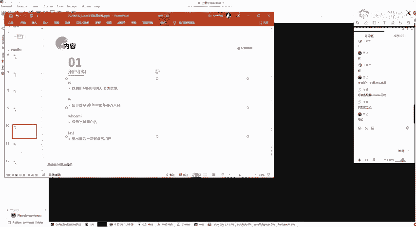

图形界面，然后的话TTY01的话，像这种的话，它是一个。

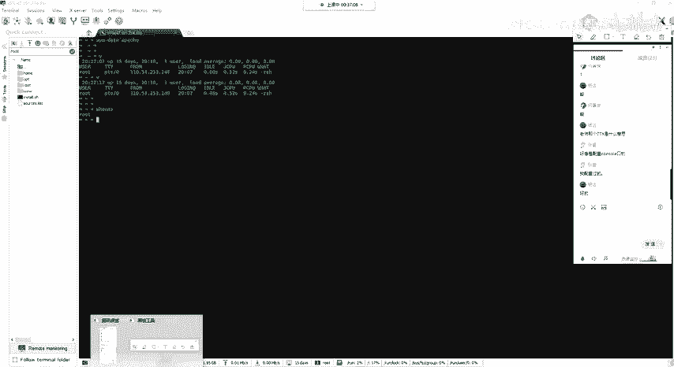

它是一个就是没有图形界面的，然后我们切的话是。ctrl加F几吧。Okay。锁掉了，然后可以看到我这边的话就迁入到了1个TTY5啊，就是conttrol加F5的话，对吧？

我ctrl加F4的话就切入到了TTY4。就它这个的话，它是每一个它是不同的一个呃一个控制终端。然后的话。呃，它具体的一个区别的话，我我这边有点忘了呀，你要去具体的去那个了解的话，你百度一下吧，好吧。

啊呃。就ctalF8的话，就是呃TTY。F8的话就能够去切换到我们这边的一个图形界面。

🎼大家可以用自己的一个看你机器自己尝试一下。就如果说你不想要这样子的一个图形界面，对吧？你可以直接切换切换到其他的这种TTY。然后的话你登录进去就直接就是没有图形界面，直接是一个终端的一个形式。

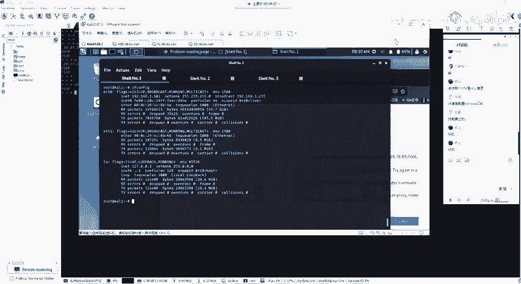

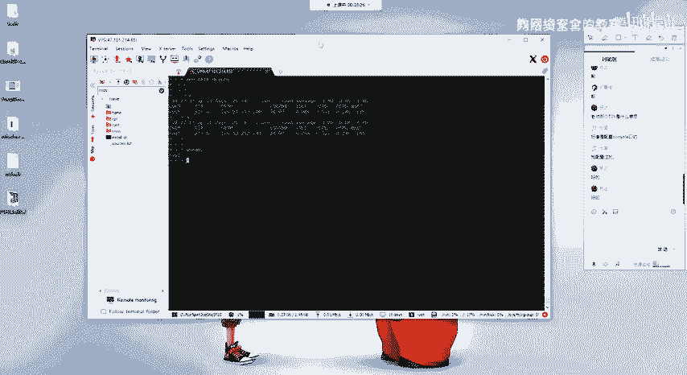

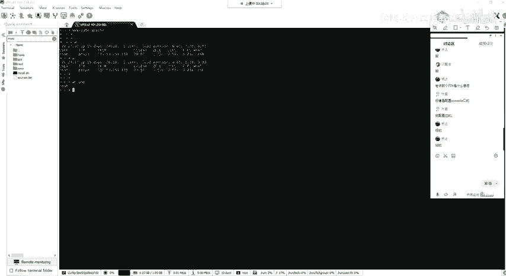

好，我们继续。呃，刚才的话讲到了换外卖换外卖这个面的话就是输出你当前的一个用户嘛，对吧？然后windowslinux下面的话都是比较通用的啊吧？

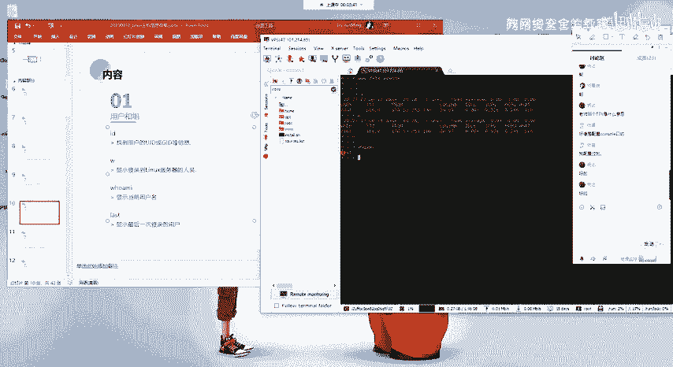

赶你外卖，哎，我这边。

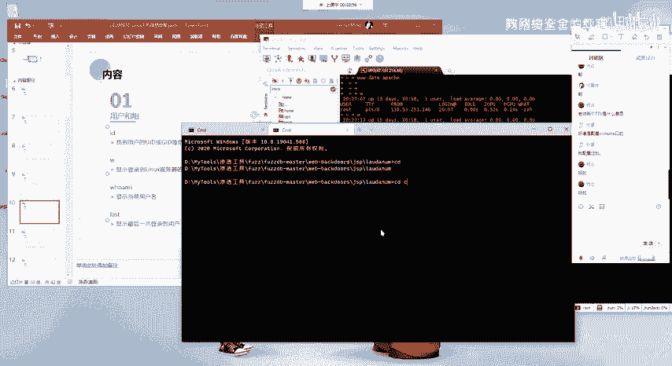

然后呃还有last last的话就是显示最后一次登录的一个用户。就是说我们通过last的话，能够去查看到呃当前的这样子的一个。

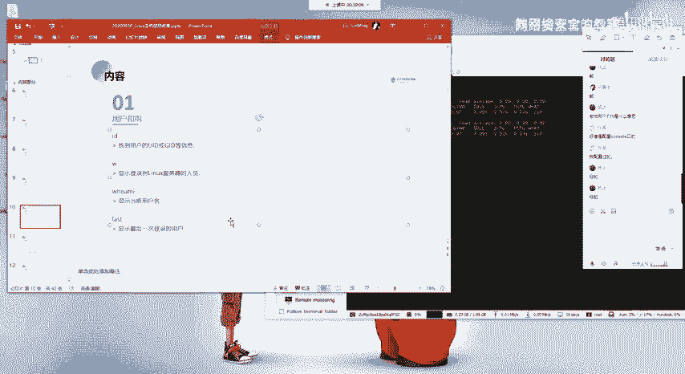

就是说当前这一个系统下面所最后登录的一个用户，在这边它会显示，就是说呃登录的一个记录啊，我们通过拉的话能够查看到就是。

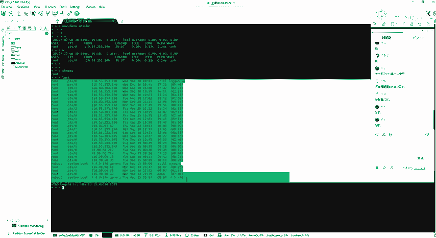

嗯。啊，比如说。比如说呃因为我这边的话是只有我一个人在用，就是使用的一个root的一个用户登录的。然后在这边的话，我们可以看到就是这一个root用户他是在什么时候去登录的。

以及他是从什么样子的1个IP登录的对吧？他我们都能够去查看到，以及在这边的一个时间，就他是什么时候登录的对吧？就我们可以通过las的命令来去查看，就说这一个系统它的1个root用户。

他是呃什么时候登录的。

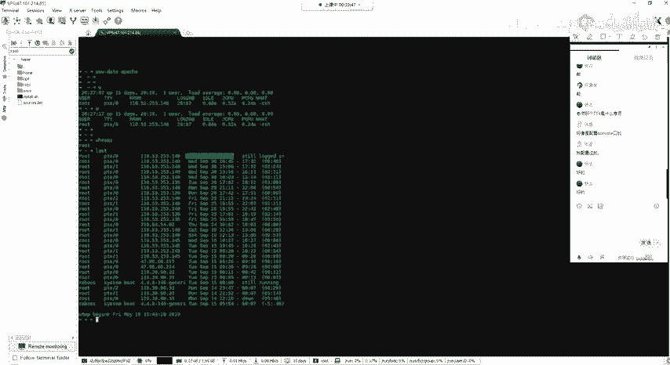

或者说他是。就能够去确定这个系统它的一个管理员，对吧？它是是不是有在登录。以及他最后登录的一个时间。然呃，last log拉 log的话就是打印我们上次登录的一个日志。我们直接执行之后的话。

它会在这边的话，它会输出就是呃这样子的一个一些信息啊。这边的一个信息的话应该啊比较好理解，对吧？在这的话，因为只有一个root用户啊，然后我们可以看到在这里就是他登录的一个呃信息。对吧。然后在这边的话。

我们可以看到是我这边是从这个IP过来的，登录过来的。然后登录的一个时间。然后呃还有其他的这样子的一些，就这边的话是其他的一些用户啊。

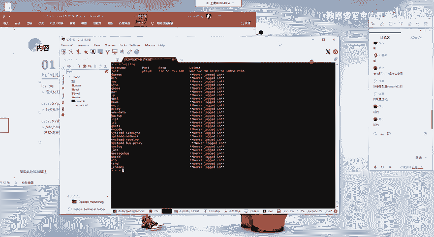

对吧我们通过就是CATT下面的1个password。在这个文件的话，我们能够去找到查找到就是对应的有哪一些用户嘛，这些系统的一些用户是吧？然后如果说比如说你有一个普通的一个用户。

然后的话你用普通的一个用户，你去进行一个登录，登录之后的话，他同样的会在这边有记录，就是说你这个用户他是什么时候登录的，他从哪里登录过来的对吧？然后像在这边的话，因为我只登录了一个root用户。

其他用户，其他的这些是一个内置的一些用户啊，他其实也是他是不允许去登录的对吧？

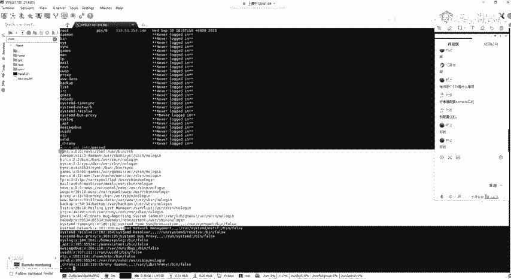

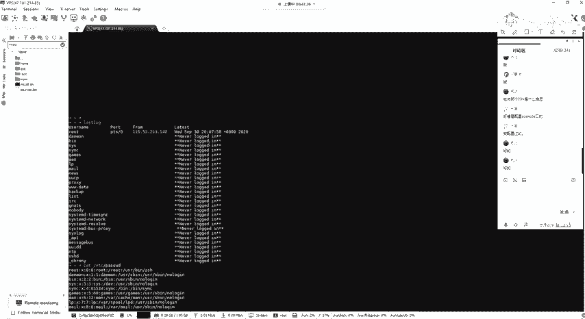

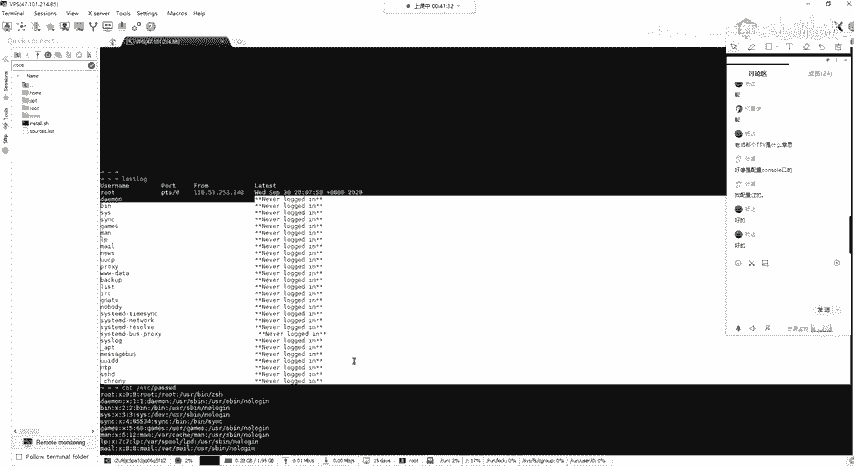

它是low log，就这边的一个伴喜的话，它是一个no no log的话，就是说表示这个用户它是无法去进行一个登录的。

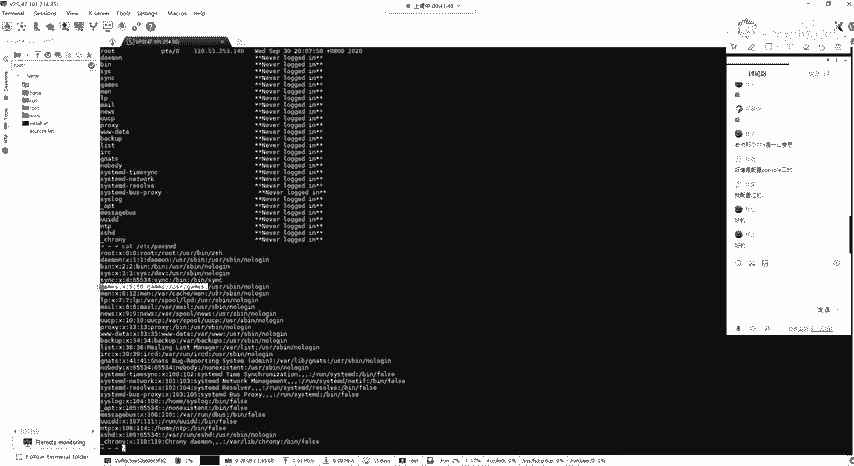

当时的话，因为他这种内置用户的话，他有。它有相应的一个作用，对吧？

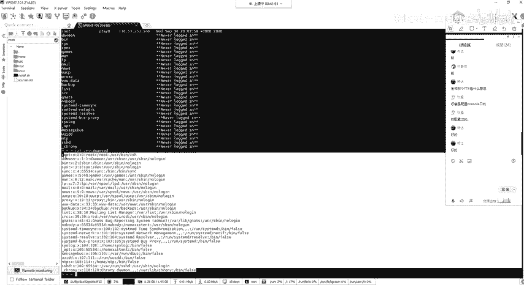

如果大家看自己的一个机器，有这种普通用户的话，也会有这样。你有登录过的话，他会有这样子的一个登录的一个记录。

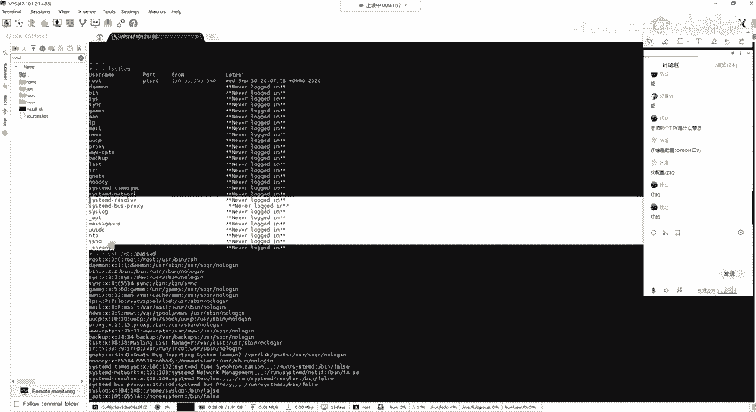

我们可以通过这个命令去查看。哦后呃还有的话就是这个ETCpasword刚刚也说了，对吧？这个文这一个password这一个文件的话，它里面的是存储的。当前系统下面的所有的一个用户的一个信息。

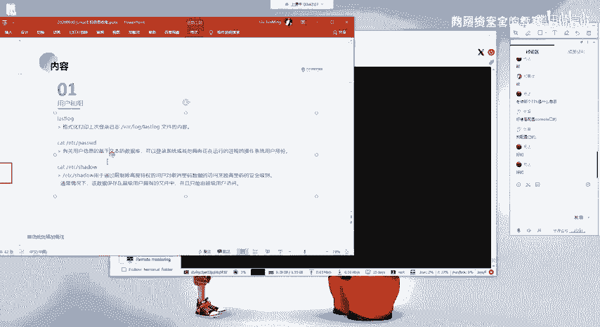

呃，关于这个的话，我大概的说一下吧，就这个文件就在后面应该也会讲啊，就这个ETC password word这一个文件里面的话，它存储的当前系统所有的一个用户。我们这边的话以这一个root用户为例。

这首先第一个的话注意的话它是每一个每一个。就每一部分的一个内容，它都是以这一个冒号去做一个分隔的。然后在这边的话是漏腿这一个用户。第二个的话。就是一个X这边的一个X的话，其实是一个就是占位符。

就它这边表示的话，就是说它原本的一个意思的话，其实就是说在之前的话，在之前没有采用这样子一个模式的话，在这边它是一个用户密码的一个哈希值。就这边的话是保存的一个用户的一个密码。然后在这边用X去代替的话。

就是我们后面的新的这样子的一个系系统的话，它是它的一个用户名用户的一个密码的话，它不是存储在这样子的1个ETC passwordword的一个目录下面的。就为什么它不存在这个目录下面呢？

我们可以通过LS杠L来查看一下这个。文件啊这个文件它的一个权限。其实我们在这边的话可以看到这个文件，它的一个权限的话，它是呃。主要的话看这里。这边的啊啊的话就是表示读嘛，读取嘛。

就这边的这一串的一个权限的意思的话就表示其他的一个任何用户，就除了root用户的其他任何用户，他都有一个读的权限，对吧？那么就是说如果说你是一个普通的用户，你是一个最低权限的一个用户。

只要你是一个用户的话，他都能够去读取读取这个文件的一个内容。那么如果说我们的一个密码哈希存储在这一个文件当中的话，普通用户他同样的也能够去查看到他的一个哈希值，是吧？

那么如果说他的一个哈希值能够去能够去被解密的话，那么那么我们就能够去得到相应的一个用户的一个呃权限。第二部分是同组用户的一个权限吗？你是说的这里吗？对吧？呃，前面在讲linux的时候，不是有给大家讲吗？

讲。讲那个环境的时候呃，讲那个历史环境的一个搭建，对吧？啊，我你进然弯的话，我再说一下吧，就是。这个的话这一个权限的这里的这个权限的话，应该其实大部分学历龄时的话都呃。可能都刚开始接触的话都会比较迷啊。

对吧？就是对这里的这一串东西它是什么，对吧？

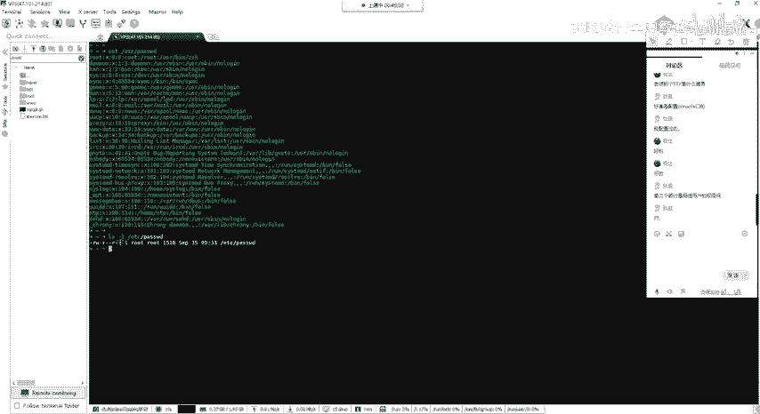

嗯。这边的话我再给大家，就是既然有人问的话，我就给大家再解释一下吧，好吧。那你你知道就是77770075，它是什么意思吗？对吧？你首先你需要知道嘛，好吧。

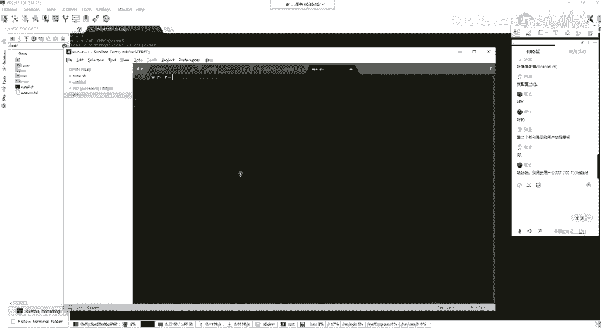

好，哦，在这边我以这一个为例，对吧？我们哎。

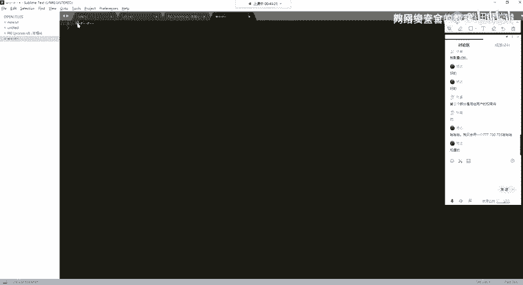

这边不对，还有个啊。

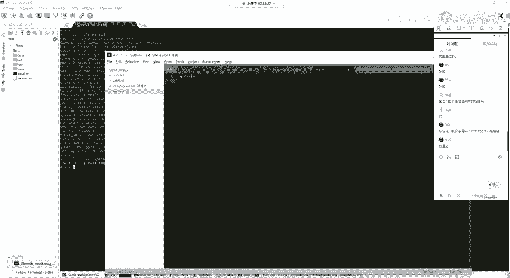

前面还有个干。我这边的话我们看一下，应该看得到这边的这一个权这边的话就是我们去查看我们的一个文件的话，它都会有这样子的一个东西，对吧？就都有前面这样子的一串。那这一串它表示什么意思呢？

就是表示我们的一个权限。

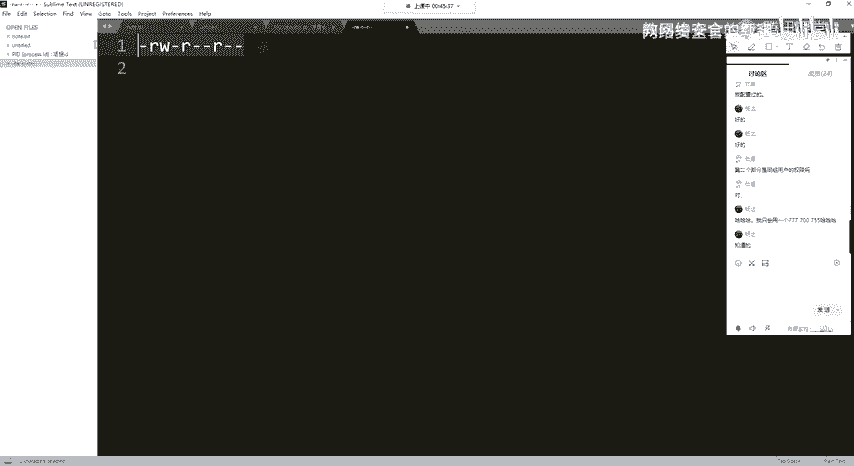

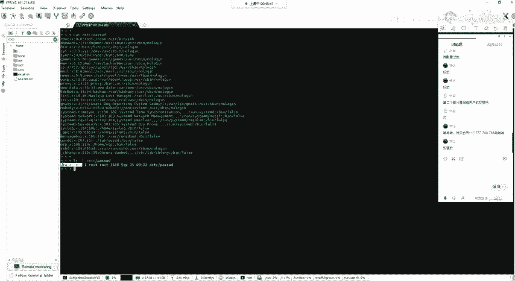

然后呃在这边话，比如说我们是一个rootroro对吧？这一个test的文件。那么这一个test的文件，我们怎么知道它是一个文件呢？我们看的话就是看到它的第一位。

就这边的第一位的话就是表示我们当前的这个呃当前的这个东西它是什么样子，它是一个什么东西，对吧？它可能是一个文件，对吧？它可能是一个目录，还有它可能是一些啊设备文件，对吧？那么在这边的话。

我们通过查看这里的这一个就是第一第一部分的这一个东西来去判断这边前面这里的一个干的话，就是表示它是一个文件，也就是表示我们这边test的是一个文件，如果是常用的，像比如说有个D，对吧？

那么就表示我们这个是一个目录。

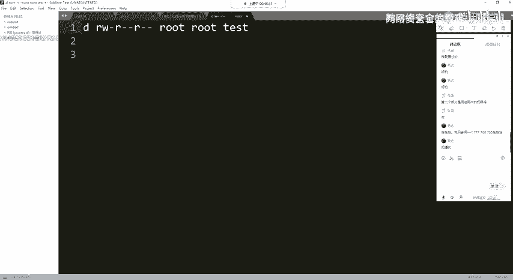

我们找一个目录来看一下，好吧。

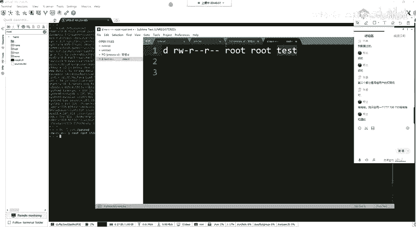

比如说就ETC这个目录，对吧？可以看到这边的话，它就是一个D开头的啊，我们要去查看目录的话，在这边也提一下，就我们要去查看目录的话，就是你L你要去查看目录的一个信息，要加这个干低的一个参数。

其实第的话就大家学lins不要去死学，就是要活活学啊，其实这一些命令的话，其实命令的一些参数的话都是很容易记的。就是你要当话你需要有相应的一个linux的一个啊，不啊英文的一个基础啊。

一些基本的一个英文的话，大家。都是就是九年义务教的话都能够懂的啊。然后这边的一个D的话，其实就是表示我们的一个目录就是dlecty。就是目录的一个意思。

以及DIR其实也是就是directory的前面的就是目录的一个那个那个那个前面的三个字母嘛，对吧？然后这边的话就是第一的话就是表示啊表示目录啊，就我们这边指定一个杠低的话。

就是表示我们要查看的一个信息的话，就是一个目录的一个信息。那不然的话，你L杠L的话，你查看的是啊这个ETC这个目录下面的一个文件，对吧？它的一个信息。

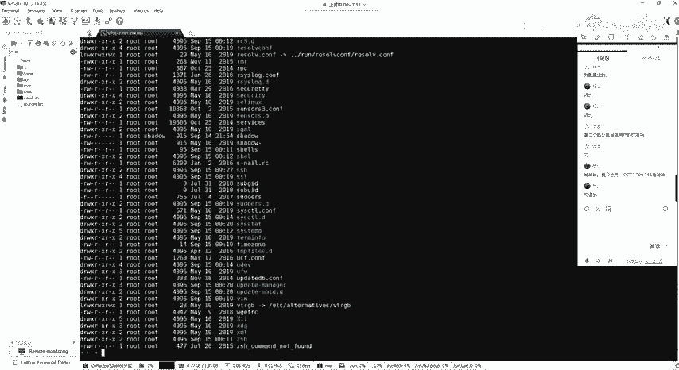

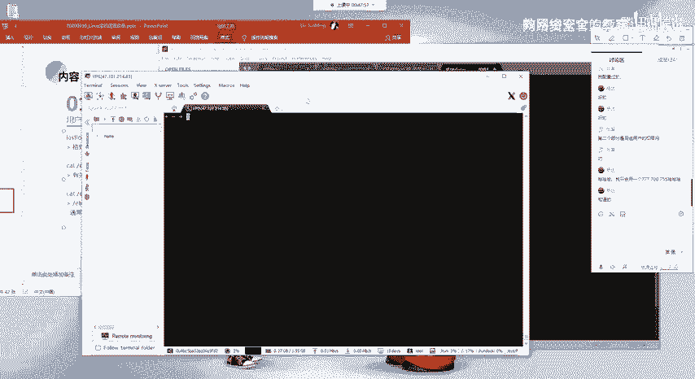

好，呃，我们讲了第一位。那么第二后面的这里后面的这这一部分的话，我们把它分成三部分。

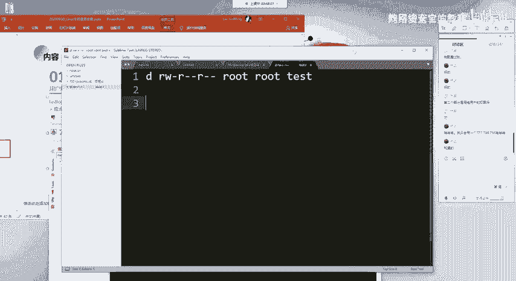

这三部分的话就分别对应的就是。首先第一部分就是我们的一个用户。啊，应该是说所有者吧。所鸭者。就说表示我们这一个文件，它的一个所有者是哪一个？就是说我们创建一个文件。

我们以什么样子的一个用户去创建一个文件的话，他这边的一个所有者的话，就是你的这一个当前的一个用户。然，后面这个的话就是所有组。就是。就说你的。啊。这里的这个文件它是这里的这个文件，它是属于什么样组的。

属于哪一个组的一个用户。然后在这边讲到所有组的话，就是说。啊，等会再讲吧，这边的话就是其他就是阿着OTHER就阿着其他用户。啊呃所有者的话就是U嘛，对吧？就是U着就是表示U着。

然后所有组的话就是主的话就是gve，就是表示G对吧？所以其实我们再去用全mod来去进行一个呃就是权限的一个。呃，修改的话会有这样子的一个U加X，对吧？或者是U减X。这个的话就是表示你的一个所有者。

他会去给一个X的一个权限，也就是执行的一个权限嘛，是吧？减的话就是把它的一个执行权限去除掉。然后分别对应的这边的一个，比如说这边的一个所有者，就是表示你当前的一个文件，所有者它的一个权限。

然后这边的话RW就是完整的一个权限的话就是。呃，RW。X嘛对吧，就是读取写入执行的一个权限。读取就是R就是read的。写的话就是。L子。X的话就是呃。XQ的吧，应该是。执行。然后呃对应的在这边的话。

就是你有有这一个位的话，就是有一个R位的话，就是表示你这边的呃所有者，也就是这个root用户，它有一个读取的一个权限。有W的话就是有一个写的权限。然后在这边一个横杠的话，就是表示它没有这一个权限。

也就是相对应的这边它是没有一个写的一个权限。然后呃同理所有组的话，就所有组的话，就我们每一个用户的话，它都有相对应的一个组啊。就是这里的一个组的话，就表示比如说我是一个root组，然后我有一个用户。

我是一个。呃。tom用户。然后的话这一个tm用户的话，他呃。我把它这一个tom用户，它加到了一个root组当中，对吧？那么在这一个root组当中，如果说比如说这一个文件这一个文件的话。

它对一个root组的一个权限啊，这个这个它的一个root组的一个权限是R，对吧？那么这一个文件，就说在这一个本来它是一个普通用户，对吧？他一个普通用户，他在root组的话，他这一个普通用户。

他同样的可以对这个文件有一个读的一个权限。因为它是属于一个root组。如果说在这个root组当中有。W的权限话就是可以对他进行一个写入。而阿着其他用户的话，这边的话就是O嘛。

哦的话表示阿着其他用户的话就是表示除了ro成。对一个用户的话，像比如说我你自己创建的一个用户，叫普通用户看你。你这一个普通用户的话，它不在root组当中，它也不是root用户，它属于一个其他的一个用户。

那么这个其他用户的话，他在这边的话就是对应的这边的一个权限。像比如说这边他其他用户的话，只可以对这个文件有一个写的一个啊，不有一个读的一个权限，对吧？那么就是说你不是root用户。

他同样的能够去对这个用户对这个文件去进行一个读取。以及还有的话就是这位同学他说的这样子的一个数字的一个表示。就如果你刚接触00时的话，你可能不明白，像这种777对吧？你可能。什帽的。呃，755。20的。

这样子的一个文件，你给这个文件要付1个75的一个权限。那么这个75的一个权限对应的它的一个就是说对应的这样子的一个权限它是什么呢？就是我们知道这边的1个RWX对吧？RWX的话。

它对应的这样子的一个权限的一个数字的话就是4。啊。421。呃，1242页吧。442424421吧，我没记错吧。啊，没错没错。就是呃对应的就是421。然后的话如果说我们这边比如说我们这边对吧？

我们要去表示这边它的一个权限，用数字的话去怎么表示呢？就R的话对应的是4嘛，对吧？就是4嘛，然后W的话对应的2就是4加2嘛，也是也就是表示这边的话是6嘛，这边的这一个就是6嘛，然后同你这边RW也是6嘛。

然后这边R的话就是4嘛。对吧加法应该能算吧，所以的话这边的它的一个权限的话就是1个664的1个权限。如果说我们想要给这个文件付一个这样子的一个权限，那么我们就可以通过。个猫的。加这个664。

然后指定这一个t的文件就能够给到赋予这样子一个权限。就同理比如说这边755，对吧？我知道它是1个755，那么它对应的一个权限是什么呢？对吧？七的话就是表示所有的就所有它。RWX它都有这样的一个权限。

因为我们RWX加起来421加起来就是7嘛，最大的话就是7。对吧其实也就是说这边的话就是RWX的一个权限。五的话就是五的话就是4加1嘛，对吧？就总共的话就这样子的组合嘛，就是。呃。一对吧。啊。

44加24加12加1这样子的一个加嘛，还有的话就是124嘛。当然的话其实我们常用的就是这样子的一些组合。这边我的话就是表示。呃，R杠X对吧？就是。🎼有读取游戏执行的一个权限，同你这边的话也是R杠X。

就是对应的。我这样讲应该能清楚啊。能理解吧，如果这样讲还有问题的话，那那不应该啊。我个人觉得是讲的很详细了，就是关于这个权限的话啊这一块。就大家这这里的话，这种东西的话，自己用多了的话就很熟了，就会。

好，那么我们。呃，休息一会吧，现在已经。好好，我们继续。呃，其实这里的话这一些东西的话，其实这节课的这些命令，我觉得我个人觉得是挺枯燥的呀。这个可能大家也不知道大家怎么样。就这边的一个内容的话。

其实因为就是一些命令一些命令的一个使用。呃，然后主要是考虑到考虑到有挺多同学，就是对这些东西不是很了解，对吧？就考虑到大家刚接触这一块，可能你前面玩的，你前面。

前面十几年都是玩的windows的一个系统，是吧？然后因为lininux系统的话都是呃都是就是说我们在后面，尤其是我们自己去做相应的一些东西的话，都会去使用到lininux一个系统。就是你用习惯了的话。

你会发现linux系统。就是很多时候确实会比windows系统会很用很用好多。就好用很多会。哦呃我们前面的话讲到这1个ETC需要的这个文件，对吧？这里的这个文件的话。

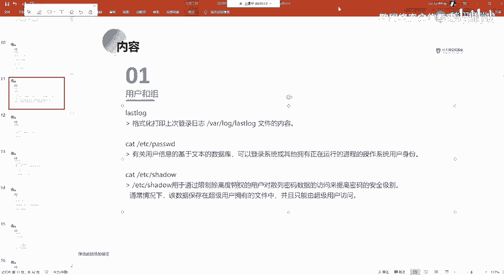

呃。

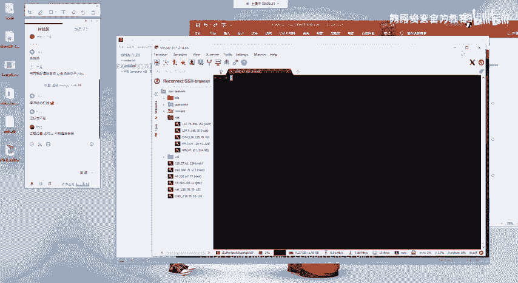

你他说的这个文件。然后呃后面这边的话就是表示的你的1个UID以及GID就root用户的话，它默认的话是0啊。就默认的话，它是0，然后的话就是呃。我们其实可以，就是说我们如果说你是一个普通。

然后这边的1个UIDGID它其实是就是表示的就是你的一个所对应的一些权限。然后如果说你把一个普通用户，比如说你创了一个tm的一个用户，对吧？你把这个用户，你在这个ET pass这个文件当中。

你把它这个tom用户的1个UID以及GID把它改成零。那么那么你的这个tom用户的话，其实就具备了这样子的一个ro用户的一个权限，你可以去试一下。好呃，对应的这边的话就是。呃，你的一个ro的一个。

这个是这个是啥呢？呃，这一部分我有点忘了呀，呃大家自己去那个好吧，因为我不是记得。人的记忆力是有一有限的，对吧？这边的话大家尽量。啊哦后面这边的话就是干root的话，就表示你的这个用户他的一个加目。

就是root用户的话，他的一个加目的话就是干root嘛，对吧？你一个普通用户的话。普通用户的话，一般你创一个用户的话，他会在这一个后门目录下面，对吧？我这边的话没有其他的一个用户啊。

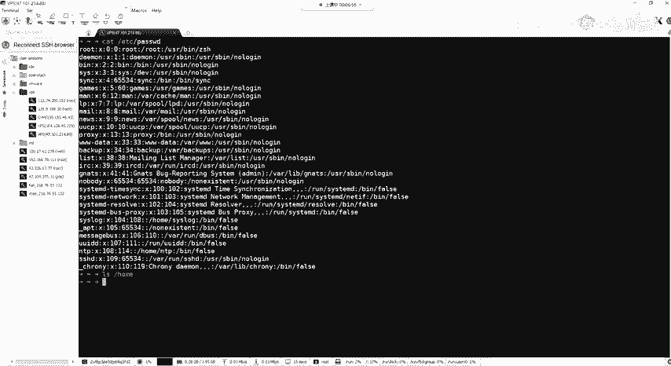

在在这个机器上。

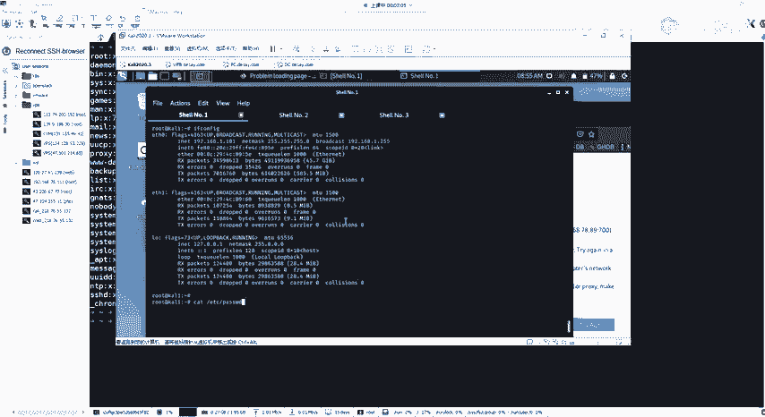

比如说我这边的一个卡里用户，对吧？他的一个。home目录就是这个home卡，对吧？我们可以在这一个home目录下面能够去找到有这样子的一个。啊，木录。然后这边的这个咖里目录的话。

就是这个看你用户的一个加目录。然后如果说你是使用的这个咖里用户去进行一个登录的话，那么你是你的这些。文件啊什么的，它都是会在这个看你的一个就默认的话，它是会在这一个home卡你这一个目录下面。

然后以及最后的这个这个的话就是表示你的一个你登录的这样子的一个呃he。我这边的话是使用的1个GSH啊，默认的话它是一个bech对吧？还有的话就是。呃，向。咖里还有疾病啊这样子的一些系统的话。

它那一个需要的话，它默认的话是病半小。当样的话你也可以就把它改成并SH嘛，还有其他的这样子的一些需要。然后呃主要的话就是我们会发现还有其他的一些用户有这样子的一个干U log对吧？

如果说你指定的是这样子的一个呃路径的话，就表示这一个用户的话，他是没有一个登录的一个就不能够去允许登录的，这个不能去登录是什么意思呢？就比如说我SH对吧？我SH我要去登录这个机器。

那么如果说他是这样子的个U log。这样子的一个东西的话，那么我们去SH去登录这个机器的话，用这样子的一个用户。比如说我用这个3W杠d这个用户，对吧？我要去登录这个机器的话，你会发现你是登不上去的。

因为他无法去登录，它没有相应的一个这样子的一个需要的一个环境。这个话是pass word这这个文件。然后呃大家只需要知道，就是它里面存的是这样子的一个用户信息，以及呃普通的一个用户。

就是其他的普通的这种用户都有一个权限去读取去查看。然后下面它就是这个ETC的一个需要的这个文件。这个文件的话其实就是对应的我们上面刚刚讲到这边有一个X，对吧？

这个这个X的话就表示是存储的一个密码的一个哈希。那么这边的一个X的一个值的话，它其实是放到了这个ETC需要的这个文件当中。然后我们在这边的话可以看到我这边的一个漏水用户，他的一个哈西的话就是这一串。

就这这边的一部分对吧？它是一个加密的一个哈希哈希值，它存储在这个需德的一个文件当中。然后其他的一个用户的话，因为没有。

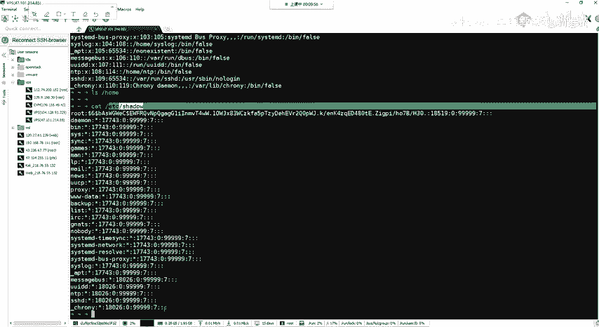

无法去登录，对吧？他没有密码，所以的话他没有这样子一个哈希。

然后为什么就说这一个需要的这个文件的话，我们同样的来查看一下它的一个权限。就他的一个权限的话，它是只有root用户以及root组的一个用户，他才有而不是root组，是这个消组。就只有肉肉水用户。

他才能够去读写。以及这个校的组，他才能够去读。然后其他用户的话，他是没有任何权限去进行一个读取的。对。也就是说如果说你是一个普通用户的话，它是没有权限去查看这一个文件的。

也就是查看不到他的这这边的一个哈希子。

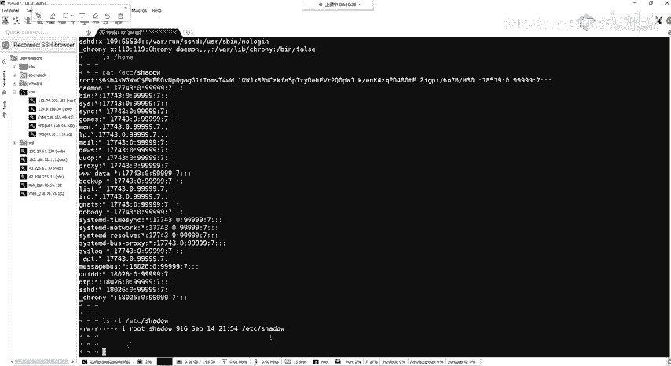

边敲边看呃，对的，就是我这边说的话，你就边敲嘛，对吧？Okay。然后还有其他的这样子的。啊，这个收das。

这一个文件收的是这一个文件的话也是比较。重要的一个文件。我们可以开始来查看一下这一个ETC这一个s的这一个文件。你看这一个文件的话，我们主要去关注的一个内容的话就是在这边。这边的这个内容。

就这边的话我们可以看到这边是一个root用户，然后or等于or等于or，对吧？就表示说呃只有root用户，它是有一个特殊的一个权限。

就是因为我们root用户的话在硬时它是一个最高的一个最高权限的一个用户嘛，对吧？然后的话这一个文件的话，它我们可以在这里一个文件当中去添加一个特权的一个用户。这个特权用户是什么意思呢？

就是说我们可以通过收度这一个命令来把一个添加到这一个用户啊，添加到这个文件当中的这一个用户，来把它暂时的提提升到我们的一个root的一个权限。比如说我们可以通过收据。啊，收度。SU。ro来去。

如果说你当前的一个用户，比如说我当前的这个需要，它是一个看你的一个用户，他把我把它添加到了这里对吧？我把它看你，然后或等于我，也就是这个看你用户，他拥有root的一个权限。

那么我就可以通过收度SUro来去切换到。来去切换到这样子一个root的一个用户。然后你执行之后的话，他会因为我这边话是一个root用户。你执行之后的话，他会。他会让你输入看你的一个用户名的一个密码。

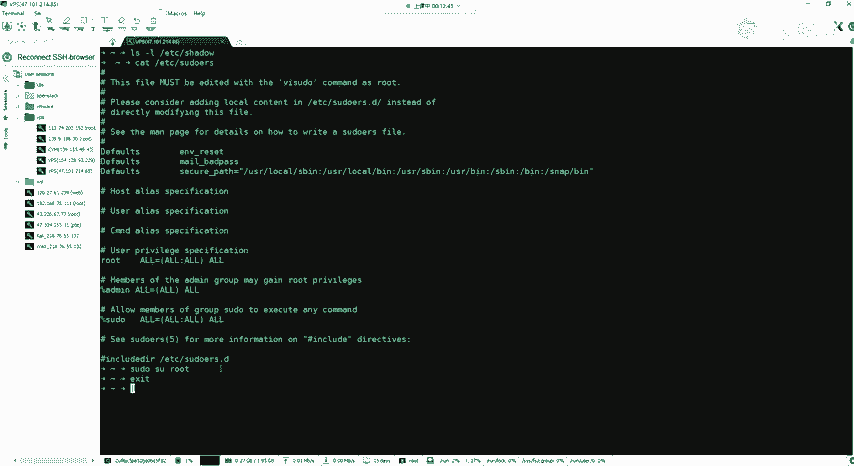

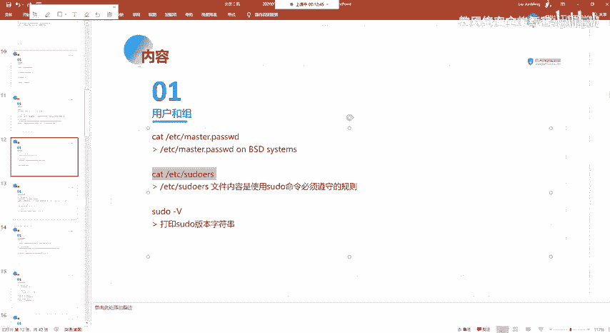

在这边的话，我看一下。不是。这边也是这样的。

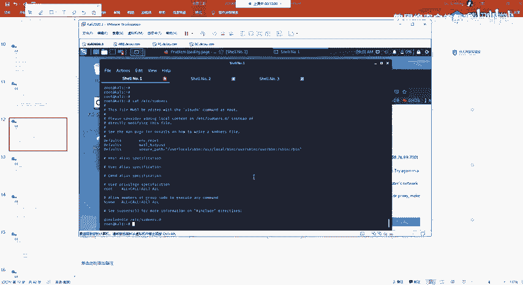

🎼这里的话是这一个文件，就我们可以通过收度这个命令来去进行一个临时的去把它提升到一个root的一个权限。就我们可以在执行，就比如说有一些命令，对吧？他需要root用户才他才能够去执行。

那么我们可以如果是你是一个普通用户，你可以去执行收度的话，有收度执行收度这个命令的一个权限的话，那么你可以用收度这个命令来去执行原本只有root用户，他才能够去执行的一个命令。然后收度杠率的话。

就是查看你收度的一个版本。这这个的话不用多说了。

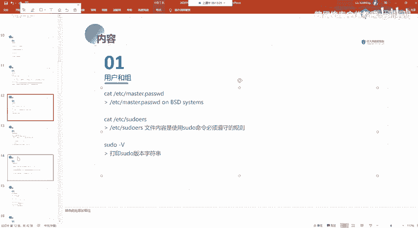