# 2024网络安全系统教程！清华大佬花159小时讲完的网络安全系统课！别再盲目自学了，学完即可就业！零基础入门网络安全！（渗透测试／漏洞挖掘／CTF／黑客技术） - P49：36.linux中SSH服务信息.mp4 - 教网络安全的红客 - BV1ft421A7Nj

好，下面的话就是SSH取的一个服务信息。就SSH的话，我们就是去登录一个历子系统的话，通常会去使用这样子的一个SSH对吧？然后SSH的话相关的一些东西的话，我们主要的话看这一些。

首先第一个话就是这一个auorize kiss这个文件夹。这个文件夹的话，它是存放在我们的一个。

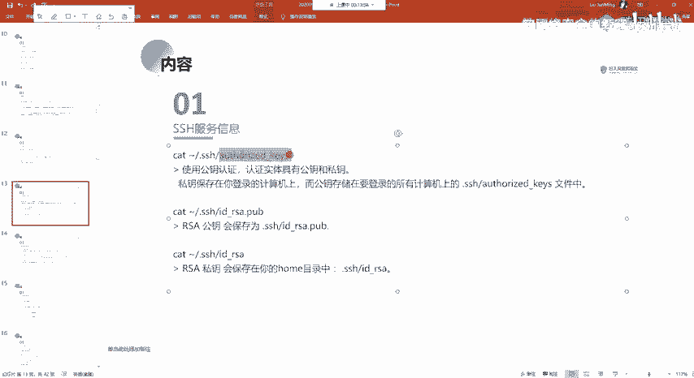

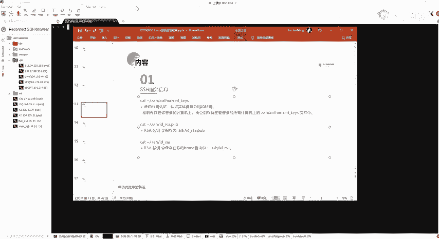

这样子的一个用户下面。这样子这个目录下面。我们CD干肉。到漏ot用户下面的话，你L你查看的话，它是只有这样子的一些呃文件以及目录，对吧？然后的话有其实有一些隐藏的一个文件，这些隐藏的文件以及目录的话。

它是以点开头的。我们可以通过L杠LA。还去查看到所有的这样子的一些文件，就包括这样子你点开头的这样子的一些隐藏的一些文件，对吧？然后在这边的话，我们就能够去查看到有这样子的一个点SH的一个文件。

这个文件不是文件，这个是一个目录。我们可以CD到这个目录下面，然后在这个目录下面的话，你就会发现有这样子的一个文件 key kiss这样子一个文件。这个文件里面的话，它是保存着我们的一个公钥。

就我们再去进行一个登录的时候，它会有在呃就是说。

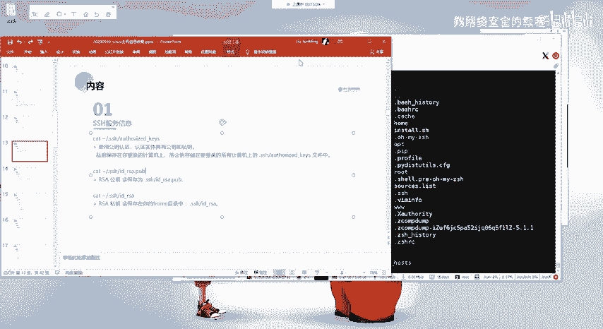

呃，我们大家知道SO取得一个名义登录吗？就是敏密登录，就是可以通过配置这样子的一个啊收度杠L也可以去查看到，就是你呃就是可以去使用收度这一个权限的一个用户啊。好吧。

就是当前用户可以去使用收度的这样子的一些命令，我们可以通过收度杠L来查看。大家知道SH名密登录吗？就是可以去呃通过配置这样子的一个公钥以及私钥来去进行一个不需要去输入密码。来登录一个服务器。

因为我们有时候的话有这样子的一个需求，对吧？因为你的一个密码，你不设置弱密码，那么你的一个密码的话是比较复杂的那这一个密码的话，你可能难记就比较难记，对吧？然后的话你要经常去访问去登录这个服务器。

所以的话我们可以通过这样子的设置一个公钥。纲要的一个方式来去进行个免密的登录。下午干配。哦，这边的话我就大概的介绍一下吧。就是这个文件里面的话，就是存放着一个公钥。这个公钥的话呃。

首先你需要去生成一个私钥，也就是这边有1个IDRSA呃，以及有这样子的1个POB这个的话都是通过这样子的一个命令SH干。P减这一个命令来去进一个生成的。

我们可以通过这一个命令来去生成这样子的一个私钥以及公钥。

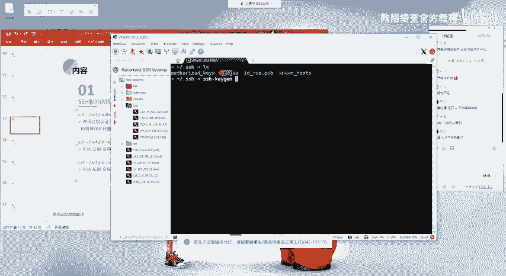

然后我这边的这一个机器的话，是要去登录其他机器的对吧？就比如说我要去登录其他的一个机器，那么我去通过这样子一个命令生成一个私钥以及公钥。然后的话我当前的这个机器要机器的话，它是存储着公钥的。

然后我要把我这边的一个啊，不不是公钥，是私钥，我要把我这边的一个公钥，把它放到我要去名密登录的那个机器上面。

就是把它放到那一个机器上面的这一个文件里面。然后这边的话我没有去配置这个，所以的话没有。我找另外找一个机器啊。哦，这个机器吧。

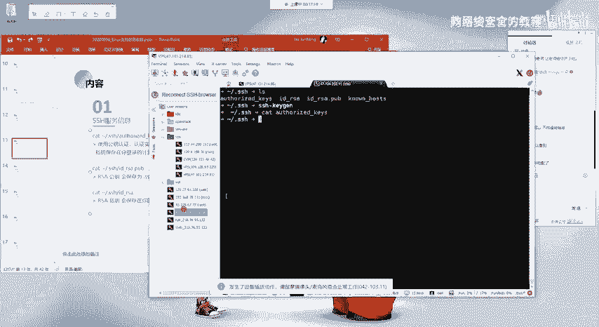

然后这一个机器的话。我们可以查看一下这里的一个。Alsoso with the case在这边的话，它就有这样子的一个这一串，对吧？这一串的话其实就是我们这边的一个。

没。这边的一个公钥。对吧就是我这边生成的这个公要，把它放到这个文件当中，我。

当中去，然后的话我在这边去进行一个登录这个机器。

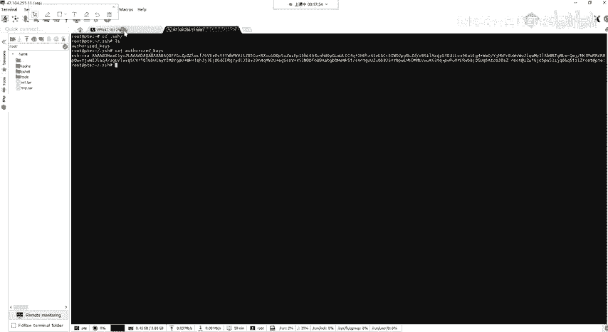

你有点卡啊。😔，SSH我去登录这一个。17。104。嗯。

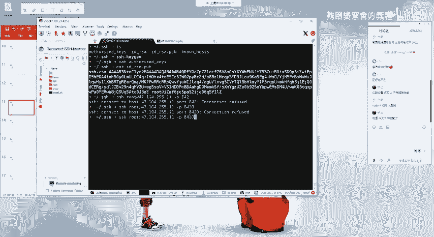

8什。然，可以看到呃，我在这边的话，我去进行一个登录这个机器的话，你会发现我这边它其实没有输入密码，对吧？直接就进行了一个登录，然后的话登录到了这边的这个机器。这个的话就是通过这里的呃一个公钥以及私钥。

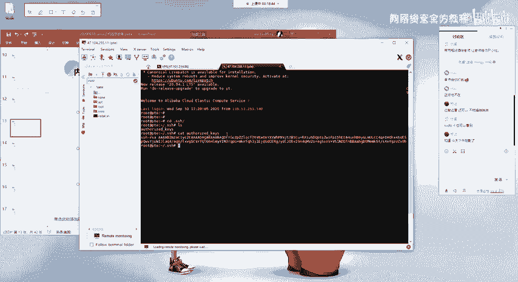

同意定。好的。还进行了一个免密灯。然后的话在这边的话就是呃其实这边的话就已经讲了呀，对吧？就是这边的话就是SRSA的一个公钥，它要保存到这一个目录下面，以及一个私钥。私钥的话。

它是保存在你自己的一个服务器上面的一个机器上面的。就公钥的话，你可以你可以放到其他的任何的一个机器上面。私钥的话，只保存在你的自己的一个服务器上面，对吧？

因为你要你需要通过这个私钥来去与这个公钥去进行一个认证。

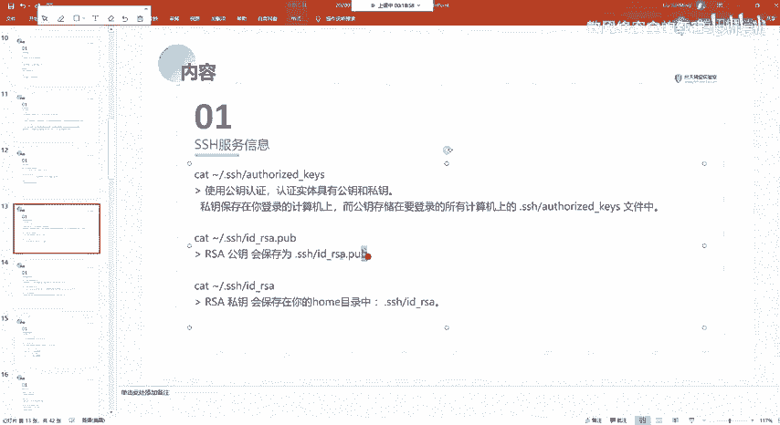

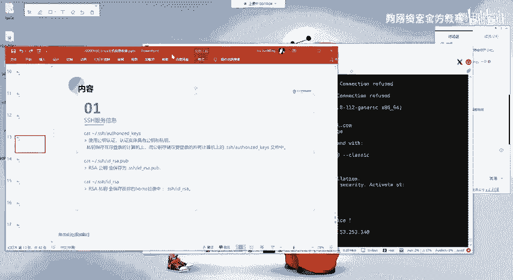

来表明你的一个身份是吧？然后的话你可以把你的一个公钥放到任何的一个其其他机器的这一个文件当中，那么你就可以在这在这一个机器上面。需不需要密码的去登录任何的其他的一个机器。

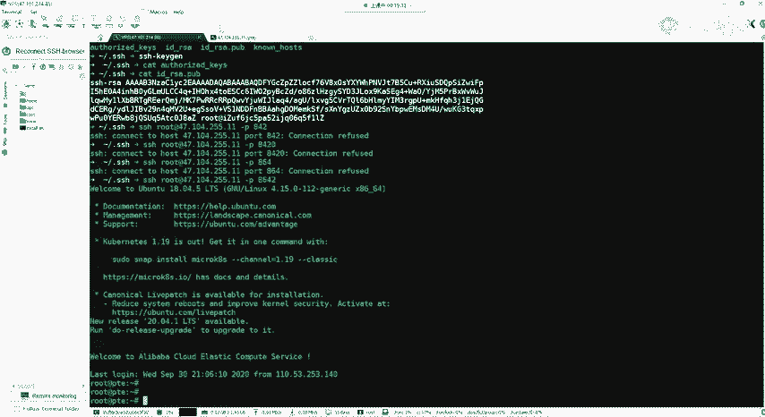

Okay。嗯。哦呃，这个nono one host。嗯。通有点卡。食哦。忘记充电了呀，我这边的话。电脑要没电了，所以的话有点卡，我说怎么呢？

然后呃这边的一个no host的话就表示你SSH你访问过的一个机器的话，它的一个公钥它都会记录在这一个文件当中。就是说比如说我这边对吧？我这边的话就有这样子的一个文件。

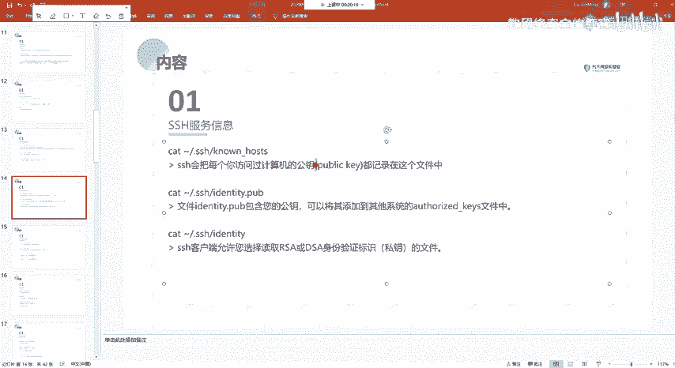

然后的话在这里的话，它就存放着我登录过的这样子一个机器，它的一个功钥啊。嗯。有。

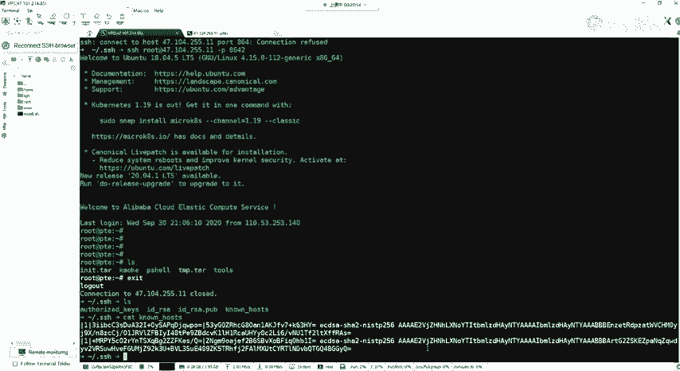

好，我这边的话是有两个。第一个第二个。呃，还有其他的这两个文这两个文件的话呃，我就不一一的去查看了呀。就呃这两个文件就是分别对应的，就包含公钥。其实像这种POB对吧？还有这个它就是私钥是吧？

有这种顶POB的话，这种文件的话，它里面的话都是存放的像这种公钥的。就POB的话就public嘛，就是公开的这种。就给你藏出来。Yeah。哦还有的话就是SH的一个配置文件。

就配置文件的话就是在这里啊有ETC下面的1个SHSH空fi空fig。这这这边的话是一个控制端，以及有服务端的一个配置文件。就我们一般的话是。

就查看这一个。

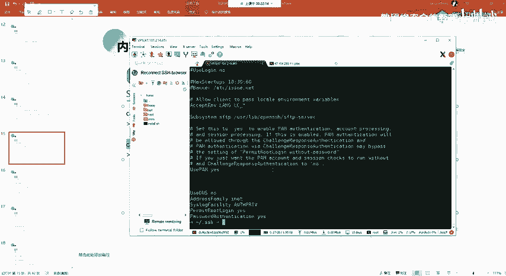

服务端。对吧然后的话我们像我们要去配置我们的，就我们一般的你的一个。机器我们的一个机器。你刚创建你刚创建的话，你要去开启你的，你想要去SS去登去登录的话，你都需要去这一个文件当中去配置，对吧？

然后配置的话点配置的东西的话，其实就是呃要去配置这一个。啊，看。Yeah。有一个就是。哎，我这边怎么没开上？有一个这样子的一个papait rot log，就是这一个我们需要把这一个就是改成为yes。

对吧？就是表示允许root用户去进去进行一个登录。然后的话如果你不改的话，就是说你的一个root用户的话，它是无法去进行一个登录的。

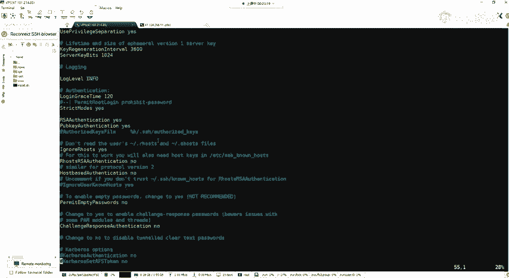

像我们那一个咖里的话，我们要去要想去SH去登录的话，都需要。首先要去更改一下这样子的一个配置。

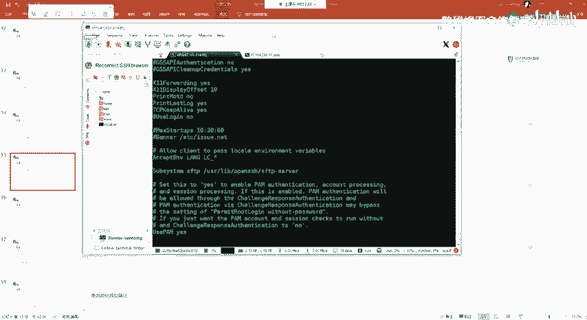

以及我们想要去更改，就是说我们SH的一个开放的一个端口。因为默认的一个端口的话是22嘛，是吧？

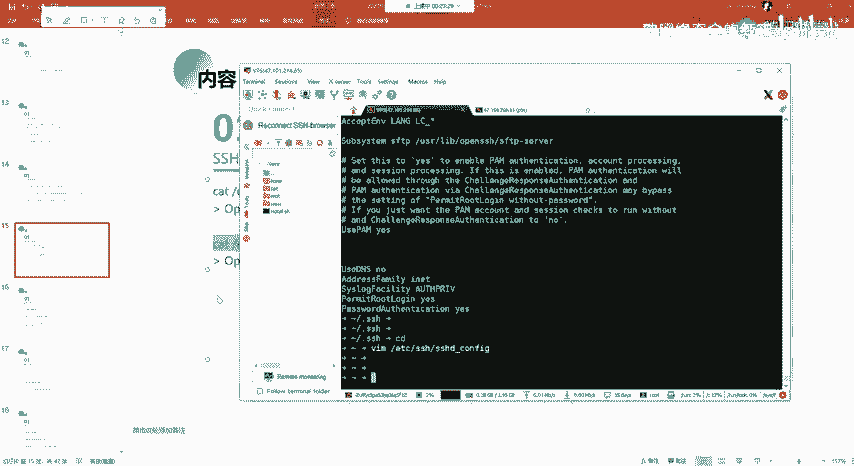

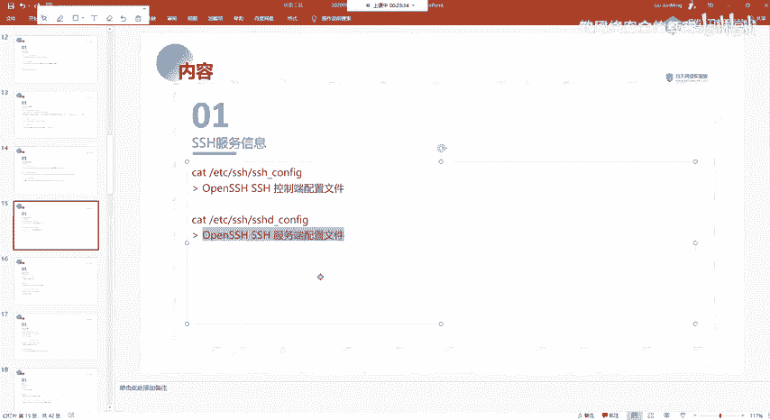

然，我们可以在这边去更改这边今天的一个端口。

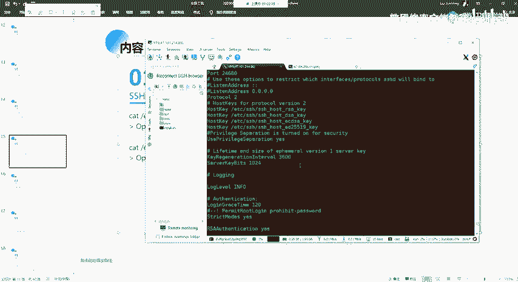

然后其在这边的话，我的这个机的话，我把它改成了这样子的。就是呃大家的这种VPS的话，其实也建议大家可以改一下，是吧？就是有很多的这样子的一些批量的。

就别人搞的这样子的一些批量的落口令跑跑你的这种SSH取的一个端口。得这样子的一个工具是吧？就默认的话是22嘛，对吧？那么你把它改一个其他的一个端口的话。

就能够有比较有效的去避免他的这样子的一种一种批量的去爆破。

