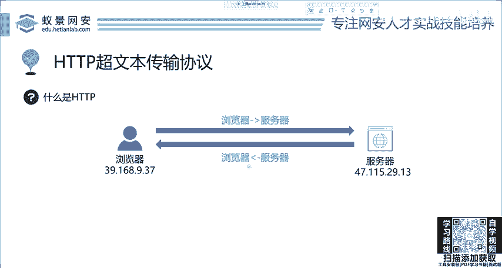
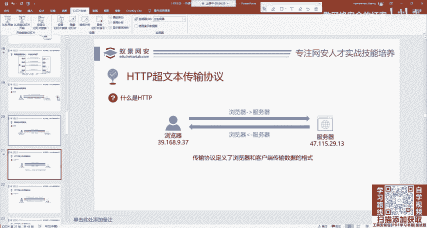
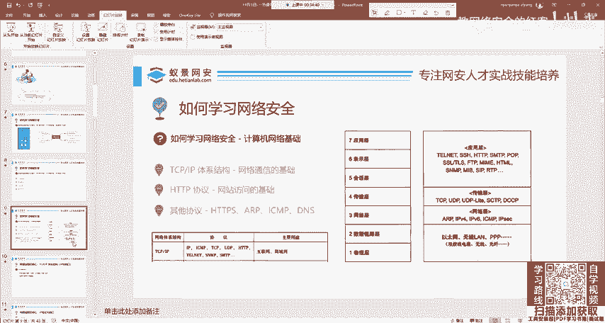
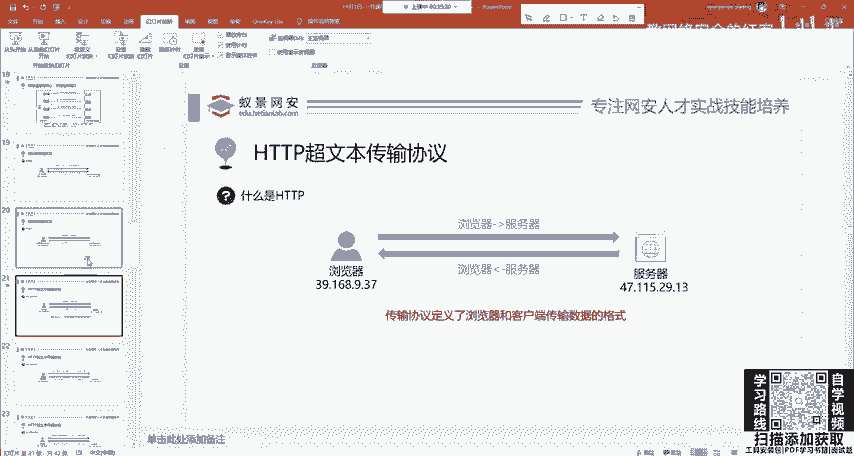
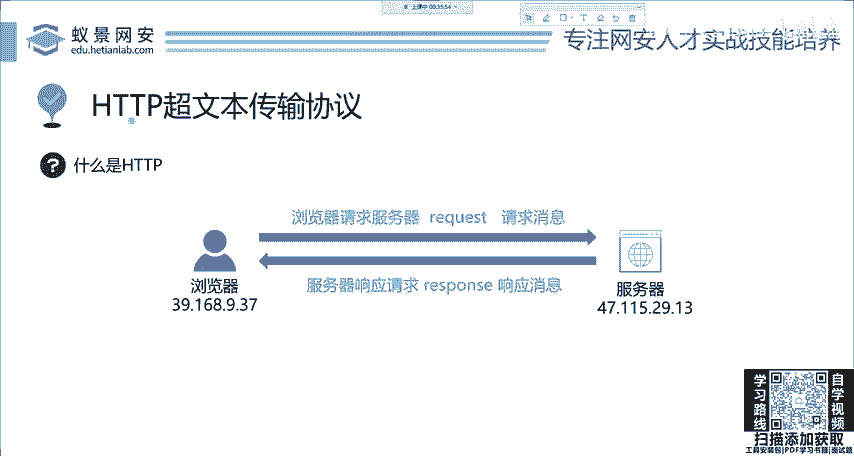
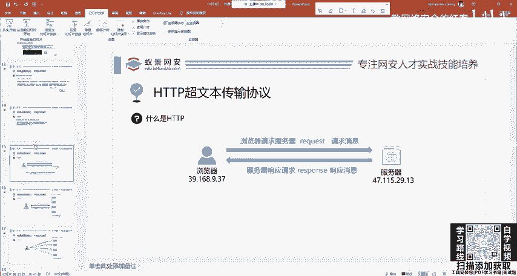
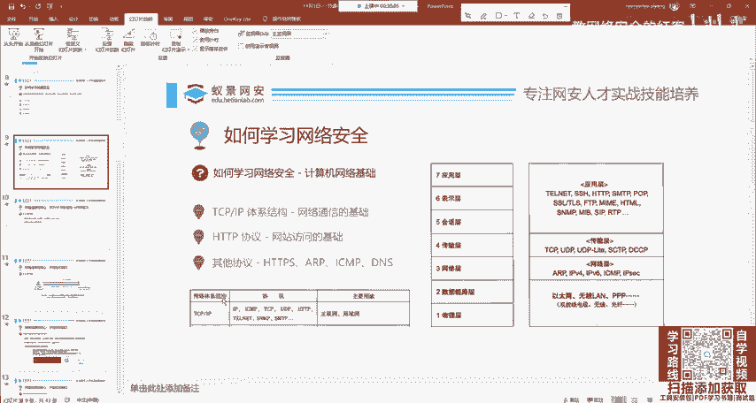
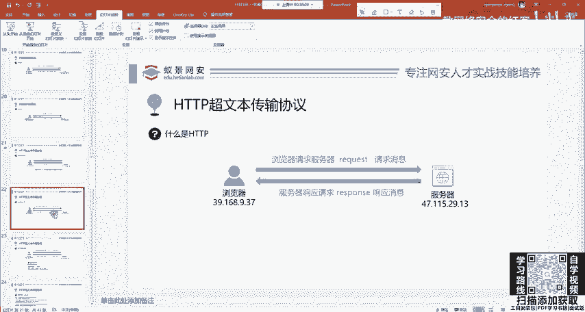
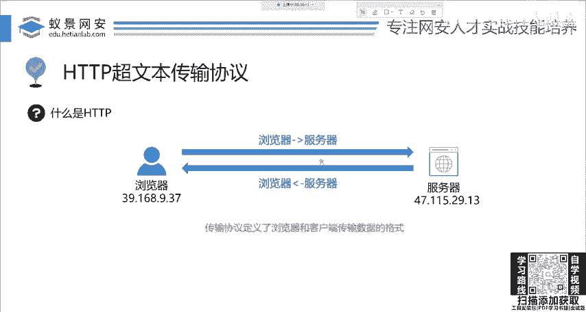
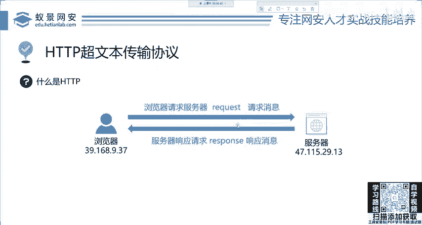

# 2024网络安全系统教程！清华大佬花159小时讲完的网络安全系统课！别再盲目自学了，学完即可就业！零基础入门网络安全！（渗透测试／漏洞挖掘／CTF／黑客技术） - P4：4.HTTP基础-HPPT是什么.mp4 - 教网络安全的红客 - BV1ft421A7Nj

中文名称叫做超文本传输协议。首先请问大家为什么要引入协议？

你说啊这些网络工程师是不是闲的没事，就是让我们去学习的他整这么多协议是为了干啥呢？你看这么多协议，首先告诉大家，现在张三他就访问网站。

张三发送的东西是不是要让这个服务器要能够听懂？要能够听懂是吧？就像交流一样，比如说你和一个美国人交流，那你们是不是要规定一种语言？比如说你说英语，那美国人也说英语，你们两个就能够正常的交流。

如果他说英语，你说中文你说什么他也听不懂是吧？所以说协议就是规定了计算机网络传输的统一标准规范。你可以这样理解啊，这个解释呢也是一样的。那我们HTTP协议呢。

就是协议的定义了浏览器和客户端传输数据的格式和规范。

如果你不按这个走，我们全世界都按这个走，你说你整个网站不按这个走，那谁谁都仿问不了是吧？因为我浏览器发的，你听不懂，你给浏览器的，我浏览器也看不懂是吧？我图片出不来啊，就是这个意思。

那么下面呢就来看这个HTP它到底有什么东西。首先我们HTTP协议它是在应用层。也就是说呢它是基于TCPIP的。我们在刚刚的这个图片中也能够清楚的看到啊，能够清楚的看到它是属于TCPIP这个体系架构的。

体系结构的。所以说学习它就非常简单。我们来看这个语言这个格式到底是怎么定义的。首先，两个非常重要的名词叫做请求和响应。请求呢就是浏览器向服务器发起请求，这个很好理解。你向百度发起请求。

叫做request。然后呢，百度在接收你的请求之后，他会把这些百度的图片，你搜索的结果去回写给你这个东西叫做响应response啊，这个是官方的名词，你就记住它就行。你多读两遍敲一遍，就能记住了。OK。

