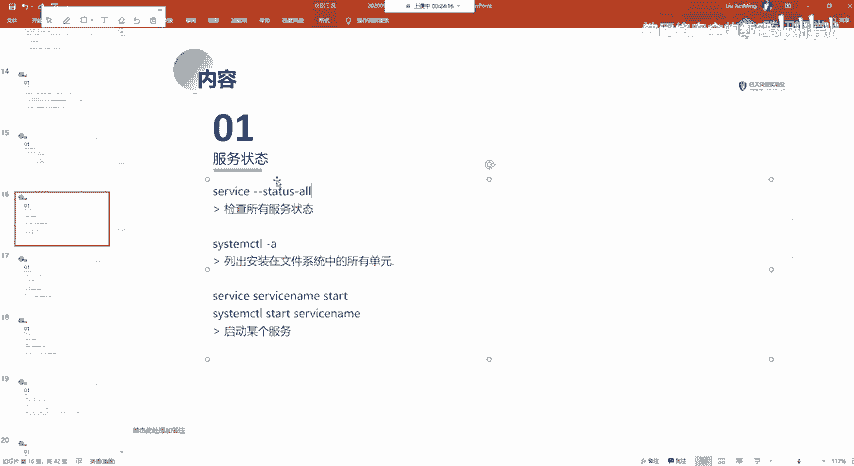
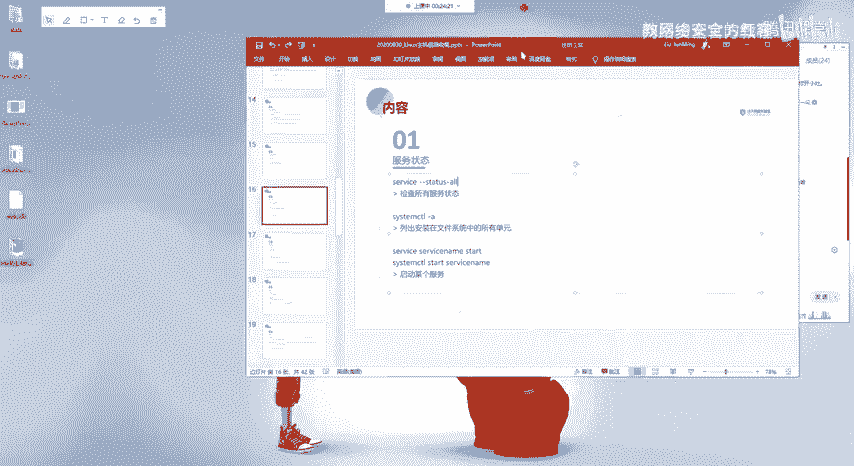
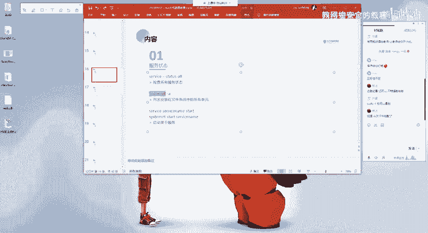
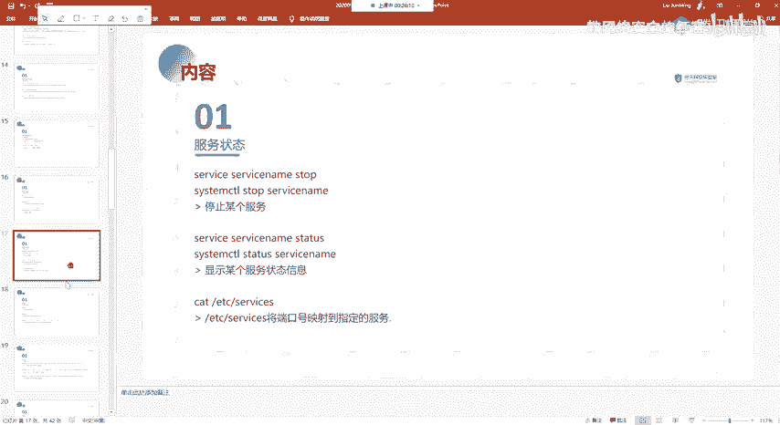

# 2024网络安全系统教程！清华大佬花159小时讲完的网络安全系统课！别再盲目自学了，学完即可就业！零基础入门网络安全！（渗透测试／漏洞挖掘／CTF／黑客技术） - P50：37.服务状态信息.mp4 - 教网络安全的红客 - BV1ft421A7Nj

哦，哦还有的话就是查看服务的一个状态，就是使用serverice的这样子一个命令。查看所有服务的一个状态。就通过这个命的话，我们能够去了解到就是你的这个机器上面开启了哪一个开启了哪一些服务，是吧？

然后呃还有就是用这个SYS systememCTL就是在呃其实用service这个命令的话。

就可以了呀。当然当然的话就是像我们的一个像D病，对吧呃。D病以及那个。啊，乌班图对吧，都是D边系的这样子的一个系统的话呃，是使用，就现在的话都是统一的去使用stem。这个CTL了啊，就这个面的话。

也是前几年才那个的，就之前的话之前的话都是使用这个service命令。来去进行一个服务的这样子的一个控制。就查看它的一个状态，以及对它做一个就是启动停止重启等等的相应的一个操作。

然后比如说我们这边要去启动一个服务对吧，我们可以通过servvicice加我们的一个服务名，然后的话加一个start来去行一个启动。以及如果说我们用这个SYS system cTL的话。

就使用这就是在这边。啊，命令后面的话接的是我们要去控制的一个命令，就是比如说你要开启对吧？就是start，然后后面的话再去接我们的一个sice service name。

这个的话你使用这两个命令要区分一下，要注意区分。以及停止，还有查看它的一个状态啊，以及可以就是restar。就是V2的话，就是就是。首先会stop停止掉，然后的话再start就是启动嘛。

就是先停止掉再启动。

