# 2024网络安全系统教程！清华大佬花159小时讲完的网络安全系统课！别再盲目自学了，学完即可就业！零基础入门网络安全！（渗透测试／漏洞挖掘／CTF／黑客技术） - P51：38.安全信息.mp4 - 教网络安全的红客 - BV1ft421A7Nj

呃，然后的话就是安全的话就是关于呃我们的一个防火墙，就是lin下面的话，它同它同样的有这样子的一个防火墙，就是IPtables。它是呃系统自带的有这样子的1个IP tables。

然后我们要去对这样子的一个系统做相应的一个安全的一个性质的话，我们可以去使用这样子的一个呃IP tables来去设应相设置相应的一个规则。好。

这边的话就介绍一下这样子的一个基本这个命令它的一个基本的一个。呃，这个使用了就我们使用这个IPtable时这个命令，然后杠L我来去列出所有的一个规则令。

杠F的话就是删除只删除选定的一个规则链中的所有规则。

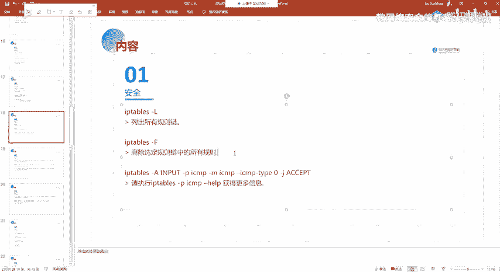

我们可以IP table1杠L，然后的话就能够有这样子的叫input。啊，forward output这样子的三条链对吧？然后这边的话因为没有配置，所以的话呃它没有没有内容，对吧？

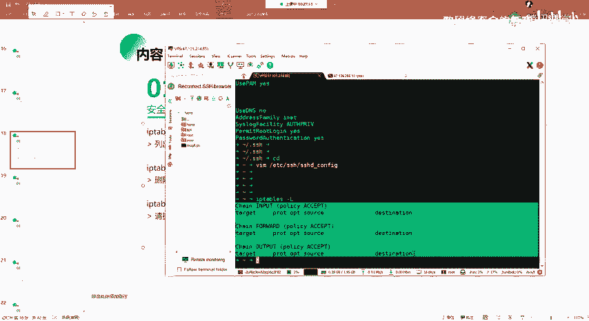

然后杠F的就是删除嘛。然后IP table1杠A的话就是添加，就我们添加这样子的一个令的话就指定input。

就我们添加一个input令，也就是这边。

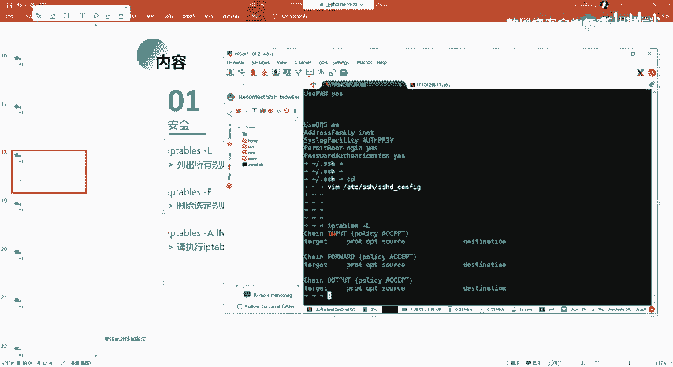

然后呃干P的话就是指定我们的一个协议。就是拼他就是pro呃。那那个英文嘛，就协议的那个英文，我忘了怎么读了，就这边的话就是指定SMP的一个协议。SMP的话就是其实就是我们的一个聘文。

我们的一个聘命的话就是使用的这个SMP的一个协议。是了。哦呃在这边的话，这里的一个整个的一个这一个IP table是。添加的这个规则的一个意思的话，就是呃我们主要的话看这边就是干J的话。

就是呃我们的一个规则，就是except的话就是允许。也就是说我们通过设置这样子一个规则，能够去允许我们的一个呃pin。我们来看一下。

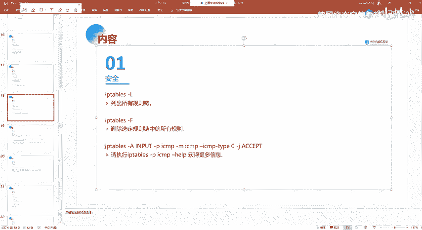

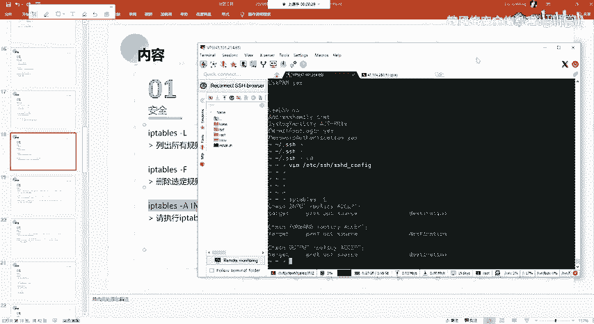

Okay。

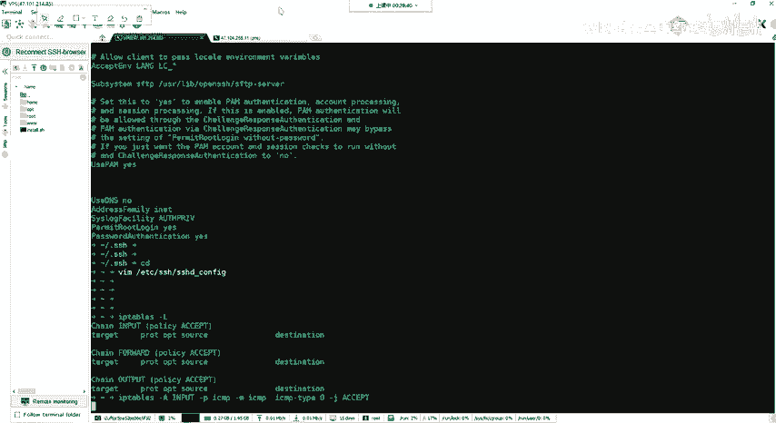

Okay。有点卡呀。😔。

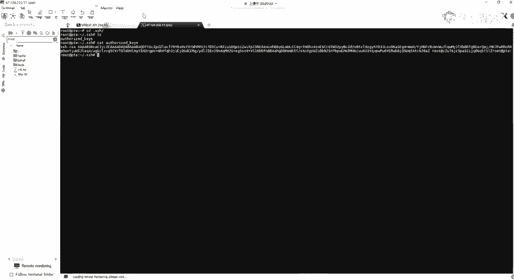

怎么回事？😔，怎么这么卡呢？我喝了。😔。

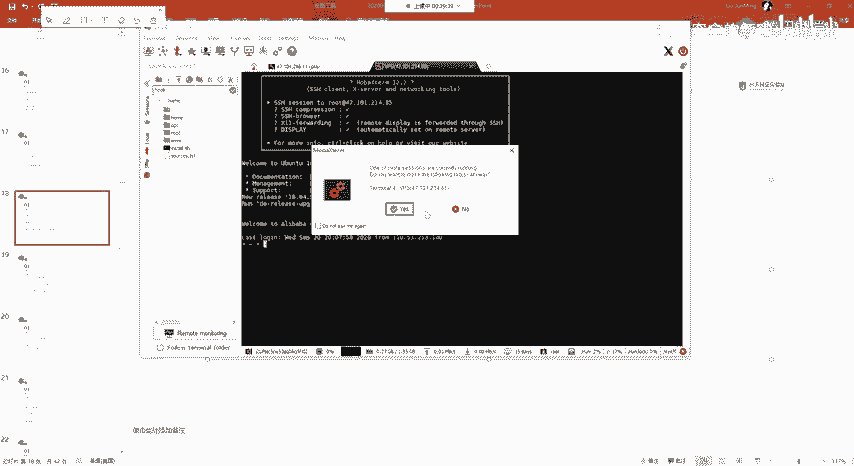

啊，在这边的话，我们可以看到在这边的话就已经添加了这样子的一个规则，对吧？就它表示来自任何的这样子的一个pin，就SMP的这样子的一个协议，它都是accept，也就是允许的。啊。

这个开启开启呃一个pin。就开启SMPSMP协议的一个访问。然后还有的话我们可以就是更具体的这样子的一个，就是你想要去呃设置更具体的一个规则。呃，在这边的话，我就大概的说一下。

就是关于更详细的这样子的一个东西的话。因为这里的这个防火墙它的一个规则，这种令这种配置的话其实是比较复杂的呀。啊，在这边的话就是让大家能够去基本的看懂啊，关于具体的一个使用的话。

大家自己课后再去呃更多的学习吧。因呃也不是说专门去讲这一个的。我们这边的话就以这样子的一个例子来给大家介绍。

原这的话就是允许来自SRC端口8年的1个TCB连接SR的话就是来自远程的一个就是目标的一个呃端口嘛。然后呃他在这边的话，我们可以看到就是呃他同样的是添加了这样子一个input。

input的话就是表示是呃临件嘛，就是表示从外部来的对吧？从外部来的一个这样子的一个临接它是允许的，就添加到这个input里。然后的话还有就是我们要出去，对吧？我们要去去其他的去目标。

也就是我们要去目标的这DST的这样子一个端端口，也就是我们要出去，对吧？我们要从某一个端口出去，那么就是output。然后在这边的话我们要。允许的话是这个TCP的一个连接，对吧？

就是干PTCP然后我们要去啊。连接了一个端口，那就是这个port。也就是云端口就Sport指定这1个80。然后呃主要的话就是在这边就是杠J就 adaptject。except就是允许就表示是允许。

也就是我们这边去配置这样子一个规则的话，就是能够去允许来自呃SRC端的，也就是来自远程的这样子的一个端口来去连接我们的1个80，好不？来自远程的一个主机来去连接我们80的一个端口。

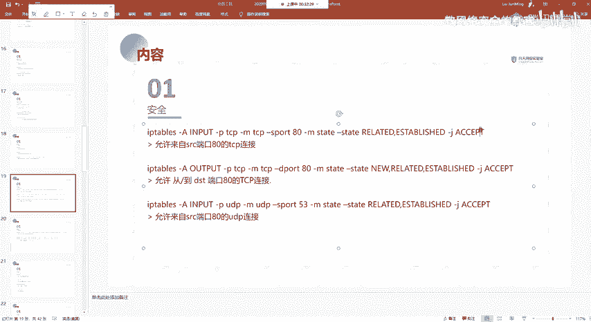

Okay。哎，这边的话大家就是如果要复制我的1个PPT的话，因为你的因为PPT上面的这样子的一个。内容的话。这边没错。就说这样子的一个符号，像比如这种逗号，还有这种杠啊。要注意啊，就是对你看的话。

你看起来的话明显就是。看起来的话挺像的。但其实你看这边的话，他明显查了这个的话就不是一个英文的这样子的一个杠啊，它是一个呃中文的对吧？英文的话是像这样子的，所以的话你就是你在复制的时候。

你复制这个命令的话，你我建议大家还是直接手敲，好吧，就不要不要去复制。

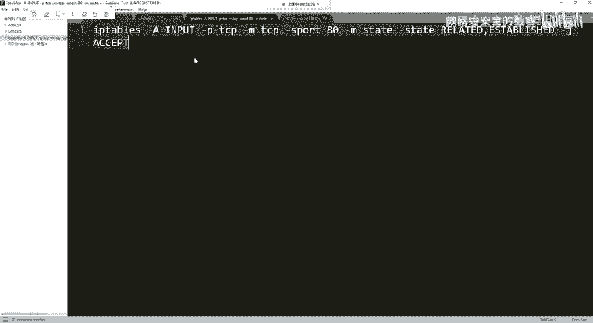

嗯这边哪里还错了？嗯。嗯。今なでょ。Thank。Sure。Okay。哦，这边的话。有点问题啊。嗯。这边的话设置的话是设成了，有点问题。好了，这个的话我课后我再看一下吧。好吧。

我不知道是这边复制的一个原因还是怎么的。哦呃，大概的一个意思的话是这样。啊呃，其他的话我就不一一的说了，其实也是就是对应的，就是你先对应的这样子的一个就是你的一个协议，以及协议，以及你对应的一个端口。

以及呃这边except，还有的话就是呃接受，还有就是拒绝。还有其他的这样子那些我就不一一的说了。

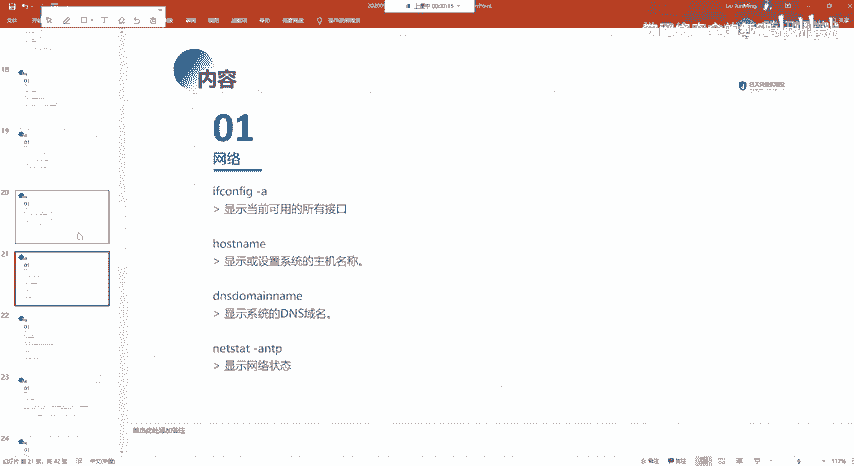