# 2024网络安全系统教程！清华大佬花159小时讲完的网络安全系统课！别再盲目自学了，学完即可就业！零基础入门网络安全！（渗透测试／漏洞挖掘／CTF／黑客技术） - P52：39.网络相关信息.mp4 - 教网络安全的红客 - BV1ft421A7Nj

然后下面的话就是网络相关的。网络相关的话，其实。也是呃。常用的这样子的一些面料。像比如说Iif config就linux下面的话就是用这个if config是吧？

然后windows下面的话是用的IP config。也是要大家要区分一下，就可能挺容易搞混，对吧？

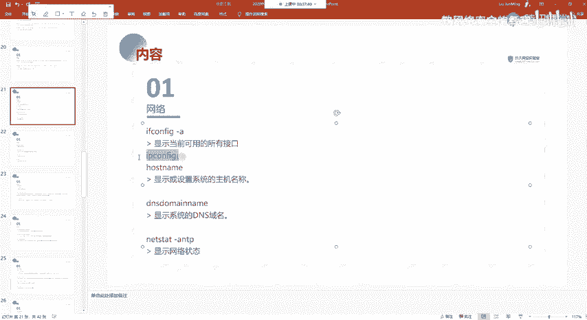

那我们在比如说。还提器。我们比如说要查看我的这样子的一个临时机器上面的一个这一个网卡，对吧？就有有哪一些网卡，它对应的1个IP我们可以通过这样子的一个命令来查看。及杠A的话就是查看呃。

其实他的一个输出的话都是一样的。该的话就是查看所有的一个信息嘛。是吧。

然后hos内的话就是查看我们的一个主机名。然后我这边的一个主机名的话就是这个嘛。对。以及还有显示系统的1个DNS的一个域名。就呃这边的话DS多 name这边的一个DS的一个域名的话，其实是在。

我们的一个。可以看到在这边。有一个这样子的对吧？就有一个hose的文件，这边的话就是因为呃我这边的话是本地啊，就是local dorm。然后其实可以看到在这边有这样子的一个记录啊。

就表示我当前的本地的就是本地的一个地址是127。0。001嘛，对吧？然后我的一个主机名，我的一个域名。啊，这个是主经理，就表示loc house的话就表示的其实就是我们的一个本地的这个回还地址了。

然后呃net state这个net state这个面的话是我们。经常会去使用到的这个面料。

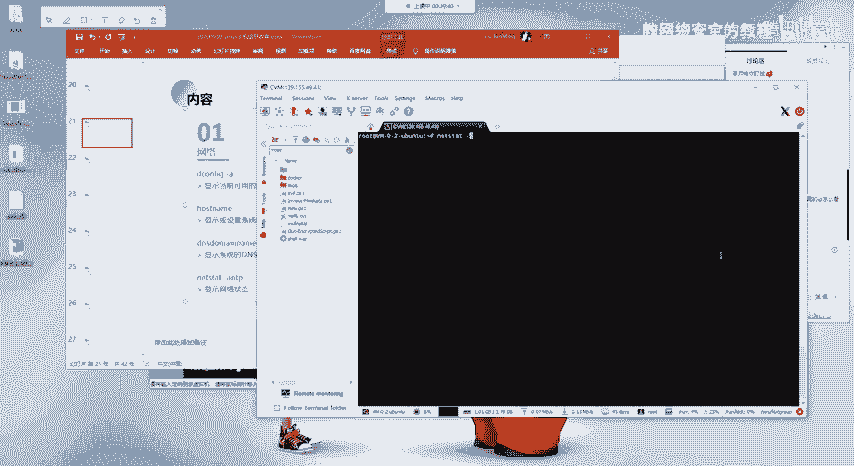

然后呃我们比如说我们要去查看我当前的就是端口，我当前开放的一个端口。我们通过 net set。AL来去跟LP来去查看它它的一个详细的一个信息。就在这边的话，我们能够输出之后的呃，执行之后的话。

能够输出这样子的一些信息，对吧？这边的一些信息的话，我们着重的话看这边。

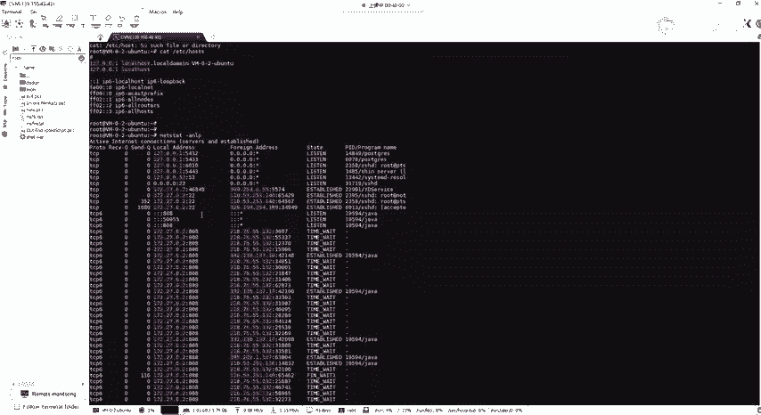

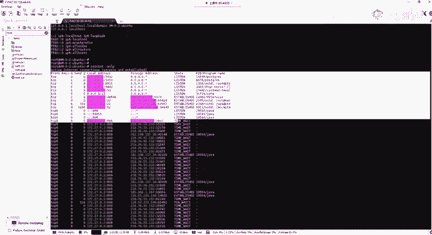

首先在这边的话就是呃我们可以看到本地的就是local address，对吧？就是本地的1个IP以及它对应的一个端口是吧？也就是说在这边的话，就是我表示我们本地所开放的这样子的一个端口。是吧。

然后可以看到在这边我这有808的一个端口，对吧？这个808的话是我的1个CS服务器的一个端口。然后的话呃还有其他的像22对吧？还有53这样子的一些端口。的一个开放。

然后在在这边的话播的 address的话就是外部的1个IP。也就是他就是说有外部的哪一些IP通过某一个端口来去连接了我这一个端口，是吧？

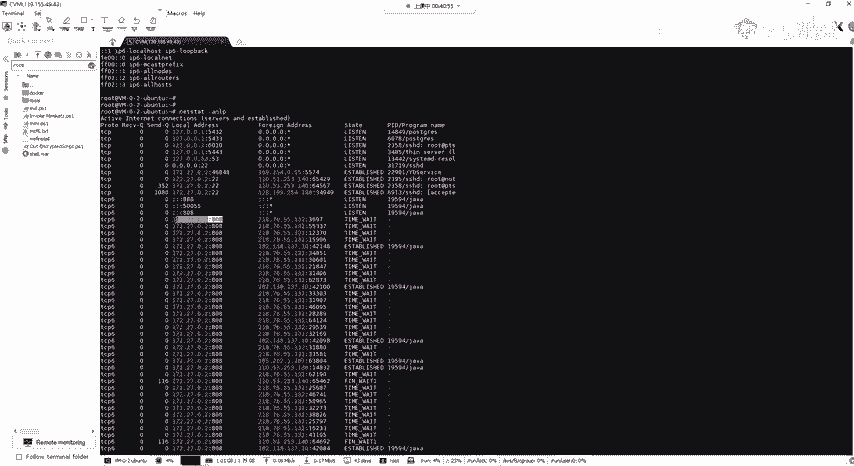

然后在这块我们就能够去看查看到相对应的一个连接。就在这块我们可以看到有对应的一个连接来去连接了我这边的1个808的一个端口。在这边的话，其实就是啊因为我CS服务器上面的话。

有对应的一个呃有对应的一个主机，对吧？来去连接我这一个端口进接的一个连接。所以的话在这边可以查看到有这样子的一些呃连接啊。

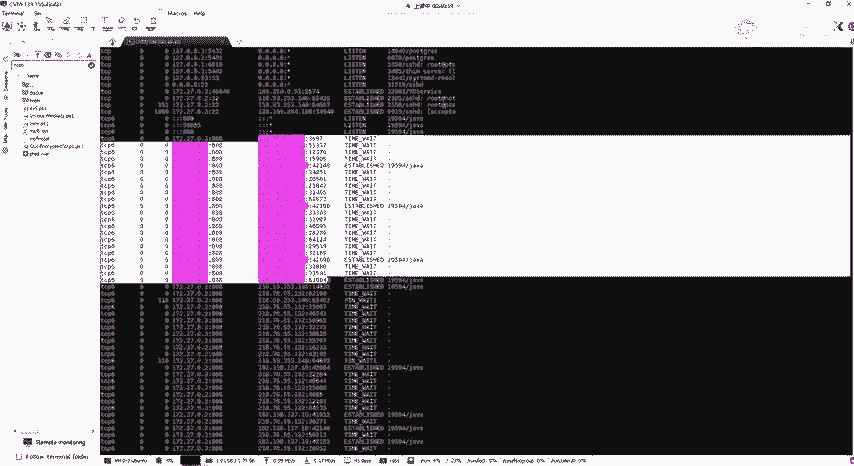

嗯。然呃还有的话就下面这边的话就是表示你的这样子的一个能够去查看到所对应的一个程序的一个呃。进程。好呃。我，以一个例子来表示吧。我们比如说我们要去查看我的1个SSH取对吧？我SH取的话是22号的一个呃。

这边的话是22号的一个端口，对吧？我要去查看我这个SS取的一个服务是否开放的，也就是22号端口，对吧？那我可以通过。杠ALP来指定，就是通过group来去过滤，只显示22。的端口的一个信息，对吧？

然后在这边的话，我们可以看到这个的话，就是它是属于一个今天的一个状态，也就是listsen。然后他呃他的一个服务的话，就是这个SHD嘛，也就是我们那个SSH的一个服务。以及在这边的话，31719的话。

就表示我们的一个呃这个这个服务他的一个PID也就是我的一个进程ID。Oh。我如果说想要我我想要去结束这样子的一个就是结束这样子的一个进程，也就是我这边今天的这个端口把它给关闭掉。

那么我可以通过这边的1个PID也就是我指定这个PID我通过这个命令，就把这一个进程给杀掉。那么我这边的一个端口的话，它就就关闭了嘛，是吧？他就不是处于一个进今天的一个状态了。因为它处于一个今天状态。

是因为我这边的1个SH服务开放了，对吧？就同理还有其他的。就是说如果你比如说你通过NC对吧？你今天的1个7890的这样子的一个端口是吧？也。今天了一个这样子的一个端口，那么我可以通过nex that。

来去查看这一个端口。它是否是一个今天的一个状态，对吧？我们可以看到在这边它是一个今天的一个状态，对吧？那么我要把这个端口给关闭掉，就我可以通过Tel来直接指定这一个。P i d。

对吧来把这一个进程给杀掉。也就是我这边的话再去看的话，你会发现他没有。这个端口的一个开放对吧？然后这一个命令的话就我们再去使用，就是说去这种今天的一个端口以及查找指定的开放的端口，它对应的一个服务。

对吧？我们会经常会去使用这一个命令。然后的话我们可以结合我们的1个PS的1个PS。ERF的这样子一个命令来去查看。比如说我要去找到这一个进程ID对吧它的一个运行的一个程序是哪个？

就说是什么样子的一个程序，它是怎么运行的？OK查找这个PID对吧？然后在这边的话，我们就能够去查看到这个PID所运行的这样子的一个程序，以及它对应的一个服务。对吧。

然后在这边上可以看到他是执行的是这一个。

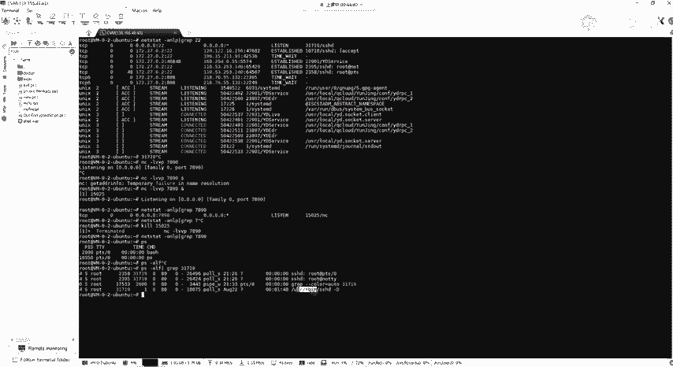

🤧嗯。呃，还有其他的话，我这边的话我就不一一一一讲了呀。还有同学在听吗？哦，对了，忘记看大家的一个问题了。你你你你在你本你在你本地的一个机器的话，你一comfi，你肯定你只能是看你本地的1个IP啊。

你还能看你还能看其他的1个IP吗？是吧？因为你一 confi你查看的话，是你其实就是你这边开放的一个网卡，对吧？你可以看到我这边的话是有两张网卡。两张网卡，然后在这边的话，E天取0。

这边的话就是这一个网卡，他那个IP是这一个对吧？还有ETHE这个网卡的话是没有分配到IP。嗯。嗯。你这个是你这个是查查看，就是说你当前的，你当前的就是你连接的网络，对吧？

你的一个外部的一个外网的1个IP嘛，对吧？对你也可以通过这一个通过这一个服，或者你可以直接就是你直接浏览器嘛，你浏览器你输那个IP，你这边你就能够查看到啊，对吧？嗯。呃，这边我再看一下，看还有哪一些。

着重给大家讲吧，我就不一一的去讲了，就我这边。我自己讲这些这些命令其实也挺酷的。但是这些东西的话也是大家。呃。要去知道的，好吧。呃，还有的话就是网络相关的。以及然这个。

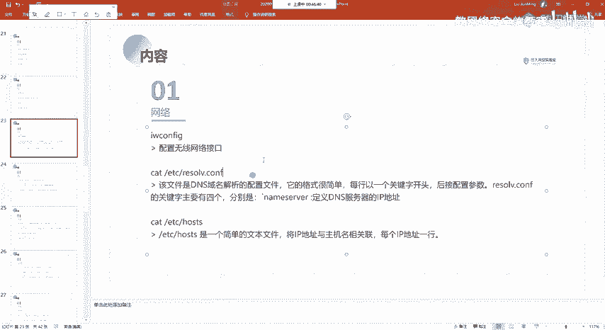

就大家再去配置网络的时候，也会通常会用到这样子的一个文件，这样子的一些文件，对吧？像比如说你要去配置你的1个DNS。配置DNS的话。

我们可以通过这样子的一个方式来去配置一个临时的1个DNS就是这一个这一个文件。Yeah。就resolve点config这样子的一个。这样子的一个文件。因为呃你可能有时候的话你去就是说你拼不通外网，对吧？

你拼不通外网。然后的话你这个时候你去就可以尝试去检查你的这样子的一个电S。

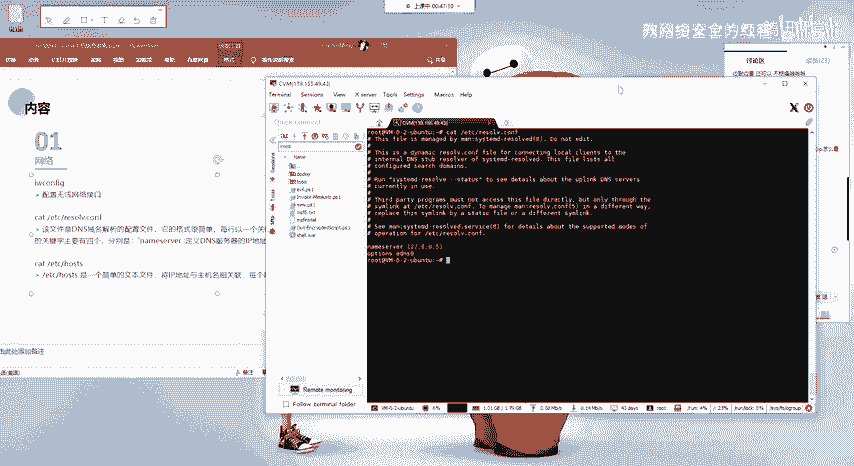

啊，不是，不是说拼不通外网，是你有时候你去骗，对吧？你去骗一个公网IP。你拼IP的话，你是能够拼通的对吧？但是的话你拼域名的话，你会发现你这边的话，你拼不通，就是它解析不了。

那么这个这种关于这样子的一个域名的一个解析的话，你就可以尝试通过这样子的一个配置DS就配置一个临时的1个DNS来去进一个解决。然后我们配置的话就是通过。这一个。

通过添加一个name server这边的这个我们不用管它这种内网的这种。然后这边的话我们可以通过添加一个公网的1个DNS的一个服务器对吧？比如说我就以这个114的这个为例。然后的话你再去拼。

你会发现的话，现在的话就已经拼通了对吧？因为你这边的话是没有一个DNS的一个解析，就是说你去聘这个域名，它解析不到对应的1个IP地址。也就是没有配置DS的一个服务器嘛。

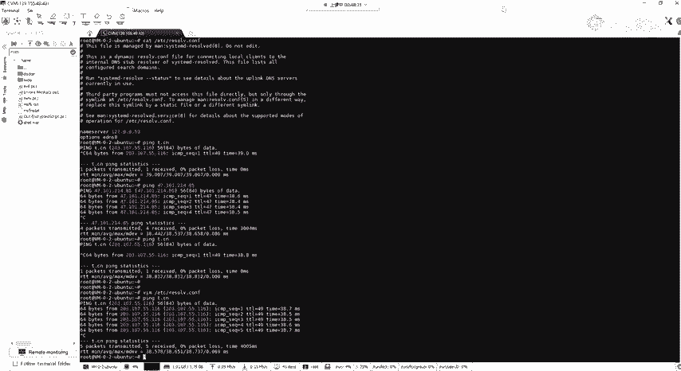

因为DS服务器上面的话，它就是记录着这样子的一个域名以及IP的一个对应的一个关系。🤧嗯。Yeah。呃，还有他就是这个ho文件，刚刚也说了，就是我们呃将IP地址与主机名去进行一个关联。

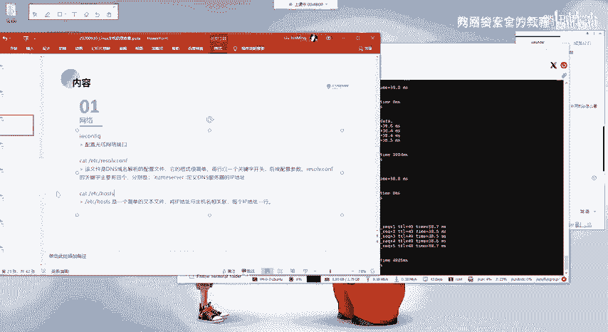

然后的话还有就是在你的一个network呃 interfaceface这个配置网网络的一个文件。这个文件的话应该也是大家就是。

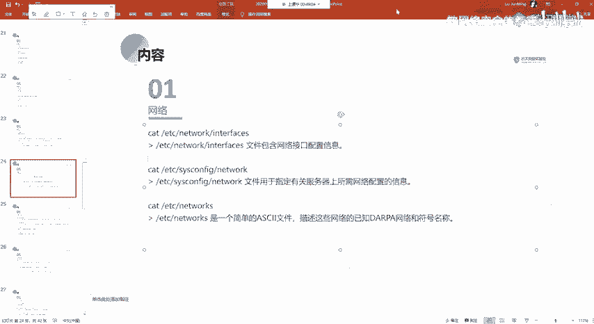

经常会去用到的。就有这样子的一个文件，对吧？有这样子一个interface的一个文件。这个文件的话，我们如果说要去配置我们的一个静态的1个IP对吧？

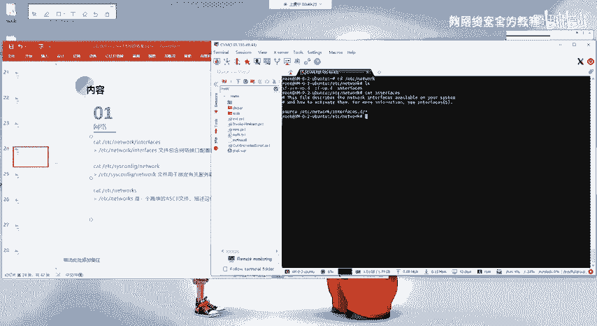

呃，要去配置我们那个静态IP因为。我这边用这个的话，可能。

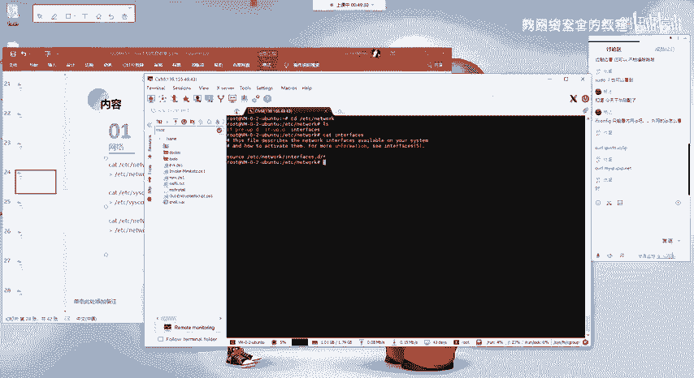

嗯这一个吧。比如说我这边我要去配置一个静态的1个IP对吧？那么我可以在这一个文件当中去进一个配置。可以看到我这边我在这边的话是有配置了这样子的1个ETHE对吧？然后这边的话。呃。

上面的这个L0的话就是我们的一个本地回还的地址嘛，local back这个的话我们不用管它。然我们在后面另外加一个就al ETHE，也就是它的一个网卡名的话就是ETHE嘛。

然后呃这边innet的话指定为tatic，也就是静态的一个意思，就表示我们这边是配置的一个静态的1个IP。然后Idress指定我们的1个IP地址。

然后getway指定我们的网关get max话指定我们的一个子网页码。我们这样子的话就能够去进行一个这样子的一个网络的一个配置。这边。然配置完之后的话，我们可以通过servicenet。

他是 working。来去重启我们的一个网络。我这边重启之后的话，你会发现对吧？刚刚没有那个IP的话就已经有了。就这边的话，我这边的话是我配置了一个内呃一个呃内网的一个静态IP。就是这一个。

还有的话就是我们这边的话是低变啊，像乌班图，还有卡尼这种低变系的话，是这样子的一个文件。然后还有这样子的话是这个的话SYS空气的话是像红帽的这种渗透2这种机器的话，是在这样子的一个目录下面。

它会有对应的一个网卡。以对应的一个网卡名为名的这样子的一个配置文件。

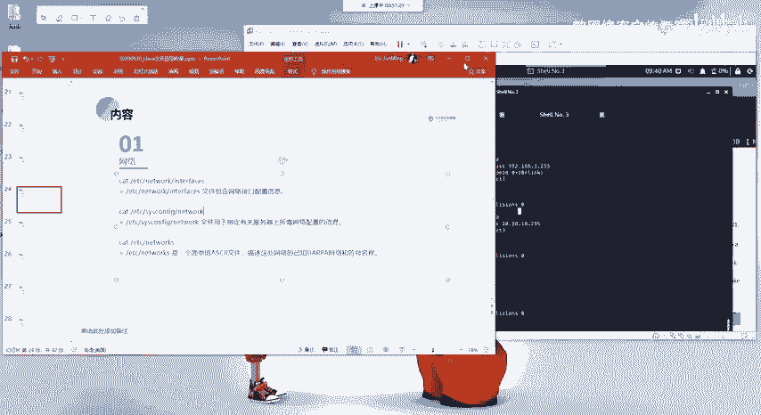

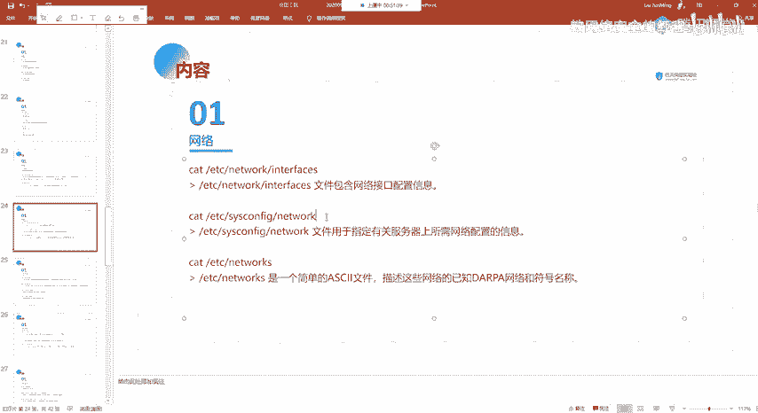