# 2024网络安全系统教程！清华大佬花159小时讲完的网络安全系统课！别再盲目自学了，学完即可就业！零基础入门网络安全！（渗透测试／漏洞挖掘／CTF／黑客技术） - P53：40.文件系统信息.mp4 - 教网络安全的红客 - BV1ft421A7Nj

还有的话。还有的话就是这一个。就我们的一个呃。当前用户的一个半起名的一个历史记录。这个的话我们通过输入history能够去查看到当前的就是你执行的一个命令的一个历史记录，对吧？

然后这里的这一个历史记录的话，它其实是存放在这一个就是当前我这里这里的话是ro用户，对吧？有这样子的一个顶b点history的一个文件。然后其实这里的这个文件。

它就是存放的我们的呃输入的这样子一个历史的一个记录。然后这边你会如果说没有对吧？没有。记录最新的话是因为呃他这边他要把它写不进去的话，他有是有一个机制吧，是有多少的一个时间嘛，我们也可以手动的I。嗯。

S。敢打了。对吧我们可以手动的把它更新进去，现在的话就是跟我们直接输入hier的一个内容是一样的了，对吧？对吧。Yeah。呃，还有的话就是。这是。哎，它就是这一个文件，就是日志文件。

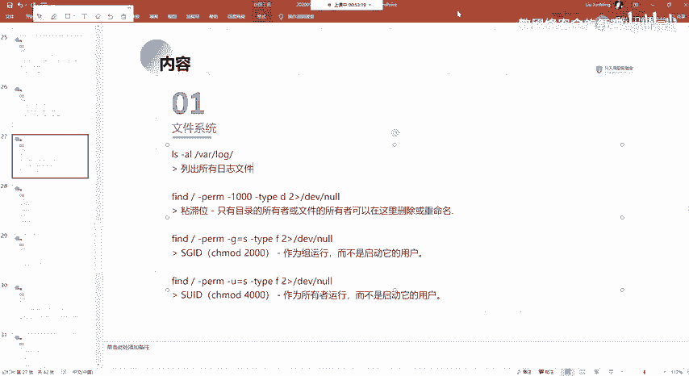

这个日志文件的话就是。这个目录也是我们经常会去用到的一个目录，就是我们再去做查看日志的时候，就在这个目录挖ro这个目录的话，它里面的话是存放着我们就是呃系统当中的这种程序啊，还有相应的一个服务。

它所呃运行的这种日志，它都会保存在这个目录下面。像比如说我这边NG mycycl对吧？等等的这样子的一些日志，它以及APT。呃，还有其他的这样子的一些服务，他的一个日志，他都记录在这这个。这里面。

我们以这个为例，对吧？我们CD到这个N目录下面的话，它这边有一个access以及的一个logaccess话就是它记录着我们记录着就是访问N这个服务的这样子的一些记录。

比如说你访问的的这一个外表服务下面的某一个目录，某一个文件，它都会在记录在这个里面。的话就是说你的这种访问错误的这样子的一些日志，它会记录在这个文件当中。我这边的话没有内容的话。

是因为我这边这一个话是没有访问过的。应该是没有开过。都没有。这边的话就是像这个APT的话，就是说我们APT安装的这样子的一些软件的话，它会记录啊它会记录在这样子的一个日志文件当中，是吧？

它是什么时候呃安装的？比如说这边我安装了1个GCC对吧？嗯。以及他对应的一些扩展，他都会记录在这边。然后这边的日志的话，这种日志的话，我们后面再讲，就是像比如说痕迹清除的时候，是吧？就我们需要知道。

就是说我们在这个linux系统上面执行的这一些命令，以及我们进行一些登录的这种操作，对吧？这种日志文件它是存放在哪里的。

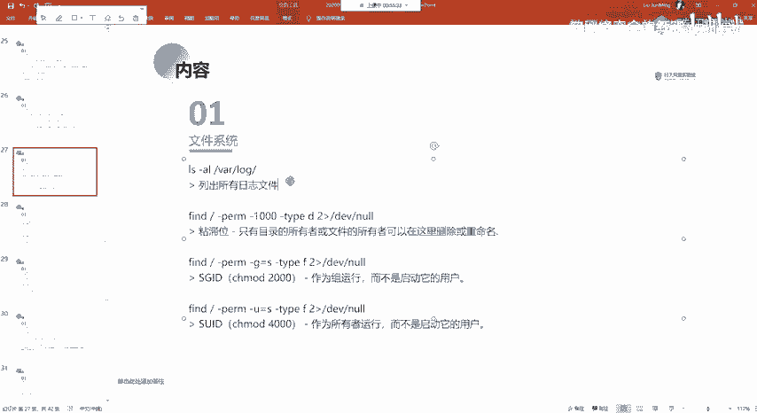

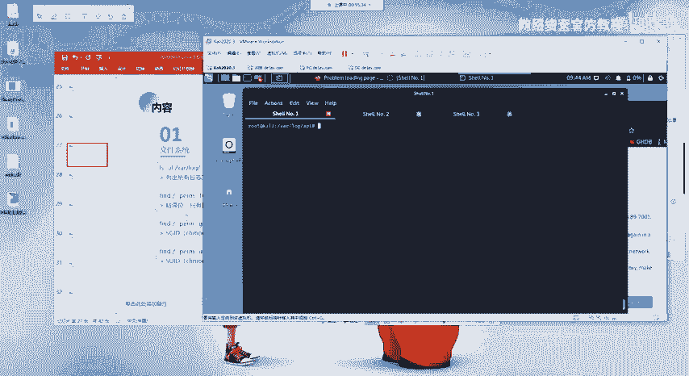

然后我们就是操作完成之后的话，这一些日志的话因保存着我们的一个操作嘛。那么管理员的话，他会知道你执行了哪些操作。所以的话我们需要去找到对应的这种日志文件去做相应的一个清除。

就清除我们的这样子的一些敏感的一些操作。好，呃，下面的话就是fund这一个命令的一个使用。就我们通过fo命令来去查找所对应的这样子的一些信息。呃，在这边的话，这里的话我先不细讲，因为呃。

涉及到这样子的一些东西啊，这一些东西的话我们啊后面再讲那个反弹需要的时候，讲lin的时候再给大家提吧。因为现在的话讲这一个的话，大家可能不是很理解，就是这一个二是什么意思，对吧？就在后面讲。

还有的话就是再讲另s下面防东，对吧？大家看到的常见的那种。反他需要的一个命令。比如说这样子的一个法纳西尔的一个拜喜的一个命令，对吧？

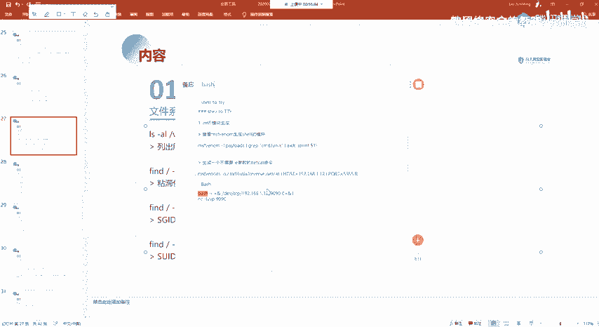

他是什么意思？他。他的这样子的一个表示是什么？在后面的话会给大家详细的讲解，就是说我们就是说他为什么通过这样子的一个呃命令就能够去访谈一个需尔道这边指定的1个IP及端口。在这边的话。

它就会涉及到这样子的一个这一些符号以及012所表示的一个意思。在这边的话，大家只需要知道它的一个用它的一个用法就OK了。

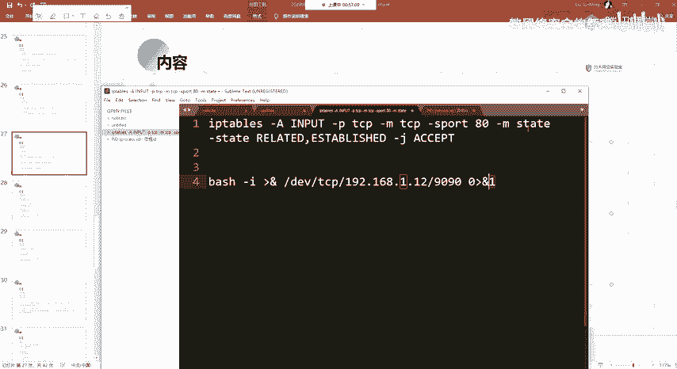

这边的话其实主要的话就是这一个finund的命令。放能面令的一个使用。

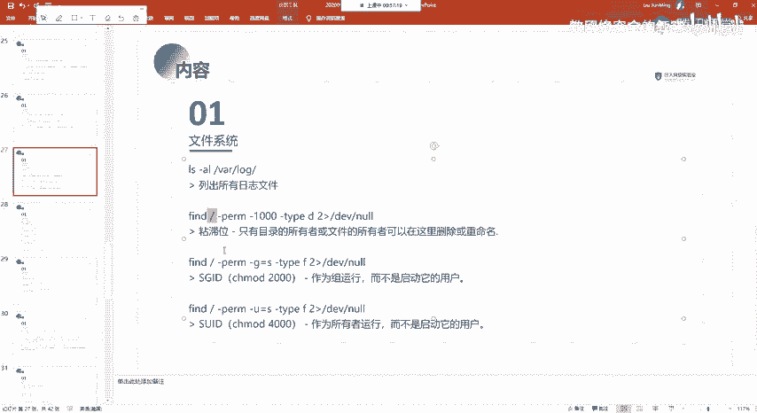

然后我这边的话就以这一个为例吧。

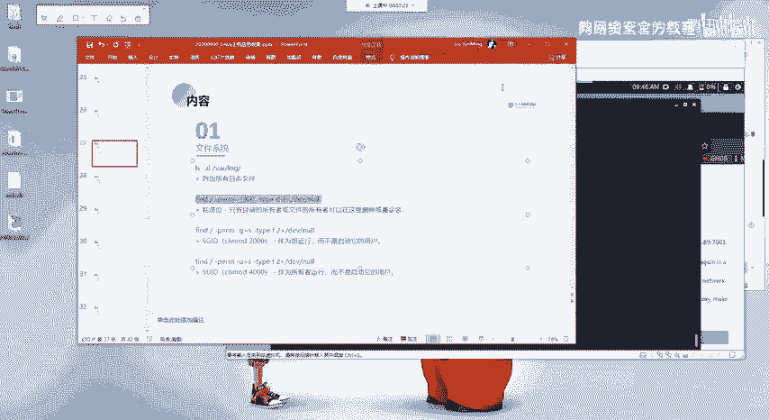

这边的这一个面料话。🤧。我们执行。

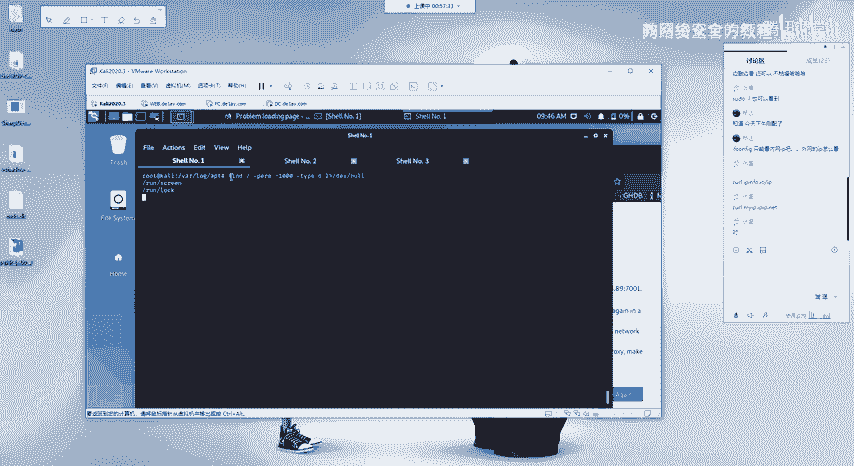

呃，首先这个放的面令的话就是放的之后的话，接我们要去查找的一个目录。这边指定干的话就是表示是从跟目录开始查找，也就是他会查病历系统上面所有的一个文件。以及目录，然后的话去查找我们这边指定的。う嗯。

Yeah。🤧嗯。去查找我们这边指定的这样子的一个，比如说杠PRM就表示我们这边的一个。呃，P。呃，这个是。这个是那个权什么权限来着？嗯5。有点忘了呀。写错了吧。哦，没写错。

这边的干PM的话就表示是我们前面其实就是表示我们前面所讲的那个数字。然后这边的话，他这个一000的话就是表示的是我们这边的一个粘字位。这个张志位的话呃，我们后面会讲后面会讲就是一些特殊的一个权限。

以及利用这些这上面利用这一些特殊的一个权限去进行相应相应的一个提群，在这边的话就是这种特殊的一个权限的话，我们可以通过这个呃指定来去进行一个查找。然后在这边干PM的话。

就是我们这边用数字的一个表示的一个方法，就是表示的这种字位。然后的话如果说你想要去查看。像比如说777这样子一个权限的一个目录，对吧？这边干干杠t的话就是表示的是一个这边第就是表示目录嘛，对吧？

F的话就是fi就是文件的一个意思。就这边的话是查找对应的一个目录啊。嗯。然后这边2-DVn的话就表示它的一个就是报错的一个信息，错误的一个信息的话，把它置为空。这边的话大家先不理解的话，没关系啊。

先知道它的什么意思即可。后面会讲。然后还有就是杠G等于S的话，呃，这边的SGID。呃，还有的话这个S子。SGID以及SUID后面也会讲就这种特殊的一个权限。在这边的话，我们通过杠机来去指定。

就等于SS的话就是表示这个呃特殊的这个SGID啊。以及杠U等于S的话就是SUID。呃。还有的话就是像这种可写的一个文件以及文件夹，我们也可以通过这样子的一个方法，就是像比如说。

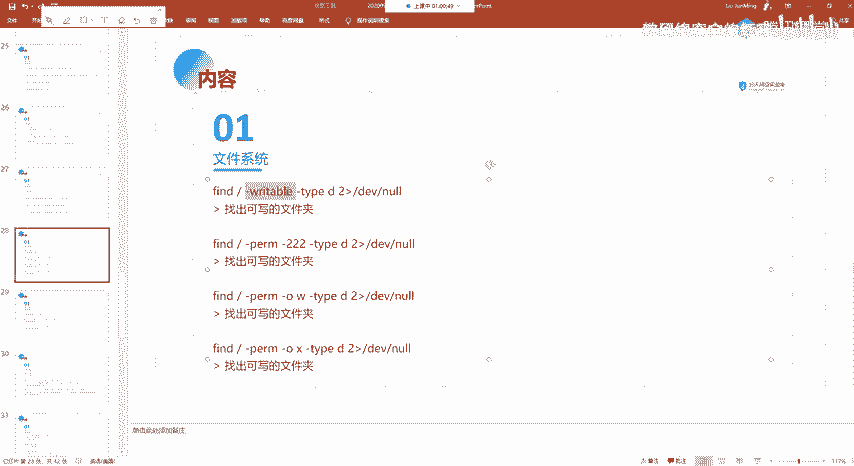

嗯，其实在这边的话就是放的面令的一个使用啊。关于更多的一个东西的话，我建议大家还是。

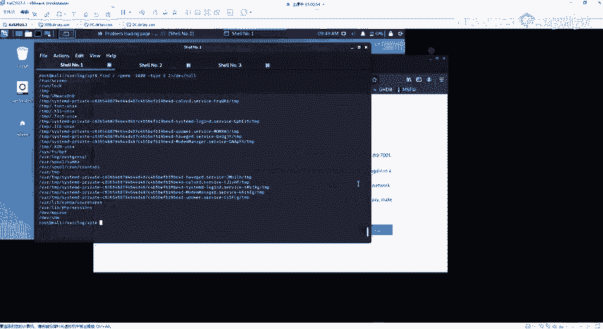

看他的一个帮助信息吧。要感。嗯。看他那一个帮助信息。然后呃在这边的话，像比如说XQDIR对吧？以及还有像。嗯。Okay。这种readable writeableexable对吧？

就是干readable的话就是可以执行可以读取的对吧？然后还有像我们这边的干writerable，就是可以写的然exexcutable的话就是可可执行的嘛，就是表示所对应的这样子的一个啊东西。

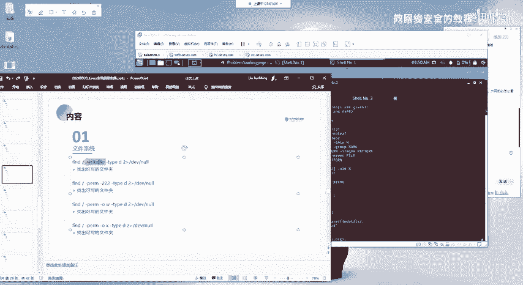

就是rightite的话就是找出可写的一个文件夹。所以干 type它指定对应的一个类型。然后可写的这种。文件夹因为呃可以看到在这边指定杠22杠2的意思的话，就是我们的一个权限的话是就是有W嘛，对吧？

因为W所对应的话就是2嘛，对应的话就是2。所以的话我们找有这样子的，就权限是22的这样子的一个呃文件夹。以及我们可以通过这样子的一个形式，杠O就是杠O的话就是。呃。杠O杠U杠G对吧？

就是指定杠O的话就是表示呃其他的这样种用户。如果说杠U的话，就是表示你的一个文件所有者有这种。WRX的这样子的一个权限。这边同样这边指定都是干D，就是文件夹。如果直定杠F，它就是文件啊。

这个的话应该比较好理解，对吧？后面这边的话就。稍微复杂了一点，其实它的一个园理的话都是一样的，就是它过通过这样子的一个表达的一个形式。像这种干大家只需要理解了，就是干PM后面指定的就是这样子的一个权限。

在这边话其实就是指定多个嘛，指定多个权限嘛，对吧？就是要同时满足两个这样子的一个多个这样子的一个条件。然后的话来去筛选出这样子的一个文件夹。

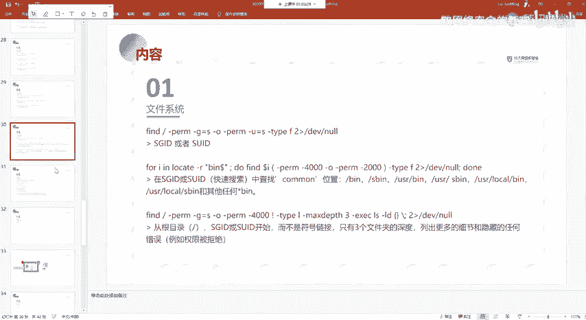