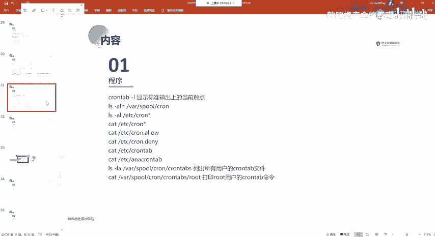
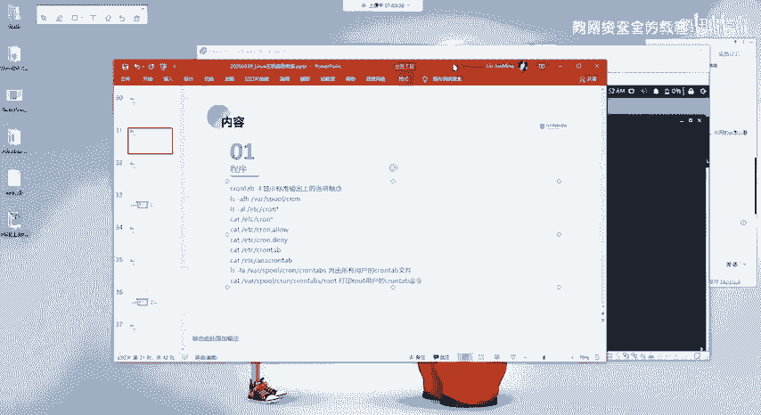
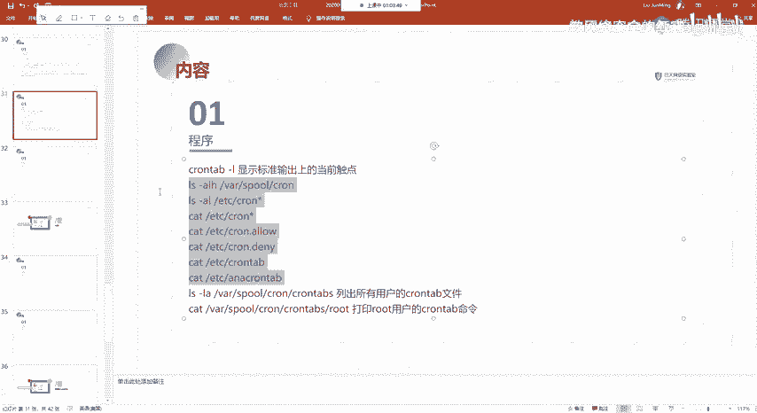
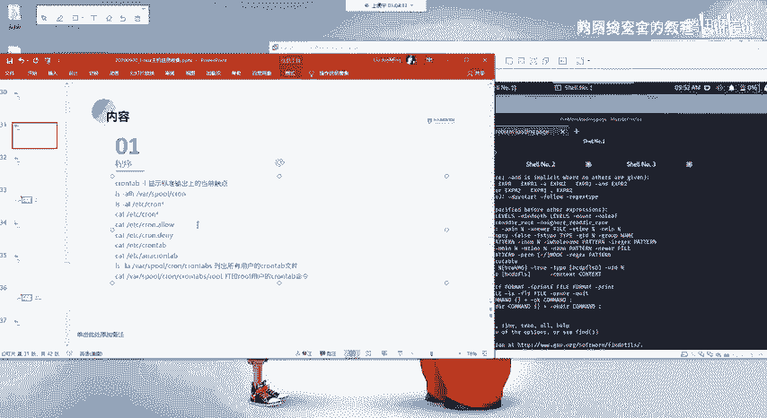
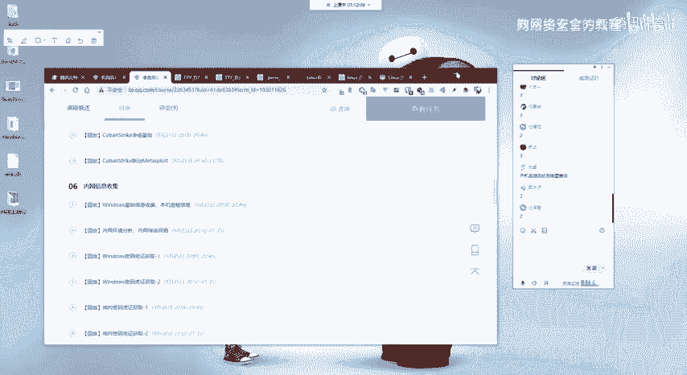
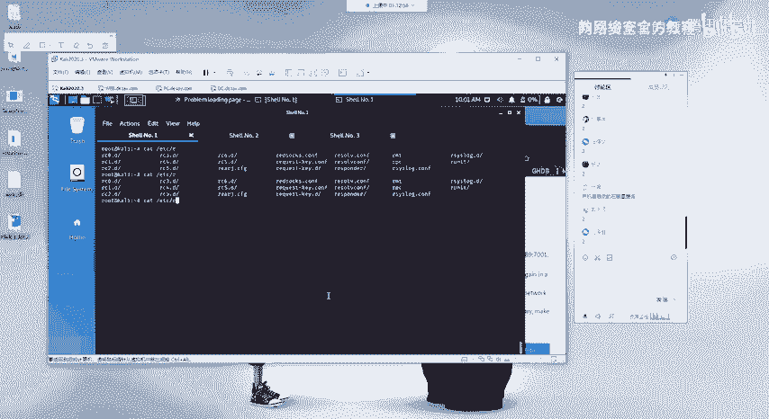
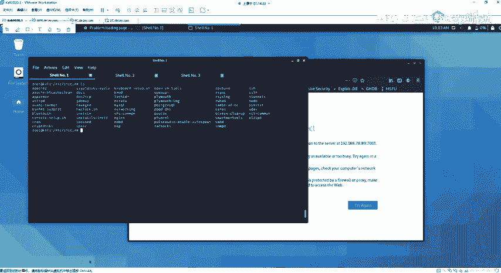
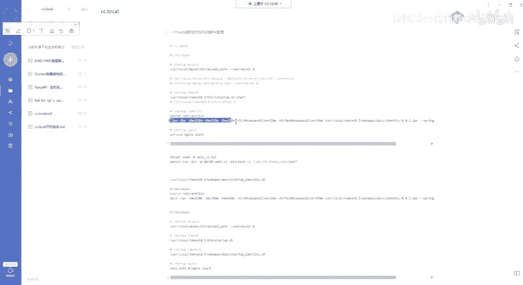
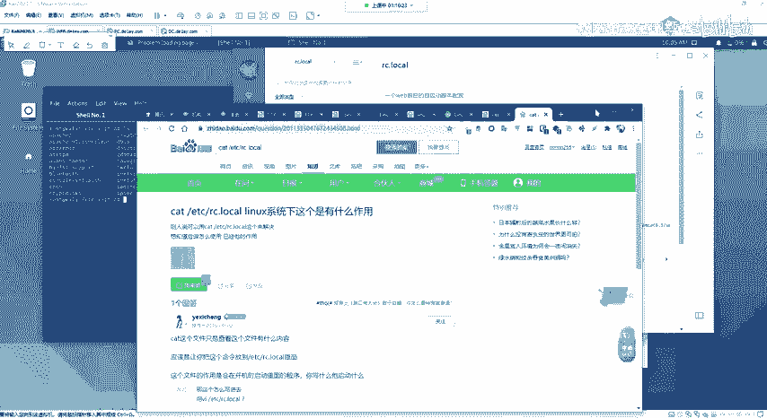
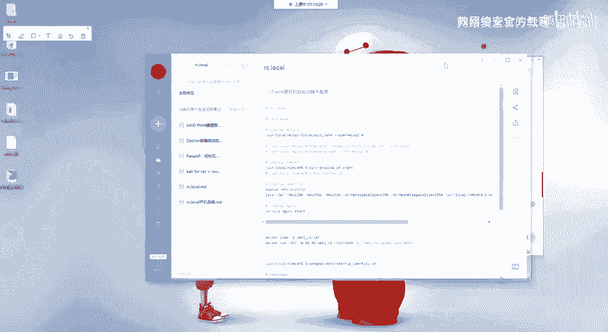

# 2024网络安全系统教程！清华大佬花159小时讲完的网络安全系统课！别再盲目自学了，学完即可就业！零基础入门网络安全！（渗透测试／漏洞挖掘／CTF／黑客技术） - P54：41.程序相关信息.mp4 - 教网络安全的红客 - BV1ft421A7Nj

呃，以及最后的这一个就是cowntable。cowntable它就是定时任务。

关于这个的话，其实应该啊后面的话也都会讲到就是定时任务的。像比如说利用电时任务去提全，以及利用电池任务去执行我们的一个需要。

对吧前面在讲readdius时的时候，应该也有给大家讲吧，对吧，就是利用呃通过readdius写定时任务。男鞋。通过read时写定时任务，然后的话来反他需要，对吧？

这边的话就是用的这一个chrome table。然后。以及它对应的这样子的一个一些文件。就是我们可以在这一些文件当中去查看到。比如说。

它对应的一个定时任务的一个信息。比如说我们CATETC下面的有一个contable的这个文件。在这边的话就是我们的一个定时任务的一个信息。我们可以在这一个目录下面去写我们的一个呃定时任务。

然后还有的话就是还有这个CD。有一个话动。Co long。fromtable时的这样子一个文件夹。在这个文件夹下面的话，就是说如果说是你会你发现有其他的以就是说你这个系统上面有。

比如说有一个卡里的一个用户，对吧？然后的话有以这个卡里用户为。就是在这一个卡里用户上面有添加这样子一个定时任务的话，那么他会在这一个目录下面，他会有这样子的一个卡里的一个文件。然后在这一个文件当中的话。

他就是写的，他记录的是这个卡里用户上面所。所添加的这样子一个定时任务。如果说是root用户的话，它就会有这样子一个root的一个文件。这个的话应该能理解。好吧。啊呃。

还有的话就是像这种on点点Dlay啊，就是话就是允许嘛。Dlay的话就是拒绝。就是你更加细致的这种电池任务的一个配置。这这边的话。我就不细讲了。呃。

就是这个就打印ro用户的一个cown table的这样子的一个呃记录啊，就定时任务的一个记录。我们可以在这个文件下面去查看，以及还有相对应的一个用户的话，我们改改成为对应用户的一个用户名即可。呃。

以上的话就是我们本节课的一个所有的一个内容啊。大家有在还有在听吗？大家有没有什么问题？这一课内这节课的内容的话，应该是是最是最近最紧单的呀。因为都是一些命令相关的呀。大家听着。是不是感觉会有点枯燥？

就是枯燥的话是对的，就是。因为这些命令的话。其实我也在想就就是要不要给大家讲这些，但是不讲的话，就可能后面的话有一些东西的话呃，大家也不。如果不熟悉这一些lining的话，就。会碰到这样相应的一些问题。

对吧？然后的话呃。就是我这边计划的内容的话，其实就是在前面的话，就把这样子的一些东西就是给大家先讲一下，先过一下。当然的话主要的话，其实因为lininux的话本来就是用命令来去进行操作的嘛。

所以的话就大多的话都是相关的一些命令。我们都是通过命令，通过命令的一个方式来去获取对应的一个信息。所以的话主要就是一些命令。然后这些命令的话，其实你不大家也不用去实记，也不用去。

去执着于就是要记住这一些命令啊。就你。呃，你自己都去。敲一遍去敲一遍的话，你对他有一个基本的一个印象就可以了，对吧？然后你在后面你要去用到的时候，你再去百度一下，对吧？

这个时候你首先其实现在的话就是让大家有一个这样子的一个印象。因为。你没有这个印象的话，你碰到的对对应的这样子的，你要去用到这个东西的时候，你可能你会没有你都不知道怎么去搜索，对吧？

这个的话是最大的一个问题。就其实很多的东西的话，你通过搜索都能够去解决的，就也包括我们的一个课程内容。其实。🤧嗯。就课程就其实这些内容的话，其实说实话呃。

如果你你对了你对这些东西有一个基本的一个认识的话，你通过搜索引擎是完全能够去找到所有的一些内容的。当然的话你的一个前提其实是就是你要对这个东西有一个对应的一个认识，对吧？

你要认识到他这个东西我要去怎么去找他，你你才能够是说能够去。学到这样子的一些东西吧，是吧？其实。其实我们这边呃。怎么说呢？这些东西的话其实。我要说的话，其实就是告诉大家就是要培养培养自己的这样子的一个。

呃。培养自己去学这些东西的一个习惯吧，应该可以这么说啊，就是你不要去。切处。去实记去硬背。你要你要你首先你对他有一个认知。你有了这个认知之后的话，你再去你再去再用到的时候，你再去你再去学他，去了解它。

那个时候的话，你会发现你其实这些东西都不是都不是问题，都是很很很很很简单，而且。你会会让你对这些东西会有一个很深刻的一个印象。对，linux其实没必要没必要去系统学。你就是你有一个基础就OK了。

我我其实我自己也是因为你很多的命令也记不住的，而且你这些命令的话，你的一个使用其实。我我也不会说去刻意的记啊。就我我都是也都是直接去百度的去查。其是你像全历词的话，你就找一个随便找一个像菜鸟教程，对吧？

像这种东西你只要过一遍，你过一遍它的一个基本的像这种结构啊，其实前面的这些东西都都是废话都都没有什么。你只要了解这个linux是什么就可以了。啊，像这种目录的一个结构，这个的话还是很有必要的。

就是你要了解这个inux系统，它的一个结构，它是这样子的一个呃树状的一个结构，对吧？它是从跟目录开始，然后开支上业。以及的话还有就是其其他的这样子的一些。文件啊、目录啊这样子的一些管理命令的话。

你过一遍，大概过一遍就可以了。知道怎么用就OK了。大家有什么其他的问题吗？都可以，就是就包括前面的就是内网信就信息收集。内网信息收集这一块的话，就是到这边的话就已经结束了。后面的话就是其他的一个内容了。

看一下课表。后面的话就是给大家讲那个通道构建，也就是呃。通道构建的话，也就是通过各种方法来去反弹性。以及来去构构造构建一个就是我们从外网去通道内网的这样子的一个通道。

就是包涉及到了s代理HTP代理等等的相关的一些东西。然后大家对内网信息收集这一块，就是这边所涉及到一些东西，你自己课后去做了之后的话，有没有什么疑问什么的，可以现在提好吧。都都没有什么问题吗？

还是我看现在还有23位同学，是不是大家都都都是挂着。就呃有问题的扣一，没问题的扣2吧，还是老样子。有问题的扣一，没问题的扣2。开机自启动，开机自启动的话，有这样子的一个文件啊。

就是呃。我们就是在硬s系统上面的话，去设置这样的开机自启动的话，有这样子个ETC下面有1个2C点logo。阿C。

啊没有。有一个这样子的一个。init点低的一个目录啊，在这个目录下面的话，就是我们的一个开机自启的这样子的一些东西啊。像比如说我这边的话有加阿帕奇2，对吧？还有SH。

然后这边的话是开机自体的相对应的一个服务啊，对吧？就是我在这边这些服务的话，它是可以开机自体的。那么那么就是说我们想要去自己去配置一个开机自体的话，我们可以用到这个init第就是说你可以把你自己的一个。

比如说你一个程序，你可以通过就是网上有相对应的一个就是写法呀，就是可以把它写成一个服务。就以一个服务的一个形式来去进行一个启动，就把它放到这样子的一个。就你可以看一下它的这样子的一个内容啊。

当然的话这个的话就比较复杂。我自己也不会去写这样的那个东西，说实话。没有去研究这样子的。当然的话在碰到的时候，我都是去百度啊，就百度百度的话就是。因为有别人的一个例子嘛。

就我不用说我要从头去学一遍这个东西，这个的话太说实话太费时间了。然后还有的话就是用这样子那个RC点logo，就您可以。

有一个用这样子的一个文件，这样子的一个文件的话，我们也需要去进行一个配置。我们可以把我们开机自己的一个程序写到这个呃写到这个文件当中了。嗯。就比如说这里这个的话是我一个。我布的一个题目啊。

一个题目的一个自启动的一个脚本。还有的话就是这个的话是我关于这个自启动的一个。笔记啊我可以分享给你吧，好吧。就这些的话，你百度的话也能够去查看到。就是通过。呃。比如说在这边的话。

因为他默认他没有这样子的个文件，对吧？我们需要创建一个这一个，然后的话给他一个执行权限。给他执行权限的话，我们在这个点落口文件里面的话，写我们的这样子的一个内容。像比如说在这边。呃，比如说这一个对吧？

这一个话就是21点入口的这样子一个文件。然后比如说我要去启动一个tca。然后我直接借我们启动的一个脚本以及对应的一个选项。就把它放到这边就OK了，以及还有其他的一些你要去自启动的这样子的一些操作，对吧？

你把它放到这里面，比如说启动N以及启动一个java的一个程序。

等等的。

Okay。就都是通过这样子的一个通过这样子的一个方法。

呃，张胜，你还有什么问题吗？系系斋吗？呃，我可以把我这个笔记发给你吧。Yeah。我发到那个我分享到那个那个那个那个预习内容里面吧。好吧。没事，不用客气。然后还有其他的问题吗？没有的话，我们下课了吧。

好吧。好，应该没有问题了。那么呃。下课吧，大家早点休息。