# 2024网络安全系统教程！清华大佬花159小时讲完的网络安全系统课！别再盲目自学了，学完即可就业！零基础入门网络安全！（渗透测试／漏洞挖掘／CTF／黑客技术） - P55：42.ftp协议上传文件.mp4 - 教网络安全的红客 - BV1ft421A7Nj

。今天的话给大家介绍的是一个内网文件传输。然后主要的话介绍这3块内容。呃，分别的话就是第一块的话就是在windows系统下面的一个内网文件的一个传输的一些方法的一个介绍。

第2块的话就是lininux系统下面的。然后以及第3块的话就是一些脚本语言相关的一个呃文件的一个下载。首先我们先来了解一下第一块的一个windows系统下面的内网文件传输。第一个就是FTP呃。

不知道大家对FTP有没有了解。我不知道大家对FTD有没有了解，就是有知道这个东西它是什么，以及怎么去进行一个使用吗？呃，知道的扣1。不知扣啊。用插尔用过叉FTP呃，这个的话。呃，也算就是叉FTP的话。

它其实也是一个呃就是FTP的这样子的一个协议。就是说它是一个呃文件传输协议。然后在这边的话，他是一个就是。我们这边的话。啊，对，就是文件传输协议。我们在这边的话，我们就使用这1个FTP。

因为我们要做的要达到的一个目的话，就是进行一个文件的一个传输，对吧？那么我们在这边的话就可以利用呃这边的1个FTP的一个文件传输协议。然后在windows系统下面的话，大家其实可以打开CMD。呃。

在windowswindows系统下面的话，应该是呃自带的有这样子的1个FTP的一个客户端的。就是。嗯对。

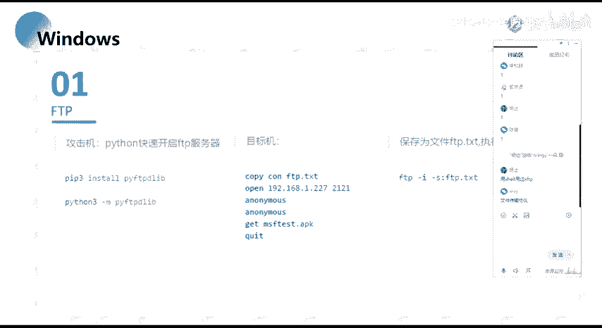

就是你打开1个sD的话，你输入FPP。对吧你就能够有这样子的一个客户端。然后在这边的话，这个FTP的这一个命令的话，它其实是一个命令。这个命令的话，它是windows系统里面的话都自带有的，就默认有的。

它是它的一个作用就是将文件传送到运行FTP服务器的一个服务计算机上面。

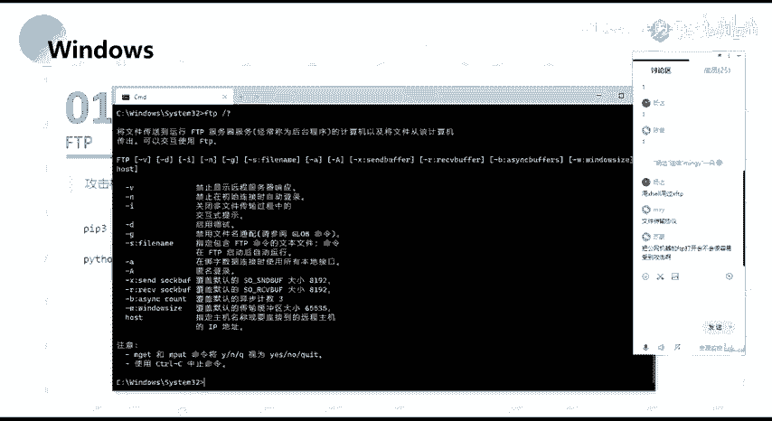

。把官网G器S0面打开呃，你的STP的话，因为。嗯。比较容易受到攻击。就是说你的1个MTP的话，如果说你没有去设置你的一个就是认证就是账号密码的。你允许他去进行一个匿面匿名登录的话，那么就是啊。

工具者他只要知道了你这一个机器的话，开放了FGP的这样子的一个呃协议的话，他可以直接去登录到你的一个机器嘛。然后的话还有就是你的1个STP的1个目录的话，需要做一个比较好的一个权限控制。

就是说如果说你虽然你设置了密码，对吧？你设置了你的一个用户名密码，但是攻击者他可以通过FTB的一个爆破，对吧？对你的一个机器上面的1个FTB的一个呃。协议去进行一个爆破。如果爆破成功之后的话。

它可以直接就是访问到你的1个FTB的一个目录，对吧？那么这个时候的话，如果你的这个呃FTP的这个目录的话，它是能够去进行一个有读取写入的一个权限或者是说执行的一个权限的话。

那么它可以把自己的一个呃恶意文件，对吧？上传到你的一个机器上面，然后去执行来访谈线。然，我在这边的话，我们就是使用的呃，我在这边的话是首先的话是这样子的一个流程。就首先第一步的话。

我们在公积机上面用pathon的话，快速开启1个STB的一个服务器。然后使呃使用到的所使用到的话是这个PYFTPD的libb的这样子的一个呃库。这个库的话呃默认的话它是没有安装的。

我们可以通过PIP去进行一个安装。然后的话使用python3杠M指定这样子的一个呃模块。然后的话就能够去开启1个STP的一个服务器。然后第二步的话就是在目标机上面，我们需要去写入这样子的一个脚本。

这里的一个脚本的话，我们来看一下。首先第一行的话就是通过这边的一个copy呃，copy的这一个命令，把我们下面要写入的这样子的一些呃语句，把它给写入到这个FTP点tex的一个文件当中。

然后我们写入到这个FTP点tex文件之后的话，我们。就是它会保存为这样子的一个FDP点tex文件嘛。然后的话我们就可以去通过FTP杠杠S指定的一个t文件，也就是保存的这边这一个脚本内容的这一个文件。

然后的话就能够去自动的去下载我们这边所指定的一个呃文件。然后我在这边的话是呃随便的写了这样子的一个APK的一个文件，是吧？然后的话实际的话我们实际实际去使用的话。

就是说我们已经得到了就是说它的我们要去进行这样子的一个操作的一个前提，对吧？就是说我已经得到了有一某一个机器，它的一个呃ll。然后的话我想要去访谈一个ll，就是说我需要去上传我的一个木马的一个文件对吧？

或者说上传我的一个码。然后的话我要上传码的话，我需要把我的一个文件，把它给上传到我的一个目标机器上面去对吧？然后在这边的话，我们就可以通过FTP的这里。

ge来获取我们在公积机上面呃FFTP服务器上面所存放的这样子的一个木马文件。然的话下载到这一个呃目标机器上面去进行一个执行。好，呃，这边的话我们来看一下。

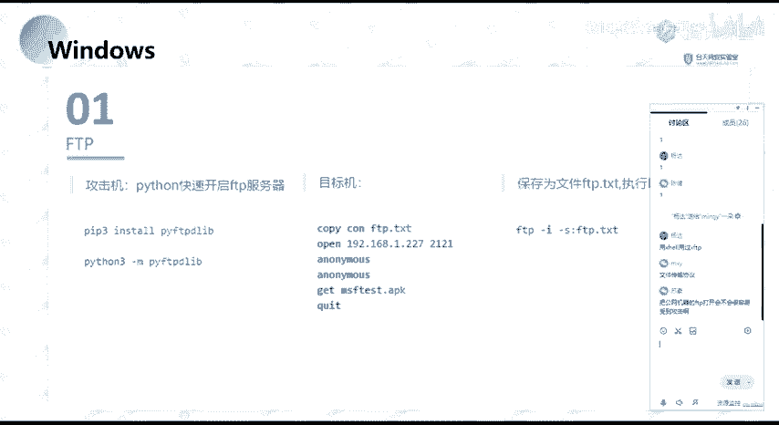

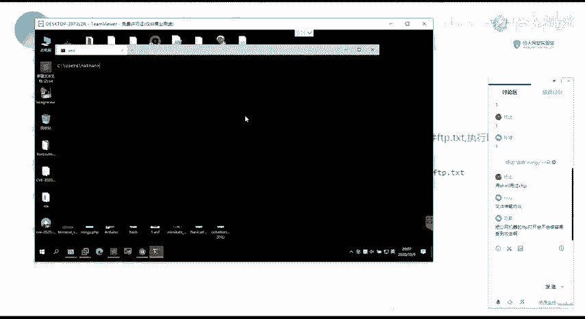

呃，首先的话就是说呃我这边的话，我就不去就是说做前面的那一个拿谢尔的那一个操作。就是说我们拿到那个谢尔之后的话，我们就可以去执行相应的一些命令，对吧？然后的话我在这边的话。

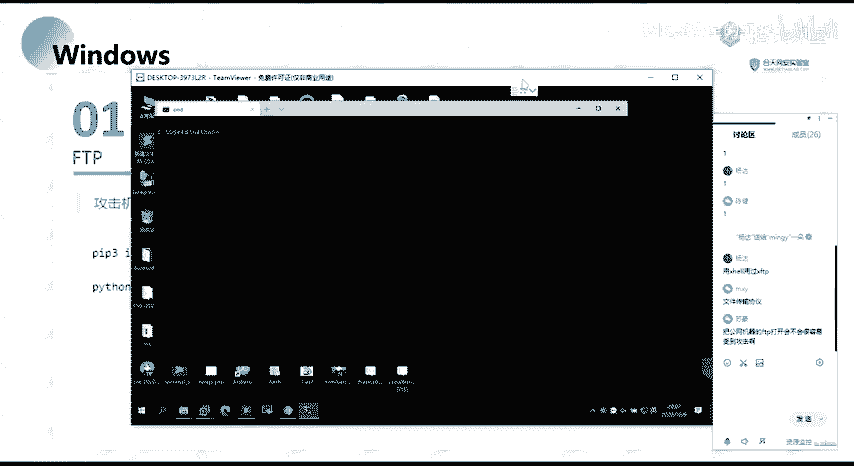

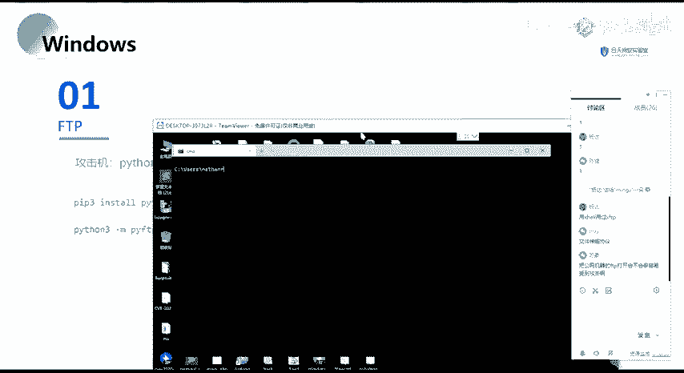

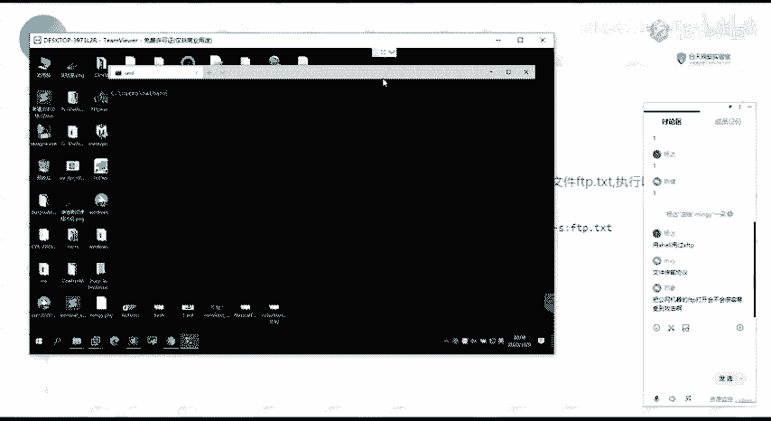

首先我的我在我自己的一个机器上面，也就是。嗯。我在我这边的一个呃是。

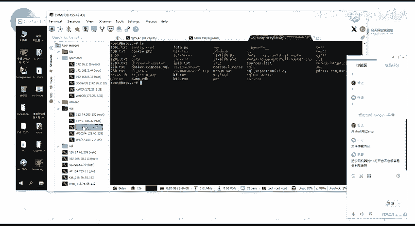

我在我这边的这个机器上面。我先通过。开审的一个这一个模块来去进行一个快速的开启1个FTP的一个服务。然，我这边的话是已经安装了这样子的1个PYFTPD拉er的这样子的一个库。冇装。没装的话。

我这边抓一下吧。嗯。Yeah。哦，我用这边的这个机器啊。

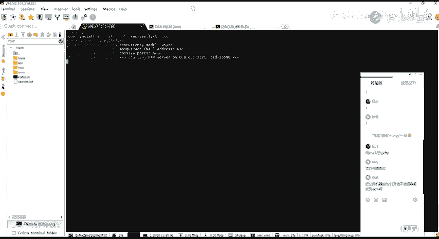

我这边的这一个机器的话已经安装了这个样子的一个模块，然后的话直接通过这样子一个命令就开启了这样子1个FTP的一个serv。然后这里的一个serv的话，它默认是开放在2121的这一个端口上面。

然后我在这边的话，我以就是说我以这个in做点SH的这个文件为例，对吧？当然的话我们可以把这边的这个文件，就是说我们想要去呃上传到目标机上面的这一个文件的话，呃，改成任意的一个啊码字，对吧？任意的一个码。

然后我在我的一个目标机上面。也就是说我们已经得到了这个需尔的这个机上面。

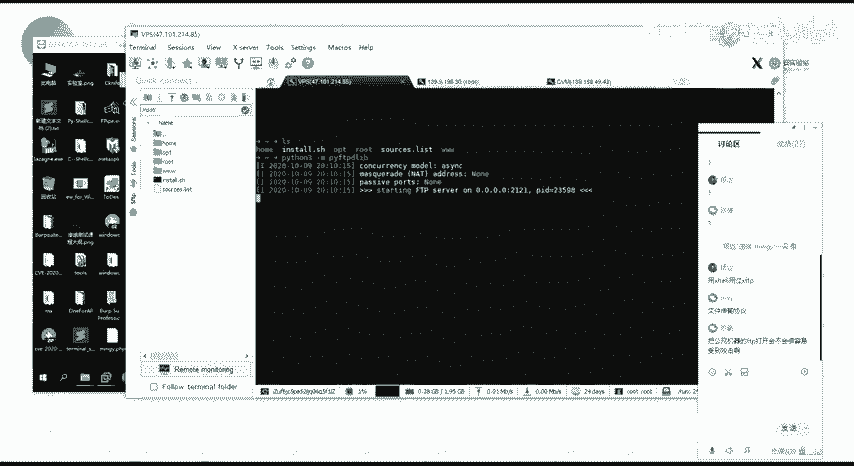

我们写入这样子的一个。他指的一个就脚本。然后这个脚本的一个内容的话，就是去连接我们这边的1个FTB的1个serv。我这边的话是。

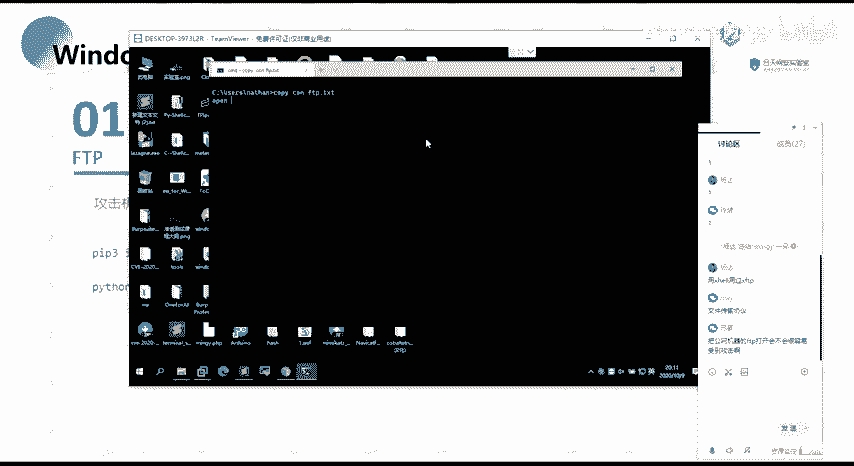

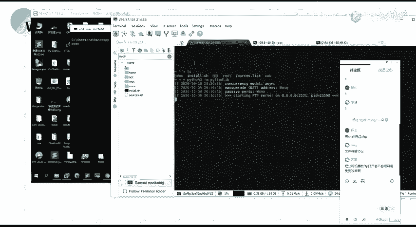

这一个。17点了。然后端口的话是2121。嗯。

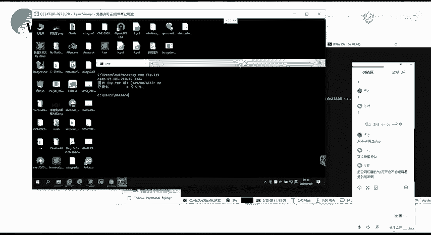

这边的话已经有一个。

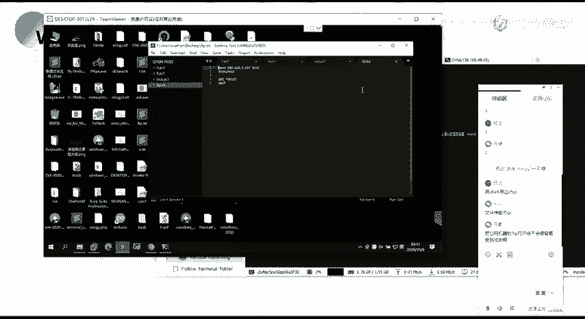

把这个删掉。我这边让重新写一下。怎。好，呃，我写的一个脚本的一个内容的话，就是这样子，我给大家来解释一下，就是说我这边的这个脚本它的一个意思。首先在这边的话呃。呃，我先从这边开始说吧。

这边的话刚刚有说了，对吧？就是用的这个copy的一个命令。然后这边的一个CON的一个意思的话，它表示我们的一个控制台就是说这边整体的一个意思的话，就是把我们从控制台的一个输入。

把它给复制到我们这边的一个文件当中。然后这边控制台的一个输入的话，其实就是我们后面所输入的一个内容。然后首先第一个就是open，就是你呃FTP的话，你首先你要去连接我们的1个FTP的一个服务。

所使用的一个命令的话就是这一个open。然后的话指定我们FTP的一个服务IP以及端口。然后的话下一行的话就是回车回车之后的话，下一行我们写的是我们的一个用户名以及密码。

然后我这边的话是使用的一个匿名登录。匿名登录的话就是用的这一个anonymous也就是匿名者嘛。然后呃下下下一行的话，这边的话是一个密码。我这边留空的话，就是说因为我匿名登录的话。

我可以就是说呃可以不输入密码，我直接输入一个这样子的一个anonymous的一个用户名就能去进行一个登录。当然的话你也可以输入，就是说密码是为这一个anonymous，也就是用户名密码都为这一个。

你也可以去进行一个登录。然后我这边留空的话，就表示就是直接回车。然后下面的话就是说我们连接成功之后的话，我们通过get这一个命令。

get的话就是去从我们这边的一个FTB的一个服务器上面去下载我们想要的一个呃文件。也就是我这边的话是以这个inst点SH为例，对吧？然后的话get完毕之后的话，我们cutt退出。

然后这边我们把我们的脚本写完之后的话，我们想要去把这个内容把那个写入到这边的话，我们直接ctrl G。注意是ctrl之一，然后的话回车这边的话就已经复制了一个文件。啊。

我们可以通过太普来查看一下它的一个内容。对吧这边的话就是我们所写入的一个内容。然后的话我们通过FTP的这样子的一个命令。

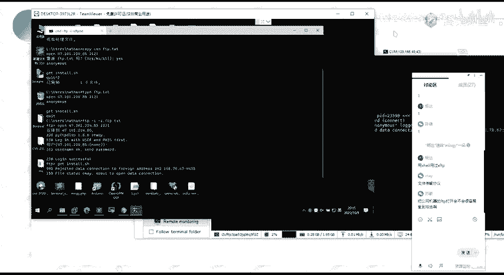

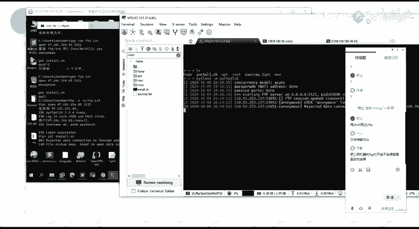

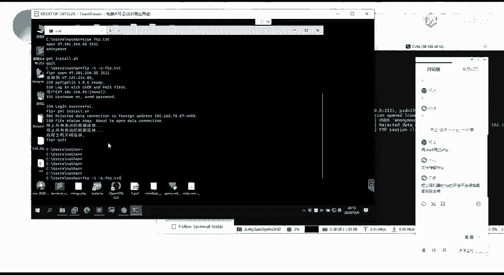

嗯。

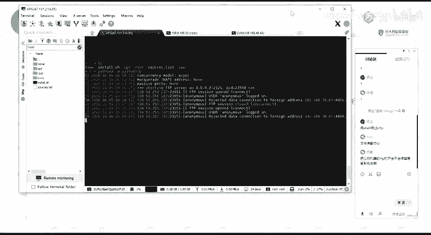

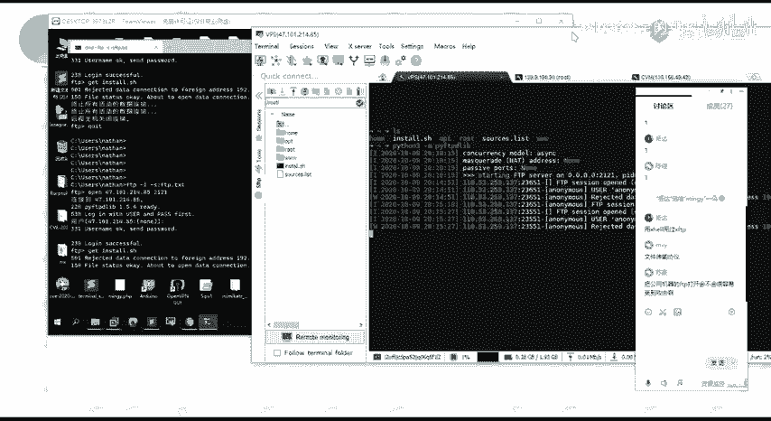

这边的话呃。出了一点问题啊。这边的话我们可以看一下，在这边我的1个FDP的1个servver的话，可以看到在这边是已经就是说提示我这边的一个anonymous的这一个用户已经是登录了，对吧？

登录之后的话，他呃在这边的话。

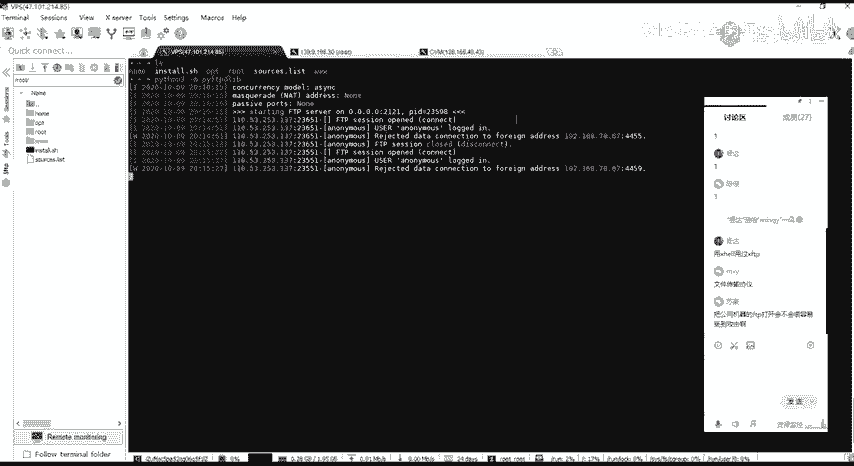

他拒绝了我的这边的一个就是请求啊。

看一下。

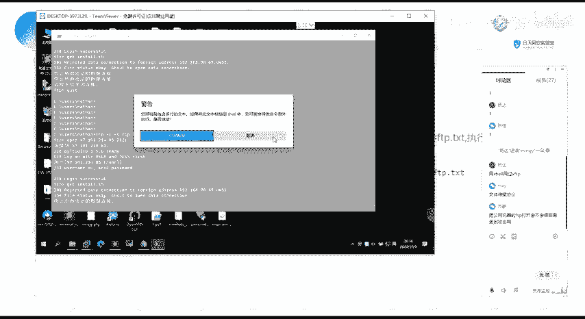

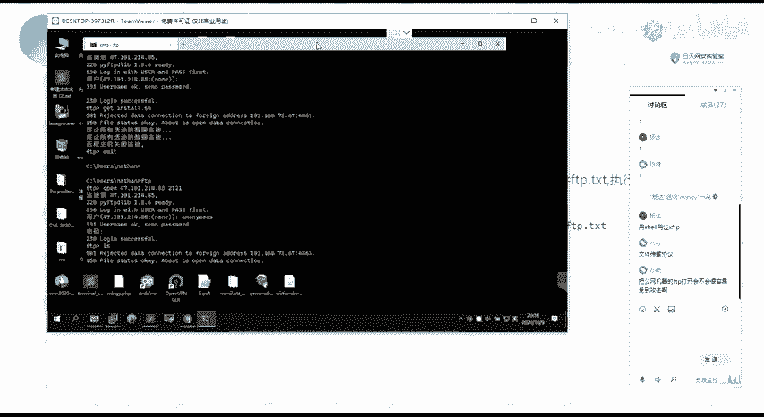

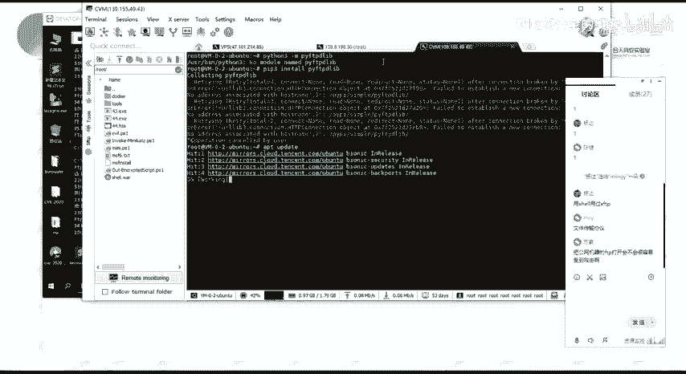

稍等一下。

那怎么回事呢？嗯。

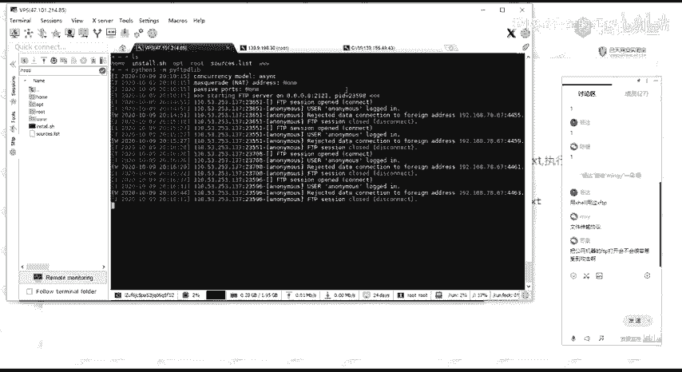

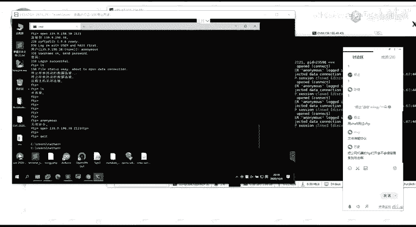

呃，这边的话碰到了一点问题啊。

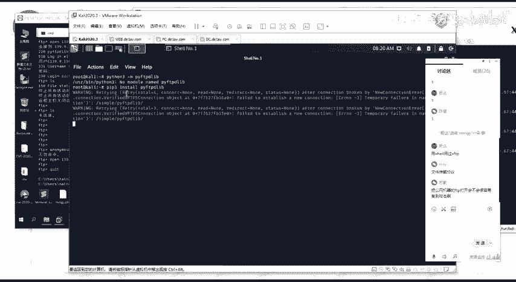

哦我今天试的话是没有问题了，怎么突然就。那是不是服务器的问题啊？

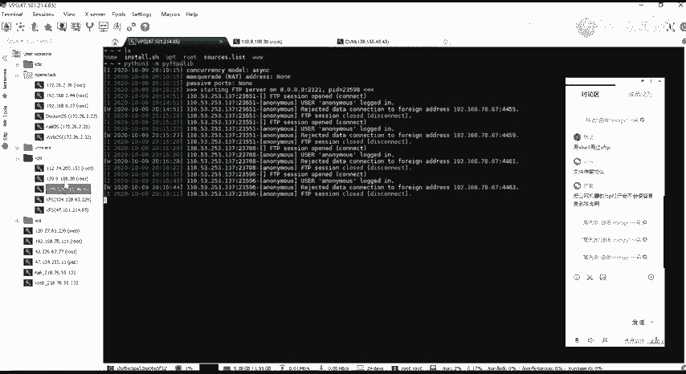

。

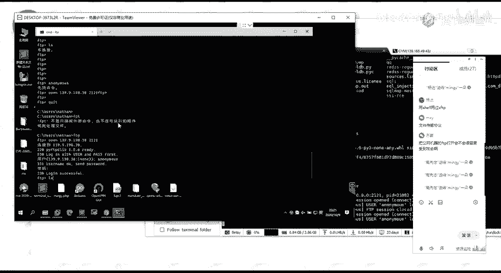

呃，这边的话先。先挑拨吧，好吧。大家大家试一下，应该是没有问题的。我这边不知道怎么的，就我今天还试了，就是说。是没有问题的。就是说我这边STP连上去之后的话。

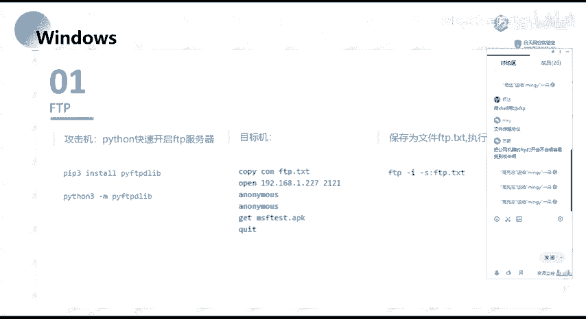

嗯。就是说我这边FTP连上去之后的话，对吧？我这边的话已经loggan。successful是吧，就是说登录成功，登录成功之后的话，我可以通过输入LOS的一个命令的话。

就能够去查看到当前的一个就是说这个FTP的这个服务。这边的我这边的这个FPP的这个server，就是说我当前的话是这个server，它是在当前的这个目录下面，对吧？那么我连接上去之后的话。

我就能够去查看到当前目录下面的所有的这种文件以及文件夹。然后的话我可以通过。通过get的这一个命令来去接收指定的一个文件。而后我这边的话就是说接收的话就是这边的这个inst点SH的一个文件，对吧？

那我就可以通过getin点SHH。点下H取来去下载的下载这一个文件，当的话这边。

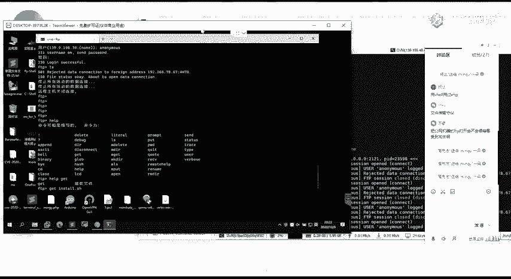

他报了一个这样的不错，就是说。他这边不允许去。这边的服务端他不允许我这边的这个IP去连接哦。我不知道是不是被禁了。嗯。😊。

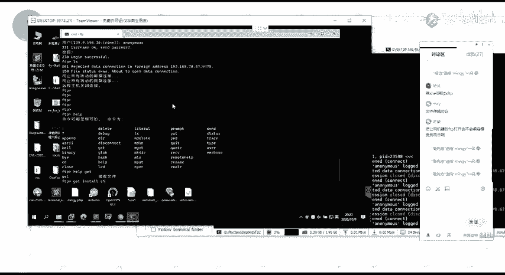

我这边的话呃我课后的话再去看一下，好吧，大家可以试一下。我我不知道是我这边的一个问题还是怎么样的。好吧。我们。

