# 2024网络安全系统教程！清华大佬花159小时讲完的网络安全系统课！别再盲目自学了，学完即可就业！零基础入门网络安全！（渗透测试／漏洞挖掘／CTF／黑客技术） - P56：43.Bitsadmin命令行工具上传文件.mp4 - 教网络安全的红客 - BV1ft421A7Nj

然后第二个的话就是这个beats amin。 beats amin的话，它是一个命令行的一个工具。我们可以用它来去进行一个创建，还有下载。呃，创建下载，还有上载的这样子的一个作业。然后的话近视其进度。

就其实说白了这这个的话就是be a面的话，它是windows下面的一个自带的一个工具。然后这个工具它的一个作用的话，就是说我们可以用它来去进行一个呃文件的一个下载。然后使用它的一个具体的一个步骤的话。

呃，首先的话在这边。呃，我通过MF v去生成这样子的。像比如说一个这样子的1个HTA的这样子的一个呃。木马然的话我通过这个beS的命来去呃。

把我们来去把放在我远程服务器结束我VPS上面的这一个4试点HTA的这个文件，把它给下载到我本地。然后的话下载之后的话，我再通过这样子的一个方法来去进行一个加载，来去get share。然后在这边的话呃。

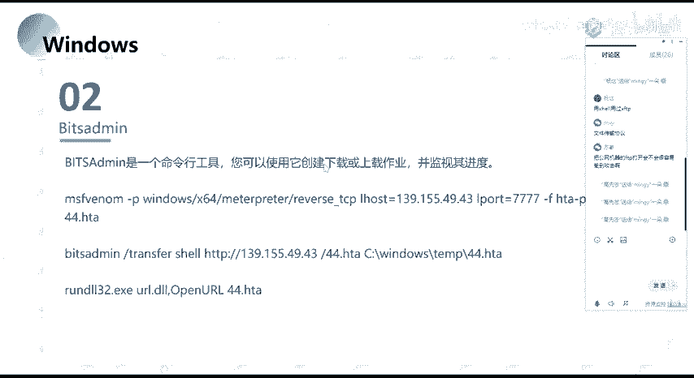

直接演示吧，我们直接来看效果。嗯。我这话用我的这边的这个机器啊，我首先。提一下我的1个MSF。然后的话呃。通过这样子的一个命令，通过MSF reno来去生成一个这样子的1个HTA的一个文件。

这个文件它就是一个呃木马文件。然后我们可以来查看一下这1个14点HTA的一个内容啊。

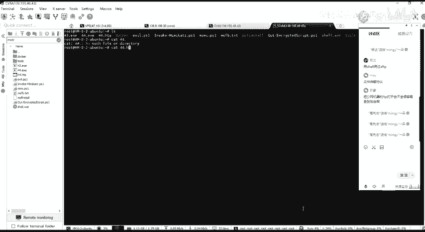

可以看到它的概的话，其实就是像这样子然HTA的话呃大家了解它什么东西吗？大家有了解，就是说HTA。就这种文件，它是什么吗？啊，我这边的话呃直接就是百度来查看一下吧，就。大概的了解一下它的一个意思。

就HTA的话呢是1个HTM的 application的一个缩写，其实就是1个HTTM的一个应用程序。然后呃它是直接将我们那个HTM保存成这样子的一个格式，可以把它当成一个独立的这种应用软件。

然后我们看一下它的这一个例子，它其实就是1个HTM的一个代码，对吧？然后的话我们的这样子的一个代码的话，我们可以去呃就是把它作为一个应用程序。然后具体的一个实现的话，我们来看一下这边。

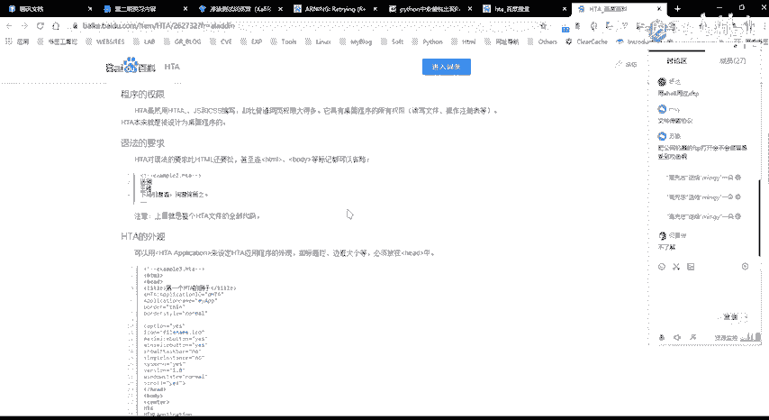

前面这边的话，它其实就是一个呃指定了一个我们使用的一个脚本，就是一个VB script，也就是一个VB的一个脚本，对吧？然后在这边的话，后面的这里的一部分内容的话。

其实我们主要的话就知道在这边它主要的话就是使用了这个c object来创建了这样子的一个对象。主要的话就是用的这个Wscript点 share来去执行我们的一个命令。关于这一个的话，大家可以呃。

百度一下。

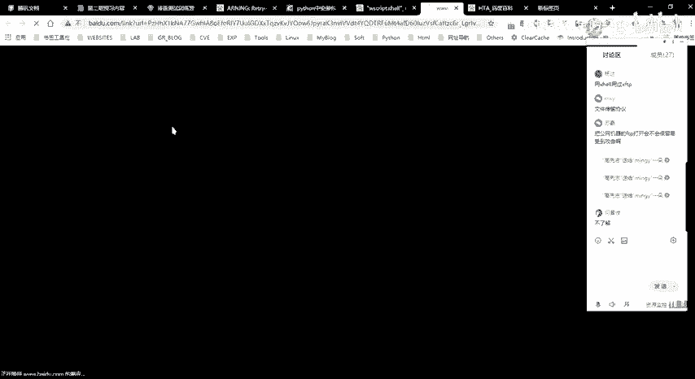

它是一个就是一个对象。然后的话我们可以通过创建这样子的一个对象来去运行程序。比如说操作注册表啊，创建快捷方式，还有访问文件夹等等，对吧？然后在这边的话，我们就是创建这样子的一个对象。

然后的话来去执行我们这边的一个po share的一个代码，对吧？其以我们可以看到就是调用的就是我们这边创建了一个对象付给了这一串值，对吧？然后的话它调用了这样子的一个乱的一个方法。

然后的话来去执行我们这边的一个po share的一个脚本。这边的一个抛 share脚本的话，它是就是后面的这一串的话，它是做了一个base64的一个编码，对吧？

我们可以通过呃相应的一个代码去把它做一个解码。

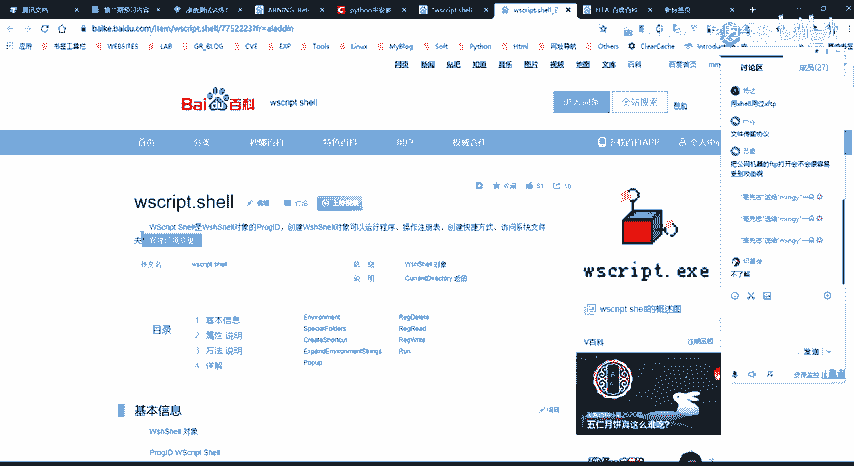

证据解释。这边的话有有啊。嗯。咋回事？这的。这边的话呃。其实就是一个这样子的一个脚本。我们可以通过把就是说把我们这边的一个base64的这样子的一个编码的一个代码的话，把它做一个解码。

我们其实可以看一下它里面的一个内容啊。就是这样子的一个东西啊，然后我们可以通过嗯。看一下。嗯。嗯。嗯。

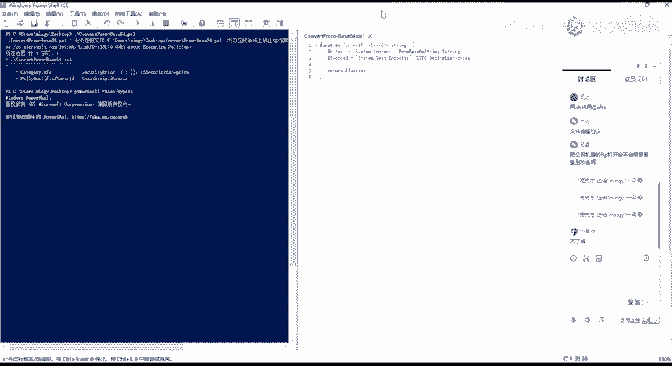

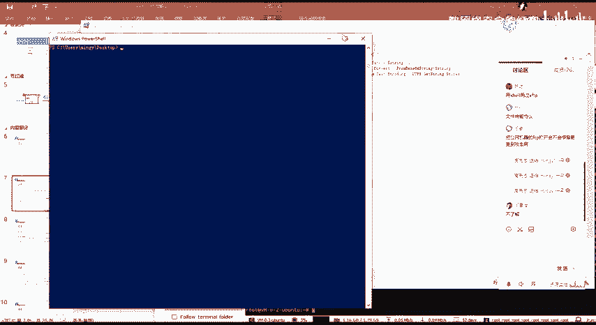

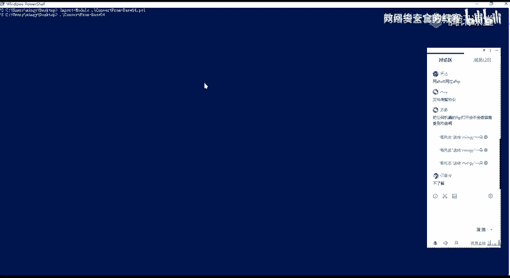

啊，不是搞诉了，是这个方法。

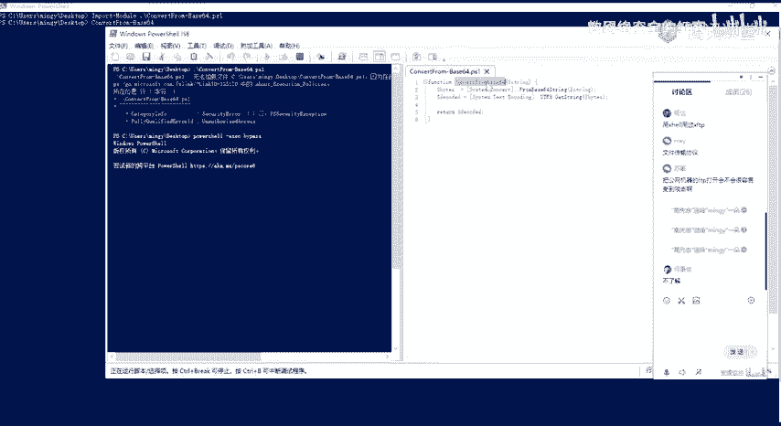

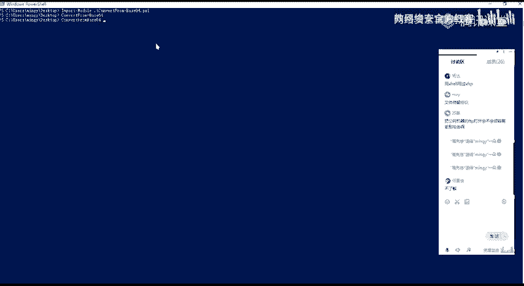

然后呃在这边的话就是解密之后的话，就是这样子的一串啊，我们可以看一下，就是这边的这一串内容。就这边的这一串内容，然后这边的这一串内容的话，它其实也是就是一个po share的一个这样子的一个脚本，对吧？

然后我们可以看到它在这边的话，就是他会去调用呃你系统里面的一个po share的这样子的一个EX的一个程序，对吧？然后的话再去执行我们后面的这边的这一个内容。

然后其实我们可以看到在这边后面的这一些内容的话，像比如说杠NOP以及杠W开的对吧？这个的话都是我们常见的这样子的一个呃参数。然后后面这边的话，它是同样的他又做了一个b64的这样子的一个就是编码，对吧？

然后其实在这边他同样的就是他会把这边的一个6贝64的一个内容做一个解码。解码之后的话去进行一个执行。我这边我就不再去做一个解码了。就他通过这样子的一个方法做了一个就是呃编码的一个混淆，对吧？嗯。然。

呃实际的话在这边的话，他其实就是会去执行这样子的一个脚本。这这边的一个抛屑的一个脚本。这边执行之后的话，它是一个反他需尔的一个呃目的啊。然后我们这边的话生成生成之后，生成之后的话，我这边先通过。

好妈待会给你一个今天。然呃设置了配load之后的话，设置我们要去今天的一个our host。在这边的话，我再去说一遍，再说一遍。今天又有两位同学又问我这这问我这一个就是我已经说了很多遍了。

就是你的1个VPS对吧？像比如说这边我这边的这个VPS。我这边的1个VPS，我的1个公网IP是这一个对吧？然后的话你的一个你的这个VPS，你不是独享的1个IP，也就是说你的这个机器的话。

就是有一个专门的1个IP能够去直接访问到，对吧？

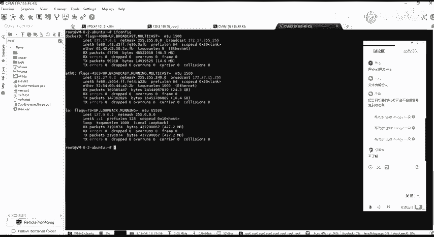

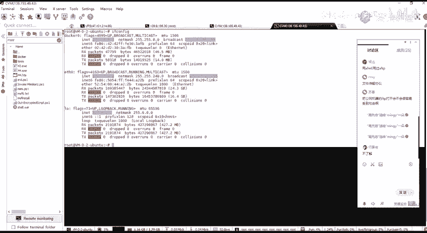

就是独享IP。那么你如果说你是一个独享IP的话，那么你的一个公网IP。就是这个对吧？以及在这边有1个ETH0的这1个网卡，你的这个IP它也是一个公网IP对吧？那么像这种的话。

像这种VPS像阿里云腾讯云的这种VPS的话，它其实是相当于就有一个做了一个这样子的一个映射，对吧？就是说通过这样子的一个公网IP。来去映射到了这边的，就是说把我们这边的VPS的这个。

IP就说这个机器啊映射到了这样这样子的一个公网IP。那么我们要去今听一个端口的话，我们是我们在本地这边的话，只有这几个IP对吧？我们要去今听一个端口的话，我们不是使用我们的一个公网的一个IP啊。

你去用公网的IP去今听的话，你是今听不了的，它会它会有一个报错，对吧？就是notote就是notote什么什么那个对吧？然后你要去今听一个端口的话，对吧？你去指定的一个IP的话。

你就就是你要去今听你本地的一个端口，你指定的一个IP就指定这1个ETH0的一个IP。去。啊呃 exploit。去这立一个监听对吧？在这边的话就没有任何报酬的了。

然后如果说如果说就是说呃有同学有同学是一个就是独享的1个IP对吧？就是说你的个公网IP跟你的这边你去查看呢，就是说ETH里那个网卡，它其实是同样的，也是一个公网IP。那么你去今天的话。

他你就去今天你的公网IP就可以了。就在这边要host指定你的一个公网IP它就能够去访问到这样子一个端口。啊，我这边今听之后的话。今天之后的话，我这边有这样子的1个44点HTA对吧？

那么我们要怎么去把我这边的一个生成的这个HTA的这样子的一个呃木马文件，把它给就是上传到，或者说下载到我这边的。

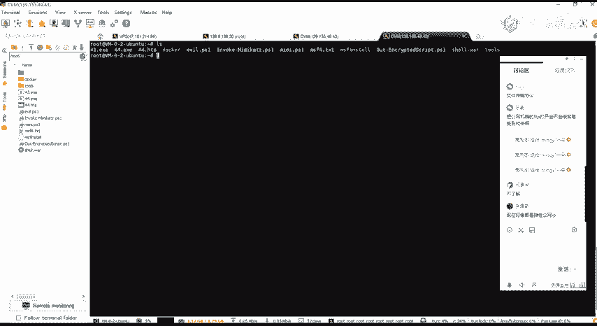

这个机器上面去进行一个执行的。在这个时候的话，我们因为我们前期的话是已经得到了这个机器的一个。

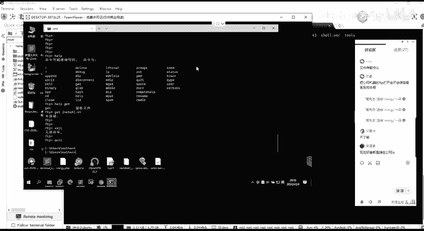

就是有一个基本的一个权限，我们也能够去执行命令，对吧？那么我想要把我的这一个文件放上去，它是一个windows机器，我们可以通过BTSad命这一个命令，这一个命令行的一个工具来去进行一个文件的一个下载。

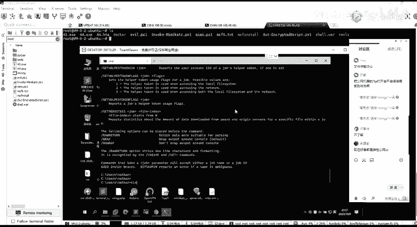

然后在这边的话，我们呃看一下，看我的PPT。

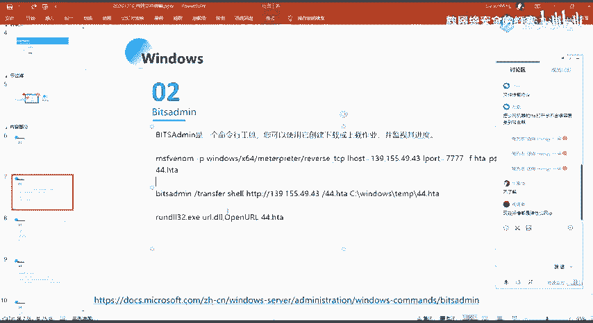

具体的一个面料的话就是像这样子。我这边我就不敲了，我直接复制。

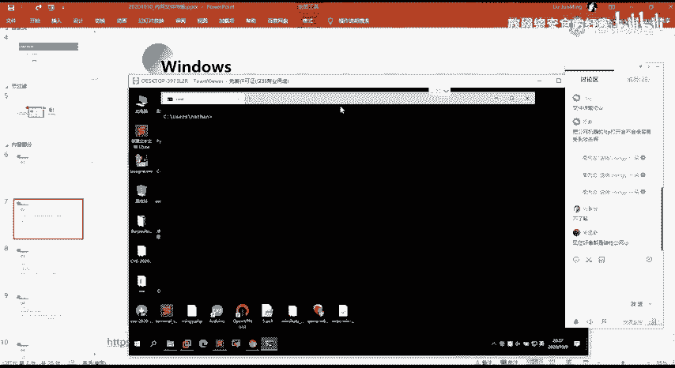

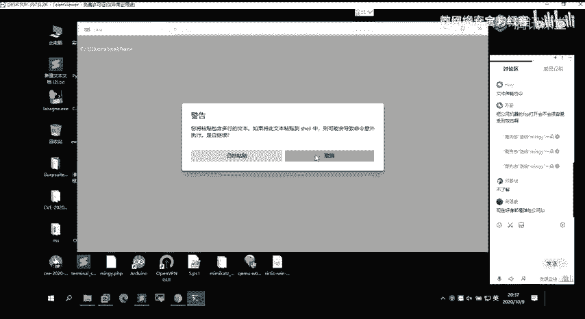

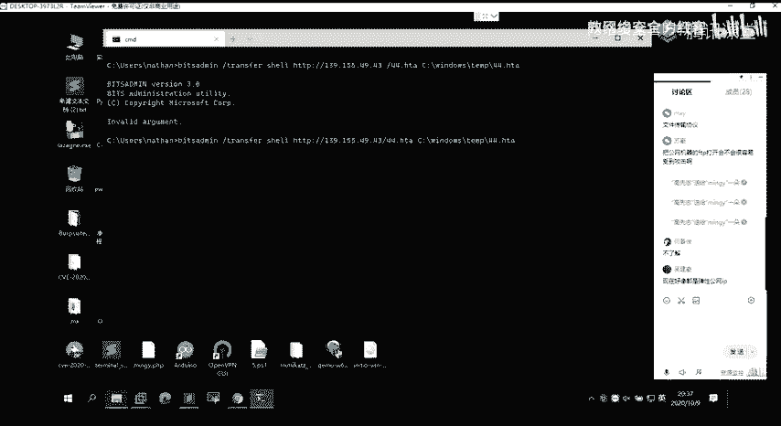

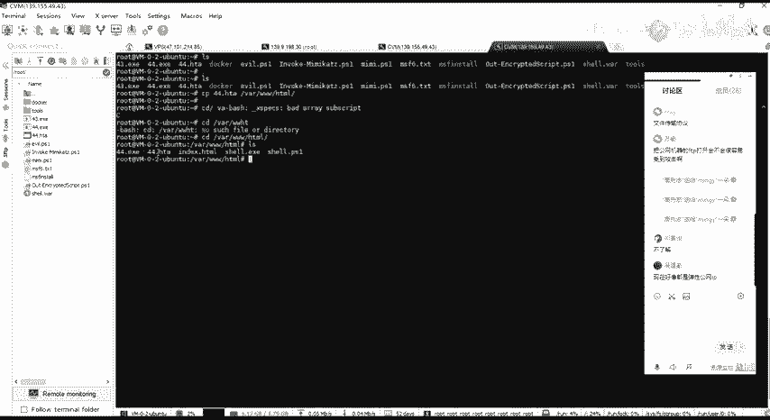

然后我这边的话，我把这个HT文件放到了我的一个就是阿帕奇的一个外本目录下面。然后的话我去进行一个执行。

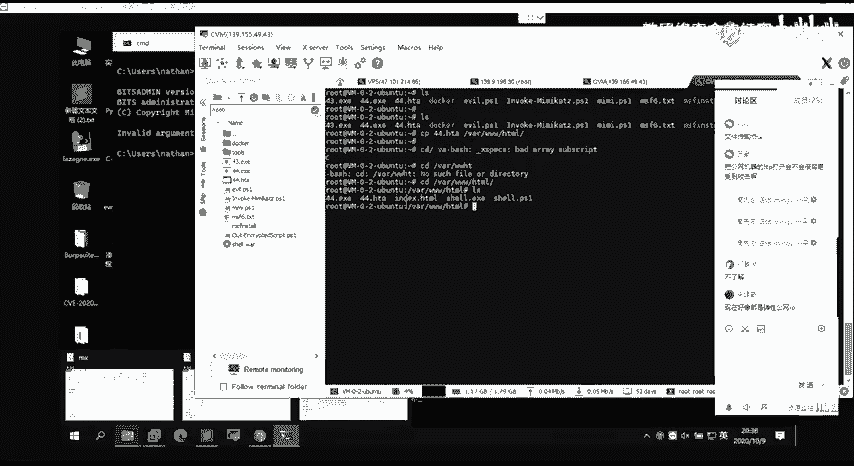

执行之后的话，我在这边的话。可以看到他在这边会有这样子的一个进度啊。我这边执行执行的一个面的话，就是像这样子，在这边的话，我先啊我们先来看一下，就是说。这边的这个目录下面是否有这样子的一个文件？

我们来验证一下，就是说。这一个我的这一个命令它是否就执行成功了，对吧？可以看到在这边我是把我这边的1个VPS上面的这个HTA的这个文件把它给下载到了这个幕下面，对吧？可以看到已经成功的下载下来。

然后我们回过头来去了解一下，去理解一下这一条命令它的一个大概的一个意思。在这边的话，主要的话就是用的这一个trans。呃，这边的话大家记一下就行了，好吧。

你要想要去就是了解它其他的更多的这样子的一些功能面令的话，你可以通过干问号来去了解。这边的话我们使用的就是这个trans。这一个这一个参数啊，然后在这边的话我们。可以看一下这个亲是宝参数。

后面他所要去进行去所要去加的这样的一些参数，对吧？可以看到在这边有一个jo本 name。jo本 name的话就是呃我们可以进行一个随意的一个指定，就是指定我们自己想要的一个作业的一个名称。

然后的话后面的话只我们的这样子的，像我们的一个remote UL，也就是我们要去进行一个远程的一个文件的一个下载，对吧？我们需要去加我们的一个文件的一个URL。

然后的话local name的话就是把它保存到我们指定的一个本地的一个文件名。以及以及路径。然后我们回到这一这条面令的话。就是说这边通过transfer，然后的话指定我们的一个jober name。

我这边的话是指定的一个需要。当然话你也可以指定为其他的，就是随意的是吧？然后的话后面接我们的一个要去下载的一个资源的1个URL，然后的话接我们。要把我们的这一个资源下载到哪一个路径下面。

以及它的一个呃下载之后的存放在本地的一个文件名。然后我们这边就是下载完之后，对吧？我们如何去进行一个访弹需要呢？就是如何去执行这样子的1个44点HT的一个文件。在这边的话。呃。

我们要使用到这个run deal。32。这一个程序的话，在后面再讲区进行，再讲window下面的一个反拉需尔的时候会去。讲到怎么去进行一个呃使用啊。然后这个runer32的一个作用的话。

它其实就是去就是去注册调用我们的一个DL。然后在这边的话，我们要去使用到的话，就是使用到这个UR点掉。这个的话，它在windows里面的话，它是一个。呃，就是一个我们知道调二的话，它是一个共享链接库嘛。

对吧？我们可以通过这个rund32来去调用就是。来去注册这样子的1个U2点D。然后这个U2DL的话，它有这样子的一个。O。Oen URLL。都这样子的一个呃。

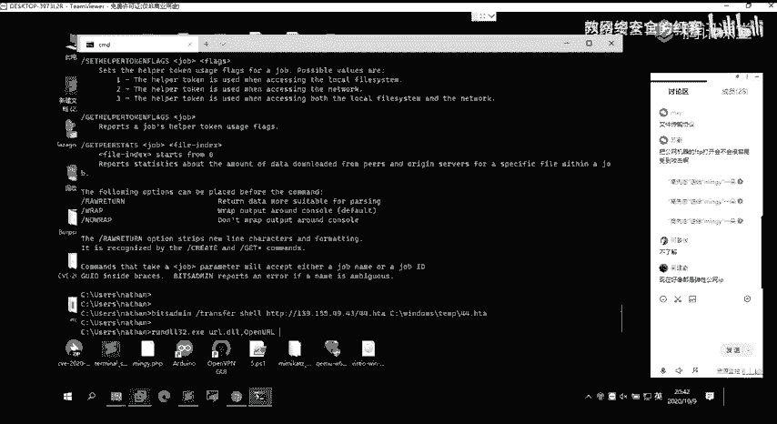

什么来着？对对。有点弯了。呃，其实具体的一个东西的话，你可以去看一下我这边的一个预习内容，就是这边预习内容的话已经有写了就是。这个利用这个runer32来去执行程序。然呃它的一个这个run调上次的话。

它主要的一个作用就是去加载掉L。然后我们这边所要去加载的就是这个UR点调里面的这个open your的这个这一个函数啊。它是一个包含导出函数。然后这边的话就如果你懂这些东西的话，你可以去进行一个研解。

不懂的话，你就知道你就知道他怎么去用就OK了，好吧。

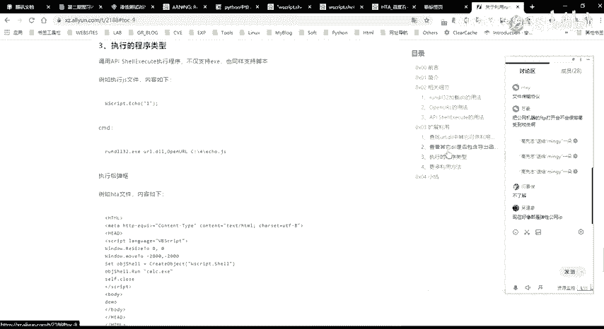

好，我们在这边的话，我们指定这个open your，然后然后的话指定我们这边的一个HTA的一个文件。そす。好，我们这边执行执行之后的话，在这边我们可以看到。

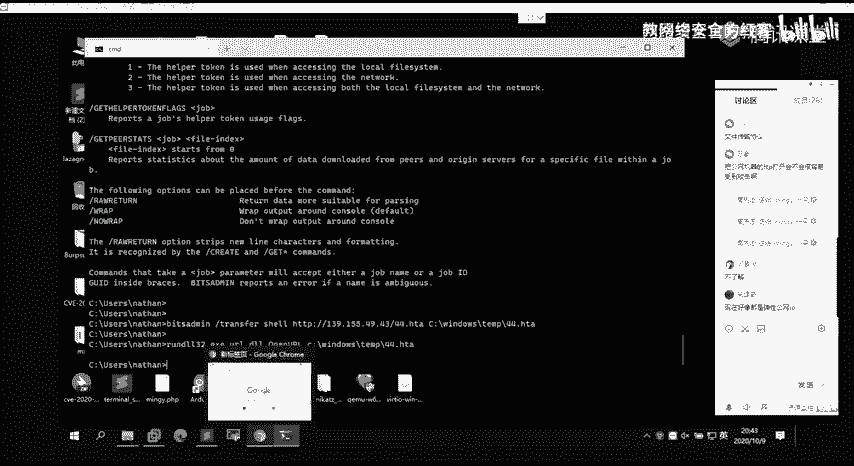

就我这边刚刚的这一个今天的话已经反弹为了这样子的一个筛选一。

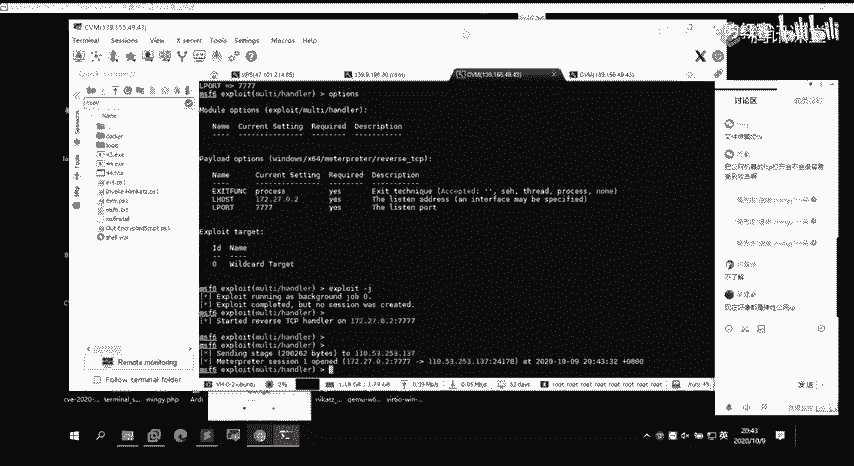

是。然后这边的一个。可以看到得到了一个声需尔的话，就是我这边的这一个机器的一个需尔。

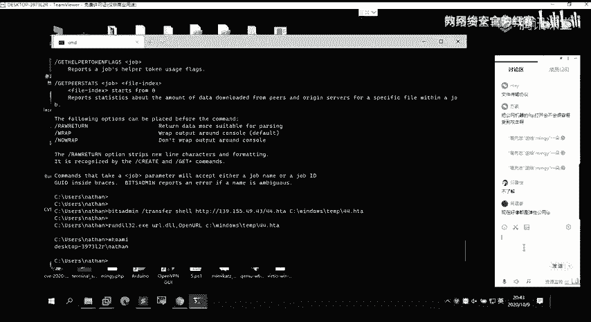

嗯。这个的话是使用这个beter amin这样子的一个命令行工具啊，以及通过这样子的一个实例啊，就是说去进行一个反兰需尔的一个实例。

然后第三个的话就是这个CRTUTL这个的话它是一个它同样的也是windows下面的一个自带的这样子的一个程序。这个关于这个东西的话，它是什么？他是一个什么东西的话。大家看这个预习内容。

就是看这个官方的一个文档。他是一个命令函程序，就是。作为证书服务的一部分进行一个安装，它它的一个作用其实就是去来存储啊，就是来去操作我们的这种证书宝。

它的一个就是通过命令行的一个方式来去操作我们这样子的一个证书，来去对这种证书进行一个呃操作。像备份还原啊、配置等等，对吧？然后在这边的话，我们实实际去用到去使用的话，就我们在我们这边渗透测试的话。

我们可以用这个命令行的一个程序来去进行一个文件的一个下载。具体的一个使用的话就是像这样子，就CR，然后的话指定这个杠1K，然后杠ple杠F指定我们的一个远程的一个资源。

然后的话把它下载到就是下载到我们本地之后的一个文件名。

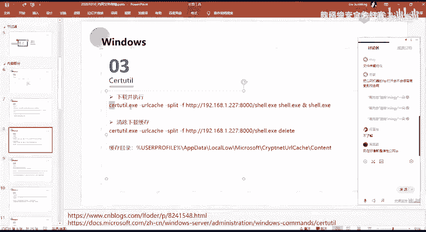

哦，我们先来看一下大概的一个效果吧。我这边的话。同样的就是以下载这个44点HTA这个文件为例吧。然后的话我下载到。本地下载到当前目录，然后的话保存为H44点HTA啊，好，我们回撤回撤之后的话。

我们来看一下当前的一个目录下面它是否有这样子的1个HTA的一个文件。

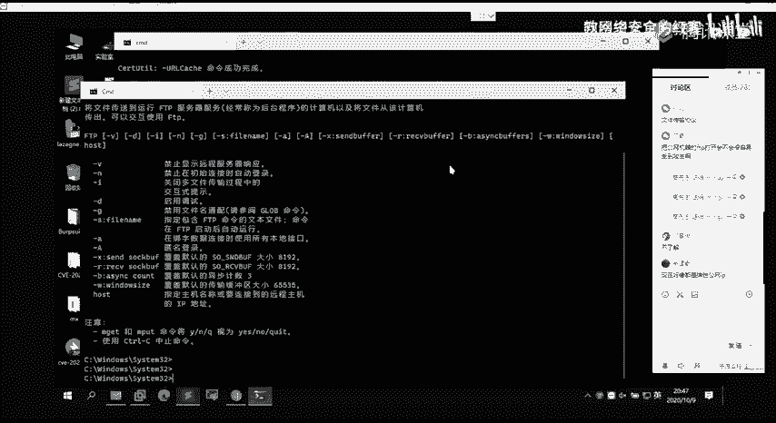

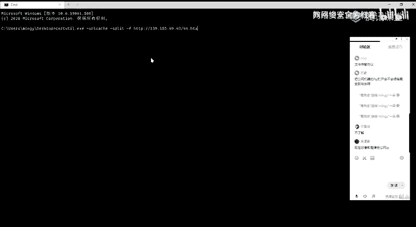

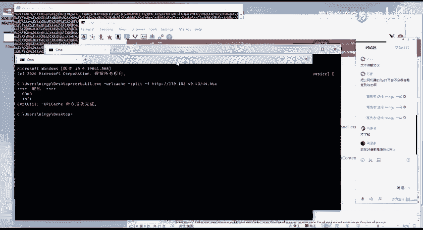

可以看到在这边的话，在这边的话，我们通过这一个命令啊成功的去下载了到下载了这个44点HTL。然呃就是正确的就是说他你执行之后的话，他会有这样子的一个回响，就是像这样子的。一个回显，就是你看到这一串的话。

就说明你的这一个命令的话，它是执行成功了。

然后呃我这边话是下载到了这里。我可以看一下里面的一个内容的话，就是这一些对吧？就是我们刚刚的那个文件的一个内容。

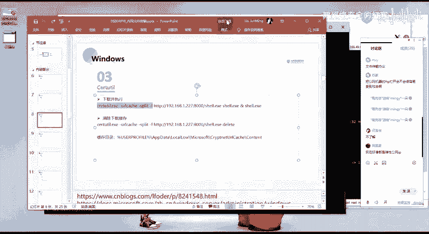

我们。