# 2024网络安全系统教程！清华大佬花159小时讲完的网络安全系统课！别再盲目自学了，学完即可就业！零基础入门网络安全！（渗透测试／漏洞挖掘／CTF／黑客技术） - P57：44.Certutil下载并执行.mp4 - 教网络安全的红客 - BV1ft421A7Nj

这是呃第三个。然后呃这个命令的话，就是说这个CRRTOTL这个命令的话有一个点需要我们去进一个注意。就是说我们通过它的这个命令去进行一个文件的一个下载。下载之后的话，它会有一个缓存。

就是说通过这个命令下载之后的话，它会有一个缓存式存放在这样子的一个目录当中。就是在这样子的一个目录当中啊，我这边的话先把它给删了。我把这边的这个缓存全部清掉了。

然后的话我再重新去执行一下这样子的一个命令。

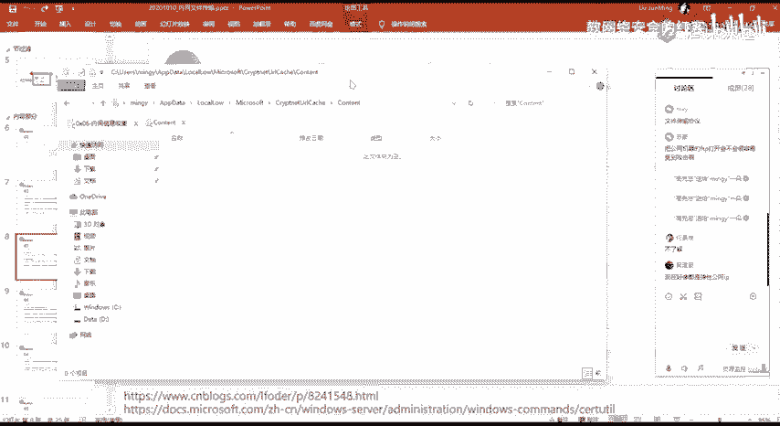

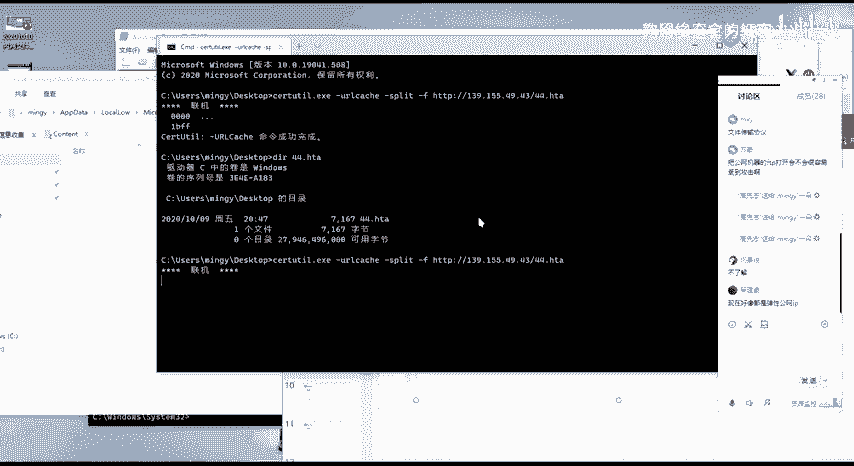

执行之后的话可以看到，就是说我这边执行下载完了我这边的这一个文件，对吧？然后的话在这个目录下面，它同样呢它会留存有这样子的一个缓存。这个缓存的一个内容我们也可以来查看一下，可以看到我的这边的这个缓存。

它的一个内容其实就是我们所下载的这一个文件，对吧？所以说的话我们去用这个命令去下载去下载了我们这边的这样子的一个木马。脚本之后的话，它会在这一个目录下面，它会有留下这样子的一个缓存。那么我们呃。

后面那个料的话，我们等会再那个我们先休息5分钟吧，先休息5分钟。呃，5分钟之后的话，我们在呃我们在。

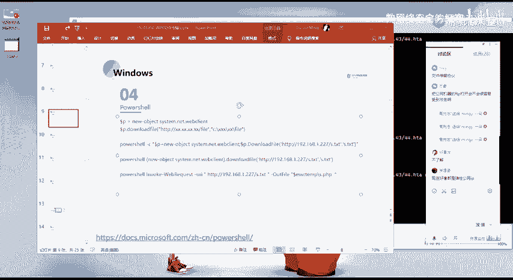

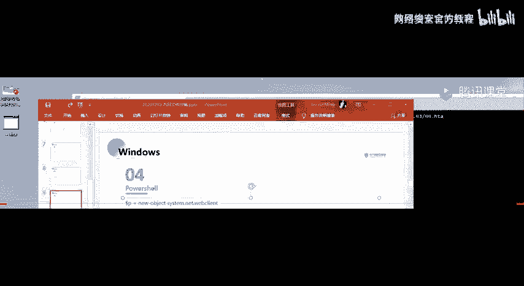

。是。好，我们继续啊。嗯。呃，前面的这三个的话，大家应该没有什么问题吧，应该能理解吧，其实就是。就是利用的就是windows系统下面，它自带的就是原本就有的这样子的一些命令行的一个工具。

这样子的一些命令行工具来去进行一个。进行一个利用，利用它来去进行一个呃，我们去下载我们已经生成好的这样子的一个木马，或者说啊工具文件等等的这样子的一些内容。应该没有什么问题啊。没问题的话，那么我们继续。

下面的话我们。一起来了解一下就是抛弃。就我们其实前面在讲信息收集的时候，就已经有介绍了，对吧？就是windows下面的话有这样子的一个po share的这样子的一个命令行工具。然后这个抛希尔的话。

它的一个作用的话呃，它的一个作用，它的一个功能的话是很强大的。然后在这边的话，我们可以利用它来去进行一个文件的一个下载。以及执行。以及进行一个呃文件的一个执行。然后在这边的话。

我们首先来看一下这这一部分，这一部分的话是为了就是让大家能够更好的一个理解。

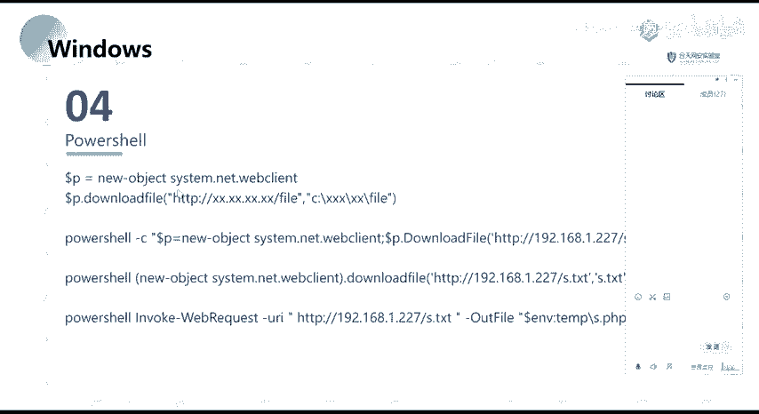

我们。嗯。

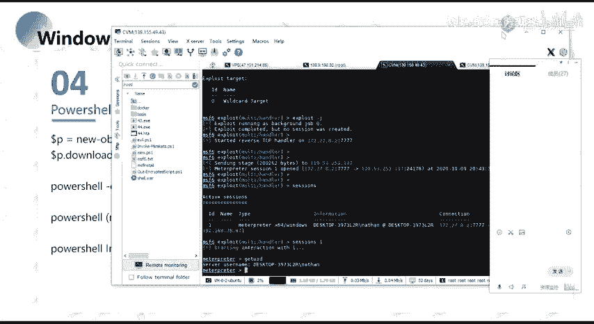

这边。

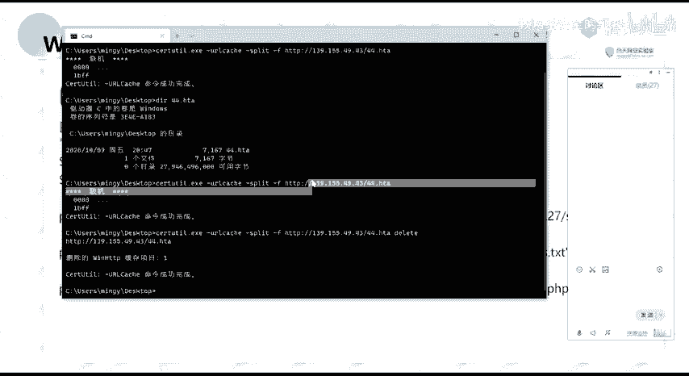

我们在sMD当中直接输入这样子的一个power share，对吧？输入之后的话，它会进入到这样子的一个命令行，对吧？

然后这里的一个power share的一个命令行跟我们原本的一个sMD一个命令行的一个区别，其实就是它在前面有这样子一个加了一个PS，对吧？然，我们在这边的话，我们已经进入了pa室。

那么我们首先来看一下第一个啊，我这边。

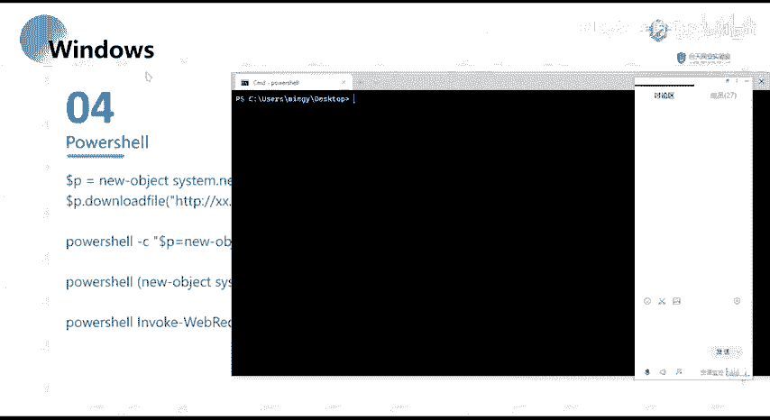

就这样了。首先来看一下第一个第一个这一个语句呃，我这边的话是把一个就是说把这个文件下载的一个功能啊，把它分成了2块，就两个部分就便于大家的一个理解。首先第一部分的话就是通过呃new object。

创建了这样子的一个对象。

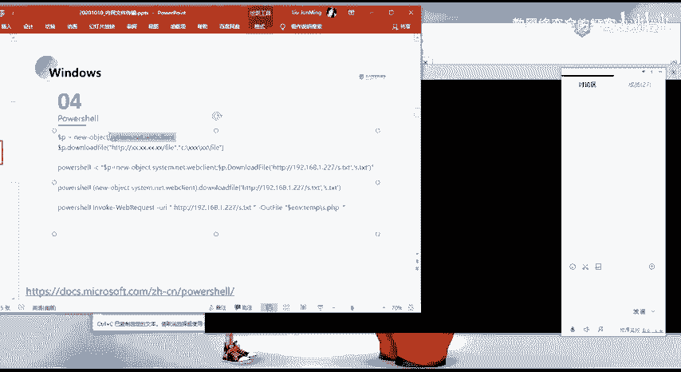

然后的话把这里创建的一个对象的话，把它给付给了这样一个变量P对吧？就多了符号的话就是表示变量的一个意思。然后这边的一个new objectject的话就是创建一个对象。

这个对象话是这一个sstem点 net点 web client这个这这边的话，大家记住啊，就是说就你去碰到这一个或者说你要去写这样子的一个抛的一个脚本的时候，对吧？你就直接能够去直接直接上手写的对吧？

然后这边的大家可能会有疑问的一个点的话，就是这一个new objectject的这一部分，对吧？你不知道它什么意思。就不知道是什么意思的话，我们可以来看一下。嗯。呃，预习内容。就预习内容这边的话呃。

我也给了这样子的。几个链接对吧？首先这个话就是抛 share的一个官方文档。就大家想要去学习pa的一个使用的话，大家可以去在这边的一个pa share的一个官方网档上面，官方文档上面进行一个学习，是吧？

就包括它的一个就是它是一个什么东西。对吧。他是一个他是一个他能够去干什么，他有什么作用，以及我们能够去用它，我们怎么去利用它来去写脚本去进行一个开发，对吧？好呃，第二个的话就是。

这样子一个po share常用的一个donnet，还有comm对象。这里的话就是我们呃这一篇文章大家可以去看一下。这这里的话就是我们。所要去讲到的这一部分。

就这里的一个创建的这个stem顶多net的这一个对象。然后其实在这边的话呃。前面这一部分大家自己去看好吧，我这边话我就不一一的说了。我们主要的话看这边。

主要的话看后面这边的就是说how share常用的这样子的一个点com的一个对象，以及还有常用的一个顶net的一个对象。

然后呃在这边的话就是说我们所使用到的其实是这一个就是说我们通过p share去呃创建了是这一个顶net的一个对象，对吧？我们可以看其实。嗯。在这边对吧？它是一个stem点net。

然后点web client。那么我们找到这一个。sstem点net。up client也就是这个。那么创建的这个对象，它的一个作用是什么呢？就是说他我们创建的这个对象。

他提供了常用的一个方法来发送和和接收我们URI标识的资源的数据。就是说我们可以通过这这一个对象来去进行一个就是。发送请求，还有接收，就是说资源的一个就是说URLURI的一个资源数据。

就是说呃能够去下载我们指定的这个呃资源的一个数据。然后的话我们回过头来看一下，在这边在这边的话呃。在这边的话，第二句的话主要就是这一个dontload fire。

dontload fire的话在这边你可以把它理解成，就是说这一个对象的一个方法。就是说我们创建了这个对象之后的话，我们可以调用这个对象它所提供的这样子的一个方法。

然后这边的一个方法的话就是donload file。从字面意思看的话，我们就知道它是一个就是说下载文件，对吧？就下载文件的话，我们知道就是说其实就是跟我们这边对吧？它提供的。嗯。

一个方法来去接收我们指定的一个URL资源的一个数据，对吧？就是其实就是这个donor fire，就是来去接收我们我们这边所指定的这个啊URL。的一个资源，然后的话把它给就是下载到我们指定的一个路径下面。

然后我们同样的以这一个就是说。

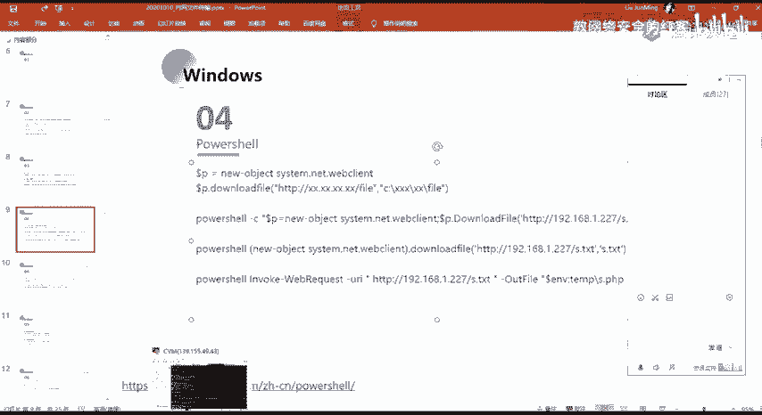

呃。

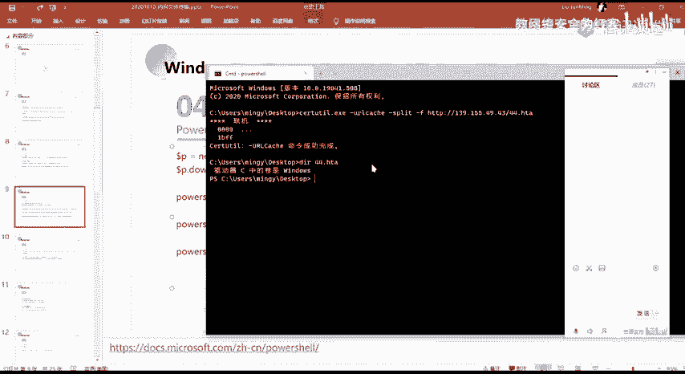

嗯。同样的以这一个。是。同样的以我们前面所下载到的这一个44连H切A的这个文件为例，是吧？然后的话呃我们来去通过这样子的一个方法来去进一个下载。

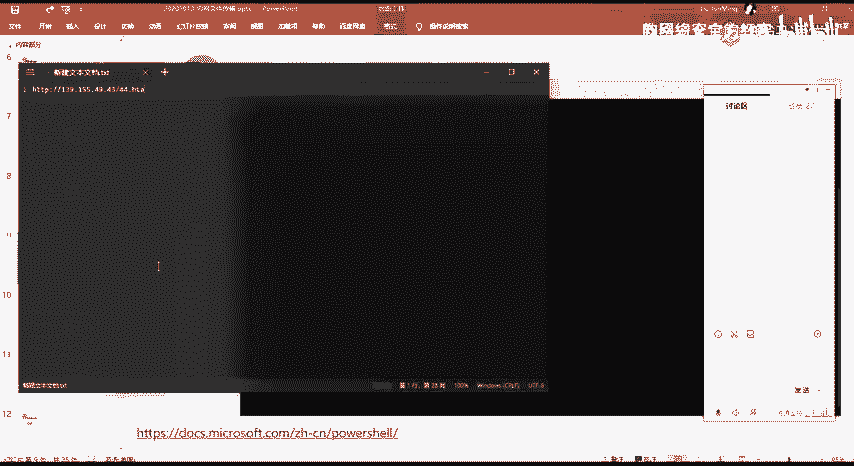

首先的话我们要去执行要去执行这一个命令的话，我们首先需要去进入一个抛弃，对吧？

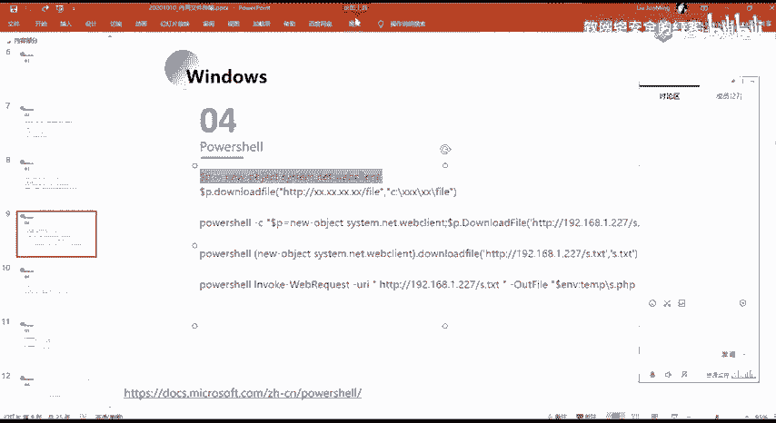

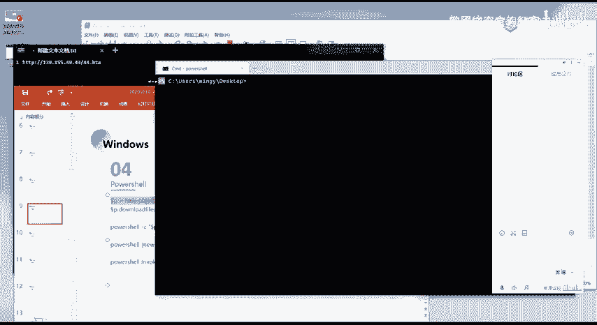

然后我直接粘贴啊，我直接粘贴进去，然后的话。

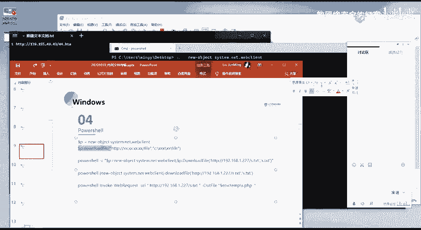

指店我们下载的一个资源的一个呃URL。然后的话指令我们要去就是把它下载到哪里，我这边的话直接就下载到当前的一个录像面。呃，我就。就。不实性。然后可以看到我这边执行之后的话。

在这边我当前的一个目录下面的话就生成了这样子的一个文件，就说明我通过这样子的一个方法，成功的下载到了我这边VPS上面的这个44点HTA的一个文件，对吧？

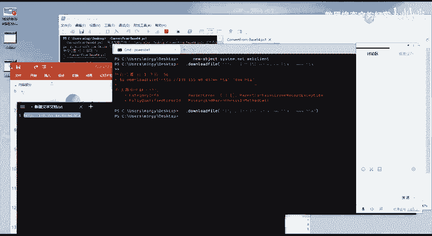

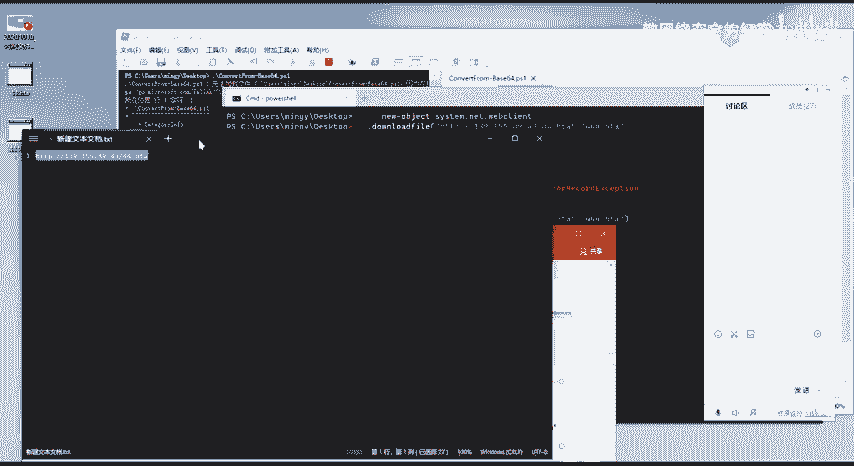

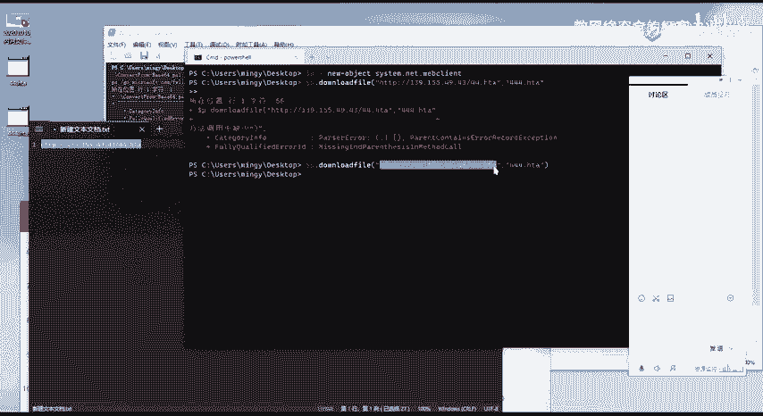

就是一个。好，下面的话。我们通过这样子的一个方法。就其实下面的这一句的话，其实就是跟上面的这个其实是类似的对吧？只是的话我们我们可以通过这边的一个操作。

我们知道我们首先需要去进入这一个part share，对吧？然的话我们这边有两条命令，我们需要输入两次，输入两次的话去进行一个执行，对吧？那么实际的一个情况的话，我们可能就是说我们。

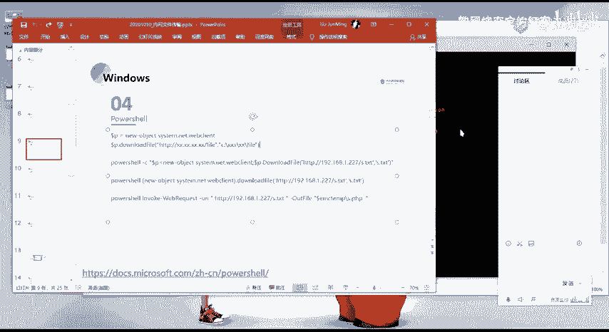

比如说我们通过呃CS对吧？我们通过CS的话，我们执行的通过power share去执行命令的话，我们执行之后的话，它立马会返回结果，对吧？那么我们执行之后的那一个环境的话。

它不是在同样的一个power share下面的。我们要去执行要去进行这样子的这种变量的一个操作的话，我们需要在同一个就是说哈希尔的这样子一个命令行下面的。因为我们这边负责这个变量的话。

它会在就是说在当前的这个抛 share share下面，它是能够去找到找得到的这找找得到这个变量的对吧？如果说在另外的我再另外去创一个抛 share的话，他是不知道这个。呃。

找不到这个变量所对应的这个值的对吧？所以的话我们。就是说在同一个框式下面的话，去执行多个命令的话，可能就是不会很方便。

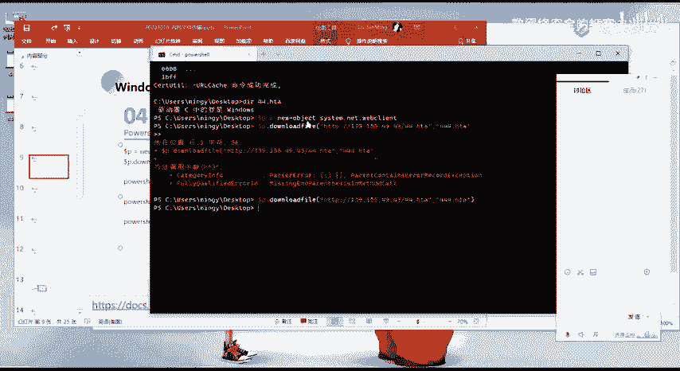

啊，所以的话我们可以通过这样子的一个方法来去进行一个，就是把它合并成依句抛选的一个语句来进行一个执行，来达到上面的这样子的一个目的。然后我们来看一下，就是说这边的这个语句，它的一个意思。这个语句。

它的一个主要的一个呃点的话就是这一个杠C的这个参数。

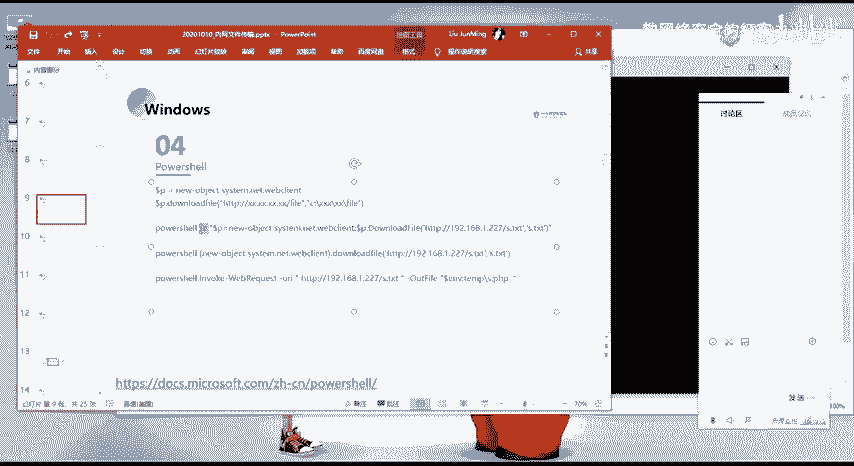

这个杠C的这个参数的话就是抛 share的一个。呃，比较常用的一个参数。我们可以通过抛削。干问号来查看，就是说part下面的话，我们可以接哪一些参数是吧？你看到在这边的话，它有这样子的一些参数。

然后的话呃我这边的话我不会一一的去讲，就是。

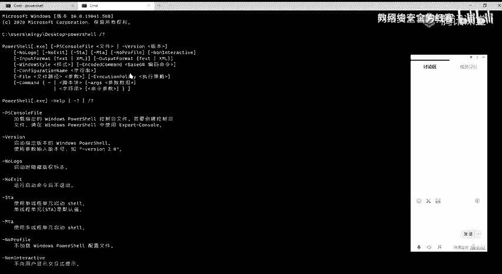

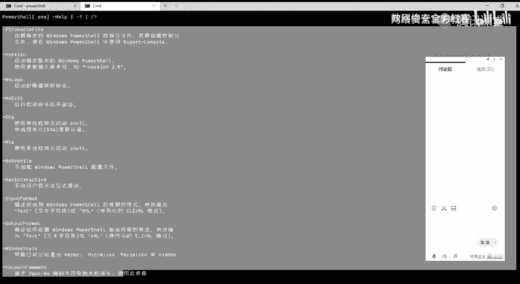

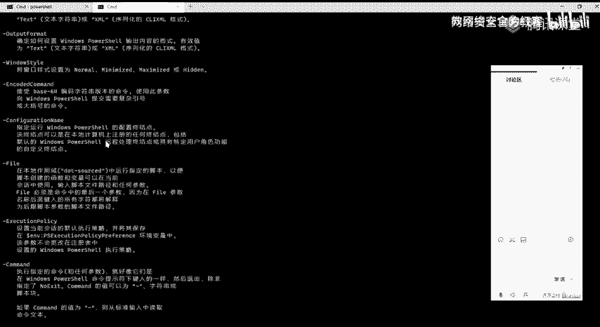

关于更多的这样子这些东西的话，他你自己去查看好吧，而且就是都是中文的对吧？有描有对每一个参数的一个描述，这个的话应该很容易理解的。然后在这的话我们。

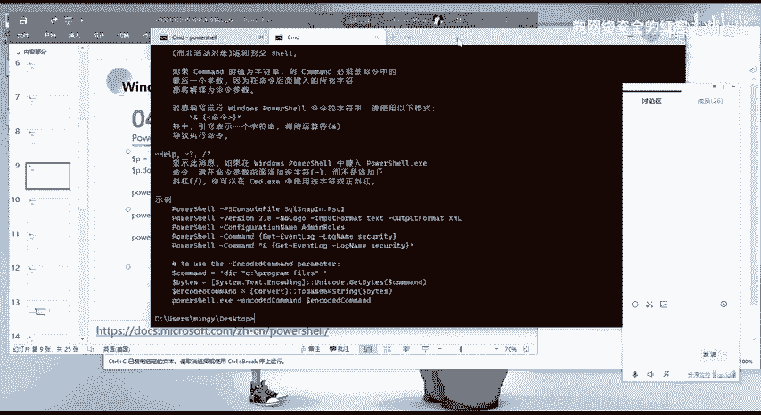

主要的话就是看这个杠C这边的这个杠C的这个参数的话，它其实是指定的，就是说是这个干com门的。

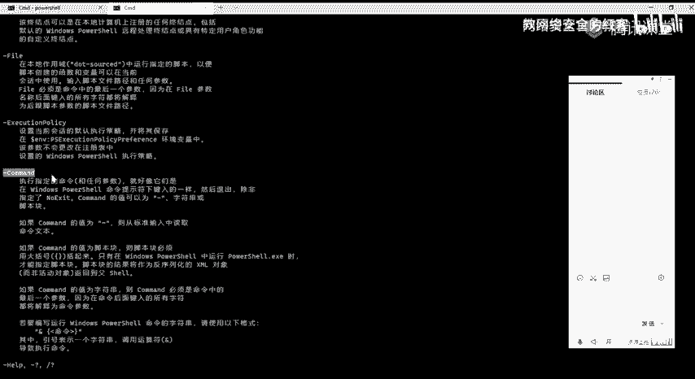

就是说我们可以通过杠C来去就是表示我们的一个参数的话就是这个com呃杠com。

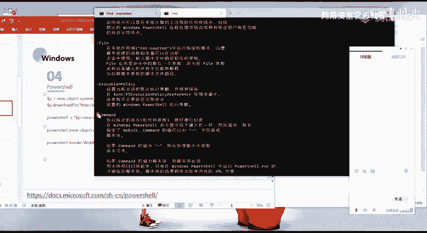

从它的一个字面意思的话，就是执行我们指定的一个命令嘛，对吧？com on的话就是命令的一个意思嘛。然后的话我们通过杠C参数，后面的话我们指定可以指定相应的一个命令以及参数来去进行一个执行。

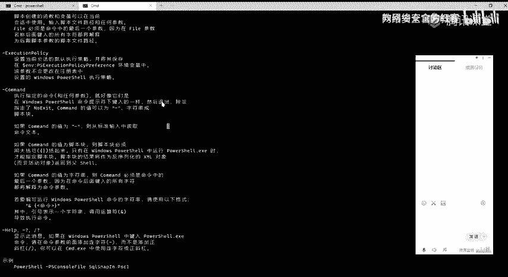

然后在这边的话，我们所要执行的话，其实就是这一个。就是这一部分。对吧这一部分的话其实就是我们这边上面的这一部分的一个内容。我们通只是通过分号做了一个分隔，对吧？然后的话把它放到了一行命令当中。

直接去进行一个执行。然后呃在这边的话，它所下载的一个呃文件的话是。这个当话关于下载这个文件的话，我们可以就是你自己想要去下载什么，你就更改成什么样子的一个文件，对吧？好呃。

下面第三个话就是呃使用po的另外的这样子的一个就是写法，就是它它的一个作用的话，它其实跟上面的两个的一个作用的话，它其实是一样的，只是呃它的一个写法以及表示的话，会稍微有一点区别，对吧？

就是大家在碰到比如说碰到别人去写的这样子的一个的一个脚本，对吧？它是通过呃这样子的一个形式去写的，你不要觉得奇怪，对吧？其实它的一个作用的话，它它的一个作用，其实跟上面这个这个都是一样的，对吧？

只是我们可以看一下，它的一个内容的话，其实就是通过new objectject来创建了这样子的一个对象，对吧？创建了这个donnet的一个对象。

然后的话调用了它的这样子的一个don notify的一个方法来去下载我们这边指定的一个资源，对吧？下载到本地的一个保存成一个S点t的一个文件，对吧？这个话应该。

这里的这一句话是能能够比上面就是能更加直观的去理解，对吧？而且其实这样子的一个写法的话，就是就更加就更加方便嘛。可以看到就是已经就比上面的话还要短，对吧？然后下面的话就是另外的一种方法。

我们上面的话是通过创建了这样子的一个呃ss donnet的一个web client的一个对象，对吧？然后的话通过调用这个对象的这个donorify的一个方法来进行一个文件的一个下载。

而且是抛弃下面的话有这样子的一个呃呃方法，或者说。呃，函数。的方法吧。就是这个invoer杠web request。这个然后呃这一个invo web request的话，它的一个作用。

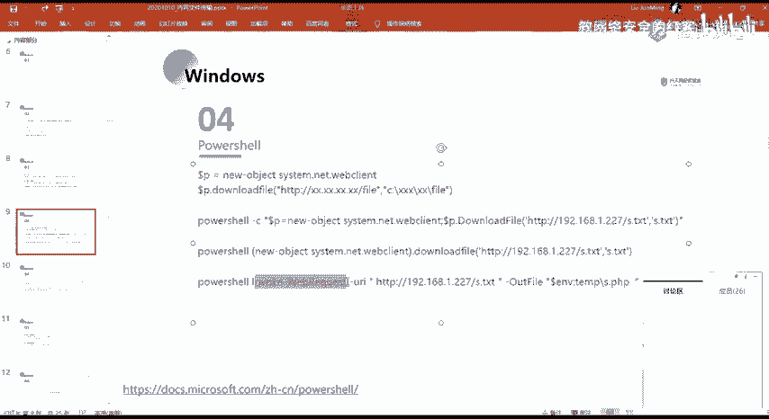

我们可以通过就是说。

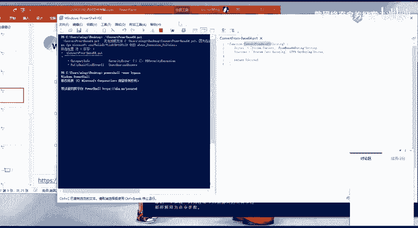

我们首先的话进入到抛 share当中，然后的话我们。因外。大家现在他不知道他什么意思，对吧？那么我们怎么去知道，就是说比如说你看到别人写了这样子的一个语句，对吧？

你想要知道他使用的这里的这个呃方法它是什么意思，是吧？那么我们可以通过在p当中输入一个ha，然的话接我们这边的一个啊inmo back request的这个方法。来去查看。

就是说这个方法它的一个详细的一个呃详细的一个使用。然后可以看到在这边它的一个语法的话就是invoke web request，然后的话加这样子的一个干URI的这样子的一个参数，对吧？

然后后面的话接我们的一个URI，也就是我们的一个呃资源的一个地址。然后的话后面接我们的一个common，这边的一个 common的话，其实就是我们要存储。就是说把我们这边的这样子的一个啊文件。

把它输出到哪里，就。

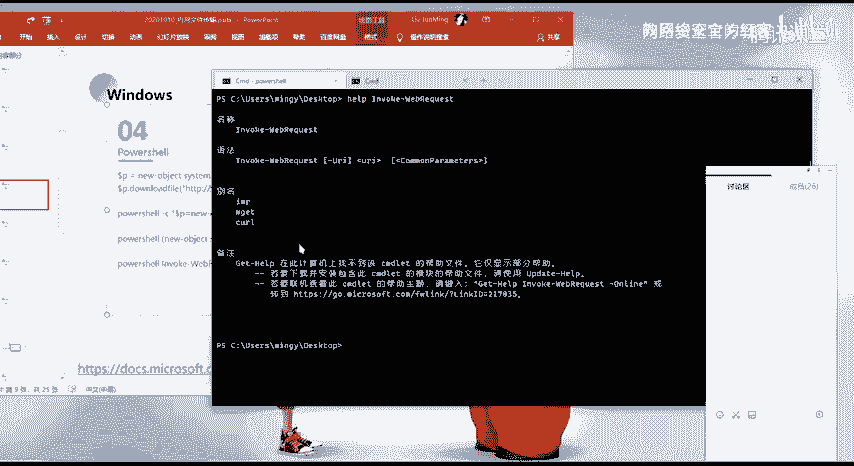

具体的话我们看一下这这样子的一个例子。就在这边的话，我们呃使用的是这个刚out out fire的这样子的一个参数。这样子的一个参数，然后的话把我们前面所请求到的这一个资源。

然后把它保存到我们本地的这样子的一个路径下面，对吧？然后我们可以看一下它的一个效果。

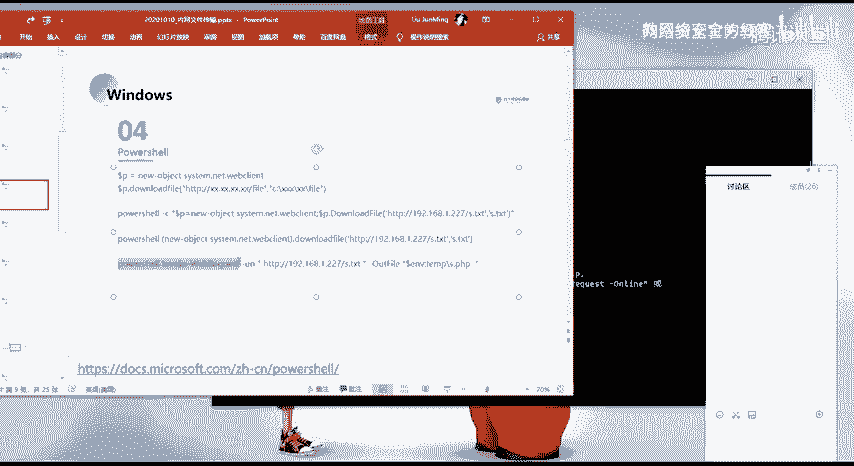

我这边的话同样的以就是下载那个44点HTA那个文件为例。

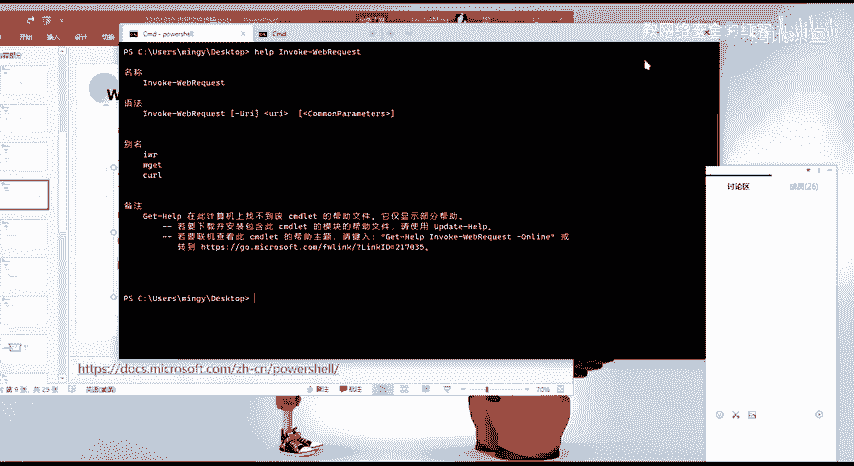

我这块直接粘贴。呃，还有的话在这边大家要注意啊，就是之前的话也有挺多同学就是问我，就是就是截图发我这样子的一个问题啊，就是为什么会报错？就是其实大家你去认真的去看我的一个命令的话，对吧？你会发现就是说。

我就是这种抛的一个面的话，都会加这样子那个power share，对吧？

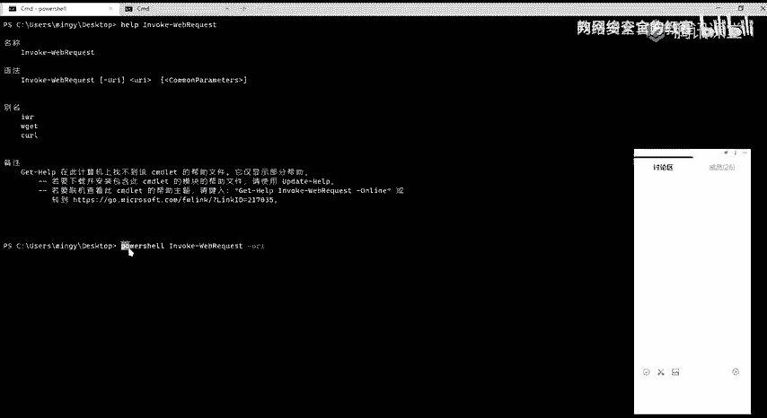

就前面有这样子的一个抛。就说加这个抛 share的话，其实我们这边的一个执行的话，就我们得到的这样子的一个sha。我们原本得到的一个sure。相比如说1个CMD。

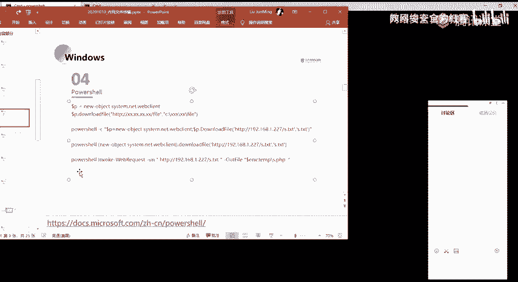

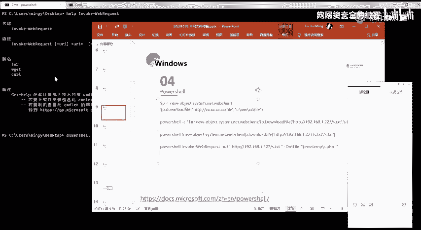

好吧，像比如说我们在windows系统上面，我们得到了一个 share，其实是一个在CMD的这样子的一个环境下面，对吧？我们反弹的一个 share。

那么我们要在CMD环境下面去调用这个p share的话，调用p share来去执行相应的一个命令的话，那么我们需要去加这样子的一个p来去就是说告诉CMD。

我们要去使用这个p share来去执行后面的这样子的一些命令，对吧？但是的话如果你已经进入了p share，那么你加这个p share。

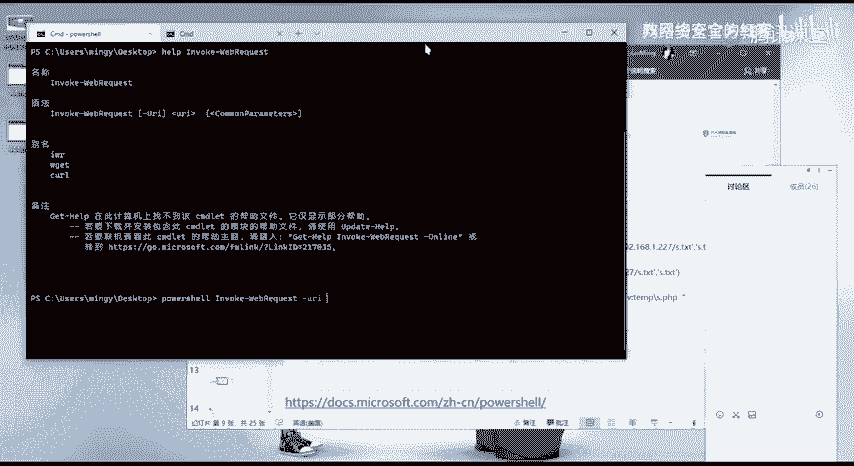

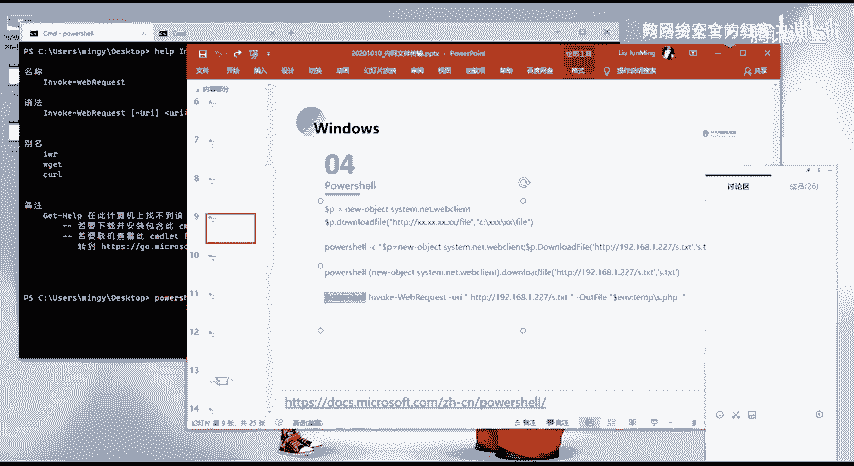

它就是一就是重复的对吧？然后的话你在抛线下面，你去使用这个抛线来去进行一个面那一个加载的话，它会有一个它会报错的。所以的话我们一般的话就是你在CMD当中去进行一个这样子的一个执行。Yeah。

当然的话如果说你比如说呃像MF当中的话，像MSF当中的话，就是说你可以去反弹反弹回一个t share的一个需要的。就是说呃一般的话我们就是指定的一个配漏的对吧？指定的一个配漏的，就是反弹的一个需要的话。

它是一个像比如说mat的，还有的话就是像那个需的对吧？这样子的一个穴。还有其实我们如果说windows系统下面的话，我们其实也可以返返回一个power share的一个系。

就是说我们反弹的一个 share的话，就是直接是在power share的一个环境下面的。然后的话我们可以在这一个 share下面去执行power share的一个脚本以及命令。这个话大家可能。呃。

没有去注意啊，就是你可以去查看那个呃配load的，就是windows下面的payload的话，是有po share的这样子的一个payload的。以及他的所对应的一个呃模块。好，然后在这边的话。

我们使用这一个invo web request，然后的话干UI指定我们要去下载的一个资源。

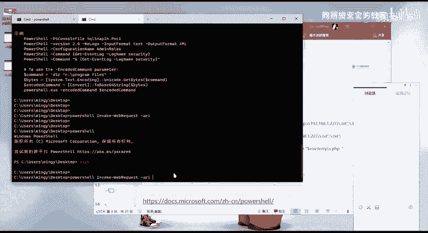

否则的话同样的以这一个为艺。

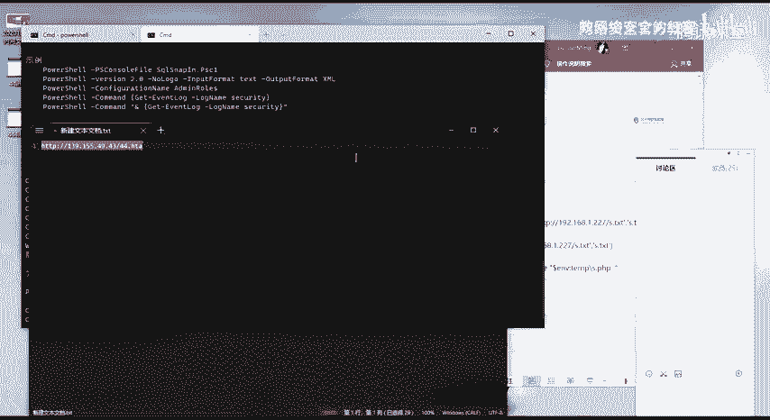

然后的话下载到我们指定的一个目录下面。

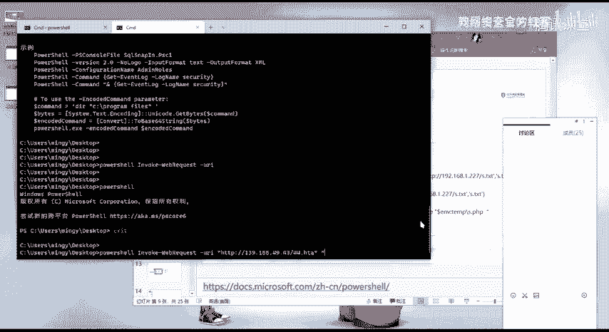

呃，在这边的话。我们看一下这边，我这边的话是写的是多了烟V，然后的话tamp，然后的话后面的话接我们的一个保存的一个文件，对吧？然后其实在这边的这一个多人EV的话。

它其实就是说在power share当中话，它表示的一个意思其实就是我们的一个我们前面所讲到的那个system root。

就是在CM机下面，对吧？我们可以通过apple。呃，百分号百分号啊。这是很一样。来输出就是说你当前系统下面的一个就是系统的一个安装目录，对吧？就是这个Cwin。然后到power share当中的话。

我们可以通过这个多了NV来表示就是说。我们当前的一个系统所安装的一个目录，其实就是这个C的是吗？就一般的默认的话，它都是在这样子的一个C盘目录下面，对吧？

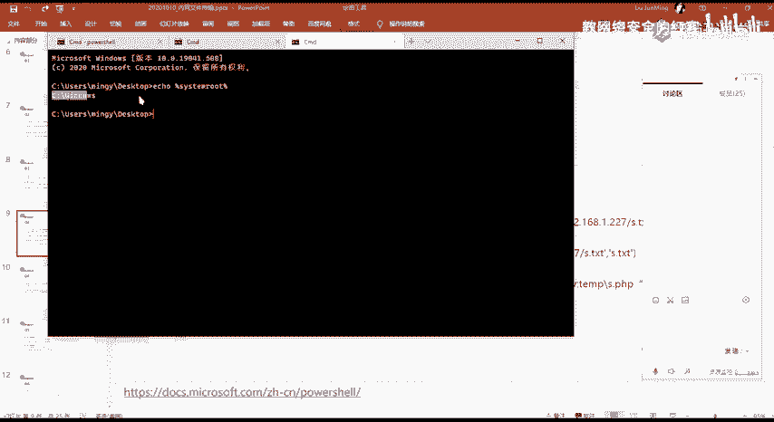

然后其实在这边的话，它就是在C盘的一个windows下面的一个t目录下面，就是保存到了这个目录下面去。

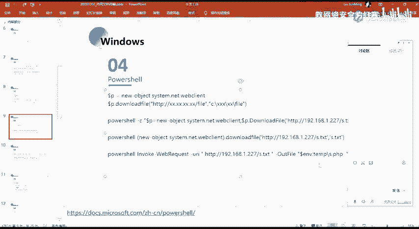

然后其实我们也可以就是自己去指定，比如说。我这边的话就保存到D盘的一个。呃，D盘目录下面，然后的话呃444。H。是。多少时间。可以吗？

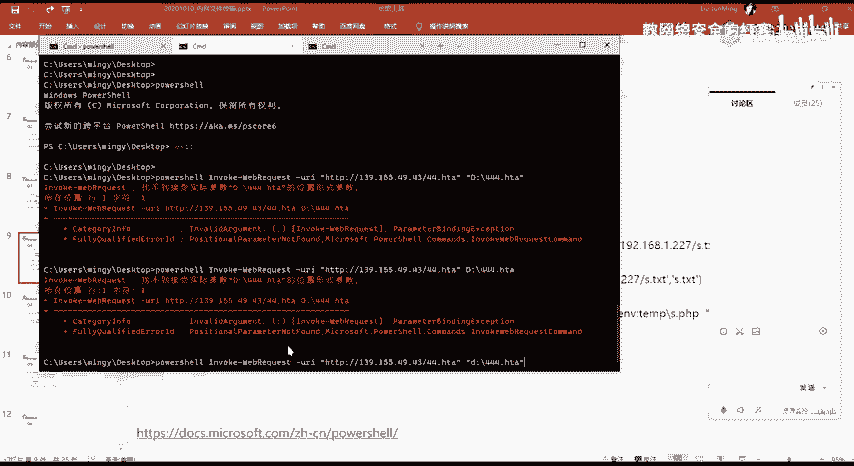

好。哎，不能吗？

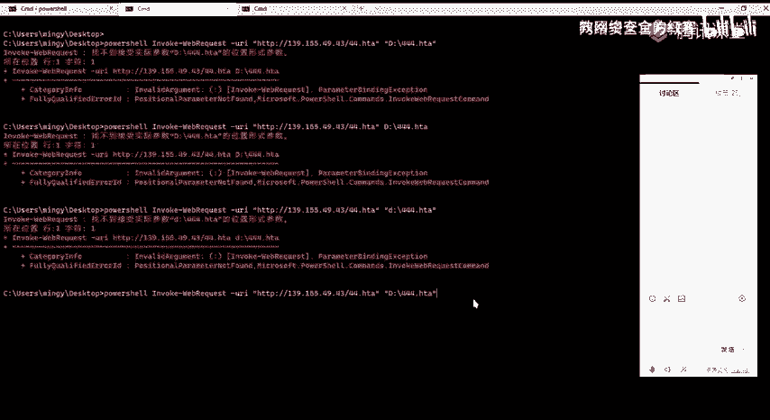

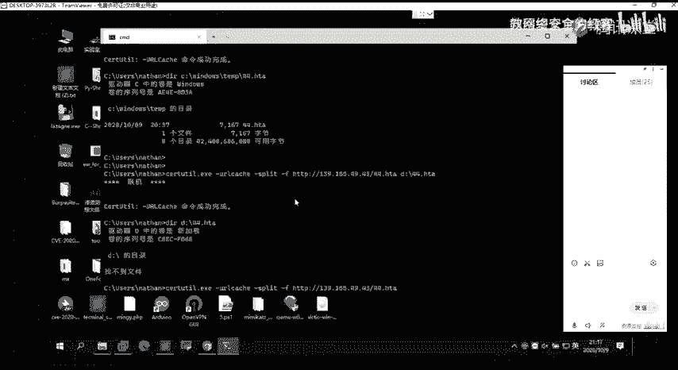

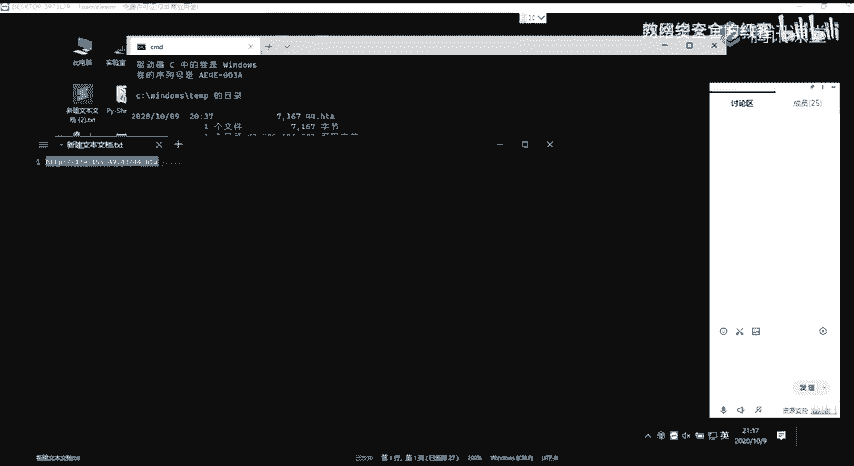

你。好哦。这边少了一个参数，我忘了，就是干out fire。需要加这样子一个参数，然后的话再去指定我要去保存的这样子的一个路径，对吧？我说怎么一直报错。少了这样子的一个刚刚次fi的一个参数。

就是指定我们保存的一个路径。然后在这块我们再去这一个目录下面。就是D盘下面我们可以查看是否有这样子的一个文件。事实。对吧可以看到。呃，我们这边的一个面话已经成功的执行，就下载了这样子的一个4试点。

HTA的一个文件对吧？

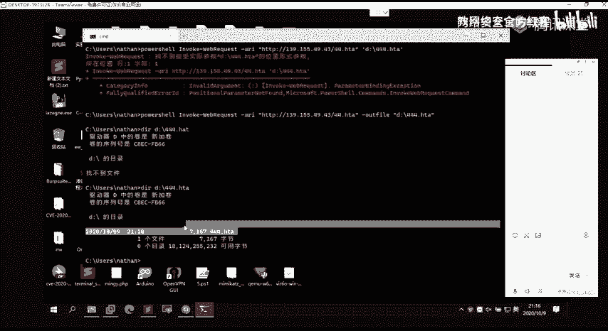

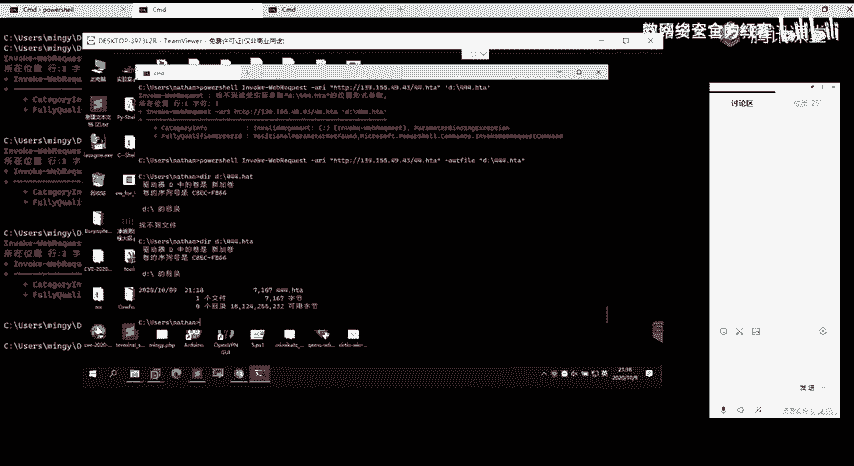

嗯。啊，呃，其实我们也可以通过这样子的一个方法，就是加这个多了EV。

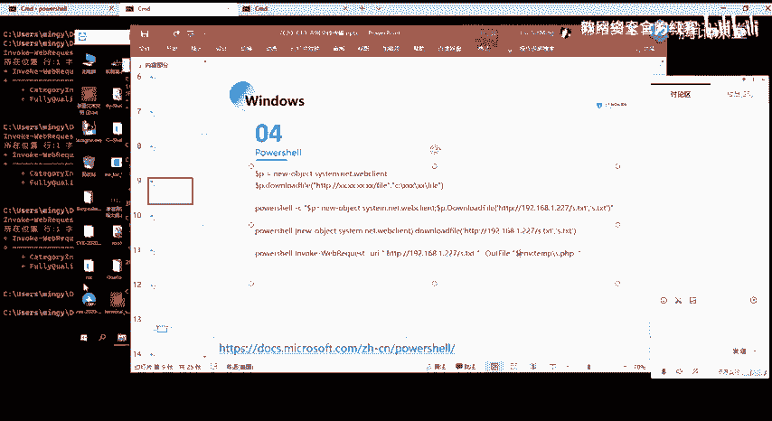

就是保存到我们的一个windows下面的一个。呃。看款目录下面。然后的话我们DII市场下面的一个windows。对吧可以看到已经就是存在了这样子的一个文件，对吧？

就是我们刚刚通过这样子的一个命令下载的这样子的1个HT的一个木马文件。

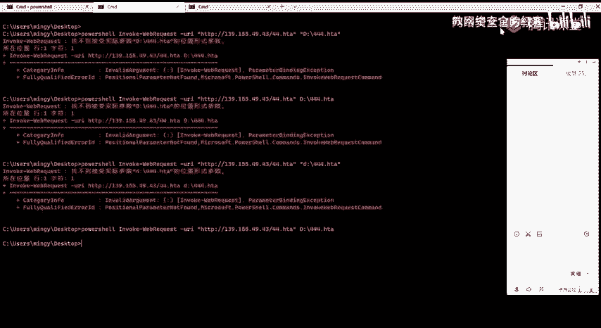

啊呃，以上的话就是po share的一个使用po share的一个方法来去进行一个文件的一个下载以及木马的一个下载。其实我们这边的一个文件的一个下载的话，大家可以就是灵活的就灵活。

不要说局限于就只是一个文件，对吧？就比如说你需要某一个工具，对吧？或者说你你可以去下载任何就是说这种文件的一个形式。你想要去把这个文件下载到啊我们的一个目标机器上面去，对吧？

我们可以使用这样子的一个方法。然，呃还有的话在这边要提一下，就是这个invo web request。

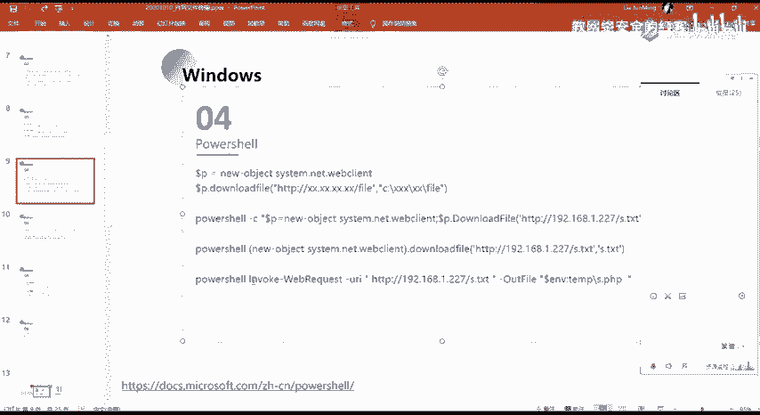

就其实我们刚刚的话在这边我们通过help查看它的一个呃使用方法的时候，在这边有一个别名，对吧？就是IWR，还有we gett CL。这这三个的话其实都是这一个的一个别名。就别名是什么意思呢？

就是说我们可以使用这样子的一个方法来去调用它。

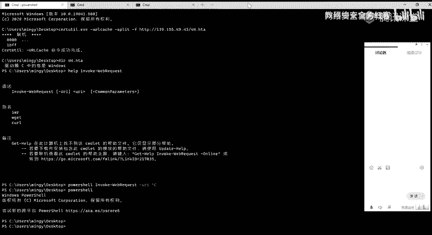

对，其实使就是使用这个就等价于就是使用的这一个。那么我们可以通过这样子的一个方法。

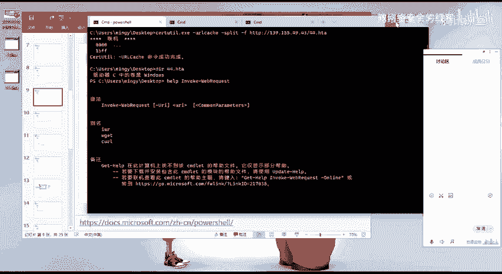

就是。对。说啊呃他打你。然后的话你UI。酒店我们这边。Yeah。Yeah。然后我们执行对吧？然后可以看到在这个D盘的一个录像。我们可以。找到这样子的一个刚刚下载的这个H贴的一个文件，对吧？

就使用的是这个IWR。然后的话其实我们也可以通过使用we guess。就parture加we gett，就像we get还有CCRL这种的话，是在linux下面的话，一个命令命令嘛，对吧？

其实我们等会也会讲。然后在这边的话，它是作为就是在window下面这一个invo web request的一个别名。就其实如果你不记住记不住这这么长一串的话。

你可以记就是weget还有CL或者说IW啊这样子的一个呃。这样子的一个方式。可以看一下446。

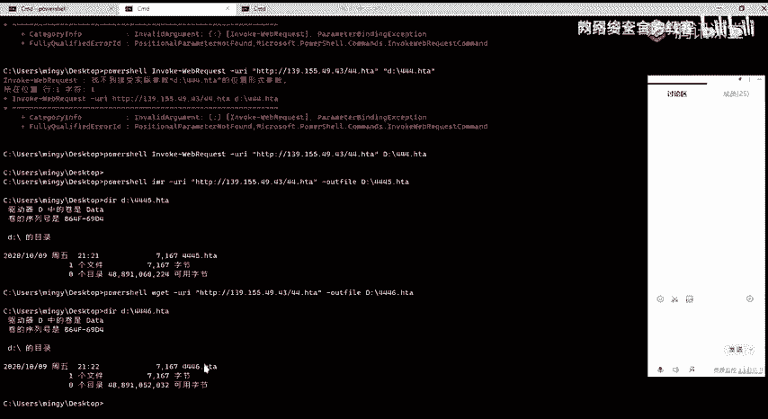

都是可以的CL也是可以的，我这边的话就不演示了。好呃，下面的话就是一个就是实际的一个例子。就是说通过po share来去加载我们远程的这样子的一个po share的一个脚本来访他 share。

其实这里的话呃，其实我们后面在讲马 share的时候也会讲，也为讲这个就是利用po share的一个方法来去加载我们的一个po share脚本来访他 share。

以及来去执行相应的就是说呃来去加载使用po share脚本所写的一些工具。像比如说minicast，minicast的话，也同样的有po share的一个加载的一个脚本，对吧？呃。

其实前面我们已经有讲了。然后在这边的话，我们以这样子的一个实际的一个例子就是。来，就是给大家演示一下，我这边呢通过MSFV norm来去生成的这样子的一个就是哈希尔的一个脚本。这个脚本的话。

它是一个反拉希尔的一个脚本。然后的话我。把这个脚本的话就是。我是在。

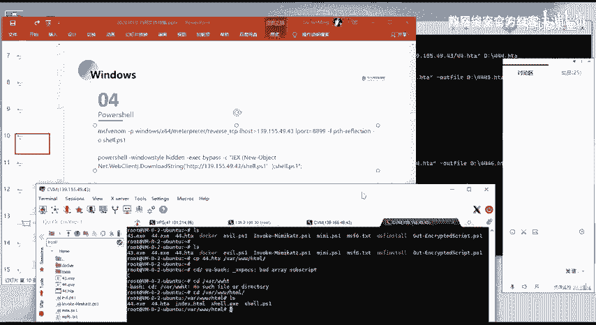

这个机器上面。啥玩意？是。这个的话是我已经提前生成了，有这样子的个需要点PS。PSE的这样子一个抛弃的一个脚本啊吧？然后的话呃，首先的话我先。

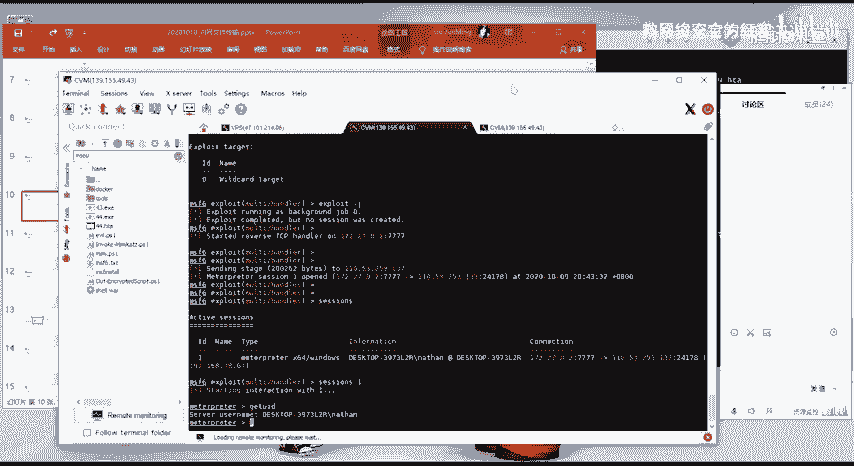

在MSF这边做一个。就是今天我们等会儿我们在这边执行这一个。

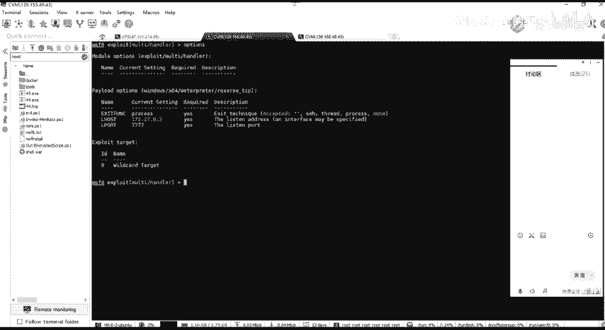

通过抛 share的一个方法去执行的话，他就会去加载我们这边访他 share的一个脚本然的话反他到我们这边那个MSF。所以呢在这边的话我先。

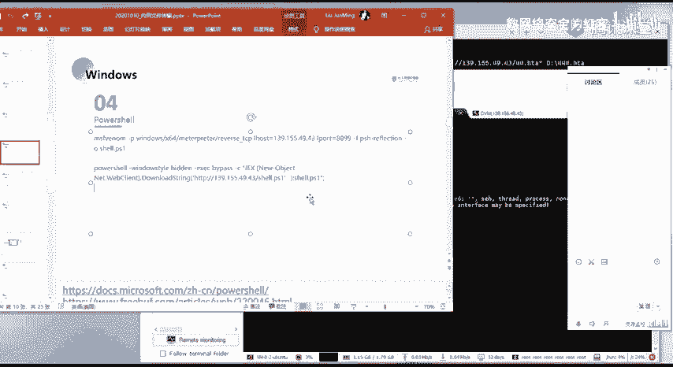

今天。建立一个今天器。呃，这边的一个端口的话是8888899。

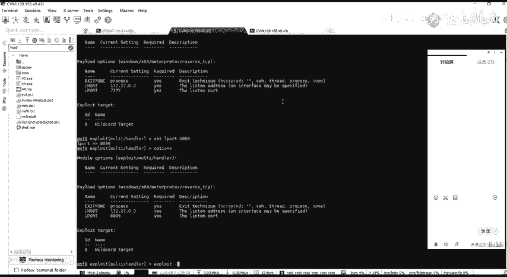

没错。

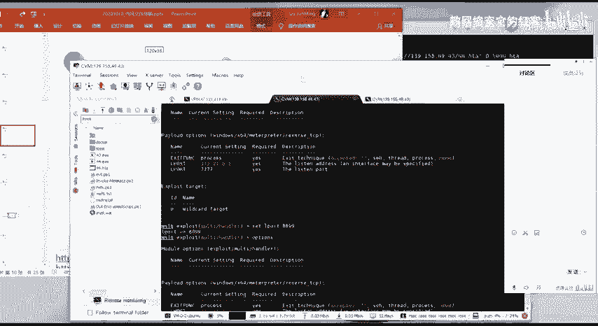

不错。

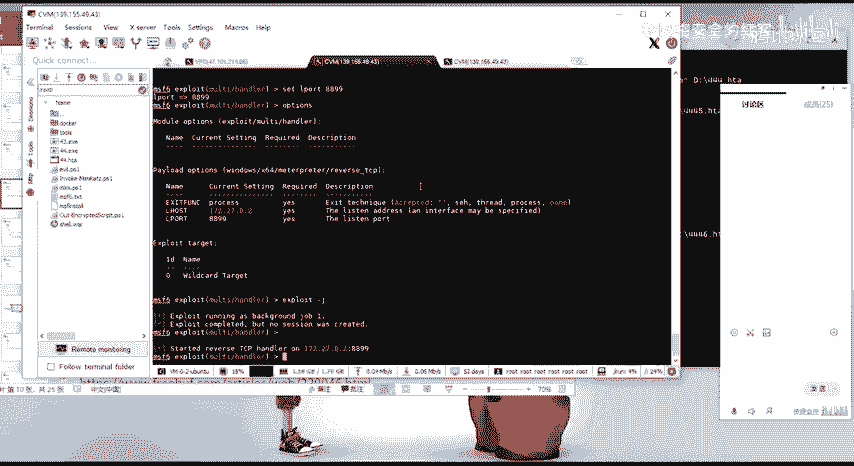

啊，已经静力了这个样子这样子的一个今听器。然后的话我们通过这样子的一个花絮的一个脚本。

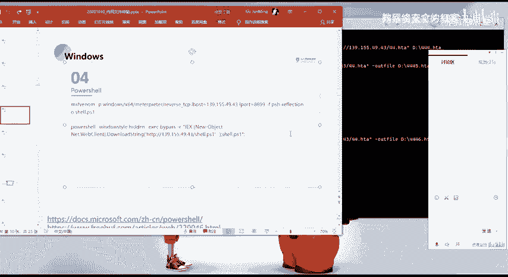

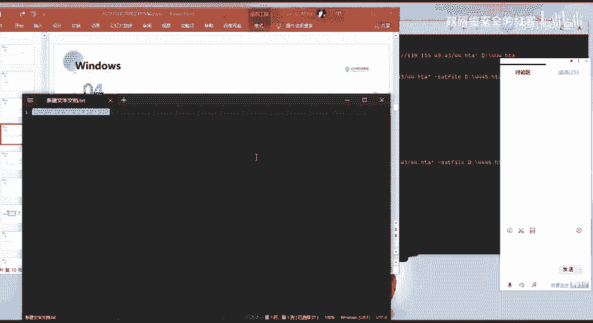

来去加载我们远程的在这个呃EPS上面的这个po share的一个长 share的一个脚本。然后大家在复制的时候就是复制我PPT的时候，一定要注意，就是一定要注意。

就是你我建议大家就先在自己的这样子的一个编辑器当中，对吧？你粘贴过来，因为你在编辑器当中的话，其实你就能够比较明显的去查看就是这一些标点符号。

其实主要的话就是标点符号就括号等等这种一定要使用英文的一个形式，你使用中文的话，就会报错，对吧？就其实很多时候很多时候的这种命令的一个执行的一个报错，其实就是大家呃。不够细心。

就是你去细心的去检查你的这样子的一些命令的话，你会发现其实。

就是这种高酬的话，其实很很很简单，对吧？然后我这边的话在嗯。

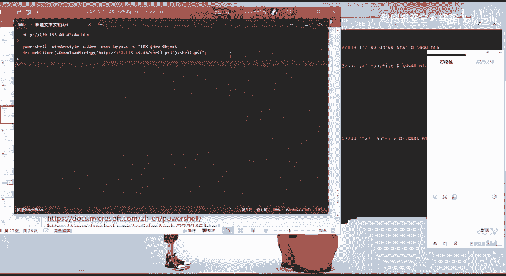

这一个机器上面吧。执行我的这样的一个抛弃的一个脚板。

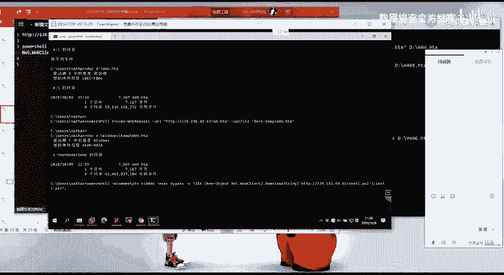

然后我在这边执行之后的话，可以看到在这里的话已经反弹回来一个去。

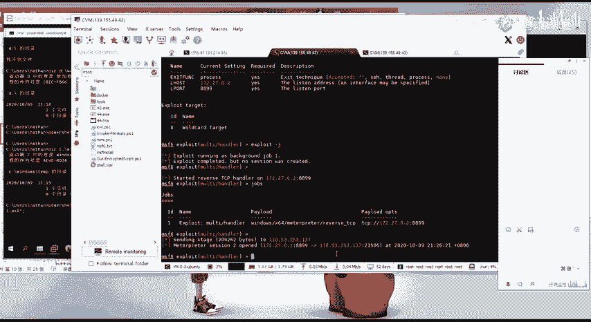

对吧反他的一个需要的话，就是我这边所执行的。然后呃在这边它没断掉的话，是因为。我打开一个摄像机吧。因为呃这边的话是一个就是。这个。windows timingmina。

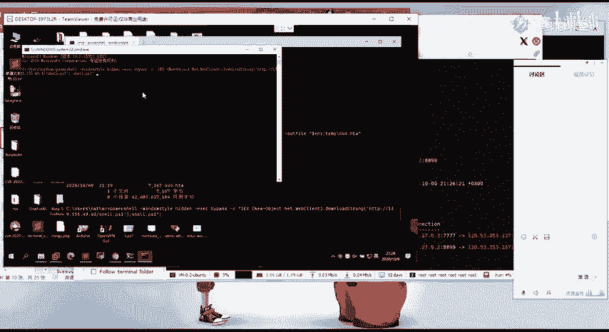

稍微。稍微有点不一样。

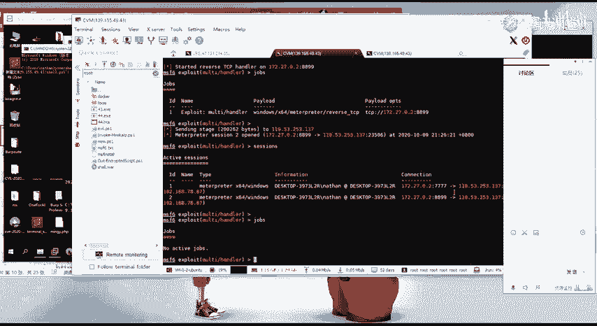

我这个话我再弹一个回来。时间执行。嗯。可以看到我在这边执行之后的话，它会就是刚刚所进入的那个CMD的那个CMD的一个窗口，它自动的关闭了。对吧？然后的话反他会的一个。返回返回了一个筛选3，对吧？是吧。

然后其实在这边的话，我们再回过头来去查看一下，就为什么它能够去达到这样子的一个效果。

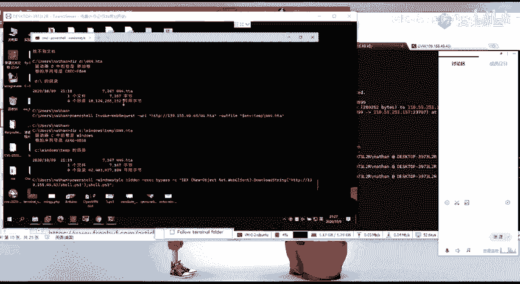

就其实主要的话就是我们刚刚。

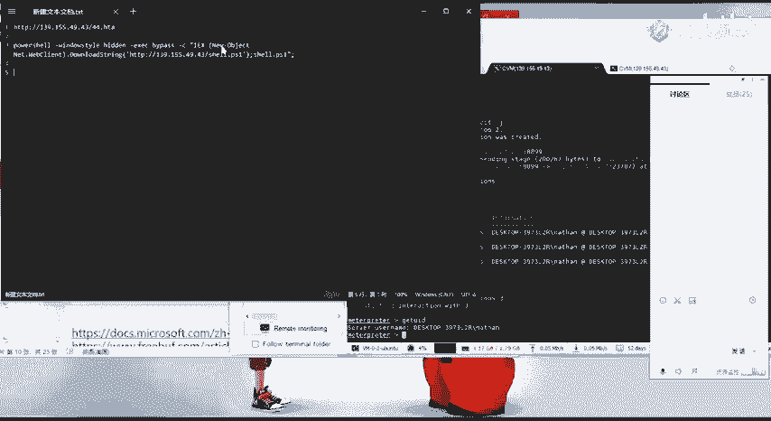

我们这边的这样子的一个参数啊，就这个干windows style our hide。

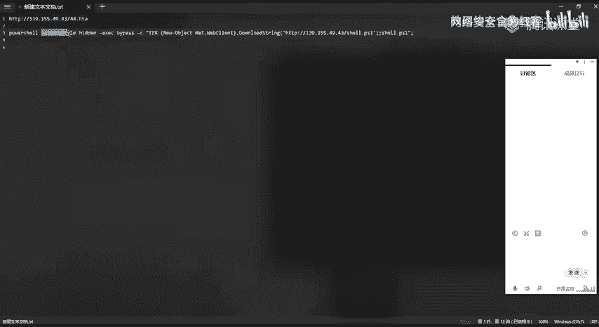

哦，我们刚刚的一个效果效果的话，就是我执行这个p的一个脚本。我在这个CMD窗口下面执行之后的话，它的一个窗口立马就关闭了，对吧？然后他的一个呃达到这个效果的一个参数啊。

其实就是这个这个这个参数它的一个意思的话就是呃，我们这边执行执行之后的话，他会去把我们的这个窗口给关闭的。

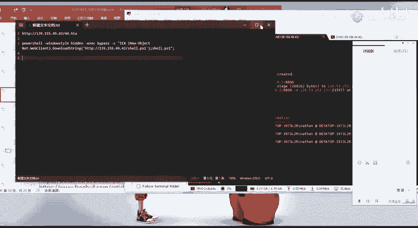

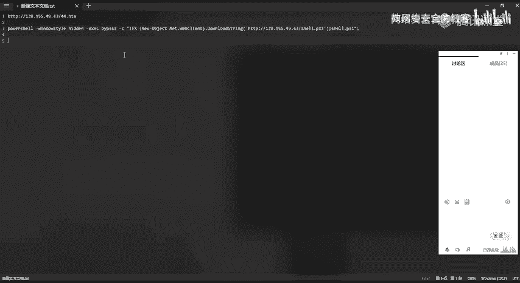

然后这个的话在这边的话。关于这个参数，他还有呃。

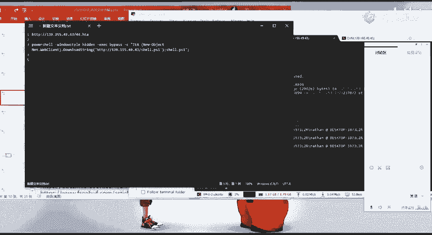

他还有其他的几种表示。我们可以在抛 share当中。就是这一个干windows style。他这个参数它的一个意思的话就是将我们的一个窗口样式设置为就是nm的话就是正常。

就是正常的话就是我们就是这样子的一个窗口，对吧？然后minmin的话就是min的话就是缩小嘛，对吧？就是最小化。max maxax的话就是最大化嘛，had的话就是隐藏。

也就是说把我把我们这边的一个这个窗口执行的这个窗口给隐藏掉。然后我们这边所使用到的话，其实就是这一个。

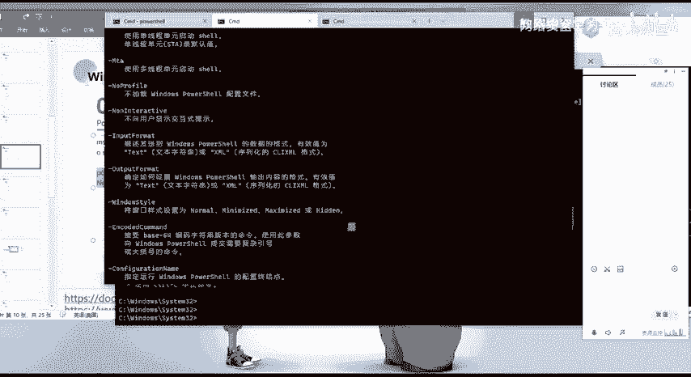

然后其实在这边的话。嗯。其实在这边的话不需要去写这么长啊，就是在抛下当中的话，我们可以就是通常的话，你看那些脚本的话，通常他都他们都是这样子写，就是干W加hder。就不需要写后面的这一个这么长一串。

我们直接通过杠W，然后的话h等来去进行一个指令就可以了。以及呃这边的杠EXEC bypas的话，就是呃指令我们执行的一个策略。呃，这个执行策略的话，前面有讲吗？应该我记得是有讲吧。呃。我前面有讲吗。

就是有讲的，我有点忘了呀。前面在讲话絮的时候有讲这个嘛，就是执行策略就。知道的说一下。就大家知道这一个嘛？怎么没？呃，大家还在吗？在的扣个一。不知道。有知道的扣个一。我前面没讲吗？

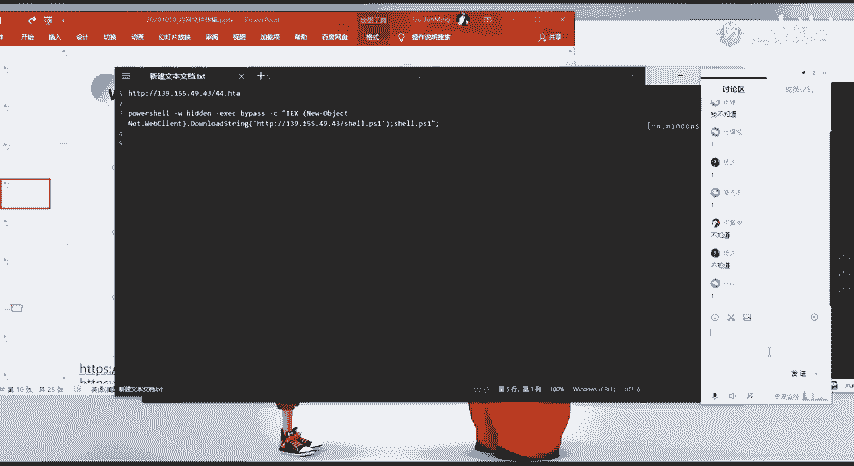

呃，好吧，那那我在这我这边的话再讲一下吧，就在这边的话，杠杠EXEC by pass就是指定我们的一个执行策略。

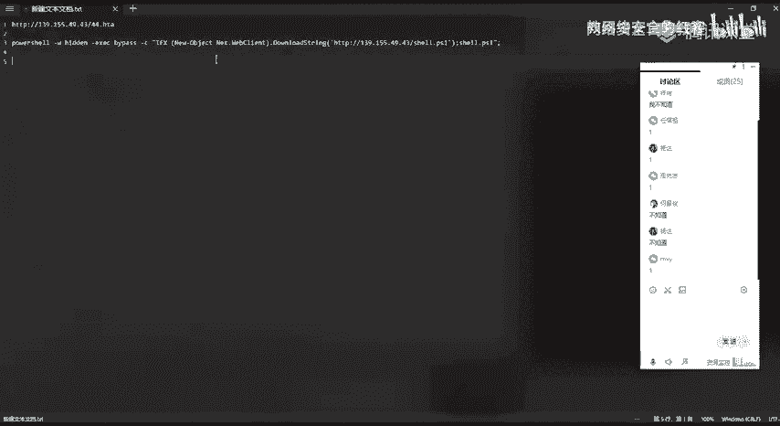

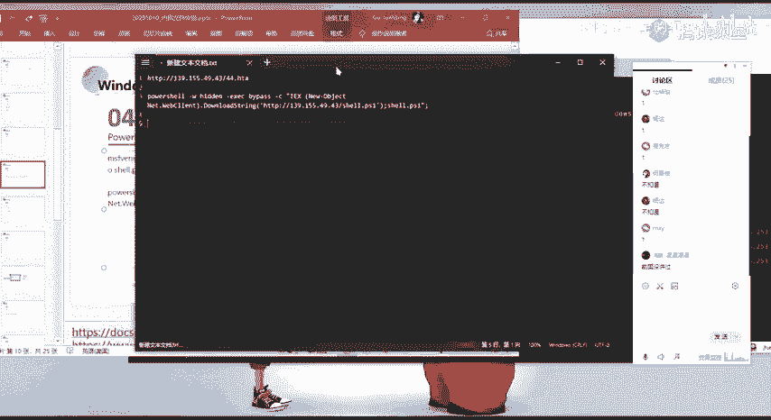

啊后其实我刚刚在这里的话，其实也有做这样子的一个操作，对吧？呃。干嘛呢？这。Yeah。嗯。

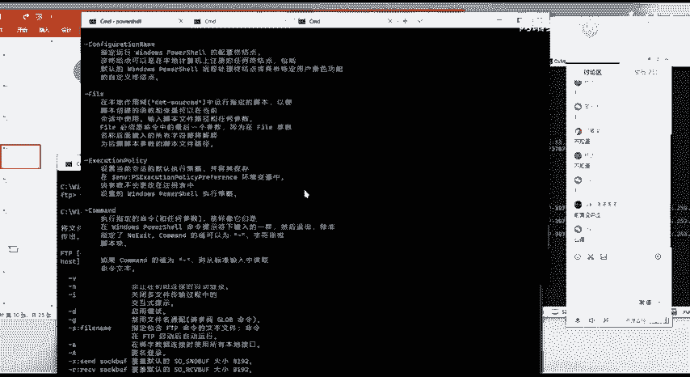

又不来拿。啊，这里。我在这边的话其实也有去执行这样子的一个操作，对吧？然后在这边的话，我们可以看一下，就我这边去进行一个加载，我这边所写的这个po的一个脚本，对吧？然后在这边去进行一个加载的时候的话。

它有这样子的一个报错，他说无法去加载这样子的一个文件。因为在此系统上面禁止运行脚本。就什么意思呢？就是说windows系统下面的话，它就是有这样子的一个，就是在抛下面有这样子的一个执行策略。就默认的话。

它是禁止你去呃去加载这种其他的一个脚本的。

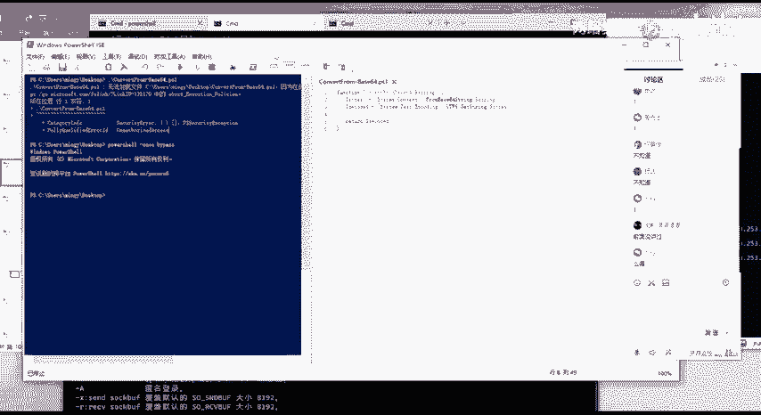

那么。我们在这边我们要去加载我们自己的这样子的一个。这种所写的一个脚本的话，我们就需要去更改我们的一个执行的一个策略。

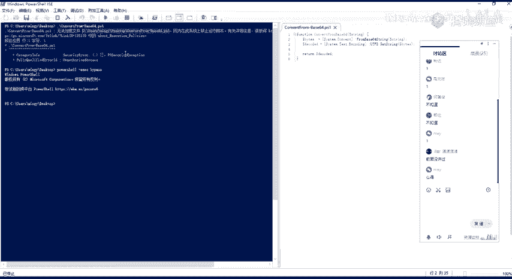

然后这一个执行策略的话。

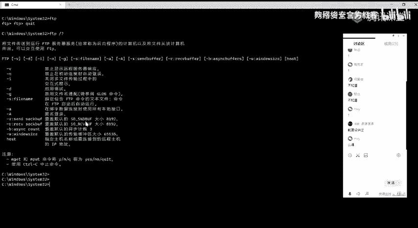

呃，我们可以在。

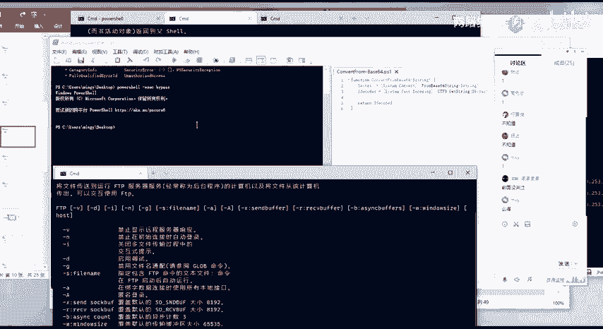

在。就是这个。SQ。呃，poliice这个的话就是设置单情绘划的一个默认的一个执行策略。然后呃。

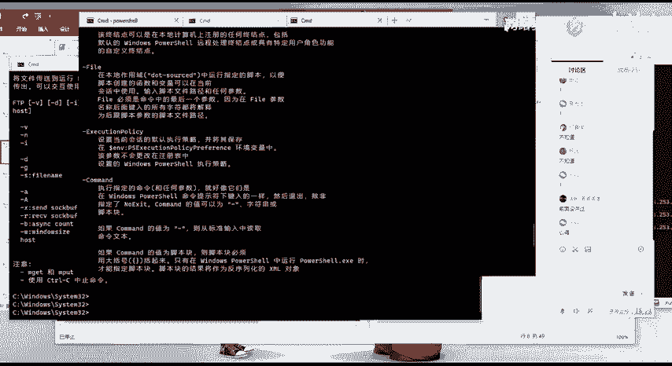

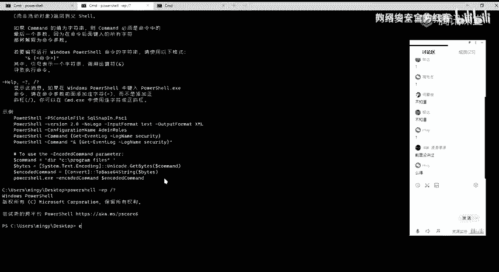

嗯。

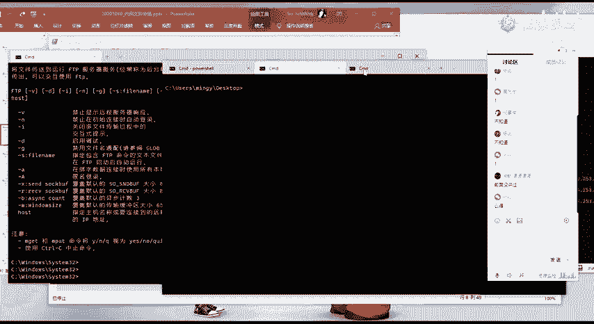

嗯。看一下啊，预习资料有没有。我忘记了那个就是查看执行策略的那个。min你。是错了。嗯。就是。这个在这边。

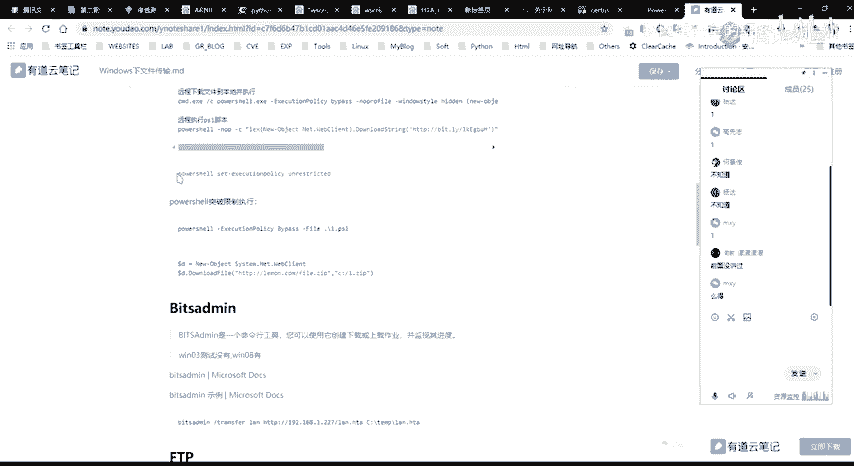

主要是查看那个车辆。

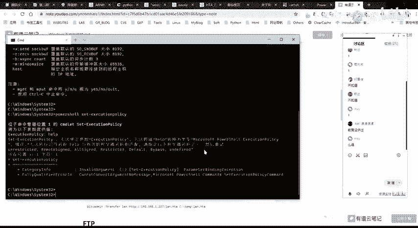

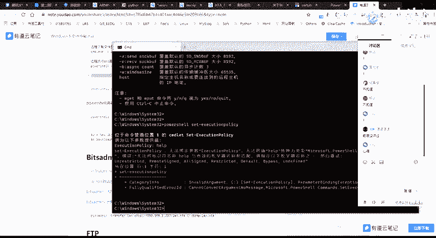

好，我百度一下吧。

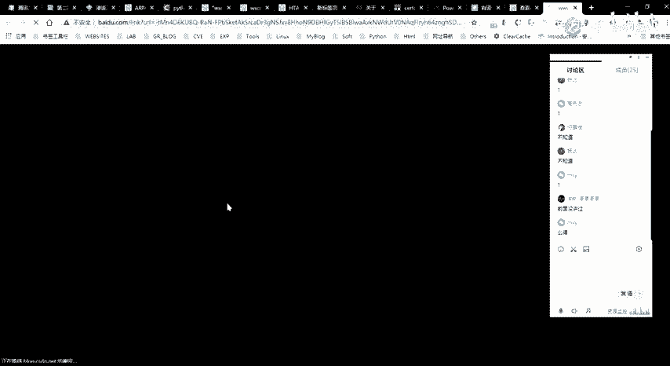

呃，直接啊这一个。

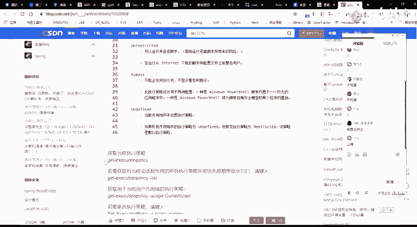

我们可以通过这样子一个命令来去获取到当前的这样子的一个执行策略，就是一个RE straight。

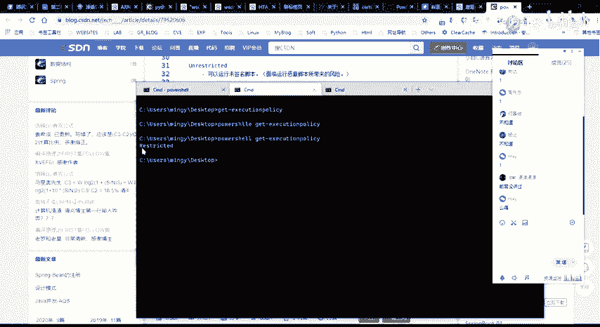

然后我们再结合这一篇文章，在这边的话，icestr的话，它是默认的一个策略，就是这个策略的话，它是允许单个命令执行，但不能去运行脚本。也就是说我们可以通过po share去执行命令。

但是我们无法去加载我们的一个p的一个脚本，它会阻止所有脚本的一个运行。然后还有其他的这种像on side的，就是可以运行脚本，就包括本地啊，还有远程的这样子的一些脚本，它都是可以去进行一个运行的。

然后remote sign的话，它是可以去运行，就是呃就是从远程的，就是从我们通过URL地址，从internet这上面去下载这种脚本，它可以去进行一个呃运行。但是的话在这边的话呃。在这边的话。

他是就是说需要去有相应的一个签名啊。其实实际的话就是说我们自己去写的这样子的一个脚本上是没有这种签名的，对吧？所以的话他是就不允许去进行一个远程的这样子的一个加载。但是他可以去加载我们本地的。

就我们本地所编写的这样子的一个脚本。然后还有就是呃bypass。对主要的话就是这个bypas，就我们经常使用的，就是不阻止任何执行项，也不会去显示警告，还有提示。

就我们可以通过指定我们执行策略为这个bypass来去绕过前面的这样子的一些策略。就是像比如说我们要去加载我们自己的一个远程的一个脚本，对吧？我们可以就指定这一个呃呃执行策略为bypa。

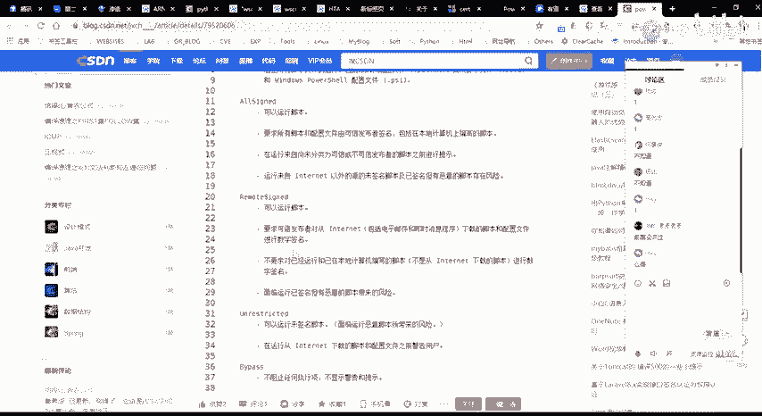

然后指店直金策略的话，我们。

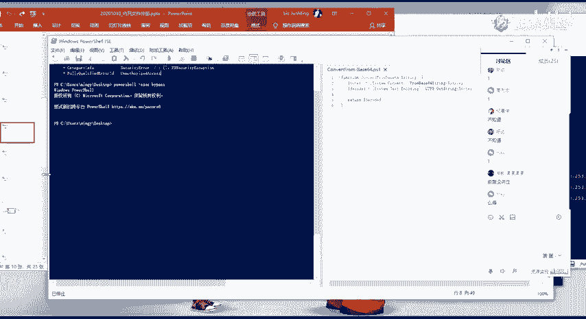

可以就是通过这样子的一个方式啊，就是杠EXEC。当然的话呃你你也会看到就有这样子的一个形示，就是杠EP。就其实就是其实就是。呃，执行策略的一个首字母的一个缩选嘛，就是excusion，然后ho对吧？

就是干EP来去指定这样子的一个执行策略。然后杠C的话就是指定我们后面要去执行的这样子一个脚本是吧？这边的执行的一个脚本的话，呃，其实跟前面的话是这一部分的话，跟前面都是一样的，对吧？主要的话就是这里。

呃，不一样啊。这这个的话，donload strike的话，这个的话前面有讲对吧？前面已经有讲过了。就是在讲那个就是信息收集的时候，用po去加载的时候，对吧？大家一定要注意的话。

就是这边的话是donload是 drive。然后前面我们这边的话是donload file。对吧它这两个的话它是不一样的。这边的话东or file的话。

它是就是下载就下载我们远程的一个文件到我们的一个本地，对吧？它是有文件，就是它是有文件的一个落地的。也就是说它是需要有这样子的两个参数，什么意思呢？就是说它是下需要需要去下载到本地嘛，对吧？

然后它这边的一个东or的是拽的话，它是直接把我们这边的一个脚本把它加载到内存当中。来去进行一个执行，就是说它是直接加载到内存当中，也就是没有这样子的一个文件就保存到本地的。啊。

然后主要的话就这个IEX这个IEX的话就是。就是呃这一个in workin work。A expression。就是把字符串当做命令来去进行一个执行。其实就是执行我们这边的一个命令。

就是执行我们这边通过加载的远程的，就把我们这边远程的这个p share的一个脚本，把它加载到内存当中之后的话，去进行一个执行。然后呃我们通常的话会使使所使用的话，就是书写的话就是这样子那个IEX。

然后的话其实就是在问题里面的话，大小写其实。呃，不是很敏感对吧？就我们也可以通过IEX就是小写的这样子一个形式，对吧？然后呃还有就是windows style。就通过这样子一个方法。

还有就是这种非交互啊，还有呃主最常用的话就是这个概念NOP。就是抛需要控制台不加载当前用户的一个配置文件。

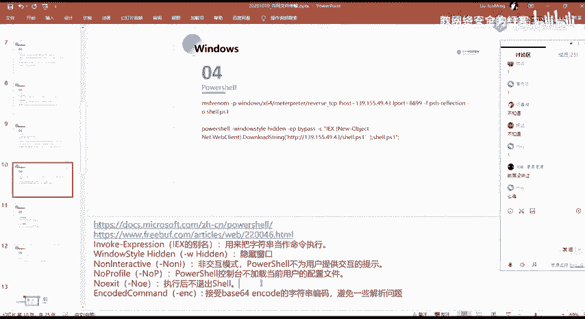

就哦其实我们前面的。比如说我这边的这个就用MSF生成的这样这样子一个抛脚本，对吧？在这边其实它的一个使用的话就是这样子对吧？就是杠NOP指定指定这个杠NOP这个参数。

然后杠W开的就是指定我们这边执行之后的话，这边的一个窗口它就关闭了。然后杠一的话，它其实是呃就是做一个编码。关于这里的话。同样的，我们。通过发现。来去查看一下。

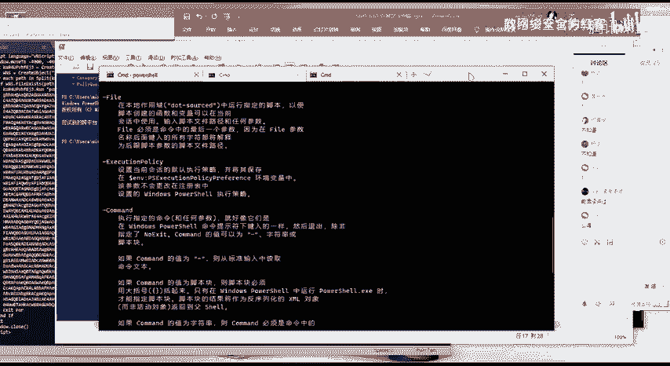

就这边的一个杠呃杠一的话，它其实是这个incor command。就是他是指定的，他其实是呃跟我们这边的这个参数，他其实是同理的。

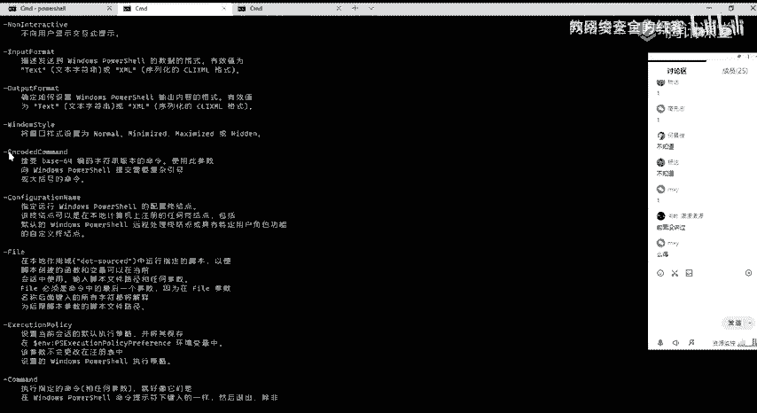

就是这里的这一个杠一。它的一个作用的话就是接收base64的一个编码的一个字符串。

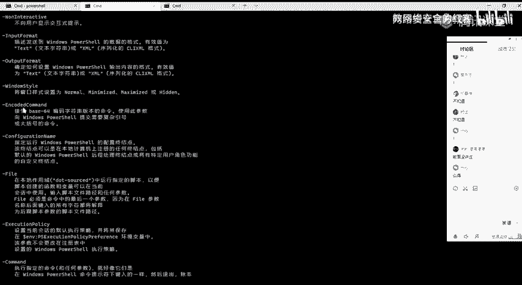

也就是说我们可以通过杠一参数后面指定我们贝64加密之后的一个字符串，它能够去对我们这边的一个贝64的一个字符串做一个解析。然后的话呃执行。这些的话都是呃我们常见的这样子的一些参数啊。

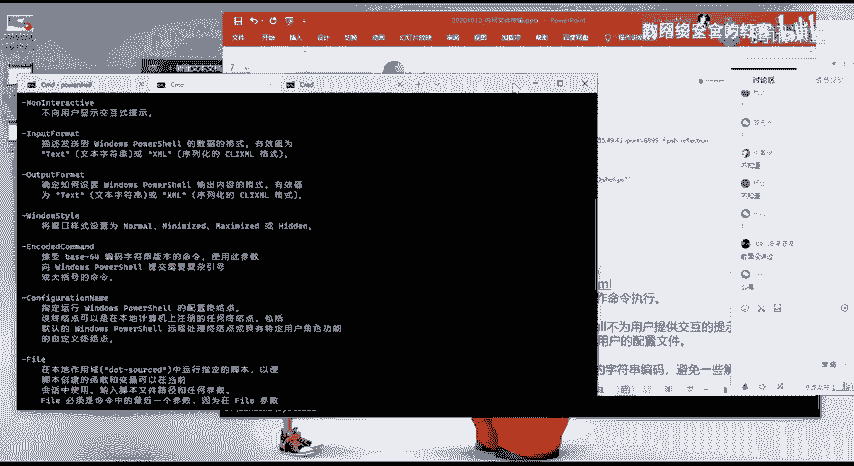

嗯。呃，关于抛蟹的这一部分的话，就呃这一些。好，大家能理解吗？就有没有什么问题？啊，其实这些的话我。其实这些的话，大家就是你去。呃，看别人写的这一些。

或者是说呃像这种MSFMSF它生成的这样子的一些脚本啊，这些配load的啊不这些木马对吧？你可以去就大概的去研究一下，对吧？你不要不要求你说你就是怎不要求你说你知道怎么去写，对吧？但是要求你去能够看懂。

对吧？你要能够看懂它的这个脚本它是干什么的，它有什么作用，对吧？嗯。不要请你说你要去写这些，因为这个的话你直接去直接就能够去生成嘛，对吧？就方便我们直接去使用。但是的话你要去理解他的一个意思啊。

不然的就不要说你就知道用你。就说有现成的这样子那个东西给你用，但是你不知道他的一个意思啊。开走。其实这一些的话呃，你去百度一下，就是像这样子的一些关键字啊，你都能够去大概的理解他的一个意思啊。嗯。

你同理的话part share尔的这样子的一些这样子的一些表示。就是我们其实通过就是这一些现成的一个脚本，对吧？它的一个写法我们也能够去学习到，对吧？呃，拿到这里。啊吧，通过他的这样子的一个写法。

我们也能够去学习到是吧。都是就是常用的是都是这样子去写的。呃。有疑问吗？没人回呀。都没人没人回我的提问。有有问题的扣一，没问题的扣2。或者说。或者呃就是自己客后。去做了才知道的，扣3。好。

我这一个选项一说。大多都是选这的啊。那行吧，那呃大家自己课后去再去做吧，好吧。

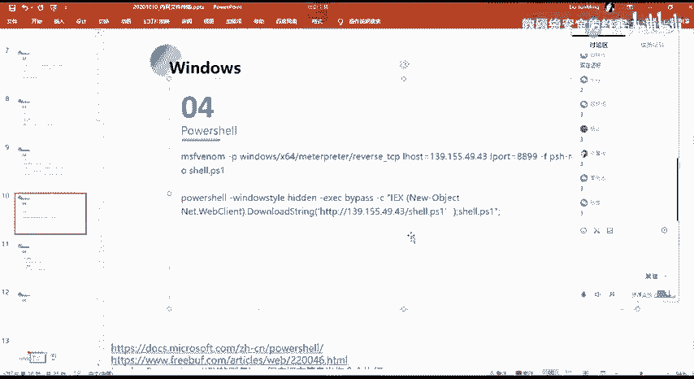