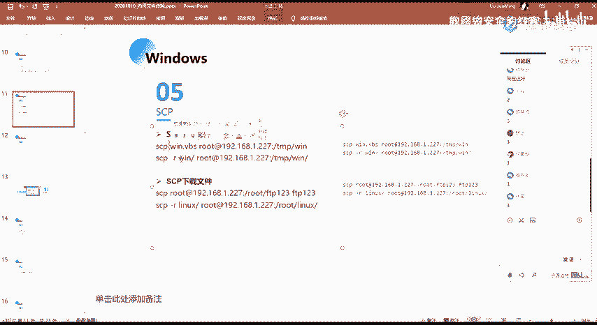
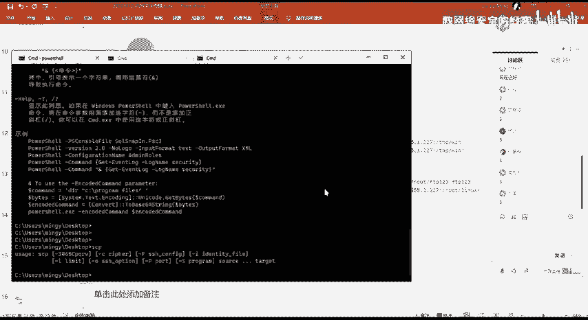
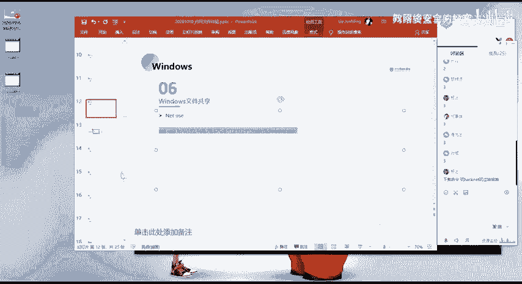
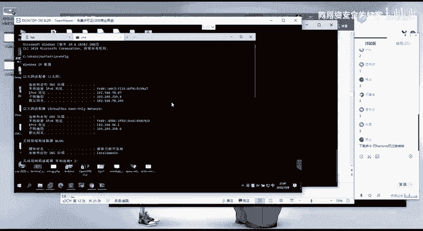
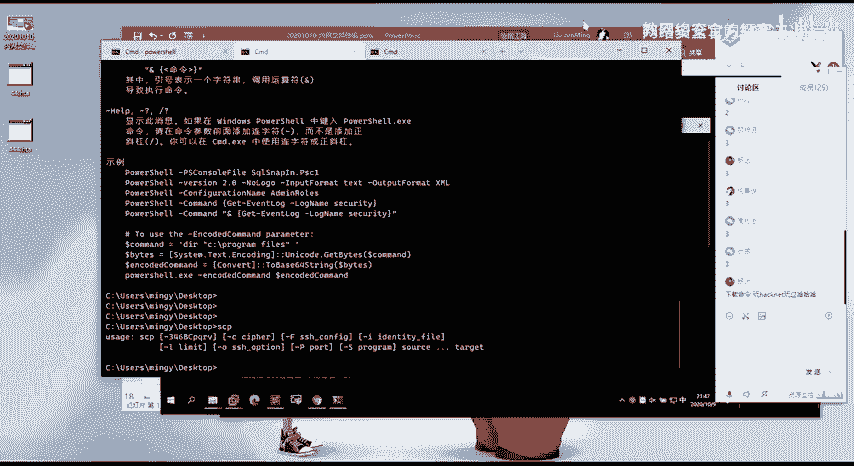
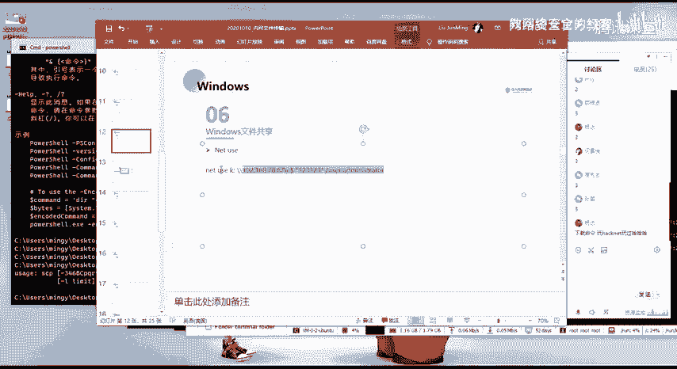
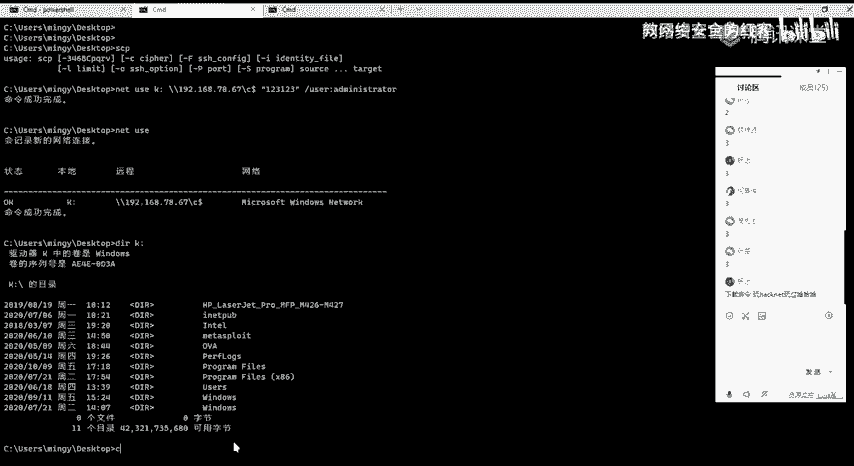
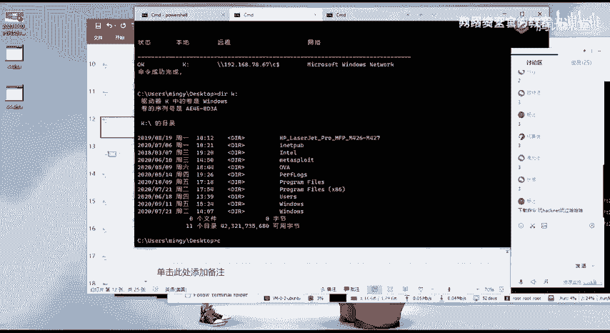
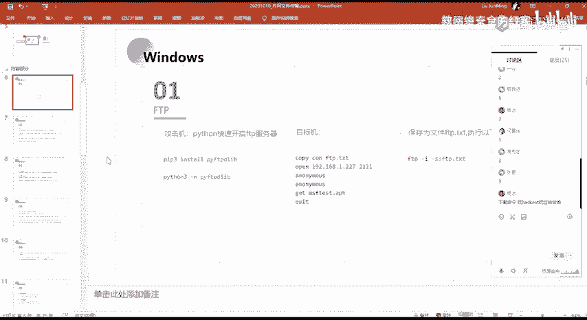

# 2024网络安全系统教程！清华大佬花159小时讲完的网络安全系统课！别再盲目自学了，学完即可就业！零基础入门网络安全！（渗透测试／漏洞挖掘／CTF／黑客技术） - P58：45.powershell上传文件.mp4 - 教网络安全的红客 - BV1ft421A7Nj

然后呃下面第五个的话就是这个SCP。关于这个的话，我这边的话就不多说了。呃，同样的大家自己去试吧，我就大概的说一下它的一个呃用法。就SCP的话，我们在windows系统上面的话。

它同样的也有也有这样子的一个命令，我们直接执行SCP对吧？它就有这样子的一个命令。这个SCP的话，它的一个作用，其实就是相当于我们的一个就是文件的一个复制嘛。

然后在这边的话，我们可以用这个SCP来去进行一个远程的一个文件的一个复制。像比如说第一个。第一个的话就是我们把我们本地的这样子的1个UPS的一个文件。

把它给复制到远程的这一个呃linux系统上面的一个指定目录下面。这个的话就是呃。SCP的一个文件上传，对吧？然后的话第二个的话就是SCP的一个文件的一个下载。就主要的话也是用的这个就我们通过SCP。呃。

下载远程的这样子的一个linux系统上面的指定的一个文件，对吧？然后的话把它下载到我们本地。就是我们在windows系统上面的话，实际的一个使用的话就是用SCP对吧？然后的话来去呃。

请求我们这边远程的我自己的1个VPS的一个服务器，对吧？然后的话我这边的一个文件在这个目录下面就存放我自己的一个呃文件，就想要去上传到目标机器上面的一个文件，放到这个目录下面。然后的话通过SCP把。呃。

把把在远程服务器上面的这个文件把它给呃复制到本地。然后这边的一个盖拉的话就是就是递归的去进行一个复制。也就是说它可以就指定一个目录，然后的把这个目录下面所有的一个文件都统一的复制到指定的一个目录下面。

然后第六个的话就是windows的一个文件共享。文件共享的话，其实前面的话在讲那个呃信息收集的一个命令的时候已经有讲了，对吧？

就是我们可以通过net use来去进行一个呃把我们的一个把远程机器上面的一个指定的一个目录挂载到本地，对吧？然后的话我们就能够去对这一个目录去进行一个呃文件的一个操作，对吧？我这边的话以这一个为例。呃。

我在这边。

我通过就是。78。67，我通过我这边的一个本地的一个机器来去连接我这边的这一个远程的呃，就是另外的这一个机器啊。

嗯。

我这样直接复制了。

好呃，这边的话我直接复制。粘贴这边的一个命令的话，命令的一个意思的话，就是把我这边远程的这1个78。67的1个C盘。然后他把单把它映射到我本地的一个K盘。对，然后我在这边我映射成功之后的话。

我过然没要递钥匙。可以查看到这边的话已经就是进行了这样子一个连接，是吧？然后的话。我们可以通过DIR开盘。来查看来查看到远程的这个C盘的一个目录，对吧？

然后我们可以通过就是copy的一个面具进进行一个呃写入，去进行一个文件的一个呃下载，是吧？以及我们也可以在这一个文件当中去进行一个写入。

啊，其实在这边的话，我们在就是在文件管理器当中，对吧？我们可以看到有这样子的一个呃这样子的一个。磁盘就是这个。K名字为K的这一个磁盘。然后这里的一个内容的话，其实就是呃这一个远程的机器上面的一个内容。

我们可以看一下用户对吧？就是这一个。对吧。那么我们就我们就同样的可以去进行一个文件的一个传输，以及啊文件的一个下载以及写入。这个的话是一个windows的一个文件共享。但是这一个文件共享的话。

有前提的话是你需要呃知道。你需要知道就是目标机器的这样子的一个需要，好不，不是目标机器的一个账号密码，对吧？以及就是说。呃。前面我前面我有讲吗？应该没讲，就说。

我可以通过就是说我得到了一个机器的一个sure，对吧？我得到了这个机器的一个he。然后的话我想要呃通过这个hell。呃。怎么。怎么跟大家说呢？呃，这里的话后面在后面应该会讲会给大家讲，我这边话先不说了。

就说我可以通过，就如果我不知道他的一个账号密码，但是的话我通过了我比如说我在CS上面，我已经得到了一个呃内网机器的一个shall，对吧？然后的话我通过它的一个密码哈希什么的，我得到了他的一个密码哈希。

然后的话我就可以通过。呃，去生成一个令牌，以及去进行一个token的一个窃取，来获取到对应的就是说呃对应的一个权限。然后这个权限的话就是能够去访问到，就是说这个用户他有权限去访问到这个远程的这个机器。

那么我可以通过token的一个注入，token的一个窃取来去进行一个得到这个用户的一个权限来通过n柚映射呃，访问到这个原本是访问，原本是没有权限去访问到的这样子一个机器啊。这边的话提一下。

可能这样说大家。会比较晕。后面的话会给大家讲，就是讲那个。呃，taken的一个注和taken的一个窃取，就令牌的一个窃取。以及生成。呃。

以上的话就是windows下面的一个一些文件传内网文件传输的一个方法。就实。其实windows下面的话，主要的话就是利用的它的一个系统当中所自带又有的这样子的一些命令行的一个工具，对吧？

我们其实可以知道，就是说这样子的一些命令行工具的话，我们就直接能够去进行一个使用，而不是说我们还需要去额外的去进行一个文件的一个上传，对吧？

因为我们原本就是需要去通过这样子的一些方法来去进行一个文件的一个上传，对吧？以及文件的一个下载。

