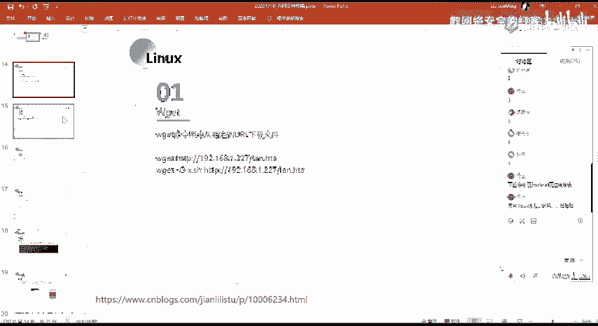
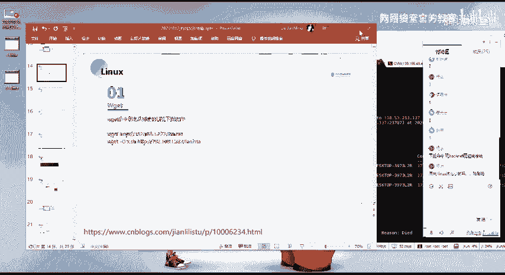
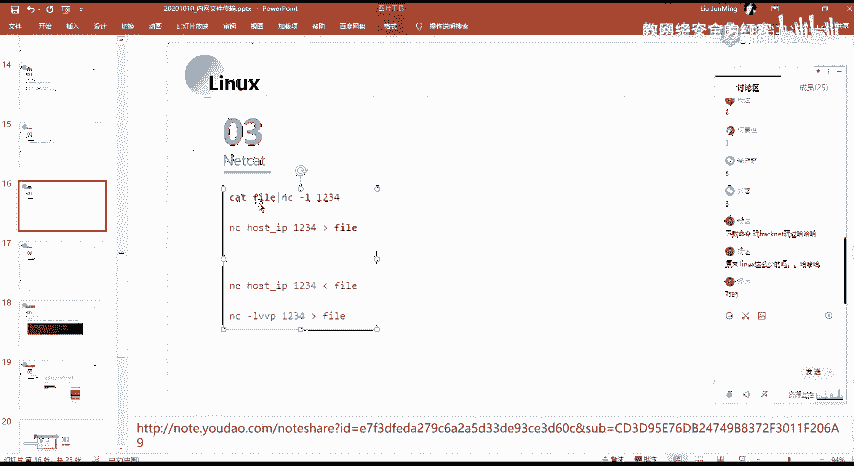
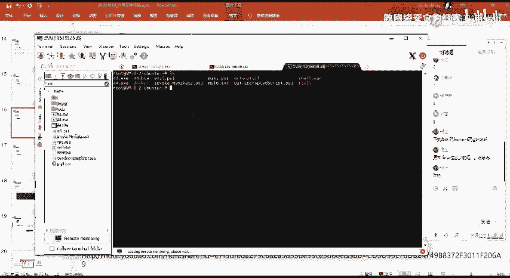
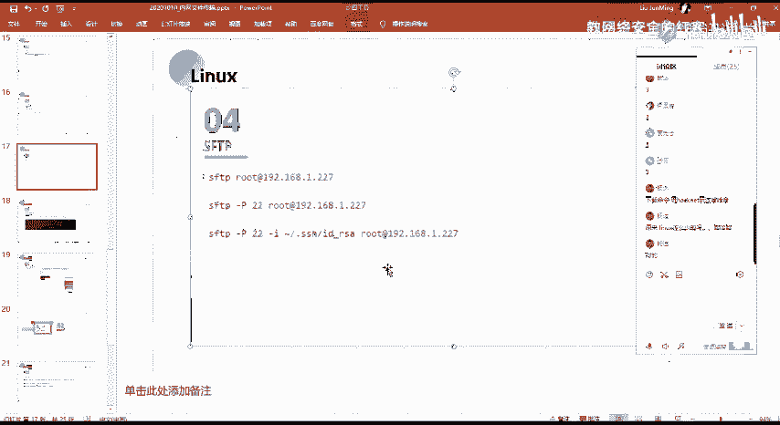

# 2024网络安全系统教程！清华大佬花159小时讲完的网络安全系统课！别再盲目自学了，学完即可就业！零基础入门网络安全！（渗透测试／漏洞挖掘／CTF／黑客技术） - P59：46.SCP上传文件和windows文件共享.mp4 - 教网络安全的红客 - BV1ft421A7Nj

然后第二个的话就是linux下面的一一些文件下载的一个命令。呃，linux的话相比window1的话就简单的多了呃。就这一些。首先第一个话就是we gettwe get这个面的话。

应该呃不需要我做过多的一个。

呃，下载命令。我还 cannet玩工，你说的是哪一个？

你你是这么少，是什么意思啊？就你是说我这边念的就少嘛？就。其实常用的就就这几个嘛，如果还有其他的话。像这些的话，其实你在历史里面的话都是常用的呀，对吧？像V get CL都是去进行一个文件的一个下载嘛。

还有的话你可以通过就是NC。NC还有SFTP。呃，然后在这边的话，we get在这边的话，应该我不用多说吧啊，我这边的话我就就呃略过吧，好吧。就其实主要它就这一个杠O的一个参数。

就我直接通过weget来指定我的一就是要去进行一个下载的一个呃链接，对吧？我就能够去下载到这一个资源。然后的话我想要去把我这边下载的一个文件，就是保存到指定的一个文件名当中，是吧？

就使用这个干大小的O的一个参数。详细的一个使命令的一个使用的话，大家看预习内容。好吧，我都把就是这些东西命令的一个使用所涉及到的。一些内容都放到了预习内容当中。

因为这一些的话其实没有没有很多的一个可讲的，对吧？自自己看一下，就自己看一下，以及自己试一下就会了。啊，CL也是同样的，就CL的话，这个工具的话也是我们采用的是吧？它的功能的话其实也有很多。

就是它的一个。作用的话就是用来请求web服务器的一个命令命令函的一个工具嘛。就我们通过命令行的一个方式使用CL来去进行一个web服务器的一个请求。就是我们可以通过CL来。

比如说常见的这种get请求po的请求，对吧？我们都是可以用这一个命令，用这个CR的命令来去进行一个实现的。然后呃在这边。我这边的话就列举了这样子的两个，就是我们通过CR来去呃下载我们指店的一个呃资源。

我这边的话我就不多说了。然后第3块就是NC就NC的话。呃，关于NC大家了解多少呢？就是。呃，有调解吗？应该。应该都有用过吧，是吧？NC这个工具。就是net cat，它是网络工具中的一个瑞士军刀。

就是它是通过TCP还有UTP的这种协议在网络当中去读取数据啊。就我们经常的话会用NC去进行一个端口的一个监听，以及呃反谈 share，对吧？然后其实它不仅仅有这一些功能。

它还有就是说我们可以通过NC来去进行一个。像比如说端口扫描，就我们可以通过NC来去进行一个端口的一个探测。然后的话区经理连接，就呃这里的一个就正向连接，反向连接的话，在访拉需尔的时候会给大家去具体的讲。

在这边的话呃，我就不多讲了。然后主要的话就是这边传送文件。就我们可以通过NC来去进行一个文件的一个传递。具体的一个使用的话呃，我这边的话写的很清楚了，就是关于这个呃。他的一个使用，我这边的话呃。

还需要我讲吗？应该不需要吧。我们看一下这边的一个例子吧，就是呃我这边的话通过cat file，然后NC杠L。1234就这边的这个意思的话，就是我cat file，就是呃查看这个fi的一个文件嘛，对吧？

我们cat的话。cat这一个文件的一个内容的话嗯。

我操作吧。总感觉说的话不是很好很好很好说。我们知道linux下面的话，我们可以通过ca命令。嗯。有点卡呢。在历下面的话，我们可以通过cat面去查看。来去查看这个文件的一个内容，对吧？我说。对吧。去。😔。

就这1个44点HK吧，对吧？我通过cat面的话，它会能够去查看这个内容。然后这个内容的话，它其实输出在我们这边的一个控制台当中的对吧？然后的话我们这边通过这个广告服。这管道服的一个意思的话。

就是把前面的一个命令的一个执行的一个输出作为输入，对吧？然后其实这边的一个输出话，就这一部分。然后这边的这一部分作为一个输入的话，就是把它输入到了这边。我们通过NC的话会监听一个端口，对吧？

然后这里的这一句的一个意思的话，就是呃把我们这边这个fi尔的一个文件，把它给就是呃。传递到我这边今天的这个1234的这个端口。然后的话我们在远程的这个机器上面，我可以通过NC来去连接这个端口。

我这边建力一个连接之后的话，那么我就可以去获取到这边fi尔的这个文件的一个内容。然后的话把这个文件内容，把它给从定向到我本地的某一个文件当中。呃，下面的话也是同年。就是呃方向不一样的啊。

就是呃从目标金上面到我的一个公积金是吧？就原林的话呃。都是这样。主要的话就是这个管道浮及从定向浮的一个意思。然后第四个的话就是SFTPSFTP的话，也是我们就是在另上面去进行一个文件的一个传输的话。

就常用的是吧？就前面有个同学说的那个插插需要插FTP对吧？这种的话其实都是像比如说就都是使用的这个SFTP的这样子的一个。就这个像比如说我这边使用的这个工具，你看到吧？这SFTD嘛，是吧？

就SFTP话呢，它是就是它同他使用的一个端口的话，其实就是SHH的一个端口。因为他所使用的是呃就是。跟SSH取是一样的，就是你SSH取的一个端口是22号，那么你SFTP你去连接的话。

你去进行一个文件传输连接的话也是使用的22号的一个端口。然后呃。在这边的话，我列举了这样子的三条命令，就是通过SFTP去连接到我这边的一个远程的一个机器上面。以及通过干大写的P指定端口。

以及通过干小写的I指定我们的一个私钥，就是说去进行一个秘密的一个登录。

