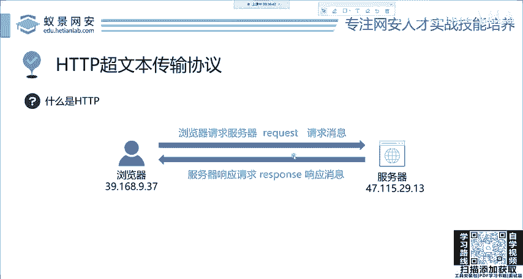
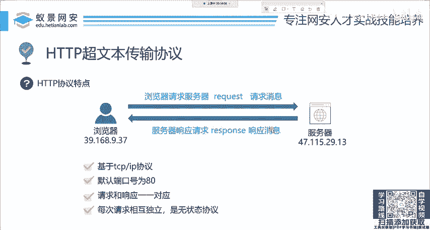

# 2024网络安全系统教程！清华大佬花159小时讲完的网络安全系统课！别再盲目自学了，学完即可就业！零基础入门网络安全！（渗透测试／漏洞挖掘／CTF／黑客技术） - P5：5.HTTP基础-HPPT的特点.mp4 - 教网络安全的红客 - BV1ft421A7Nj

一遍就能记住了。OK那我们下面呢来看HTDP协议它到底有什么特点。首先第一点已经讲过了，就是基于TCP的一个协议。那第二点呢就是它的默认端口号是80。这个之前啊已经讲过了，这个80是默认的。

你可以改你改成多少都行，只要它没有被占用。

第三点呢就是请求request和response一一对应。没有再高级的网站，也不会出现一次请求，两次响应，更不会出现。你请求两次响应一次，那没有这回事啊，都是一一对应的。

就是你一次请求对应一次响应一一对应。最后一点呢是每次请求相互独立都是无状态的协议。这一点非常重要啊，HTDB的母状态解析。保证了网站传输的安全性。也就是说，我这一次的传输跟下一次的请求响应就一一对应。

那没有任何关系。那这也会导致一些缺点。不过这些缺点呢已经被这个网站的开发者去弥补了。我们一会儿呢会来再讲。这几个概念大家呃清楚一下，那本节课呢其实还是非常简单的呀。

