# 2024网络安全系统教程！清华大佬花159小时讲完的网络安全系统课！别再盲目自学了，学完即可就业！零基础入门网络安全！（渗透测试／漏洞挖掘／CTF／黑客技术） - P60：47.linux系统中文件上传的一些命令.mp4 - 教网络安全的红客 - BV1ft421A7Nj

然呃，第五个的话就是一个电S传输数据。这边的话就是给大家介绍一个小技巧，好吧。就是minux下面的一个数据传输的一个技巧。就是我们可以通过呃DNS来去传输我们的一个文件的一个内容。

具体的一个方法就是这样子，我通过cat test呃，我首先在。呃，使用的话就是。使用一个电log。嗯。嗯。

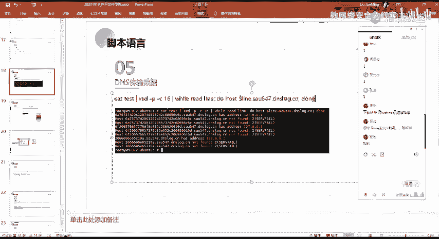

我们先来看一下效果，然后再给大家解释一下这一个命令的一个意思。

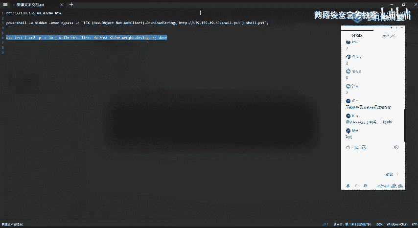

然后我这边的话，我在我的这一个机器上面。随便走。呃，就这个。哎，我随便写一个。我就写这样子的一个内容是吧？

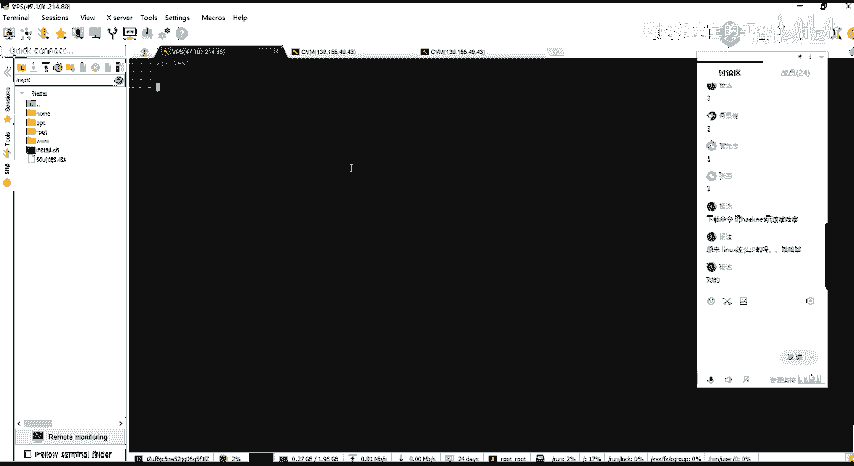

然后我就通过这样子的一个命令。

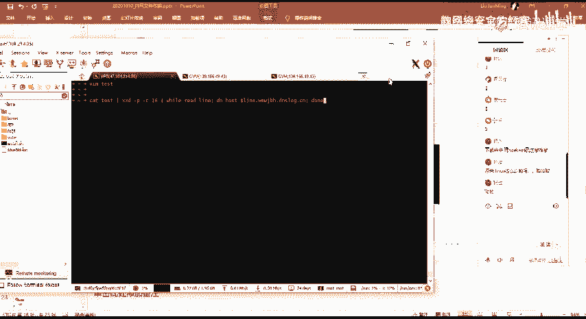

。谢谢。执行之后的话，他会有这样子的呃一个请求啊。

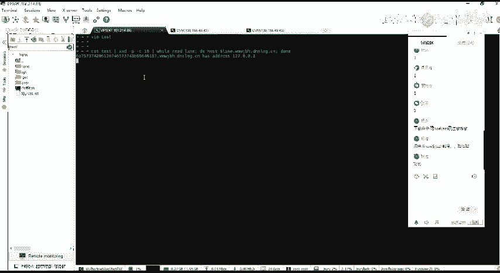

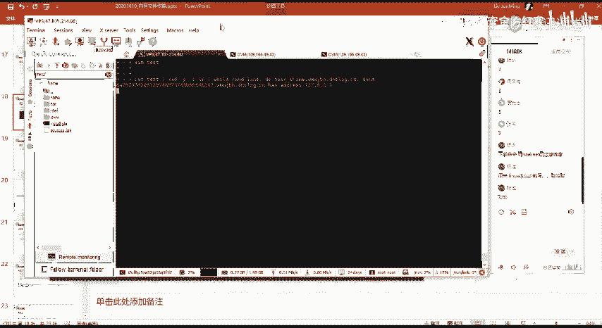

然后他会有这样子的一个请求。然后我们在这个DSlog上面的话，能够去接收到这样子的他的一个DS的一个请求。

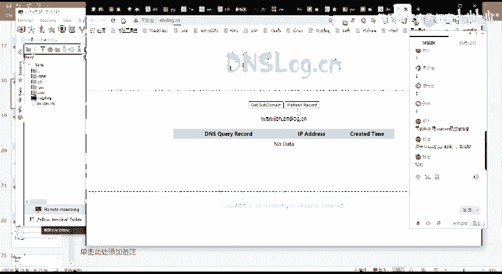

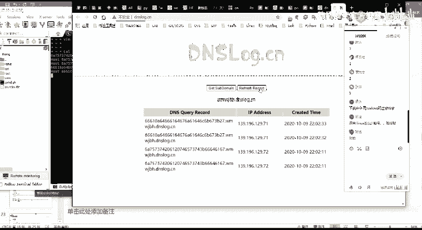

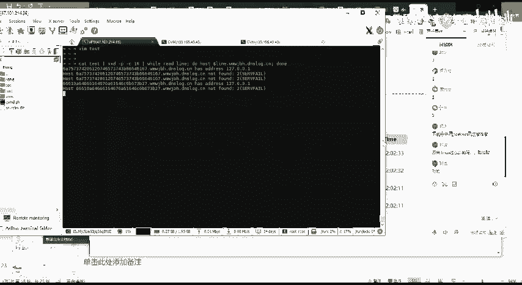

什么要等一下。没。😔。

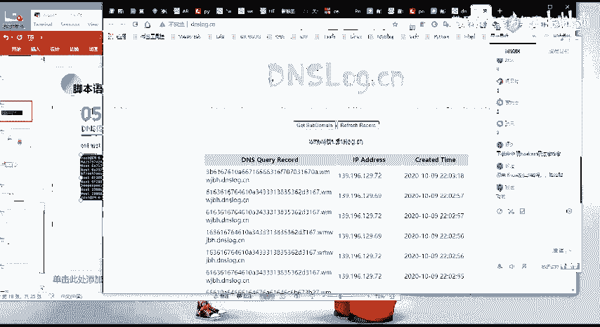

我这边直接停了吧。

应那就就这些吧。好，呃，这在这边我这边执行命令之后的话。我们在这个DSlog这个平台上面的话，就有接收到有这样子的一些数据，对吧？然后其实这里的这一部分内容的话，其实就是我们所需要的。

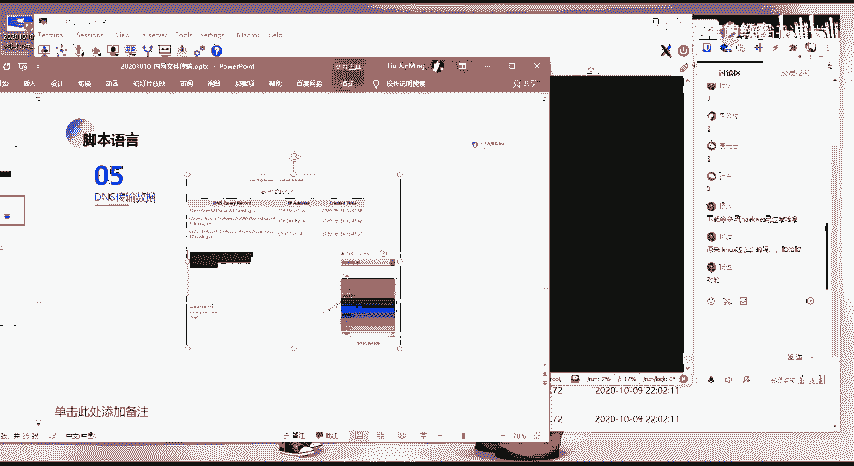

然后这边的这一部分内容其实它是。做了一个。就是hax的一个加密。然后我们可以通过呃像在BP当中的话，我们可以通过这样子的一个方法去把它解密出来啊，然后我们只需要把这边的这一个数据把它做一个害的一个解密。

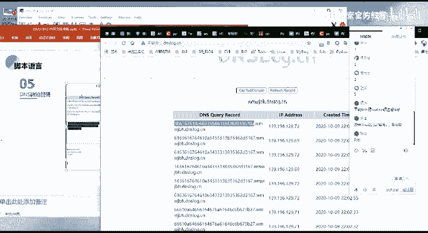

我看一下。

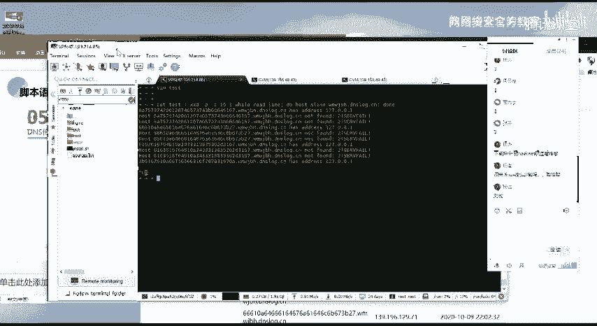

打开录音吧。嗯。啊，我把这一部分的一个内容做一个解密，解密之后的话就是得到了是这样子一个东西，对吧？然后这一部分的东西的话，其实我们。

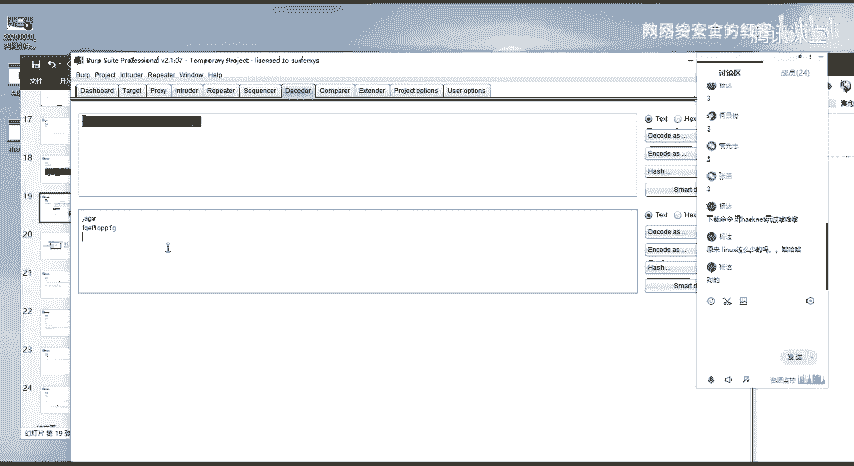

开这一个ca的文件，我们可以。

看到就这一部分的内容的话，其实呃。音乐 a g。就是这一部分对吧？就这一部分，然后为什么是截取的这部分，等会会说啊，对吧？我们可以看到就是这一部分是吧，然后呃因为这里的话是最后的这一个请求。

我们前面的这一个的话就是。

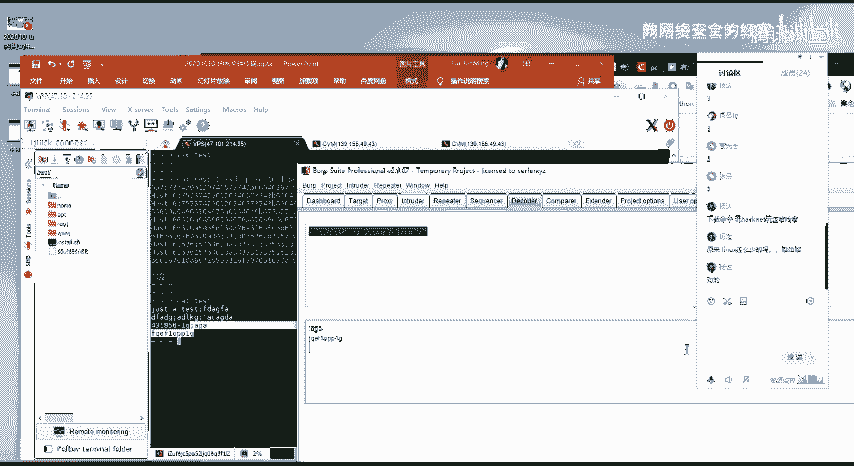

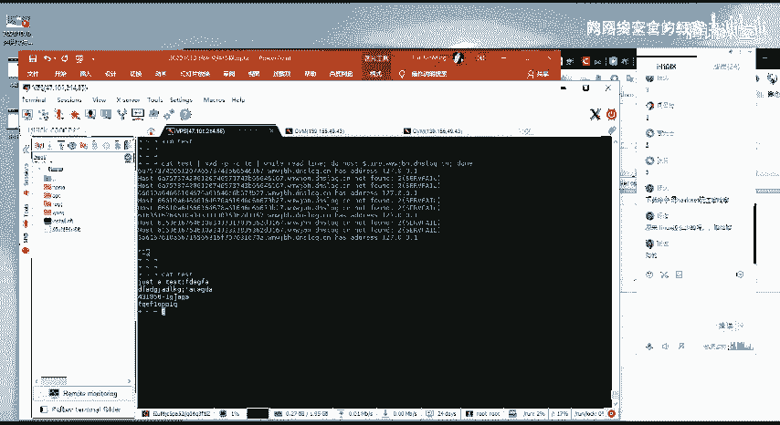

对吧前面的这一部分的话就是。从这边开始就是这一部分的一个内容，对吧？那同理还有其他的这一些的话，我就不一的复制了。就这边的前面的这一部分内容的话，其实就是我们这边文件的这一个内容对吧？

然后我们回过头来再去看一下这个命令，他是干了什么。他为什么可以就是达到这样的一个效果。

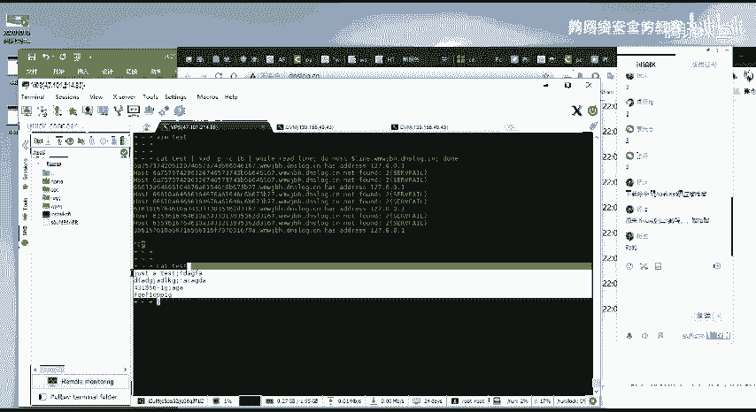

然后同样的这边的话，我们就是用这一个广道服，对吧？把我们这边ca test所输出的一个内容，把它作为这边的一个输入。这边的话就是使用的是这个叉叉B。他萨D的话，它是一个就是linux里面的一个命令。嗯。

叉叉D2它是一个二进制的一个查看命令，它默认将文件显示为16进制的一个字符串。也就是说我们可以通过这个叉叉D的这个命令，把我们这边test的一个文件内容把它转化成为16进制。

也就是我们的这边的一个has的一个数据，对吧？然后它这边的这两个参数的话，我们主要看出一个杠C。杠C的话就是呃指定我们这边的一个长度啊。呃，看一下。いか。嗯。嗯。嗯。

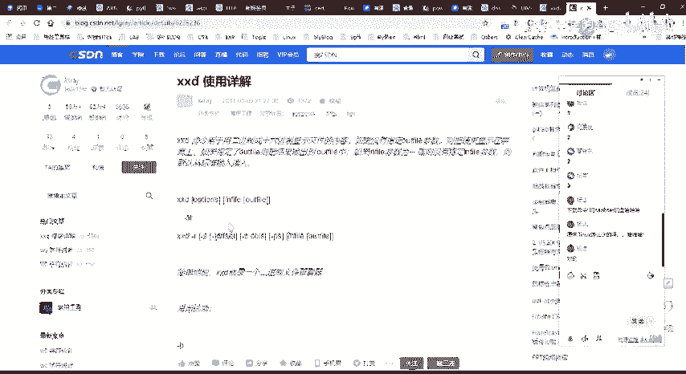

怎么没有？江西。就杠C的话就是指定我们这边的一个。

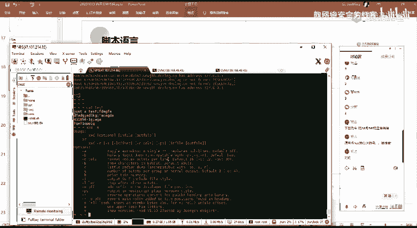

就是。7。所要去呃转换的一个数据啊，就是把它转化成多长的一个长度。

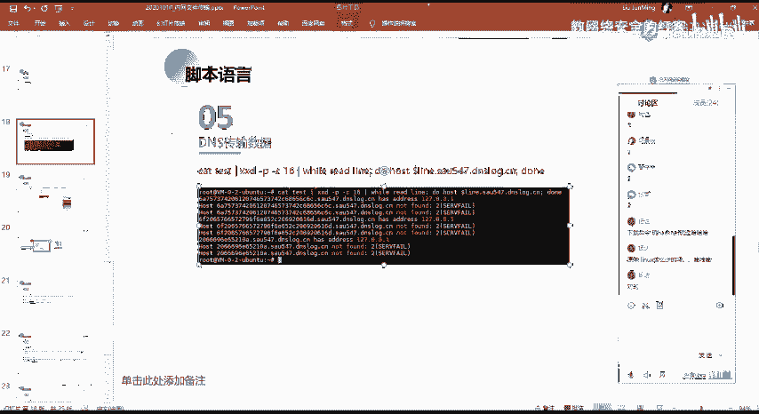

好，因为我们这边的话。我们这边呃。

我们这边所输入的这个数据，对吧？它每一行的话，它它不仅仅有就是它有我们不知道它有多少的一个数据，对吧？所以的话我们每隔16行，就是每隔16个字符，就把它作为把它进行一个呃换行。

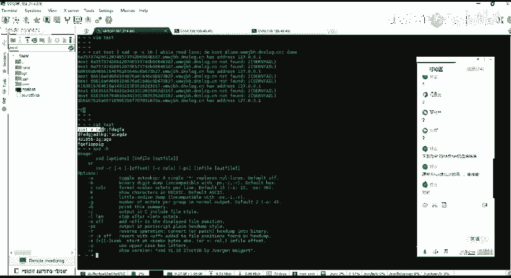

就是把它作为一行的一个数据进行一个输出。而，不是进行一个输出，作为一个就是进行一个编码，就是把它编码成为1个16进制，对吧？用叉叉D，就是每隔16位把它编码成一个呃16进制的一串数据。

其实就是我们这边的这一串，像这样子的一串数据。对吧？这个的话这一串的话就是呃每16位所编码的一个has的一个呃值。然后的话它编码之后的话，我们再用这一个Y循环。

就是这个的话是一个需要的一个脚本的一个写法，就是一个Y一个循环的一个写法。

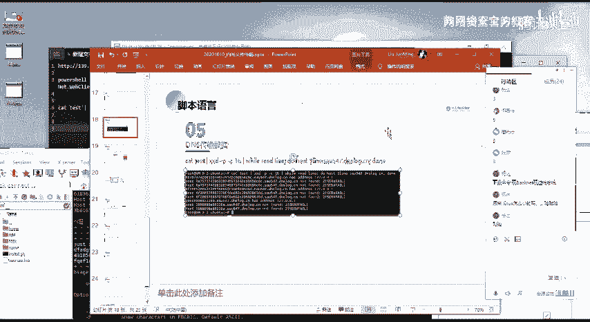

就是呃通过read去读取每一行。因为我们前面的话是每每16个字符把它作进行了一个编码的话的话作为一行，对吧？那么他读取这一行之后的话，他会做做一个这样的一个事情，就对的话就是做嘛，就他读到一行的话。

他就会去进行一个呃请求他会呃去请求我们这边的这一个域名。然后这边的这个域名的话，其实就是这里的一串内容，就是我们这边把我们前面读取到的1个16进制的一个数据，把它给到了这个line这个。呃。

这个值这个边量。对吧到这边的话就是作为了一个变量，然后的话去进行一个请求。然后请求之后的话，它会请求到我们这边的1个DS的一个load的一个平台。然后的话把我们这边的一个文件的一个数据把它给带出来啊。

我们在这边话就能够去接收到它的一个数据嘛。这个的话。呃，就是一个小技巧吧。就在念历史下面的一个就文件的一个获取文件读取的一个小技巧。呃，第三部分话就是脚本语言啊。脚本语言的话。

我这边的话就只介绍了这几个。就是呃脚拌员的话。首先第一个的话就是PHPPHP的话呃，一个写法的就是像这样子，就主要的话就是这两个函数。

就这个fire put content以及fire get content这两个函数，它的一个作用。呃，我这边的话也写了，就是首先这个fire content的话就是加一个字符串写入文件啊。

然后fire get content的话就是将整个文件读入一个字符串。然后我们使用这两个函数就能够去达到一个这样子的一个就读取，就获取远程远程文件的一个内容，然后的话把它保存到本地。然是我们来看一下。

就是详细的看一下，在这里的话主要是用这个f get contains来获取到远程的这个UL的这个资源。然后的话把它读入一个字符串是吧？就获取这一个远程文件的一个内容把它写入到一个字符串当中。

然后的话我们再把这一个通过f content将这一个字符串写入到这个文件当中啊，进行就通过这样子的一个方法呃，进行了一个。文件就远程文件的一个呃下达。

然后关于这个还有就是PHP杠R这个杠R的一个长数的话，就是大家可以。

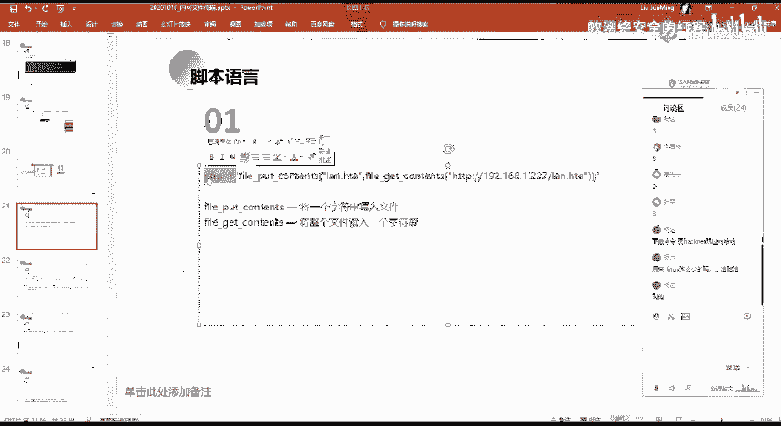

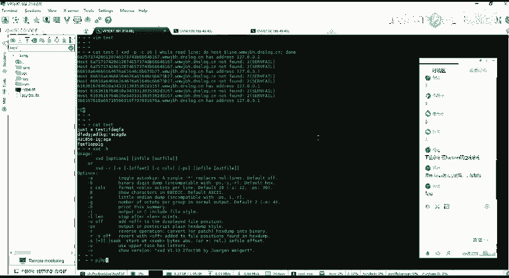

对。如果你的一个系统上面有PHP的一个环境的话，你可以通过PHP。来查看。我去。我这个没装。

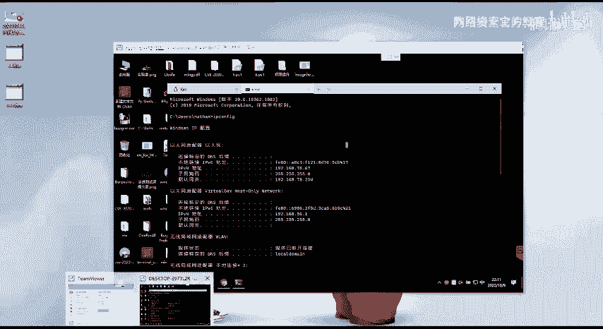

我们通过PHP杠H来查看它的一个参数。然后主要的话就是这个杠R这个参数。这个干刚参数的话，我们可以看一下它的意思就是run page B code。

without using script targets就是我们可以就是没有这样子的一个呃，就是我们知道PHP的话，它是需要包就PHP的一个代码，它需要包裹在这样子的呃，就是。金括号当中对吧？

然后金括号问号这样子的一个就是呃标记。然后的话我们使用这个杠压参数的话，可以就是执行这样子的1个PHP的一个代码。然后的话可以。不使用这样子的一个标记。就其实在这边的话，其实到这边的话。

其实我们这边的话就是1个PHP的一个代码嘛，对吧？然后的话我们像正常的这样子的话，我们需要把它保保存成1个PHP文件的话，我们需要加这样子的一个。就是。这样子的。需要加这样子的一个标记，对吧？

来表示我们我这边的话是1个PHP的一个代码。对吧，然后我们在这边的话。我们在这方使用这个刚刚上诉的话，我们可以直接就是执行这样子1个PHP的一个代码。同理python。就python的话。

它的一个执行就是paon的一个代码，就是杠C的一个参数。然后呃在这边的话就是我这边写列了两个，就是pathon2以及python三下面的一个远程文件的这样子的一个读取。远程文件的一个呃下载写入。

就主要的话就是用利用到这样子的一个U to的一个U open就学后pathon的话应该都用过对吧？然后在pathon三的话就是呃用的这个U的一个request。这个的话应该python的话，其实。

因为pa审话比较简单，对吧？这个的话应该都能理解吧。而而且现在的pason这么火，应该就在座的各位应该都有，就是有。了解过吧，对吧？至少也知道就是能够看得懂吧，对吧？像这种常用的这种库。这种呃。

you live to的这种请求这种库对吧？request的这种请求库应该都是呃，知道的吧。好，第三个话就是P。呃，Pre还有这一个re白的话，这边的话呃我这边的话我就不讲了。

就你知道知道这两个东西可以去进行一个这样子的一个通过这样子个方式来去进行一个远程文件下载就OK了。哎呃，其实我也没有去没有去特意去学过这样子的，就P尔跟绿伴也是两个，就是一个脚本语言，它都是脚本语言。

呃，像呃reby的话就是我们那1个MSF对吧？我们那个MSF，它其实就是使用的reby这一个脚本云去进行一个冰写的。然后的话呃就是为什么要去讲这这样子的一个。

就是就前面的话是讲了windows以及历史系统下面的一些呃文件的一个上传下载的一个命令，对吧？就这些命令的话，其实是系统当中它自带就有的对吧？那么如果说没有这样子的一些命令，对吧？而且这些命令。

我们就是说。就有一些环境下面，它没有我们无法去用这样子的一些命令。那么我们可以尝试去考虑，就是使用这样子的一些脚本语言。就是说如果说我们的这样子的一个环境。像我们的一个外表服务器。

它是使用的像这种LNNMP的这种架构，对吧？那么它会有这样子的PHP的一个脚本环境，对吧？那么我们得到了它的一个需要，我们就可以尝试使用PHP的这样子的一个脚本。

就PHP使用它系统就自带有的这样子的一个PHP的一个环境来去进行一个呃文件木马的一个下载。同理的话，python还有PV8也是一样的对吧？就说在存在有这样子的一些脚本环境的情况下面的话。

我们可以首先想到使用这样子的一些方法来去进行一个。文件的一个传输。啊，以上的话就是呃本节课的所有的一个内容。大家。呃，有什么疑问呢？给我送方案是没有疑问是吧？呃，没有疑问的，给我送朵花吧。

然后的话呃有疑问的直接在讨论区说吧。嗯嗯。啊，应该应该都是没有什么问题了啊，对至少现在是没有什么问题了。然后呃大家课后的话就课后作用的话就还是一样的。就是自己大家自己去把这样子的。

把我PPT里面的一个内容自己去进行一个操作，自己去进行一个尝试。好吧。然后作业的话呃作业的话就是我看了就是大家的一个作业啊，其实呃交了的话都写的应该都是挺好的，就是。嗯。

就是呃交了的作业的话都是写的挺好的是吧，就是。

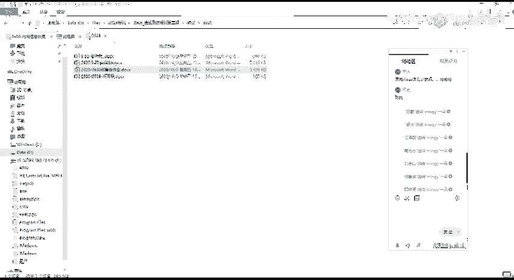

我们我这边的一个作业的话，就是深圳测施相关的，就是至少现在的这一些作业的话，都是呃需要大家自己去课后去动手做的。

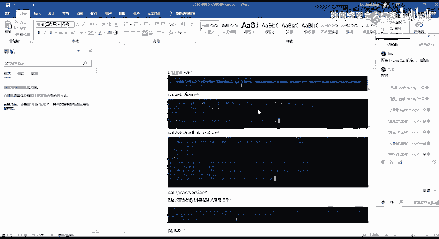

因，你在课上的话，你在课上听听我讲的话，像这一些东西的话，你自己不去做的话是呃。

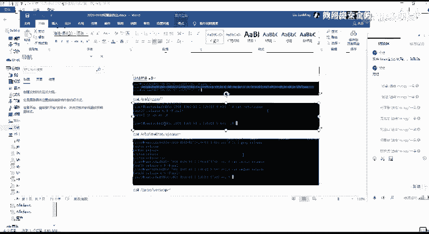

是一时半会，你是就是理解不了的是吧？你只有你自己去做了，你才有深刻的一个就是才能够去理解他的一些啊意思，是吧？才能够去加深自己的一个印象。然后其实你们的这些作业的话，其实就是一个笔记嘛，是吧？没有。

就就这么你嘛，这这位同学。

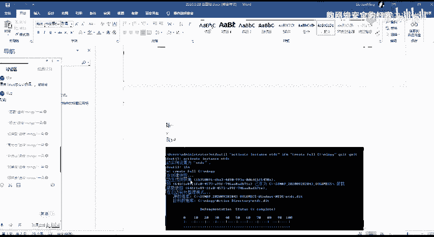

不止这么点吧，你你这应该是还没写完吧。

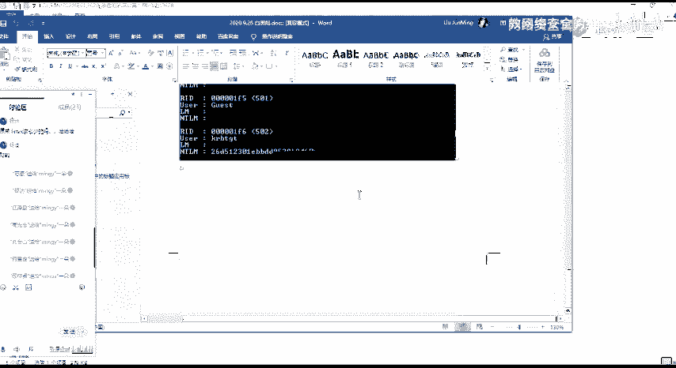

我PV上的内容应该是不止这么一点的。

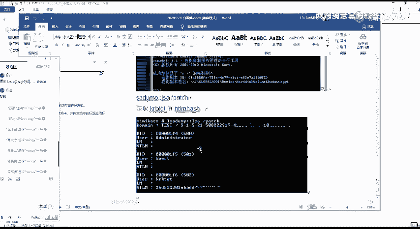

大家作业的话我其实也都有看。然后的话呃我如果有就是大家有什么问题什么的，就是。我今天的话不是有有说吗？就是有一位同学的话，他的那个作业啊。他那个作业的话。就是在作业里面都是有报错的。

但是的话他直接写写上去也没有管。就是说这个报错，他是为什么。因为你这报错的话，你是直接用的我PPT里面的一个那个VPS的1个IP因为我VPS的1个IP的话，以及那个端口。

我是那个呃用thon开了1个IP的1个serv对吧？所以的话下载的那个脚本我都是放在就是放在那个木录箱面的。但是我。课后之后的话就关掉了的，所以你使用我的那个IP，你是访问不到的。所以的话会有那个报错。

但是这位同学，你那个你这明显就是报错了。然后的话，你你你那个截图，你还照样的贴到作业里面，我不知道是就是你是为了贴到作业，让我看还是就是说你不想去管这个，就我建议的话，你你碰到了这种错误的话。

你自己先去解决一下。然后的话你要去找到就是说为什么会有这样子的一个报错的一个原因啊。你不是说把它就是记录下来，把它呃写到作业里面的话，就OK了。因为其实作业的话我虽然会看，但是我因为也有这么多嘛。

我不可能看的很很很很仔细啊吧，也有可能logo。所以说最好的话就是你自己去把这个错误，你自己先去解决一下。然后的话，如果你解决不了，你再问我问问题的话，大家最好在群里问好吗。然后的话呃就是太晚的。

就是已经很已经比较晚了的话，大家问我的问题的话，我可能就是。呃，看不到，然后的话也可能就是比较晚的话，我不会回哦，好吧。哦。就建议的话就是就是最好的话是白天。下午的时候来去问问题，好吧。呃呃。

大家没有什么问题的话，呃，也不跟大家大家多扯了呀，现在时间也不早。那么我们下课吧，然后大家早点休息。

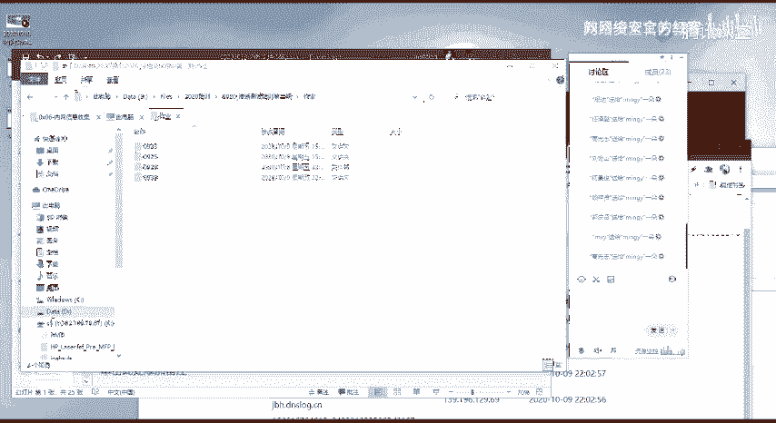