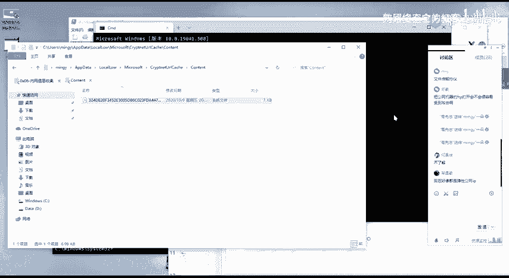
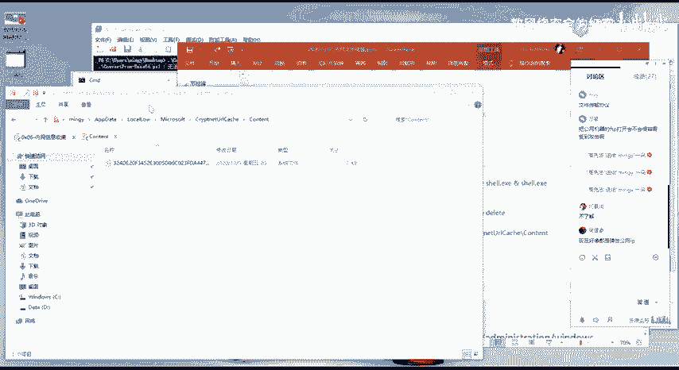
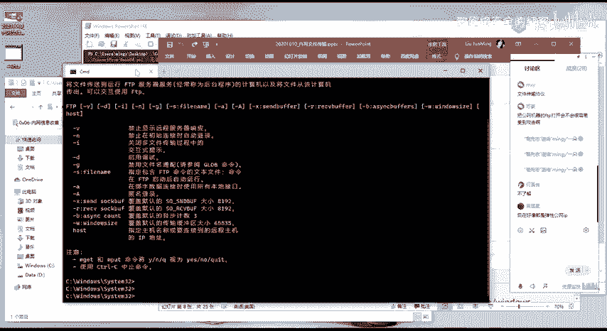
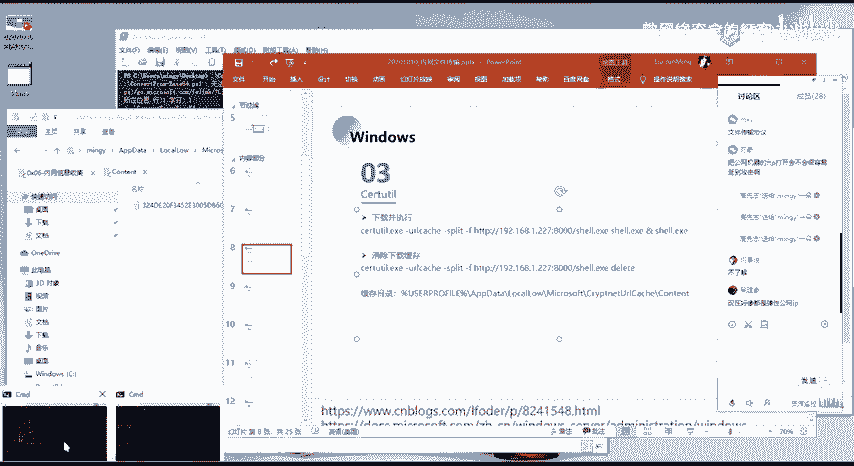
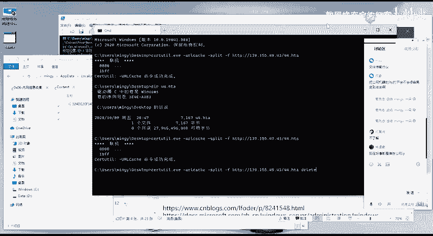
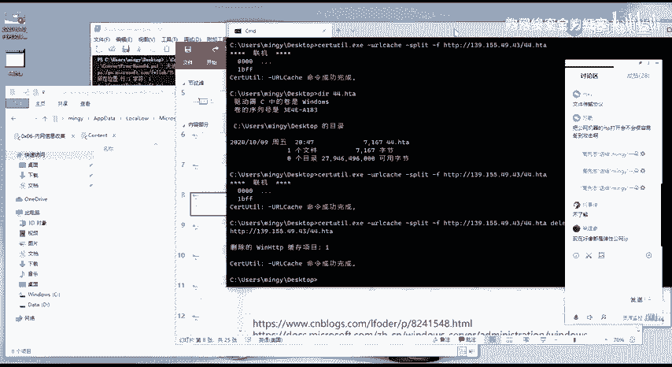
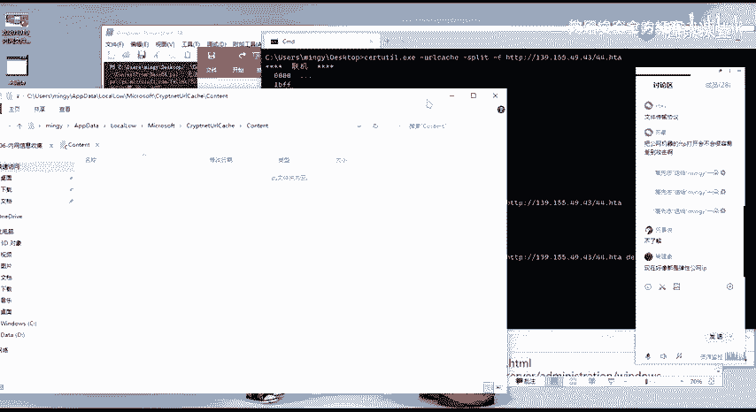
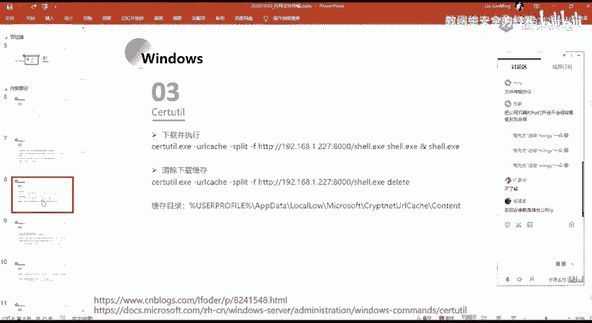

# 2024网络安全系统教程！清华大佬花159小时讲完的网络安全系统课！别再盲目自学了，学完即可就业！零基础入门网络安全！（渗透测试／漏洞挖掘／CTF／黑客技术） - P61：48.脚本语言上传文件.mp4 - 教网络安全的红客 - BV1ft421A7Nj

就是执行完之后的话，我们需要去执行这样子的一个命令，来去把这个缓存给清除掉。就清除掉这一个缓存的一个目的的话，就是为了就是隐藏我们的这样子的一个就是说使用了什么样子的一个木马。

使用了什么样子的一些一个方法来去进行一个攻击，对吧？就我们需要把我们这边的，因为这边的一个缓存的话，它记录了我们的就是说所使用的一个木马的一个内容，对吧？

那么管理员或者说呃就是我们的一个渗透测试之后的话，呃，法管理员他去做一个溯源啊等等的这样子的一些操作的时候，他可以在这样子的一个目录当中去查找我们。所使用到的这样子的一个木马，对吧？

来去对它进行一个分析。然后在这边的话，我们可以通过这样子的一个命令。

去把这样子一个谎存给清除掉。

比如清除的一个命令的话，很简单，就是在这一个命令后面的话加一个DLET，也就是deletedelete的话就是删除的一个意思，也就是。

可以看到我这边执行之后，对吧？它的原本这个目录下面它有这样子的一个缓存的。但现在的话已经没有了，就是已经做了一个清除。

做了一个痕迹的一个清除。

这是第3个。