# 2024网络安全系统教程！清华大佬花159小时讲完的网络安全系统课！别再盲目自学了，学完即可就业！零基础入门网络安全！（渗透测试／漏洞挖掘／CTF／黑客技术） - P62：49.windows反弹shell.mp4 - 教网络安全的红客 - BV1ft421A7Nj

呃，主要的话这3块内容。首先第一块的话就是对反弹效的一个简介，也就是让大家了解什么是反弹效以及正向效。然后的话我们在什么什么样的一个情况下面，要去使用到正向的一个效以及反向的一个效。

第二个的话就是windows反谈尔下下面的一些方法。第三个的话就是呃反谈尔的一个实验，也就是我们的一个课后作业。首先我们先来看一下地块反弹效的一个简介。嗯。😊，首先我们一起来了解一下什么是正向穴。

这向泄有的话就是控制端主动发起连接请求去连接被控制端。然后的话中间的一个网络链度它是不存在阻碍的。我们这个正下去要怎么去理解呢？我们看一下这张图。就从呃这张图的话呃，画的一个大概的一个草图。

就是一个正向小的一个呃。呃，请求的一个方向。首先我们在这边的话，控制端，也就是我们的一个攻击者，也就是具体等说的话就是我们的一个攻击机器，对吧？然的话我们这这边的话就是被控端，也就是我们的一个目标。

也就是我们呃要去攻击的一个目标。然后在这边的话，在这里面，这边的话有主机，有服务器等等，对吧？然后正向需ll呢就是说我们的一个控制端主动的去。请求去连接我们的一个被控端。这个的话就是正向需要。

然的话这呃在什么样的一个情况下面，我们要去使用这一个正向需要呢？就说我们中间的一个网络链路，它是不存在阻碍的。这个阻碍是什么意思呢？就是说我们的一个控制端能够去直接的去访问到我们的一个被控端。

也就是呃都他是能够去直接去访问到的，其实就是呃能够去互通。然后的话呃。在控制端以及被控端之间的话，它不会就是有拦截我们的这种请求的这样子的一些呃设备等等的。啊，第二个的话就是反弹线。反那些的话就是呃。

跟我们的一个正向效的话就是相反，就是呃反向效尔也叫反弹效。然，反向小的一个意思的话就是被控端主动的发起连接请求去连接我们的一个控制端。然后通常的话就是因为被控端。

它会由于防火墙以及我们的一个权限或者是说端口的一个占用等等的这种问题。然后的话导致我们的一个被控端，它不能够去正常的接收，从我们控制端发送过来的一个数据包。因为我们想要去控制我们的一个被控端，对吧？

我们需要呃从控制端来去发送请求。发送请求。也就是呃比如说我要在这边我得到了它的一个机器，我要去执行命令，对吧？那么我需要在控制端上面去执行我的一个命令。

然后的话要把这一个命令的一个请求发送到我们的一个被控端的这一个主机上面。然后的话在这个主机上面执行之后，再把结果来返回给我们的一个控制端，对吧？啊，在这边反向泄尔跟正向泄有的话，它这个一个不同的话。

就是说我们我们的一个被控制端，它是呃有存在这样子的一个网络的一个网络链路的一个阻碍的，也就是我们的一个控制端，它是无法去直接的去访问到我们的一个被控端，也就相当于呃也可以可以这样子去理解。

就是说我们的一个呃控制端是在外网，对吧？然后的话被控端的话，在内网外网的话它是无法直接去访问到我们的一个控被控端的。所以说这个时候的话，我们就会去使用到我们的一个反向线。呃。

大家对这一个正反向需要的一个呃。解释能理解吗？能理解是吧？好的。那么我们继续。下面的话就是我们本节课的一个主要内容，就是介绍windows下面的反弹效的一些方法。🤧嗯。

首先第一个的话就是呃我们的1个NC的一个正向线，以及我们的NC的一个反向线。呃，关于这个的话嗯。呃，在这边的话呃，给大家说一下就是。呃，在之后的一个课程内容的话。

我的就是说课后作业以及呃我的一个预习内容的话都会放在这边。就是说在这边的话，我新建了在全文件这边。呃，先建了两个全文档，然后的话大家能够去。能够去直接的在线的去查看到你当天的这样子的一个预习的一个内容。

以及你要去呃课后去完成的一个作业。我们现在的话是呃讲的是就是7月14号的这一个windows防产线嘛，对吧？然后这边的话我已经把作业已经呃给大家了。然后预习的内容的话，大家应该今天也有看吧，对吧？

我这边的话呃。就是呃包括明天的这样子的一个预习内容我都已经给出来了。如果说大家啊就是有同学基础好一点，对吧？就是说这一块的内容你已经掌握了，对吧？你已经有了解了，那你可以。

自己去就是说去了解一下下一节课的一个内容。然后在这边的话呃，关于windows的一个反弹效的话啊，在这边的1个NC，我这边有一个。对这一个NC这个工具的一个总结的一个笔记。在这边的话呃。

包括他的一个作用安装什么的，这边的话我就不看，因为大家自己去看嘛。就是它的包括它的一个安装。然后主要的话就是它的一个使用。就NC的话。

其实我们采用的话就会说去使用到我们在这边的一个进进行一个反向小以及正向需的一个连接，对吧？但是它其实不仅仅有只有这样子的一些功能。它其实也有像我在这边的话有念端口扫描，对吧？

我们可以通过NC向指定的一个主机的一个端口发送我们的一个请求。然后的话来探测它的一个端口的一个开放情情况。然后还有的话就是尽力连接，也就是我们今天要讲的一个正向连接以及反向连接。

包括在windows以及linux下面的一个使用。还有的话还有其他的像呃端口的一个数据抓包啊等等的这一些。还有的话可以进行一个密罐的一个搭搭建。还有文件的一个传输。文件传输的话，前面也有给大家介绍。

对吧？然后在这边的话，关于这一个工具的话，我这我这节课的话不会主要的去讲。大家呃自己去就是呃去看一下我的这一个文档吧。嗯。主要的话呃就是介绍大家怎么去使用。以及理解它的一个正向需要以及反向需要。

首先在这边的话，我们要去使用到NC来去建立这样子的一个正向需要的话，我们的一个操作的话其实就这样子的两条命令。这这边的话呃其实我们只需要理解，就是你只知啊你只要知道NC的一个用法。

以及啊你了解我们的这样子的一个正向需要，它是怎样子的一个就是请求的一个方向的对吧？然后在这边的话，我们看一下一的来介绍一下。首先第一个就是被控端。在被控端的话，我们首先来回想一下，对吧？

是我们啊正向下的话是需要我们的一个控制端，主动的去连接我们的一个被控端，对吧？那么我们的一个请求的话，就是说从我们控制端，主动的去连接我们的一个被控端，也就是主动的去向我们的一个被控端发送请求，对吧？

然后的话我们要去啊在被控端上面的话，要去接收来自控制端的一个请求。所以说我们需要呃在被控端上面去精听一个端口。然后今天这一个端口的话，使用的一个命令的话就是杠LL的话就是今天。

P的话就是指电端口VV的话就是显示我们的一个详细的一个信息。因为我们就说显示我们在呃连接之中连接的时候，我们的这样子的一个呃数据的一个呃细详细的一个情况信息。然后的话呃杠一的话就是NC的一个参数。

在后面的话接我们的一个program，也就是我们的一个应用程序。然后在这边的话，它的一个意思的话就是在呃NC上面去监听这样这样子的一个端口606的一个端口。

然后的话把我把被控端的1个CMD的一个这样子的一个shall的一个环境。从电向到这一个端口。然后的话在控制端，我只需要去连接这一个呃被控端的1个IP它指定的开放的一个端口。

就能够获取到被控端的1个CMD的一个需要。哦，他的一个原理就是这一句话。就是被控端将我们的1个CMD分向到本地的1个666的1个端口，对吧？然后的话控制端主动的去连接我们被控端的这1个666端口。

就能够去建立一个连接。然后的话得到它的被控端的一个需。

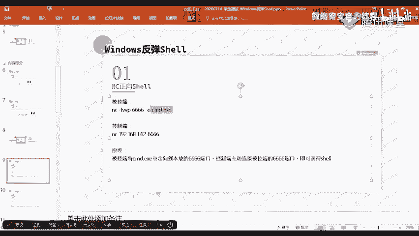

在这边的话，我们。做一个基本的一个演示。

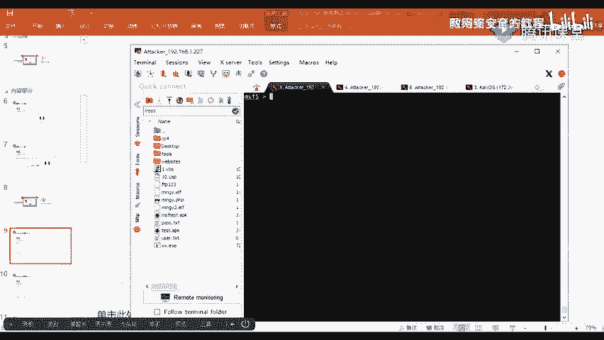

嗯。

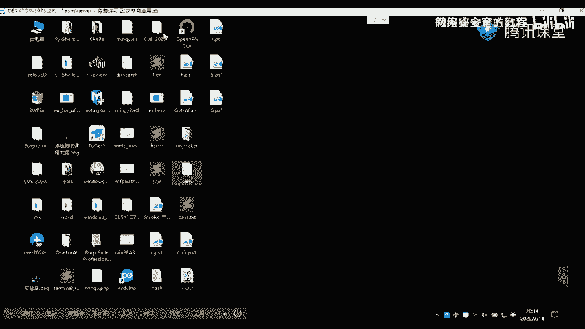

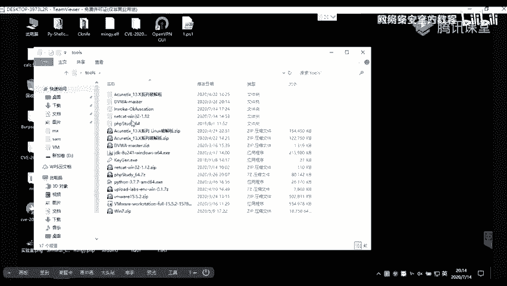

首先我们在这边的话就是我们的一个被控端。然后的话我们呃在。

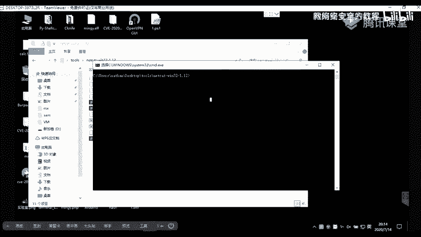

这边的这一个机器，也就是我们的一个控制端，也就是我们的一个攻击机器。然后的话我要建立一个正向连接，所以说我需要在这边。

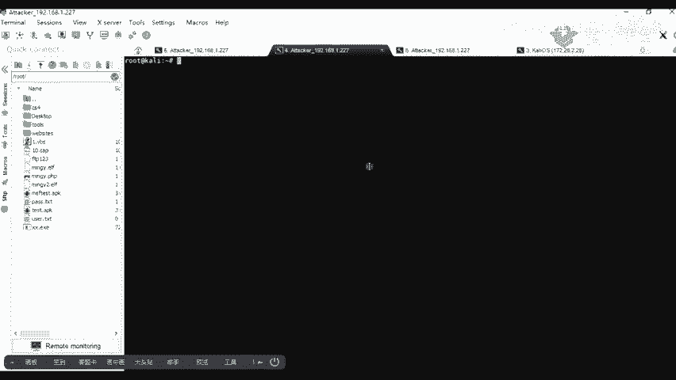

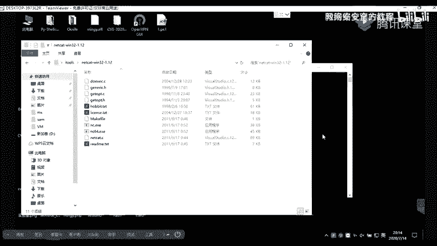

用 n c 。还建立一个连接。的来去监听一个端口。然后的话。把我们的1个CMD环境给重电下到这1个666的一个端口。然后的话在我们的一个攻击机器。

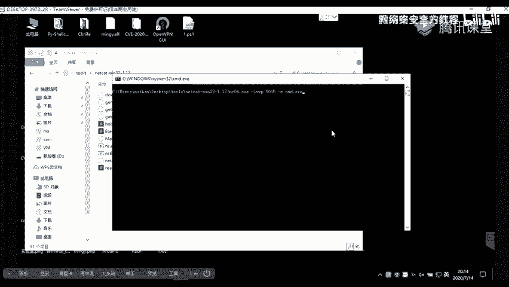

我们只需要NC。连接我们这一个呃。嗯 sorry。😔，666的一个短口，然后。回错回错之后的话，他会去。

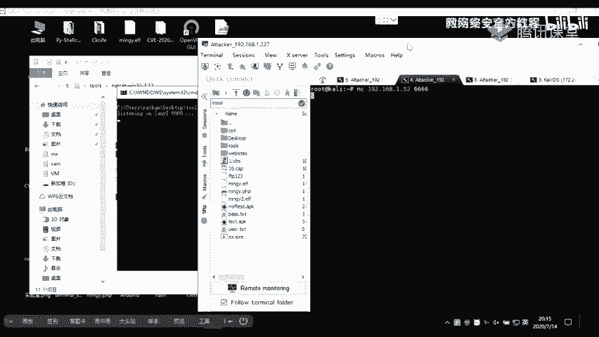

建立一个零件，对吧？我们可以看到在这边的话，它是一个同步的。

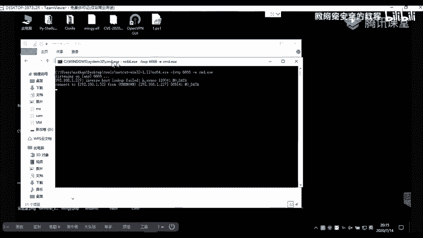

啊，进力连接之后的话，在这边的话就返回了这样子的一个我们熟悉的这样子的1个CMD的一个呃hell，对吧？好。

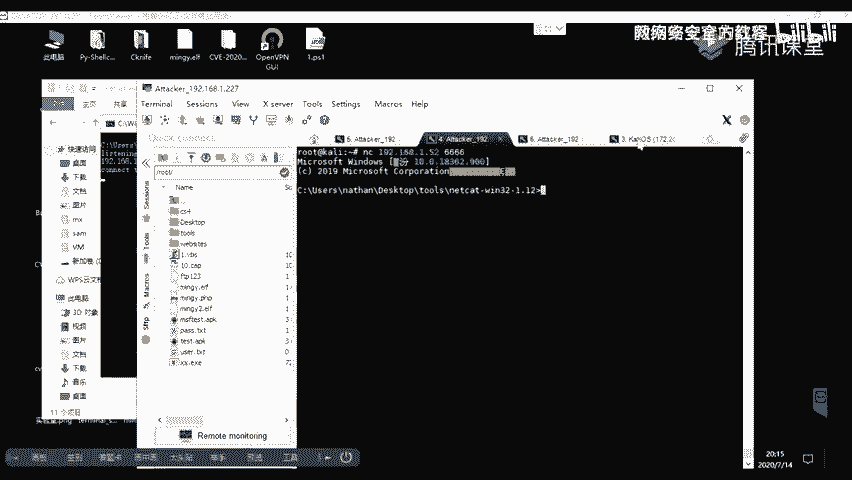

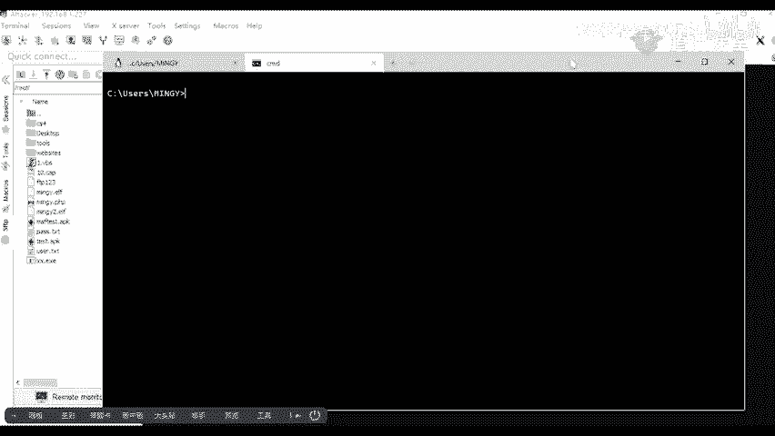

在这边的话，我们可以看一下。啊看他的这样子的一个当前目录下面的一个文件，然后的话就等于是在这边的一个被控端上面去进行一个啊操作。

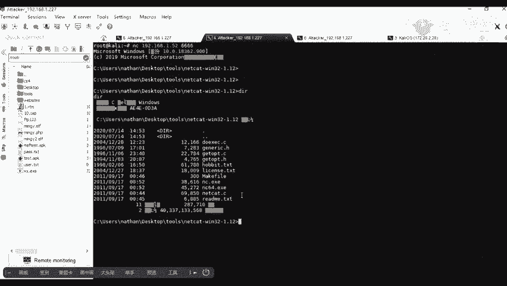

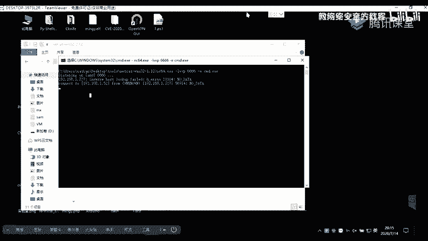

这是呃通过NC的一个方式来去访谈一个需要。然后在实际的一个情况的话，就是说我们需要去把我们的这样子的一个工具，把它给呃上传到我们的一个目标的一个机器上面。然后上传工具的话就是要用到我们前面讲的对吧？

在windows下面，我们通过什么样子的一些方法来去把我们的这样子的一些工具来下载，上传到我们要呃我们的一个目标的一个机器上面。🤧嗯。然后然后的话就是NC的一个反向线，反向斜尔的话。

同理跟前面的话其实是类似的，就它的一个反向线尔的话，就是我们的一个呃控制端。啊，不是我们的一个被控端主动的去连接。主动的向去我向我们那个控制端去发起请求，就说谁去发起请求。

那么谁就去NC就是主动的去连接嘛，对吧？然后的话谁呃接收请求的话，就谁今天一个端口，然后的话来处理从被呃来处理处理发送过来的一个请求，对吧？然后这边的话反他效的话就是像这样子的一个命令。

然后跟前面的话其实也是一样的，就是说我们要得到被控端的1个CMD的一个sha。所以说我们在这边的话，原理的话就是把我们被控端的1个CMD的一个shall从电向到我们的一个控制端的这1个666的一个端口。

然的话我们在控制端的话，只需要监听我们的一个链用端口，等待被控端的一个呃。被控端的一个连接请求，然后的话就能够得到被控端的一个CMB的一个sha。

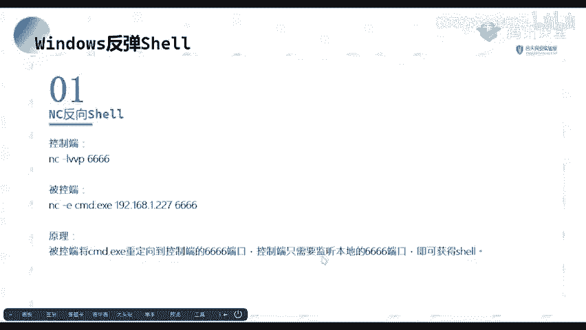

我们同你这一个来做一个演示。

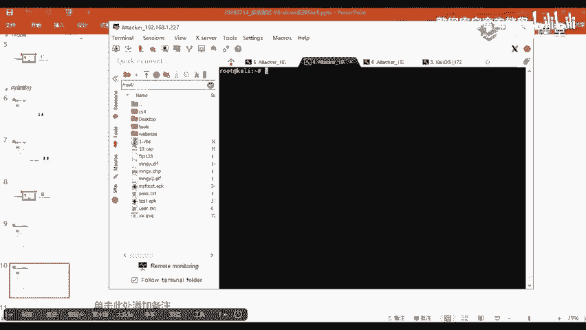

在这边的话是要我们的一个被控端，对吧？去主动的去连接。然后需要把我们那个SMD。嗯。把它重定向重定向到我们的一个控制端，也就是。啊。一点。27我这边的话是这个IP的1个666的1个端口，对吧？

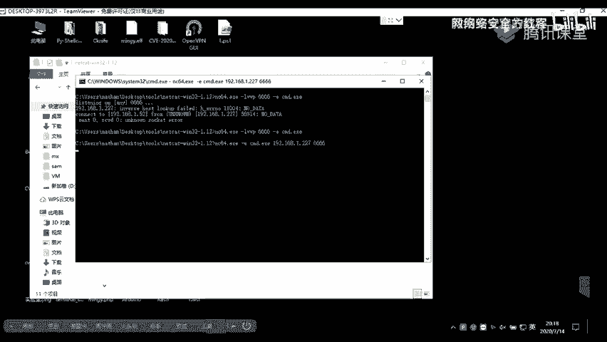

嗯，然后的话在我们的一个被控端的话。啊，在我们那个控制方的话，我们就需要去今天一个。一个应面的端口。

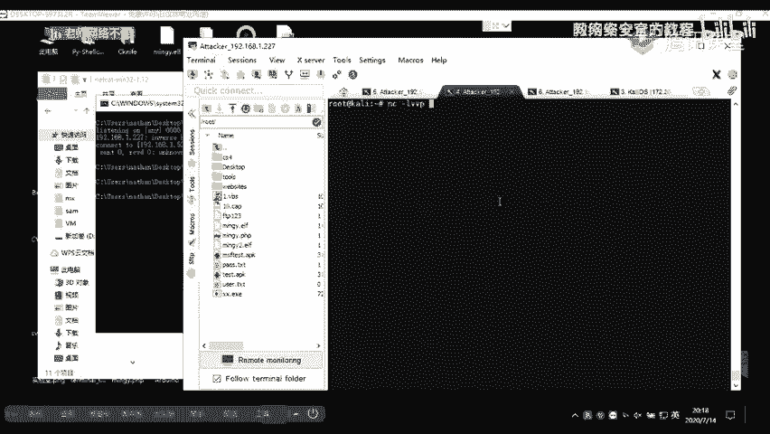

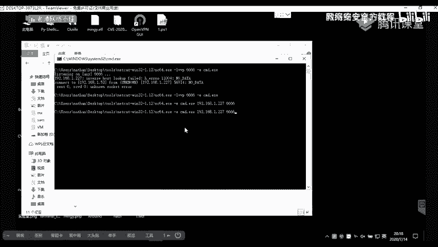

然后的话就能够去得到我们的一个被控端的一个效。然后的话他这边在这边的话就是说。

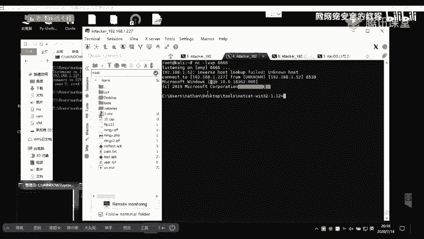

在这边的话，我们虽然无法去主动的去连接我们的这样的被控端。然的话。但是的话我们可以通过这个反他hell，让被控端来主动的连接我们把它的一个sell就是给到我们的一个控制端。

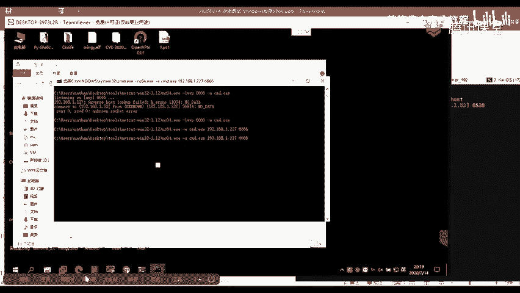

这就是一个反弹性。嗯。那第二个的话就是呃。这1个MSHTA这里的话关于这一个这个的话呃是windows里面自带的这样子的一个呃程序。这个程序的话主要就是负责解释运行我们的1个HTA的一个应用。

就这1个HTA的话，其实它呃其实它也是一个就说HTM的一个应用程序。它是以呃我们的1个HTM，还有CSS等等的这种呃。就是前端那种语言啊编写出来的这样子的一个文件。然后的话我们在windows里面的话。

我们可以通过这1个MSIHTA来去解释执行我们这边的1个HTM的这样子的一个应用程序。就包括可以运行我们的1个GS，还有我们的1个EBS等等的这种HTM的一个文件。

然后实际的我们要去利用这样子的一个利用他的这一个解释执行的这一个应用程序的话，呃，我这边的话介绍这样子的两种方法，就主要的话是通过这一个mataxpro，就说我们呃。

maxport的话里面它自带有这样子的一些模块。呃，关于这个的话。就预习的一个资料内容里面的话以。给了给了，这样子得骗人噻。他这里的话。🤧嗯。写的。比较详细了。这边的话他有介绍呃。

就是C啊ss script，然后的话。这1个MSHTA然后这1个CSscript的话，它是用来去呃。就执行我们的1个GBS的这样子的一个。呃。解释的一个应用程序。然后在这一个的话呃。

这个的话大家看一下吧，就是说VBS的这种呃我们生成的这种码的话，其实呃就说。我们生成之后的话，我们只需要去呃，比如说在windows7器上面，我们只需要去双击打开，或者说呃在命令行里面的话。

我们只需要start。这1个VPSS的这个文件，它就会自动的去调用这里的一个啊。C啊这个这个应用程序，以及还有这一个W scripts这样子的一个应用程序。这个的话就是一个图形。啊。

有一个图形对话框的这样子的一个应用程序。啊哦，关于这个VBS的话，我这边呃。不多讲，因为呃其实这1个VBS的话，它的一个秒杀的话就是比较难。然后它的一个就是说它的一个特征太明显了。

就是一般的你生成的这种马，他都能够去被查杀到。有时候在这边的话，它的一个作用其实比较小。然后在这边的话，我们就是呃在这边的话，其实我们通过MSFow嘛来生成这样的1个VBS。

然后它其实就是像像这样子的一个脚本。然后他这边在这里的话，他其实就是做了一下改变，就是把我们的这里的一个呃程序的那一个代码。然后的话他把它放到了单独的这样子的一个text文件，然后做了一下改变。

然后的话他再通过这样子的一个呃这样子的一个方法来去呃请求我们这边的这个text文件。这个text文件的话，其实就是在这边它会保存为这样子的一个text点X1的一个应用程序。

然后的话它会去执行它执行之后的话，它就会这个应用程序的话，其实就是一个反弹效的一个木马。然后他执行的一个命令的话，就是通过这一个sscript。啊，第二个的话就是这1个MSHTA这边的话，他呃。

他这边的话也是MSF的这几个模块，他这边的话讲的比较清楚。🤧嗯。啊。

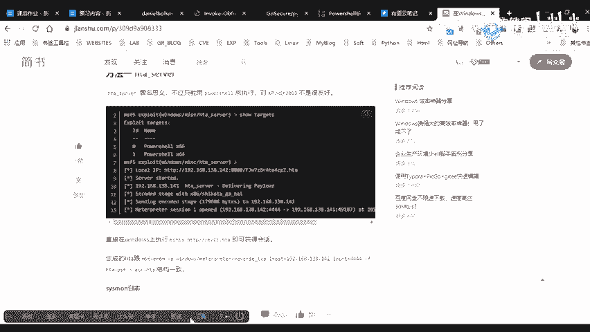

大家再去要去操作的话。呃，在CS里面看一下。

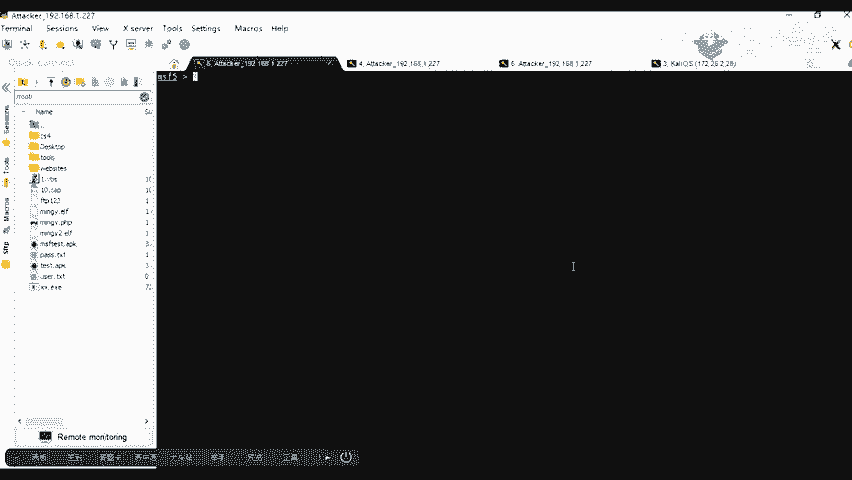

直接设取。再取这1个HT的话，在这边的话有一个2个3个。然后主要的话就是这两个。然后这一个的话office word的话，这1个HTA的话，它是会生成一个就是呃生成一个在office当中的一个红红代码。

然后的话我们在这边的话就可以去利用office的一个红代码的一个漏洞。然后在我们的一个文档里面插入我们的一个这样子的一个红代码。然后的话呃公就是受害者，他打开这样子一个word文件。

然后的话他启用了那一个红启用红之后的话，就能够去执行我们的这里的一个代码。然后的话反弹一个需要给我们。然后其他另外两个的话就是在这边，我这边话我就不多说了。他这边的话讲的很详细了。在这里的话。

主要就是大家要了解，就是说他这边的一个。呃，我们怎么去解析这样子的一个HTMHTA的这样子的一个代码。然后在这边这个HTA的一个web server的一个模块的话，它在这边的话它会。就是你执行之后。

你只需要设置你的一个服务端。这个服务端的话，其实就是呃你的一个攻击机器嘛，对吧？这攻击机器的话，就是它会起一个这样子的一个服务端。这一个服务端它它默认的话是8080呃，啊不是不是默认的一个端端口的话。

是我们可以去改的1个SRVport。然后的话我们在这边exit执行之后的话，它就会在服务在这一个机器上面，它会起这样子的一个web服务。然后端口的话这边指定的一个端口。

然后然后的话我们就能够直接的去访问到在这边它生成的这1个HTA的一个代码。然后我们可以通过这1个MSHTA这个程序来去远程的去加载执行我们的这1个HTTA的一个代码。

好的话执行里面的一个反弹需的一个脚本。然后第二个的话就是呃。我们直接可以通过就是生成这样子的1个HTA的一个文件。然后生成的方法的话就是呃。这边的话应该大家都熟悉啊。

主要的话就是注意一下在这边的1个HTA杠PSH这边的话就是通过。啊，就是。啊，我这边执行一下。

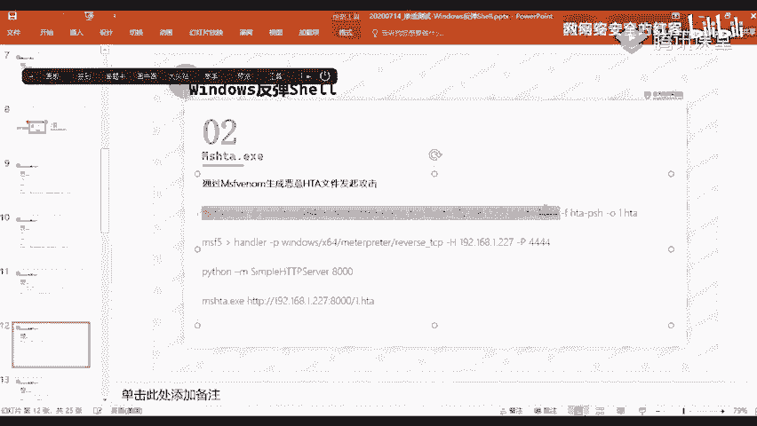

在它在这边的话，它会生成一个这样子一个HTA的一个呃代码。然后这个代码的话，它其实就是去执行我们的一个P呃power share的一个代码。就是他的一个作用的话。原来就是生层一个。哎。这么卡。

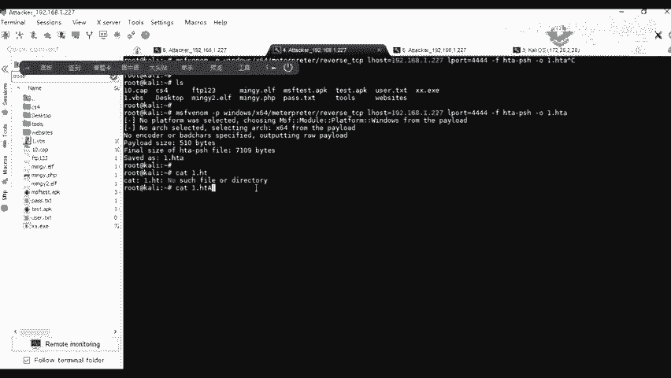

然，在这边的话，其实我们可以看一下，在这边对吧？像在这边的话就是一个script。就我们如果学过前端的话，都能够去了解。就是说在这边的话呃，其实就是一个开头，就是告诉我们的这一个解释器。

我们的一个当前的这一个脚本语，是1个VB的VBS的一个脚本，对吧？好，下面的话就是呃创建一个对象，创建这一个对象的话就是这个W script点，这个是windows里面的。

我们前面其实也有说那个W script的一个呃那个然后的话。创建之后的话，他在这边他其实就是去执行。呃，在这边他会去执行我们的这一个通过po share的一个方式去执行这边的一个代码。在这边的话。

它是通过呃b64的一个编码。在这边其实我们可以做一个b64的一个解码。然后呃要注意的话，在这边其实你看的中间会有这种空格，对吧？它其实是po里面的一个那个编码的，就是一个64会有的这样子的一个编码。

它会有加这样子的一个。呃，就是解码出来的这样子的一个空格。其实我们就是把这个空格去掉的话。中间的话就是我们呃比较熟悉的这种po share的一个代码。好。呃，其实就是说正确的解码。

其实要用要用po里面的那个base64的一个解码的一个模块，就能够去正正确的去解码出这样子的一个它的一个po的一个代码。嗯。然后在这边的话呃，就是我们可以看到在这边的话就是po就执行了这个嘛，干NOP。

然后的话杠W就是隐藏杠一的话，就是执行我们在这边的一个啊用pa那一个S4664编码之后的这种代码，它能够去用这个杠一参数去指定来去顺利的去执行它里面的一个代码。然后下面的话就是呃常见的一些方法。呃。

这边的话我就不多说了，大家应该都能够看得明白。好，第三个的话就是这个runer32。这个的话他是呃。与windows操作系统相关的。我们从它一个名字，其实也能够知道它是就是用来运行我们的这个d文件的。

调文件的话就是我们的一个动态链接库嘛，对吧？动态链接库的话，大家能够呃大家了解嘛，就是大概知道它的一个意思吧。我不知道的话呃，我这边大概解释一下，就说我们的一个呃我们的这样子的一个。

windows系统当中，它其实有很多的这样子的一个动态的一个链接库。这个动态链接库它的一个作用是什么呢？就是储存它的就储存我们啊就储存windows系统上面它的这种应用程序，它所需要的这种函数。

然后这些函数的话，它其实是就是各个多个程序，它能够去呃共同的去使用的。就是说呃都能够去使用这一个DL文件当中它存储的这样子的一个函数。所以说的话我们就直接把它都封装成这样子的一个DRL。

然后的话各个程序都能够去调用这样子的一个DL当中它存储的这样子的一些呃函数以及方法。然后呃在这边的话，这一个run deal32的话，它也是一个windows，它自带的就有的这样子一个程序。

就以说我们可以利用它来去进行一个呃，就是说来去加载，就是说调用我们自己生成的这样子一个DL的一个文件。然后他调用的一个方法然就像这样子。关掉，然后呃接我们的1个IP。然后这里的一个路径的话。

它在这边的话是我们啊就这一个sber deliverver这一个模块，它自动的去生成的。其实跟我们前面的话也是一样的一个意思。它会就是启动这样子的一个像一个外b服务的这样子的一个连接。

那我们可以远程的去通过这个runer来去呃解来去调用我们这边的生成的一个test点DL。然后这个test点DL的话，其实就是我们的一个呃木马。然后它的一个作用的话就是反弹小。呃。

演示的话应该不用我去演示吧。要要我要我操作一遍吗？不用好的。🤧嗯。然后关于这一个就是这个run点啊，它的一个具体的一个用法，就是它的一个命令的一个格式的话，我的一个预习资料的话呃已经有了。

就大家看那个吧，就就是像这种windows，它系统的这种程序的话，大家就是养成一个习惯去看它的一个官方文档。啊，第四个话就是这一个reg reg32。这一个跟前面的那个其实呃也是类似的。

就是一个命令行的一个应用程序。它的一个作用的话就是注册我们的一个这种REE的一个控件。比如说我们注册表中中的一个dell，还有我们的这种activeX的这种空间。这种空间的话就嗯。我们可以通过这一个。

程序来去进行一个注册以及调用。然后它是存储在这样子的一个文件夹当中，其实就是在我们那个windows system32的一个文件夹当中。就这边的话一个基本的一个语法。呃，主要的话在这边的话就是。

就这几个的话就是列出来在这边会去要用到的。然后呃这边我就不不一一的去说了。大家看一下。然后的话呃就同样的，我们在这边的话。

同样的是使用这一个可以使用这个s本 deliverver这个模块来发起这样子的一个攻击。就呃这个。嗯，这个的话跟前面其实也是。跟前面的这一个其实。类似。因为呃因为这1个IEGel。

我们也能够去注册我们的这样子的一个调的这样子的一个文件，对吧？所以的话我们在这边同样的可以去生成这样子的一个呃电额的一个。呃，木马文件，然后的话使用这样子的1个IEGCO来去进行一个注册。

注册的话就是我们可以通过这样的一个方法来去远程的去调用它的这样子的一个文件。

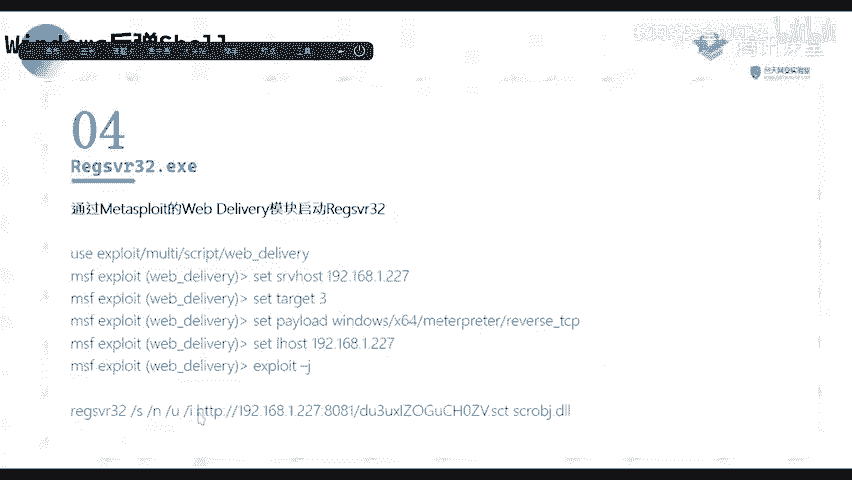

啊，其实呃在这这这边的话，我们可以看到之前的话。呃，使用了好几次的这个web deliver的这个模块，对吧？而后这个模块的话，它其实我们前面的话在这边的话都是跟其他的模块常见的对吧？

就呃我们这边使用的一个模块。就是这个，然后的话我们的一个payload的这你 payload的话，默认的话是这个paon。然后其实就是说这里默认的一个pathon的一个意思的话。

其实它的一个payload的话，它是根据我们这边的一个targe来去进行一个选定的。然后默认的话，它是一个pathon，所以在这边的一个payload，我们需要去设置。

就是说python的这种脚本云的这一个payload。哦，我们在这边其实可以通过需要 targetss。而去查看到这个模块，它能够去使用到哪一些呃。哪些功能。像比如说第一个呃第零个的话就是pathon。

就是说它能够去啊生成。pathon相关的这样子的一个呃这样子的一个后门。小叔嗯。呃，这个的话后面的话我后面的话再讲吧。后面的话会讲到，然后呃还有的话就是PHPI，还有PH的话。

也就是我们那个power share。然后第三个他就是我们前面说的一个这个IGC，以及还有其他的像linux下面的一个这样子的。然后我们都可以通过这样子的一个模块。就这个模块的话。

就它会自动的去生成一个这样子的一个命令。像比如说我在这边。我就使用的是。切。阿月。就这一个3。然后在这边的话，我们需要设置一个payload，设置payload的话。

如果你不知道就是说你这边设置了这个IGS32，你不知道要去使用什么pload，对吧？我们可以set payload，然后的话table。啊。哦，在这边的话，因为是。在这样的话，我们其实可以看到在这边呃。

因为是在这边IEG server的话，它是在windows系统下面的对吧？所以说的话它在这边它会列出来所有与windows相关的，也就是能够在windows系统上面去反弹下。

或者是说建立正向小的这样子的一些呃load的。我们这边的话就是直接。设置我们常用的像windows。我们常用的这一个windows下面的一个mat的一个反反向小的一个连接。

然后呃关于这一个就是说这一个模块你是使用的什么样的一个呃连接。我们主要的话看后面的这一这一这一个字符，就像这一个reviser的话就是反向嘛。

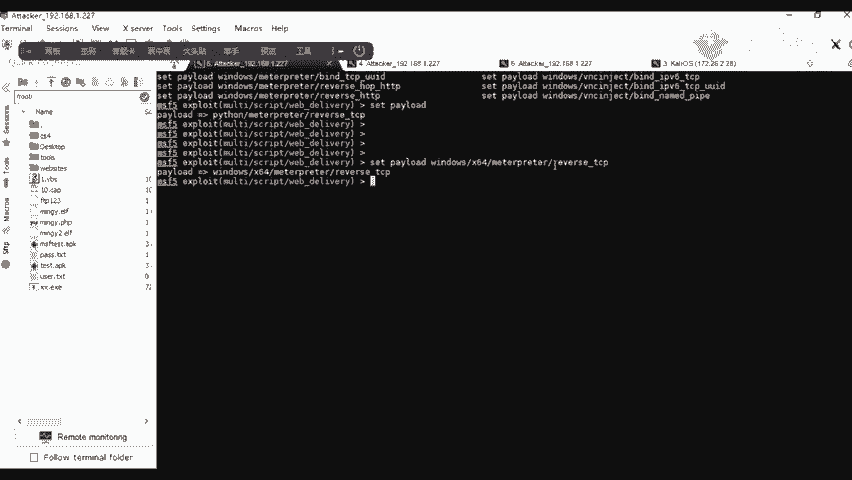

如果不知道的话，可以翻译一下。reas的话就是那么颠倒反转，也就是反向的嘛，逆向的。

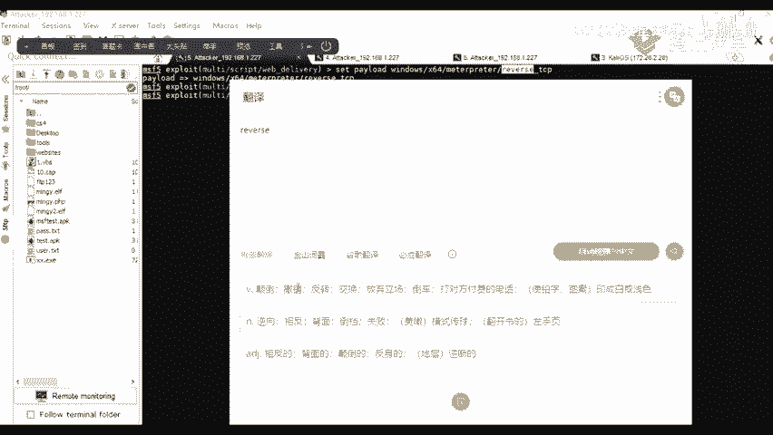

然后这一个reviser tCP的话就是说一个反向的1个TCP的一个连接。还有像在这边的话，我们可以看一下，像比如说随便找一个。就这个对吧？windows的一个mpl的一个band tCP。

band tCP的话就是正向的一个连接。然后的话它是一个正向的1个TCP的一个连件。嗯。我们exloit干机的话，就是把我们的这样子的一个呃程序，把它放放到后台作为一个job，作为一个jabs。

就是这一个。然后这里这里的一个jabs的话，它就是生它会就是今天这样子的1个444的一个端口，对吧？诶。然后在这边的话，它会生成这样子的一个命令。这个命令的话。

其实就是我们在这边的一个我们在我们的一个希尔当中去执行的一个反谈系尔的一个命令。它在这边的话就是利用的这一个IG server32。

然后的话它会在我们本地的1个8080端口的话，有这样子的一个wordb服务。它在这边它生成的这样子的一个文件。然后我们可以通过这个IG。这一个s来去进行一个注册。

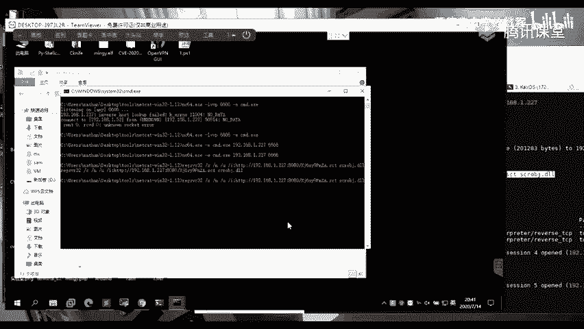

呃，我们执行之后的话，他在这边的话，他就会反弹一个需要。然后第五个的话就是这一个C。这一个命令的话跟就是前面的话也已经讲了，就是说它这一个的话，我们可以用它来去进行一个文件的一个下载，对吧？

所以说在这边的话，我们同样的也可以去使用它。就是说呃下载我们的一个这样子一个木木马文件，然后的话直接在目标机器上面去进行一个执行。然他的一个命令的话就是这样子。

就是其实就是前面的一个下载命令的一个呃格式。哦，我们可以通过这样子的一个就是命令行的一个连接符。来去连接。就是说我们在这边前面它下载下载这一个文件完成之后，它保存的话是一个需点EXE的一个文件，对吧？

然后执行之后的话，我们就立马的去执行，也就是启动这样子的1个ESEXE的1个木马程序。然执行之后的话，它就会反弹一个cll到我们的1个MSF当中。

然后的话这一个面的话使用之后要记得就是说把我们的这样子的一个缓存给清除掉。这边的话呃跟前面的话类似我就不多说了。然后呃第六个的话就是这个power sharepower share的话呃。

我们今呃就是我们这节课主要给大家就是介绍这个power share的。因为抛 share尔的话，它是我们就说windows当中的话，它都是集成的一个功能丰富的这样子的一个命令行，对吧？

然后我们这个抛 share的话，我们经常会去使用它来去做进行一个相关的一个敏杀，以及呃就是绕过沙软的这样子的一个检测。然后在这边的话，power share的一个反弹 share的一个方式的话比较多。

我们呃一来看一下。文件的话就是通过power share发动这一个power cat的一个攻击。这个power cat的话就是我们这边的话呃已经写好的这样子的一个呃。抛希尔的一个脚本。这个脚本的话。

它其实就是啊。就是呃修改就是一个修改版本的1个NC，也就是一个net cat。哦。我们知道他是一个就是。它是一个修改版本的1个NC的话，那么它的一个使用的一个功能的话，就跟NC它是类似的。

然后在这边的话，我们使用的一个方法的话，就是通过p来去远程的去加载我们这样子的一个脚本。然后的话调用它来去进行一个访他。其实就跟我们前面的一个呃NC的一个方式。啊，是一样的。当然的话在这边的话。

因为我们前面的话通过NC的一个方式的话，是需要把我们的1个NC来去下载到我们的一个目标机器上面。所以说在这个时候的话，就有一个前提，就是说你的1个NC你是需要能够去免杀的，就说能不被杀软去杀掉。

所以说的话呃在这边在前面的话它是有一定的局限性的。然后在这里的话，我们可以通过power share的一个方式来去远程的去加载。然后这边加载的话，我们前面的话也强调了很多次。

就是说这边的一个power share的一个方式的话，它是会把我们在这边就是获取到的这样子的一个脚本，它会加载到内存当中去进行一个执行。所以说他是没有就是文件的一个呃落地的。所以的话杀网的话。

他如果说他只是对我们的一个呃静态的一这种文件的一个检测的话，它是呃检测不到的。然后具体的一个命令的话，就是像这样子。而这个power cat的话。OK的话，大家呃就算。det上面呃，大家去找一下。

就有有就是有别人写好的一个版版本，然后呃。没有。那就就这第一个吧。啊，就是这样子的一个文件。呃，他在这边的话有这样子的一个使用的一个方法。使用方法的话，其实跟我们前面就跟我们的1个NC是类似的对吧？

它的一个参数都是类似的，就同样的有这个杠一的一个参数，对吧？能去接我们的这样子的一个可执行的一个程序。然后第二个呢只是只不过它的一个使用的一个方法的话，就是通过power share来去进行一个加载。

啊啊，对，就就是这一个。然后第二个的话就是通过web deliver。 webb deliver的话就是我们刚刚有去介绍到的，就是这个。

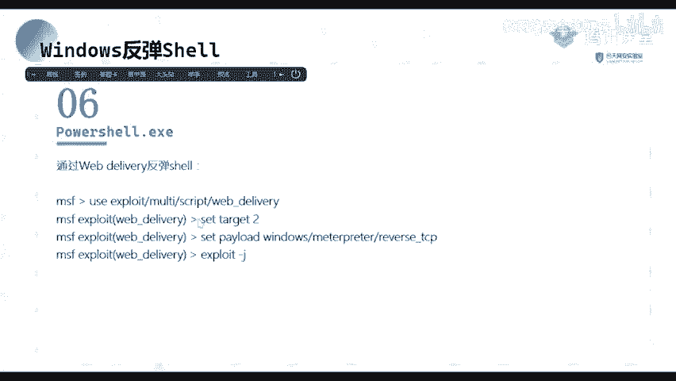

在这边的话，我们呃。可以看到在这边的一个。第第二个这个的话就是我们的一个能够去生成抛 share代码的这样子的一个模块。我们。食太。我们s就是这个tart where。

也就是我们选择我们生成的这样子的一个呃脚本的话是一个power share的一个脚本。然后的话我们需要修改啊。啊，不需要。因为抛下的话，它同样都是windows下面的，所以说在这边的话。

只要是N windowsdows下面的这种配load的话，我们都能够去进行一个使用。所以说在这边的话，我直接就使用这里的一个啊我这边改个端口吧。说。7777。然的话。这边 exploit。来去执行。

之前的话，它就会在本地今天这样子一个端口嘛，就等待呃这里的一个脚本的一个连接的一个请求。然后在这边的话，它就会生成这样子的一个po share的一个。

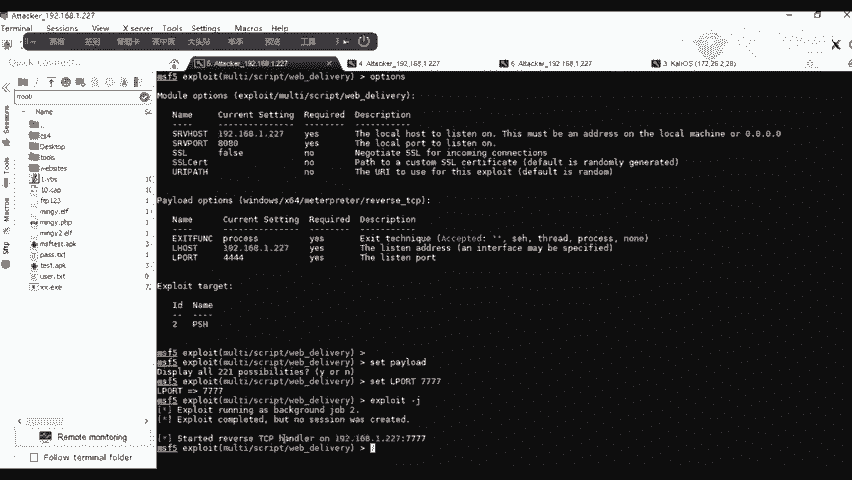

脚本。然后这个脚本的话，其实呃我们就能够直接的在我们的一个命令函当中去进行一个执行，来达到一个反弹需要的一个目的。

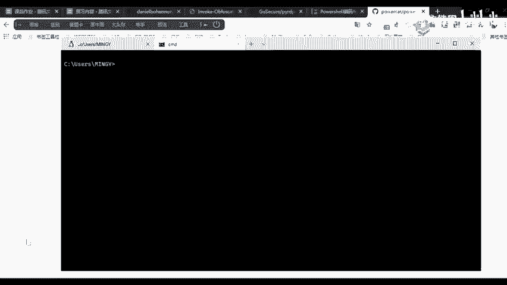

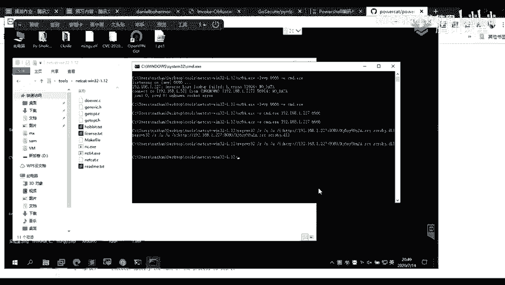

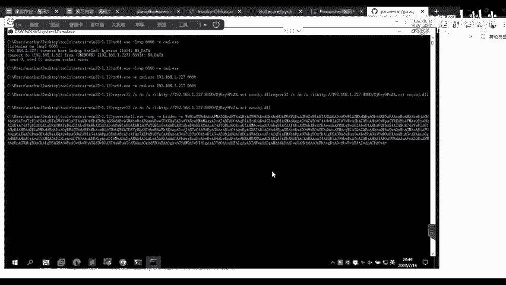

我们这边执行之后的话，它就是那窗口它会自动关闭。因为呃它这一个代码里面的话有去有写，就是有一个干W的一个参数，对吧？

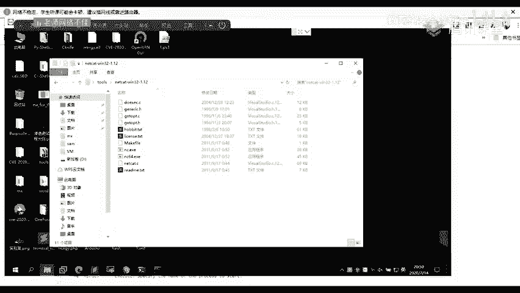

就它会隐藏隐藏你的一个窗口。然后在这边的话，我们可以看到在这边它有这样子的两个请求。首先第一个的话，他就是会去请求我们这边的这样子的一个UR地址，对吧？然后这一个要地址的话，它是这样子的。

就是这一个这里的话就是一个啊抛弃来的一个加载的一个代码。然后的话呃加载的话，他会去。请求我们这边的就是这边解码之后的话，其实就是一串po share的一个代码嘛。然后这里的一个代码的话。

就是我们的一个po share的一个反 share的一个代码。然后的话它就会。请求我们这边今天的一个7器端口来建立这样子的一个邻聚。然，在这边的话，我们就能反弹回来一个筛选7。对啊。嗯。同一个。

Yeah。而大家能够。大家觉得网网络卡吗？我这边的话显示说网络不稳定。

应该不卡吧。哦，好的。然后这边的话就是通过这个power share的这样子的一个方法来去反弹一个he。

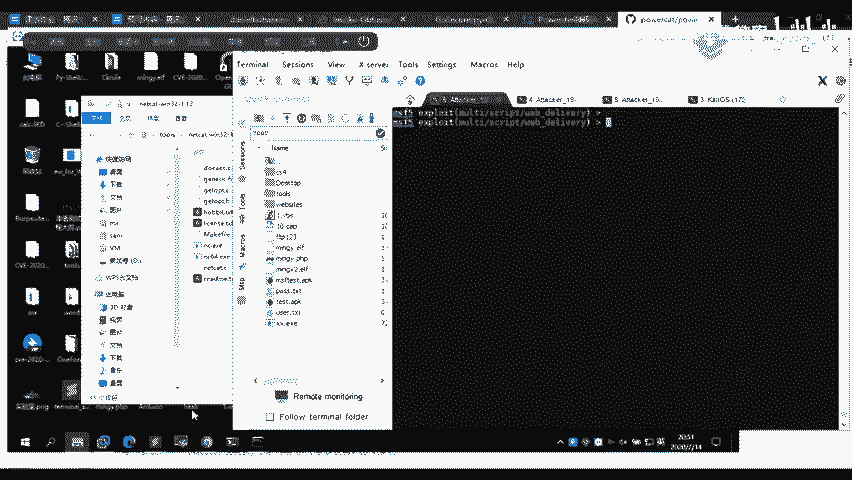

然后他使用的是这个web deliverver的这样子的一个模块。然后在这边的话。诶。在这边的话，我们来就是对他做一个。啊，我们先把后面的介绍完吧。

后面的话就是呃第一个的话就是通过这个power share来去启动这个我们前面所说的这个sS这一个程序。然后主要的话前面的话就是我们生成这样这样子那个VBS嘛，对吧？

然后的话我们可以通过power share来去加载。然后加载的话就是我们首先po在这边的话，可以看到它是先下载了这样子的1个VBS的一个文件。然后的话把它存到了一个time目录下面。

然后我们再通过start process。这个的话是po share里面它自带的这样子一个方法，能够去启动一个程序的一个进程。就其实就是启动程序嘛，就是这里边启动了一个程序的话。

就是这一个呃st32下面的这一个用这个CS script来去解释执行我们这里的1个VBS的一个代码。来去反谈一个cel。这边的话其实跟前面的话是类似的，好像WSF，还有GS。人能这种代码。

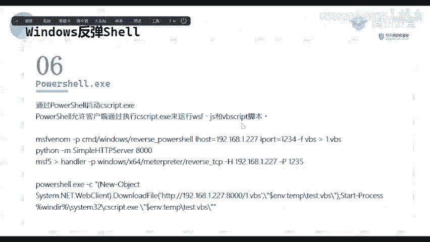

然后这边的话呃。

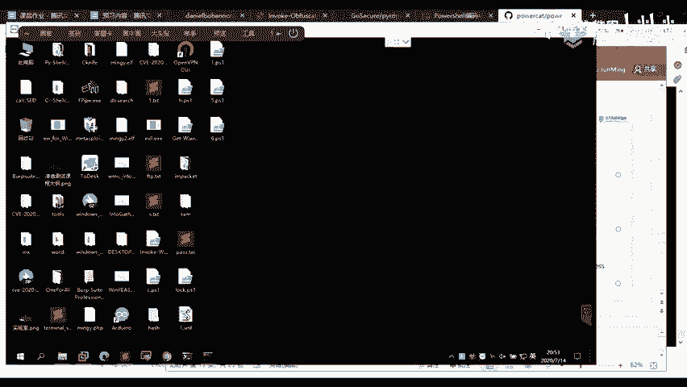

关于这个WSFWSF的话，其实他跟VBS啊，不，他跟那个。BBS是。呃，类似的就是说他也是他你生成的这样子一个文件的话。

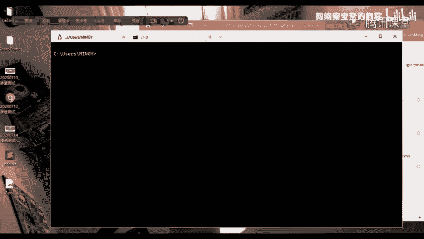

我看一下。呃，就像这样。

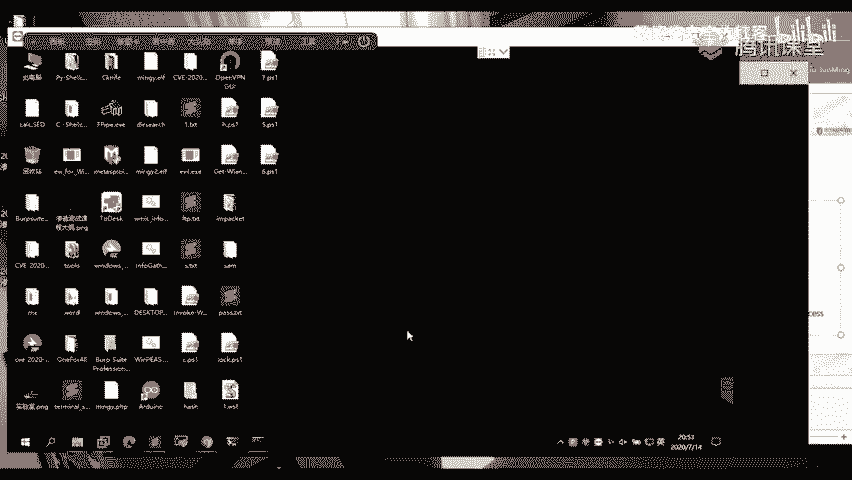

就这边我们可以通过MSF来去生成这样子1个WSF的一个文件。但是的话不是去直接的，就是MSF里面它没有直接的生成这样子的一个文啊文件的。这样子的一个文件格式。我这么卡呀？晚。电脑卡了。啊。

这这边的话其实我们呃生成这样1个WSF的一个文件的话，它其实跟VBS它的一个效果的话是一样的。就我们如果是生成了1个VBS的一个脚本，我们同样的能够去直接的双击运行，对吧？

以及我们可以通过直接命令行去打开这样子一个文件。然后他同样的都会去调用这样子的一个，就前面说的这1个CS script来去解释执行。然后生成这样子的1个WSF文件的话，主要的话就是在这边。

就是加这样子的一个头。以及尾。然后的话中间的话它就是一个啊中间的话就是我们生成的这样子的1个VBS的一个代码。然后的话他这里同样的可以通过这个啊。

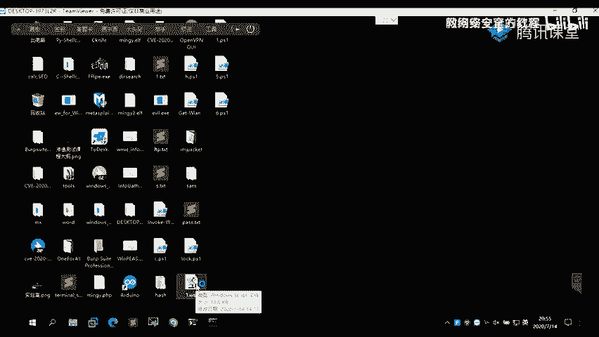

我这边。我这边忘了我这边今天的端口是什么了，就是我们同样的可以执行他，然后的话去呃反弹效。

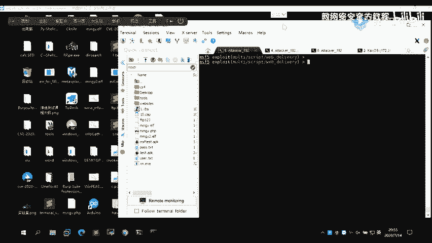

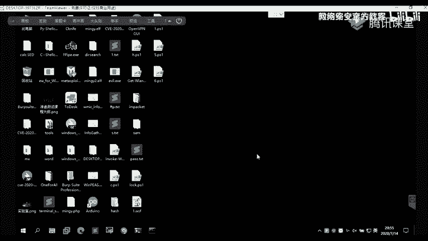

然后的话呃。就是通过po来去启动1个BAT的一个文件攻击。呃，这一个的话。都是类似的一个方法。就。啊。它的一个不同的话就是使用part来去进行一个加载。

就跟前面的话跟前面我们直接其实我们直接通过MF来去生成这样子的一个文件，然后的话传到目标机上面去执行。它其实是一样的一个效果。然后在这边的话。

我们通过抛尔的一个方法来去进行一个远程的加载来去进行一个就是没有文件地来的一个方法来去加载。然后的话我们在针对抛尔的这种方法的话，我们有相应的这种杀的以及呃绕过沙轮的一些方法。嗯。

然后第七个的话就是这一个呃。好，再讲第七个的时候，我们来回看一下前面的这个。就这一个螃蟹。在这边的话呃给大家做一个扩展，就是。对于抛蟹尔的一个就是泯杀混淆的一个方法。主要的话会去使用到这这样子的一个。

这样子的一个工具，这工具的话是一个p的一个混淆工具。呃，在就是呃很有名的一个工具啊，就是呃APD组织它也有。呃，那个什么蓝莲花还是海莲花来着？APP35还是39那个组织。

他经常去使用这样子的一个工具来做一个pa的一个混淆。然后它的一个效果的话是比较好的呀。就是说我们的呃我们可以通过它的这一个工具来去自动化的去混淆我们的一个p下代码，来达到一个绕过沙网的一个目的。然。

在这边的话，我们以这里的一个。以我这边一个啊MSF生成的这样子一个访谈需要的一个代码为例。

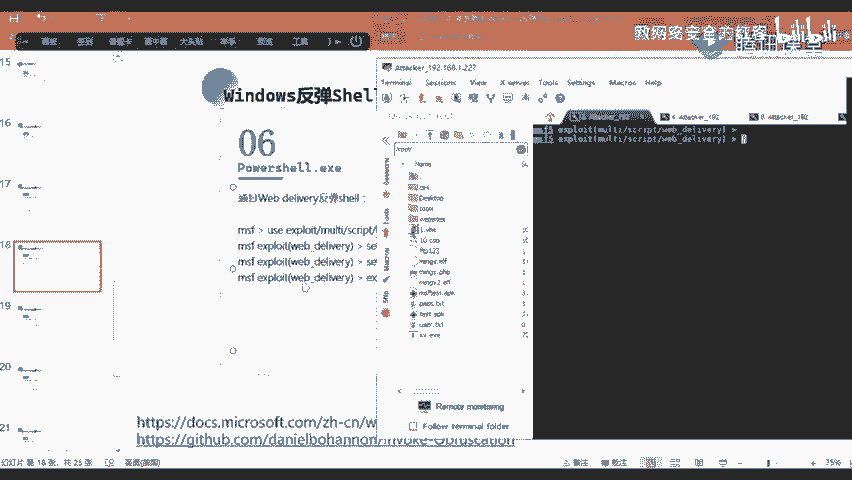

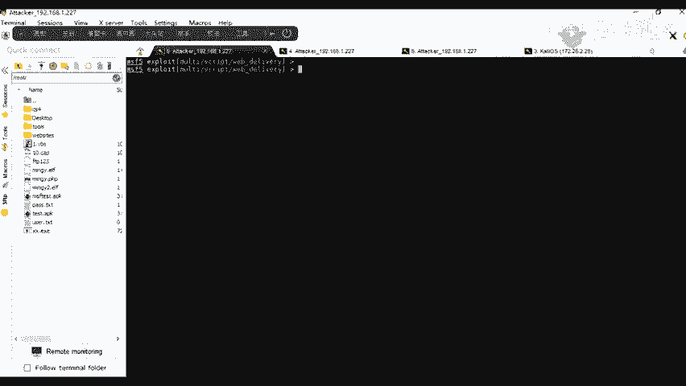

啊，我这边的话这边的机器的话已经有下载了这样子的一个工具。其实他就是一个一些一个脚本。他同样的是抛弃尔，通过抛弃尔的切尔的一个方式来去行一个调，就是像这样子的一个方式呃。在嘛？

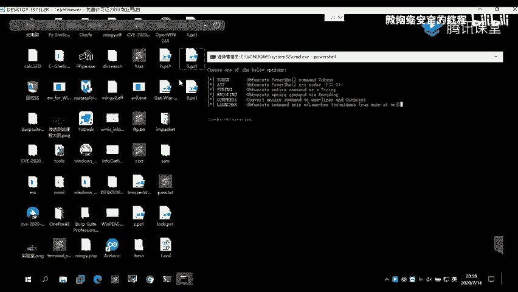

放哪去？好，在这。就下载之后的话，它是有这样子的一些脚本。然后主要的话就是这一个这两个。

啊我们要去打开的话，首先我们进入p。就入part说的我们通过import。model的一个方式来去加载这样子的一个模块，就是这一个。加载它的这样子的一个模块，加载之后的话。

我们就能够去调用它里面的一个方法。啊，调用它里面的一个函数啊，就这就是这样子的一个名字。就呃其实大家可以去就是打开啊。

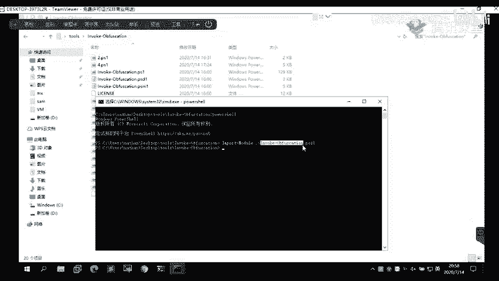

我们其实可以打开这样子的一个po下的一个文件。就如果大家不理解他的就它的一个代码，它怎么写的，它一个什么意思，对吧？就。这个大家先就不理解，没心没关系。因为这个东西的话其实。花雪的话还是比较。

比较复杂的，就是我是对他的这一个就是他的一个文件这种名字。停好等啦。然后但是的话刚开始的话挺头疼，后面的话，你其实用熟了的话，就是也挺好理解的。因为它的这种命名的话，它其实是有规律的。

这符合符合呃语法的一个关系。然后在这里的话，其实我们就看一下前面这里的一个functionction，对吧？functionction的话就是一个声明，就声明了这样子的一个呃函数。呃。

我不知道说函数准不准确啊。就是这样子的一个呃。东西吧，然后的话我们加载了这样子的一个呃。模块之后的话，我们就能够去调用这样子的一个functionction。然后前面这里的话都是就是注释。

这边这里的话就是包括他的一个使用的一个方法，以及他的一个描述。就这个脚本它什么对吧？以及还有的话就是一些例子，就是使用的一个例子。我们可以通过这样子的一个。方法来去使用它。然后下面的话就是一些代码。

代码的话。呃，代码的话太难懂了。大家先知道怎么用就可以了。

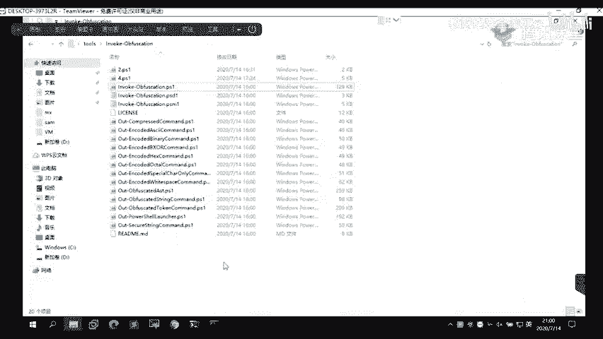

呃。然后的话我们直接来去调用。

这样子的一个函数。就能够启动这样子的一个工具。启动之后的话就是。界面还是挺酷炫的。然后就是这样子的一个。命令函的一个形式，然后它的一个使用的话。他一个使用的话嗯。

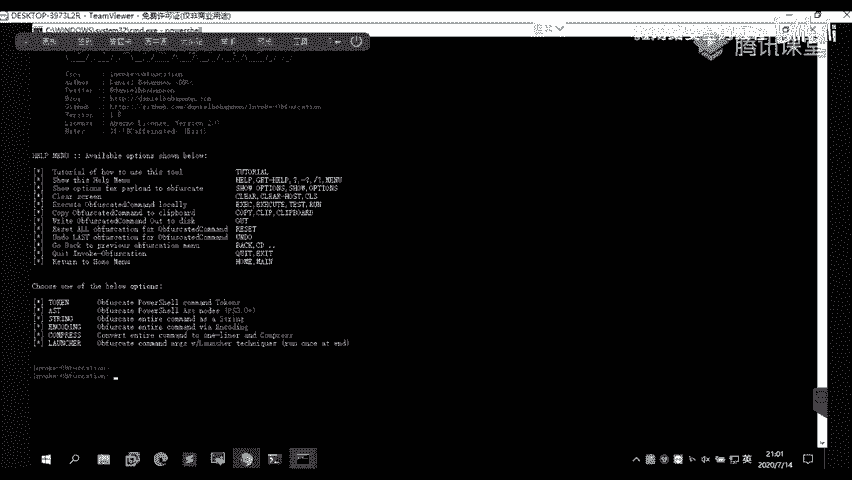

大家看一下我这边。以致吧。我把它放到这里了。这种笔记的话呃就是它的一个基本的一个使用，其实就是。你懂英文的话就很使用的话是很容易的。就使用的话，首先第一个的话。

我们需要设置我们要混淆的一个po share代码的一个位置，就是设置我们要去混淆的一个po share的一个代码嘛，对吧？然后它可以通过这样子子的三种方式。嗯，首先前面两种的话是通过脚本的一个位置。

就它可以通过加载，就说去远程的就是。呃，通过设置我们那个呃要地址来远程的去加载它的这样子的一个脚本。然后的话我们也可以设置我们的一个呃就是物理的物理地址，我们磁盘上面的一个路径。

然后的话我们也可以通过就是说通过这一个script。这样子的一个呃。参数来设置，就是说后面的话接我们要去混淆的这样子的一个po share的一个代码。然后然后的话就是。呃。

然后的话就是他有很多的这样子的一个。在哪就是后面的这里它有很还有这几个选项，这且这几个选项的话，它的一个意思的话不一样。就是他的一个混淆的一一个方法，它是不一样的。就呃我就不一一的去介绍了。Okay。

这边的话。写的还是比较详细了。

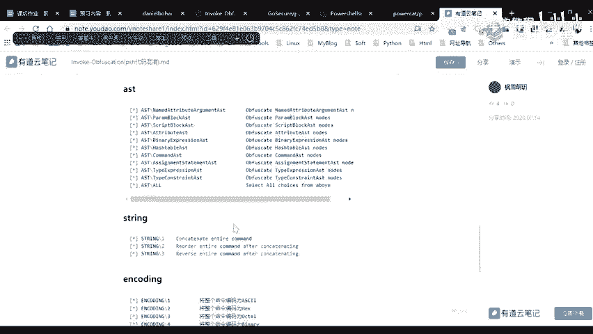

然后我这边的话就大概演示演示一下吧。呃。在哪里？


我之前生成的那个脚本哪去了？


稍等一下，我找一下我那个。Yeah。哎嗯就节省时间我就不。去重新生成了。哎，我之前的话已经试过了。


有了。


首先我们需要设置我们的一个script。的一个路径路径的话，我这边的话就设置我的这样子一个物理路径，你也可以设置，就是说啊要地址，还有的话你可以直接把代码拷到这里来。

然后这这里的话它就不是使用这一个pa。又卡了吗？啊，这里写错了PAATH。然后这边的话已经设置成功了，设置成功之后的话，我们可以呃。然后的话我们选择一个混淆的一个方式。我这边的话就随便选一个。

就是这个第一个token。我们输入一个token的话，他这边有这样子的一些方法，就是像我们的就是把它混淆就是。把它以字符串的一个形式，还有命令的一个形式，还有呃其他的一些形式。的一个混淆。

然后我这边的话就直接选择or。就是他是就是选择所有的这样子的一个混淆方式，但是它是一个随机的，就随机去选择上面的这样子的一个混淆方式。然后选择第一个这边的话就只有一个嘛。

然后我们在这边的话就生成了这样子的一个呃混淆之后的一个代码，这里的混淆之后的一个代码啊，它其实我们从这边也能够看出来，它其实就是把我们的一个这边。


啊，就是这样。其实就是把我们这边的一个p代码，他对这样子的一些关键字做了一个混淆，对吧？


我们其实可以看一下。前面的话就是我们可以做一个组合，组合的话能够把它组合成一个抛线，然后就是杠NOP这样一个参数，对吧？然后这里边的话就是呃。拍的，然后在这边它我们可以看到他这边的话其实就是一个顺序啊。

要他打颠倒了一下顺序，210，对吧？就是HI。h的他的这样子的一个呃顺序做了一个颠倒。然后的话我们可以通过这样子的一个方式来组合。组合之后的话就是杠Wh的嘛，对吧？然后杠一杠一后面的话就同理的。

他把我们的一个代码，它做了一个分块，就每一块的话，它有这样子一个编号。然后的话以这里的一个编号的一个顺序做了一个。呃，就是像做了一个加密对吧？就是分块的一个加密嘛。然后的话按这边的一个方法来做一个组合。

组合之后的话就是存了我们前面的一个po share的一个代码。然后在这边的话，我们可以通过呃。通过out out的一个方式。Outer。


outt123点PS1，然后的话我们就它会自动的把我们这边生成的这样子的一个代码，把它给保存到这样子的一个路径下面。这就是我们这边。就当前路径下面123点PS1。然后这边的话就是它的一个内容。

然后这里的一个内容的话，我们怎么去进行一个。执行呢。我们执行的话，我们只需要把这样子的一个文件，这就这一个文件的话，我们可以通过。呃，donload fire的一个形式。

把它给就是通过p share的p share的一个脚本形式，把它给下载到我们的一个目标机器上面，对吧？然后的话我们再通过p share来去进行一个加载。


这边的话就是这一个就生成了这一个。然后我这边的话就直接在命令行上面去进行一个操作。然后直接power下。然后呃就是杠F杠F参数的话，就是指定我们要去加载执行的这样子的一个呃PS的一个脚本。

昨两话一23点。


吔屎嗯。


嗯。看一下。Jos。


我忘记之前。今天的是什么呢？


我用这一个吧。那我之前的生成的那一个代码的话。我忘了是今天的哪一个端口了。


所以说这边执行的话，他。没有反应。本来的话他是会生反弹一个需回来的。


好。电脑有点卡呀，总是延迟。


那么卡呢。Oh。


不想做的话。


我们可以看到刚刚呃之行之后的话，他这边立马的话就呃有了这样子的一个连接，对吧？哦，稍微等等一下。


等那之后的话，他在这边的话就建了一个连接。返回了这样子的一个呃。筛选。筛选八对吧？是这个。然后在这边的话，我们呃因为在这边，我其实为了就是为了演示这这一些方便。


因为你不可能每一个都一一的去做一个免杀，然后的话再给大家演示。我以在这这边的话。我其实把杀网的话都是关掉了。


好这边的话，我开1个360吧。


电脑好卡呀。And。嗯，没起来吗？嗯。球来了吗？


这边的话已经起来了，然后的话我在这边。


可以看一下，我在这边的话。首先在这边的话，它是没有混淆的。我们打开看一下，它是没有混淆的这样子的一个po的一个代码，对吧？然后我在这边的话，直接通过po share来去进行一个加载的话。

它其实是会被拦截的。差一点不。米谂吗？

嗯，怎么没蓝啊？


我再试一下，按你说会蓝的呀。啊，然后可以看到在这边的话，我之前的话，他这边的话有这样子的，就是他说。发现了一个木马，对吧？就是说他检测到了我们这边的一个这样的一个程序，它是不允许去访问的。对。但是在的。

对。但是在这边，他怎么弹回来一个又弹回来一个筛选。🤧嗯。😊，有。第一次没拿他。好，我们再尝试一下我们经过混淆之后的。


就在这边。分享之后的话，我们直接poure。


三一点 p。


然后我们这边执行之后的话。没看到在这边的话，他。没有反应啊，然后我们可以看一下我这边的一个机器。这边的一个机器的话，他在这边的话，稍微等一下，它会反弹回一个需要。你看到在这边的话。

已经顺利的弹反弹回来一个筛选时。然后我们在这边的一个呃就是有360的这一个机器上面的话，执行的话它是没有拦截的。然后这里的一个代码的话，它是用这样子的一个工具。就是他的一个混淆的一个工具，做了一个混淆。

然后的话成功的能够成功的绕过这样子的1个360的1个警测。这个的话就是呃给大家介绍一下，就是大家在用使用这样子的一个power的一个方式来去访he，或者是说呃做其他的像呃文件的一个上传下载。

以及加载我们的一个呃其他的一这样子的一些脚本程序的话，呃，尝可以尝试去使用这样子的一个混淆工具。就不不需不不要说就就不用自己再去啊想各种混淆的这样子的一个方法。他这边的一个工具的话是呃比较好用的。

以及最后的第八个的话就是MSF的其他的这样子的一个生成的一个。呃，格式。就呃。在这边的话，其实。呃，大部分都是使用的这样子的一个用利用的MSSF它自己的这样子的一个生成的这种配漏的比生成的这种呃攻击载合。

然后的话其实还有像CSS对吧？也是跟，它其实也是一样的。然后呃。这边的话我就不一一的说了。然后呃使用的一个方式的话，其实就是跟前面是一样的。啊，这里的话其实重复了。我没我没注意看。呃。

这里的话其实就是前面的这一个。啊，然后的话就是用抛弃的一个方式去进一个加载。也用po share尔的一个方式加载的话是很常见的一个方式。然后如果大家对这个趴蟹不是很了解的话，建议大家去呃学习一下。然。

以上的话就是我们本节课的一个内容。然后这边的话就是part share的一个把他下。然，第七个的话就是这个MSI的1个EE呃，这个的话其实跟前面也是一样的。就是其实这边呃其实windows的话。

它的这种反西尔的一个方式的话，都是利用的它的这样子的它自带的这样子的一个程序。而这一些程序的话，我们能够去就是说能够去直接的去利用它来去执行我们自己的这样子的一个木马，来去访塔西尔。

而不是说而不要说我们需要自己去上传这样子的一个这样子的一些解释执行的这样子的一个程序。然后的话来去执行我们的一个木马。所以说在这边的话，MSI这一个的话，我们呃它是一个就是。

一个windows的一个安装引擎啊，然后像这种MSI的一个安装包的话，大家应该也有使用过吧，对吧？就是微软的它自己的话呃，它自己的这种软件的一个安装包的话，它的一个格式就使用的这样子的MSI。

然后我们同样的跟EX1样，就是直接双击之后的话，它就会自己的去进行一个安装。然后它这边安装的话，这种安装包它是会去调用这样子的一个程序去进行一个解释执行的。所是说在这边的话，我们就能够去。

通过生成这样子的一个恶意的一个MSI的这种安装包的文件。然后的话用它的这样子的一个程序去进行一个执行。执行之后的话能够顺利的反弹一个ll给我们。

