# 2024网络安全系统教程！清华大佬花159小时讲完的网络安全系统课！别再盲目自学了，学完即可就业！零基础入门网络安全！（渗透测试／漏洞挖掘／CTF／黑客技术） - P63：50.linux反弹shell.mp4 - 教网络安全的红客 - BV1ft421A7Nj

🤧。呃，关于反弹需以及正一呃，关于什么是正向需，以及什么是反向需。呃，上节课的话已经讲过了，在这边的话就不再赘述了。我们直接开始我们今天的一个主要内容，就是linux访弹线。

首先第一个的话同样的还是NCNC的话，这个工具呃，就是说在windows以及ux啊系统上面都是能够去支持的这样子的一个工具。然后这个工具的话呃，在呃windows以及ux上面它的一个不同的地方的话。

就是在于这里的干一参数后面指定的一个的一个环境。在windows上面的话，它的一个呃需的话就是一个CMD对吧？然后在linux下面的话就是像变SH。

还有等等的这种linux下面它默认的就有的这这样子的一个。一个需要环境。然后它的一个正向效以及反向需，它的一个呃。怎么去进行一个。啊，操作的话跟windows是一样的。他的一个原理也是一样的。

然后在linux这边的话呃。前面这里的话，我们可以发现就是说。NC它去反弹谢尔的话，它有一个很重要的一个参数，它必须要有这样子的一个杠一的一个选项，对吧？

因为我们杠一后面的话需要接一个我们的一个可执行程序。然后我们想要去得到一个C尔的话，就需要去指定我们的一个呃谢尔的一个环境。然后的话有存在这样子的一些情况。

就是说我们的1个NC它是没有这样子的一个杠一参数，对吧？有的有的一个版本的NC的话，它是没有这样子的一个干衣参数的。因为这个参数的话，它是比较危险的对。然后呃在没有这样子的一个一个杠一参数的情况下面。

我们可以通过什么样的方法来去反弹需要呢？我们。看一下这里。就说没有这一个概念参数的话，我们同样的可以使用这样子的一些一个方法来去进行一个呃。把他线。然，首先的话我们看一下呃，先大概来理解一下这条命令。

这条命令的话呃，看一下这里的一个文字。文字的话就是对他的一个基本的一个描述。这边主要的话就是涉及到了这个MKFIFO。这样子的一个命令。这个命令的话，它是创建了一个命名管道。呃。

大家应该有去看我这边的一个。预习内容吧。然后在这边的一个预习内容的话，我呃这边给了大家几篇文章，就是这一个。inux的1个MKFI的一个命令的一个基本与剧本基本的一个用法。就这篇文章。

它这里的话对这一个命令它的一个使用做了一个很详细的一个介绍。啊，需要我带大家来去理解一下吗？就大家有预习的话，对这一个命令能理解吗？理解的话，在讨论区扣个一。讲一下。好了。讲一下的话，那么我们呃。

就看这篇文章吧。啊，这里的话其实大家自己去操作一下的话，就能够去比较好的理解。哦呃前面的话就是。可以看一下这里link的一个命令执行顺序。这一个命令执行顺序的话应该好理解。就是啊在link里面的话。

我们可以去顺序的执行多条命令。然后的话用分号去进行一个分隔。就是在我们呃。

我们多条命令的时候，比如。我这里。不卖。然后我可以用分分号，然后再加1个PWD对吧？就是这里的一个分化的话，它是能够去顺序的，就是去连接两个命令。然后的话顺序的去执行。首先执行第一个。

然后执行第二个对吧？

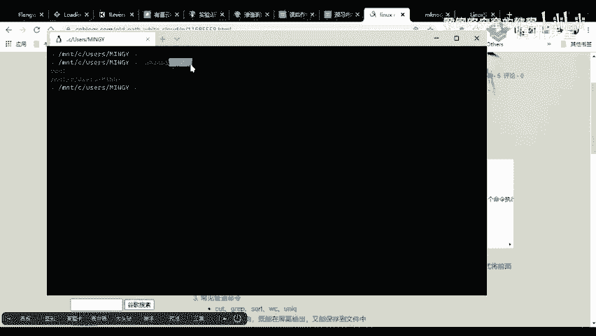

这里的话应该能理解。然后的话就是管道，这里的一个管道的话，它是一种通信机制，就是用于进程的一个通信，是linux里面的一个就是PIPE这样子的一个管道。

然后我们经常我们会经常使用的话就是通过sockstruct来去进行一个网络通信。我们的一个反弹sha的话，啊会去使用到这样的一s去进行一个网络通信来去反弹sha。嗯。😊，然后这里的话。

管道这一个命令的话，就是它仅能处理我们的这种STD outSTD out的话，什么意思呢？就是说标准输出。标准输出是什么呢？

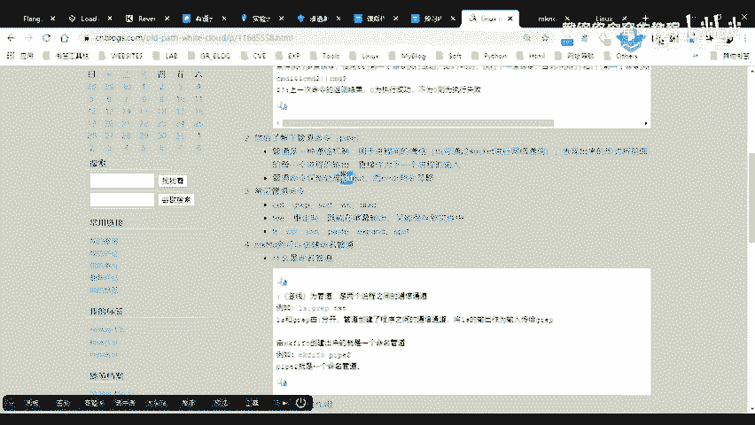

就是比如说我这边对吧？我执行一个换卖。这样子的一个命令，它是会输出在这里，对吧？root，然后的话我们的这里的一个标准输出的话，对于我们这边的话就是显示在我们的一个屏幕上面，对吧？

就是显示在这里的一个控制台。

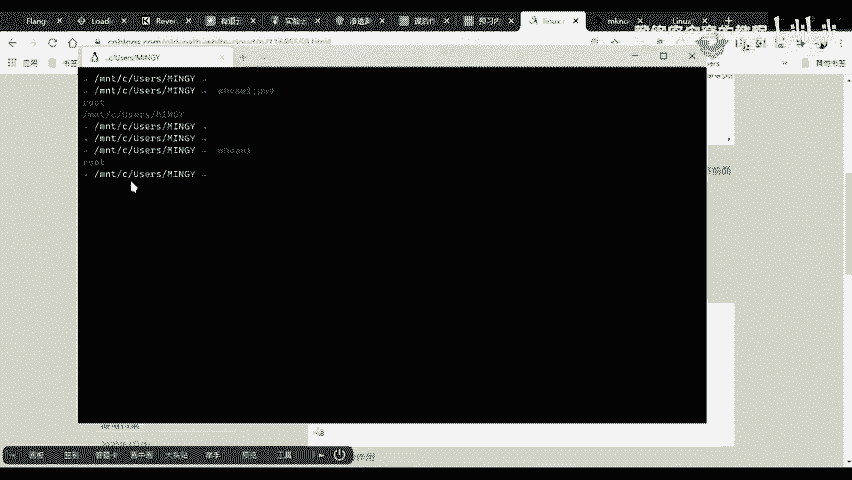

嗯。然后的话呃常见的一个管道命令，这里大家了解一下，这边主要的话就是介绍一下这1个MKFI。在这边。他这个命令的话就是创建一个命名管道。这里的话呃。我们。啊，直接用实力来那个吧。呃，对于这个管道理解吧。

就是说管道它的一个符号的话就是一个竖线，就在另史里面表示的话就是一个竖线。就是呃广道它的一个作用的话，就是把我们前面的这样子的一个命令作为呃前面这里的一个命令。

它的一个呃输出作为我们后面的一个命令的一个输入。然后这里你的一个M。诶。

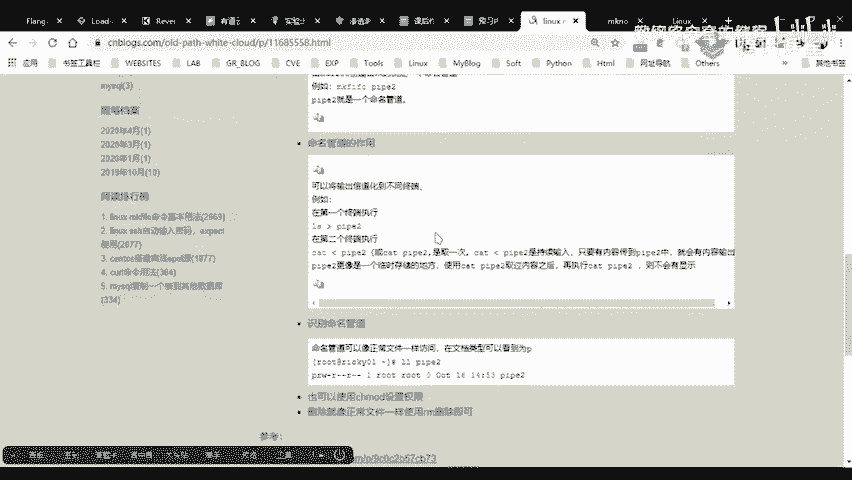

哦，用实力来。解释吧。比如说在这边我创建这样子的一个管道。创建广道的话MKFI，然后我一个tt对吧？

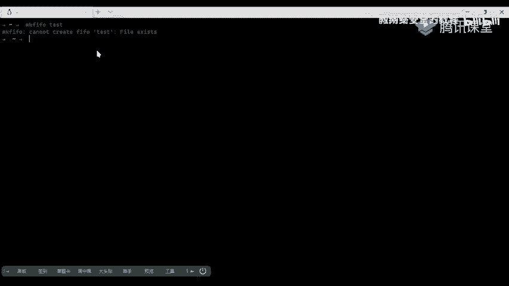

嗯。

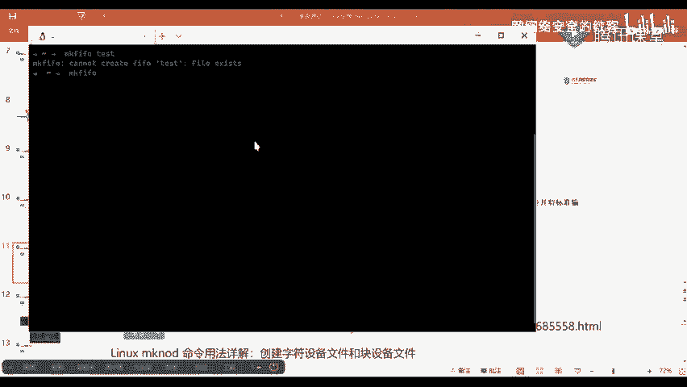

我就要创建一个。P就是名字为P的这样子的一个管道。然后我们来查看一下。这里的一个P这里的一个P的话，这个文件的话是我这边通过这1个MKFI命令所创建的对吧？然后这里的话要注意的一点的话。

它这边它的一个文件类型是一个P，也就是表示的是一个呃命名管道的一个意思。然后在这边的话可以看一下，就是如果对这里的一个linux文件类型，它你你不了解的话，可以看一下这里的一个文章。

这边的话它列举了就是说呃linkux当中常见的文件类型，有这样子的7种。然后的话有我们可以看一下这里有PP的话就是这里的1个PIP，也就是我们的一个命名管道文件。然后常见的话就是我们的一个干码。

就是文件。然后第的话就是目录。

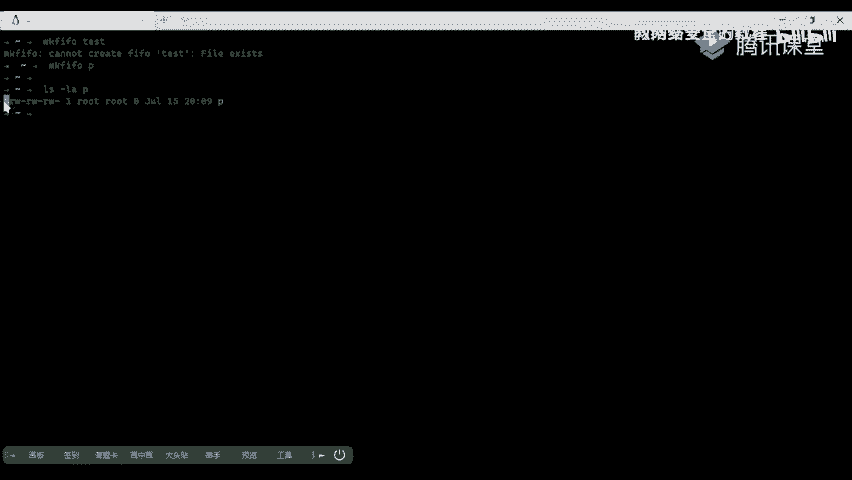

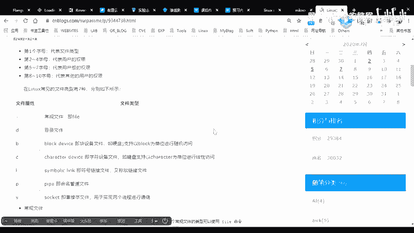

然后我这边的话创建了这样子这个P对吧？然后我通过LS。IOI执行命令执行的这一个命令的话，我通过这里这一个大于这里的一个监控哈，就大于号，对吧？它是一个重定向的一个意思。重定向是什么意思呢呃。

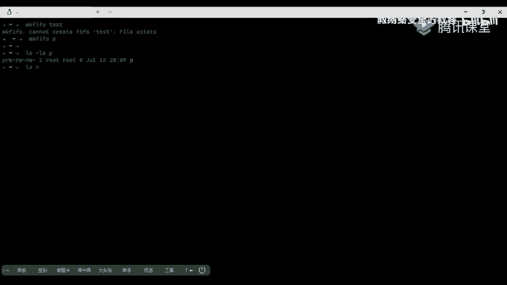

在这边。这里的一个文章。重电项的话，这里有两种就是呃有输入的一个重电项以及输出的一个重电项。有输入的话，就是从文件当中读取输入。就是我们从文件当中呃读取它的一个呃内容作为一个输入。而的话输出的话。

输出重电项的话就是将我们的呃输出保存到文件，或者是说呃指向一个呃在这边的话会有讲，就是有一个文件描述符。就是说把我们的一个输出，把它给重电向到我们这里的一个文件描述符。

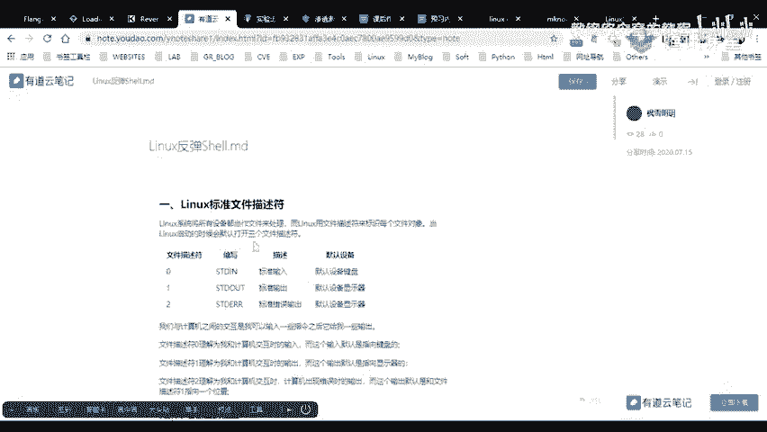

啊，我这边的话L指向这一个P。实像P之后的话呃。再窗帘。而我CATC我这边的话呃，这边L执行完之后嘛，对吧？我这边重新开一个，就是分开好理解。我这边L的话，它的一个内容的话传到了这里，对吧？

然后的话就是从电向了到了这里的一个文件。然后的话我们再可以通过呃cat cat的话就是查看嘛。然后其实我们要去呃我们可以直接去cat这一个文件。当当然的话我们可以通过就是这里的一个重定项。

就是输输入重定项。从我们的这里的一个P的一个文件当中，你把里面的一个内容读取出来，对吧？读取出来的话，作为这里的一个cat的一个输入，然后cat的话就是呃显示它的一个内容嘛。哦，这边的话要注意一点。呃。

因为我这边的话，他这边嗯。

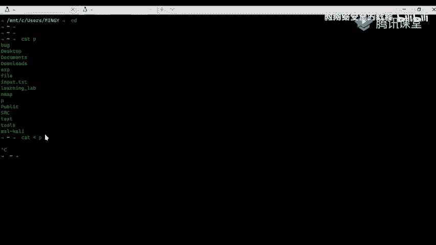

看一下这里。

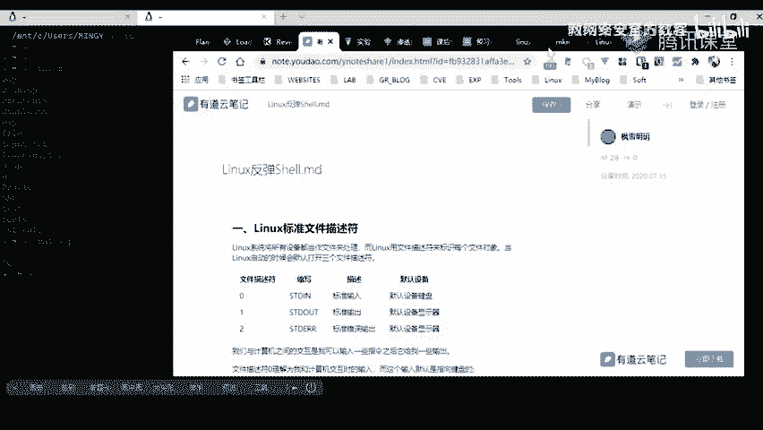

这这边的话注意一下，这边就是说。它这里的一个管道话，就像相当于是一个临时存储的一个地方。就如果你使用cat，你cat这一个命令，你就是读取完了它的一个内容之后的话，它就会你再去读取的话。

它就不会显示内容了。因为我这边的话已经读取了，对吧？所以的话它里面的内容已经没有了，不会显示了。我这边再执行一下。然后的话我再通过cat。

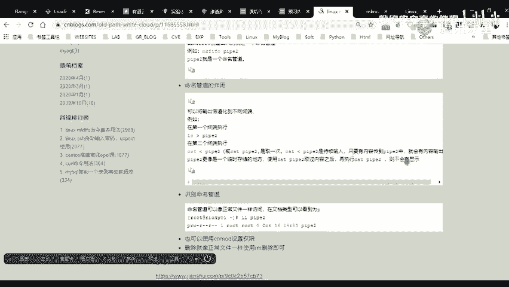

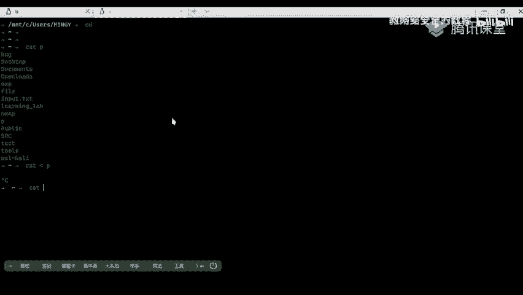

干P然后在这边的话就能够查看到，对吧？

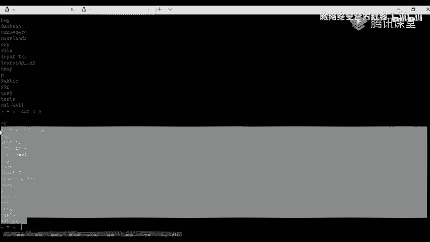

这里的话就是这个make。诶。创建一个命名管道，啊我们实际到这边的呃。

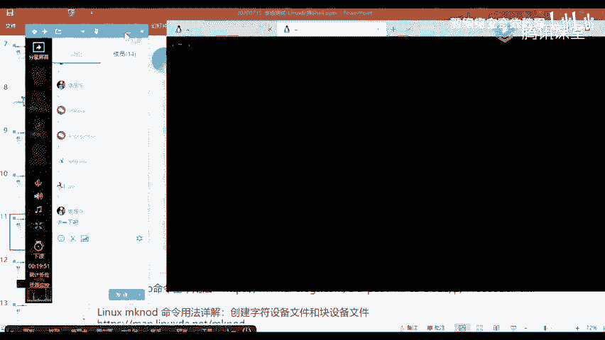

一个例子的话，我们来看一下。首先这边前面我们前面的话有知道就是说分开的话，就是呃顺序的去执行命令，对吧？我们首先的话它是执行RMRM的话就是删除嘛，删除t下面的一个F的一个文件。这边的话呃可加可不加。

但是呃就说如果说你t目录下面正好有这样子一个F文件，对吧？那么会影响后面的一个操作，然后的话就是加上。加上的话呃更好一点。

然后哦然后的话再通过这一个命令make of iPhone来创建这样子一个命名广道。创建的一个地方的话，在tamp目录。因为我们这边的话是要创建一个文件嘛。

所以说我们经常的话会在这一个tamp目录下面去进行一个创建。Yeah。然后的话呃在cat cat的话就是查看嘛，就是把我们这边的啊命名管道里面的内容读取出来。

然后的话呃这里的一个呃广道服广道服的话就是把前面的一个内容，对吧？把前面的一个内容作为一个输入，然后到这里来到这里来的话，就是编SHH就是我们的一个SH的一个需要环境。杠I的话就是呃。

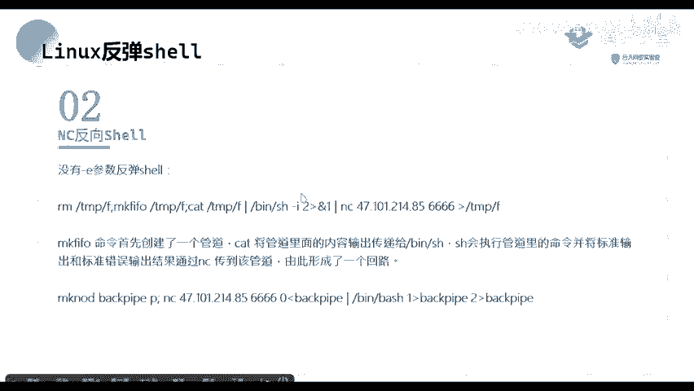

杠癌的话就是。啊。就是创建一个这样子的1个SHH的一个环境。呃，我这边操作一下。对。我们呃我这边的话先PS看一下，看一下我当前有这样子的几个啊有一个GSH的一个需要，对吧？

然后我再通过SH杠I来再创建这样子的一个呃。SSSHH的一个需要对吧？就是这样子的一个意思。当然的话我们也可以通过呃。Fsh。bach杠癌也是我们常用的对吧？

贝喜盖癌的话就是进入到了一个ba喜的一个命令环境。

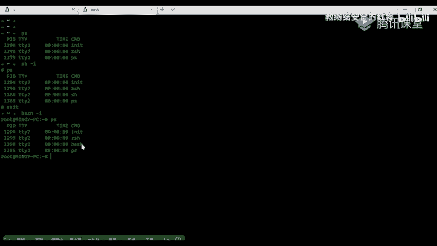

对吧。

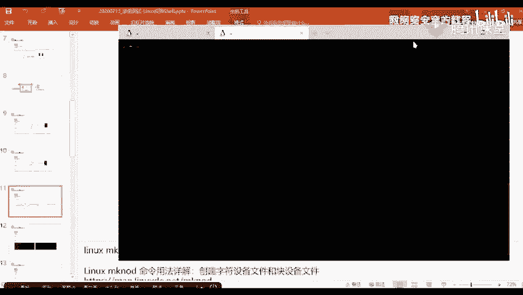

然后的话呃2杠等的一，这里的话就是。哦，讲这个之前还是得。还是得先讲一下这一个就这篇文章的一个内容。这里的一个文件描述符。其实在linux里面去反他歇尔的话，你反他歇尔的一个方法的话，其实都大同小异啊。

你只需要去了解，就是去理解这里的一个呃这里我在这篇文章的一个内容，就是说理解linux下面的一个这里的一个文件描述符。然后脑子里面有一个印象，就是我们的linux系统当中。

它所有的这种设备等等的东西它都是当做文件来处理的。就是linux里面是一切接文件。然后的话呃这里每一每一个文件的话，它命令时它会用这样子的一个文件描述符来标识每一个文件对象。

就说我们可以通过这样子的一个文件描述符来找到这样子的一个文件。然后在这边的话会有三个默认的文件描述符，就是当我们的一个lininux系统，它启动的时候。它启动的时候，它会默认打开三个文件描述符。

主要的话就是这三个就是0123个。然后分别的话，它的一个对应的一个意思的话就是零的话就是STD硬STD印的话就是标准输入。哦out的话就是标准输出ar的话就是标准错误输出。

他这边的话是有三个默认的文件描述符。然后这三个文件描述符，它默认的一个指向的一个设备，这个的话应该好理解，对吧？就我们再去命令行当中去输入去进行一个输入的话，它默认的就是从我们的一个镜盘当中。

对吧从我们的镜盘进行一个输入。然后的话输出的话就是输出在我们的一个显示器，或者是说控制台。然后输错误的一个输出的话，就是把我们的一个错误的一个信息。比如说我们的一个命令打错了，它会进行一个显示。

显示的话，它默认的也是显示在我们的一个设备显示器。也就是我们的一个命令啊控制台。嗯。这里的话大家能理解吗？

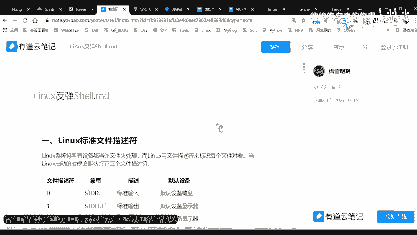

呃，我用我用命令，我在令时系统当中呃，分别来就是做一个解释吧。就呃默认的话，它是标准输入，对吧？标准输入，比如说我这边输入一个呃。acle123对吧？我这边输入的话是acle123。

我这我这边的一个输入的话，是从镜盘当中输入的对吧？然后的话它这边的一个文件描述符，它默认的话就是0。嗯呃。我这边呃 echo123之后的一个输出，也就是这里的1个123，对吧？就是一个标准的一个输出。

它的一个呃文件描述符法就是一。然后的话我随便输入一个字母，对吧？随便输入一个东西，他这边的话报错，他说不存在这样子一个命令，这边的话就是它的一个标准的一个错误的一个输出。

然后在这边的话呃，再分别来去就理解一下呃，这里的几个命令。在后面的反常小的，就是大家常见的这样子的一个反常西尔的命令的话，都会都会看到。然后在这边的话。呃，这边有这样子的一个。把他需有的一个。

命令的一个集合，就是他这边的话很全，就是他这边做的一个网页。然后的话嗯。是放在我是放在这里的一个预习内容当中，就是。这一个因此的。反拉西尔的一个命令大全，就是在这边的话。呃，他在呃像拜喜啊。

拜喜的话有这样子的一些方式能够去仿他校。嗯。他这边的话写的很详细了，然后的话呃在本节课也会一一的给大家做一个介绍。啊，我们继续。首先的话来看一下第一个就是更改标准的输出的一个位置。

这边更改标准输出的一个位置的话，其实就是呃更改我们的一个文件描述符所指向的一个位置，对吧？就我们默认的012这三个文件描述符的话，它都是有默认的指向的一个设备。

然后的话我们想要更改我们的一个输出的一个位置。我们知道输出的话就是标准输出啊，标准输出它的一个文件符的话就是一对吧？然后的话我们要更改，就是把我们的一个标准输出更改到某一个文件当中。比如说test文件。

然后的话在这在这里的话，我们要去把我们的一个标准输出。呃，从定向到我们的这里的一个test文件，所以的话需要用到这样子的一个重定向的一个符号。这里的话就是从我们呃。怎么说？就是把我们的一个标准输出。

就是啊。本来是从我们的一个啊显示器当中去显示的这样子的一个输出，把它给重电下到我们的一个test文件。所以的话就更改了它的一个输出位置嘛。然后在这边要去做这样子的一个更改的话。

需要用到这样子的一1个EXEC的一个命令。这一个命令的话，它在后面也会说到就是说我们要创建我们自己的一个文件描述符的话，就要去使用到这样子的1个EXEC的一个命令。

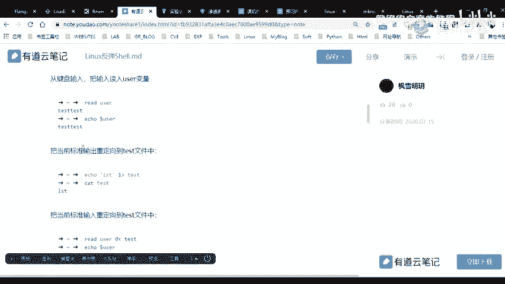

在这边我们来看一下。嗯。Yeah。哦好啊。这里的话是这一个文件的内容。

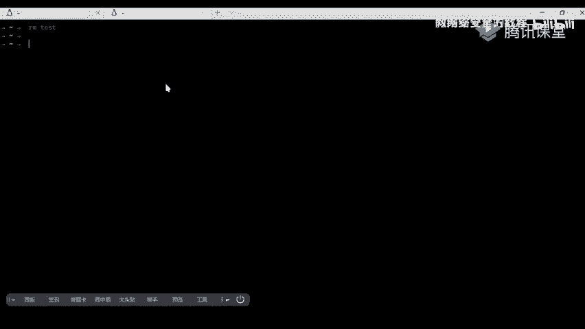

然后我这边的话来尝试一下。

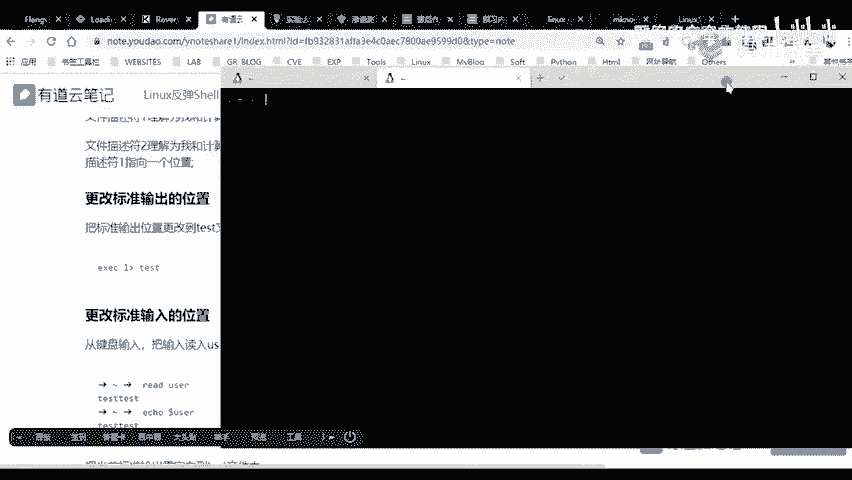

演示一下，就我EXEC，然后把我们的一个标准输入，就我默认的话是这样子的对吧？我I。哦，外卖执行这个面的话，它输出在这里的一个控制台，对吧？而我EXEC。一。把我们的一个标准输出。

把它给重淀向一个test文件当中。然后在这个时候的话，我们再去执行一个命令。我执行一个货外卖对吧？还有PWD呀，IP空fi。嗯。you不碰 big这种。然，我这边执行之后的话。

我们在这边呃重新在这边的一个项。S cat来查看一下这里的一个test文件的一个内容。啊，我们可以发现在这边的一个文件内容的话，就是我们在这边执行的一个命令的一个输出，对吧？

然后在这边本来是它会默认输出在这里的。我们通过这样子的一个啊输出的一个重定项，把它重定向到指定的文件。它这边执行的一个命令的话，它就会输出到指定的一个文件当中。对吧他没有他的一个内容没有在这里。

因为我们在这边的话只是从电向的。只是重定向的我们的一个标准的一个输出。就是说我们这边执行的一个正确的一个命令，它是正确的输出，对吧？然后我们这边执行的一个错误命令的话，它是会报错的。

这边的这种报错的信息的话，它是会给我们的一个标准的一个错误的一个输出。对吧然我们这边没有去重电下我们的一个错误输出的话，所以它会默认的它是输出在我们的一个呃显示器。

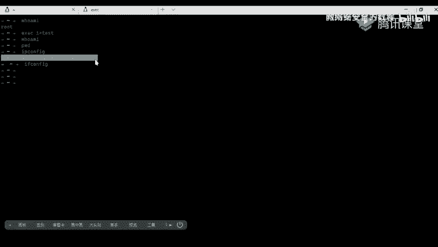

然后的话呃，更改标准输入的一个位置。前面的话是更改标准输出，对吧？更改这里的话更改标准的一个输入。标准输入的话，我们平常的一个输入就是通过键盘对吧？然后的话在我们要去更改我们的一个标准输入的话。

因为ins里面它一切只有文件，我们要从哪里去获取到我们的一个输入呢，对吧？那么我们可以查，我们可以就是我们的一个思路就是去文件当中去获取。

然后在这边的话就要讲到这个read命令。read的话就是呃你可以把它理解成一个创建一个这样子的一个并量。我啊。对的右的。又创建了这样子一个read user的一个变量。然后在这边的话。

我们可以进行一个输出。好吧，进行一个就是输入。啊俾我。随便输一个。对吧然后在这里的话，我们可以通过ele来查看这里的一个user变量。变量的话是用这一个多了符号来去进行一个指指定。嗯。

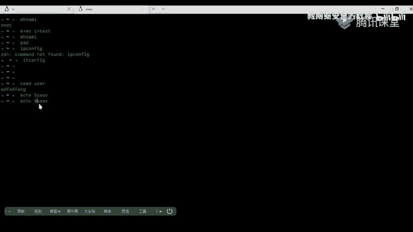

怎么没有呢？

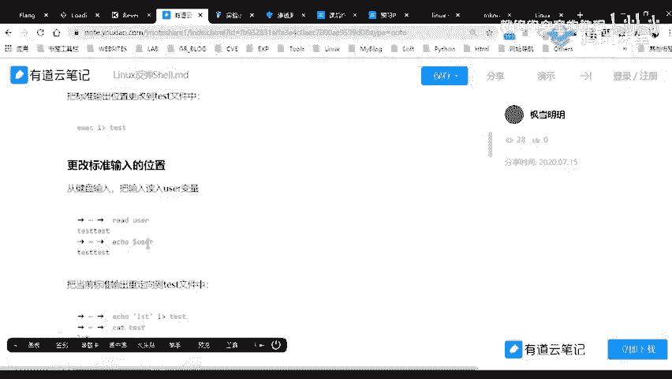

US1啊。哦，这边的话。哦，这边因为呃因为我这边上面的话，他还是把我们的一个标准的一个输出，就是重建下到这一个test文件，对吧？我们其实这边我们ge这一个t文件的话，你会看到在这边的话。

他会有这样子的一个输出，对吧？就说明的话是没有问题的。然后在这边的话，我退一下，我重新再开一个。找我 read的 user。然后我随便输入一串，然后我e这样子的一个变量。没看到在这边的话就是啊。

成成功的输出了这边。然后在这边的话就是把我们的一个输入，把它给传到了我们这边的一个变量当中。然后的话再去进行一个呃就是作为一个输入的一个源。

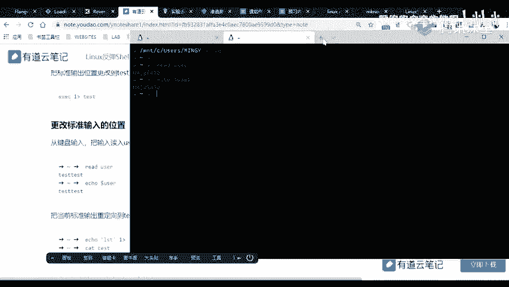

呃。还有的话就是把我们当前的一个标准输出从面向到一个test文件。那这边的话，其实跟前面的话是一样的，就是呃我们理解一下。啊，就是我这边apple执行这一个命令，对吧？执行之后的话，他。

本来是它会默认的输出到我们的一个呃控制台，我们的一个显示器。然后我这边的话通过一。啊，重定向就是把我们的一个标准输出，重定向到这个ts文件当中。比如说它不会在我们的一个显控制器啊。

在我们的一个显示器上面去显示。啊嗯。当前的一个标准输入，从电向到test文件当中。这边的话就是呃跟前面的话也是一样的。就标准输入的话，就是我们在这边从我们的一个tex文件当中。去读取。

然后的话把它作为一个标准的一个输入。好，在这边呃，我们知道零的话就是表示的我们的一个标准的一个输入，对吧？然后然后我们这边的一个小迂符号。呃，其实准确的说的话是那个输呃输入重定下，对吧？

就他这边的一个意思的话，就是把我们test文件当中的一个内容，把它给啊输入到我们的一个就是标准输入，作为我们的一个标准输入。然后的话。给到我们这边的一个read user这样子的一个。呃。

就是给到我们这边的一个优者变量。

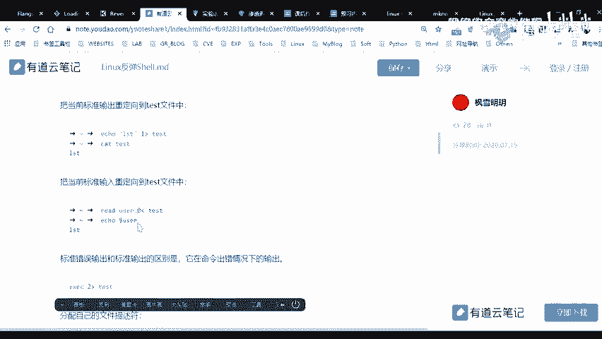

就其实就是相当于我们呃在这边对吧？我们在这边read user，然后的话输入的这里的一个内容。因为我这边的话呃，比如说我这边。那我这边一个tex的一个内容是这样对吧？然后的话，我耳币都有哒。嗯，点。

就是输入啊输输入从电向到我们的一个标准输入。就是从我们的一个test文件当中。然后的话我们这这里的一个test文件的话，作为输入，输入到了这一个us者变量当中，对吧？然后的话我们可以get。

还还输出这样子的一个变量。

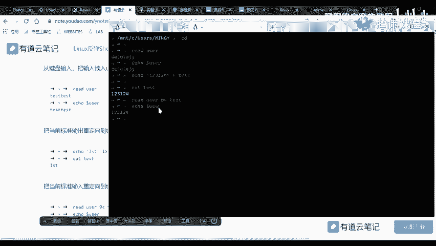

就是这样子的一个内容。呃，以及还有的话呃。这边的话就是标准的一个错误输出。前面的话我们通过这样子EX is一对吧？Ex。就是把我们的一个标准输输出，把它给做一个改变。

然后在这边二的话就是我们的一个标准的一个错误输出。然后的话我们把它作为一个重电项，重电向到我们指店的一个文件。

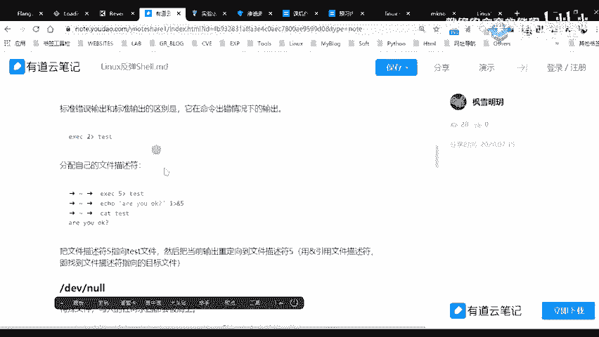

听样的话比如说我这边随便打一个这个，它不完的话，它还输出在空呃，我们的一个显示器对吧？然后在这里的话我。一二四。嗯。Next。啊，我这边我在输入，我再随便进行诶。我这里面哈我再随便的去进一个输入。

本来是会报错的这样子一个内容，对吧？它会显示在这边的。它有显示在显示器的，但是现在的话它没有没有显示。然后的话我们执行一个正常的一个命令，它是不受影响的。因为正常的一个命令，它执行之后的话。

它是会指向我们的一个标准输出，而不是错误的一个输出。然后在这里的话，我们来cat查看一下这一个test文件。在这边的话就是存储着我们。啊，刚刚的之前的一个错误的一个命令。

它的一个输出的一个结果就错误的一个输出。

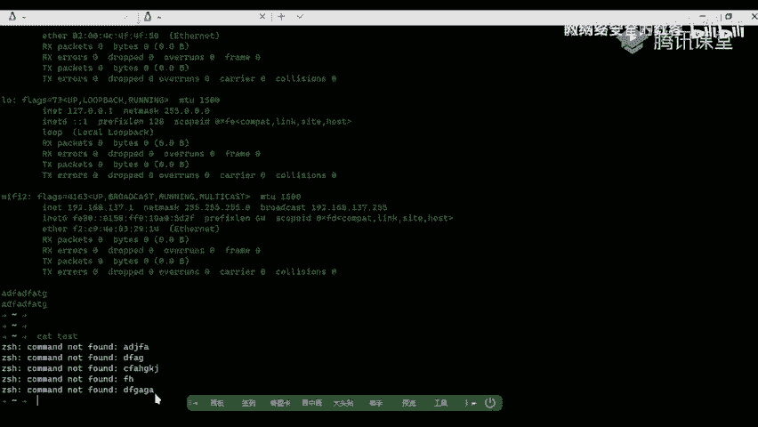

。

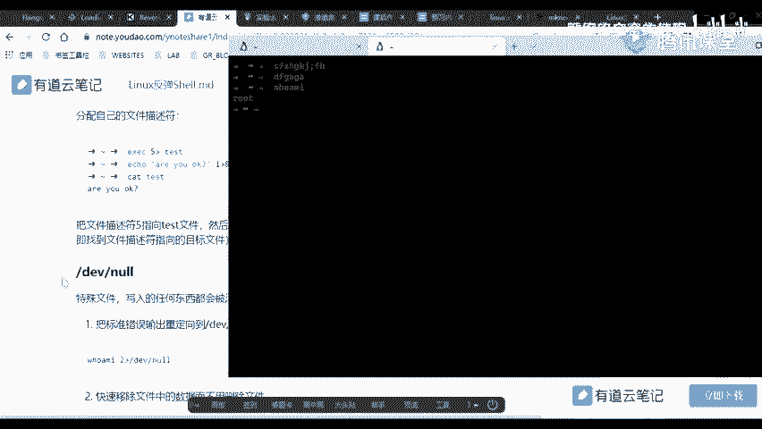

然后诶。这里的话就是分配我们自己的个文件描述符，主要的话就是理解这1个EXEC这一个命令。就我们可以通过这一个命令来去分配自己的一个文件描述。比如说这一个例子。

这一个例子的话就是我们呃首先EXEC来创建一个文件描述服务。对吧然后的话把它重定向，就指向我们的一个test文件。然后然后我们在这边的话。在ecle echole进行一个就是输输出这样子的一个内容。

把证里的一个内容。这一个输出把它给重电向到我们这一个文件描述服文件描述服务。然后这边我们要把我们这边的一个输出从变向到这一个文件的话，我们要这边要注意。因为我们这边输出的话是从我们的一个标准输出，对吧？

就是我们那个显示器当中。给一个内容。来输出到这里的一个文件描述服务。所以说我们在这边表示的话就是从这一个一这一个文件描述服。把他的一个内容把它给重定向到这个文件描述服务。也就是我们这边创建的这个。

对吧然后呃这边的一个文件描述符5的话要注意，就是说这里的一个and5的话，它这里的一个end符号是用引用文件描述符。它的一个意思的话就是我们通过这样子的一个and。

来找到这里的一个文件描述服务它所指向的一个文件。对吧其实就是一个引用，你就相当于这里的一个and5的话，就这一个5的话，就是这一个text文件的一个链接，就是我们的一个呃软链接，对吧？

然后的话我们我们要找到这一个文件描述符务所指向的一个具体的一个实际的。这一个ts文件的一个位置。那么我们需要用这一个end符号来去进行一个寻找。然后在这边的话。这边的一个意思的话。

就是把我们的这一个IOK对吧？就是我们的一个标准输入的一个内容，把它给重定向到我们指定的一个ts文件当中。啊，我们可以通过这样子的一个方法来去行一个表示。呃，讲到这里的话，大家能理解吗？大家能理解吗？

怎么定向回去呢？定向回去的话呃，因为我们这边对吧？我们这边的一个and5的话就是表示的这里的一个文件内容。那么我们如果说我们想要把这一个ts文件的一个内容，对吧？把它给重定向到其他的一个文件当中。

那么我们可以通过这个and的5符号来定位到这个文件，对吧？然后的话我们呃实际来。

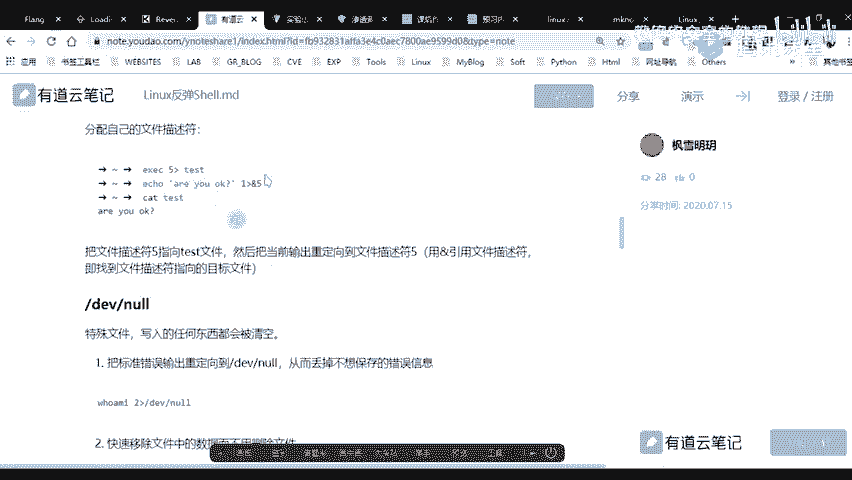

我先生成一个这样子的一个5的一个文件描述符指向test文件。然后的话呃我 echo。拨答你一。啊。然后的话我们来ca查看一下这个test文件，就存储了我们这里边的一个内容，对吧？没问题。

然后然后的话你想要从就是把这边的一个文件内容，把它给，就是说把texest文件当中读取出来。把它它里面的一个内容读取出来。我们同样的可以用这一个文件描述服务来去进行一个表示，对吧？

就是我等于就是说把我们这边的一个text文件里面的一个内容作为一个输入，来输输出到指定的一个文件当中，比如说我这边的话呃。That。我就直接catca，然后这一个。文件描述服务。

对我就这样子去进行一个表示。这边的话表示的一个意思的话，就是把我们这里的文件描述服务所指所呃引用的这样子的一个文件，也就是这一个t文件的内容，把它给用cat来做一个输出。还有。嗯。这样吗？

这描述符的那些内容给。Yeah。我是输出到这边了。B fire。不能这样子。哦，不行，不能这样子去进行一个。输入充电下。

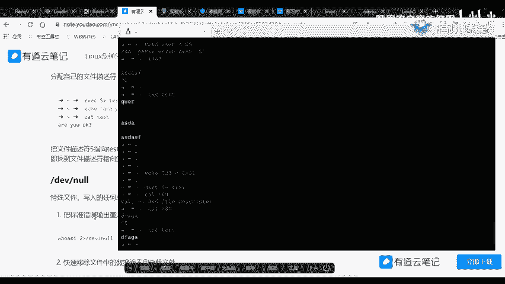

仲样说。😔，好，这个的话。

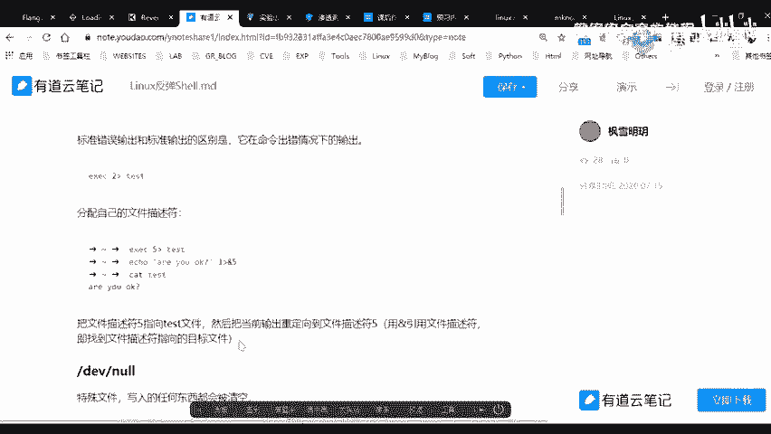

这个的话先放着吧。我课后再去。呃，弄一下。

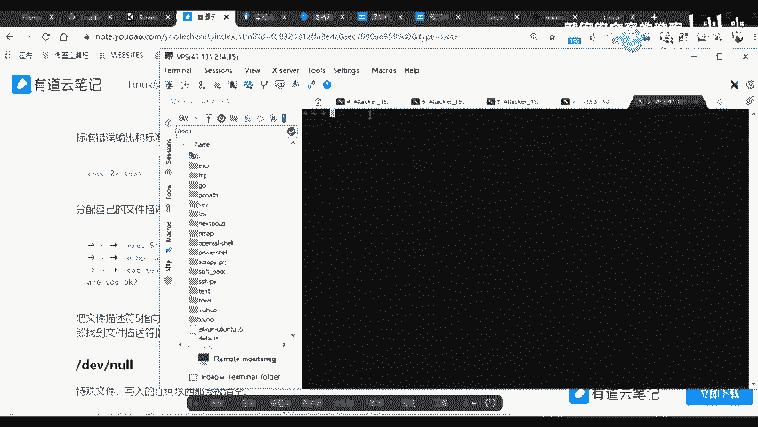

把我们那个标准。我们先讲后面的吧，先讲后面的。能输入，但是不能输出。😔，你想重不声。😔，我们先继续讲后面的呃，我们来看一下这边的一个DV的一个浪。这边的话呃这个的话就是一个特殊的一个文件。

就我们写入的任何东西它会被清空。就说我们可以把我们的一个呃就是比如说把我们的一个输出，把那个从电向到这个文件当中。那么我们的一个输出的话，它都会被清空，就不会显示在我们的一个显示器。

然后常用的话就是把我们的一个错误输出嘛。我们不想要我们的一个这种报错信息，所以的话我们会把我们的。一个标准的一个错误的一个输出，把它给重电向到我们的一个呃这这一个浪文件。呃。

还有的话我们可以通过这样的一个方法，就是通过cats。这一个那文件来重建向到我们的这一个指定的一个文件，就是说我们可以快速的去移除这一这里的一个texest文件里面的一个内容。然后的话不用去删除。

就是不用去删除这个文件，然后的话再去重新创建。然后第二个的话就是重电向。重电向的话前面也讲了呃，就是大家理解一下呃，它的一个意思。就是方向的话，其实这边呃它的一个符号的话应该比较好理解。

就是我们从它的一个方向能够去呃了解它的一个意思。像我们这边一个小于号，小于号，就是我们是从从右的往左，对吧？从右往左这边，然后的话我们一般的一个就是说输出输出的话，就是啊我们先理解输出吧。

就把我们的一个输出的一个内容，把它给啊输啊输出到保存到指定的一个文件。啊我们一般的一个输出我们的一个命令。比如说我们的一个换麦的一个命令，对吧？

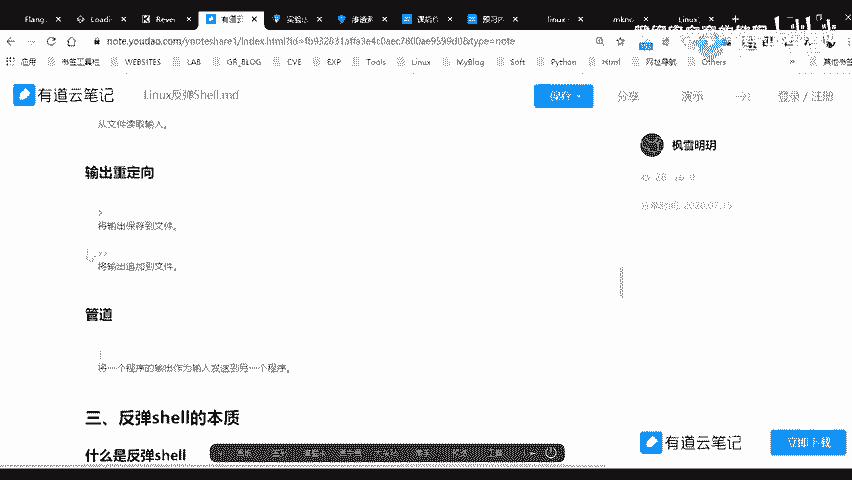

我们这一个命的话一般是在前面我们的一个前面的一个输出。然后的话就是输出的这个root，把它给重电向到一个呃文件当中，对吧？然后的话呃输入的话就是相反嘛，是吧？输入的话就是从我们的一个文件当中去读取。

就从我们的一个文件当中，把这一个文件的一个内容把它给呃。读取出来。然后在这边。呃。就刚刚的那个文件描述符的这一个。在这里这一点的话，我确实还没搞明白，就是在这边的话。

从文件当中去进行一个作为一个输入的话是完全没问题的。然后使用文件描述符的一个形式的话，在这边的话，他说的是就是不能够去使用这样子一个就是啊bad filescript嘛，就是bad的一个文件描述符嘛。

就不能用这样的一个形式来进行一个输出。

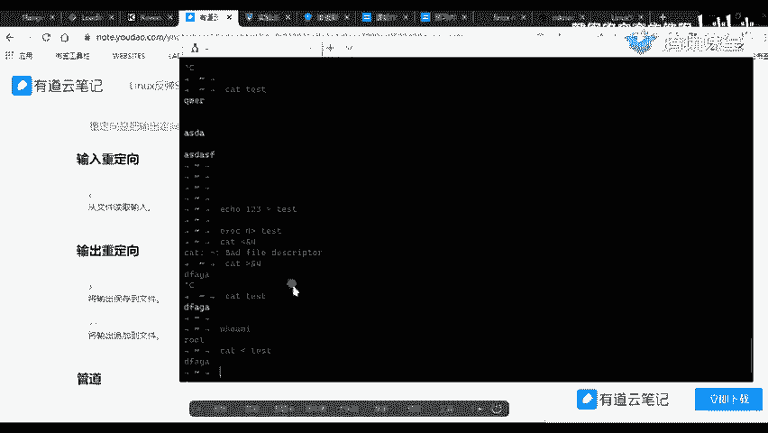

在这边的话呃，我课后的话去研究一下，然后的话再跟大家说。然后还有就是管道管道的话就是将程序的输出作为一个输入嘛，前面介绍的。然后的话我们在这边讲了之后的话，我们再回到我们的1个PPT的一个内容。

需尔的一个命令。在这边的话，我们前面的话也介绍了，主要的话就在这里编SH杠I这边的话就是进入一个SH的一个渲尔环境，对吧？好2。2-N的一在这边的话，大家应该能理解了吧。

就是说把我们的一个错误的一个输出，把它给从电向到我们的一个啊N一的话，就是呃引用了我们的一个呃。标准输出的一个文啊描述文文件描述符，对吧？所以说这里的意思的话就是把我们那个错误的一个输出。

把它给输出到我们的个标准输出。

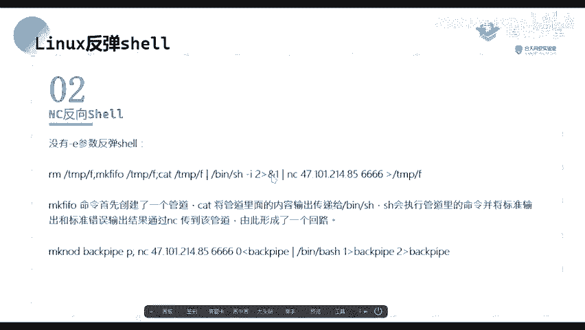

也就是我们也就是相当于我们在这边执行一个随便执行一个命令，它的一个错误输出，它会输出在在这里，对吧？

嗯。然后的话在管道服呃，后面的一个命令的话，就是呃我们常用的一个命令嘛，就是NC来去连接我们指定的1个呃IP的端口，对吧？然后在这边的话。我们把它进行一个组合，这一个命令的一个组合。

组合之后的话就形成了这样子的一个能够反弹需要的这样子的一个命令。主要呃主要大家要理解的话就是。在这里啊。就我们就从这里啊，前面的话这边的话主要就是建立这样子的一个广道文件嘛，命名文件嘛，对吧？

然后这里的一个文件的话，我们可以对它进行一个输入，以及从它里面去进行一个文件的一个读取。这里的一个啊文件的话，这里的话一个广道文件的话，就是啊在这里我们通过NC建立的一个连接。然后的话把我们的一个连接。

啊。对呃，把我们那个连接。就是在我们这里的一个静业的这个连接当中的一个输入以及输出，把它给从电向到从电向到了这个tamp。杠F这一个管道文件当中，对吧？然后在这里的话，我们在前面。就是呃。

我们在这里SH它会执行我们呃管道当中的一个命令。然后的话把我们这里的一个命令。进行一个输出，然后输出的话，它是输出在我们的一个标准输出的。呃，还有。然后嗯。这你。啊。

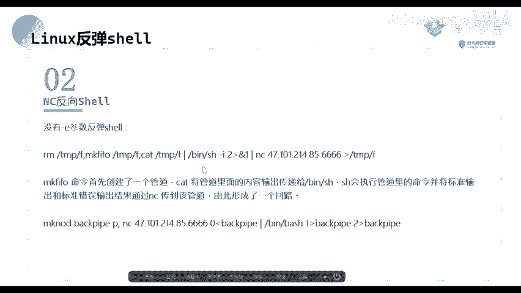

就是呃我这边来操作一下吧，先操作一下。Okay。

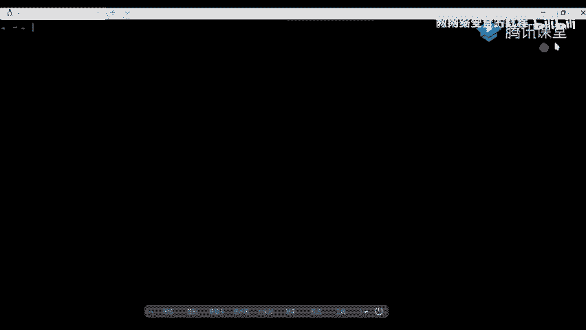

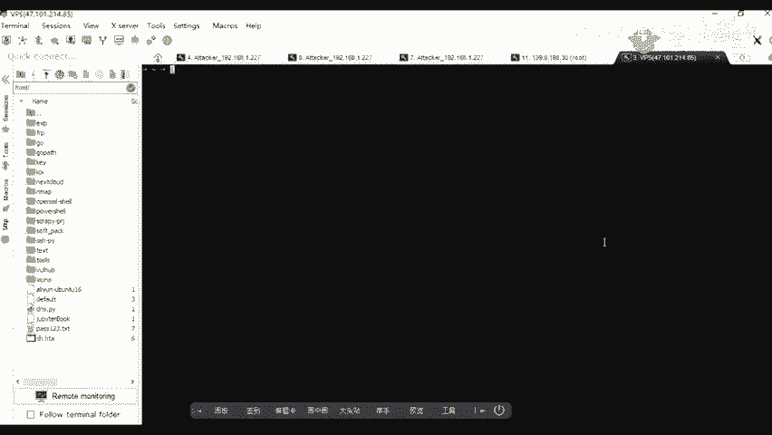

刚考试。

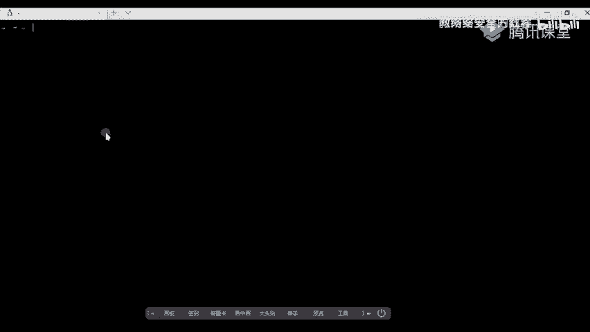

666的一个端口，我这边的话新建天一个端口，然后的话我在这边。呃，执行执行之后的话，在这边的话就会反弹为1个SH的一个需ll，对吧？在这边的话就是。

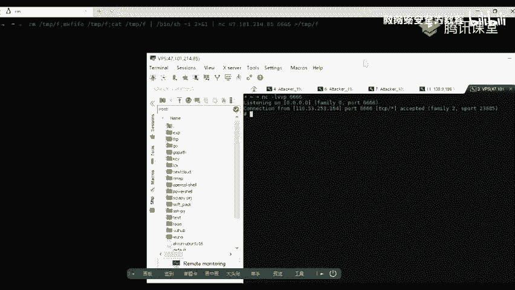

呃，1个SH的一个线。也就是这一个。

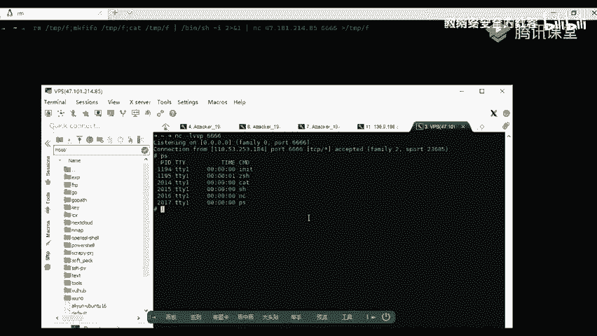

好，在这边的话是没有问题的。然后呃我们在这边执行之后的话，我们在这边我再开一个。

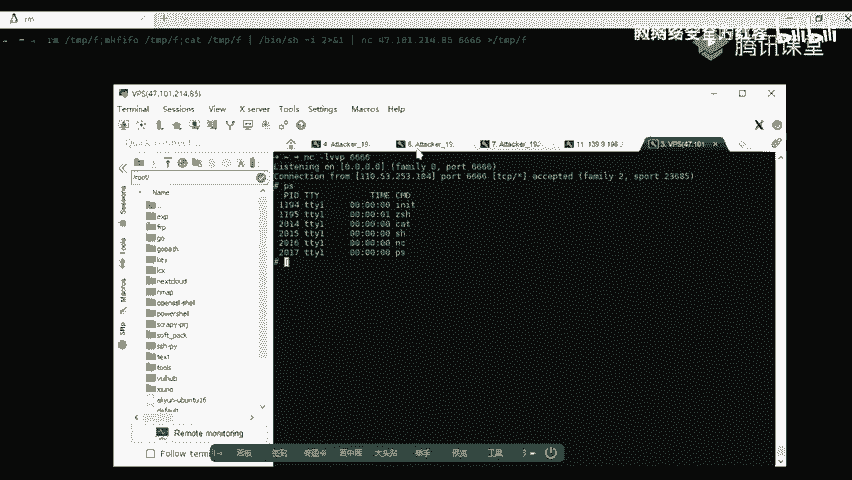

我 see呢到 temple。文件当中。然后在这边的话，我们刚刚这边的话是创建了一个杠F，对吧？这样子的一个广道文件，我们可以ca。F来看一下，这是这里的话没有内容。

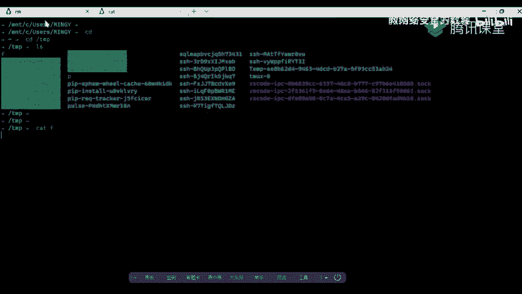

而，我这边的话执行执行一个命令，就我在这边啊执行1个L对吧？然后我们在这边其实可以看到在这边的话，它这个L的一个命令的话，它是输出到了这里，对吧？

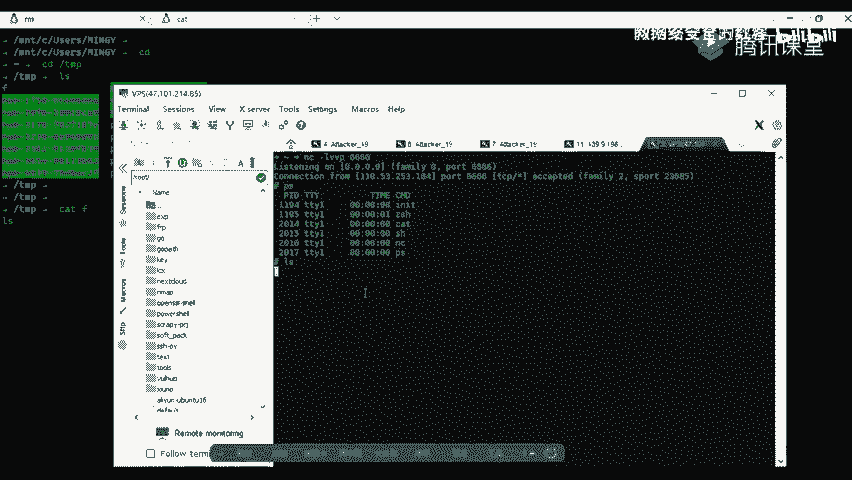

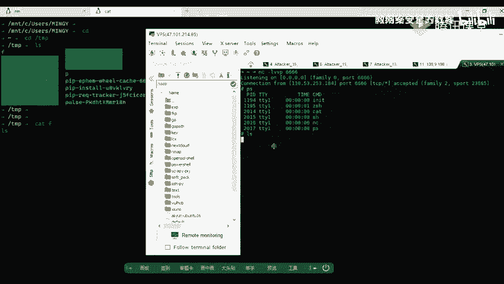

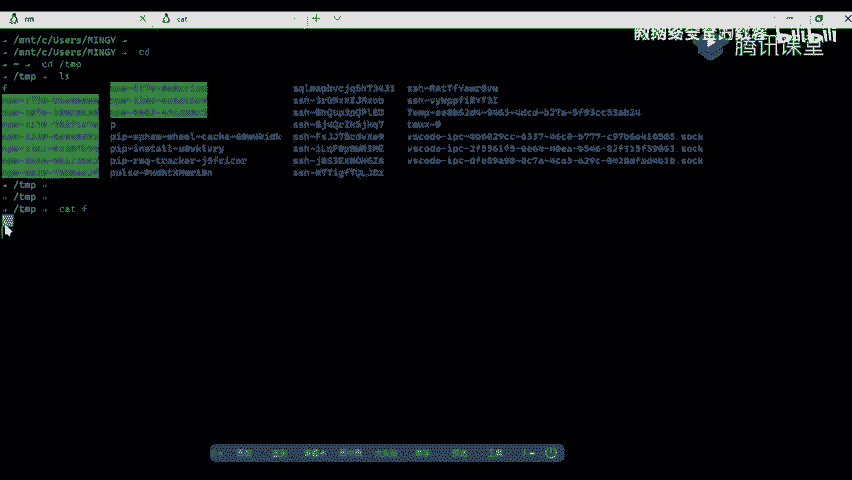

啊，因为我们这边的话是呃我们这边cat的话等于就是呃。


啊，先先从这里吧，就是我们这边L，我们这边L执行的这一个命令的话，它会经历这样子的一个过程。


就是从我们在这边的话，我们已经建立了一个连界，对吧？就是与我们这边呃这边的一个机器，与我的这一个服务器建立了一个连接。然后的话我们的这一个连接的话，它会呃把就是这个连界当中的所有的一个内容。

它会都会重印向到这一个文件当中，对吧？


然的话，我们在这边L通过这一个管道。通过这里的一个静力的一个连接，把它给传递到了这一个管道文件当中。然后传到了这个管道文件当中的话，我们在这边的话会就是cat，对吧？

cat的话就是查看查看它里面的一个内容。对吧然后的话等于在这边的话呃，因为我这边的话没有断掉。


我们在这边重新来，我这边断掉之后，我在这边。嗯。我在这边来执行执行1个L对吧？执行完L之后的话，它会把我们的这里L的命令，它会写入到这个tempamp管道啊，这一个F管道文件当中。

然后的话它在这边它会catcat的话就是查看，就是把这一个管道文件当中的一个内容把它给读取出来。读取出来的话。


读取出来之后的话，就是IOS嘛，对吧？然后的话他就会把这一个命令把它给我们这里的管道符的话，就是作为一个输入嘛，就把前面这里读出来一个作为一个输入。作为一个输入的话，因为我们在这边的话。

它会经历1个SH的一个小环境，对吧？等于就是把我们的1个L命令放到这里这里那个SH环境当中执行。


然后执行之后的话，它就会在这边返回一个结果。然后在这边返回的一个结果的话，它会作为一个标准的一个输出。标准输出的话它会。


呃，等于就是呃其实我们在这边的话已经就是已经进入到了这里的1个SH环境嘛，对吧？然后我们在这边输入的话呃输入的1个SM面的话，等于就是在他的这里的SH的环境执行。执行之后话。

输出在标准输出等于就是相当于就输出在我们在这边的一个呃内容。


即然开应该。能理解吧。就呃直接那个的话可能不太好理解。就你如果你自己去操作一下的话，就。

能够比较好的理解了。


啊，比如说我这边cat这一个F文件。帮我输一个 w d。嗯。怎么看不到你呢？可以看到。就是我们在就通过这样的一个方式，就是理解他我们这里那个命令，它其实是会传到这里的一个管道文件当中。

然后的话再在这边它执行执行之后的话，它等于就是有1个SH的环境嘛，在里面执行之后的话，它会把它的一个输出，就同样的是通过这个管道。


来传递给我们这边的一个机器。


这样的话就是呃通过这样子的一个呃make。makeFISFO命名管创建命名管道的一个方式来进行一个反弹效。好后我们在这边的话就没有使用这一个杠一参数来指定我们的一个选。然后下面的这这一个的话呃。

其实跟上面的话原理类似。在这里的话就是主要就是这一个make note makeake note这一个的话，大家看一下那个预习内容吧，这边的话我就不再讲了。在这边的话，它同样的就是创建一个设备块。

这里的话就是创建了这样子的啊backPIP这样子一个名字，还有这一个P，对吧？创建了这样子的一个设备块，就相当于我们上面的一个管道管道。呃，就是命名管道的这样子一个东西。然后在这边的话。

我们NC来去连接我们这边指定的一个端口。然后在这边的话要呃同样的就是您小于号。在这边的话就是把我们这里的一个backer。PIE作为一个输入，就把把这里面的一个内容作为一个标准的一个输入。

输入到呃输入到这里。然后这里的一个back PIE文件里面的一个内容的话，就是从这里过来的。我们在这边的话，冰ba冰b的话，它会打开一个besh的一个呃。一个需染环境嘛，对吧？而我们这里冰败许之后的话。

这里的个需要环境的话，我们这边把我们的一个标准的一个输入以及错误的一个输啊，标准的一个输出以及错误的一个输出，把它给全部啊从重面向到我们这里的一个backPIE文件当中。

然后的话我们在就是呃等于就是我们的一个命令的话，呃呃我们执行的一个命令，我们的一个输出，它会重电向到这个文件当中。然后的话再作为这里的一个输入。然后的话通过这个管道传递给我们的一个服务器。

也就是我这边的一个。IP的端口。呃，以及办事。喜的话呃，我们先看一下，就是我们常用的一个命令，就这里的一个be喜杠I，然后大于N，然后低于TCPIP加端口，然后你大于N的一。然。

这个的话就是我们常用的一个be下面的一个呃反弹需要的一个命令，对吧？然后我们只需要在我们那个公击机上面，今天指定的一个端口就能够反弹回一个需要，而且是能够就是一个这种。呃，可监互式的一个需要，对吧？啊。

这里的一个。命令它的一个原理的话，大家看看我这里。就呃理解了就是理解了这里的。啊哪个呢？理解了这这你的。符号的一个意思的话，以及它的一个就是它的一个数据，它是怎么去进行一个输入输出的话。

就能够去理解这里的一个命令。然，这里的话我是分步骤。啊。就是解释了这样子的一个命令，我们是如何去写的？首先就是大家要明白，就是我们的一个控制端以及被控端。我们要实现一个交互的话，对吧？就我们在这边。


我们在这边我们尽量在那个sha，对吧？我们想要去控制我们的一个服呃，控制我们的一个控制端，就是这边的一个机器，我想要把我执行的一个命令。


呃，就是我想要去执行命令来控制这里的一个啊机器。所以说我们想要把我们的一个命令。就是传递过去的话，我们需要建立一个连接，对吧？然后的话把我们的一个命令把它给传到这里的一个机器上面。然后的话我们想要。

把我们执行的一个命令的一个输出来，就是获取到它命令执行的一个输出的话，就需要在这边就需要从这边把它这里的一个命令的一个输出。比如说LS这样子的一个输出，把它给。


发送到我们这边的一个呃服服务端，也就是控制端。


🤧嗯。所以说在这边的话，我们先看一下，就是把我们的一个被控端的一个交互需要从联向到我们的一个控制端。其实这里的话就是这里的一个意思的话，就是把我们的。嗯。就是把我们的一个命令把它给。

把我们这里命令执行的一个结果，把它给重电向到我们这边指定的一个机器。我们来看一下。


不住街。拜喜肝癌的话就是建立这样子的一个拜喜环境嘛，对吧？我们再取开，然后的话把证你的一个需要把它给。把它给重电向到我们的这里的一个。连接。这里的1个DVTCP这个呃这一个连接的话。应该能理解吧。

就是说在这边的话，他其实会建立这样子一个通道。就是他呃我们通过这里的1个DVTCP后面接我们那个IP以及端口的话，它就会去主动的去连接我们这边给变的1个IP以及端口。

然后的话如果说我们这边的1个IP端口有建立一个今天的话，它就会呃就是建立一个连接。


回说我这边666。啊，我在这边的话，先监听一个。


关琴。啊，然后我这边。

嗯。


关嘅主时啊。我以这一个机器吧。然后在这边的话呃，我们可以看到在这边的话有一个连接连接过来了，对吧？这一个连接的话就是从这一个机器过来的。然后在这边的话，我们这边的一个连接的一个意思的话。

就是我们在这边进就是进入了这样子的一个ba喜的一个hell，对吧？然后这边的一个ba shell下面的所有的一个输入啊把所有的一个输出。它都会把它重电向到我们这边的一个机器，也就是我们这边我们来看一下。

在这边，比如说我之前个L对吧？我之前L的话，它会正常的输输出。就输出内容。然后的话在这边的话，因为我们把标准的一个输出，把它给重建向到了这里的一个啊远程的一个机器上面，也就是在这边，对吧？

就是说我们在这边可以看到，在这边的话，就是显示了在这边的执行L的一个命令的一个内容。对吧。答问毕。对啊。然后这这这里的话就相当就实现了一实现了我刚刚说的那两步，其中的一步就是把我们的。

就是控制端的一个命令执行的命令的一个结果，把它给输出输入到我们的一个服务端。


然后还有一步的话就是需要把我们那个命令把那个传过去，对吧？我们需要通过这一个管道。就通过我们这边建行一个连接，把我们的一个命令，把它给输入到我们这边的一个控制端。


啊，不不是控制端，是被控端。我这边的话是被控端，这边的话是控制端。好，我们来来看一下。然后呃这这边的话我们是需要接收，就是接收来自我们控制端的一个命令，对吧？所以的话因为我们的一个控制端的一个命令的话。

是通过这里的一个连接来传递的。所以说在这边我们想要把我们的一个命令把它个传到这里。再一个就是。我们的一个被控端的一个ba的话，们就需要用这样子的一个呃输输入重电项，对吧？

把我们从这里的一个呃远程的传递过来的一个命令。把他给诶。输入到我们这边当前的这里的一个be来去进行个执行。然后在这边的话，我们可以看一下，我在这边我在这边的一个输入。

其实它都会同步到在这边我的这一个被控端，对吧？然后我在这边执行1个L命。他就会在这边执行1个L命令，然后的话返回结果。


所以说在这里的话我们就实现了我们呃刚刚的两个部分的另外一个部分。然后的话我们只需要把这两个命令。


做一个整合，就是结合它的就是啊结合它这两条命令来把它。并整合成一条命令。因为我们是要把我们的控制端的一个输入，就是我们控制端的一个命令，把它给传递到我们的一个被控端。然后的话在被控端上面去执行。


对吧所以我们需要这样子一个命令。然后的话我们在被控端执行的一个命令的一个结果，我们还需要去通过这里的一个连接来返回到我们的一个控制端。


也就是这里的一个命令。所以说的话我们就能够实现这样子的一个，我们在这边执行一个命令，然后的话实时的返回。他的一个结果。


然后整合的两条语句的话，就是像这样子。这里的话这里的一个意思，我们呃前面的话就。已经也介绍了，就是理解一下这这两。我们首先的话ba杠I是进入我们的一个ba喜环境，对吧？然后我们做一个重定向。

把我们这里ba杠I的一个输入。啊，的一个输出啊，把它给重定向到我们这边的一个远程的服务器，对吧？然后在这边的一个远程服务器的话，我们这边有一个零呃，就是零的话就是我们的一个标准的一个输入嘛。

把我们的一个标准的一个输入，把它给重定向到了我们的一个标准的一个呃输出，对吧？然后在这边的一个标准的一个输出的话，其实就是我们这边的一个bas喜杠I进入的一个bs喜的一个环境。

然后我们在这边的一个标准的一个输入的话，其实就是从我们这边的一个静力的这一里的一个临接。我们这边渐渐的一个连接，从当中其实呃就相当于就是我们这这边控制端所输入的一个内容。


就是作为了这边的一个标准的一个输入。然后的话我们。呃，输入到了我们的一个标准的一个输出，也就是我们的一个控制端。然后在这边我们的一个控制端的话，它就会执行它就会执行我们这边的一个云。

就是控制端所传递过来的命令。然后在这个拜喜环境下面执行执行之后的话，它的一个结果又它会返回到通过这里的一个连接返回到我们的一个控制端。就以说在这边的话就有有了一个回还。大家能理解吗？就是有一个回环。

因为只有这样的话，我们才能够说就是有这样子的一个需要的一个交互，能够实时的去啊传递我们的一个命令，以及啊获取到我们的一个命令执行之后的一个结果。就是像这样子。然后在这边的话就还会有一个问题。我们啊来。


试一下。这样的话不是一个还不是一个完整的一个命令。


不是说不是一个完整，是还不是一个呃。而不是一个就是功能完整的一个命令。嗯。没看到我在这边的话呃。你看到我在这边的话呃，执行这一条命令之后的话。执行之后，这边的话进行了一个连接，对吧？

而我在这边的一个控制端执行命令，执行命令的话，返回它命令的一个结果，对吧？这就是我们想要的一个这种交互式的一个需要。


的一个样子对吧？然后但是的话在这边的话，他还会有一个问题，就是我们在这边。输入的就是说输入的这一个内容，对吧？它会在这边显示。以及我们在这边我们输入的一个。错误的一个命令，对吧？

他没有获取到它的一个错误的一个输出。就是他这边的一个错误的输出啊，他还是输出在这里的一个办喜的一个环境当中。


所以说在这边的话，我们就需要就了解这个。


这边的两个符号，这两个符号的话，它都是同样的一个意思，就是混合输出，就是把我们正确的还有错误的一个输出都输出到同同一个地方。其实。😊，到我们的这里的一个呃实际的一个命令的话。

就是我们需要把我们的一个呃控制端上面执行的一个命令，包括正确的以及错误的一个命令，他都同意的输啊，就是输出输出到这里的我们建立的一个连接，对吧？


因为我们是通过这一个连接去进行一个通信的。其实说白了就是这里的一个通信的话，就是我们向这一个呃相当于就是一个通道，我们向这一个通道发送我们的一个内容。然后的话发送到了这里的一个呃被控端。

然后的话在被控端上面呃做做了一些操作，也就是执行命令。执行命令之后的一个结果在呃通过这里的一个呃连接来返回给我们的一个控制端。所以说在这边的话，我们只需要啊。通过。大于N的这样子的一个符号。

也也就是说混合输出的一个样式来解决我们上面所提到的一个问题。然后大家可能会看到就是说有这样子的两种形式。然后注意的话，这边N的大于号，还有大于的号，它的一个效果都是一样的。


然后大家还有可能就是会注意到像这样子的一个写法，对吧？就这里的一个写法的话，就更符合我们的一个理解。就是说我们需要把我们的一个错误的一个输出，对吧？把我们的一个错误的一个输出。

把那个重进向到我们的一个啊标准输出。然后的话。就是啊从电向到了我们这边的一个控制端。就是包括了我们的一个呃标准的就是。呃，输出以及错误的一个输出，它都输出到了我们的一个控制端。


然后实际的一个效果的话就是像这样子。话。大家能理解吗？我这边的话应该讲的很详细了，就包括它的一个呃它中间它是怎么去进行一个运行的，以及它中间的一些操作，对吧？


能理解是吧？能理解的话就好呃，我害怕就是说可能因为在这边的话。


这里的一个东西的话其实比较ro啊，就是因为我们在这边是有这样子的一个回环的一个关系。我们需要就是有输入输出的一个关系。其实大家理解了这样子一个输入输出的关系的话，其实就能够去很好的理解这样的一个命令。

就包括其他的一些反谈西尔的一个命令。就其他的反兰西尔的一个命令的话，其实就是。啊，以这样子的一个原理做了一个相应的一个病种。


哦，关讲这一个就讲了。讲了一节课了呀。呃，这里的话。就只有两位同学能理解吗？其他同学呢？嗯。可能我这边的话呃。如果大家还不是很理解的话，呃，建议大家就是。自己动手去操作一下，然后的话看我的回放吧。好吧。

到你年前。那好。然后其实呃本节课这节课内内容的话主要还是就是带大家理解一下这里的一个。啊，就是把纳希尔的一个原理吧，就是像后面的这种的话。后面的其他那些啊拉些的一个方法的话，都是大同小异的。

像比如说这里的。这里的一种形式。这种形式的话就是呃。呃，同样的就是。就理解一下这里这里的一个5。啊。小于大于黑。然后在这边的话，其实我们看到这里有1个EXEC对吧？

这边的话就是相当于就是我们创建了一个自己的一个呃文件描述服务，对吧？然后在这边的话小于等于号。小于呃不小于大于号的话，这边的一个意思的话就是啊对我们这边建议的一个通道有可读可写的一个啊，就是可以去读。

可以去写这样子的一个内容。当然的话我们也可以就是只只比如说我们只是大于也就是只是输出重电线的话，就是把我们这边的一个输出，就是可以把它写到这你的一个通道当中，对吧？

然后这边在这边的话经历了这样子一个通道。而我们cat cat的话就是。哎，在这边在这边都可以啊。我我都纳闷。就我们在这边的话，我们从我们这边的一个文件描述服务当中的一个内容作为一个输入。

然后的话就是通过cat来进行一个输出。在这边，我啊我课后我再去研究一下吧。就其实啊。是可以这样子去操作的，就可能是我之前的一个文件描述符的话，写法可能有问题。可能是不能单独的拿出来。

就不能单独的拿出来去进行这样子的一个呃输入。然后然后的话下面的话就是一个管道符嘛，就是把我们这边就是cat获取到的一个内容，把它作为一个输入，输入到下面的一个命令。

下面那一个命令的话就是Y的话就是一个循环嘛。对吧就是然后read line的话，read read这里的话就是相当于建立了一个line的一个变量，对吧？前面的话也介绍了。

然后我们在这边建立了一个line的变量的话，我们啊就是。具的话就是执行这里的一个操作。这里的一个操作的话，就是把我们line尔并量的一个内容。啊。诶系。把我们拉耳边的你你的一个内容。

这边的话应该是输出吧。我们先看这里。呃，就是。二的话就是我们的一个错误的一个输出嘛，错误的输出把它个重电向到我们这里的一个啊文件名文件描述服务，其实就是相当于就是呃。因为我们这边的一个文件描述服务。

其实就是指向了这里的一个通道，对吧？所以说相当于在这边的话，就是把我们的一个错误的一个输出。啊，把它给重变向到了这里的一个通道，也就是这边的一个通道的话，其实就是我们的一个控制端的嘛的一个显示器。

然后呃大于N的5的话，这这边的话其实就是相当于就是一大于N的5，就是把我们的一个标准的一个输入。啊，不是啊标准的一个输出啊，就是执行命令执行正确之后的一个输出，把它给。从电线呢这里的一个通道。

然后的话动的话就是呃这里的一个循环就是结束嘛，对吧？然后在这边的话，我们来连起来理解一下，就是也就是建立这样一个通道，就是这里的一个写法。要注意一下，然后的话把我们这边通道的一个内容。

其实就是我们这里边建历了一个连接之后的话，我们控制端要去输入命令，对吧？比如说我这边输了1个LL的一个命令。然后的话他就会通过这一个通道传到这边来，传到这你的一个文件描述服务。

然后的话我们cat的话就是查看这里的一个内容嘛，对吧？就是这边的一个内容的话就是LLL的话，它会把它给传到这里的一个line变量。就是通过read的那个形式，因为我们就是就是相当于就是。


相在只只不过是方向反了，然后的话是通过广道来去进行一个连接的。其实就是相当于我们是read line，然后的话把我们的这里这个LS命令把它给就是重电向到这里那个line，是吧？

然后的话我们其实就是这一个通过这个linein冰单的话，就能够获取到这里的1个L的一个内容。然后在这边的话就是呃他会具的话就是执行嘛，就执行我们这边的一个命令。


就执行这一个变量里面的一个内容，也就是L的个命令。然后的话。再把。呃，标准那个输出以及错误的输出。通过这一个通道。传递给我们那个控制端。以及呃。以及还有这边的就这里的一个这个网站里面的话。

他还有其他的种大家自己去理解吧，都是呃一样的一个意思啊，只不过是他的一个写法的话，就稍微不一样一点。原理的话都是一样的。哦，诶系。然后的话我们在这边的话，我们其实可以发现的话，就是我们的这种啊命令的话。

它有一些比较鲜明的一些特点。就是呃像比如说这种重定向的一个符号是我们经常会去使用到的对吧？因为我们要做一个输入输出。钥匙这样子。通过这样子一个重电下符做一个输入输出。所以说有所以说。

在对这种命令去做一个过滤的话，可能而且还有有一些命令的话，像比如说在windows当中，你去做这种的话，你执行这个命令的话，它肯定是会失败的对吧？就说呃在命令行的话，他可能不会允许你去执行这样子的一个。

呃，就是。去有包含有这这样子的一个符号。就以说我们可以通过这样子的一个b64的一个编码来去进行一个绕过。是绕过他对这种特殊的这种制服的一个过滤。然后的话呃，编码之后的话就是最后得到的一个命令的话。

就是像这样子。这告的话也是比较好理解，就是其实就是相当于我们啊就理解一下这里就行了。这里拜起杠C的话，C后面的话就是接我们的一个执行的一个命令嘛。其实主要的话就是中间的这一串这一串内容的话，我们把它在。

啊，你也可以这样理解，就是双向嘛，就是。啊，就是我们的那个五的这一个文件描述符。它其实是指向着这里的一个通道，对吧？我们向这一个通道里面写内容，就是输出。像这个通道里面输出内容的话就是大于号码，对吧？

然后的话我们要从这里的一个通道当中接收。接收的话就是相当于就是从这一个通道当中。对一个内容作为一个输入，输入到我们的这里的一个啊当前的一个环境，对吧？嗯。而不是输入到当前那个环境。

而是输入到我们这边的一个环境变量5。啊，不是黄金面料，我是在。说错了。哎呀，讲得我嘴都。嘴都绕了，就这边的话就是文件描描述服务嘛，是吧？哦呃在这边的话就是实际的一个命令话，其实我们可以在客户端去执行。

执行之后的话，其实就是这样子的一个命令，就是相当于就是因为app的话就是输出嘛，输出这里的一个内容，然后通过b64一个解码，就把这边的一个内容做一个解码。解码之后的话，其实就是这里的一个内容。


然后的话be杠A的话就是进入一个be的一个hell嘛，对吧？然后的话连起来的话，就是把这一个命令在这一个bes下面执行嘛。执行之后的话，其实就是执行到这里的一个反弹需尔的一个命令。


然后其他的也是类似的，就是做一个编码。啊。以上的话就是be喜的这个就在linux下面利用这样子的一个be，还有像LLH啊。SH等等的这种需要环境。其实在这边话是使用的一个ba嘛。然后伴学的话。

其实呃还有SH这种都是inux下面默认的一个需小环境嘛。你在这边的话可以更改一下嘛，就你可以改成SH啊，还有或者是说GSH等等的这种都是可以的。好，下面的话呃。

下面后面的话其实就是在lininux下面可能会存在着这样子的一个一些环境。我们会呃就是可能会碰到有存在这样子的一些环境的一一个机器，对吧？我们想要反弹这存在这样子的一些环境的这种机器。

我们可以通过哪一些方法来去反弹需。在这里的话主要的话就是一些脚本语言，就是像peer peer，还有Pthon啊，还有PHP，还有啊reby，还有telnet。这样子的一些环境中间的话就是一些脚本语言。

这脚本语言的话，它的其实它的一个原理的话，大家只要理解它的一个原理就行了。然后主要的话就是然后其他的就是它不同的一个编程语言，它的一个呃写法不一样而已。像比如说这里的话呃。

首先P2杠11的话就是我们在后面的话就是执行我们的1个P尔的一个代码。就是借我们这里P尔的一一串代码。然后的话就会去执行嘛。然后在这边这一串代码的话，就呃首先的话就柚子这个s嘛。

就相当于就是使用这这样子的一个s的一个方法。或者说模块，然后的话通过这一个struct来去建行一个连接。这的话呃跟PHP当中挺像的。就呃通过s来进行一个连接，连接的话。

这边连接的1个IP以及端口IP的话就是我们要反弹需要的话，就是连接我们的一个呃控制端的1个IP以及端口嘛，对吧？然后在这边的话呃。中间这边的话就是。啊，同样的就是一个输入以及输出啊。

就是我们其实可以看一下。在这边的话，它会open一个输，就是标准的一个输输入，对吧？sting in。对吧它同样的重电向到这样子的一个S，这里的S的话其实就是在这里这里的一个struct。

它建立了一个零件。其实就是相当于就是重电向到了我们这边的一个s的一个连接。就跟我们前面。它的一个原理是类似的，还有的话一个标准的一个输出对吧？还有错误的一个输出。然后以及最后我们通过EXEC的话。

就执行的这样子一个啊进入啊，就是尽力呃进入这样子一个SH的一个需要环境嘛，是吧？呃，下面的话也是类似的，就是写法不一样。


呃呃，关于这样子的，就这样子的一些命令的话，如果大家就是不不熟悉，对吧？不熟悉这一个PL命令，你可以直接使用我这边给的这这这这样子的一个样例。然后的话还可以就是说呃通过MSFMSF里面的话。

它有很多的这种模块，对吧？它针对各种不同的脚本语言，有不同的一个模块。然后在MSF里面的话，我们可以通过。呃。就是通过这样子整个命令来查找我们就是包含有Pre这样子脚本原的一个配load嘛。

在这边话可能会慢一点。然后的话我们可以使用相应的一个模块来去进行一个呃反弹项。


然后在这边话，因为。都比较多，而且只是一些模块的一个使用的话，我在这边的话就不再过多的介绍了。然后以及pathonpython的话，大家应该呃就。大家应该都很都比较熟悉吧，对吧？

python的话现在用的都比较多，而且搞我们这个的话都是需要去了解的对吧？然后在这边的话就是杠C嘛，同样的跟前面也是一样的意思，就是执行我们这里的一个python的一个代码。然后这里拍成代码的话呃。

应该不用多讲，同样的也是调用了我们的这样的一个s的一个库。要了我们这里的一个s的一个库。然后的话建立一个s的一个连接。

然后主要的话就是呃然后调用这个s的一个connect的一个函数来去进行一个ser连接嘛。然后的话同样就是。我们的这里的一个呃。这里的1个OSDOPIDOP。这个的话就跟我们前面的一个标准的一个输入输出。

其实。啊。是啊一样的一个原理啊。可以看到在这边的话，就复制文件描述符FD到FD2。然后他的一个语法就是前面是F1，后面是F2嘛，对吧？然后的话就是我们在这边呃。我们这边。

的一个S点fire no fire no的话在这边的话就是把我们在这边进行的一个连接。的一个呃。这里怎么描描述呢？就是把我们在这边的。你可以把它当成为一个文件描述符嘛，它这边得到的一个内容。

把它给复制到了我们这边的一个零。零的话就是我们的一个标准的一个输入嘛，对吧？然后的话。以下之后的话也是类似嘛，就是012，它同样的就是标准输入输出，然后错误输出。

以及最后的通过这一个sber来执行这样子一个需的一个嗯需尔的一个环境。呃，还有其他的这一些的话，同样的我们也可以通过这样的一个方法来去查找呃MF里面的这样子的一个模块。


在像在这里的话，像呃有在windows下面的一个peer，还有linux上下面的一个peer，对吧？啊，我们。你做个永意吧。我就讲一个。哦没有啊。因为他呃这边的话。

它是其实就是一个生成一个这样子的访谈需尔的一个P尔的一个代码。喂 e p。都唔全啊。😔，诶。嗯。都个深入配的脸。啊，搞错了。


我这边他是拍肉的呀，他不是模块呀。


是配漏的呀，所以的话我们要生成，就是说我们要生成相应的这种配load的话，我们其实要生成相应的一个脚本，是呃通过。哦，反正去得那个家管通话安三伏比那么嘛，对吧？然后的话自定。紫店这样子的这一个配漏的。

不是呃，我这边他搞错了。柚子的话是使用模块。呃，那个是什么？诶，那是模块名吗？


呃，我这边就不操作了吧。哦，在这里。就指定他的这样子的一个模块，然后的话。


还去进行一个生层。嗯。


那等一下。我们先继续讲后面的吧。介绍一下，然后python的话也是一样的。还有的话就是呃上节课就是没有讲的这就是它同样的可以使用这个web delivery的一个模块。

我们可以生成相应的这种python代码。就这python代码的话，如果你熟悉的话，你自己都可以写。然后在这边的话呃，其他的一个原理的话。因为在这边的话，就是他在这边通过这一个U are open。

就是它会生成它会生成一个这样子的一个python的一个代码。然后这里的一个代码的话就是反特需尔的一个代码。然后的话我们通过这里的一个呃。pathon的一个要op来去获取它里面的一个内容。

然后的话执行执行它里面的一个内容来去呃，就是来访他下，其实就是。啊，执前这里的一个生成的一个把它下的一个代码。还有PHP的话呃，PHP的话跟前面。呃，也是类似的，就是我们那1个PHP的一个代码。呃。

关于这个PHP的话，在这边它就是使用的这个F so open嘛，这样子一个函数。这个函数的话同样的也是建立一个s连接，然后通过EXECEX我们说EXEC话就是执行嘛，然后执行的一个命令的话就是这样子。

然后关于后面后面这里话我就不讲了。跟前面也是一样的，就是把我们的一个错误呃标准输出以及标准输入做一个重进下。重列都重叠下来这一个三的一个文件描述符。这里的一个三文件描述符话。

你就可以理解成是这边的建立的一个s的一个连接。以及通过web deliverliver，它也可以去生成相应的这样子的一个代码。关于这代码的话，我这边的话就不再多说了。还有reby啊。

然后的话呃主要的话就最后再讲。再讲这一个吧，tenet还有open access。tenet的话呃。在呃这个的话在。linux当中，还有windows当中，它其实都是有的。

然后的话呃windows当中话，它默认不会去安装。然后lin的话它呃。系统里面应该是默认都会有的。哦，应该是应该是默认有哒。然后的话我们可以通过这一个tnet来去访谈一个需要。在这边的话呃。我们看一下。

呃，其实跟前面的话，也是园林的话，也是一样的。就在这边的话就是使用的这个 make node。Makeakeconload这一个命令，然后的话呃。建立了这样子的AP的一个呃那个设备块。

然后的话其实就是进立了一个通道嘛。然后我们通过这个tnet。tnet来去连接连接之后的话，把我们的从A当中其实就是跟我们前面的那个ba其实是一样的。就是A的话就是我们这边。

就是跟我们前面的一个命名管道是类似的嘛，对吧？这里的A的话其实就是我们的一个啊输入以及输出的一个内容。都在这边。ううん。然后的话通过这一个管道来去进行一个传输。呃，下面的话也是类似的，一样的。

然后最后的这一个open SSO对open SS的话，它是呃minux里面它都是就你安装的SH的话，它啊都会有的这样子的一个命令。这个命令啊这个命令的话就是。我们可以利用它来去反弹 share尔。

然后这里的一个反弹 share尔的话，它是啊就是说它在这边建立的一个通道的话，它是利用SSL的一个啊这样子的一个就是加密的一个啊协议。所以说我们在这边通过这样子的一个需要的话。

这样子进行了一个这种数据的一个传递的话，它其实也是进行了一个加密的。所以说。就是能够比较就效果比较好的，能够去绕过呃一般的这种流量监控的一些设备。然后它的一个使用的话就是这样子，就命令的话我就不不说了。

呃，就大家在使用的话，直接复制粘贴就可以了。然后只要你理解他是什么意思就行。这就第一个面的话就是主要就是生成密钥文件嘛，就是我们要生成这样子一个密钥文件来去进行一个认证嘛。

然后的话在呃通过op手来去监听，就是监听一个端口。你可以试试3啊，或者说其他的一个端口。然后的话在我们的目标机器上面，通过这一样子这个命名管道来去呃，就通过oppo access来去连接我们这边的啊。

呃，远程主机上面的这样子的一个今天的一个端口。买凡体嘅 sir。这原理的话还是跟前面那一个麦雪也是类似的。哦呃以上的话就是我们今天的一个全部的一个内容。呃。大家有有什么有没有什么疑问呢？嗯。Yeah。

关于后面的就是。在你的。啊，其他的就是这种脚本的话，我就没有去细讲了呀。因为他的。你明白它的一个原理就可以嘛。啊，像这种代码的话，你直接用就行了。或者你是你都你这些你这些代码你都会的话，你自己都能写嘛。

喂。就他们的一个园理的话都是建立一个sck的一个连件。嗯。然后的话还有就是就李姐这边讲的这个ba。就是反特西尔的一个呃原理。其实就是我们要理解这里的一个文件描述符。以及我们的这一个重定向的一个输入输出。

大家要理解就是说。我们的一个输入输出是从哪里来？然后的话输就输入到哪里，输出到哪里去。以及就是呃。理解我们这边的一个要实现这样子一个法兰西尔的一个这种交互。我们。就中间我们需要就是。啊。

就是通过什么样什么样子的一个方法来去实现这样子的一个交互。对吧。


呃，大家也没有什么疑问吗？都能听得懂吗？还嗨有人在吗？应该还在听吧。就呃能听懂的话就是。对，本节课的内容能听的话呃，扣个一吧。能能的好吧。O。能都能听懂话，那就好。啊，那么呃本期的内内呃。

内容的话就到这里结束了。