# 2024网络安全系统教程！清华大佬花159小时讲完的网络安全系统课！别再盲目自学了，学完即可就业！零基础入门网络安全！（渗透测试／漏洞挖掘／CTF／黑客技术） - P64：51.socks代理简介.mp4 - 教网络安全的红客 - BV1ft421A7Nj

然，我们今天的话主要给大家就是介绍一下ss的一个代理。然后的话会以一个就是一个靶场的一个实战来给大家演示。就是具体的我们如何去通过一个这样子的一个shops代理来去进行一个内网的一个穿透。

其实我们呃这边的这个内容的话，其实主要的话就是告诉大家内网穿透的一个一些方法。然，我们在这边的话就是使用的是这样子的一个shop代理的一个方式来去进行一个内网穿透。

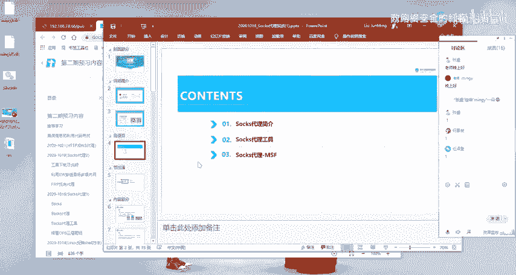

然，本节课主要给大家介绍的就这3块内容。第一块的话就是对说s代理的一个警介，就带大家一起来了解什么是说s代代理，以及我们为什么要去使用到这样子的一个ss的一个代理。然后第二个的话就是ss代理的一个工具。

就是给大家大概的介绍一下，就是说有哪一些socks代理的呃常用的一个工具。然后第三个的话就是ss代理的一个呃实战。我们呃本期的话主要是通过MSF。好，下一节课的话会给大家就是说在具体的去使用。

就是说在我们无法去使用MSF的一个情况下面，我们如何去通过其他的一个样的其他的这样子的一些代理工具来去进行一个呃内网的一个穿透。

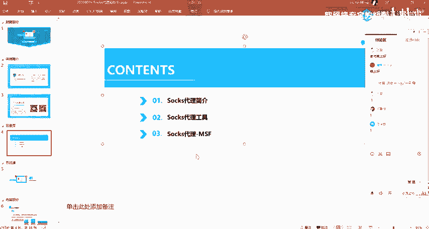

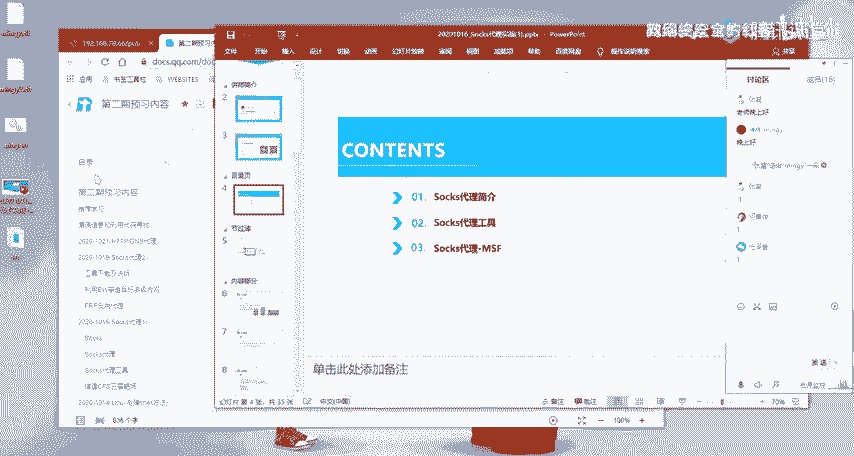

呃。然后的话我们正式开始我们今天的呃第一部分的一个内容，就是说死代理的一个警戒。

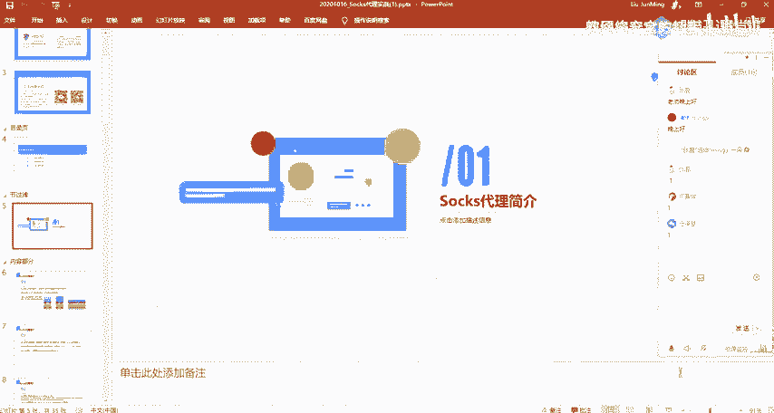

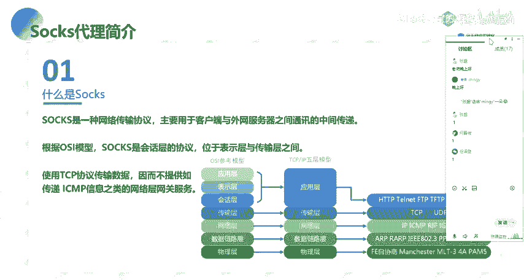

啊，我这边的话把PPT先发给大家吧。嗯。先把PPT发PPT发给大家。不然的话呃等会的话又容易忘记。没认。呃，本机段的1个PPT的话已经发到了群里。

大家可以就是呃打开我的1个PPT来跟我一起就是来过一下今天的一个内容。

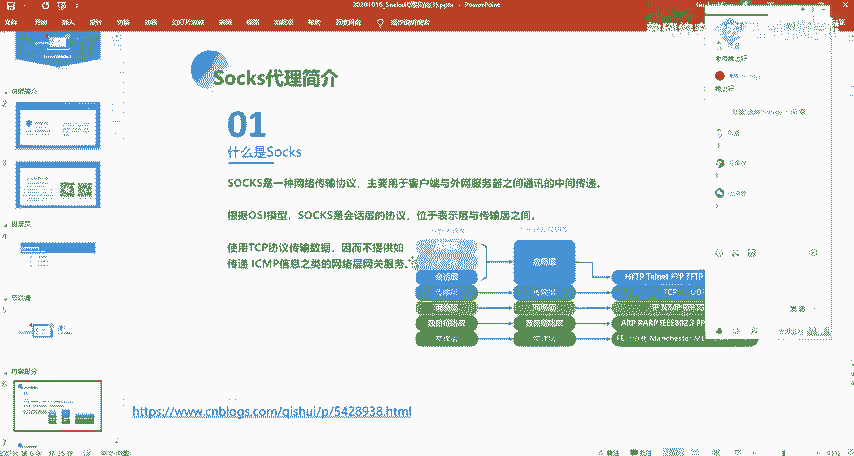

然，呃在这边的话，我们先来先来一起看一下什么是。呃，说不实的话，它是一个网络的传输协议啊，主要的话是用于客户端，还有外网服务器之间通讯的一个中间传递，也就是做一个这样子的一个呃。

客户端以我们内网的这种客户端与我们的一个外网服务器之间的一个这样子的一个呃数据传输的一个通道。然后的话我们在这边可以使用这样子的一个shop的一个协议。然，呃。

根据我们的就是说大家应该网络的话应该有相应的一个基础，对吧？就关于网络的这样子的一个OSI的一个模型，应该呃以及这个TCBIP的五层模型应该有一一定的一个了解，对吧？

我们呃应该大部分都是学计算机专业的这一块的，对吧？然后的话呃，根据我们这样子的一个模型啊，我们的一个shop的这一个绘画协议的话，它是位于我们的一个表示层以及传输层之间。

也就是在这边表示层以及传输层之间。它是一个绘画成的一个协议，要注意。然后的话呃，我们再去使用TCP的一个协议传输数据。要注意的话，就是说我们的一个ss的一个呃协议的话。

它是呃使用的是一个TP的一个协议去传传输我们的一个数据。然后在这边呃特意提的这一点的话，就是说我们在这边要注意的一个地方，就是我们呃不提供。

就说ss它是不提供去传递这种SMP信息类的这种呃网络层网关的一个服务。我们知道SMP的话，就是我们常用的一个。就我们的一个拼命令的话，我们通过P命令来去发现呃。

来去通过发送这样子的SMP的这种数据包来去呃探测主机的一个存活，对吧？然后的话在我们的一个我们可以通过这边的这个图能够看到，对吧？我们的1个SMP的一个协议的话，它是处于一个网络层的。

而我们的一个ss的一个传输的一个协议的话，它是处于一个绘话时。它是通过TCPIP的一个协议去传输数据。因此的话它是不支持去传递我们的这样子的1个SMP的这样子的一一些数据的。所以的话我们的一个ss。

它是就是说我们在后面去使用我们的一个收索通道的时候，我们无法去使用这样子的一个拼命来去呃通过收索通道来去呃探测呃内网的其他的一个主机的一个存活。这边的话要给大家要注意一下。

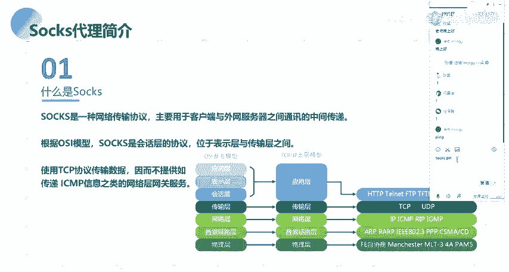

然后的话呃。这边的话就是给大家介绍一下我们为什么要去使用这样子的一个ss的一个通道。就是说我们使用这个so通道有什么样子的一个优势。就是说在现金的这样子的一个网络架构的话。

我们通常的话就是说内部网络与外部网络中间的话会有相应的一个呃阻隔阻隔离，对吧？我们通常会会使用呃防火墙等等的这种这样子的一些设备，把我们的一个内网与外网之间做一个隔离，对吧？就是说不让外部的一个网络。

能够去直接的去访问到内部网络，对吧？以及去限制内部网络呃，去访问外部网络的相应的这样子的一些呃呃方法协议。所以的话呃我们再去。呃，我们再去。内网与外部网络之间去进行这样子的一个通信的时候。

它会有这样子的一个呃阻碍，是吧？然后的话这样子的一个防火墙系统的话，它通常是以这样子的一个应用层的一个网关形式去工作在我们的一个网络中间。

它可以去对我们的这样子的一个netTP还有SMTP等等这样子的一些呃呃访问这样子的一些协议的一个访问的话，能够去做一些控制，对吧？而我们的一个收的一说使的话，就提供了这样子的一个框架。

来使我们这边去受限制的这样子的一些协议的话，我们可以通过我们的一个收死通道来去呃安全的透明的去穿过我们的一个防火墙。

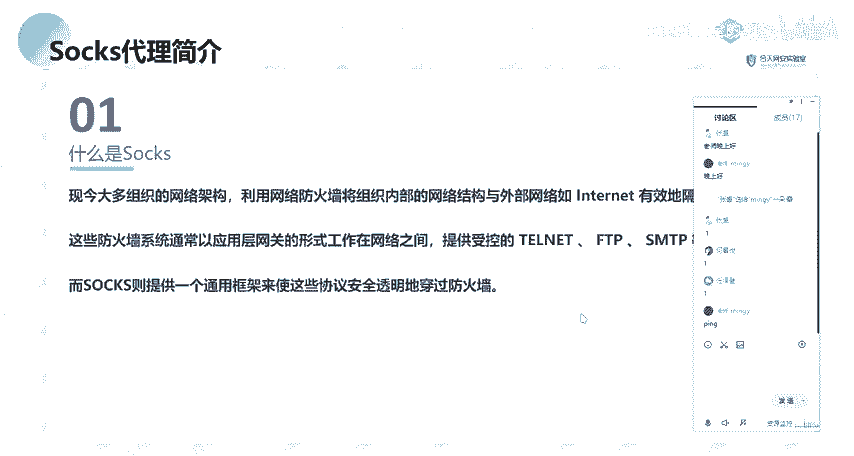

好呃。下面的话就是介绍一下什么是shop代。

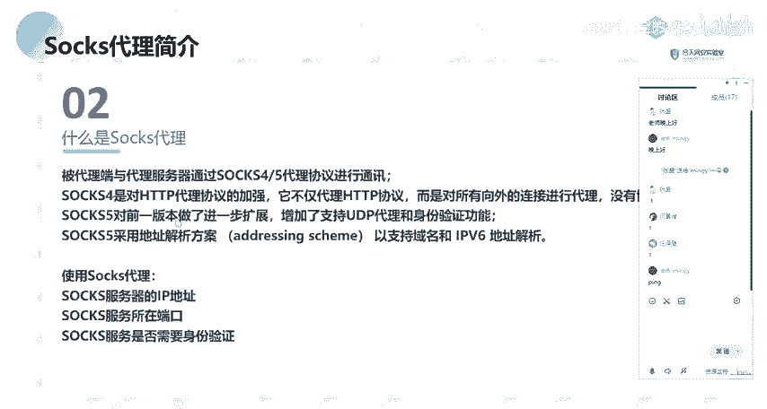

呃，在这边的话，我列了这样子的一个。嗯。

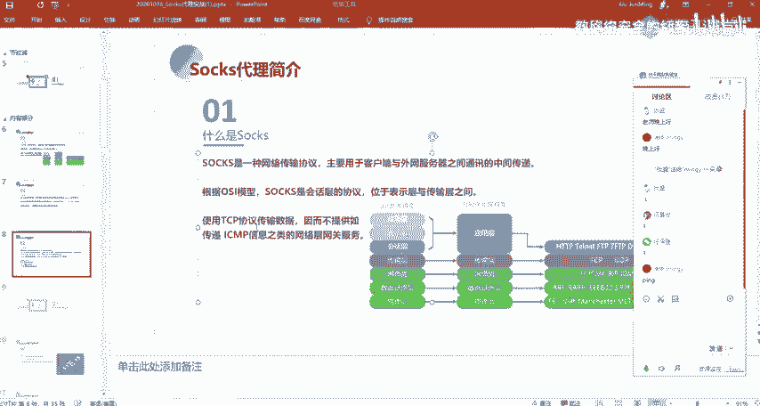

我列在这边的话，我列举了就是说ss4以及sox5这两个版本，它的一些特点以及它的一个呃一些区别。就主要的话就是让大家去理了解，就是说ss协议它的一个一些特性。然后的话呃。这边我们一起来看一下。

被代理端与代理服务器的话，通过我们的一个sox4sox5代理协议去进行这样子的一个通讯。然后呃s4的话，它是对HTP的一个代理协议的一个加强。就它不仅仅它不仅代理HDP协议。

它会对所有的这种向外的一个连接去进行一个代理。他没有一个协议的协议的一个性质。然后呃，s5的话，它是对呃s指四的话，这一个版本做了一个扩展，就增加了我们能够去支持UDP的一个代码，还有身份验证。

然后shop呃shop5的话，它采用了一个这样子的一个地址解析方案，能够去支持域名啊，还有我们的1个IV6地址的一个解析。这边的话就是带大家大概的了解一下。然呃在这边的话，我们还要注意的一个的话。

就是我们在去使用收词代理的时候，需要有下面的需要去了解下面的这三点。第一点的话就是说索服务器的一个IP地址。也就是说我们的一个客户端，我们就是说我们要去通过我们的一个这样子的一个代理去呃去呃。

就是说我们的一个被代理端与我们的一个代理服务器，我们想要去建立这样子的一个收索通道，对吧？然后的话建立收索通道之后的话，我们想要在代理在我们的一个客户端，通过这样子的一个代理服务器。

也就是通过建立的收索通道来去进行一个呃访问呃另外的这样子的一个呃网络的话，我们需要去知道这样子的一个代理服务器的1个IP地址以及他的一个端口。

然后呃一般的话就是呃一般的代理服务器的一个端口的话是1080。就是呃如果你不去做特页的一个设置的话，就是1080的一个端口。然后第三点的话就是收死服务的话。

你需要去确定他是否需要去进行这样的一个身份验证。就我们呃在这边的话有提到就是shops5的话，它增加这样子的一个身份验证功能。也就是说你需要去呃有有一个这样子的一个账号密码。

你才能够去通过这样子的一个ss通道来去进行一个呃。

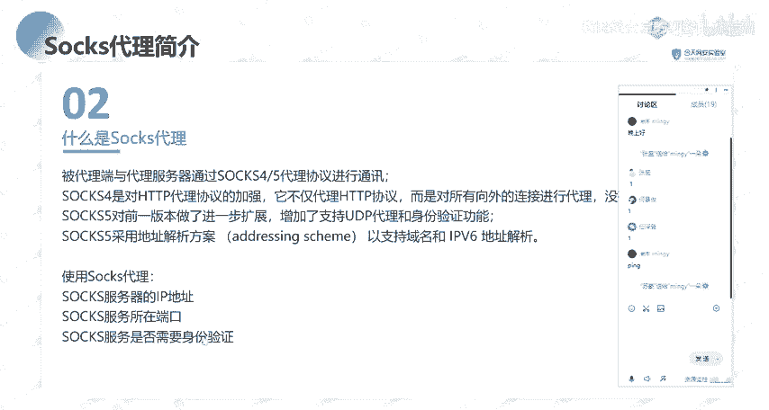

数据的一个传输以及访问。