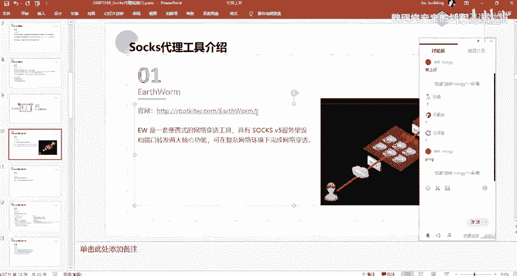
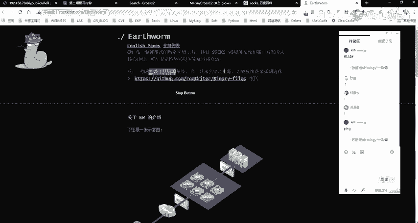
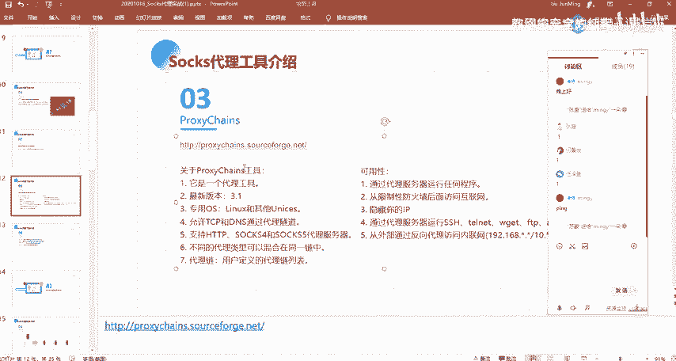
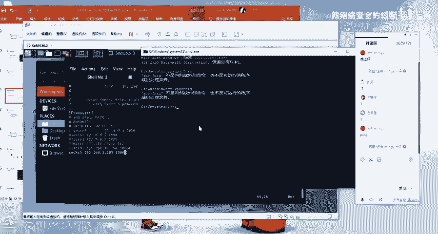
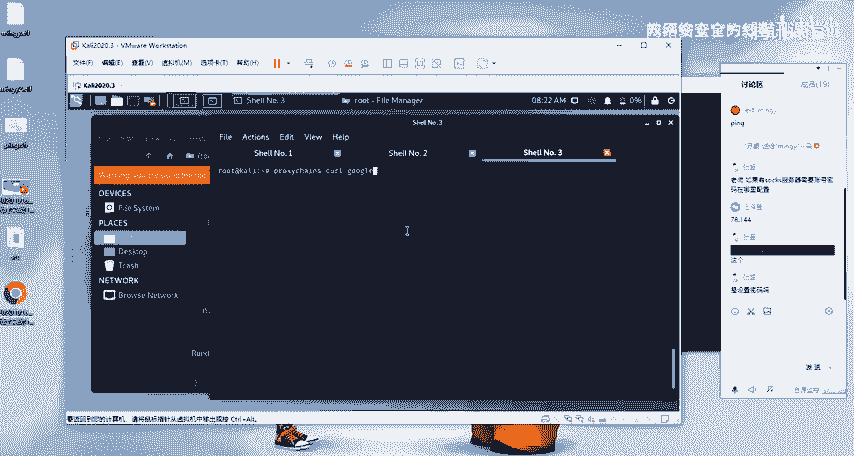
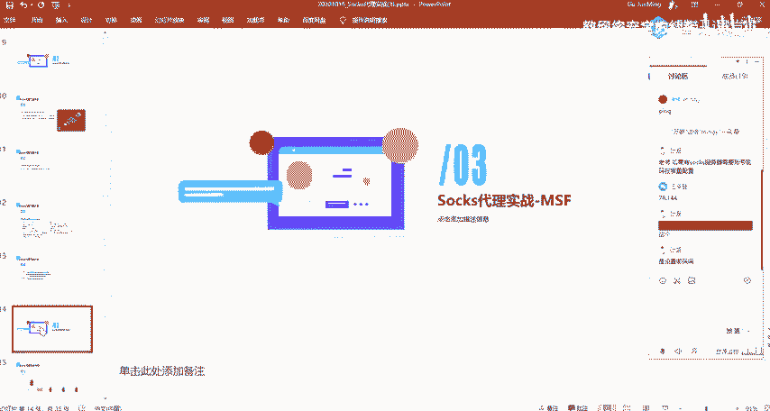

# 2024网络安全系统教程！清华大佬花159小时讲完的网络安全系统课！别再盲目自学了，学完即可就业！零基础入门网络安全！（渗透测试／漏洞挖掘／CTF／黑客技术） - P65：52.socks代理工具.mp4 - 教网络安全的红客 - BV1ft421A7Nj

嗯。然呃第二部分内容的话就是介绍一下说指代理的相关的一些工具。呃，这边的话。首先第一个就是这个S wormS worm这个工具的话呃是一个比较老就比较老的一个工具啊。但是这个工具的话。

它它的一个使用的话还是呃它的一个功能什么的，是呃。挺强大的一个呃工具。然后的话它是一个并携式的一个网络穿透工具啊，它的一个主要作用其实就是呃去进行一个内网穿透。然后它具有sox5的一个服务器的一个架设。

还有端口转发。也就是说我们可以通过这1个EW工具来去进行一个呃建立ss55的一个服务器，以及能够去建立sox5的一个呃代理的一个通道。还有的话能够通过这样的这样子的一个EW来去进行一个端口的一个转发。

呃，这边的话就是它的一个官网的话，是这一个大家自己去看一下。然后呃这个的话下载的话是。

在这边的话，他是已经没有提供下载了呀。

已经停止更新了。然后的话呃在那个工具包当中应该是有的。就发给大家的那个工具吧。如果呃没有的话，大家。呃，找我要吧，就在群里说一下，我发发出来。或者大家可以自己去网上去找一下。啊呃。

第二个的话就是这个FRP。FIRP的话，它是一个用于内网创造的一个高性的个反向代理应用。然后我们下节课的话会给大家去介绍，就是说我们在在。不去使用呀MSF或者说MSF的一个使用的话，不太适用的时候。

我们给大家介绍，就是说用FRP，还有像EW等等的这样子的一些代理的一个内网穿透的一个工具来去进行一个内网的一个呃穿透。呃，然后的话这一个工具的话是呃我个人是比较喜欢使用的。

然后的话它的一个功能配置什么的也是比较好用啊。然后的话呃，第三个的话就是这个clo chance。 cross chance的话呃，大家在那个can news里面的话，应该有去使用过吧。

然后这一个工具的话也是我们经常去使用到的。以及其实我们呃就我们在linux系统里面呃，我也会通常会去使用这样子的一个proch来去做这样子的一个代理。

就说比如说我这边对吧我这边的这一个linux机器，我这边的一个开里机器，我想要去就是说我想要，因为我现在的话是在呃国内，对吧？我想要去访问国外的一个网站，那么你想要去访问国外的一个网站的话。

你就需要做一个代理，对吧？你需要有你自己的一个呃这样子的一个。就是BPN。然后的话你想要你要去做做这样子的一个一个代理的话，我们就通常的话会去使用这样子的一些。呃，就这样子的一些工具，对吧？

就这样子的一些工具。然后这里的这样子的，我在这边的话是使用的是1个SSR呀。然后的话呃如果大家也是跟我使用使用的一杆呃，使用的是同样的的话，你可以在这边去做这样子一个配置。就是你右键那一个小飞机嘛。

然后有一个选项设置，也就这里，然后勾选这一个允许来自局域网的一个连接，然后改一个代理的一个端口。我这的话是10800是吧？然后的话我在这边我是无法去直接的去，比如说我去访问一个。谷歌。

我这边是去访问的话，是无法直接去访问到的。然，呃我在这边的话就可以通过配置这样子的一个pro change。配置这样子的一个代理。然后呃我配置这边的一个代理的话就是这样子啊。首先的话是so5。

然后的话如果说你是使用的是一个so4的话，你就是写这样子的个shop4对吧？然后的话中间的话就是你的一个代理服务器的1个IP。然后在这边的话就是你的一个端口。我在这边的话，因为呃。看一下。我在这边的话。

因为是我在我当前的这个windows机器上面对吧？然后呃我的这个windows机器的话，我的一个本地IP看一下。

是这个192。168。78。114。呃，账号密码的话。账号密码的话是呃对，就说在这边的话，在这边就是说在MMSF当中的话，是没有支持这样子的一个账号密码的一个配置。

在这个pro呃pro change应该也是不支持的吧，我看一下。应该是不支持的。然后如果说你是要去使用这样子的一个，你需要去账号密码的一个配置的话，我在这边的话就windows上面的话。

我推荐给大家一个这样子的一个工具。就是其实我在这边有给啊，这边就这一个一个全局代理的一个工具。然呃其实等会也会去用到这一个，就是说我去代理我自己本地的这样子的一个一些，比如说远程桌面对吧？

MSTSC以及呃其他的这样子的一些工具。没题。就是这一个就在运行内容这边有给啊。

啊，等会他会给大家介绍会去使用这个，就是在这边的话呃去做一个相应的一个配置。我们可以把我们自己应用自己本机上面的一个应用程序，把它给就是放入到这样子的一个代理工具当中。

然后的话我们在使用这样的一个代理工具的时候，我们的一个流量的话，它是会走我们所配置的一个呃通道。呃，我这边的话是。好的。Yeah。然后的话我再通过这个close change这一个工具。

我们来去请求一下这样子。我给你看了。嗯。嗯。780144。哦。不好意思。我说怎么不行？这里我这里IP搜错了。各位同学。看的相当认真啊，比我的看的认真啊，现在的话没有问题啊。

就是我们可以看到在这边的话已经连接了，对吧？就是在这边看到这些ok的话，就说明已经连接成功了啊。然后像在上面这边太帽太帽的话，就你需要去检查一下，就你要去检查一下你的一个代理的一个配置。就是。Yeah。

你说的是这个吗？啊，这里啊。那应该就是可以的，就在后面直接加账号密码。应该可以。啊，那可以啊，就直接在你的一个端口号后面加你的一个账号密码。但的话呃，我没有我没有试过，我没有这样试过。一般的话呃。

我不会去设设一个这样子的一个密码。是到哪来的？没有防问到。

哦哦，现在的话是没有问题了，对吧？就你直接去CRR的话，他会有这样子1个301的一个跳转。就是他你直接去访问他这个域名，他会去跳转。然后他是跳转到了这一个，这边的话就说明我们是已经访问到。

然后的话是走的我这边的这样子的一个呃概念。这边它就是这个pro change的一个工具的一个使用。然后我们之后的话会使使用这样子的一个工具，就是说用用pro change。

因为我们的一个count里里面，对吧？有很多的这样的一些工具。比如说你想要去把我们的1个Mm。把我们的个map的一个工具，把它代理到我们的一个目标的一个内网当中去进行一个端口的一个扫描，对吧？

然后的话我们就需要用这个工具。好，让我们的m的这样子一个请求的一个流量走我们的一个代理通道。啊呃，还有的话就是其他的这样子的一些工具，像呃IEGOG这个的话在讲后面讲那个HTP代理的时候会给大家去讲。

以及还有这样子的两个就是说呃跟前面类似的一个收词代理的一个工具。这个的话是windows上面的一个收的一个全局代理工具，大家可以去使尝试使用一下。这个也是。

