# 2024网络安全系统教程！清华大佬花159小时讲完的网络安全系统课！别再盲目自学了，学完即可就业！零基础入门网络安全！（渗透测试／漏洞挖掘／CTF／黑客技术） - P66：53.内网渗透场景流程.mp4 - 教网络安全的红客 - BV1ft421A7Nj

好呃，以上两张的一个量的话，大家应该没有什么问题吧。哦，这里的话你可以去试一下呃，看他的这样子的一个描述的话，应该是就是我刚刚说的，就是直接在那个端口上面接我们的一个接我们的一个账号密码。

然后他这边是支持HDP的一个代理，还有s是shop5的一个代理的。呃，前面的12章内容大家有没有什么问题，应该没有什么疑问吧。嗯，前面的话就是一些理论的一个。介绍啊。好，没有问题话。

那么我们继续第三章的一个内容。在这边的话就是这个第三部分呢，就是我们今天主要的一个内容。我们主要的一个时间也是给大家就是讲解这边。也就是呃shop战有的一个实战，就是利用我们的1个MSF。

然后首先的话来了解一下这样子的一个渗透场景。这边的一个这个渗透场景的话，我这边是使用的，就是在预习内内容当中有给大家提供的这样子的一个靶场。这个CFS的一个商层靶场。呃。

这个靶场的话是这边的这个坐的他搭就这个6。

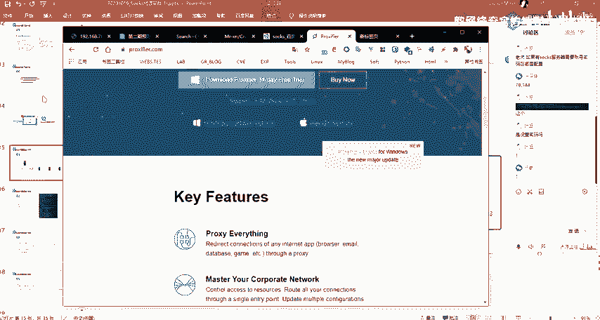

呃，这个团队吧，他们搭的这样子的一个靶场。然后呃我觉得他这个靶场的话就是用来讲这一个就是内网穿透的时候的话是比较好用的。然后的话也便于大家去进行一个理解。以及就是主其实主要的话就是他已经搭建好了，对吧？

我只要去用就可以了，就不用不需要我再去就是再去搭建这样子的一个环境，也便于大家自己去进行一个呃那个去搭建嘛，对吧？就不需要自己再去手动的去搭建。所以的话你直接去用它的这样子一个拔痕就可以了。

我们主要的话是用它来去就是呃理解我们这边的一个内网穿透。然后呃关于这个靶场的一个详细的一个信息，大家可以去看他的就是这个作者他的这一个文档。

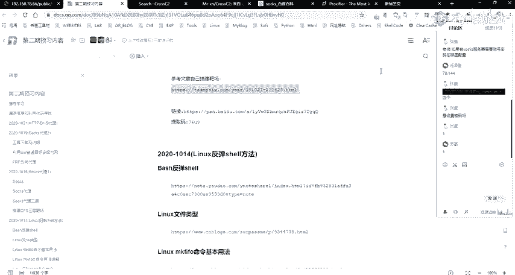

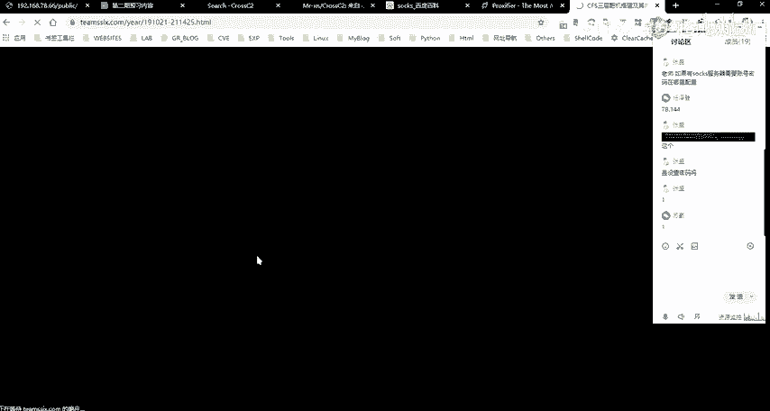

然后其实他在这边的话，就呃有介绍了他的一个环境搭建嘛，以及怎么去进行一个攻击，对吧？在这边的话。

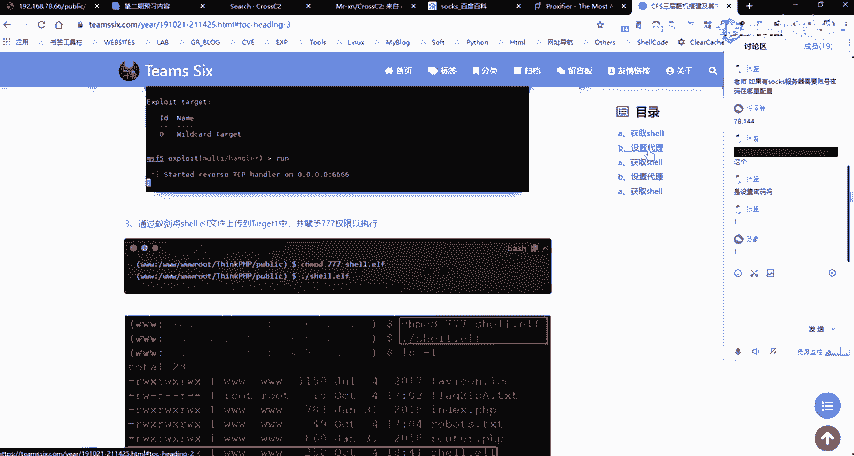

关于具体的一个攻击的话，呃，我我是这样计划的，就是具体的这样子的一个步骤的话，我在这节课上面会有讲大概的，就是我只会去大家可以去大家看我的一个操作，对吧？然后的话我要大概的过一下。

然后的话再把在我讲完之后的话，大家把这个靶掌作为自己的一个课后作业。

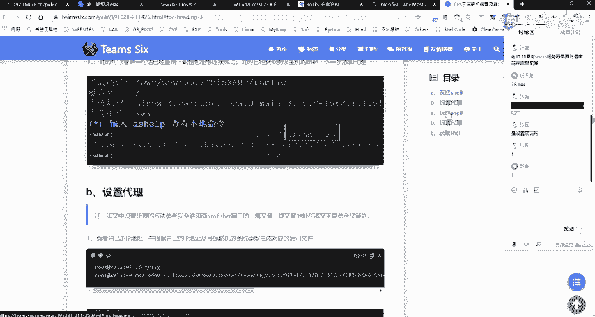

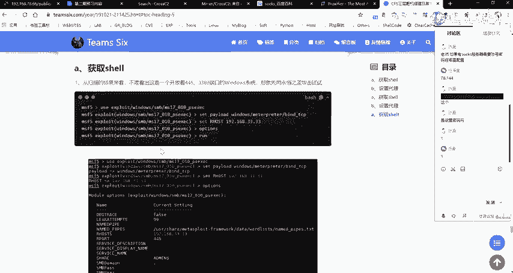

自己自己动手去呃，走一遍，好吧，然后的话有问题问我，就是你需要你需要你自己去进行一个尝试，你可以就是照着他的这样子的一个方法，但是你。一定要自己去进行一个动手，好吧。

或者就是说你可以通过他这个靶伞去去尝试自己其他的这样子的一些利用的一个方法，对吧？

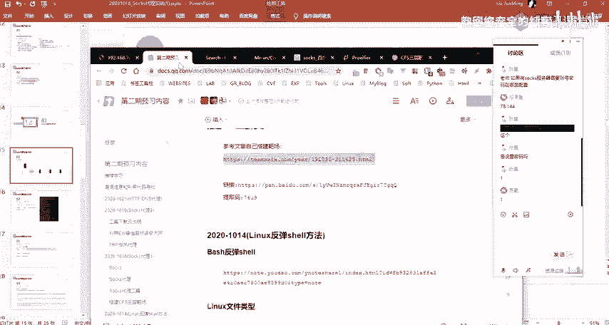

然后呃，我这边的话，这个靶场的话是在我另外的这个机器上面，就是在这边的一个虚拟机。

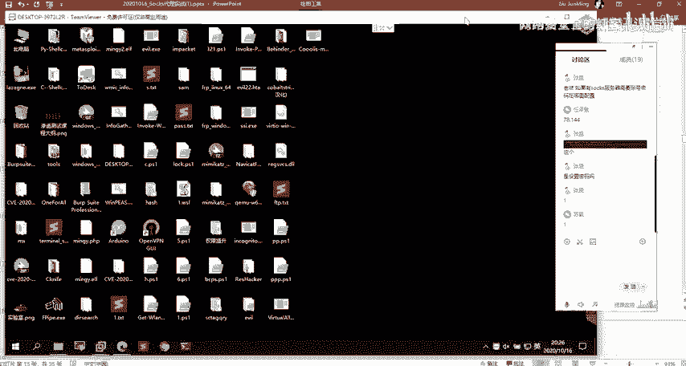

就是这三个机器。首先的话呃这三个机器的话就是。这个机器这个机的话就是作为我们的一个外网的一个机器啊，就是呃这个78。66在这边的话，因为在之后的运程当中会通经常会去用到这样子的。

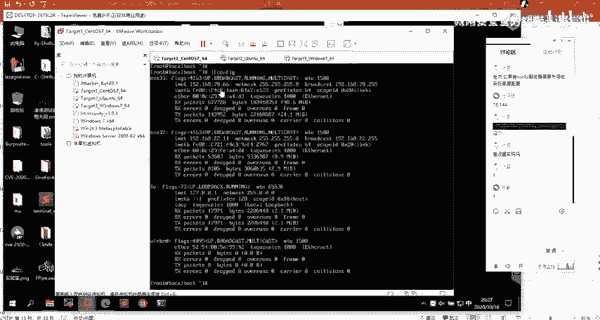

这样子的个IP。然后的话呃我们再来回过头来去看一下这样子的一个场景。呃，但的话这个场景这边的话。看一下。呃，首先的话我们先来看一下这边这边的这一部分，这边的这一部分的话呃。

就是表示我这边的一个atack的话就是我的一个攻击机器，对吧？然后的话我这边的一个攻击机器的话呃，这边有1个VPS这个VPS的话就是我自己的1个VPS。然后的话我们已知一个公网的一个目标。

就是我这边的一个。电梯。对当然的话我这边它是一个内网的1个IP啊，因为我这边是在内网嘛，是吧？就是你把它当成是一个公网的1个IP就说公网IP它有它的一个就是特性的话。

大家应该就是大家再去理解这样这样子的一个公网IP内网IP的时候，你就。呃，以及再去配这样子的一个靶场的时候是吧，就我们的一个公网IP只要就是说我们是在不管是在内网还是在公网。

我们都能够去访问到这1个IP是吧？你要这样子去理解。然后在这边的话，我们把这1个IP作为1个公网的1个IP，也就是我这边的一个攻击机器，以及我这边的1个VPS都是能够去访问到的。呃，当然的话在这边其实。

啊，是。就实际的话，在我这边的话是没有用到这个VPS。就是如果说你要去进行一个呃攻击外网的这样子的1个IP的话，你是需要1个VPS做一个中转。因为你的一个攻击机器攻击机器是在你的一个内网，对吧？

然后的话如果说你想要去反弹sha的话，你除非是做这样子的一个就是说做你的攻击机与与你的1个VPS做这样子的一个呃内网的一个窗透，也就是把呃反弹的一个sha要。

通过我们的一个公网的一个VPS来就是带理到你的一个呃内在内网的这个机器上面的呃。比如说MSFF的某一个端口上面去，对，然后的话我们才能够去实现这样子一个反弹性。的话这样子的话就呃稍微显得有点就是复杂。

然后其实我们就只需要就是有1个VPS对吧？然后的话如果说你要用MSF的话，你在VPS上面去装一个公网的1个VPS的话，这样子的话会显得简单一些。就是你的一个操作。

以及你去理解这样子的一个操作的话会比较简单一些。当然的话如果你没有就是说你不想在公网VPS上面去搭。然后的话你对这样子的一些操作熟悉的话，那么你可以直接在你的一个就是说在你的一个内网。

你只需要有一个公网PS就可以了。你可以在你的一个内网的一个看理机器上面，对吧？就你直接用你的一个内网的个看理机器做作为一个呃接受线的一个。

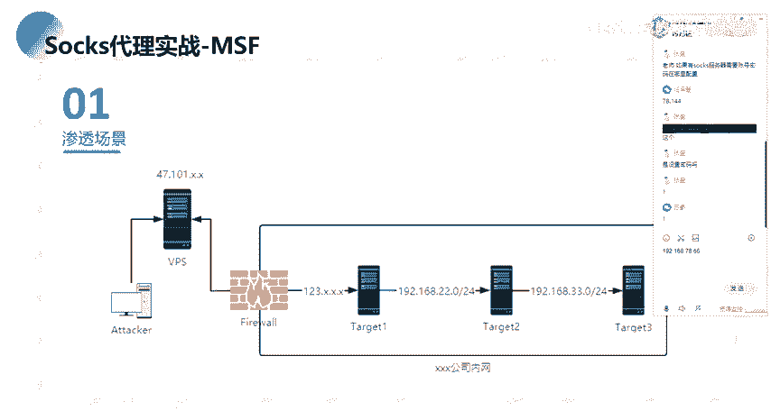

呃，机器。然后的话就是在这边这一边的话就是某某公司的一个内网。然后这个内网的话有这样子的三台机器，也就是我们的一个t卡的123这样子的三台机器。然后我就我们知道的话，就是我们那个公网跟我们的呃。

这边的话，其实应该这边这个图有点问题是吧？就是我这边的话，其实这个防火墙应该是在就是说在我们的一个公网跟我们的内网之间，对吧？也就是我们在前面也有讲的，像这种DMZ区域的话。

就是说我们的一个公网的1个VPM我们公网的一个服务器，就是。这一个公司它的面向外网的这样子的一些服务的话，它会处在这个区域。然后在这个区域的话，是我们就是说他在呃是我们在外网能够去直接访问到的。

以及在内网的话，也能够去访问到这样子的一个机器。然后呃这边的一个tt一的话，就是我们这边的这一个IP所对应的一个机器啊，也是对应的这样子的，有一个外网的1个IP。

然后t一t2之间的话是1个22的一个网段，以及呃33的一个网段，也就是在这边的话有这样子的12两层的一个网段，是吧？两层的一个内网网段。然呃在这边的话就是这样子的一个场景啊。

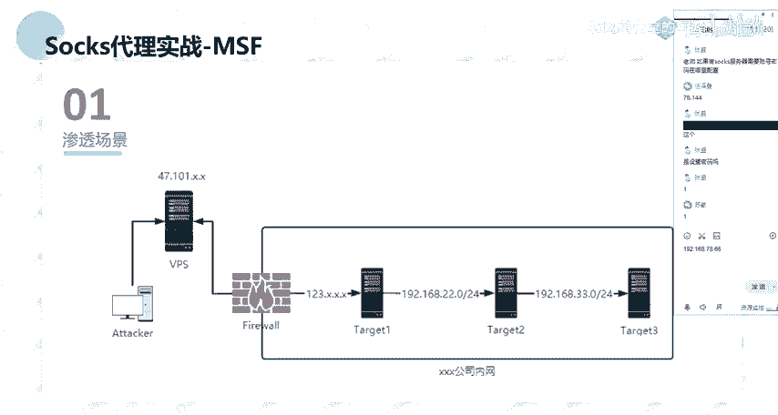

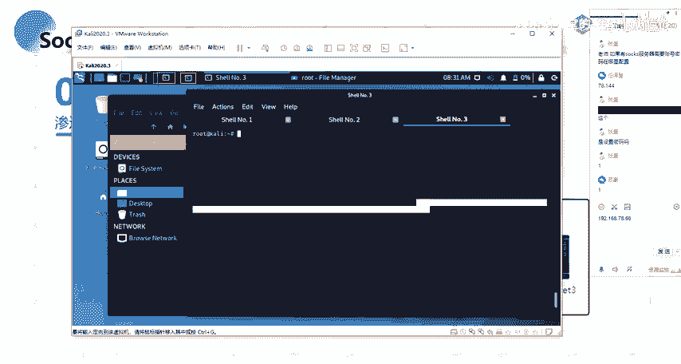

就对应的一个机器的话是。

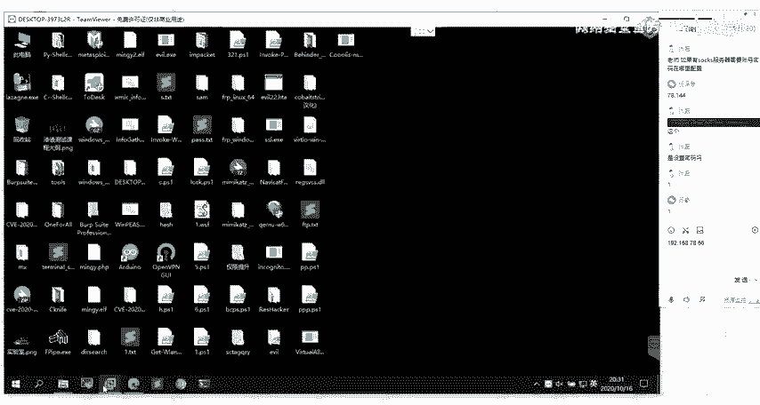

这边就他给你的话，这边的话就是呃你把它当成是一个外网的一个外包服务是吧？或者说外网的一个呃服服务器。然后这边的这两个机器的话就是它是处于一个内网。然后我们要做的话就是通过寻找这一个外网的这个外呃。

这一个服务器的一个漏洞，对吧？通过拿下这一个外网的这一个机器。然后的话拿下这个机器之后的话，我们以这一个机器作为一个跳板，就作为一个中转，作为一个跳板机。然后的话通过这一个跳板机来去穿透来去攻击呃。

这一个内网的一些机器。

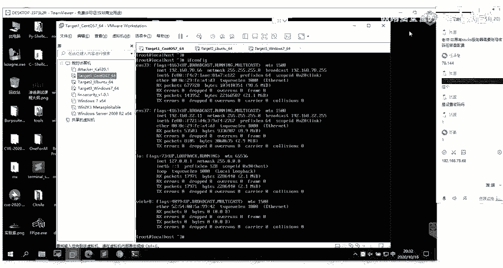

好呃，这边的话就是场景的一个介绍。下面的话我们具体来看一下。

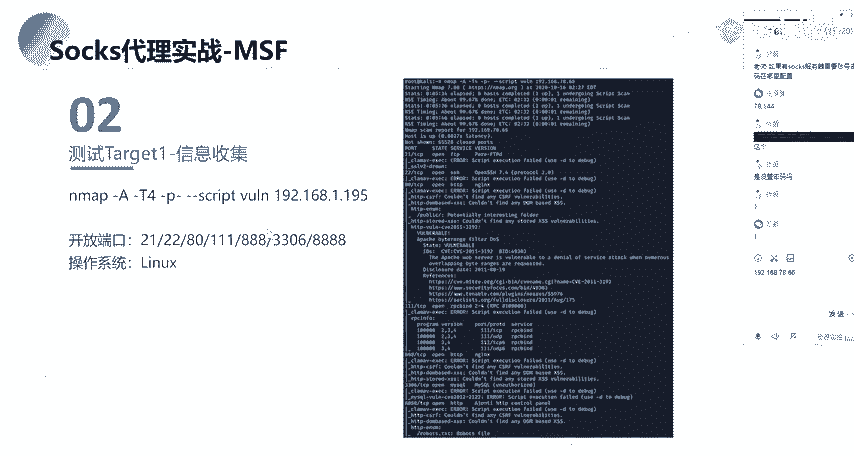

呃，我这边的话PPT里面的话其实已经写的比较详细了呀。其实就实已经很详细的给大家介绍。

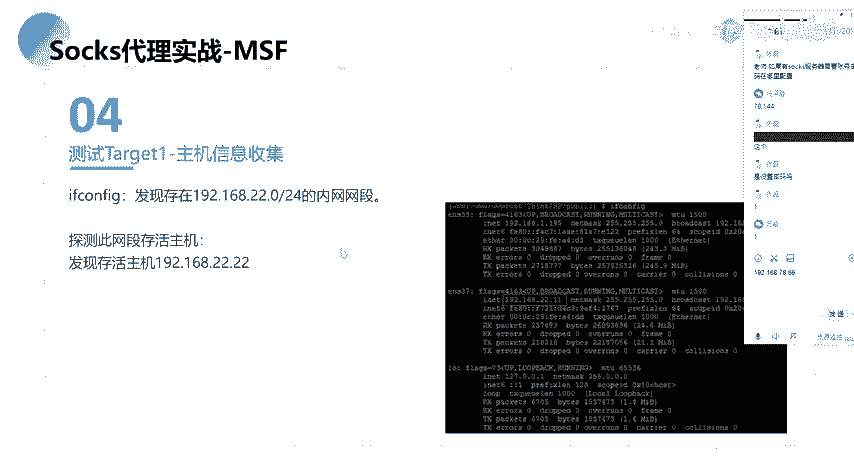

啊，我在这边的话，就大家跟着我的一个思路走，好吧。

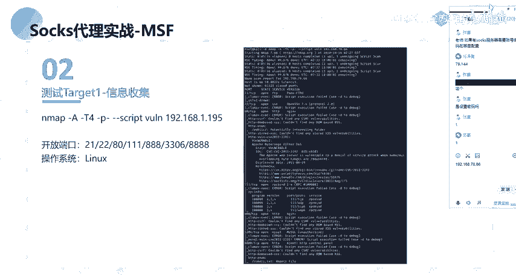