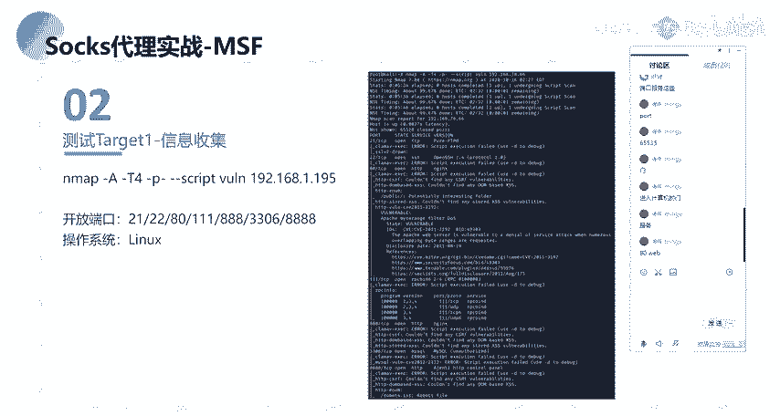
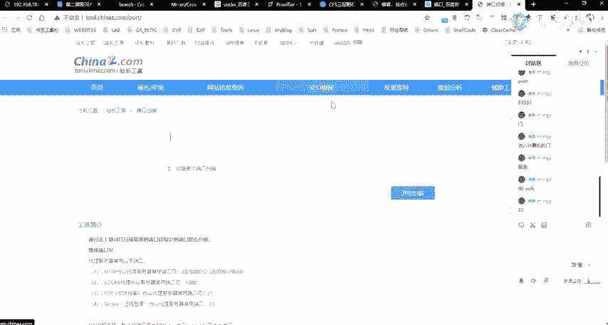
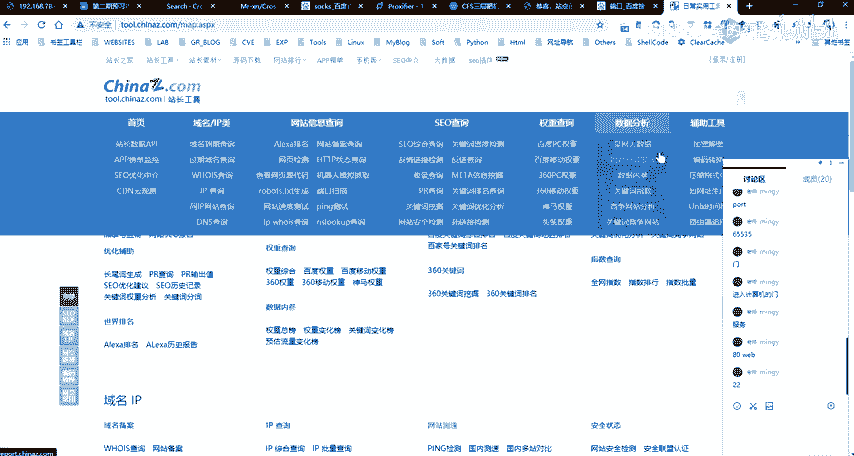
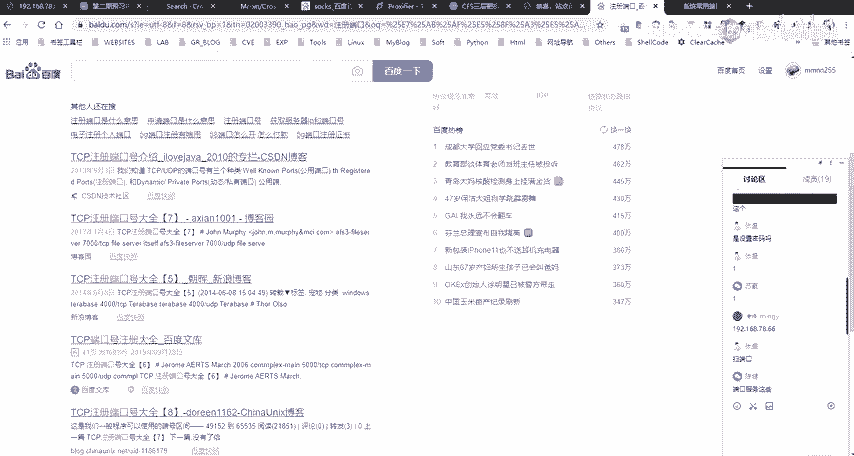
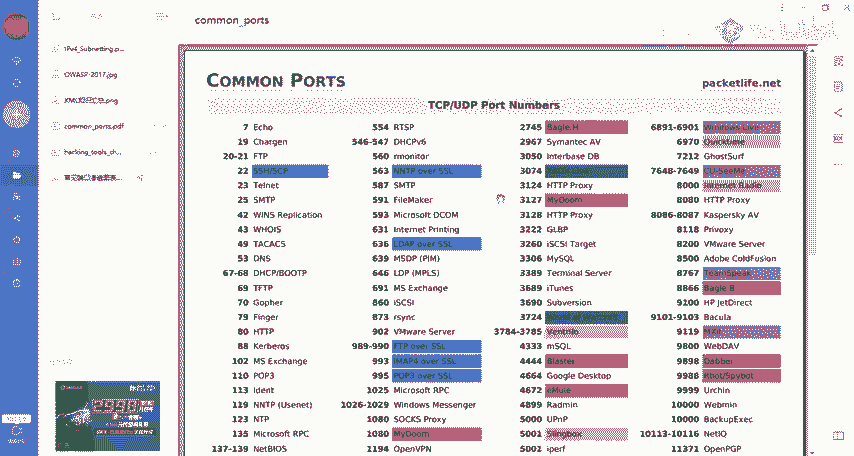
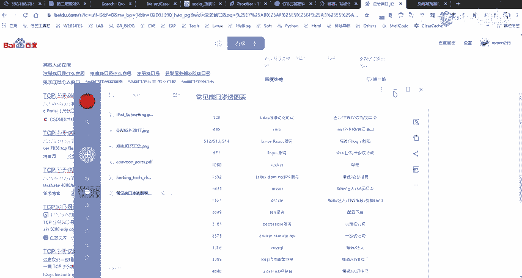
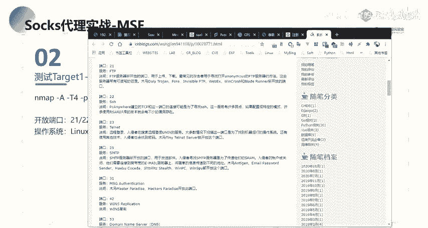
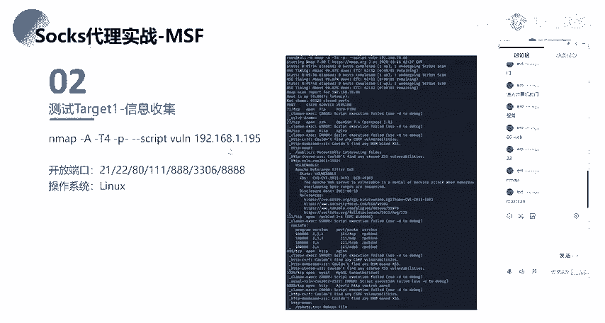
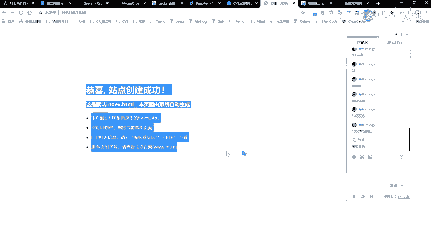
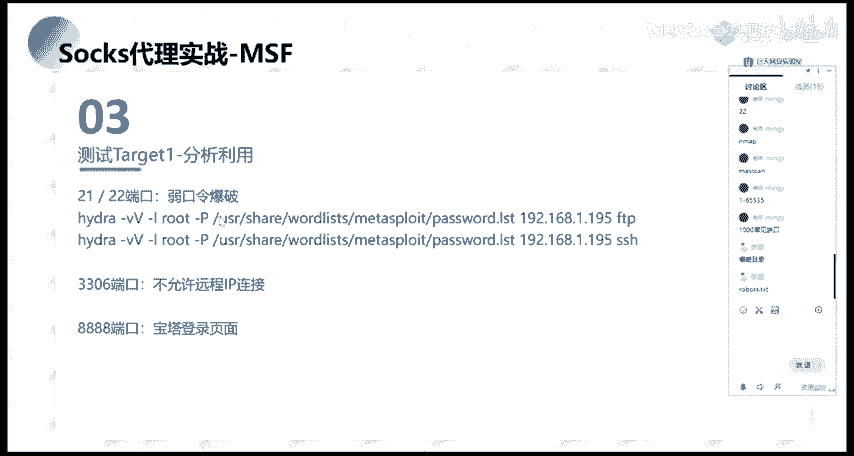

# 2024网络安全系统教程！清华大佬花159小时讲完的网络安全系统课！别再盲目自学了，学完即可就业！零基础入门网络安全！（渗透测试／漏洞挖掘／CTF／黑客技术） - P67：54.信息收集.mp4 - 教网络安全的红客 - BV1ft421A7Nj

然后首先的话我们就说我这边已知了这样子的1个呃IP对吧？我这边已知这样子的1个IP，然后我把这个IP给你，你要去对这个IP做一个渗透，做一个攻击的话，你首先第一步你会去干什么？

就是说你首先想到的想到的第一步你会去对这个IP干嘛？有同学回答一下吗？就是呃我记得之前的话在讲那个信讲那个内网信息收集的时候，有同有同学问我就是。呃，就是在去内网信息就我呃是我忘了是什么来着，就是。

你得到的内网的一个得到的一个需要，对吧？然后的话你知道他那个IP那么你对这个IP你会去干嘛？然后其实在去做内网的一个信息收集的时候，跟外网的一个信息收集。它的一个思路其实大同小异啊。

对吧就说你在内网的1个IP跟你在外网的1个IP你对这个IP你需要去收集的信息是什么呢？就是说首先第一个就是端口。就port嘛对吧？也就是port嘛。因为我们的一个端口的话。

大家呃能理解端口的这样子的一个概念吗？啊，我们有每一个计算机的话，有65565535。有这么多的一个端口对吧？然后的话这一些端口的话，就是说每一个端口它你可以把它理解成就是一个门。就是理解成是一个门。

就是进入计算机的一个门。对啊。然后的话每一个端口的话就是一个进入计算机的一个门。那么我们要如何去知道就是说我们要去知道怎么去进入这一个计算机来去访问这个计算机的话，我们需要去通过这样子的一些门，对吧？

也就是我们需要去知知道它有哪一些门，也就是对应的我们需要去知道它有哪一些端口。然后对应的每一个端口的话，每一个门后面的话，它都有相应的一个呃服务。然后每一个端口呃，当然的话就是说如果你对应的一个端口。

它开放了，那么它开放的这个端口，后面的话，它对应的会有一个服务的一个开放，对吧？然后的话我们通过这样子的一个端口就能够去访问到对应的一个服务。像比如说我们常见的一个80的一个端口，对吧？80的端口的话。

它默认的话是一个web的一个服务。也就是我们通过呃访问web端口啊，不访问80的这个端口的话，我们就能够去访问到这个web服务。然后呃大家可能会就是大家应该都知道的。就我们的一个浏览器的话，它就是。呃。

默认的话，你去访问，比如说你去访问1个IP，你没有加这样子的一个8联端口，它同就是说它默认的话，它是把它就是。

我这边的话以这个IP为例吧。就比如说我这边去。访问这一个。呃，因没这个IP对吧？然后这个IP的话，我们直接去访问这个IP，我们后面没有接端口。还有的话，它默认的话就是我们的1个8年端8年的一个端口。

这边的话大家应该都知道，然后这边的这一个端口的话，其实它对应的就是一个外表服务嘛，对吧？就默认的一个外表服务。当然的话还有像像其他的，像比如说我们的通ca的话，就是默认的是8080嘛，对吧？

然后我们如果说这一个机器它对应的开放了一个tomca，然后它的一个端口话是8080。那么我们去访问这一个tca的一个服务的话，我们就需要通过IP加这样的一个端口来去进一个访问。对吧。

所以的话我们知道这个IP那么我们需要去知道它这个呃服务器上面它所对应的开放了哪一些服务。那么我们首先就去就需要知道它开放了哪一些端口，对吧？

然后的话我们再通过这一些开放的一个端口来去找到它对应的一个服务。然后我们要去进行应用的一个点，其实就是根据它的开放的这一些服务。像比如说我们的一个外表服务，是吧？我们的一个外包服务的话。

也就是我们的一个外b外包服务的一个漏洞的一个挖掘，是吧？然后还有的话就是像其他的像呃比如说你的一个link机器2223摄取对吧？21FTP还有3306等等的这样子的一些端口。呃，在这边的话。

关于这一些端口，它所对应的一个默认服务呃。

有一个我忘了是哪一个来着。Yeah。端口。哎，是有一个是张总这家还是哪个网站来着？最楚楚。嗯。

呃，看一下我这边吧。

这边的话呃有这样子的一个表啊，这个表的话就是我们常见的这样子的一个端口，以及它所对应的一个服务。然后像比如说我们53就常年这中53端口，它所对应的一个呃服务的话就是我们的1个DNS。

比如说我们就一般的话我们对吧我们的一个机器，我们想要去访问访问域名的话，我们都需要有1个DNS对吧？也就是说呃。

都需要去访问我们的1个DS的一个服务器。然后的话还有的话就是80HDB等等。还有其他的这样子的一些端口。在这的话，我们可以去可以通过这样子的一个表去做进行一个进行一个紧锁，对吧？然后的话我们就。呃。

这边的话就是我们针对常见的我们这边的常见的这种端口号啊，以及它对应的一个服务，我们可以去就是说有相有针对性的这样子的一个攻击的一个入侵的一个方式。在这边的话有这样子的。一个表啊。

像比如说我们那1个22对吧SH取的一个远程连接，我们可以对它去进一个爆破，对吧？以及还有openSSH取的一个漏洞。呃，然后的话还有就是像我们的。呃。比如说呃3306对吧？330的话就是数据库嘛。

就包括注入，还有3389等等的这样子的一些像7001默认的呃，它是web logic。那么我们这一个端口的话，我们就能够去访问这个端口的话，就能够去访问到对应的个web logic的一个服务，对吧？

然后的话去针对这一个web logic的一个服务去进行一个攻击，对吧？还有其他的这样子的一些呃默认的一个端口号，以及它对应的一个路侵的一个方法。

呃。

呃，这是第一个对吧？我们对它做一个端口的一个扫描啊，那么我们扫描端口的话，我们通常会去使用什么样的一个工具呢？啊？就我们通常是呃做这样子的一个端口扫描的话，一般会去使用CM，对吧？没有。

ms scale对吧？以及还有其他的很多的这样子的一些端口扫描的一个工具。但的话呃最有名的就是这两个吧，应该应该是就是M map的话，就是它的一个这个这个工具的话，应该不用多说，前面应该也讲了，对吧？

然MS scan的话也是一个刚刚扫描的一个工具，它的一个优点的话就是扫的特别快。然后Mm的话就是扫的特别详细。就通常的话我们会去结合这两个工具，就是首先的话用mss again对吧？

就是通过快速的对目标的一个端口去做一个呃存活的或者说开放的一个扫描，对吧？然后的话再根据它开放的这样子的一些端口，用m来去做一个更详细的一个呃扫描。然后在这边的话，我们针对我们这边给变的这个IP对吧？

我们我这边的话使用了map，直接去对它做一个信息的一个收集。然，做一个信息收集的话，我这边使用的就是呃这样子的一个方法是吧？然后MF当中的话有自带的这样子的一个script，也就是它的一个脚本呃。

有一个这样子一个外的一个脚本。这个脚本里面的话，它有自带的这样子的一些常见的就说一些漏洞的一个检测的一个呃。呃，残见漏洞的一个检测，对吧？然后我们可以去使用这样子的一个。

去使用这样子的一个脚本来去做一些基本漏洞的这样子的一个探测。当样的话探测出来的话，就是说你这些漏洞可以看到在这边它有探出来探测出来像这种variable，对吧？其呃像这种的话呃它的一个缺点的话。

就是比较老了，而且它的一个准确性的话没有什么保证啊。当然的话呃我们可以使用这样子的一个方式，就是能够去比较详细的去呃列出来它的一个端口号，以及它所对应的这样子的一些服务，对吧？

就主要的话用这个就是做一个突破的呃初步的一个探测了。嗯。好，呃在这边的话。

呃，在这块，因为我之前的话已经扫过了，而且扫这个的话可能会需要一点时间。因为我这边的话是少的一个全端口，就扫的是一个全端口。呃，我这边这个 map的这样子的一个语句，还要我跟大家介绍一下嘛。

就大概的说一下吧，就Map干A的话，就是就是比较一个综合的一个扫描，就干A的干大写的A呀，就它会显示就是呃对应开放的一个端口，以及它所呃开放的这样子的一些服务的一个比较详细的一个信息啊。

以及你的一个系统的一个版本啊什么的，对吧？就你的他要去探测你的一个OS。然后的话呃杠T4的话就是干T的话就是呃时间序列，就我们这边的一个T选项的话，有1到5是1到5吧，我没记错了。

1到5的这样子的一个梯度。然后就是你的一个数字越大的话，你的一个就是爆括的一个就是你去进行一个探测的速度话就越快。当然的话你的一个速度越快的话，那么对应的一个准确准确准确性的话。

那么就肯定会相应的一个降低，对吧？然后杠T干的话就是扫表示扫描群端口。扫描群端口是什么意思呢？也就是扫描1到65535的一个端口。就呃其实我看大家的话有在群里发发那个对吧？就是你去扫描端口的时候。

你扫描端口的话，你没有去加这个杠P杠的话，那么你那么m它默认的话，它是扫就是。呃，前1000个就是常见的一个端口。就少前1000个团建的一个端口。是1000个吧，1000个还是1万1万1万个人。

反正就是说你默认的话，他不会说去把所有的一个端口都做都做这样子的一个探测。它会取前前1000个就是常见的这样子的一个端口号去进行一个探测，是前1千还是前一万，应该是1万吧。呃，这个的话。啊，好。

不用纠讲啊。然后的话就是指定我们的一个脚本。我我这边的话就是使用的这个官能的一个脚本，然后借我们的1个IP。然后在这边的话，我们就少就通过在这边呃能够得到它得到这个IP它所对应的一个开放的一个端口。

以及它的一个服务，对吧？像比如说21FTPS2的话SH以及它对应的这样子的一个服务的一个版本，对吧？还有80。8年的一个端口，以及在这边8年端口的话，我们可以看到他在这边有有进行这样子的一个枚举啊吧。

有枚举出了这样子的一个目录。就我们在这边的话。对我们在这边直接去访问这个IP的1个80端口。主要的话就是这样子，就是。这样子的一个默认的就站点创建的一个页面，对吧？那么我们。得到这样子的一个页面。

没有其他的多余的一个东西。大家通常的话会去首先做的。大家通常会去就是做什么。有同学回答一下吗？呃，要不先休息一会吧，就50的时候我们再继续。好吧，然后的话呃大家思考一下这样子的一个问题，就是我这边对吧？

我这边知道了1个IP以及它这样子的一个页面，它是一个80端口已经开放了。然后的话这个页面的话，它没有多余的一个东西。那么我们如何去对这样子的一个80的一个端口的一个外表服务器做一个测试呢？

好吧，大家想一下，然后等会呃，我再。好，我们再回过头来看一下PPT。

呃，在这边的话，我们通过m对吧？对他对我们这边给的的这1个IP做了一个基本的一个信息收集，就是探测它的一个端口的一个存活啊，以它所对应的一个服务。那么我们下一步要做的话，就是针对这样子的一些端口，对吧？

我们去对它进行一个分析的一个利用。

