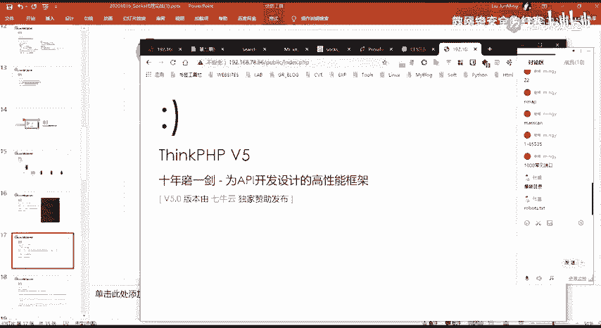
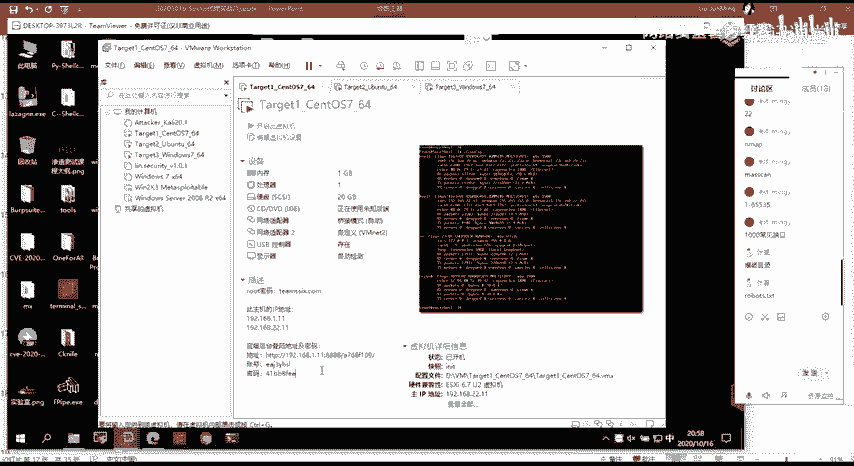
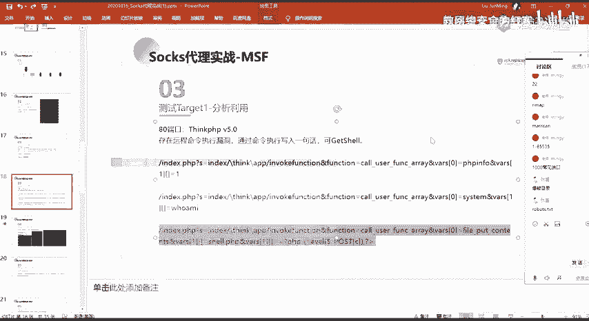
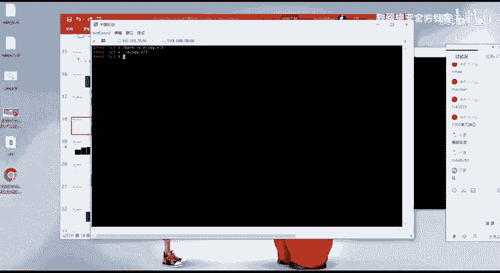
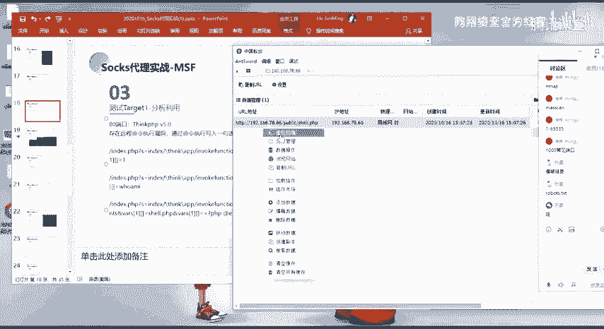
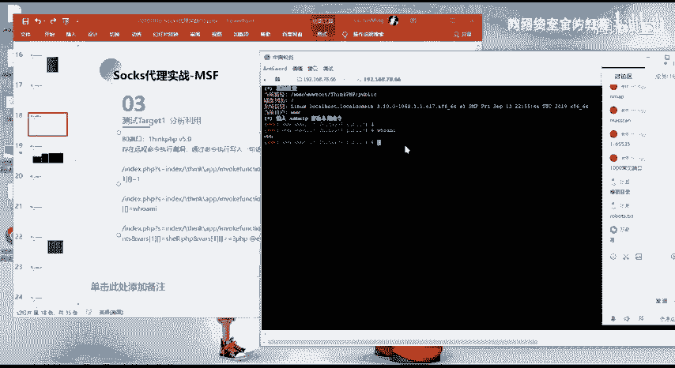

# 2024网络安全系统教程！清华大佬花159小时讲完的网络安全系统课！别再盲目自学了，学完即可就业！零基础入门网络安全！（渗透测试／漏洞挖掘／CTF／黑客技术） - P68：55.寻找突破口，渗透服务器.mp4 - 教网络安全的红客 - BV1ft421A7Nj

然后像比如我们前面探测到2122号的这种端口，对吧？我刚刚的这样子的一个这样子的一个表，对吧？我们可以看到就2122端口就常见了这样子的一个录侵方式，就对就包括。然后还有当家的话还有就是对应的。

像比如说SN端口的话，像这种openSSH的一个这样子的一个漏洞，对吧？就是这样子的对应端口，它所特定的这种服务的一个漏洞，我们可以去进行一个尝试。

然后一般的话就是说我们会去对这样子的一个端口做这样子的一些入口入口令的一个包裹，对吧？像我们的一个呃FTP以及SSH取的话，如果说我们它存在一个入口令的话，我们可以直接去进行一个登录。

然后的话能够去得到呃对应的这样子的一些呃权限，以及呃对应的一些文件，对吧？然后在这边的话呃，我就大概的就是提一下，就是对我们可以通过hydr。呃，就是。开出了就呃，这个是九头蛇了。英文是叫九和石啊。

这样子的一个工具。这个工具的话，它是一个密码爆破的一个就密码爆破爆破的一个工具啊。然后我们可以使用这样子一个工具，对这样子的一个对这个IP它所对应的一个所开放的一个服务啊。

去进行这样子的一个落口令的一个爆破。然呃，对应的3306的一个端口的话呃。如果说就是3306端口的话，我们知道它所对应的是一个数据库的一个服务，对吧？然后这样子的一个数据库服务的话。

如果说它是允许我们的一个远程连接的话，那么我们可以尝试去进行一个远程的一个登录。也就是对这样子1个3306的一个端口去做一个啊就是。呃，落肯链的一个爆破对吧？当然的话前提是呃要允许一个远程的一个登落。

然后的话如果一般的话，他是不会去允许你这样子的一个就是呃3306端口的一个远程连接的啊？当他如果说你发现就是呃管理员，对吧？他是通过这样子一个远程的一个方式去管理他的一个数据库的话。

那么你可以去尝试对他做一些爆破是吧？然后的话直接能够去得到他的一个数据库的一个权限。然后呃这边还有888的一个端口，这个端口的话是呃它的这个靶场的话，它这个把机的话，它是搭建的这样子的一个。

它是用这样子的一个薄薄塔面板搭建的。所以的话它宝塔的话，它有这样子的一个呃默认的一个端口，就是888的一个端口。这样的话，宝塔密板的话，你要去访问的话，你需要它会有这样子的一个。

就是它会去生成一个随机的这样子的一个呃目录。就是说你需要知道那个那个目录，你才能够去访问到对应的一个登录的一个页面。像比如在这边的话呃。

像比如在这边的话呃，大家可以就是在这边能够去看得到他在这边，他在把机这边有写，就是这边后台的一个登录地址以及密码。然后呃有它会有这样子的，就是你保产安装之后的话。

它会生成一个这样子的一个随机的一个支符串，是吧？它会有这样子的一个目录。然后你需要去访问这样子的一个端口，以及它的这样子的一个目录，你才能够去访问到他的一个后台的一个登录的一个地址。嗯。

也就是说如果你不知道这个的话，那么你连去对他做一个密码的一个报破，都没法去做。

也就是你访问不到他们，是吧？嗯。然后还有的话就是80端口。80端口的话，其实也是我们经常会去经常碰到的，也也是我们经常能够去进行一个漏洞利用的这样子的一个端口。因为80端口的话。

它运行着我们的一个外表服务，对吧？然后外表服务的话，它存在漏洞的一个可能性的话是比较大的啊？然后我们在这边的话，也是主要的是通过这样子的一个8年端口作为我们的一个突破口。啊，呃在关音端口。

我们前面访问对吧？通过访问以及通过目录的一个包破来发现了这样子的一个页面。这个页面的话，它提示是我们的一个生个PKPV5对吧？以及它的一个版本在这边也列出来了。那么针对这样子的一个一些信息的话。

我们可以根据这些信息来去进行相应的一个就是说这种CMS的这样子一个漏洞的一个紧锁，也就是通过百度啊、谷歌对吧？等等的一个方法来去呃紧锁这样子的一些紧锁这1个CMS它所存在的这样子的一个历史的一个漏洞。

啊。然后在这边的话就是呃。我们看到这个PB5的话，就自然而然个去想到，就是之前报的这样子的一个远程命令执行的一个漏洞。然后这一个漏洞的话，它是我们可以去通过命令执行来去写入一句话来去get笑。好。

呃在这边的话，我们可以通过这样子的。通过这样子的1个POC来去进行一个印证。嗯。像比如呃在这边的话，我们可以看到我们用的这边的第1个POC的话。我们这边用的第1个POC的话是这个对吧？

然后在这边访问之后的话，他他执行了1个PP in的一个信息，就输出了当前的呃服务器。它的一个PP in的一个信息是吧？然后在这边的话，我们就能够基本的判断它是存在这样子的一个远程命令执行的一个漏洞。

因为它在这边它执行了我们呃在这边所写的1个PP的这样子的1个PP代码。对的。然呃关于这一个漏洞的话，大家可以自己自行的去检索，就是它的一个漏洞形成的一个原理。在这边的话。啊，我主要的话就是就是。

给大家介绍一下这边的呃，他的一个命令执行的一个构造。然后在这边命令执行的一个构造的话，我们是通过这样子的一个function。呃。

我们这边的一个function的话是这个就这一个co your的function area。这个co you的 functioneverever的话，大家可以去查一下，就是呃关于这一个函数的话。

我们可以。就是说可以看到他在这边像比如说一句话是吧？就是说这个函数的话，我们可以用它来去写一句话。也就是说这个函数它能够去执行呃，能够去进行相应的一个命令的一个执行。

然后这边的话呃其实大家可以去看一下这个函数，它的一个具体的一个使用，就是它会把一个数组作为一个参数来去调用一个回调函数，然后的话去进行一个执行。

然后执行之后的一个返回类的结果的话就是呃就是在这边我们调用的这个回调函数，他所返回的一个结果。然后在这边我们具体来看的话就是。具体看这边在这边的话，我们使用这样子的一个函数，对吧？

然后在这边有这样子的一个virus的一个数组是吧？然后 virus数组的第一个就是第一个参数，对吧？第一个参数的话，它的一个值的话就是这个PHP4。第二个参数的话唯一。好呃在这边的话就是。

等于就是说他会把就是说这边的这个函数，他会把数组当中的这样子一个参数作作为一个呃就是去进行一个执行。然后的话在这边他去进行一个执行的话，那么他就会去解析这边的一个配 in。

我们知道我们在呃PB当中的话去解析这样一个P in的话，它就会输出对应的这样子的一个信息，对吧？呃。然后的话就是第二个。第二个的话，我们。同样的来尝试一下。第二个的1个POC的话就是这样子。

我们执行执行之后的话，可以看到在这边它返回的一个结果是这样子，1个3W。然后这边的一个3W的一个结果，它是怎么来的呢？也就是在这边我们执行的这样子的一个换卖。也就是说我们这边通过他的一个命令执行。

执行的一个换卖的一个命令，也就是这边它的一个当前的一个权限的话，就是这样子一个3W的一个权限。那么他在这边他所他执行的话，他是执行的什么呢？它是怎么去进行一个执行的？

同样的他也是通过这样子的一个呃call的 functionever这样这样子的一个函数啊，它会去把这边的一个stem。就是说他把这一个数组当中的第一个参数，它作为一个回调函数，也就是sstem。

然后的话他会去呃执行我们这边的这样子的挂卖。就是相当于就是。执行的是这样子的一个。System。关慢。然后的话就输出了我们这边的一个结果。这是第2个POC。然后第三个的话就是我们可以用它来去进行一个。

巴布需亚的一个写入。这边的一个写入外不需要的话呃。主要的话就是使用的是这样子那个fire put contains。这个发布的contents的话就是呃。前面前面应该有讲了。

就fi put content的话，它是把我们的一个就是把我们的一个字符串就是存保存到一个文件当中，对吧？就是将一个字符串写入文件当中，就是使用这一个发布 content。

然后在这边他同样的也是使用这一个函数去进行一个呃构造。然后所执行的一个代码的话就是这个fi content。然后执行的呃利用这个 content这个方法。

把我们这边的这一个代码把它写入到了这个需要点PP当中。然，其实在这边的话就是我们的一个一句话嘛。呃，我这边的话。需要要30。是。在这边执行执行之后的话，他返回了这样子的1个25啊。

然后返回了这一个东西的话，就说明我们这边的话，它是没有错误的。它是有正确的去执行我们的这样子的一个命令。那么我们在这个的话就已经在当前目录下面已经写出了这样子的一个需要点123点KP的一个文件，对吧？

我们直接去访问，没有报错，那么说明就对了。就说明存在这样子的一个文件，而且他已经做了一个解析，对吧？然后我们在这边的话，我们就可以通过。这样子的一个文件去进行一个命令的一个执行。各需要。嗯。

我们去进行一个执行，对吧？以及去执行相应的一个命令。到时执行换卖对吧？3W以及执行。和ID。对，能够去进行一个命令的一个执行。然后在这边的话，我们就能够去进行一个。

。用我们的一个需要的一个管理工具来去得到这边的一个需要。

嗯，我这边的话是只查的。呃，我这边的话，这是我之前的。我就就用这一个吧。然后在这的话，我们就已经得到了他的一个需要。然后其实在这边其实可以看到这边写入的一个文件的话，就是这个需要123点PP对吧？

然后我们在这边的话就能够去对他进行一个操作。就是呃。就是这1个80的一个端口的一个。渗涛测试。然后这边的话就我们就已经基本上已经测试完了，对吧？就是对这边的这个这一些常见的这样子的一些端口，对吧？

我们扫出来的这样子的一些端口的一个测试。当然的话在这边我只前面这边的话，我只给大家提供了一些思路，对吧？然后呃主要的话就是我们这边的一个8联的一个端口，就是它的这一个外网服务作为一个突破口。

然后的话我们通过这个突破口来去进行一个得到这个就是外网的这个呃服务器的一个切，对吧？

也就是这个。

嗯。然后那么我们现在的话得到了这个sha，就其实我们现在的话就已经进入到这个服务器，对吧？