# 2024网络安全系统教程！清华大佬花159小时讲完的网络安全系统课！别再盲目自学了，学完即可就业！零基础入门网络安全！（渗透测试／漏洞挖掘／CTF／黑客技术） - P69：56.收集服务器信息.mp4 - 教网络安全的红客 - BV1ft421A7Nj

得到这个服务器的一个权限。那么得到这个服务器的一个权限的话，我们下一步要干什么呢？大家回想一下，就是我们前面的话就已经呃前面的前面的内容的话，其实就是这样子的一个步骤啊。我们下一步会去干嘛？

就说我们这边已经得到这个机器的一个需要是吧，那么我们下一步。

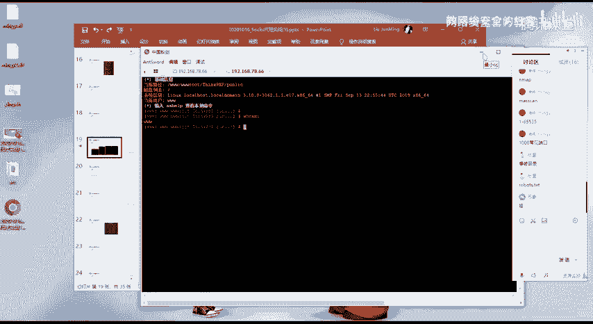

有同学回答一下吗？下一幅话同样的也是进行一个信息收集嘛，是吧？就是说你这边你得到了这一个机器的一个需要是吧？然后其实跟我们前面在讲那个讲内网渗透，啊不讲内网信息收集的时候，其实不也是一样的一个道理？

是吧？我们要去对内网信息一个收集的一个前提的话，就是说我们已经得到了一个呃能够去访问内网的一个需要是吧？那么我们在这边得到这个需尔之后的话，我们同样的需要去对他做一个信息收集嘛。

因为你去做这样子的一个测试的话，你信息收集领不了的，就是第一步。因为你知你只有知道了对应的一些信息，你才能够去说能够去进行对应的一个操作，才能够去进行一个测试。

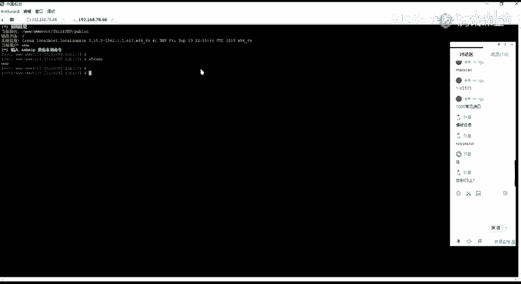

好，呃，在这边的话，我们。呃，具体的一个主其主要的呃，其实。准确的来说话就是主机的一个信息收集啊，就是说对我们这边得到这个主机，对吧？去进一个相应的一个信息收集。然后我们这边的一个主机的话。

它是一个linux的一个主机，其实就是回到了我们前面讲的一个linux主机的一个信息收集，对吧？就对它的一个网络，像比如说查看它的一个呃网卡，对吧？它它有哪一些网段，也就是使用iffi。

然后其实我们在这边使用if空空fi之后的话，可以发现的话，在这边它有两个网卡，就有这样子的一个ES33以及ES37的这样子的两个网卡，对吧？

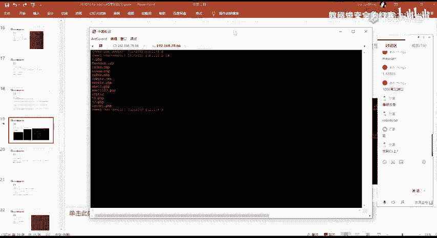

然后这边三上的这个网卡的话，就是我们的一个呃外网的1个IP嘛，对吧？我们就是通过这1个IP进来的。然后这边的1个ES37的话，我们发现它有这样子的一个呃内网的1个IP。

那么就说发现了有这样子的一个内网IP之后的话，呢，就是说他给了我们什么信息呢？

也就是说，当前的这个机器的话，它是可以去访问在这里的这个内网IP的这个22网段的。对吧因为他在这边的话，他是呃有这样子的一个能够有这样子的1个22网段的这样子一个网卡。

我们可以通过这一个网卡来去访问22网段下面的所有的一个主机，对吧？而且这1个IP的话，它是一个内网的1个IP也就是说这一个主机它是能够去访问到这个2网段的这个内网的。那么下一步的话。

其实就是进行一个呃内网的一个信息收集，对吧？当然的话呃，主机信息收集的话，我没有去说更多啊，对吧？就是因为前面的已经讲了，对吧？然后我们这边的话主要就是走走思路，好吧。我这边对吧收集网络。

还有相应的一些进程啊，对吧？以及去去进行相应的。像比如说我当前是一个3W本的一个权限是吧？后面也会讲，就是去进行一个提全是吧？提全的话，那么你需要同样的也需要去进行一个信息收集，对吧？

因为你要去确定就是说我们对这个机器它是否能不能去提全，以及能够通过什么样子的一些方法去这个提全啊。还有其他的像查看他的一个连接啊，对吧？比如说。要查看它的一一个连接，它有哪一些连接以及IP。

的一个就是有这样子的一个连接是吧？以及他是他的这个连接，它是从哪1个IPI从哪1个呃IP连接过来的对，我们可以去进行相应的一个信息的一个收集。然后下一步的话就是一个内网的一个信息收集。

就我们已经发现了有存在这样子一个内网的一个网段，对吧？那么我们就可以把我们这边得到这个需要的一个机器作为一个内通网这一个二网段内网的这一个跳板机，对吧？我们可以通过这个机器来去访问这个内网，对吧？

那么我们首先第一步的话就需要去探测这一个2这个网段它所存活的一个主机，它有哪一些存活的一个主机。因为我们需要去知道就。

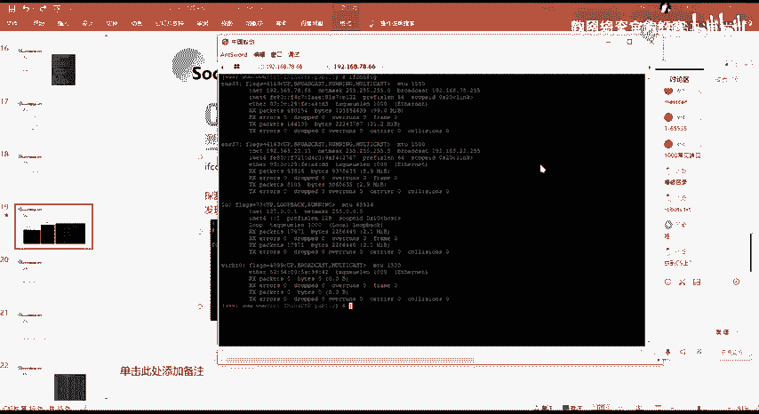

呃，我们知道一个网端对吧？一个网端的话，它有很多的这样子的一些主机。那么这些主机的话就是说呃一般话是1到254嘛，对吧？1到5次。那么这些主机我们需要去知道哪一些主机它是开放的，就开放是什么意思呢？

也也就是说在这一个网站下面有哪一些主机，它是呃开启的，也就是哪一些主机，哪一些计算呃，哪一些电脑对吧？哪一些服务器它是呃开启的。因为我们的一个呃电脑，我们的一个计算计算机，我们的一个服务器。

你开启之后的话，它就会去有它会有分配这样子的1个IP对吧？因为你只有你只有分配的IP，你才能够去进行一个访问嘛，对吧？那么在这边的话，我们就需要去对这个网站去做一个存头主机的一个一个探测。

在这边的话，我们使用的是呃就是通过。

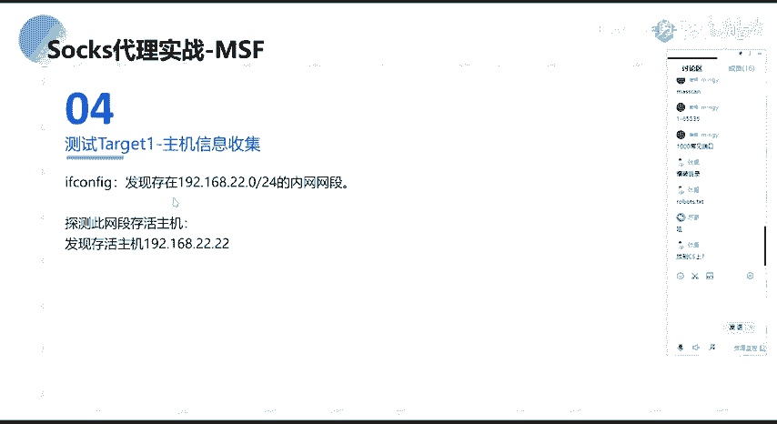

这样子的一个方法就是通过写了这样子这个需尔脚本，就是通过拼的一个方式就。呃，在内网当中的话，在内网当中的话去用聘的一个方式去进行一个这样子一个主机成活的话，呃，是比较快的一个方法。

当然的话就是说如果说它的一个主机，它是竞聘，以及在内网当中，它是就是说你的一个聘的一个流量，你是。被禁的，那么就呃可能就不能去使用这样子一个方法。然后我们在这边的话，就通过这里的。

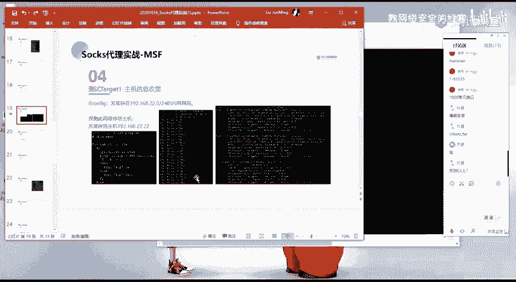

一个脚本。就其实这个脚本的话也比较简单。对呃，然后其实像内网主机的一个存活探测的话，呃，前面不是已经有讲嘛，对吧？前面讲内网信息收集的时候，呃。

后面的话有列举了很多的这样子的一个内网存活主机的探测的一个方法，对吧？嗯。😊，然后呃在这的话，我们就使用这样子的一个最简单的一个方法啊，就是通过拼的一个方法。然后这边的话是写的一个需要的一个脚本。

这个脚本的话其实就是用了一个for循环。然后的话呃去并历这一个网段的从1到254的这样子的1个IP对吧？然后的话就通过P的一个方法，然后每一个IP的话就拼一次。干是一指定添的一个次数。

然后其实在这边你会发现有同样的有这样子的一个就是这样子的一个东西，对吧？现在的话大家应该能理解了吧啊就是呃。干低V闹的话就是把它的这样子的一个呃输出，对吧？它会把它置为空。

然后2-嗯的一的话就是把我们的一个标准的就是把我们的一个错误的一个呃输出，它会把它就是从定向到我们的一个标准的一个输出。嗯。然后下面的话就是做了一个基本的一个判断嘛，就是判断它是吧，就如果你拼通了。

对吧？你片空的话，那么他就会呃有相应的一个数据，对吧？

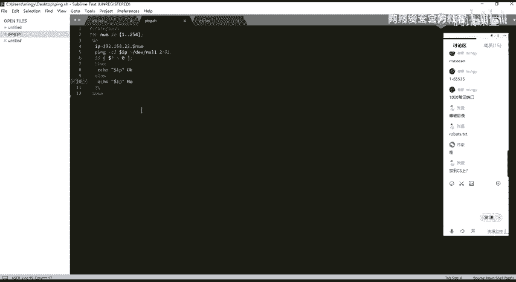

就他你拼你拼的话不是会有那一个。

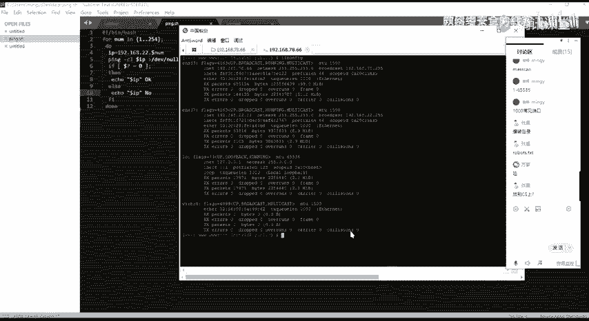

比如说。你听听一个那个。对。嗯。怎么发问那呀。像我们在这边的话，我们拼的话。像我们拼这个78066对吧？我们拼拼通了之后的话，它就会有这样子的一个数据返回，对吧？然后的话呃如果有的话，就输出这个OK嘛。

没有的话就弄嘛，对吧？

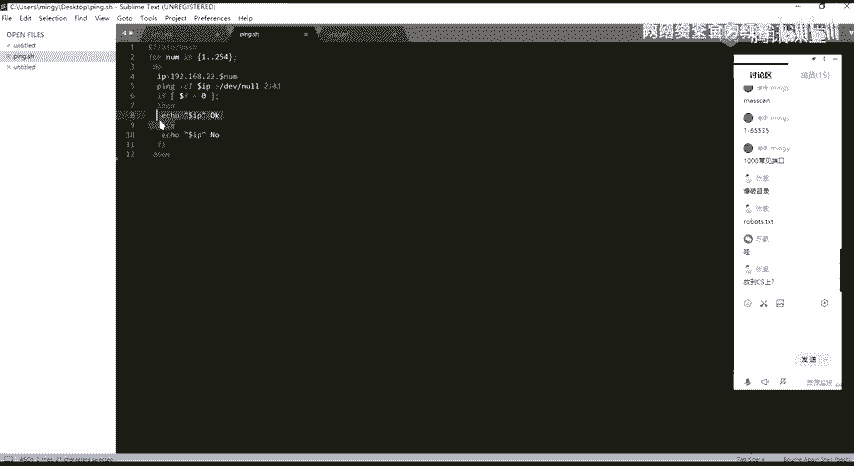

然后呃在这边的话。

我们可以通过就是说通过我们这边得到这个需要，对吧？我们这这边的话能够去进行相应的一个文件的一个操作。然后然后的话我们就可以向我们的一个这个机器上面去呃上传，下载我们所想要的一个文件啊。

然后在这的话我已经上传了这样子的一个需要的一个脚本。然后在大家去进一个上传这个需要脚本的时候，你可能就是会有碰到这样子的一个问题啊。

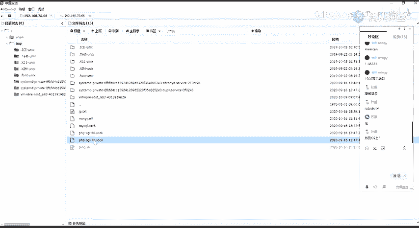

就是因为当前的话是一个lininux的一个系统，是吧？How嗯。我先先执行吧。然后存在这样子一个拼点SH的一个脚本对吧？然后我这边的话拼点。来去执行这一个去要脚本，然后把它的一个输出从面向到这个IP点。

IP一点太丑这个文件当中。

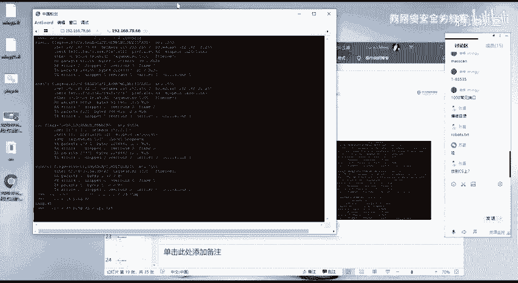

然后在这边的话执行的话，它会就是说在引进当中，你去执行这样子一个命令的话，它会自动的去把这一个东西把它放到后台去啊。然后我们可以通过ca来去查看这1个IP1点tex的这个文件，对吧？

然后其实如果你刚开始看你会发现它只有这么一点，对吧？它其实是这个脚本，他还没跑完了。好。你每次看的话，他都会增加一个，对吧？然后在这边的话会有这样子一个问题，就是在windows当中。

因为我们的话通常就大部分同学应该都也都是使用的一个windows的一个系统，然后在windows系统当中去。

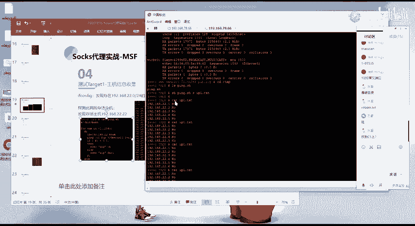

写这样子的一个这种脚本的话，一定要注意，就是呃你的那一个就是说你要去传到这样子的一个linux系统上面的话，因为我们的一个windows的像这种编辑器。

它会呃它会去啊像我们的一个notote pad对吧？等等这种它会。

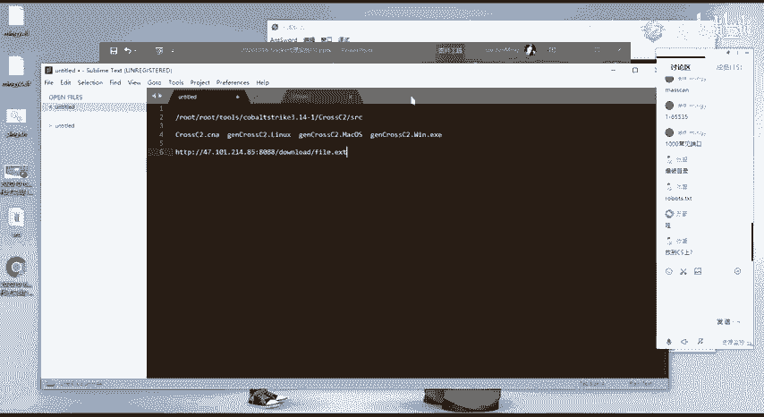

对对，在这一个。文件当中去添加一些多余的一个信息，多余的一些东西，以及啊因为windows已经令时的一个编码的一个不同了。然后你在windows上面，你通过这样子一个编辑器去写的这样子的一个脚本的话。

你去执行的话会报错。就可能会报错。然呃一般的话就建议大家在linux系统上面去去写这样子的一个脚本。然后的话上传到这个呃目标机上面去。然后上传上去之后的话，我们执行执行之后的话。

就能够去得到这样子的一个结果。就我们其实可以在这边看到有存活的一个主机，对吧？像2。1，然后2。2。然后在这边2。1的话，其实就是我们当前的这一个机器的一个IP。那么我们就。从这边能够得知。呃。

当前这个网端的话有这样子的一个主机存活，就是这个2202的这个主机，它是存活的。那么我们下一步的话就是呃需要去对这个主机做一个测试，对吧？因为我们知道它是存活的，那么同样的。

我们首先第一步的话就是需要去对他做一个信息的一个收集嘛，是吧？然后知道他的1个IP我们对他做一个信息收集的话，就是使用MSF啊不是是使用呃使用呃Mapp啊，还有等等的一些端口扫描的一些工具，对吧？

然后在这边的话，我们想要去呃访问这1个2顶2这个机器的话，在这边会存在一个问题。就是说我们当前的话是我们当前去访问这1个2顶呃2这一个网段的一个机器的话，对吧？我们是需要在这一个机器上面去进行个访问的。

也就是这一个。

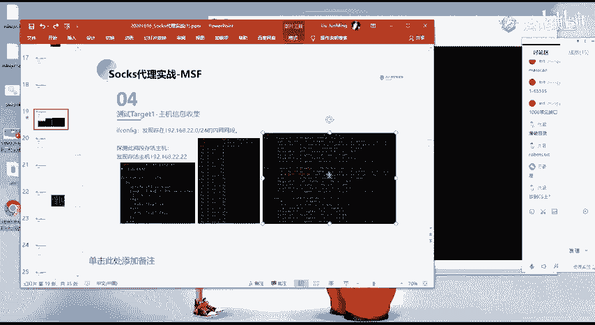

呃，这一个。78。66这个外网的这个服务器对吧？这个跳板机上面才能够去访问到。那么我想要去就是说去进行相应的一个呃相应的一个像比如说我想要去使用MM去扫描这个2这个2。2这个机器，它所开放的一个端口。

对吧？那么我们就需要。

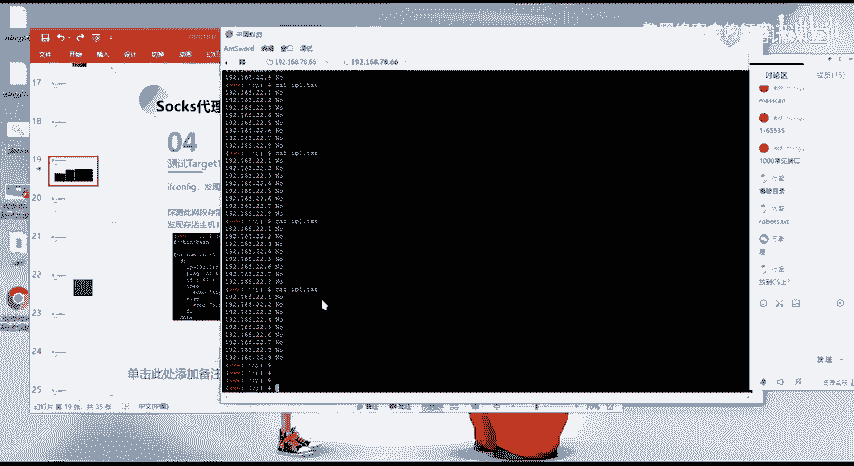

呃，有这样子的1个Mm的这样子的一个工具啊，那么。

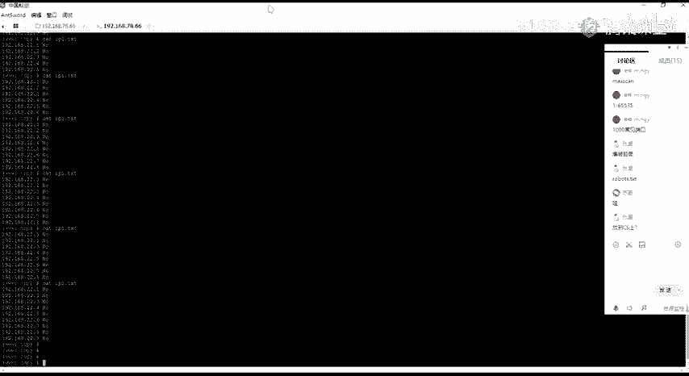

在这边当前的这个计算机这个机器的话是呃我们拿下的这个机器对吧？那么这个机器的话，它可能没有MF呢，对吧？它没有这样子的一个MF的一个工具。你可能会说你要去去进行个安装，对吧？然后你要去安装的话。

那么你你除非你直接得到了他的一个root权限。因为你要安装这种程序的话，你是需要去进有一个root权限，你才能够去进个安装的对吧？所以的话在这边。呃，会有这样子的一个问题，对吧？

我们想要去进一步做进一步的一个操作的话，我们会因为这样子的，我们这边得到了这一个需尔的话，它的一个操作以及功能的话，它是有限的是吧？所以的话我们会想到说把我们这边的一个需要去做一个反谈。

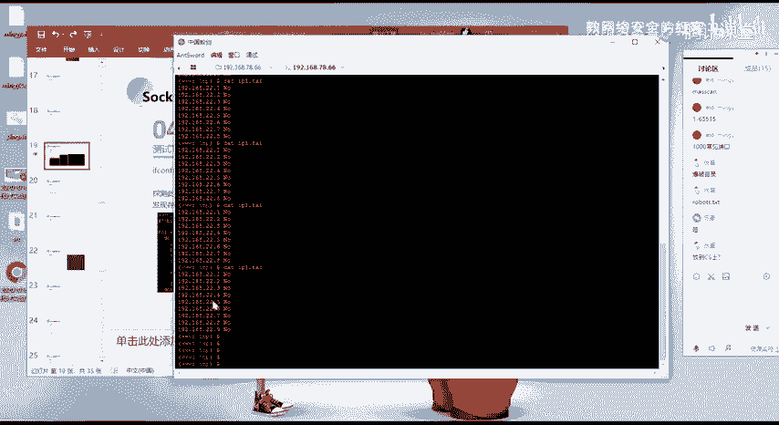