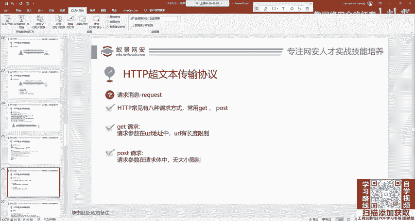
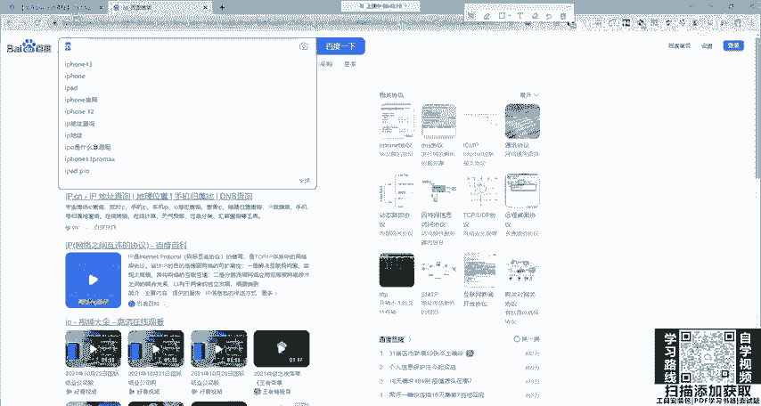
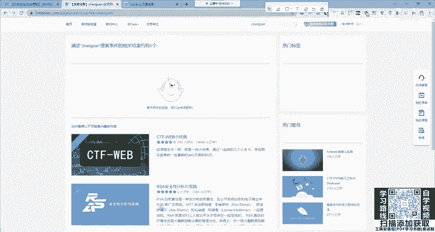
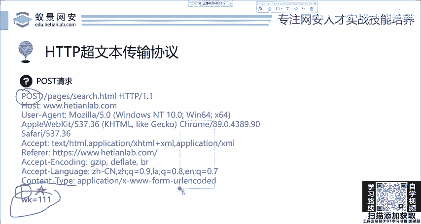
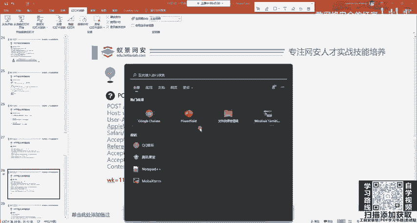
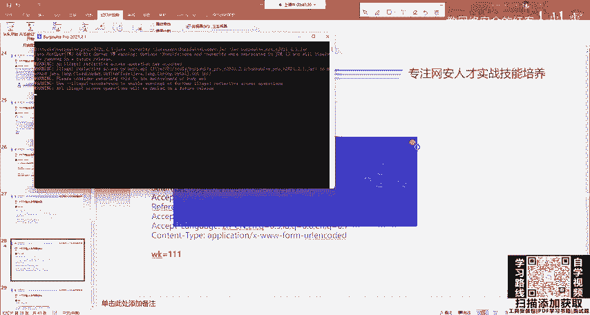
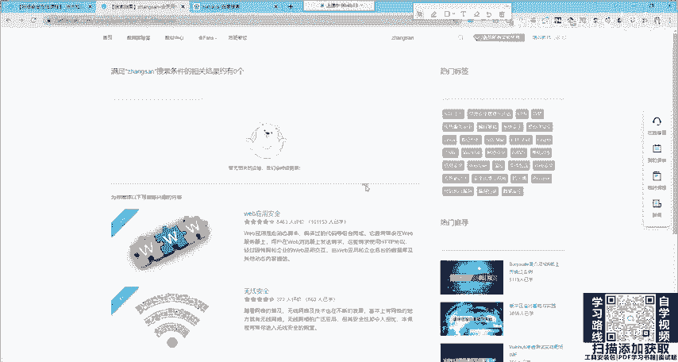
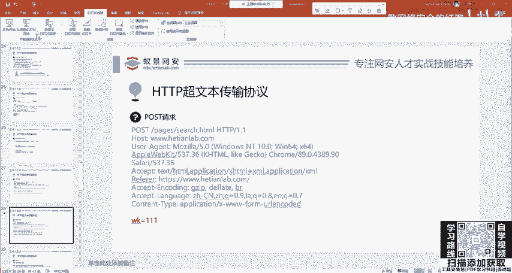
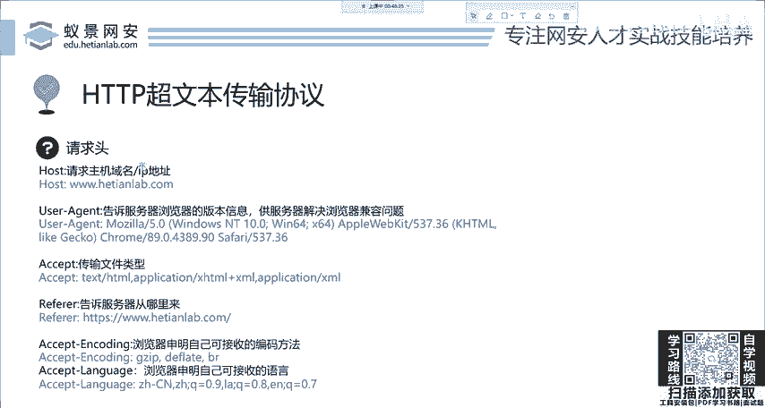
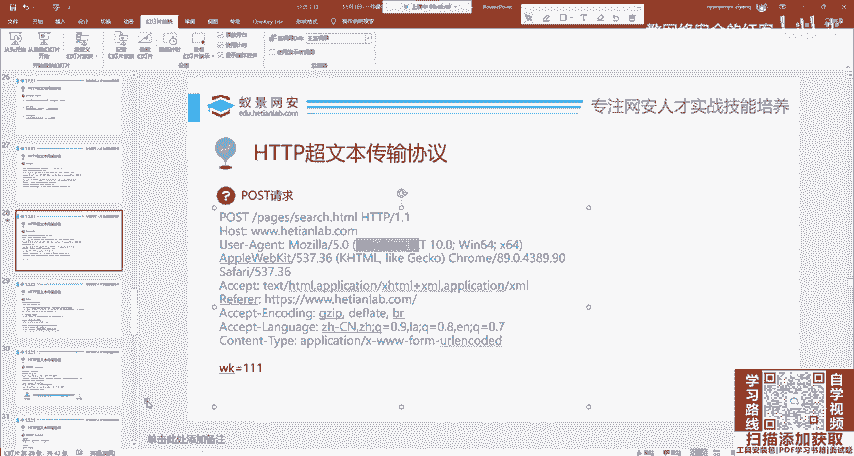

# 2024网络安全系统教程！清华大佬花159小时讲完的网络安全系统课！别再盲目自学了，学完即可就业！零基础入门网络安全！（渗透测试／漏洞挖掘／CTF／黑客技术） - P6：6.HTTP基础-请求消息.mp4 - 教网络安全的红客 - BV1ft421A7Nj

我们一会儿呢回来再讲。这几个概念大家呃清楚一下，那本节课呢其实还是非常简单的呀。OK那我们现在就分别来看一下这个浏览器到底搞了什么鬼，他给这个服务器发送了什么这个请求消息我们是能够看懂的。

首先我们来看一下这个请求消息。这个请求消息呢，比如说我们访问可厅网安实验室里面的一个网页。那这个网页呢它就会发送这个request，大家可以简单看一下。就这个东西。你现在看不懂是吧，你看不懂没关系。

我们服务器能看懂，他能看懂就行。那你呢作为安全工程师，你也要能看懂。那没关系，我们一会儿呢告诉你怎么去看。好，这个请求消息我们下面呢来分布讲一下。首先大家看这一堆，哎，我们来分布讲一下，看好。

首先它有几个东西，第一行叫做请求行。这个请求行呢是规定了这个请求的一个方式，请求的地址以及协议的版本。我们来看请求方式get啊，就get是一个请求方式。如果你完全不懂，没听说过。没关系。

我们下面一讲就懂啊，请求的URIURI是什么统一资源标定位符。就是你要访问哪儿？我想访问和天网含实验室太。这样一个页面，就我想访问哪个页面，就告诉你然后协议版本HTTP协议1。1版本，1。1版本。

然后后面从第二行开始，一直到最后，我们叫它叫做请求头。请牛头是什么意思呢？啊，这是个头嘛，就是你告诉你是谁，就我看到你的头，看到你的脸，我就知道你是谁了。就像这个服务器也是我看你的头啊。

我就知道你是从哪儿来，你是手机访问的还是电脑访问的？你是谷歌浏览器访问的还是火狐浏览器访问的？你支持中文还是英语还是日语啊，就是这些啊请求头，就是标识我们自己是处于一个什么样的情况啊，就是请洁头。

然后下面呢大家看就没了，其实有两个东西啊，有两个东西，不过它是空的。记住它是空，你不能觉得它没有在计算机中啊，空跟没有，那是不一样的东西。他空就是空啊，空。你看在计算机，就像你学C语语言，这空呃。

是不是包括te fail，是不是都是一个呃什么？变量是吧？它都是一个逻辑啊，OK也就是说呢这个空它并不是没有啊。首先呢叫请求空行，就请求空行，什么意思？就是一行空白的，然后就请求体，请求体也是空的。

就是没有，它就是个空的啊。OK那这是请求消息。我们下面这个请求头，我放在后面啊，还会再讲，还会再讲。下面我们来看先看第一点就是请求方式。那请求方式呢在HTTP1。1中常见是有8种请求方式。

但大家不要说啊，你常见几种都行。有的有的人说啊常见4种，有的人说常见7种，有8种有9种，无所谓，这是常见的，因为HTTP1。1，它官方规定的请求方式有很多十几个呢，一基本都用不到。那也不会用。

所以说我们常见的有8种，那更常用的就是涵盖了99%以上的一个请求都是两个方式，一个叫get一个叫pos，就这两种。首先我们来看get请求。get请求呢叫请求参数，在URL中。这什么意思？

URL这个URL地址就是你的网址。我现在给你讲一下，百度的搜索就是一个。

就是一个get请求，那搜索叫什么叫请求参数，在网址中在URL中。我给大家看一下，我现在请求参数是IP它在网址中在吗？你找一下找一下。

在在这个地方，大家看，我现在改它，我改一下，我改成哈哈哈。😊，大家看你看搜索出来的是不是就是哈哈哈。😊，所以说呢这个请求的参数它在这个地方呢，看到没？在这个地方呢。哎，这个就是get请求，非常的好辨识。

同样我们在这样一个请求消息中也能够清楚的看到它的请求方式是get。那么后面呢来继续来讲这个pos的吧，跟它就是区别了。你这个地方换成pos的。它就变成post。那post呢它有一个区别。

就请求的参数在请求体中这个地方啊大家在面试的时候。特别是一个网工，经常会有人问你，这个get请求和po请求的区别有哪些？第一个区别我已经讲出来了，就是请求参数在URL中。

一个是在请求题中URL中没有显示啊，这是一个区别，区别还有很多。我们后面呢再讲到了再给大家总结。首先是get请求。get请求这个我已经讲过了。还是以我们核电网安实验室来举例。比如说我在这里搜索啊123。

我搜一下，大家看这上面是不是有123在这上面吧，你搜张三，他出来的就是张三，就张三的一个搜索结果，这个非常好理解。那po一般用在哪里呢？我们来看他请求消息的变化。因为你现在是想搞安全。

你就肯定要看懂你要像服务器一样，非常精明和看懂它。

现在来看它的变化。什么变化。ge请求这个参数是不是放在这儿了，放在网址的后面一个问号，哎，加上这样一个兼值对，就是名字，还有它的值兼职对。那pos请求呢，他是跑下来了。跑到下面是吧，跑到哪个地方了。

他跑到了这个请求体这个地方。但记住这个请求空行，你看。那这个地方还有个空行呢，你千万不要丢了它。如果你说我这个地方敲一个退格键把它给去掉了，那这个东西就没了，它就发不出去。这个请求空行一定要保留。

这是第一个区别。大家看好，第二个区别是哪里？是get变成pos的了，是吧？get变成pos了，这个地方字母发生了变化。那有同学说啊，就这两个区别。这是经常在一开始学习晚安的同学中最经常犯的错误。

他这个网站他打不穿，他就说这不行。并不是，而是你可能改这个请求包的时候给整错了。我们来看啊，除了这两个变化之外，你仔细看这个PPT还有个变化在哪里？哎，多了一个东西，多了啥，再来看一遍。

多了一个content type。就是在他头上，就在他脸上啊又贴了一个东西，贴了一个标签，这个标签叫content type。没有这个标签，你怎么写它post都不生效，懂了吧？

你嗯怎么去写post都不生效。那这个cont type意思是什么呢？代表我这请求的是个什么东西，我请求体重是个啥，就在后面是个啥？这个地方最常用的就是参数建制对。

叫做X3W form uRL encoded的，就这样一个最常用的，如果传的是其他的，比如说像图片，那你可能遇到的呢就是PNG在这里写或JPEG如果你传的是jason就是JSON。

你在这里看到的就application接SON啊，大家稍等一下，我接个电话，接个电话。好，O我们继续来讲啊，刚才接了一个电话。那这个地方就是标识了我们这样一个请求体，它代表了什么东西啊，就是这个意思。

我们下面再来看这个地方一定要注意啊，千万不要搞混。下面我们来看请求头中它包含了哪些内容，就这个请求头有哪些东西。那这个包怎么看呢？大家如果了解晚安的话。

应该都知道有一个web渗透的利器叫做bb suit，用它就能够看到。我可以给大家打开看一下。如果你现在不会使用这个工具，没有关系，我们后面呢也会有相关的公开课，可能会讲到啊，可能会讲到。

然后在这边呢，我们可以简单抓个包。

给大家看一下，比如说我这里访问这个地址。比如说访问这个地址。那在这边呢我们就能够看到他的一个请求。那大家看一下。这个有点卡呀，电脑有点卡。稍等一下。啊，这个电脑太卡了呀。这个没法搞啊。

我就不给大家看了吧，就是我这个地方就是截取出来的呀，是一模一样的。哎，看到的啊就是这样一个情况。

这个CPU占用很高呀，CPU占用很高。不知道电脑在做什么。

OK那我们接下来的再再来看。OK那个请求头，首先第一个叫hoshos就是你请求的域名请求的IP地址。

我们来看刚刚你就能看出来了，在这个地方是不是有个host，就你要访问谁，我要访问和天晚安实验室。那下面一个呢叫user agent。那这个意思呢就是涵盖了你当前访问的一个浏览器信息以及操作系统信息。

为什么要发送这个东西呢？就是在这个网站的后台，它都会有一些呃这样一个处理程序。比如说像你手机访问跟电脑访问，还有你ipad访问，同时打开同一个网站，你发现它显示的内容它不一样。

显示的这些图片也有可能不一样。那造成这个原因就是因为它获取了这个userag。那大家在手机浏览器中都有一个功能，叫做以电脑。网站去打开这样一个网页。那这个功能呢其实就是更改了它发送的usag。

改成了啊电脑版的，就不再用这个Iipad，不再用这个安卓去发送这个请求了，就改了这个地方。哎。

