# 2024网络安全系统教程！清华大佬花159小时讲完的网络安全系统课！别再盲目自学了，学完即可就业！零基础入门网络安全！（渗透测试／漏洞挖掘／CTF／黑客技术） - P70：57.反弹shell建立socks代理访问内网.mp4 - 教网络安全的红客 - BV1ft421A7Nj

也就是把我们这边的一个需要反弹到，比如说我们的一个在这边这位同学所说的1个CS以及MSF上面，对吧？然后的话我们在使用这样子的一些呃框架。因为这些框架的话，它里面集成了很多这样这样子的一些功能，对吧？

我们可以用它的这样子的一些功能来去进行一个呃更好的一个操作以及测试。

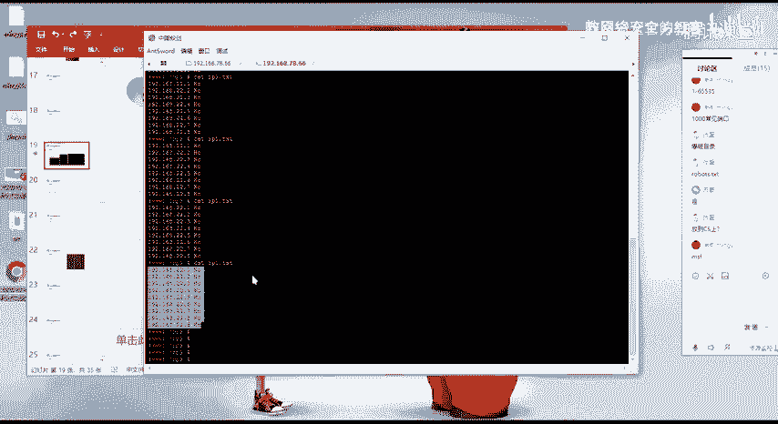

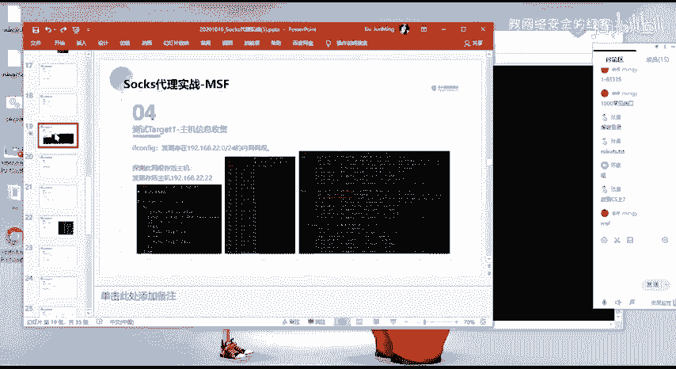

呃，以及的话就是说我们在这边呃。

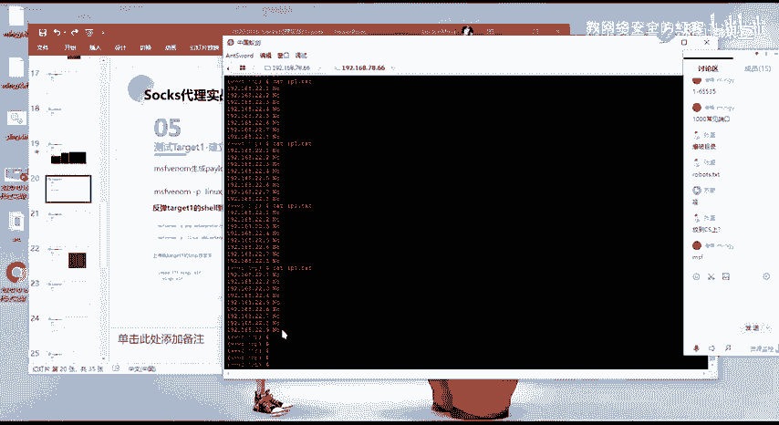

我们先反谈需要吧。

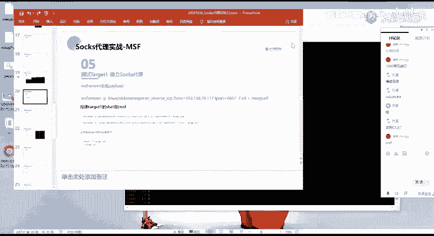

然后我这边的话，法拉西尔的话是采用的是这样子的一个方法，就是呃我通过生成一个这样子的一个呃通过MSFwinow生成这样子的一个呃可执行的一个文件。就linux下面的一个EF的一个可执性文件。

然后的话把它上传到我们的这边的一个目标机器上面去。好，呃，在这边的话。呃，生成的一个步骤的话，我这边我就不演示了。我这边已经呃已经有提前生成好了。就是。生成的一个哎。关灯。没有。

就是呃通过这样子的一个命令去进行一个生成。然后的话大家要注意啊，就是说我当前的话。我这边得到的这个机器啊，它是一个linux的一个机器啊啊，所以的话你要去生成的对应的一个可执行文件。

就不再是我们前面经常说到的1个EXE了啊吧？我们的1个EXE的话，它是windows下面的一个可执行程序。61一是。windows下了。对吧然呃在这边的话，我们需要去证明这样子的1个ERF的一个格式。

就是我们的在minux下的。搞这些。然呃要指定的就是这个杠F要指定的一个格式的话，就是这个EF。然后呃关于这边的一个L houseLport的一个配置的话，应该我不用我多说了，对吧？

然后生成了这样子的1个MIG点MIGY点EF的一个文件是吧？然后我们可以通过这个需要把它上传到我们的一个。

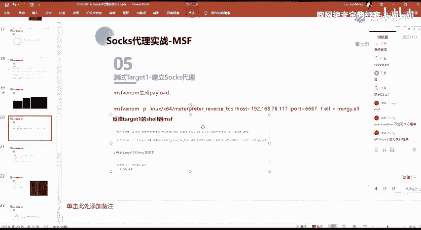

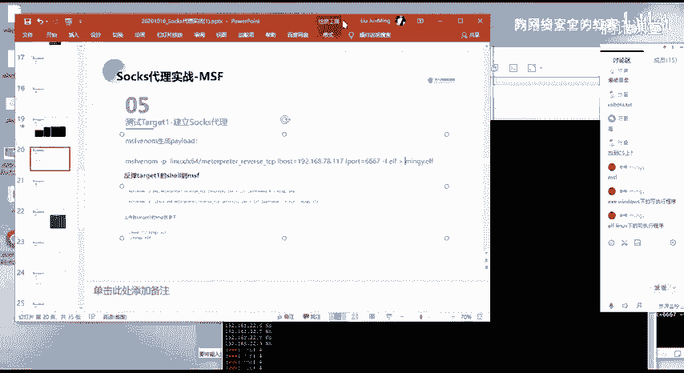

啊，某某一个目录下面去对吧？然后通常的话我们在linkux上面去上传我们的这种可执行文件，以及我们想要去执行相应的一个文件的话，我们通常的话会把它上传到这个t屏幕上面。就是说这一个t目录的话。

它是一个比较也是一个比较特殊的一个目录。

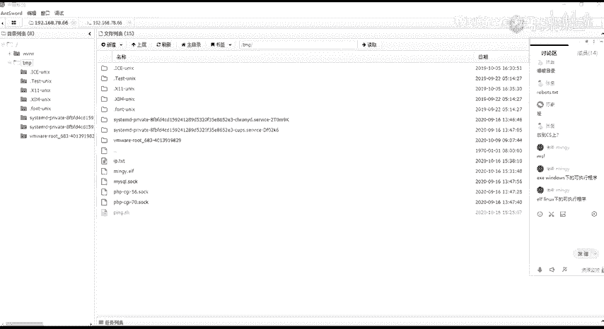

就呃这个tamp目录的话，我们的一个linux的一个程序的话啊，在我们的linux系统上面的话，我们可以去查看一下。我们可以来查看一下这个探盘目录它的一个权限。我们可以看到这个探盘目录，它的一个权限。

它默认的话就是一个呃777的一个权限，对吧？RWSRW。喂。

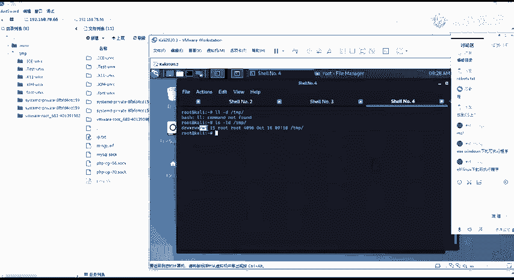

这个T是什么权限来着？是那个。是维吗？说那个张志伟呀。没是。呃，这个STK这个标志呃，这边的话。就是这一个这一位啊，就是可以理解为就是为防删除位。也就是说这一个的话这一个。诶，不能被删除吧。

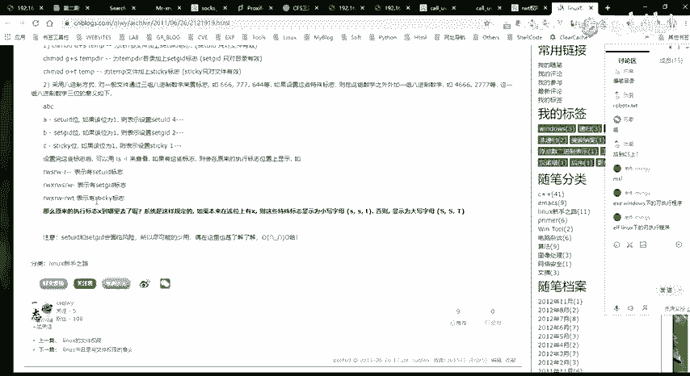

呃，也就是呃在这边对吧，我们给了这样子的一个RW7的这样子的一个权限，对吧？就这边的一个普通用户啊，就普通用户的话，他有了这样子的一个T的一个权限是吧？然后在这一个目录里面的话。

就是我们不能够去对他的一个这种呃就是防止他被删除。大家看这里吗。就这个目录下面的这样子的一个文件，就能够去添加文件，但是不能够去删除文件。然后我们可以。必须到这一个。这边按的任的权限。

然后我们在这边的话呃。通过在这一个目录下面去上传我们自己的，我们这边生成的这个可视性程序，也就是这个MNGY点1F这个文件是吧？然后我们上传上去，上传上去之后的话，我们再通过这个需。

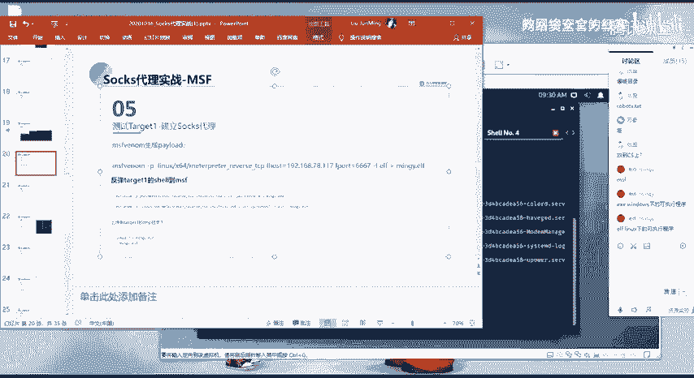

还进行一个执行。然后在这边的话，执行的话，大家要注意的话。大家一定要注意啊，就是你这边你去上传这个文件的话，因为我们这个文件话是一个可执行的一个程序，对吧？所以的话你上传之后的话。

它的一个默认权限它是没有执行权限的。然后的话我们需要去进行对他做一个添加。当然的话我这边的话是已经有了，就已我已经添加了，就是我们需要通过去mo的对吧？给他一个就是给他一个X的一个权限。

然后的话我们再去通过这样子的一个通过去进行一个执行MNGY点EF。但然的话我这边已经有执行过了。我们可以通过。这样子一个命令来查看，我这边的话。呃。这里啊我这边的话已经有执行过了，就这边的话执行执行了。

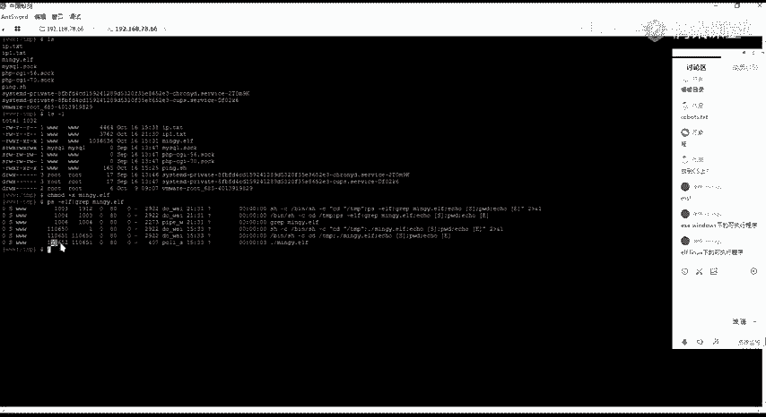

这边把它断掉吧，断掉。重新执行一下。没啊。现的话已经断掉断掉了。啊，我们在这边。我们需要在我们那个呃机器上面去做这样子的一个。今天。对吧，因为我们需要执行之后的话。

能够去访他一个c给我给到我们的1个MSF。然后在这边的话呃，我们使用。这个mch handle这一个监听器。这边的话是1个6667的1个。端口。啊呃，我的1个IP的话是这个。好。

我们需要首先需要去设置一个pen load的呀。设是完配漏斗之后的话，我们。我这边的话已经设置好了呀，这个的话是我之前已经设置的。就是你需要去设置你的后加port嘛，跟这边去对应然的话我们需要去。

建立一个卷。我再让他把它放到后台。然后执行一个jobs。对啊，就是这个。然后我们这边今天今天之后的话，我们。就通过这边的这个渲。当前的话已经没有了，我这边的话咨行这一个。我们的一个。木马文件是吧？好。

我这边执行之后的话，在这边的话，你就能够去得到这样子的一个。m class的一个session，就是这一个session5。对啊。好，我们可以看一下。🤧嗯。对吧。也就是呃。我们通过生成这样子的一个配漏。

生成这样子的一个link下面的一个可执性程序。然后的话把我们的一个这一个跳板机的这一个shift把它给呃。转到我们的1个MSF机器上面去，对吧？然后呃转到MSSF机上面去之后的话。

我们就需要去建立一个s代理。好，在这边，我们为什么要去建立一个说词代理呢？嗯。

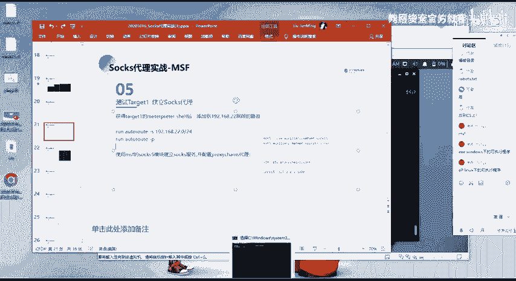

在这边的话我们来看一下对吧？当前的话，我这边的话是得到了这个78。6的这个外网机器的一个线，对吧？然后我我们通过前面的一些操作，对吧？我们知道我这个机器的话，它是能够去访问22的这个网络的1个IP对吧？

那么我们。要去访问这个2这个I网段的1个IP的话，我们只能是通过这个机器去进行一个访问，对吧？但是我们在这边的话，就是说我们想要从比如说我们想要从我当前的这一个windows机器上面。

要能够去访问这个二网段。那么。我们该怎么去做呢？就是说比如说我想要在我window17上面用MF对吧？或者说用呃其他的一些工具来去呃，或者说用浏览器对吧？来去访问这个22网段下面的某一个wordb服务。

对吧？

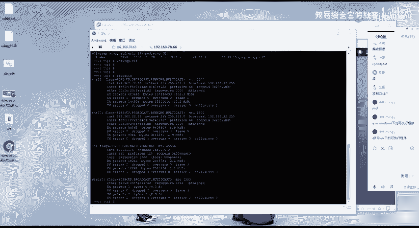

那么我们需要去怎么做呢？也就是用到我们今天这边所要去。我给大家介绍的这样子的一个s代。就我们需要去建立这样子一个s style。然后的话具体的一个操作的话就是这样子。

首先我们这边已经得到了这个m pad的一个sha，对吧？然后我们需要去使添加一个路由。添加路由的话，我们需要使用到这一个run out route这一个命令。

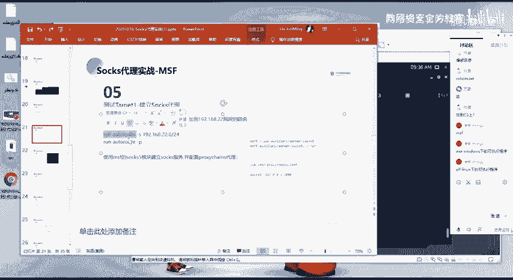

注意的话，大家注意是在这个met下面去进行一个执行。然后干S。指定我们想要去添加路由的这样一个网段。因为我们当前的话，我们是想要去访问这个二这个网段，对吧？所以的话我们需要去添加一个路由去。

到这个二这个网段的一个机器。干P的话，我们能够去查看，就是说这边建立的这样子的一个路由。啊，呃在这边的话，大家可能会有疑问，就是说我为什么要去建立这样子一个路由呢？大呃有有没有同学知道。

就是说我这边我要去呃。就比如说我这边的这个MSF的这个机器，对吧？我这边的这个MSF机器的话，我是无法去访问到呃，我除非是在这个mateprint这个需下面才能够去访问到这个啊这个网站的一个机器，对吧？

那么我在当前的这个。呃，单前的这个机器下面的话，我是无法去直接访问到这个。比如说。这1个2。2这个机器的对吧？就ho and reachachable，也就是访问不到是吧？然后的话。

然后的话我们在这边的话是在这个matetter press下面是能够去访问到这个网站的，是吧？那么我们。呃。这个怎么跟大家说呢？就是大家知道呃，大家。学学过网络吧，对吧嗯，学过网络吗？

应该知道就是说我们就比如说我们的一个呃我们的这一个公司的一个网络，对吧？我们公司的一个网络的话，我们通常会去或者说你家里的一个网络，对吧？你想要去通过你的一个。呃，你想要让你的一个手机。

你的一个电脑能够去访问到外网，对吧？我们通常会需要有一台路由器。是吧。就是需要一个root，需要一个路由器。然后这一个路由器的话是它是我们可以通过这个路由器来去访问外网，对吧？然后路由器的一个功能的话。

大家知道吗？就是说路由器当中它会有这样子的一个路由表。就是有一个路由表，然后这个路由表的话就记录着就是我们的一个呃。呃，IP。Yeah。然后的话我们呃就是不同网关。嗯。就说我们不同的一个网站。

比如说我的1个一的一个网站，我要去访问1个22的一个网站，对吧？那么这个网站的话，我们。呃，因为它是在不同的一个网段，对吧？然后的话他要想实现这两个网段之间的一个访问的话，我们需要有这样子的一个路由。

就是要告诉这个一网段的这个机器如何去访问到2这个网段，对吧？然后在路由器当中的话，就会有这样子的一个表，就是告诉当我们的一个一这个网段。去访问去访问2。2这个网段的一个机器的话。

那么他就会去路由表当中去找到如何去访问到这个二网段的，如呃去找到这个二网段的这个IP对吧？对IP load。然后的话就是就是找到吓一跳嘛，对吧？然后的话我们在这边其实也是一样的对吧？

我当前的话是这一个我当前这个MSF的这个机器的话，是这一个这一个网站，对吧？然后这个网站的话，他是能够去访问这里的这个呃。就我们这边得到这个需尔的这个IP对吧？但是他是无法去直接访问到这个2这个网上的。

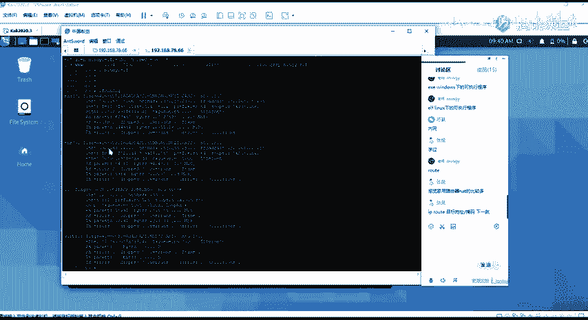

啊，然后在这边我们这一这边得到这个mat这一个筛选的话，它是能够去访问到这一个，也就是能够去访问到这个二网站的对吧？那么我们是否能够去做一个这样子的，就是说通过这一个mat这一个筛选，把我们。

把我们从这边的这个网段的一个流量。把他给就是说呃，不是，就是说我从这边对吧？我从这边我去聘这个192。168。2。2这个机器，对吧？我这边我去聘的话，对吧？我是否。

就是我如果要去实现这样子的1个78这1个网站去访问这1个二这个网站的话，我们需要去告诉这边。高速这边。如何去找到这个这个IP对吧？然后在这边的话，我们可以通过这个筛选5这个进年的这个绘画，也就是。

也就是我们在这边通过添加这样子的一个路由。然后的话通过这个筛选5的这个绘画来去访问这个2这个网段。然后呃在。这边添加完路由之后的话，我们还需要去做这样子的一个配置。啊，对。对，就是就是这个意思。

其实呃在这边的话，就是这1个3选5的话，就是网关。就我们可以看在这边看到，就是涉嫌5的话就是网关。也就是说我们在这边对吧？我们在这边。78的话要去访问这个2的话。

我们可以通过这边的这这个筛选5这个网关来去找到这边的1个2的这个。呃，2这个网站下面对应的这个IP对吧？然后呃在这边添加完路由之后的话，我们还需要去建立这样子的一个说的一个服务。因为我们在这边的话。

我们在这边的话是通过MSF对吧？通过MSF进来这个筛选才能够去呃访问到这边22。那么我们当前在这边。在这边的话是访问不到这个筛选5的对吧？所以的话我们在这边需要去建立这样子一个通道。

这个通道的话就是通过这样子的一个方法去进行一个建立。呃，我们需要去使用这样子的一个。也是。直接。使用这样子的一个就这个ss5的这样子的一个模块。然后的话我们去乱一下。呃，这个。好像已经有了。是，就这个。

然后我们乱执行之后的话，它在这边它就会有这样子的一个jobs。这个jobs的话就说明这一个shop5的一个服务的话已经启动了。然后它的一个s的一个服务的话，它是在这样子的一个呃今天在1080的一个端口。

我们其实可以在这边来去查看他的一个今天的一个状态。对吧这一个端口的话已经处于一个今天的一个状态。然后在这边我们的一个s代理服务呃，s的一个代理服务已经建立好之后的话。我们。

就可以通过这样子的一个 source死的一个通道来去访问这边的1个22的这一个网段和。这边这边的是1个2的一个网站。

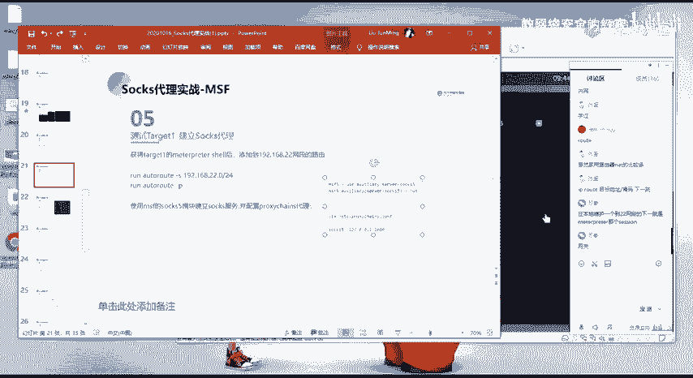

我们可以来尝试一下，因为我当前的话，这一个机器的话是一个。呃，19。168。78。117对吧？然后我当前当前的这个IP的话，其实跟它是一个网段的78。114。

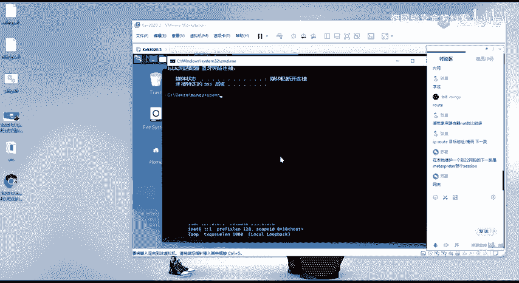

所以的话呃我在这边我要去访问这个二网站的话，其实就说呃先在这边先访问吧。我在这边我在这边通过这边的一个s的一个通道来去访问这个网站。我这边来测试一下，我们要去使用到的话，就是这个work chance。

嗯。通过这一个clo chance的这些工具，然后的话我通过CRL。来去尝试去反问一下这个。68。2。2。嗯。为了做一个对比，就我在这边。我在这边先不通过那个代理通道，对吧？

我这边直接去CR去访问这个IP的1个8年的一个端口。你会发现他这边的话他是说。无法去连接到这一个搬险窗口。然后还有这边就是有一个。No road to host。也就是说他在这边他是没有路由器。

访问到这个22这个IP的。唉，也就是说在当前的这个主机，它是呃不知道就是找不到如何去到这个2这个网站的1个IP的。然后我们在这边的话，就通过这边的一个收死的一个通道。我这边。可以看到直接出现一个访问。

就通过这个prose change来CL这一个。这个IP对吧？原本的话它是无法去访问的。我现在通过这个说通道的话，能够去直接的去访问到它的一个8联端口的一个页面，对吧？

这个的话是它的一个wordb服务的一个页面。好，呃，在这边的话，其实。我们通过这个代理通道去访问这个IP的话，它的一个流量的一个走向。大家知道吗？就是说他是如何去进行一个走的。

他为什么能够去呃访问到这边？就是说通过这个代理的一个通道。Okay。然后其实这边的话就是我们刚刚的这边的这两个步骤所。达到的一个效果就是通过这边。的一个配置，我这边的话大再给大家来捋一下。

就是说我这边去访问对吧？我这边访问的话，我通过这边的一个代理通道，然后我这边的一个代理通道的话，是这边的一个我本地在我本地的1个1080的一个端口，对吧？啊，也就是说我这边的1个HTP的一个请求。

它会通过这边的1个10801的的一个端口，也就是我这边进营的一个说索通道，把它给传递到了这边。因我这边的话是我这边的一个socks通道的话，是呃是在这边的1个MSF，对吧？

我这边建立的这一个ss通道的话。呃。就说我这边的这一个流量。他会通过我们的1个MSF。然后的话转到这边。因为我们这边的是我们在这边的1个MSF当中的话，已经添加了这样子一个路由，对吧？

就是说他把他去请求这个2这一个网段呃2。2这个IP他的这个请求，他会通过这边的一个通道，也就是108年的个端口，它会转到这边MSF，转到这边MSF之后的话。

他会去寻找这一个如何去访问这个2这个网段的这个IP对吧？然后在这边的话，我们添加了这样子一个路由，也就是我们通过这个筛群5，因为我们的这个筛群5的这个绘画的话，它是能够去访问到这个2这个网段的，对吧？

以及我们在这边添加了这样子的一个路由来去。呃，就是说当他请求到这个2这个IP的时候，他会去通过这边的这个网关来去找到这边的这个IP以及他对应的一个服务，也就是呃实现了。

通过这边的一个说死的一个代理通道来去访问原本我们访问不到的这样子的一个网站。以及我们在这边的话，其实。因为我这边的话跟这边是同一个网段，所以的话我可以通过这样子的一个方法。

就是我这边设置一个这样子的一个代码。呃。就这个78。117，然后代理装头它是1080。然后选择一个协议的话是s5的一个协议。然后我这边的话选择这个对吧？呃，我另外再开一下浏览器。

我这边的话是没有走代理的对吧？我直接去访问的话，是肯定访问不到的。对，访问不到这个IP了。然后我在这边的话，通过这个代理。然后的话可以看到这边话就直接的能够去访问到这边的这1个2。IP2。

2这1个IP的这样子的一个wordb服务，对吧？

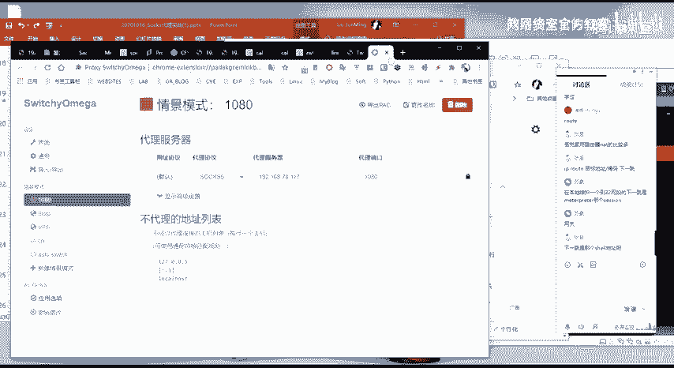

所以的话是这边的话是走的这一个代念，其实就是走的我们这边的这一个。

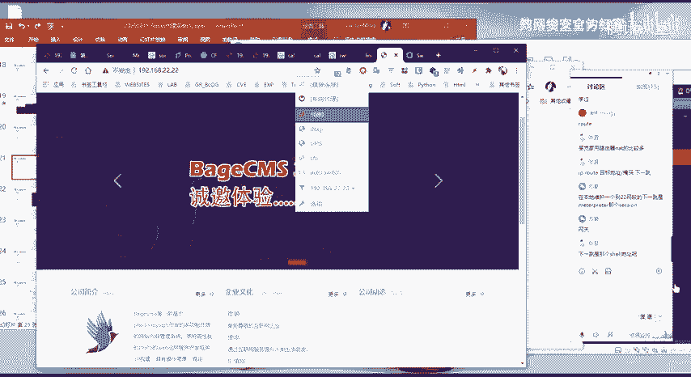

呃，这边MSF所经历的这样子的一个收死的一个代理服务器啊。这边的话大家能理解吗？呃，对，下一跳呃，就是你也可以这样理解嘛，就是下一跳嘛，就是其实就是添加路由的话，就是就是寻就是告诉你的这个呃。

告诉你要请求的这个IP往哪里走嘛，就是对吧？下一跳的话就是呃就是告诉你呃，你的下一跳的话，是这1个22。22嘛，对吧？也就是呃那个筛选5嘛。就是他是通过那个网关，也就是我们的那个S5来去找到那个2。

2那个网段，对吧？所以的话我们需要去我们如果说要去通过那个筛选5来去访问到这个2这个网端的话，那么我们需要去添加一个路由。也就是告诉呃MSF你要你要去访问那这个网站的话，你就需要去呃通过这个筛选。

咱能会去访问的。呃，这边的话就是呃通过MSF经立了这样子的一个source词的一个概念。然后的话我们通过这个source词代理来去访问到了这边的一个内网的这一个网段，对吧？

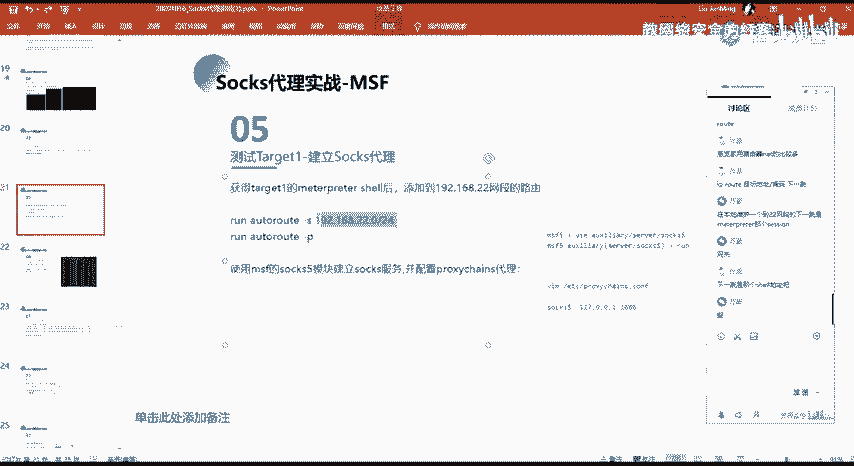