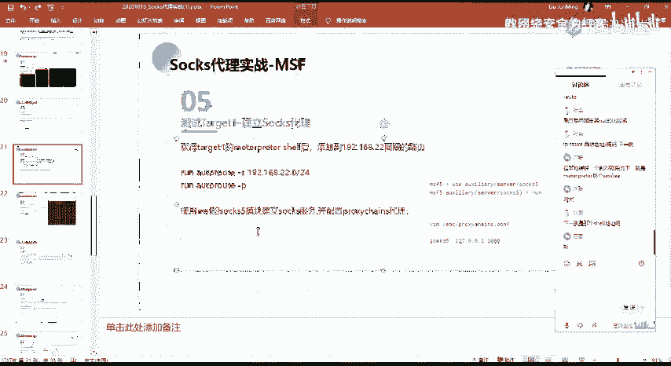
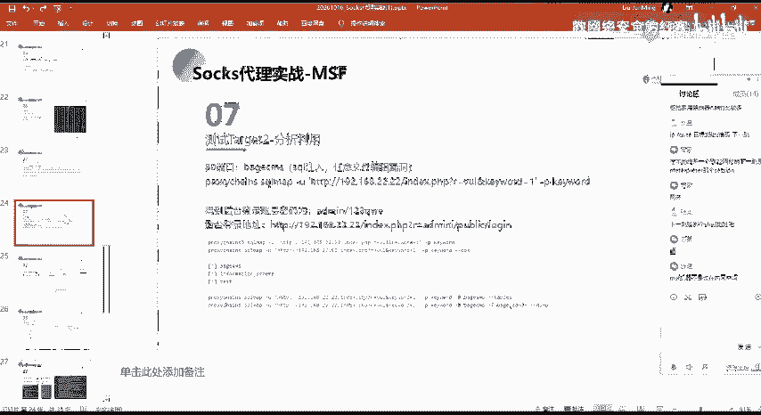

# 2024网络安全系统教程！清华大佬花159小时讲完的网络安全系统课！别再盲目自学了，学完即可就业！零基础入门网络安全！（渗透测试／漏洞挖掘／CTF／黑客技术） - P71：58.内网信息收集.mp4 - 教网络安全的红客 - BV1ft421A7Nj

其实这边的话就已经实现了这样子的一个内网的一个穿透。我们在这边我们在这边的话就能够去通过呃。这样子一个代理服务器去访问那一个内网的一个网段。然后我们已经呃能够去访问到这个网段的话，那么我们就需要去。

做下一步就对它做一个信息的一个收集。就这边的话其实又回到了我们前面的相应的一个操作啊，就对它做一个信息收集。我们可以使用MF，对它做一个端口的一个扫描。呃，在这边的话，你做端口扫描的话。

像你在看你那边的话，你可以直接通过这样子的一个clo change，对吧？还去做一个扫描。这直接粘贴吧。然呃，在这边的话。我就不少我不少了，不停了。然后这边方我们看一下。

看前面主要的话在这边的话呃命令上应该不用我说了，就是通过TCP的一个方式去行一个扫描，然后一定要注意。呃，大家一定要注意，就是在去进行一个双词代理的时候，一定要注意，就是像MF这种工具，对吧？

你需要去给他加一个杠PN。干PN是什么意思呢？也就是禁止去进行一个聘的一个扫描。就是因为我们前面已经说了是吧？就我们的一个聘的一个扫描的话，它是无法去通过我们的一个呃说死的一个代理通道。

也就是它无法去代理这样子的一个pin的这种SMP的这这样子的一个流量。所以的话如果说你不去禁止掉的话，它会有这样子的一个拼的一个扫描的话，它会就是它会有错误，对吧？以及我们的这样子一个流量也过不去。嗯。

就影响我们的这样子的一个扫描。然后呃这边的话就是。高去干对吧？呃，就我们前面所说的这种，我就不多说了。然后呃在这的话我们主要看一下，就是这边。他的一个扫描的一个结果。首先像比如说在这边的话。呃。

大家看到这这种的话，就首先第一个在这边的话，它是走的这样子的一个代理通道，对吧？他这边的话应该比较形象。通过这边的我们本地是1个1080的这一个端口。然后就把我们的这边的这种请求的一个流量，对吧？

把它发送到这一个端口上面，也就是呃通过了那个说索的一个通道，对吧？然后的话把它传到了我们这边的这一个。呃，IP的这一个指定的一个端口，对吧？其实这边的话就是把我们MF的这种探测端口的一个流量。

通过这边的一个收时的一个通道，把它给转到了这边指定的这个IP的一个端口上面去，对吧？然后的话对他去做一个探测。但是的话这种time out的话就说明这边的这个端口的话，探测的话它是超时的。

也就是说它可能是没有存在，也有可能是呃呃就是你没有扫到，对吧？然后的话就没有探测到了。然后的话像这种，比如说像这边8888888的这样子的一个端口，这边O的话就表示呃就表如说这边的一个端口的话。

它是存活的，也就是呃探测到还有22以及还有其他的80，对吧？这种21的这种端口。然后我们通过这样子一个方法的话，就能够去探测到这边的一个这个内网主机的2。2这个主机的一个存活的一个端口。开放的一个端口。

对吧？那么就同样的又回到了我们前面，对吧？就是针对这样子的一些端口做一个漏洞的一个分析利用，对吧？

